# 第 1 章　开始启程，你的第一行 Android 代码

欢迎你来到 Android 世界！Android 系统是目前世界上市场占有率最高的移动操作系统，不管你在哪里，都可以看到 Android 手机几乎无处不在。今天的 Android 世界可谓欣欣向荣，可是你知道它的过去是什么样的吗？我们一起来看一看它的发展史吧。

2003 年 10 月，Andy Rubin 等人一起创办了 Android 公司。2005 年 8 月，Google 公司收购了这家仅仅成立了 22 个月的公司，并让 Andy Rubin 继续负责 Android 项目。在经过了数年的研发之后，Google 终于在 2008 年推出了 Android 系统的第一个版本。但自那之后，Android 的发展就一直受到重重阻挠。乔布斯自始至终认为 Android 是一个抄袭 iPhone 的产品，里面剽窃了诸多 iPhone 的创意，并声称一定要毁掉 Android。而本身就是基于 Linux 开发的 Android 操作系统，在 2010 年被 Linux 团队从 Linux 内核主线中除名。由于 Android 中的应用程序一开始都是使用 Java 开发的，甲骨文公司针对 Android 侵犯 Java 知识产权一事对 Google 提起了诉讼……

可是，似乎再多的困难也阻挡不了 Android 快速前进的步伐。由于 Google 的开放政策，任何手机厂商和个人都能免费获取 Android 操作系统的源码，并且可以自由地使用和定制。三星、HTC、摩托罗拉、索爱等公司相继推出了各自系列的 Android 手机，Android 市场上百花齐放。仅仅在推出两年后，Android 就超过了已经霸占市场逾十年的诺基亚 Symbian，成为了全球第一大智能手机操作系统，并且每天还会有数百万台新的 Android 设备被激活。而近几年，国内的手机厂商也大放异彩，小米、华为、魅族等新兴品牌都推出了相当不错的 Android 手机，并且获得了市场的广泛认可，目前 Android 已经占据了全球智能手机操作系统 70% 以上的份额。

说了这些，想必你已经体会到 Android 系统炙手可热的程度，并且迫不及待地想要加入 Android 开发者的行列了吧。试想一下，10 个人中有 7 个人的手机可以运行你编写的应用程序，还有什么能比这个更诱人的呢？那么从今天起，我就带你踏上学习 Android 的旅途，一步步引导你成为一名出色的 Android 开发者。

好了，现在我们就来一起初窥一下 Android 世界吧。

## 1.1　了解全貌，Android 王国简介

Android 从面世以来到现在已经发布了 20 多个版本了。在这几年的发展过程中，Google 为 Android 王国建立了一个完整的生态系统。手机厂商、开发者、用户之间相互依存，共同推进着 Android 的蓬勃发展。开发者在其中扮演着不可或缺的角色，因为如果没有开发者来制作丰富的应用程序，那么不管多么优秀的操作系统，也是难以得到大众用户喜爱的，相信没有多少人能够忍受没有 QQ、微信的手机吧。而且，Google 推出的 Google Play 更是给开发者带来了大量的机遇，只要你能制作出优秀的产品，在 Google Play 上获得了用户的认可，你就完全可以得到不错的经济回报，从而成为一名独立开发者，甚至是成功创业！

那我们现在就从一个开发者的角度，去了解一下这个操作系统吧。纯理论型的东西会比较无聊，怕你看睡着了，因此我只挑重点介绍，这些东西跟你以后的开发工作都是息息相关的。

### 1.1.1　Android 系统架构

为了让你能够更好地理解 Android 系统是怎么工作的，我们先来看一下它的系统架构。Android 大致可以分为 4 层架构：Linux 内核层、系统运行库层、应用框架层和应用层。

1. **Linux 内核层**

   Android 系统是基于 Linux 内核的，这一层为 Android 设备的各种硬件提供了底层的驱动，如显示驱动、音频驱动、照相机驱动、蓝牙驱动、Wi-Fi 驱动、电源管理等。
2. **系统运行库层**

   这一层通过一些 C/C++ 库为 Android 系统提供了主要的特性支持。如 SQLite 库提供了数据库的支持，OpenGL\|ES 库提供了 3D 绘图的支持，Webkit 库提供了浏览器内核的支持等。

   在这一层还有 Android 运行时库，它主要提供了一些核心库，允许开发者使用 Java 语言来编写 Android 应用。另外，Android 运行时库中还包含了 Dalvik 虚拟机（5.0 系统之后改为 ART 运行环境），它使得每一个 Android 应用都能运行在独立的进程中，并且拥有一个自己的虚拟机实例。相较于 Java 虚拟机，Dalvik 和 ART 都是专门为移动设备定制的，它针对手机内存、CPU 性能有限等情况做了优化处理。
3. **应用框架层**

   这一层主要提供了构建应用程序时可能用到的各种 API，Android 自带的一些核心应用就是使用这些 API 完成的，开发者可以使用这些 API 来构建自己的应用程序。
4. **应用层**

   所有安装在手机上的应用程序都是属于这一层的，比如系统自带的联系人、短信等程序，或者是你从 Google Play 上下载的小游戏，当然还包括你自己开发的程序。

   结合图 1.1 你将会理解得更加深刻。

   

   **图 1.1　Android 系统架构（图片源自维基百科）**

### 1.1.2　Android 已发布的版本

2008 年 9 月，Google 正式发布了 Android 1.0 系统，这也是 Android 系统最早的版本。随后的几年，Google 以惊人的速度不断地更新 Android 系统，2.1、2.2、2.3 系统的推出使 Android 占据了大量的市场。2011 年 2 月，Google 发布了 Android 3.0 系统，这个系统版本是专门为平板计算机（简称“平板”）设计的，但也是 Android 为数不多的比较失败的版本，推出之后一直不见什么起色，市场份额也少得可怜。不过很快，在同年的 10 月，Google 又发布了 Android 4.0 系统，这个版本不再对手机和平板进行差异化区分，既可以应用在手机上，也可以应用在平板上。2014 年 Google 推出了号称史上版本改动最大的 Android 5.0 系统，使用 ART 运行环境替代了 Dalvik 虚拟机，大大提升了应用的运行速度，还提出了 Material Design 的概念来优化应用的界面设计。除此之外，还推出了 Android Wear、Android Auto、Android TV 系统，从而进军可穿戴设备、汽车、电视等全新领域。之后 Android 的更新速度更加迅速，每年都会发布一个新版本，到 2019 年 Android 已经发布到 10.0 系统了，这也是本书编写时最新的系统版本。

表 1.1 列出了目前主要的 Android 系统版本及其详细信息。当你看到这张表格时，数据可能已经发生了变化，查看最新的数据可以访问 [http://developer.android.google.cn/about/dashboards](http://developer.android.google.cn/about/dashboards)。

**表 1.1　Android 系统版本及其详细信息**

| 版本号             | 系统代号             | API | 市场占有率 |
| ------------------ | -------------------- | --- | --------- |
| 2.3.3 ~ 2.3.7      | Gingerbread          | 10  | 0.3%      |
| 4.0.3 ~ 4.0.4      | Ice Cream Sandwich   | 15  | 0.3%      |
| 4.1.x          | Jelly Bean           | 16  | 1.2%      |
| 4.2.x          |                      | 17  | 1.5%      |
| 4.3                |                      | 18  | 0.5%      |
| 4.4                | KitKat               | 19  | 6.9%      |
| 5.0                | Lollipop             | 21  | 3%        |
| 5.1                |                      | 22  | 11.5%     |
| 6.0                | Marshmallow          | 23  | 16.9%     |
| 7.0                | Nougat               | 24  | 11.4%     |
| 7.1                |                      | 25  | 7.8%      |
| 8.0                | Oreo                 | 26  | 12.9%     |
| 8.1                |                      | 27  | 15.4%     |
| 9                  | Pie                  | 28  | 10.4%     |

从表 1.1 中可以看出，目前 5.0 以上的系统已经占据了超过 85% 的 Android 市场份额，并且这个数字还会继续扩大，因此我们本书中开发的程序也只面向 5.0 以上的系统，更早的系统版本就不再去兼容了。

### 1.1.3　Android 应用开发特色

预告一下，你马上就要开始真正的 Android 开发旅程了。不过别着急，在开始之前我们先来一起看一看，Android 系统到底提供了哪些东西，可供我们开发出优秀的应用程序。

1. **四大组件**

   Android 系统四大组件分别是 Activity、Service、BroadcastReceiver 和 ContentProvider。其中 Activity 是所有 Android 应用程序的门面，凡是在应用中你看得到的东西，都是放在 Activity 中的。而 Service 就比较低调了，你无法看到它，但它会在后台默默地运行，即使用户退出了应用，Service 仍然是可以继续运行的。BroadcastReceiver 允许你的应用接收来自各处的广播消息，比如电话、短信等，当然，你的应用也可以向外发出广播消息。ContentProvider 则为应用程序之间共享数据提供了可能，比如你想要读取系统通讯录中的联系人，就需要通过 ContentProvider 来实现。
2. **丰富的系统控件**

   Android 系统为开发者提供了丰富的系统控件，使得我们可以很轻松地编写出漂亮的界面。当然如果你品位比较高，不满足于系统自带的控件效果，完全可以定制属于自己的控件。
3. **SQLite 数据库**

   Android 系统还自带了这种轻量级、运算速度极快的嵌入式关系型数据库。它不仅支持标准的 SQL 语法，还可以通过 Android 封装好的 API 进行操作，让存储和读取数据变得非常方便。
4. **强大的多媒体**

   Android 系统还提供了丰富的多媒体服务，如音乐、视频、录音、拍照等，这一切你都可以在程序中通过代码进行控制，让你的应用变得更加丰富多彩。

   既然有 Android 这样出色的系统给我们提供了这么丰富的工具，你还用担心做不出优秀的应用吗？好了，纯理论的东西就介绍到这里，我知道你已经迫不及待地想要开始真正的开发之旅了，那我们就启程吧！

## 1.2　手把手带你搭建开发环境

俗话说得好，“工欲善其事，必先利其器”，开着记事本就想去开发 Android 程序显然不是明智之举，选择一个好的 IDE 可以极大地提高你的开发效率，因此本节我就手把手地带着你把开发环境搭建起来。

### 1.2.1　准备所需要的工具

开发 Android 程序需要准备的工具主要有以下 3 个。

- **JDK**。JDK 是 Java 语言的软件开发工具包，它包含了 Java 的运行环境、工具集合、基础类库等内容。
- **Android SDK**。Android SDK 是 Google 提供的 Android 开发工具包，在开发 Android 程序时，我们需要通过引入该工具包来使用 Android 相关的 API。
- **Android Studio**。在很早之前，Android 项目都是使用 Eclipse 来开发的，相信所有 Java 开发者都一定会对这个工具非常熟悉，它是 Java 开发神器，安装 ADT 插件后就可以用来开发 Android 程序了。而在 2013 年，Google 推出了一款官方的 IDE 工具 Android Studio，由于不再是以插件的形式存在，Android Studio 在开发 Android 程序方面要远比 Eclipse 强大和方便得多，因此本书中所有的代码都将在 Android Studio 上进行开发。

### 1.2.2　搭建开发环境

当然，上述软件并不需要一个个地下载，为了简化搭建开发环境的过程，Google 将所有需要用到的工具都帮我们集成好了，到 Android 官网就可以下载最新的开发工具，下载地址是：[https://developer.android.google.cn/studio](https://developer.android.google.cn/studio)。不过，Android 官网有时访问会不太稳定，如果你无法访问上述网址，也可以到一些国内的代理站点进行下载，比如：[http://www.android-studio.org](http://www.android-studio.org)。

你下载下来的将是一个安装包，安装的过程也很简单，基本上一直点击“Next”就可以了。其中在安装的过程中有可能会弹出如图 1.2 所示的对话框。

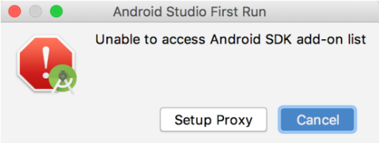

**图 1.2　无法访问 add-on list 的警告对话框**

这个对话框是在询问我们，无法访问 Android SDK 的 add-on list，是否要配置代理。由于我们使用的网络访问 Google 的一些服务是受到限制的，因此才会弹出这样一个对话框。不过这并不影响我们接下来的环境搭建，因此直接点击“Cancel”就可以了。

之后一直点击“Next”，直到完成安装，然后启动 Android Studio。首次启动会让你选择是否导入之前 Android Studio 版本的配置，由于这是我们首次安装，选择不导入即可，如图 1.3 所示。

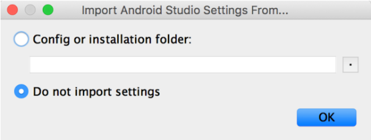

**图 1.3　选择不导入配置**

点击“OK”按钮会进入 Android Studio 的配置界面，如图 1.4 所示。

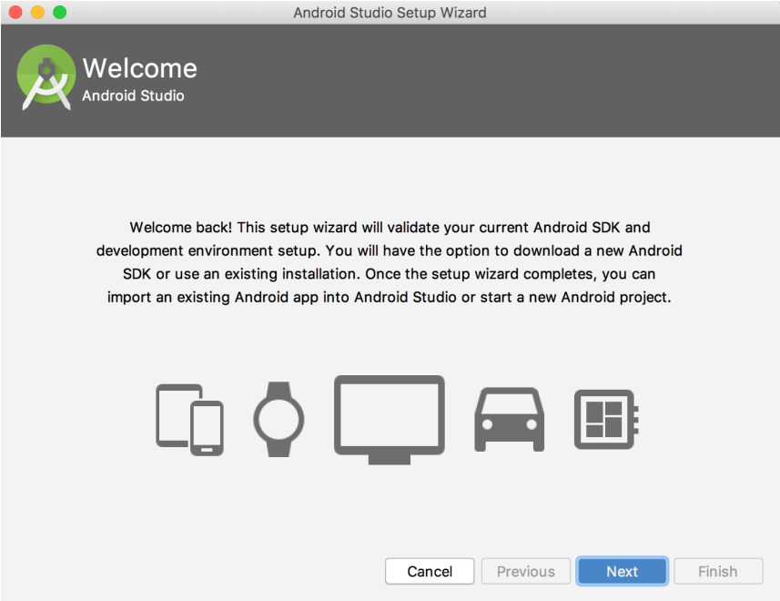

**图 1.4　Android Studio 的配置界面**

然后点击“Next”开始进行具体的配置，如图 1.5 所示。

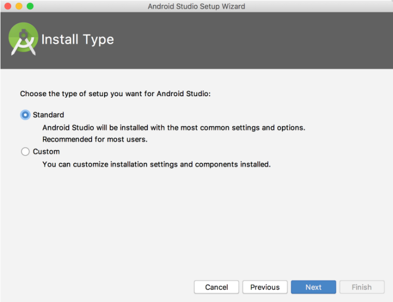

**图 1.5　选择安装类型**

这里我们可以选择 Android Studio 的安装类型，有 Standard 和 Custom 两种。Standard 表示一切都使用默认的配置，比较方便；Custom 则可以根据用户的特殊需求进行自定义。简单起见，这里我们就选择 Standard 类型了。继续点击“Next”会让你选择 Android Studio 的主题风格，如图 1.6 所示。

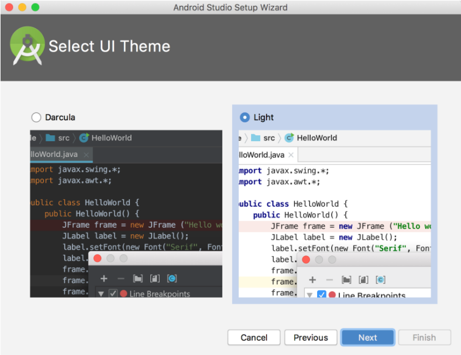

**图 1.6　选择 Android Studio 的主题风格**

Android Studio 内置了深色和浅色两种风格的主题，你可以根据自己的喜好选择。这里我就选择默认的浅色主题了，继续点击“Next”完成配置工作，如图 1.7 所示。

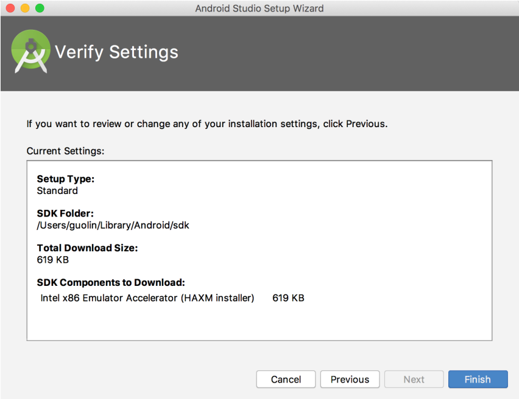

**图 1.7　完成 Android Studio 配置**

现在点击“Finish”按钮，配置工作就全部完成了。然后 Android Studio 会尝试联网下载一些更新，等待更新完成后再点击“Finish”按钮，就会进入 Android Studio 的欢迎界面，如图 1.8 所示。

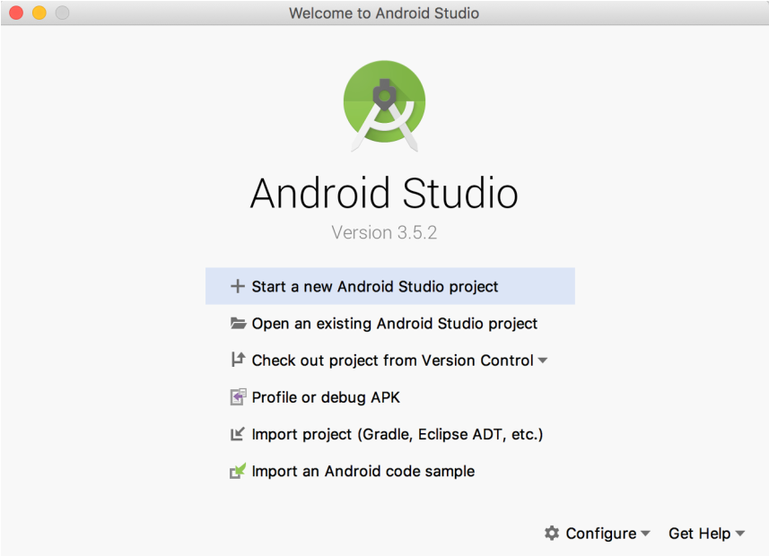

**图 1.8　Android Studio 的欢迎界面**

目前为止，Android 开发环境就已经全部搭建完成了。那现在应该做什么呢？当然是写下你的第一行 Android 代码了，让我们快点开始吧。

## 1.3　创建你的第一个 Android 项目

任何一个编程语言写出的第一个程序毫无疑问都是 Hello World，这是自 20 世纪 70 年代流传下来的传统，在编程界已成为永恒的经典，那我们当然也不会搞例外了。

### 1.3.1　创建 HelloWorld 项目

在 Android Studio 的欢迎界面点击“Start a new Android Studio project”，会打开一个让你选择项目类型的界面，如图 1.9 所示。

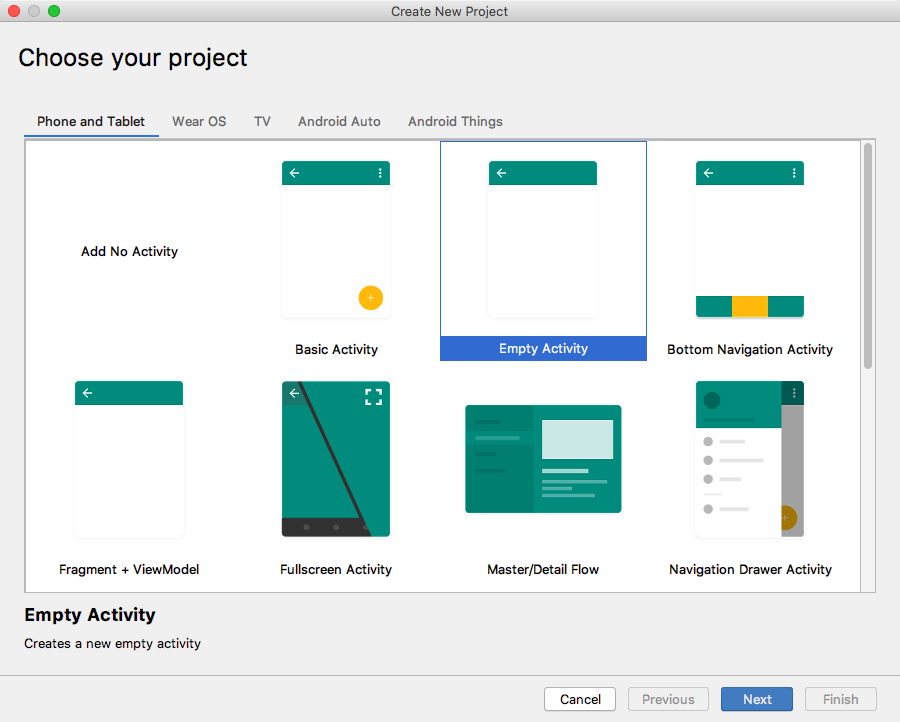

**图 1.9　选择项目类型界面**

这里我们不仅可以选择创建手机和平板类型的项目，还可以选择创建可穿戴设备、电视，甚至汽车等类型的项目。不过手机和平板才是本书讨论的重点，其他类型的项目我们就不去关注了。另外，Android Studio 还提供了很多种内置模板，不过由于我们才刚刚开始学习，用不着这么多复杂的模板，这里直接选择“Empty Activity”，创建一个空的 Activity 就可以了。

点击“Next”会进入项目配置界面，如图 1.10 所示。

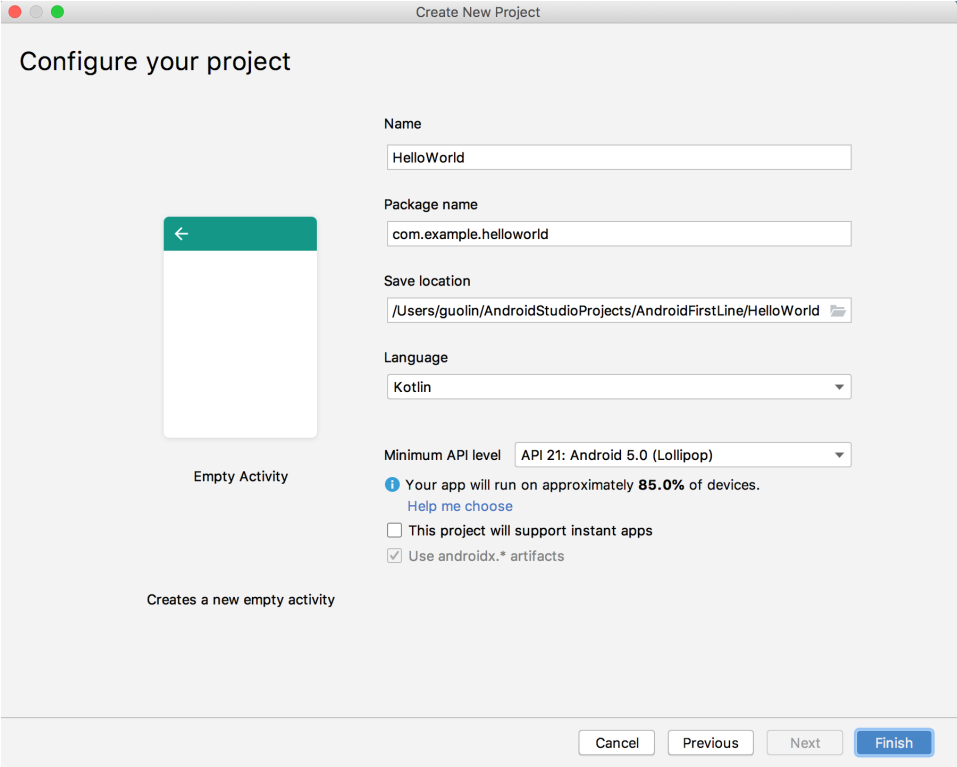

**图 1.10　项目配置界面**

其中，Name 表示项目名称，这里我们填入“HelloWorld”即可。

Package name 表示项目的包名，Android 系统就是通过包名来区分不同应用程序的，因此包名一定要具有唯一性。Android Studio 会根据应用名称来自动帮我们生成合适的包名，如果你不想使用默认生成的包名，也可以自行修改。

Save location 表示项目代码存放的位置，如果没有特殊要求的话，这里也保持默认即可。

接下来的 Language 就很重要了，这里默认选择了 Kotlin。在过去，Android 应用程序只能使用 Java 来进行开发，本书的前两个版本也都是用 Java 语言讲解的。然而在 2017 年，Google 引入了一款新的开发语言——Kotlin，并在 2019 年正式向广大开发者公布了 Kotlin First 的消息。因此，本书第 3 版决定响应 Google 的号召，全书代码都使用 Kotlin 语言来进行编写。那么你可能会担心了，我不会 Kotlin 怎么办？没关系，本书除了会讲解 Android 方面的知识之外，还会非常全面地讲解 Kotlin 方面的知识，并不需要你有任何 Kotlin 语言的基础。

紧接着，Minimum API level 可以设置项目的最低兼容版本。前面已经说过，Android 5.0 以上的系统已经占据了超过 85% 的 Android 市场份额，因此这里我们将 Minimum SDK 指定成 API 21 就可以了。

最后的两个复选框，一个是用于支持 instant apps 免安装应用的，这个功能必须配合 Google Play 服务才能使用，在国内是用不了的，因此不在本书的讨论范围内；另一个用于在项目中启用 AndroidX。AndroidX 的主要目的是取代过去的 Android Support Library，虽然 Google 给出了一个过渡期，但是在我使用的 Android Studio 3.5.2 版本中，这个复选框已经被强制勾选了。如果你使用了更新的 Android Studio 版本，看不到这个复选框也不用感到奇怪，因为未来所有项目都会默认启用 AndroidX。想要了解更多 AndroidX 与 Android Support Library 的区别，可以关注我的微信公众号（见封面），回复“AndroidX”即可。

现在点击“Finish”按钮，并耐心等待一会儿，项目就会创建成功了，如图 1.11 所示。

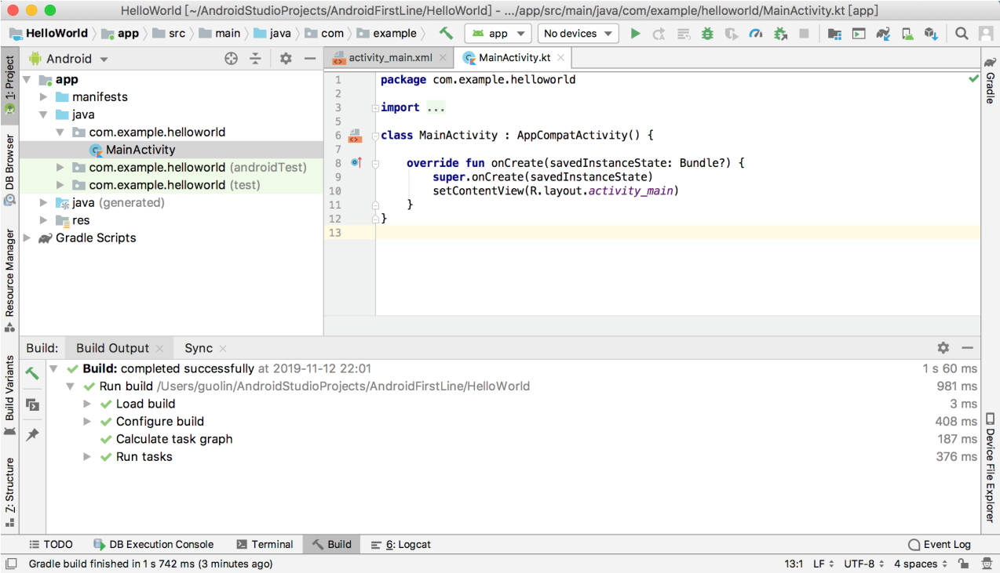

**图 1.11　项目创建成功**

### 1.3.2　启动模拟器

由于 Android Studio 自动为我们生成了很多东西，因而你现在不需要编写任何代码，HelloWorld 项目就已经可以运行了。但是在此之前，还必须有一个运行的载体，可以是一部 Android 手机，也可以是 Android 模拟器。这里我们暂时先使用模拟器来运行程序，如果你想立刻就将程序运行到手机上的话，可以参考 9.1 节的内容。

那么我们现在就来创建一个 Android 模拟器，观察 Android Studio 顶部工具栏中的图标，如图 1.12 所示。


**图 1.12　顶部工具栏中的图标**

中间的按钮就是用于创建和启动模拟器的，点击该按钮，会弹出如图 1.13 所示的窗口。

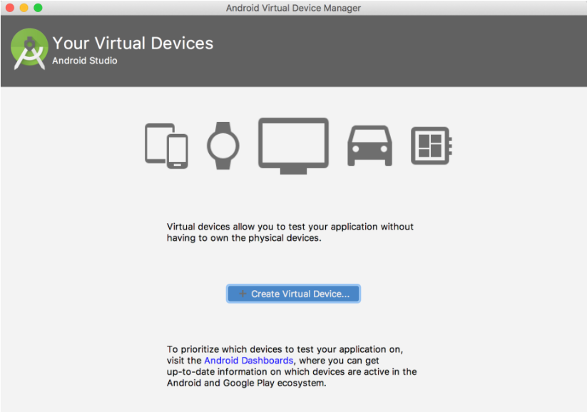

**图 1.13　创建模拟器**

可以看到，目前我们的模拟器列表中还是空的，点击“Create Virtual Device”按钮就可以立刻开始创建了，如图 1.14 所示。

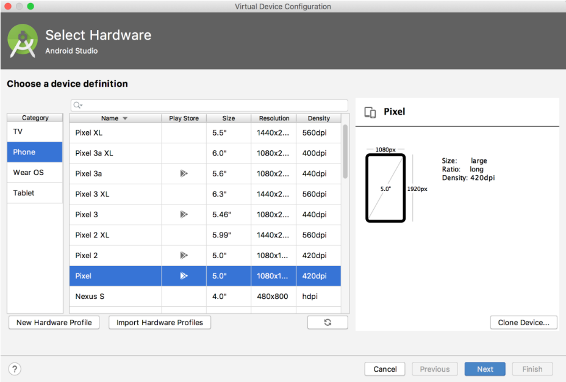

**图 1.14　选择要创建的模拟器设备**

这里有很多种设备可供我们选择，不仅能创建手机模拟器，还可以创建平板、手表、电视等模拟器。

那么我就选择创建 Pixel 这台设备的模拟器了，这是我个人非常钟爱的一台设备。点击“Next”，如图 1.15 所示。

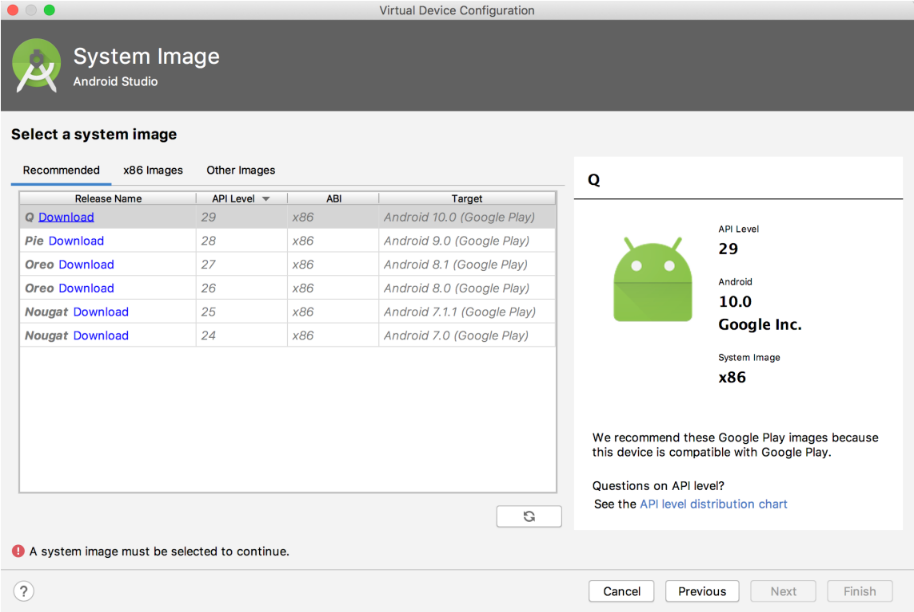

**图 1.15　选择模拟器的操作系统版本**

这里可以选择模拟器所使用的操作系统版本，毫无疑问，我们肯定要选择最新的 Android 10.0 系统。但是由于目前我的本机还不存在 Android 10.0 系统的镜像，因此需要先点击“Download”下载镜像。下载完成后继续点击“Next”，出现如图 1.16 所示的界面。

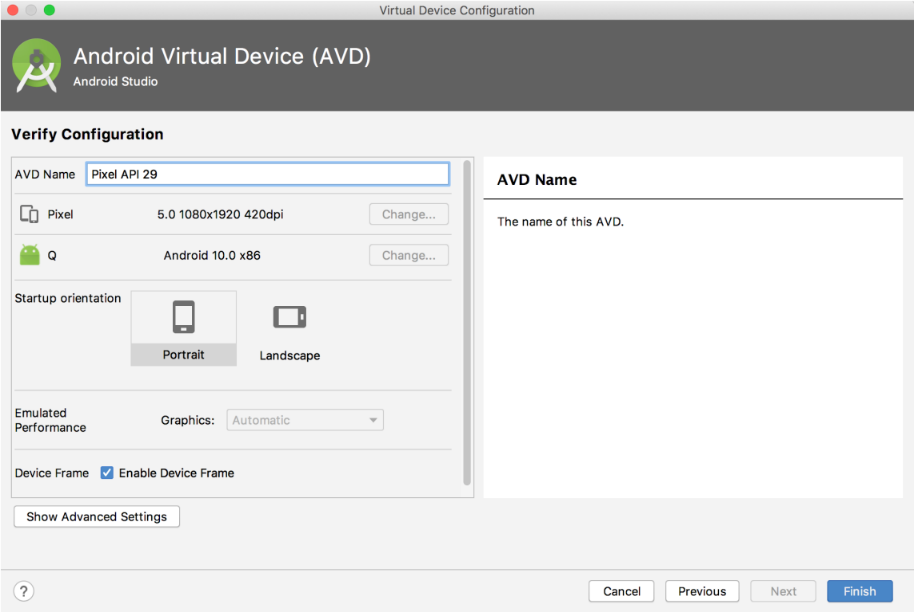

**图 1.16　确认模拟器配置**

在这里我们可以对模拟器的一些配置进行确认，比如说指定模拟器的名字、分辨率、横竖屏等信息，如果没有特殊需求的话，全部保持默认就可以了。点击“Finish”完成模拟器的创建，然后会弹出如图 1.17 所示的窗口。

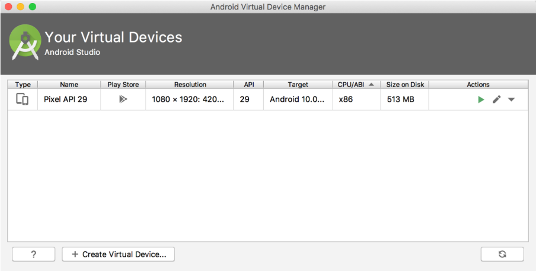

**图 1.17　模拟器列表**

可以看到，现在模拟器列表中已经存在一个创建好的模拟器设备了，点击 Actions 栏目中最左边的三角形按钮即可启动模拟器。模拟器会像手机一样，有一个开机过程，启动完成之后的界面如图 1.18 所示。


**图 1.18　启动后的模拟器界面**

很清新的 Android 界面出来了！看上去还挺不错吧，你几乎可以像使用手机一样使用它，Android 模拟器对手机的模仿度非常高，快去体验一下吧。

### 1.3.3　运行 HelloWorld

现在模拟器已经启动起来了，那么下面我们就将 HelloWorld 项目运行到模拟器上。观察 Android Studio 顶部工具栏中的图标，如图 1.19 所示，其中左边的锤子按钮是用来编译项目的。中间有两个下拉列表：一个是用来选择运行哪一个项目的，通常 app 就是当前的主项目；另一个是用来选择运行到哪台设备上的，可以看到，我们刚刚创建的模拟器现在已经在线了。右边的三角形按钮是用来运行项目的。


**图 1.19　顶部工具栏中的图标**

现在点击右边的运行按钮，稍微等待一会儿，HelloWorld 项目就会运行到模拟器上了，结果应该和图 1.20 中显示的是一样的。

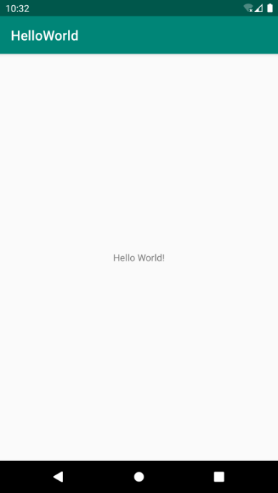

**图 1.20　运行 HelloWorld 项目**

HelloWorld 项目运行成功！并且你会发现，模拟器上已经安装 HelloWorld 这个应用了。打开启动器列表，如图 1.21 所示。

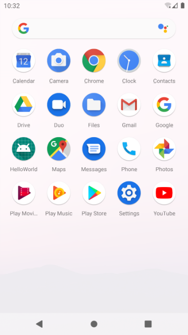

**图 1.21　查看启动器列表**

这个时候你可能会说我坑你了，说好的第一行代码呢？怎么一行还没写，项目就已经运行起来了？这个只能说是因为 Android Studio 太智能了，已经帮我们把一些简单的内容自动生成了。你也别心急，后面写代码的机会多着呢，我们先来分析一下 HelloWorld 这个项目吧。

### 1.3.4　分析你的第一个 Android 程序

回到 Android Studio 中，首先展开 HelloWorld 项目，你会看到如图 1.22 所示的项目结构。

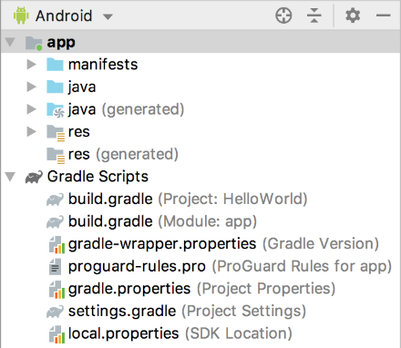

**图 1.22　Android 模式的项目结构**

任何一个新建的项目都会默认使用 Android 模式的项目结构，但这并不是项目真实的目录结构，而是被 Android Studio 转换过的。这种项目结构简洁明了，适合进行快速开发，但是对于新手来说可能不易于理解。点击图 1.22 中最上方的 Android 区域可以切换项目结构模式，如图 1.23 所示。

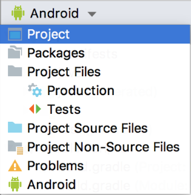

**图 1.23　切换项目结构模式**

这里我们将项目结构模式切换成 Project，这就是项目真实的目录结构了，如图 1.24 所示。

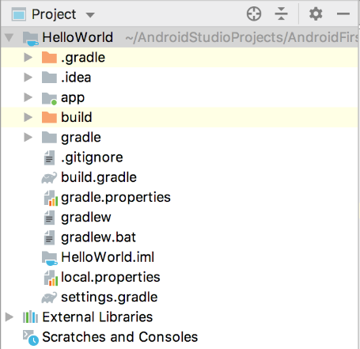

**图 1.24　Project 模式的项目结构**

一开始看到这么多陌生的东西，你一定会有点头晕吧。别担心，我现在就对图 1.24 中的内容进行讲解，之后你再看这张图就不会感到那么吃力了。

1.  **.gradle 和.idea**

   这两个目录下放置的都是 Android Studio 自动生成的一些文件，我们无须关心，也不要去手动编辑。
2. **app**

   项目中的代码、资源等内容都是放置在这个目录下的，我们后面的开发工作也基本是在这个目录下进行的，待会儿还会对这个目录单独展开讲解。
3. **build**

   这个目录主要包含了一些在编译时自动生成的文件，你也不需要过多关心。
4. **gradle**

   这个目录下包含了 gradle wrapper 的配置文件，使用 gradle wrapper 的方式不需要提前将 gradle 下载好，而是会自动根据本地的缓存情况决定是否需要联网下载 gradle。Android Studio 默认就是启用 gradle wrapper 方式的，如果需要更改成离线模式，可以点击 Android Studio 导航栏 →File→Settings→Build, Execution, Deployment→Gradle，进行配置更改。
5.  **.gitignore**

   这个文件是用来将指定的目录或文件排除在版本控制之外的。关于版本控制，我们将在第 6 章中开始正式的学习。
6. **build.gradle**

   这是项目全局的 gradle 构建脚本，通常这个文件中的内容是不需要修改的。稍后我们将会详细分析 gradle 构建脚本中的具体内容。
7. **gradle.properties**

   这个文件是全局的 gradle 配置文件，在这里配置的属性将会影响到项目中所有的 gradle 编译脚本。
8. **gradlew 和 gradlew.bat**

   这两个文件是用来在命令行界面中执行 gradle 命令的，其中 gradlew 是在 Linux 或 Mac 系统中使用的，gradlew.bat 是在 Windows 系统中使用的。
9. **HelloWorld.iml**

   iml 文件是所有 IntelliJ IDEA 项目都会自动生成的一个文件（Android Studio 是基于 IntelliJ IDEA 开发的），用于标识这是一个 IntelliJ IDEA 项目，我们不需要修改这个文件中的任何内容。
10. **local.properties**

    这个文件用于指定本机中的 Android SDK 路径，通常内容是自动生成的，我们并不需要修改。除非你本机中的 Android SDK 位置发生了变化，那么就将这个文件中的路径改成新的位置即可。
11. **settings.gradle**

    这个文件用于指定项目中所有引入的模块。由于 HelloWorld 项目中只有一个 app 模块，因此该文件中也就只引入了 app 这一个模块。通常情况下，模块的引入是自动完成的，需要我们手动修改这个文件的场景可能比较少。

现在整个项目的外层目录结构已经介绍完了。你会发现，除了 app 目录之外，大多数的文件和目录是自动生成的，我们并不需要进行修改。想必你已经猜到了，app 目录下的内容才是我们以后的工作重点，展开之后的结构如图 1.25 所示。

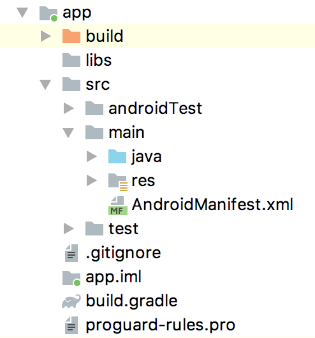

**图 1.25　app 目录下的结构**

那么下面我们就来对 app 目录下的内容进行更为详细的分析。

1. **build**

   这个目录和外层的 build 目录类似，也包含了一些在编译时自动生成的文件，不过它里面的内容会更加复杂，我们不需要过多关心。
2. **libs**

   如果你的项目中使用到了第三方 jar 包，就需要把这些 jar 包都放在 libs 目录下，放在这个目录下的 jar 包会被自动添加到项目的构建路径里。
3. **androidTest**

   此处是用来编写 Android Test 测试用例的，可以对项目进行一些自动化测试。
4. **java**

   毫无疑问，java 目录是放置我们所有 Java 代码的地方（Kotlin 代码也放在这里），展开该目录，你将看到系统帮我们自动生成了一个 MainActivity 文件。
5. **res**

   这个目录下的内容就有点多了。简单点说，就是你在项目中使用到的所有图片、布局、字符串等资源都要存放在这个目录下。当然这个目录下还有很多子目录，图片放在 drawable 目录下，布局放在 layout 目录下，字符串放在 values 目录下，所以你不用担心会把整个 res 目录弄得乱糟糟的。
6. **AndroidManifest.xml**

   这是整个 Android 项目的配置文件，你在程序中定义的所有四大组件都需要在这个文件里注册，另外还可以在这个文件中给应用程序添加权限声明。由于这个文件以后会经常用到，我们等用到的时候再做详细说明。
7. **test**

   此处是用来编写 Unit Test 测试用例的，是对项目进行自动化测试的另一种方式。
8.  **.gitignore**

   这个文件用于将 app 模块内指定的目录或文件排除在版本控制之外，作用和外层的.gitignore 文件类似。
9. **app.iml**

   IntelliJ IDEA 项目自动生成的文件，我们不需要关心或修改这个文件中的内容。
10. **build.gradle**

    这是 app 模块的 gradle 构建脚本，这个文件中会指定很多项目构建相关的配置，我们稍后将会详细分析 gradle 构建脚本中的具体内容。
11. **proguard-rules.pro**

    这个文件用于指定项目代码的混淆规则，当代码开发完成后打包成安装包文件，如果不希望代码被别人破解，通常会将代码进行混淆，从而让破解者难以阅读。

这样整个项目的目录结构就都介绍完了，如果你还不能完全理解的话也很正常，毕竟里面有太多的东西你都还没接触过。不过不用担心，这并不会影响你后面的学习。等你学完整本书再回来看这个目录结构图时，你会觉得特别地清晰和简单。

接下来我们一起分析一下 HelloWorld 项目究竟是怎么运行起来的吧。首先打开 Android- Manifest.xml 文件，从中可以找到如下代码：

```xml
<activity android:name=".MainActivity">
    <intent-filter>
        <action android:name="android.intent.action.MAIN" />
        <category android:name="android.intent.category.LAUNCHER" />
    </intent-filter>
</activity>
```

这段代码表示对 MainActivity 进行注册，没有在 AndroidManifest.xml 里注册的 Activity 是不能使用的。其中 `intent-filter` 里的两行代码非常重要，`<action android:name="android.intent.action.MAIN"/>` 和 `<category android:name="android.intent.category.LAUNCHER" />` 表示 MainActivity 是这个项目的主 Activity，在手机上点击应用图标，首先启动的就是这个 Activity。

那 MainActivity 具体又有什么作用呢？我在介绍 Android 四大组件的时候说过，Activity 是 Android 应用程序的门面，凡是在应用中你看得到的东西，都是放在 Activity 中的。因此你在图 1.20 中看到的界面，其实就是 MainActivity。那我们快去看一下它的代码吧，打开 MainActivity，代码如下所示：

```Kotlin
class MainActivity : AppCompatActivity() {

    override fun onCreate(savedInstanceState: Bundle?) {
        super.onCreate(savedInstanceState)
        setContentView(R.layout.activity_main)
    }

}
```

首先可以看到，MainActivity 是继承自 `AppCompatActivity` 的。`AppCompatActivity` 是 AndroidX 中提供的一种向下兼容的 Activity，可以使 Activity 在不同系统版本中的功能保持一致性。而 Activity 类是 Android 系统提供的一个基类，我们项目中所有自定义的 Activity 都必须继承它或者它的子类才能拥有 Activity 的特性（`AppCompatActivity` 是 Activity 的子类）。然后可以看到 MainActivity 中有一个 `onCreate()` 方法，这个方法是一个 Activity 被创建时必定要执行的方法，其中只有两行代码，并且没有“Hello World! ”的字样。那么图 1.20 中显示的“Hello World! ”是在哪里定义的呢？

其实 Android 程序的设计讲究逻辑和视图分离，因此是不推荐在 Activity 中直接编写界面的。一种更加通用的做法是，在布局文件中编写界面，然后在 Activity 中引入进来。可以看到，在 `onCreate()` 方法的第二行调用了 `setContentView()` 方法，就是这个方法给当前的 Activity 引入了一个 activity_main 布局，那“Hello World!”一定就是在这里定义的了！我们快打开这个文件看一看。

布局文件都是定义在 res/layout 目录下的，当你展开 layout 目录，你会看到 activity_main.xml 这个文件。打开该文件并切换到 Text 视图，代码如下所示：

```xml
<androidx.constraintlayout.widget.ConstraintLayout
    xmlns:android="http://schemas.android.com/apk/res/android"
    xmlns:app="http://schemas.android.com/apk/res-auto"
    xmlns:tools="http://schemas.android.com/tools"
    android:layout_width="match_parent"
    android:layout_height="match_parent"
    tools:context=".MainActivity">

    <TextView
        android:layout_width="wrap_content"
        android:layout_height="wrap_content"
        android:text="Hello World!"
        app:layout_constraintBottom_toBottomOf="parent"
        app:layout_constraintLeft_toLeftOf="parent"
        app:layout_constraintRight_toRightOf="parent"
        app:layout_constraintTop_toTopOf="parent" />

</androidx.constraintlayout.widget.ConstraintLayout>
```

现在还看不懂？没关系，后面我会对布局进行详细讲解，你现在只需要看到上面代码中有一个 TextView，这是 Android 系统提供的一个控件，用于在布局中显示文字。然后你终于在 TextView 中看到了“Hello World！”的字样！哈哈！终于找到了，原来就是通过 `android:text="Hello World!"` 这句代码定义的。

这样我们就将 HelloWorld 项目的目录结构以及基本的执行过程分析完了，相信你对 Android 项目已经有了一个初步的认识，下一小节中我们就来学习一下项目中所包含的资源。

### 1.3.5　详解项目中的资源

如果你展开 res 目录看一下，其实里面的东西还是挺多的，很容易让人看得眼花缭乱，如图 1.26 所示。

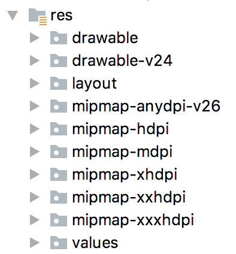

**图 1.26　res 目录下的结构**

看到这么多的子目录也不用害怕，其实归纳一下，res 目录中的内容就变得非常简单了。所有以“drawable”开头的目录都是用来放图片的，所有以“mipmap”开头的目录都是用来放应用图标的，所有以“values”开头的目录都是用来放字符串、样式、颜色等配置的，所有以“layout”开头的目录都是用来放布局文件的。怎么样，是不是突然感觉清晰了很多？

之所以有这么多“mipmap”开头的目录，其实主要是为了让程序能够更好地兼容各种设备。drawable 目录也是相同的道理，虽然 Android Studio 没有帮我们自动生成，但是我们应该自己创建 drawable-hdpi、drawable-xhdpi、drawable-xxhdpi 等目录。在制作程序的时候，最好能够给同一张图片提供几个不同分辨率的版本，分别放在这些目录下，然后程序运行的时候，会自动根据当前运行设备分辨率的高低选择加载哪个目录下的图片。当然这只是理想情况，更多的时候美工只会提供给我们一份图片，这时你把所有图片都放在 drawable-xxhdpi 目录下就好了，因为这是最主流的设备分辨率目录。

知道了 res 目录下每个子目录的含义，我们再来看一下如何使用这些资源吧。打开 res/values/strings.xml 文件，内容如下所示：

```xml
<resources>
    <string name="app_name">HelloWorld</string>
</resources>
```

可以看到，这里定义了一个应用程序名的字符串，我们有以下两种方式来引用它。

- 在代码中通过 `R.string.app_name` 可以获得该字符串的引用。
- 在 XML 中通过 `@string/app_name` 可以获得该字符串的引用。

基本的语法就是上面这两种方式，其中 `string` 部分是可以替换的，如果是引用的图片资源就可以替换成 `drawable`，如果是引用的应用图标就可以替换成 `mipmap`，如果是引用的布局文件就可以替换成 `layout`，以此类推。

下面举一个简单的例子来帮助你理解，打开 AndroidManifest.xml 文件，找到如下代码：

```xml
<application
    android:allowBackup="true"
    android:icon="@mipmap/ic_launcher"
    android:label="@string/app_name"
    android:roundIcon="@mipmap/ic_launcher_round"
    android:supportsRtl="true"
    android:theme="@style/AppTheme">
    ...
</application>
```

其中，HelloWorld 项目的应用图标就是通过 `android:icon` 属性指定的，应用的名称则是通过 `android:label` 属性指定的。可以看到，这里对资源引用的方式正是我们刚刚学过的在 XML 中引用资源的语法。

经过本小节的学习，如果你想修改应用的图标或者名称，相信已经知道该怎么办了吧。

### 1.3.6　详解 build.gradle 文件

不同于 Eclipse，Android Studio 是采用 Gradle 来构建项目的。Gradle 是一个非常先进的项目构建工具，它使用了一种基于 Groovy 的领域特定语言（DSL）来进行项目设置，摒弃了传统基于 XML（如 Ant 和 Maven）的各种烦琐配置。

在 1.3.4 小节中我们已经看到，HelloWorld 项目中有两个 build.gradle 文件，一个是在最外层目录下的，一个是在 app 目录下的。这两个文件对构建 Android Studio 项目都起到了至关重要的作用，下面我们就来对这两个文件中的内容进行详细的分析。

先来看一下最外层目录下的 build.gradle 文件，代码如下所示：

```gradle
buildscript {
    ext.kotlin_version = '1.3.61'
    repositories {
        google()
        jcenter()
    }
    dependencies {
        classpath 'com.android.tools.build:gradle:3.5.2'
        classpath "org.jetbrains.kotlin:kotlin-gradle-plugin:$kotlin_version"
    }
}

allprojects {
    repositories {
        google()
        jcenter()
    }
}
```

这些代码都是自动生成的，虽然语法结构看上去可能有点难以理解，但是如果我们忽略语法结构，只看最关键的部分，其实还是很好懂的。

首先，两处 `repositories` 的闭包中都声明了 `google()` 和 `jcenter()` 这两行配置，那么它们是什么意思呢？其实它们分别对应了一个代码仓库，google 仓库中包含的主要是 Google 自家的扩展依赖库，而 jcenter 仓库中包含的大多是一些第三方的开源库。声明了这两行配置之后，我们就可以在项目中轻松引用任何 google 和 jcenter 仓库中的依赖库了。

接下来，`dependencies` 闭包中使用 `classpath` 声明了两个插件：一个 Gradle 插件和一个 Kotlin 插件。为什么要声明 Gradle 插件呢？因为 Gradle 并不是专门为构建 Android 项目而开发的，Java、C++ 等很多种项目也可以使用 Gradle 来构建，因此如果我们要想使用它来构建 Android 项目，则需要声明 com.android.tools.build:gradle:3.5.2 这个插件。其中，最后面的部分是插件的版本号，它通常和当前 Android Studio 的版本是对应的，比如我现在使用的是 Android Studio 3.5.2 版本，那么这里的插件版本号就应该是 3.5.2。而另外一个 Kotlin 插件则表示当前项目是使用 Kotlin 进行开发的，如果是 Java 版的 Android 项目，则不需要声明这个插件。我在编写本书时，Kotlin 插件的最新版本号是 1.3.61。

这样我们就将最外层目录下的 build.gradle 文件分析完了，通常情况下，你并不需要修改这个文件中的内容，除非你想添加一些全局的项目构建配置。

下面我们再来看一下 app 目录下的 build.gradle 文件，代码如下所示：

```gradle
apply plugin: 'com.android.application'
apply plugin: 'kotlin-android'
apply plugin: 'kotlin-android-extensions'

android {
    compileSdkVersion 29
    buildToolsVersion "29.0.2"
    defaultConfig {
        applicationId "com.example.helloworld"
        minSdkVersion 21
        targetSdkVersion 29
        versionCode 1
        versionName "1.0"
        testInstrumentationRunner "androidx.test.runner.AndroidJUnitRunner"
    }
    buildTypes {
        release {
            minifyEnabled false
            proguardFiles getDefaultProguardFile('proguard-android-optimize.txt'),
                'proguard-rules.pro'
        }
    }
}

dependencies {
    implementation fileTree(dir: 'libs', include: ['*.jar'])
    implementation "org.jetbrains.kotlin:kotlin-stdlib-jdk7:$kotlin_version"
    implementation 'androidx.appcompat:appcompat:1.1.0'
    implementation 'androidx.core:core-ktx:1.1.0'
    implementation 'androidx.constraintlayout:constraintlayout:1.1.3'
    testImplementation 'junit:junit:4.12'
    androidTestImplementation 'androidx.test.ext:junit:1.1.1'
    androidTestImplementation 'androidx.test.espresso:espresso-core:3.2.0'
}
```

这个文件中的内容就要相对复杂一些了，下面我们一行行地进行分析。首先第一行应用了一个插件，一般有两种值可选：`com.android.application` 表示这是一个应用程序模块，`com.android.library` 表示这是一个库模块。二者最大的区别在于，应用程序模块是可以直接运行的，库模块只能作为代码库依附于别的应用程序模块来运行。

接下来的两行应用了 kotlin-android 和 kotlin-android-extensions 这两个插件。如果你想要使用 Kotlin 来开发 Android 项目，那么第一个插件就是必须应用的。而第二个插件帮助我们实现了一些非常好用的 Kotlin 扩展功能，在后面的章节中，你将能体会到它所带来的巨大便利性。

紧接着是一个大的 `android` 闭包，在这个闭包中我们可以配置项目构建的各种属性。其中，`compileSdkVersion` 用于指定项目的编译版本，这里指定成 29 表示使用 Android 10.0 系统的 SDK 编译。`buildToolsVersion` 用于指定项目构建工具的版本，目前最新的版本就是 29.0.2，如果有更新的版本时，Android Studio 会进行提示。

然后我们看到，`android` 闭包中又嵌套了一个 `defaultConfig` 闭包，`defaultConfig` 闭包中可以对项目的更多细节进行配置。其中，`applicationId` 是每一个应用的唯一标识符，绝对不能重复，默认会使用我们在创建项目时指定的包名，如果你想在后面对其进行修改，那么就是在这里修改的。`minSdkVersion` 用于指定项目最低兼容的 Android 系统版本，这里指定成 21 表示最低兼容到 Android 5.0 系统。`targetSdkVersion` 指定的值表示你在该目标版本上已经做过了充分的测试，系统将会为你的应用程序启用一些最新的功能和特性。比如 Android 6.0 系统中引入了运行时权限这个功能，如果你将 `targetSdkVersion` 指定成 23 或者更高，那么系统就会为你的程序启用运行时权限功能，而如果你将 `targetSdkVersion` 指定成 22，那么就说明你的程序最高只在 Android 5.1 系统上做过充分的测试，Android 6.0 系统中引入的新功能自然就不会启用了。接下来的两个属性都比较简单，`versionCode` 用于指定项目的版本号，`versionName` 用于指定项目的版本名。最后，`testInstrumentationRunner` 用于在当前项目中启用 JUnit 测试，你可以为当前项目编写测试用例，以保证功能的正确性和稳定性。

分析完了 `defaultConfig` 闭包，接下来我们看一下 `buildTypes` 闭包。`buildTypes` 闭包中用于指定生成安装文件的相关配置，通常只会有两个子闭包：一个是 `debug`，一个是 `release`。`debug` 闭包用于指定生成测试版安装文件的配置，`release` 闭包用于指定生成正式版安装文件的配置。另外，`debug` 闭包是可以忽略不写的，因此我们看到上面的代码中就只有一个 `release` 闭包。下面来看一下 `release` 闭包中的具体内容吧，`minifyEnabled` 用于指定是否对项目的代码进行混淆，`true` 表示混淆，`false` 表示不混淆。`proguardFiles` 用于指定混淆时使用的规则文件，这里指定了两个文件：第一个 `proguard-android-optimize.txt` 是在\<Android SDK\>/tools/proguard 目录下的，里面是所有项目通用的混淆规则；第二个 `proguard-rules.pro` 是在当前项目的根目录下的，里面可以编写当前项目特有的混淆规则。需要注意的是，通过 Android Studio 直接运行项目生成的都是测试版安装文件，关于如何生成正式版安装文件，我们将会在第 15 章中学习。

这样整个 `android` 闭包中的内容就都分析完了，接下来还剩一个 `dependencies` 闭包。这个闭包的功能非常强大，它可以指定当前项目所有的依赖关系。通常 Android Studio 项目一共有 3 种依赖方式：本地依赖、库依赖和远程依赖。本地依赖可以对本地的 jar 包或目录添加依赖关系，库依赖可以对项目中的库模块添加依赖关系，远程依赖则可以对 jcenter 仓库上的开源项目添加依赖关系。

观察一下 `dependencies` 闭包中的配置，第一行的 `implementation fileTree` 就是一个本地依赖声明，它表示将 libs 目录下所有.jar 后缀的文件都添加到项目的构建路径中。而 `implementation` 则是远程依赖声明，`androidx.appcompat:appcompat:1.1.0` 就是一个标准的远程依赖库格式，其中 `androidx.appcompat` 是域名部分，用于和其他公司的库做区分；`appcompat` 是工程名部分，用于和同一个公司中不同的库工程做区分；`1.1.0` 是版本号，用于和同一个库不同的版本做区分。加上这句声明后，Gradle 在构建项目时会首先检查一下本地是否已经有这个库的缓存，如果没有的话则会自动联网下载，然后再添加到项目的构建路径中。至于库依赖声明这里没有用到，它的基本格式是 `implementation project` 后面加上要依赖的库的名称，比如有一个库模块的名字叫 helper，那么添加这个库的依赖关系只需要加入 `implementation project(':helper')` 这句声明即可。关于这部分内容，我们将在本书的最后一章学习。另外剩下的 `testImplementation` 和 `androidTestImplementation` 都是用于声明测试用例库的，这个我们暂时用不到，先忽略它就可以了。

## 1.4　前行必备：掌握日志工具的使用

通过上一节的学习，你已经成功创建了你的第一个 Android 程序，并且对 Android 项目的目录结构和运行流程都有了一定的了解。现在本应该是你继续前行的时候，不过我想在这里给你穿插一点内容，讲解一下 Android 中日志工具的使用方法，这对你以后的 Android 开发之旅会有极大的帮助。

### 1.4.1　使用 Android 的日志工具 Log

Android 中的日志工具类是 Log（`android.util.Log`），这个类中提供了如下 5 个方法来供我们打印日志。

- `Log.v()`。用于打印那些最为琐碎的、意义最小的日志信息。对应级别 verbose，是 Android 日志里面级别最低的一种。
- `Log.d()`。用于打印一些调试信息，这些信息对你调试程序和分析问题应该是有帮助的。对应级别 debug，比 verbose 高一级。
- `Log.i()`。用于打印一些比较重要的数据，这些数据应该是你非常想看到的、可以帮你分析用户行为的数据。对应级别 info，比 debug 高一级。
- `Log.w()`。用于打印一些警告信息，提示程序在这个地方可能会有潜在的风险，最好去修复一下这些出现警告的地方。对应级别 warn，比 info 高一级。
- `Log.e()`。用于打印程序中的错误信息，比如程序进入了 `catch` 语句中。当有错误信息打印出来的时候，一般代表你的程序出现严重问题了，必须尽快修复。对应级别 error，比 warn 高一级。

其实很简单，一共就 5 个方法，当然每个方法还会有不同的重载，但那对你来说肯定不是什么难理解的地方了。我们现在就在 HelloWorld 项目中试一试日志工具好不好用吧。

打开 MainActivity，在 `onCreate()` 方法中添加一行打印日志的语句，如下所示：

```Kotlin
class MainActivity : AppCompatActivity() {

    override fun onCreate(savedInstanceState: Bundle?) {
        super.onCreate(savedInstanceState)
        setContentView(R.layout.activity_main)
        Log.d("MainActivity", "onCreate execute")
    }

}
```

`Log.d()` 方法中传入了两个参数：第一个参数是 `tag`，一般传入当前的类名就好，主要用于对打印信息进行过滤；第二个参数是 `msg`，即想要打印的具体内容。

现在可以重新运行一下 HelloWorld 这个项目了，点击顶部工具栏上的运行按钮，或者使用快捷键 Shift + F10（Mac 系统是 control + R）。等程序运行完毕，点击 Android Studio 底部工具栏的“Android Monitor”，在 Logcat 中就可以看到打印信息了，如图 1.27 所示。

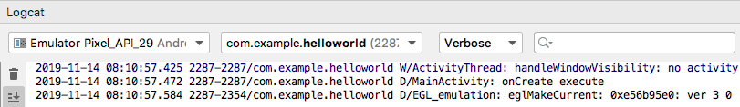

**图 1.27　Logcat 中的打印信息**

其中，你不仅可以看到打印日志的内容和 tag 名，就连程序的包名、打印的时间以及应用程序的进程号都可以看到。

当然，Logcat 中不光会显示我们所打印的日志，还会显示许多其他程序打印的日志，因此在很多情况下还需要对日志进行过滤，下一小节中我们就会学习这部分内容。

另外，不知道你有没有注意到，你的第一行代码已经在不知不觉中写出来了，我也总算是交差了。

### 1.4.2　为什么使用 Log 而不使用 `println()`

我相信很多的 Java 新手会非常喜欢使用 `System.out.println()` 方法来打印日志，在 Kotlin 中与之对应的是 `println()` 方法，不知道你是不是也喜欢这么做。不过在真正的项目开发中，是极度不建议使用 `System.out.println()` 或 `println()` 方法的，如果你在公司的项目中经常使用这两个方法来打印日志的话，就很有可能要挨骂了。

为什么 `System.out.println()` 和 `println()` 方法会这么不受待见呢？经过我仔细分析之后，发现这两个方法除了使用方便一点之外，其他就一无是处了。方便在哪儿呢？在 Android Studio 中你只需要输入“sout”，然后按下代码提示键，方法就会自动出来了，相信这也是很多 Java 新手对它钟情的原因。那缺点又在哪儿了呢？这个就太多了，比如日志开关不可控制、不能添加日志标签、日志没有级别区分……

听我说了这些，你可能已经不太想用 `System.out.println()` 和 `println()` 方法了，那么 Log 就把上面所说的缺点全部改好了吗？虽然谈不上全部，但我觉得 Log 已经做得相当不错了。我现在就来带你看看 Log 和 Logcat 配合的强大之处。

首先，Logcat 中可以很轻松地添加过滤器，你可以在图 1.28 中看到我们目前所有的过滤器。

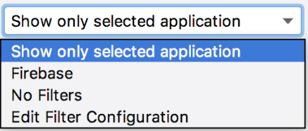

**图 1.28　Logcat 中的过滤器**

目前只有 3 个过滤器，Show only selected application 表示只显示当前选中程序的日志； Firebase 是 Google 提供的一个开发者工具和基础架构平台，我们可以不用管它；No Filters 相当于没有过滤器，会把所有的日志都显示出来。那可不可以自定义过滤器呢？当然可以，我们现在就来添加一个过滤器试试。

点击图 1.28 中的“Edit Filter Configuration”，会弹出一个过滤器配置界面。我们给过滤器起名叫 data，并且让它对名为 data 的 tag 进行过滤，如图 1.29 所示。

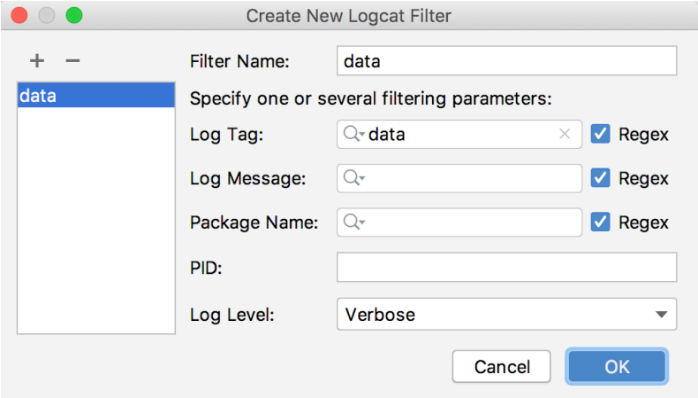

**图 1.29　过滤器配置界面**

点击“OK”，你会发现多出了一个 data 过滤器。当选中这个过滤器的时候，刚才在 `onCreate()` 方法里打印的日志就不见了，这是因为 data 这个过滤器只会显示 tag 名称为 data 的日志。你可以尝试在 `onCreate()` 方法中把打印日志的语句改成 `Log.d("data", "onCreate execute")`，然后再次运行程序，你就会在 data 过滤器下看到这行日志了。

不知道你有没有体会到使用过滤器的好处，可能现在还没有吧。不过当你的程序打印出成百上千行日志的时候，你就会迫切地需要过滤器了。

看完了过滤器，再来看一下 Logcat 中的日志级别控制吧。Logcat 中主要有 5 个级别，分别对应上一小节介绍的 5 个方法，如图 1.30 所示。

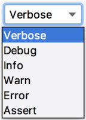

**图 1.30　Logcat 中的日志级别**

当前我们选中的级别是 Verbose，也就是最低等级。这意味着不管我们使用哪一个方法打印日志，这条日志都一定会显示出来。而如果我们将级别选中为 Debug，这时只有我们使用 Debug 及以上级别方法打印的日志才会显示出来，以此类推。你可以做一下实验，当你把 Logcat 中的级别选中为 Info、Warn 或者 Error 时，我们在 `onCreate()` 方法中打印的语句是不会显示的，因为我们打印日志时使用的是 `Log.d()` 方法。

日志级别控制的好处就是，你可以很快地找到你所关心的那些日志。相信如果让你从上千行日志中查找一条崩溃信息，你一定会抓狂吧。而现在你只需要将日志级别选中为 Error，那些不相干的琐碎信息就不会再干扰你的视线了。

最后，我们再来看一下关键字过滤。如果使用过滤器加日志级别控制还是不能锁定到你想查看的日志内容的话，那么还可以通过关键字进行进一步的过滤，如图 1.31 所示。

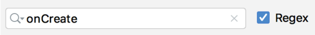

**图 1.31　关键字输入框**

我们可以在输入框里输入关键字的内容，这样只有符合关键字条件的日志才会显示出来，从而能够快速定位到任何你想查看的日志。另外，还有一点需要注意，关键字过滤是支持正则表达式的，有了这个特性，我们就可以构建出更加丰富的过滤条件。

关于 Android 中日志工具的使用，我就准备讲到这里，Logcat 中其他的一些使用技巧就要靠你自己去摸索了。今天你已经学到了足够多的东西，我们来总结和梳理一下吧。

## 1.5　小结与点评

你现在一定会觉得很充实，甚至有点沾沾自喜。确实应该如此，因为你已经成为一名真正的 Android 开发者了。通过本章的学习，你首先对 Android 系统有了更加充足的认识，然后成功将 Android 开发环境搭建了起来，接着创建了你自己的第一个 Android 项目，并对 Android 项目的目录结构和执行过程有了一定的认识，在本章的最后还学习了 Android 日志工具的使用，这难道还不够充实吗？

不过你也不要过于满足，相信你很清楚，Android 开发者和出色的 Android 开发者还是有很大的区别的，要想成为一名出色的 Android 开发者，你还需要付出更多的努力才行。现在你可以非常安心地休息一段时间，因为今天你已经做得非常不错了。储备好能量，准备进入下一章的旅程当中吧。