# 第 2 章　探究新语言，快速入门 Kotlin 编程

在 Android 系统诞生的前 9 年时间里，Google 都只提供了 Java 这一种语言来开发 Android 应用程序，虽然在 Android 1.5 系统中 Google 引入了 NDK 功能，支持使用 C 和 C++ 语言来进行一些本地化开发，但是这丝毫没有影响过 Java 的正统地位。

不过从 2017 开始，一切都发生了改变。Google 在 2017 年的 I/O 大会上宣布，Kotlin 正式成为 Android 的一级开发语言，和 Java 平起平坐，Android Studio 也对 Kotlin 进行了全面的支持。两年之后，Google 又在 2019 年的 I/O 大会上宣布，Kotlin 已经成为 Android 的第一开发语言，虽然 Java 仍然可以继续使用，但 Google 更加推荐开发者使用 Kotlin 来编写 Android 应用程序，并且未来提供的官方 API 也将会优先考虑 Kotlin 版本。

然而现实情况是，很多人对 Java 太熟悉了，不太愿意花费额外的时间再去学习一门新语言，再加上国内不少公司对于新技术比较保守，不敢冒然改用新语言去承担一份额外的风险，因此目前 Kotlin 在国内的普及程度并不高。

可是在海外，Kotlin 的发展速度已是势如破竹。根据统计，Google Play 商店中排名前 1000 的 App 里，有超过 60% 的 App 已使用了 Kotlin 语言，并且这个比例每年还在不断上升。Android 官网文档的代码已优先显示 Kotlin 版本，官方的视频教程以及 Google 的一些开源项目，也改用了 Kotlin 来实现。

为此，我坚定了使用 Kotlin 来编写本书第 3 版的信心。前面已经说了，目前国内 Kotlin 的普及程度还不高，我希望这本书能为国内 Kotlin 的推广和普及贡献一份力量。

其实，这次编写第 3 版对我来说挑战还是蛮大的，因为我要在这本书里同时讲两门技术：Kotlin 和 Android。Kotlin 是 Android 程序的开发语言，一定得先掌握语言才能开发 Android 程序，但是如果我们先去学了小半本书的 Kotlin 语法，然后再开始学 Android 开发，这一定会非常枯燥。因此我准备将 Kotlin 和 Android 穿插在一起讲解，先通过一章的内容带你快速入门 Kotlin 编程，然后使用目前已掌握的知识开始学习 Android 开发，之后我们每章都会结合相应章节的内容再学习一些 Kotlin 的进阶知识，等全部学完本书之后，你将能同时熟练地掌握 Kotlin 和 Android 这两门技术。

如果你还想学习如何使用 Java 来开发 Android 应用程序，那么请参阅本书的第 2 版。

## 2.1　Kotlin 语言简介

我想大多数人听说或知道 Kotlin 的时间并不长，但其实它并不是一门很新的语言。Kotlin 是由 JetBrains 公司开发与设计的，早在 2011 年，JetBrains 就公布了 Kotlin 的第一个版本，并在 2012 年将其开源，但在早期，它并没有受到太多的关注。

2016 年，Kotlin 发布了 1.0 正式版，这代表着 Kotlin 已经足够成熟和稳定了，并且 JetBrains 也在自家的旗舰 IDE 开发工具 IntelliJ IDEA 中加入了对 Kotlin 的支持，自此 Android 开发语言终于有了另外一种选择，Kotlin 逐渐受到广泛的关注。

接下来的事情你已经知道了，2017 年 Google 宣布 Kotlin 正式成为 Android 一级开发语言，Android Studio 也加入了对 Kotlin 的支持，Kotlin 自此开始大放异彩。

看到这里，或许你会产生一些疑惑：Android 操作系统明明是由 Google 开发的，为什么 JetBrains 作为一个第三方公司，却能够自己设计出一门编程语言来开发 Android 应用程序呢？

想要搞懂这个问题，我们得先来探究一下 Java 语言的运行机制。编程语言大致可以分为两类：编译型语言和解释型语言。编译型语言的特点是编译器会将我们编写的源代码一次性地编译成计算机可识别的二进制文件，然后计算机直接执行，像 C 和 C++ 都属于编译型语言。解释型语言则完全不一样，它有一个解释器，在程序运行时，解释器会一行行地读取我们编写的源代码，然后实时地将这些源代码解释成计算机可识别的二进制数据后再执行，因此解释型语言通常效率会差一些，像 Python 和 JavaScript 都属于解释型语言。

那么接下来我要考你一个问题了，Java 是属于编译型语言还是解释型语言呢？对于这个问题，即使是做了很多年 Java 开发的人也可能会答错。有 Java 编程经验的人或许会说，Java 代码肯定是要先编译再运行的，初学 Java 的时候都用过 javac 这个编译命令，因此 Java 属于编译型语言。如果这也是你的答案的话，那么恭喜你，答错了！虽然 Java 代码确实是要先编译再运行的，但是 Java 代码编译之后生成的并不是计算机可识别的二进制文件，而是一种特殊的 class 文件，这种 class 文件只有 Java 虚拟机（Android 中叫 ART，一种移动优化版的虚拟机）才能识别，而这个 Java 虚拟机担当的其实就是解释器的角色，它会在程序运行时将编译后的 class 文件解释成计算机可识别的二进制数据后再执行，因此，准确来讲，Java 属于解释型语言。

了解了 Java 语言的运行机制之后，你有没有受到一些启发呢？其实 Java 虚拟机并不直接和你编写的 Java 代码打交道，而是和编译之后生成的 class 文件打交道。那么如果我开发了一门新的编程语言，然后自己做了个编译器，让它将这门新语言的代码编译成同样规格的 class 文件，Java 虚拟机能不能识别呢？没错，这其实就是 Kotlin 的工作原理了。Java 虚拟机不关心 class 文件是从 Java 编译来的，还是从 Kotlin 编译来的，只要是符合规格的 class 文件，它都能识别。也正是这个原因，JetBrains 才能以一个第三方公司的身份设计出一门用来开发 Android 应用程序的编程语言。

现在你已经明白了 Kotlin 的工作原理，但是 Kotlin 究竟凭借什么魅力能够迅速得到广大开发者的支持，并且仅在 1.0 版本发布一年后就成为 Android 官方支持的开发语言呢？

这就有很多原因了，比如说 Kotlin 的语法更加简洁，对于同样的功能，使用 Kotlin 开发的代码量可能会比使用 Java 开发的减少 50% 甚至更多。另外，Kotlin 的语法更加高级，相比于 Java 比较老旧的语法，Kotlin 增加了很多现代高级语言的语法特性，使得开发效率大大提升。还有，Kotlin 在语言安全性方面下了很多工夫，几乎杜绝了空指针这个全球崩溃率最高的异常，至于是如何做到的，我们在稍后就会学到。

然而 Kotlin 在拥有众多出色的特性之外，还有一个最为重要的特性，那就是它和 Java 是 100% 兼容的。Kotlin 可以直接调用使用 Java 编写的代码，也可以无缝使用 Java 第三方的开源库。这使得 Kotlin 在加入了诸多新特性的同时，还继承了 Java 的全部财富。

那么既然 Kotlin 和 Java 之间有这样千丝万缕的关系，学习 Kotlin 之前是不是必须先会 Java 呢？我的回答是：如果你掌握了 Java 再来学习 Kotlin，你将会学得更好。如果你没学过 Java，但是学过其他编程语言，那么直接学习 Kotlin 也是可以的，只是可能在某些代码的理解上，相比有 Java 基础的人会相对吃力一些。而如果你之前没有任何编程基础，那么本书可能不太适合你阅读，建议你还是先从最基础的编程入门书看起。

另外，本书不会讲解任何 Java 基础方面的知识，所以如果你准备先去学习 Java 的话，请参考其他相关书。

好了，对 Kotlin 的介绍就先讲这么多吧，在正式开始学习 Kotlin 之前，我们先来学习一下如何将一段 Kotlin 代码运行起来。

## 2.2　如何运行 Kotlin 代码

本章的目标是快速入门 Kotlin 编程，因此我只会讲解 Kotlin 方面的知识，整个章节都不会涉及 Android 开发。既然暂时和 Android 无关了，那么我们首先要解决的一个问题就是怎样独立运行一段 Kotlin 代码。

方法大概有以下 3 种，下面逐个进行介绍。

第一种方法是使用 IntelliJ IDEA。这是 JetBrains 的旗舰 IDE 开发工具，对 Kotlin 支持得非常好。在 IntelliJ IDEA 里直接创建一个 Kotlin 项目，就可以独立运行 Kotlin 代码了。但是这种方法的缺点是你还要再下载安装一个 IDE 工具，有点麻烦，因此这里我们就不使用这种方法了。

第二种方法是在线运行 Kotlin 代码。为了方便开发者快速体验 Kotlin 编程，JetBrains 专门提供了一个可以在线运行 Kotlin 代码的网站，地址是：[https://try.kotlinlang.org](https://try.kotlinlang.org)，打开网站之后的页面如图 2.1 所示。

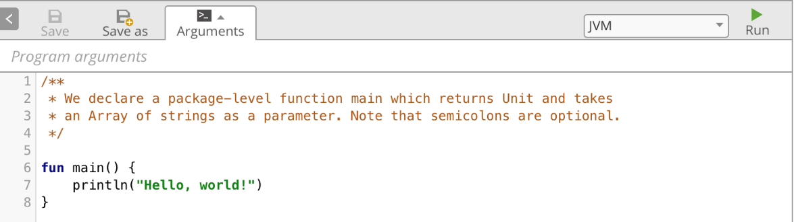

**图 2.1　在线运行 Kotlin 的网站**

只要点击一下右上方的“Run”按钮就可以运行这段 Kotlin 代码了，非常简单。但是在线运行 Kotlin 代码有一个很大的缺点，就是使用国内的网络访问这个网站特别慢，而且经常打不开，因此为了学习的稳定性着想，我们也不准备使用这种方法。

第三种方法是使用 Android Studio。遗憾的是，Android Studio 作为一个专门用于开发 Android 应用程序的工具，只能创建 Android 项目，不能创建 Kotlin 项目。但是没有关系，我们可以随便打开一个 Android 项目，在里面编写一个 Kotlin 的 `main()` 函数，就可以独立运行 Kotlin 代码了。

这里就直接打开上一章创建的 HelloWorld 项目吧，首先找到 MainActivity 所在的位置，如图 2.2 所示。


**图 2.2　HelloWorld 项目结构**

接下来在 MainActivity 的同级包结构下创建一个 LearnKotlin 文件。右击 com.example.helloworld 包 →New→Kotlin File/Class，在弹出的对话框中输入“LearnKotlin”，如图 2.3 所示。点击“OK”即可完成创建。


**图 2.3　新建 Kotlin 文件对话框**

接下来，我们在这个 LearnKotlin 文件中编写一个 `main()` 函数，并打印一行日志，如图 2.4 所示。


**图 2.4　一段最简单的 Kotlin 代码**

你会发现，`main()` 函数的左边出现了一个运行标志的小箭头。现在我们只要点击一下这个小箭头，并且选择第一个 Run 选项，就可以运行这段 Kotlin 代码了。运行结果会在 Android Studio 下方的 Run 标签中显示，如图 2.5 所示。

​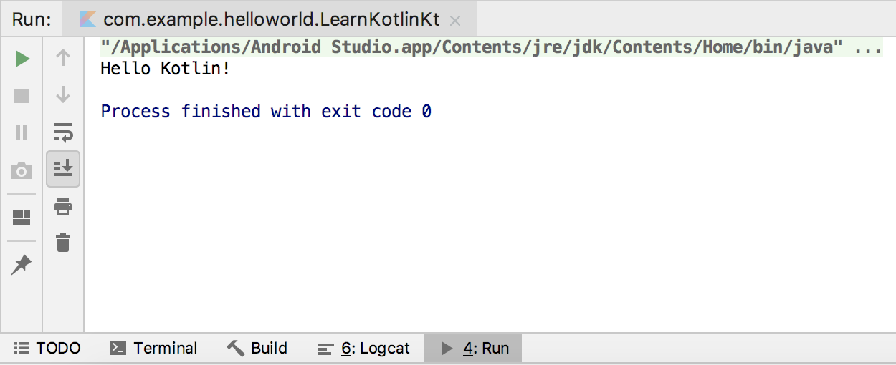​

**图 2.5　代码的运行结果**

可以看到，这里成功打印出了 Hello Kotlin!这句话，这说明我们的代码执行成功了。

可能你会问，上一章刚刚说到打印日志尽量不要使用 `println()`，而是应该使用 Log，为什么这里却还是使用了 `println()` 呢？这是因为 Log 是 Android 中提供的日志工具类，而我们现在是独立运行的 Kotlin 代码，和 Android 无关，所以自然是无法使用 Log 的。

这就是在 Android Studio 中独立运行 Kotlin 代码的方法，后面我们都会使用这种方法来对本章所学的内容进行运行和测试。那么接下来，就让我们正式进入 Kotlin 的学习吧。

## 2.3　编程之本：变量和函数

编程语言之多，让人眼花缭乱。你可能不知道，世界上一共诞生过 600 多门有记录的编程语言，没有记录的那就更多了。这些编程语言基本上共有的特性就是变量和函数。可以说，变量和函数就是编程语言之本。那么本节我们就来学习一下 Kotlin 中变量和函数的用法。

### 2.3.1　变量

先来学习变量。在 Kotlin 中定义变量的方式和 Java 区别很大，在 Java 中如果想要定义一个变量，需要在变量前面声明这个变量的类型，比如说 `int a` 表示 `a` 是一个整型变量，`String b` 表示 `b` 是一个字符串变量。而 Kotlin 中定义一个变量，只允许在变量前声明两种关键字：`val` 和 `var`。

`val`（value 的简写）用来声明一个不可变的变量，这种变量在初始赋值之后就再也不能重新赋值，对应 Java 中的 `final` 变量。

`var`（variable 的简写）用来声明一个可变的变量，这种变量在初始赋值之后仍然可以再被重新赋值，对应 Java 中的非 `final` 变量。

如果你有 Java 编程经验的话，可能会在这里产生疑惑，仅仅使用 `val` 或者 `var` 来声明一个变量，那么编译器怎么能知道这个变量是什么类型呢？这也是 Kotlin 比较有特色的一点，它拥有出色的类型推导机制。

举个例子，我们打开上一节创建的 LearnKotlin 文件，在 `main()` 函数中编写如下代码：

```kotlin
fun main() {
    val a = 10
    println("a = " + a)
}
```

注意，Kotlin 每一行代码的结尾是不用加分号的，如果你写惯了 Java 的话，在这里得先熟悉一下。

在上述代码中，我们使用 `val` 关键字定义了一个变量 `a`，并将它赋值为 10，这里 `a` 就会被自动推导成整型变量。因为既然你要把一个整数赋值给 `a`，那么 `a` 就只能是整型变量，而如果你要把一个字符串赋值给 `a` 的话，那么 `a` 就会被自动推导成字符串变量，这就是 Kotlin 的类型推导机制。

现在我们运行一下 `main()` 函数，执行结果如图 2.6 所示，正是我们所预期的。

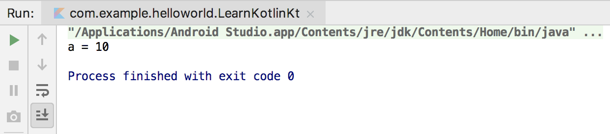

**图 2.6　打印变量 a 的值**

但是 Kotlin 的类型推导机制并不总是可以正常工作的，比如说如果我们对一个变量延迟赋值的话，Kotlin 就无法自动推导它的类型了。这时候就需要显式地声明变量类型才行，Kotlin 提供了对这一功能的支持，语法如下所示：

```Kotlin
val a: Int = 10
```

可以看到，我们显式地声明了变量 `a` 为 `Int` 类型，此时 Kotlin 就不会再尝试进行类型推导了。如果现在你尝试将一个字符串赋值给 `a`，那么编译器就会抛出类型不匹配的异常。

如果你学过 Java 并且足够细心的话，你可能发现了 Kotlin 中 `Int` 的首字母是大写的，而 Java 中 `int` 的首字母是小写的。不要小看这一个字母大小写的差距，这表示 Kotlin 完全抛弃了 Java 中的基本数据类型，全部使用了对象数据类型。在 Java 中 `int` 是关键字，而在 Kotlin 中 `Int` 变成了一个类，它拥有自己的方法和继承结构。表 2.1 中列出了 Java 中的每一个基本数据类型在 Kotlin 中对应的对象数据类型。

**表 2.1　Java 和 Kotlin 数据类型对照表**

|Java 基本数据类型|Kotlin 对象数据类型|数据类型说明|
| -----------------| -------------------| ------------|
|`int`|`Int`|整型|
|`long`|`Long`|长整型|
|`short`|`Short`|短整型|
|`float`|`Float`|单精度浮点型|
|`double`|`Double`|双精度浮点型|
|`boolean`|`Boolean`|布尔型|
|`char`|`Char`|字符型|
|`byte`|`Byte`|字节型|

接下来我们尝试对变量 `a` 进行一些数学运算，比如说让 `a` 变大 10 倍，可能你会很自然地写出如下代码：

```Kotlin
fun main() {
    val a: Int = 10
    a = a * 10
    println("a = " + a)
}
```

很遗憾，如果你这样写的话，编译器一定会提示一个错误：Val cannot be reassigned。这是在告诉我们，使用 `val` 关键字声明的变量无法被重新赋值。出现这个问题的原因是我们在一开始定义 `a` 的时候将它赋值成了 10，然后又在下一行让它变大 10 倍，这个时候就是对 `a` 进行重新赋值了，因而编译器也就报错了。

解决这个问题的办法也很简单，前面已经提到了，`val` 关键字用来声明一个不可变的变量，而 `var` 关键字用来声明一个可变的变量，所以这里只需要把 `val` 改成 `var` 即可，如下所示：

```Kotlin
fun main() {
    var a: Int = 10
    a = a * 10
    println("a = " + a)
}
```

现在编译器就不会再报错了，重新运行一下代码，结果如图 2.7 所示。

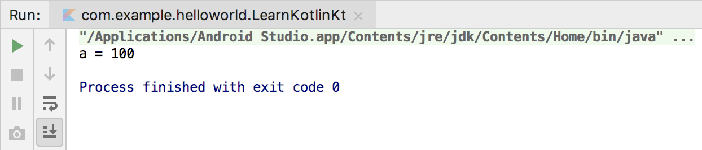

**图 2.7　打印变量 a 乘以 10 的结果**

可以看到，`a` 的值变成了 100，这说明我们的数学运算操作成功了。

这里你可能会产生疑惑：既然 `val` 关键字有这么多的束缚，为什么还要用这个关键字呢？干脆全部用 `var` 关键字不就好了。其实 Kotlin 之所以这样设计，是为了解决 Java 中 `final` 关键字没有被合理使用的问题。

在 Java 中，除非你主动在变量前声明了 `final` 关键字，否则这个变量就是可变的。然而这并不是一件好事，当项目变得越来越复杂，参与开发的人越来越多时，你永远不知道一个可变的变量会在什么时候被谁给修改了，即使它原本不应该被修改，这就经常会导致出现一些很难排查的问题。因此，一个好的编程习惯是，除非一个变量明确允许被修改，否则都应该给它加上 `final` 关键字。

但是，不是每个人都能养成这种良好的编程习惯。我相信至少有 90% 的 Java 程序员没有主动在变量前加上 `final` 关键字的意识，仅仅因为 Java 对此是不强制的。因此，Kotlin 在设计的时候就采用了和 Java 完全不同的方式，提供了 `val` 和 `var` 这两个关键字，必须由开发者主动声明该变量是可变的还是不可变的。

那么我们应该什么时候使用 `val`，什么时候使用 `var` 呢？这里我告诉你一个小诀窍，就是永远优先使用 `val` 来声明一个变量，而当 `val` 没有办法满足你的需求时再使用 `var`。这样设计出来的程序会更加健壮，也更加符合高质量的编码规范。

### 2.3.2　函数

不少刚接触编程的人对于函数和方法这两个概念有些混淆，不明白它们有什么区别。其实，函数和方法就是同一个概念，这两种叫法都是从英文翻译过来的，函数翻译自 function，方法翻译自 method，它们并没有什么区别，只是不同语言的叫法习惯不一样而已。而因为 Java 中方法的叫法更普遍一些，Kotlin 中函数的叫法更普遍一些，因此本书里可能会交叉使用两种叫法，你只要知道它们是同一种东西就可以了，不用在这个地方产生疑惑。

函数是用来运行代码的载体，你可以在一个函数里编写很多行代码，当运行这个函数时，函数中的所有代码会全部运行。像我们前面使用过的 `main()` 函数就是一个函数，只不过它比较特殊，是程序的入口函数，即程序一旦运行，就是从 `main()` 函数开始执行的。

但是只有一个 `main()` 函数的程序显然是很初级的，和其他编程语言一样，Kotlin 也允许我们自由地定义函数，语法规则如下：

```Kotlin
fun methodName(param1: Int, param2: Int): Int {
    return 0
}
```

下面我来解释一下上述的语法规则，首先 `fun`（function 的简写）是定义函数的关键字，无论你定义什么函数，都一定要使用 `fun` 来声明。

紧跟在 `fun` 后面的是函数名，这个就没有什么要求了，你可以根据自己的喜好起任何名字，但是良好的编程习惯是函数名最好要有一定的意义，能表达这个函数的作用是什么。

函数名后面紧跟着一对括号，里面可以声明该函数接收什么参数，参数的数量可以是任意多个，例如上述示例就表示该函数接收两个 `Int` 类型的参数。参数的声明格式是“`参数名: 参数类型`”，其中参数名也是可以随便定义的，这一点和函数名类似。如果不想接收任何参数，那么写一对空括号就可以了。

参数括号后面的那部分是可选的，用于声明该函数会返回什么类型的数据，上述示例就表示该函数会返回一个 `Int` 类型的数据。如果你的函数不需要返回任何数据，这部分可以直接不写。

最后两个大括号之间的内容就是函数体了，我们可以在这里编写一个函数的具体逻辑。由于上述示例中声明了该函数会返回一个 `Int` 类型的数据，因此在函数体中我们简单地返回了一个 0。

这就是定义一个函数最标准的方式了，虽然 Kotlin 中还有许多其他修饰函数的关键字，但是只要掌握了上述函数定义规则，你就已经能应对 80% 以上的编程场景了，至于其他的关键字，我们会在后面慢慢学习。

接下来我们尝试按照上述定义函数的语法规则来定义一个有意义的函数，如下所示：

```Kotlin
fun largerNumber(num1: Int, num2: Int): Int {
    return max(num1, num2)
}
```

这里定义了一个名叫 `largerNumber()` 的函数，该函数的作用很简单，接收两个整型参数，然后总是返回两个参数中更大的那个数。

注意，上述代码中使用了一个 `max()` 函数，这是 Kotlin 提供的一个内置函数，它的作用就是返回两个参数中更大的那个数，因此我们的 `largerNumber()` 函数其实就是对 `max()` 函数做了一层封装而已。

现在你可以开始在 LearnKotlin 文件中实现 `largerNumber()` 这个函数了，当你输入“max”这个单词时，Android Studio 会自动弹出如图 2.8 所示的代码提示。

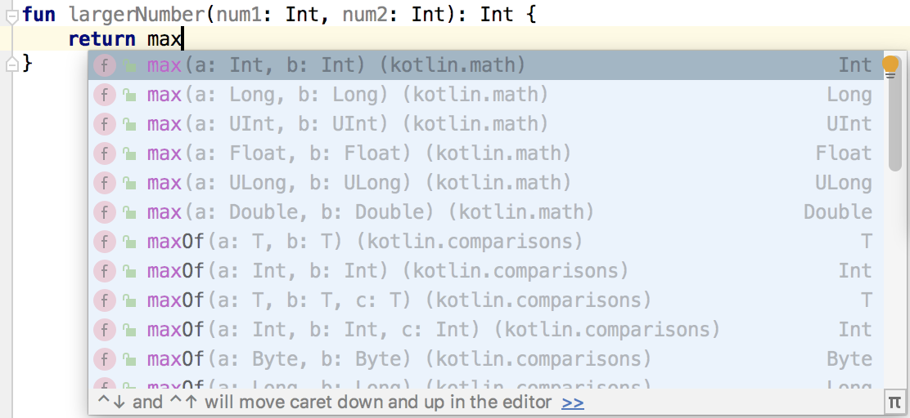

**图 2.8　Android Studio 的代码提示**

Android Studio 拥有非常智能的代码提示和补全功能，通常你只需要键入部分代码，它就能自动预测你想要编写的内容，并给出相应的提示列表。我们可以通过上下键在提示列表中移动，然后按下“Enter”键，Android Studio 就会自动帮我们进行代码补全了。

这里我非常建议你经常使用 Android Studio 的代码补全功能，可能有些人觉得全部手敲更有成就感，但是我要提醒一句，使用代码补全功能后，Android Studio 不仅会帮我们补全代码，还会帮我们自动导包，这一点是很重要的。比如说上述的 `max()` 函数，如果你全部手敲出来，那么这个函数一定会提示一个红色的错误，如图 2.9 所示。

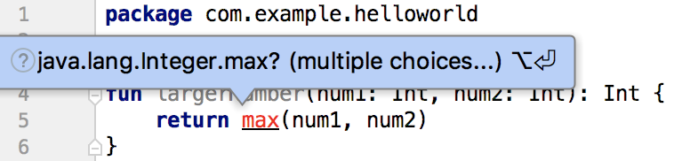

**图 2.9** **`max()`**  **函数提示错误**

出现这个错误的原因是你没有导入 `max()` 函数的包。当然，导包的方法也有很多种，你将光标移动到这个红色的错误上面就能看到导包的快捷键提示，但是最好的做法就是使用 Android Studio 的代码补全功能，这样导包工作就自动完成了。

现在我们使用代码补全功能再来编写一次 `max()` 函数，你会发现 LearnKotlin 文件的头部自动导入了一个 `max()` 函数的包，并且不会再有错误提示了，如图 2.10 所示。


**图 2.10　自动导入** **`max()`**  **函数的包**

导包实际上属于 Java 的基础知识，但是鉴于本书上一版出版后，有小部分读者反馈按照书上的代码编写之后却提示错误，其实就是没有正确导包导致的，因此这里我特意加上了 Android Studio 代码补全功能的说明，希望你后面可以多多利用这个功能，就再也没有导包的困扰了。

现在 `largerNumber()` 函数已经编写好了，接下来我们可以尝试在 `main()` 函数中调用这个函数，并且实现在两个数中找到较大的那个数这样一个简单的功能，代码如下所示：

```Kotlin
fun main() {
    val a = 37
    val b = 40
    val value = largerNumber(a, b)
    println("larger number is " + value)
}

fun largerNumber(num1: Int, num2: Int): Int {
    return max(num1, num2)
}
```

这段代码很简单，我们定义了 `a`、`b` 两个变量，`a` 的值是 37，`b` 的值是 40，然后调用 `largerNumber()` 函数，并将 `a`、`b` 作为参数传入。`largerNumber()` 函数会返回这两个变量中较大的那个数，最后将返回值打印出来。现在运行一下代码，结果如图 2.11 所示。程序正如我们预期的那样运行了。


**图 2.11　调用** **`largerNumber()`**  **函数的运行结果**

这就是 Kotlin 中最基本也是最常用的函数用法，虽然这里我们实现的 `largerNumber()` 函数很简单，但是掌握了函数的定义规则之后，你想实现多么复杂的函数都是可以的。

在本小节的最后，我们再来学习一个 Kotlin 函数的语法糖，这个语法糖在以后的开发中会起到相当重要的作用。

当一个函数中只有一行代码时，Kotlin 允许我们不必编写函数体，可以直接将唯一的一行代码写在函数定义的尾部，中间用等号连接即可。比如我们刚才编写的 `largerNumber()` 函数就只有一行代码，于是可以将代码简化成如下形式：

```Kotlin
fun largerNumber(num1: Int, num2: Int): Int = max(num1, num2)
```

使用这种语法，`return` 关键字也可以省略了，等号足以表达返回值的意思。另外，还记得 Kotlin 出色的类型推导机制吗？在这里它也可以发挥重要的作用。由于 `max()` 函数返回的是一个 `Int` 值，而我们在 `largerNumber()` 函数的尾部又使用等号连接了 `max()` 函数，因此 Kotlin 可以推导出 `largerNumber()` 函数返回的必然也是一个 `Int` 值，这样就不用再显式地声明返回值类型了，代码可以进一步简化成如下形式：

```Kotlin
fun largerNumber(num1: Int, num2: Int) = max(num1, num2)
```

可能你会觉得，函数只有一行代码的情况并不多嘛，这个语法糖也不会很常用吧？其实并不是这样的，因为它还可以结合 Kotlin 的其他语言特性一起使用，对简化代码方面的帮助很大，后面我们会慢慢学习它更多的使用场景。

## 2.4　程序的逻辑控制

程序的执行语句主要分为 3 种：顺序语句、条件语句和循环语句。顺序语句很好理解，就是代码一行一行地往下执行就可以了，但是这种“愣头青”的执行方式在很多情况下并不能满足我们的编程需求，这时就需要引入条件语句和循环语句了，下面我们逐个进行介绍。

### 2.4.1　`if` 条件语句

Kotlin 中的条件语句主要有两种实现方式：`if` 和 `when`。

首先学习 `if`，Kotlin 中的 `if` 语句和 Java 中的 `if` 语句几乎没有任何区别，因此这里我就简单举个例子带你快速了解一下。

还是以上一节中的 `largerNumber()` 函数为例，之前我们借助了 Kotlin 内置的 `max()` 函数来实现返回两个参数中的较大值，但其实这是没有必要的，因为使用 `if` 判断同样可以轻松地实现这个功能。将 `largerNumber()` 函数的实现改成如下写法：

```Kotlin
fun largerNumber(num1: Int, num2: Int): Int {
    var value = 0
    if (num1 > num2) {
        value = num1
    } else {
        value = num2
    }
    return value
}
```

这段代码相信不需要我多做解释，任何有编程基础的人都应该能看得懂。但是有一点我还是得说明一下，这里使用了 `var` 关键字来声明 `value` 这个变量，这是因为初始化的时候我们先将 `value` 赋值为 0，然后再将它赋值为两个参数中更大的那个数，这就涉及了重新赋值，因此必须用 `var` 关键字才行。

到目前为止，Kotlin 中的 `if` 用法和 Java 中是完全一样的。但注意我前面说的是“几乎没有任何区别”。也就是说，它们还是存在不同之处的，那么接下来我们就着重看一下不同的地方。

Kotlin 中的 `if` 语句相比于 Java 有一个额外的功能，它是可以有返回值的，返回值就是 `if` 语句每一个条件中最后一行代码的返回值。因此，上述代码就可以简化成如下形式：

```Kotlin
fun largerNumber(num1: Int, num2: Int): Int {
    val value = if (num1 > num2) {
        num1
    } else {
        num2
    }
    return value
}
```

注意这里的代码变化，`if` 语句使用每个条件的最后一行代码作为返回值，并将返回值赋值给了 `value` 变量。由于现在没有重新赋值的情况了，因此可以使用 `val` 关键字来声明 `value` 变量，最终将 `value` 变量返回。

仔细观察上述代码，你会发现 `value` 其实也是一个多余的变量，我们可以直接将 `if` 语句返回，这样代码将会变得更加精简，如下所示：

```Kotlin
fun largerNumber(num1: Int, num2: Int): Int {
    return if (num1 > num2) {
        num1
    } else {
        num2
    }
}
```

到这里为止，你觉得代码足够精简了吗？确实还不错，但是我们还可以做得更好。回顾一下刚刚在上一节里学过的语法糖，当一个函数只有一行代码时，可以省略函数体部分，直接将这一行代码使用等号串连在函数定义的尾部。虽然上述代码中的 `largerNumber()` 函数不止只有一行代码，但是它和只有一行代码的作用是相同的，只是返回了一下 `if` 语句的返回值而已，符合该语法糖的使用条件。那么我们就可以将代码进一步精简：

```Kotlin
fun largerNumber(num1: Int, num2: Int) = if (num1 > num2) {
    num1
} else {
    num2
}
```

前面我之所以说这个语法糖非常重要，就是因为它除了可以应用于函数只有一行代码的情况，还可以结合 Kotlin 的很多语法来使用，所以它的应用场景非常广泛。

当然，如果你愿意，还可以将上述代码再精简一下，直接压缩成一行代码：

```Kotlin
fun largerNumber(num1: Int, num2: Int) = if (num1 > num2) num1 else num2
```

怎么样？通过一个简单的 `if` 语句，我们挖掘出了 Kotlin 这么多好玩的语法特性，现在你应该能逐渐体会到 Kotlin 的魅力了吧？

### 2.4.2　`when` 条件语句

接下来我们开始学习 `when`。Kotlin 中的 `when` 语句有点类似于 Java 中的 `switch` 语句，但它又远比 `switch` 语句强大得多。

如果你熟悉 Java 的话，应该知道 Java 中的 `switch` 语句并不怎么好用。首先，`switch` 只能传入整型或短于整型的变量作为条件，JDK 1.7 之后增加了对字符串变量的支持，但如果你的判断逻辑使用的并非是上述几种类型的变量，那么不好意思，`switch` 并不适合你。其次，`switch` 中的每个 `case` 条件都要在最后主动加上一个 `break`，否则执行完当前 `case` 之后会依次执行下面的 `case`，这一特性曾经导致过无数奇怪的 bug，就是因为有人忘记添加 `break`。

而 Kotlin 中的 `when` 语句不仅解决了上述痛点，还增加了许多更为强大的新特性，有时候它比 `if` 语句还要简单好用，现在我们就来学习一下吧。

我准备带你编写一个查询考试成绩的功能，输入一个学生的姓名，返回该学生考试的分数。我们先用上一小节学习的 `if` 语句来实现这个功能，在 LearnKotlin 文件中编写如下代码：

```Kotlin
fun getScore(name: String) = if (name == "Tom") {
    86
} else if (name == "Jim") {
    77
} else if (name == "Jack") {
    95
} else if (name == "Lily") {
    100
} else {
    0
}
```

这里定义了一个 `getScore()` 函数，这个函数接收一个学生姓名参数，然后通过 `if` 判断找到该学生对应的考试分数并返回。可以看到，这里再次使用了单行代码函数的语法糖，正如我所说，它真的很常用。

虽然上述代码确实可以实现我们想要的功能，但是写了这么多的 `if` 和 `else`，你有没有觉得代码很冗余？没错，当你的判断条件非常多的时候，就是应该考虑使用 `when` 语句的时候，现在我们将代码改成如下写法：

```Kotlin
fun getScore(name: String) = when (name) {
    "Tom" -> 86
    "Jim" -> 77
    "Jack" -> 95
    "Lily" -> 100
    else -> 0
}
```

怎么样？有没有感觉代码瞬间清爽了很多？另外你可能已经发现了，`when` 语句和 `if` 语句一样，也是可以有返回值的，因此我们仍然可以使用单行代码函数的语法糖。

`when` 语句允许传入一个任意类型的参数，然后可以在 `when` 的结构体中定义一系列的条件，格式是：

```Kotlin
匹配值 -> { 执行逻辑 }
```

当你的执行逻辑只有一行代码时，`{ }` 可以省略。这样再来看上述代码就很好理解了吧？

除了精确匹配之外，`when` 语句还允许进行类型匹配。什么是类型匹配呢？这里我再举个例子。定义一个 `checkNumber()` 函数，如下所示：

```Kotlin
fun checkNumber(num: Number) {
    when (num) {
        is Int -> println("number is Int")
        is Double -> println("number is Double")
        else -> println("number not support")
    }
}
```

上述代码中，`is` 关键字就是类型匹配的核心，它相当于 Java 中的 `instanceof` 关键字。由于 `checkNumber()` 函数接收一个 `Number` 类型的参数，这是 Kotlin 内置的一个抽象类，像 `Int`、`Long`、`Float`、`Double` 等与数字相关的类都是它的子类，所以这里就可以使用类型匹配来判断传入的参数到底属于什么类型，如果是 `Int` 型或 `Double` 型，就将该类型打印出来，否则就打印不支持该参数的类型。

现在我们可以尝试在 `main()` 函数中调用 `checkNumber()` 函数，如下所示：

```Kotlin
fun main() {
    val num = 10
    checkNumber(num)
}
```

这里向 `checkNumber()` 函数传入了一个 `Int` 型参数。运行一下程序，结果如图 2.12 所示。


**图 2.12** **`checkNumber()`**  **函数传入** **`Int`** **型参数**

可以看到，这里成功判断出了参数是 `Int` 类型。

而如果我们将参数改为 `Long` 型：

```Kotlin
fun main() {
    val num = 10L
    checkNumber(num)
}
```

重新运行一下程序，结果如图 2.13 所示。

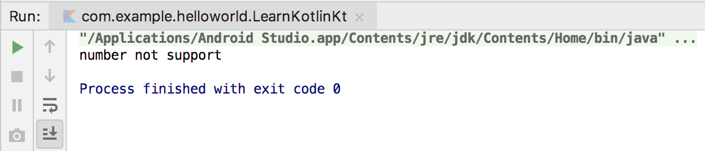

**图 2.13** **`checkNumber()`**  **函数传入** **`Long`** **型参数**

很显然，我们的程序并不支持此类型的参数。

`when` 语句的基本用法就是这些，但其实 `when` 语句还有一种不带参数的用法，虽然这种用法可能不太常用，但有的时候却能发挥很强的扩展性。

拿刚才的 `getScore()` 函数举例，如果我们不在 `when` 语句中传入参数的话，还可以这么写：

```Kotlin
fun getScore(name: String) = when {
    name == "Tom" -> 86
    name == "Jim" -> 77
    name == "Jack" -> 95
    name == "Lily" -> 100
    else -> 0
}
```

可以看到，这种用法是将判断的表达式完整地写在 `when` 的结构体当中。注意，Kotlin 中判断字符串或对象是否相等可以直接使用 `==` 关键字，而不用像 Java 那样调用 `equals()` 方法。可能你会觉得这种无参数的 `when` 语句写起来比较冗余，但有些场景必须使用这种写法才能实现。举个例子，假设所有名字以 Tom 开头的人，他的分数都是 86 分，这种场景如果用带参数的 `when` 语句来写就无法实现，而使用不带参数的 `when` 语句就可以这样写：

```Kotlin
fun getScore(name: String) = when {
    name.startsWith("Tom") -> 86
    name == "Jim" -> 77
    name == "Jack" -> 95
    name == "Lily" -> 100
    else -> 0
}
```

现在不管你传入的名字是 Tom 还是 Tommy，只要是以 Tom 开头的名字，他的分数就是 86 分。

通过这一小节的学习，相信你也发现了，Kotlin 中的 `when` 语句相比于 Java 中的 `switch` 语句要灵活很多，希望你能多写多练，并熟练掌握它的用法。

### 2.4.3　循环语句

学习完了条件语句之后，接下来我们开始学习 Kotlin 中的循环语句。

熟悉 Java 的人应该都知道，Java 中主要有两种循环语句：`while` 循环和 `for` 循环。而 Kotlin 也提供了 `while` 循环和 `for` 循环，其中 `while` 循环不管是在语法还是使用技巧上都和 Java 中的 `while` 循环没有任何区别，因此我们就直接跳过不进行讲解了。如果你没有学过 Java 也没有关系，只要你学过 C、C++ 或其他任何主流的编程语言，它们的 `while` 循环用法基本是相同的。

下面我们开始学习 Kotlin 中的 `for` 循环。

Kotlin 在 `for` 循环方面做了很大幅度的修改，Java 中最常用的 `for-i` 循环在 Kotlin 中直接被舍弃了，而 Java 中另一种 `for-each` 循环则被 Kotlin 进行了大幅度的加强，变成了 `for-in` 循环，所以我们只需要学习 `for-in` 循环的用法就可以了。

在开始学习 `for-in` 循环之前，还得先向你普及一个区间的概念，因为这也是 Java 中没有的东西。我们可以使用如下 Kotlin 代码来表示一个区间：

```Kotlin
val range = 0..10
```

这种语法结构看上去挺奇怪的吧？但在 Kotlin 中，它是完全合法的。上述代码表示创建了一个 0 到 10 的区间，并且两端都是闭区间，这意味着 0 到 10 这两个端点都是包含在区间中的，用数学的方式表达出来就是\[0, 10\]。

其中，`..` 是创建两端闭区间的关键字，在 `..` 的两边指定区间的左右端点就可以创建一个区间了。

有了区间之后，我们就可以通过 `for-in` 循环来遍历这个区间，比如在 `main()` 函数中编写如下代码：

```Kotlin
fun main() {
    for (i in 0..10) {
        println(i)
    }
}
```

这就是 `for-in` 循环最简单的用法了，我们遍历了区间中的每一个元素，并将它打印出来。现在运行一下程序，结果如图 2.14 所示。


**图 2.14　使用** **`for-in`** **循环遍历区间**

但是在很多情况下，双端闭区间却不如单端闭区间好用。为什么这么说呢？相信你一定知道数组的下标都是从 0 开始的，一个长度为 10 的数组，它的下标区间范围是 0 到 9，因此左闭右开的区间在程序设计当中更加常用。Kotlin 中可以使用 `until` 关键字来创建一个左闭右开的区间，如下所示：

```Kotlin
val range = 0 until 10
```

上述代码表示创建了一个 0 到 10 的左闭右开区间，它的数学表达方式是\[0, 10)。修改 `main()` 函数中的代码，使用 `until` 替代 `..` 关键字，你就会发现最后一行 10 不会再打印出来了。

默认情况下，`for-in` 循环每次执行循环时会在区间范围内递增 1，相当于 Java `for-i` 循环中 `i++` 的效果，而如果你想跳过其中的一些元素，可以使用 `step` 关键字：

```Kotlin
fun main() {
    for (i in 0 until 10 step 2) {
        println(i)
    }
}
```

上述代码表示在遍历\[0, 10)这个区间的时候，每次执行循环都会在区间范围内递增 2，相当于 `for-i` 循环中 `i = i + 2` 的效果。现在重新运行一下代码，结果如图 2.15 所示。

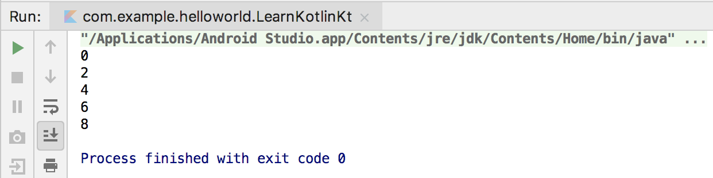

**图 2.15　使用** **`step`** **跳过区间内的元素**

可以看到，现在区间中所有奇数的元素都被跳过了。结合 `step` 关键字，我们就能够实现一些更加复杂的循环逻辑。

不过，前面我们所学习的 `..` 和 `until` 关键字都要求区间的左端必须小于等于区间的右端，也就是这两种关键字创建的都是一个升序的区间。如果你想创建一个降序的区间，可以使用 `downTo` 关键字，用法如下：

```Kotlin
fun main() {
    for (i in 10 downTo 1) {
        println(i)
    }
}
```

这里我们创建了一个\[10, 1\]的降序区间，现在重新运行一下代码，结果如图 2.16 所示。

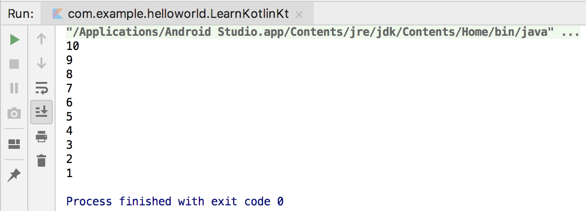

**图 2.16　使用** **`downTo`** **遍历降序区间**

另外，降序区间也是可以结合 `step` 关键字跳过区间中的一些元素的，这里我就不进行演示了，你可以自己动手试一试。

`for-in` 循环除了可以对区间进行遍历之外，还可以用于遍历数组和集合，关于集合这部分内容，我们在本章后面的部分就会学到，到时候再延伸 `for-in` 循环的相关用法。

如果让我总结一下的话，我觉得 `for-in` 循环并没有传统的 `for-i` 循环那样灵活，但是却比 `for-i` 循环要简单好用得多，而且足够覆盖大部分的使用场景。如果有一些特殊场景使用 `for-in` 循环无法实现的话，我们还可以改用 `while` 循环的方式来进行实现。

好了，关于 Kotlin 的循环部分就先讲这么多吧。

## 2.5　面向对象编程

和很多现代高级语言一样，Kotlin 也是面向对象的，因此理解什么是面向对象编程对我们来说就非常重要了。关于面向对象编程的解释，你可以去看很多标准化、概念化的定义，但是我觉得那些定义只有本来就懂的人才能看得懂，而不了解面向对象的人，即使看了那些定义还是不明白什么才是面向对象编程。

因此，这里我想用自己的理解来向你解释什么是面向对象编程。不同于面向过程的语言（比如 C 语言），面向对象的语言是可以创建类的。类就是对事物的一种封装，比如说人、汽车、房屋、书等任何事物，我们都可以将它封装一个类，类名通常是名词。而类中又可以拥有自己的字段和函数，字段表示该类所拥有的属性，比如说人可以有姓名和年龄，汽车可以有品牌和价格，这些就属于类中的字段，字段名通常也是名词。而函数则表示该类可以有哪些行为，比如说人可以吃饭和睡觉，汽车可以驾驶和保养等，函数名通常是动词。

通过这种类的封装，我们就可以在适当的时候创建该类的对象，然后调用对象中的字段和函数来满足实际编程的需求，这就是面向对象编程最基本的思想。当然，面向对象编程还有很多其他特性，如继承、多态等，但是这些特性都是建立在基本的思想之上的，理解了基本思想之后，其他的特性我们可以在后面慢慢学习。

### 2.5.1　类与对象

现在我们就按照刚才所学的基本思想来尝试进行面向对象编程。首先创建一个 `Person` 类。右击 com.example.helloworld 包 →New→Kotlin File/Class，在弹出的对话框中输入“Person”。对话框在默认情况下自动选中的是创建一个 File，File 通常是用于编写 Kotlin 顶层函数和扩展函数的，我们可以点击展开下拉列表进行切换，如图 2.17 所示。

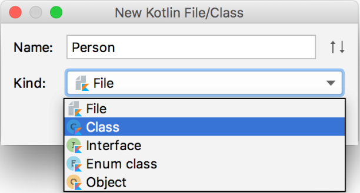

**图 2.17　选择创建的类型**

这里选中 `Class` 表示创建一个类，点击“OK”完成创建，会生成如下所示的代码：

```Kotlin
class Person {
}
```

这是一个空的类实现，可以看到，Kotlin 中也是使用 `class` 关键字来声明一个类的，这一点和 Java 一致。现在我们可以在这个类中加入字段和函数来丰富它的功能，这里我准备加入 `name` 和 `age` 字段，以及一个 `eat()` 函数，因为任何一个人都有名字和年龄，也都需要吃饭。

```Kotlin
class Person {
    var name = ""
    var age = 0

    fun eat() {
        println(name + " is eating. He is " + age + " years old.")
    }
}
```

简单解释一下，这里使用 `var` 关键字创建了 `name` 和 `age` 这两个字段，这是因为我们需要在创建对象之后再指定具体的姓名和年龄，而如果使用 `val` 关键字的话，初始化之后就不能再重新赋值了。接下来定义了一个 `eat()` 函数，并在函数中打印了一句话，非常简单。

`Person` 类已经定义好了，接下来我们看一下如何对这个类进行实例化，代码如下所示：

```Kotlin
val p = Person()
```

Kotlin 中实例化一个类的方式和 Java 是基本类似的，只是去掉了 `new` 关键字而已。之所以这么设计，是因为当你调用了某个类的构造函数时，你的意图只可能是对这个类进行实例化，因此即使没有 `new` 关键字，也能清晰表达出你的意图。Kotlin 本着最简化的设计原则，将诸如 `new`、行尾分号这种不必要的语法结构都取消了。

上述代码将实例化后的类赋值到了 `p` 这个变量上面，`p` 就可以称为 `Person` 类的一个实例，也可以称为一个对象。

下面我们开始在 `main()` 函数中对 `p` 对象进行一些操作：

```Kotlin
fun main() {
    val p = Person()
    p.name = "Jack"
    p.age = 19
    p.eat()
}
```

这里将 `p` 对象的姓名赋值为 Jack，年龄赋值为 19，然后调用它的 `eat()` 函数，运行结果如图 2.18 所示。


**图 2.18** **`eat()`**  **函数的运行结果**

这就是面向对象编程最基本的用法了，简单概括一下，就是要先将事物封装成具体的类，然后将事物所拥有的属性和能力分别定义成类中的字段和函数，接下来对类进行实例化，再根据具体的编程需求调用类中的字段和方法即可。

### 2.5.2　继承与构造函数

现在我们开始学习面向对象编程中另一个极其重要的特性——继承。继承也是基于现实场景总结出来的一个概念，其实非常好理解。比如现在我们要定义一个 `Student` 类，每个学生都有自己的学号和年级，因此我们可以在 `Student` 类中加入 `sno` 和 `grade` 字段。但同时学生也是人呀，学生也会有姓名和年龄，也需要吃饭，如果我们在 `Student` 类中重复定义 `name`、`age` 字段和 `eat()` 函数的话就显得太过冗余了。这个时候就可以让 `Student` 类去继承 `Person` 类，这样 `Student` 就自动拥有了 `Person` 中的字段和函数，另外还可以定义自己独有的字段和函数。

这就是面向对象编程中继承的思想，很好理解吧？接下来我们尝试用 Kotlin 语言实现上述功能。右击 com.example.helloworld 包 →New→Kotlin File/Class，在弹出的对话框中输入“Student”，并选择创建一个 `Class`，你可以通过上下按键快速切换创建类型。

点击“OK”完成创建，并在 `Student` 类中加入学号和年级这两个字段，代码如下所示：

```Kotlin
class Student {
    var sno = ""
    var grade = 0
}
```

现在 `Student` 和 `Person` 这两个类之间是没有任何继承关系的，想要让 `Student` 类继承 `Person` 类，我们得做两件事才行。

第一件事，使 `Person` 类可以被继承。可能很多人会觉得奇怪，尤其是有 Java 编程经验的人。一个类本身不就是可以被继承的吗？为什么还要使 `Person` 类可以被继承呢？这就是 Kotlin 不同的地方，在 Kotlin 中任何一个非抽象类默认都是不可以被继承的，相当于 Java 中给类声明了 `final` 关键字。之所以这么设计，其实和 `val` 关键字的原因是差不多的，因为类和变量一样，最好都是不可变的，而一个类允许被继承的话，它无法预知子类会如何实现，因此可能就会存在一些未知的风险。*Effective Java* 这本书中明确提到，如果一个类不是专门为继承而设计的，那么就应该主动将它加上 `final` 声明，禁止它可以被继承。

很明显，Kotlin 在设计的时候遵循了这条编程规范，默认所有非抽象类都是不可以被继承的。之所以这里一直在说非抽象类，是因为抽象类本身是无法创建实例的，一定要由子类去继承它才能创建实例，因此抽象类必须可以被继承才行，要不然就没有意义了。由于 Kotlin 中的抽象类和 Java 中并无区别，这里我就不再多讲了。

既然现在 `Person` 类是无法被继承的，我们得让它可以被继承才行，方法也很简单，在 `Person` 类的前面加上 `open` 关键字就可以了，如下所示：

```Kotlin
open class Person {
    ...
}
```

加上 `open` 关键字之后，我们就是在主动告诉 Kotlin 编译器，`Person` 这个类是专门为继承而设计的，这样 `Person` 类就允许被继承了。

第二件事，要让 `Student` 类继承 `Person` 类。在 Java 中继承的关键字是 `extends`，而在 Kotlin 中变成了一个冒号，写法如下：

```Kotlin
class Student : Person() {
    var sno = ""
    var grade = 0
}
```

继承的写法如果只是替换一下关键字倒也挺简单的，但是为什么 `Person` 类的后面要加上一对括号呢？Java 中继承的时候好像并不需要括号。对于初学 Kotlin 的人来讲，这对括号确实挺难理解的，也可能是 Kotlin 在这方面设计得太复杂了，因为它还涉及主构造函数、次构造函数等方面的知识，这里我尽量尝试用最简单易懂的讲述来让你理解这对括号的意义和作用，同时顺便学习一下 Kotlin 中的主构造函数和次构造函数。

任何一个面向对象的编程语言都会有构造函数的概念，Kotlin 中也有，但是 Kotlin 将构造函数分成了两种：主构造函数和次构造函数。

主构造函数将会是你最常用的构造函数，每个类默认都会有一个不带参数的主构造函数，当然你也可以显式地给它指明参数。主构造函数的特点是没有函数体，直接定义在类名的后面即可。比如下面这种写法：

```Kotlin
class Student(val sno: String, val grade: Int) : Person() {
}
```

这里我们将学号和年级这两个字段都放到了主构造函数当中，这就表明在对 `Student` 类进行实例化的时候，必须传入构造函数中要求的所有参数。比如：

```Kotlin
val student = Student("a123", 5)
```

这样我们就创建了一个 `Student` 的对象，同时指定该学生的学号是 a123，年级是 5。另外，由于构造函数中的参数是在创建实例的时候传入的，不像之前的写法那样还得重新赋值，因此我们可以将参数全部声明成 `val`。

你可能会问，主构造函数没有函数体，如果我想在主构造函数中编写一些逻辑，该怎么办呢？Kotlin 给我们提供了一个 `init` 结构体，所有主构造函数中的逻辑都可以写在里面：

```Kotlin
class Student(val sno: String, val grade: Int) : Person() {
    init {
        println("sno is " + sno)
        println("grade is " + grade)
    }
}
```

这里我只是简单打印了一下学号和年级的值，现在如果你再去创建一个 `Student` 类的实例，一定会将构造函数中传入的值打印出来。

到这里为止都还挺好理解的吧？但是这和那对括号又有什么关系呢？这就涉及了 Java 继承特性中的一个规定，子类中的构造函数必须调用父类中的构造函数，这个规定在 Kotlin 中也要遵守。

那么回头看一下 `Student` 类，现在我们声明了一个主构造函数，根据继承特性的规定，子类的构造函数必须调用父类的构造函数，可是主构造函数并没有函数体，我们怎样去调用父类的构造函数呢？你可能会说，在 `init` 结构体中去调用不就好了。这或许是一种办法，但绝对不是一种好办法，因为在绝大多数的场景下，我们是不需要编写 `init` 结构体的。

Kotlin 当然没有采用这种设计，而是用了另外一种简单但是可能不太好理解的设计方式：括号。子类的主构造函数调用父类中的哪个构造函数，在继承的时候通过括号来指定。因此再来看一遍这段代码，你应该就能理解了吧。

```Kotlin
class Student(val sno: String, val grade: Int) : Person() {
}
```

在这里，`Person` 类后面的一对空括号表示 `Student` 类的主构造函数在初始化的时候会调用 `Person` 类的无参数构造函数，即使在无参数的情况下，这对括号也不能省略。

而如果我们将 `Person` 改造一下，将姓名和年龄都放到主构造函数当中，如下所示：

```Kotlin
open class Person(val name: String, val age: Int) {
    ...
}
```

此时你的 `Student` 类一定会报错，当然，如果你的 `main()` 函数还保留着之前创建 `Person` 实例的代码，那么这里也会报错，但是它和我们接下来要讲的内容无关，你可以自己修正一下，或者干脆直接删掉这部分代码。

现在回到 `Student` 类当中，它一定会提示如图 2.19 所示的错误。


**图 2.19　Student 类提示错误**

这里出现错误的原因也很明显，`Person` 类后面的空括号表示要去调用 `Person` 类中无参的构造函数，但是 `Person` 类现在已经没有无参的构造函数了，所以就提示了上述错误。

如果我们想解决这个错误的话，就必须给 `Person` 类的构造函数传入 `name` 和 `age` 字段，可是 `Student` 类中也没有这两个字段呀。很简单，没有就加呗。我们可以在 `Student` 类的主构造函数中加上 `name` 和 `age` 这两个参数，再将这两个参数传给 `Person` 类的构造函数，代码如下所示：

```Kotlin
class Student(val sno: String, val grade: Int, name: String, age: Int) :
    Person(name, age) {
    ...
}
```

注意，我们在 `Student` 类的主构造函数中增加 `name` 和 `age` 这两个字段时，不能再将它们声明成 `val`，因为在主构造函数中声明成 `val` 或者 `var` 的参数将自动成为该类的字段，这就会导致和父类中同名的 `name` 和 `age` 字段造成冲突。因此，这里的 `name` 和 `age` 参数前面我们不用加任何关键字，让它的作用域仅限定在主构造函数当中即可。

现在就可以通过如下代码来创建一个 `Student` 类的实例：

```Kotlin
val student = Student("a123", 5, "Jack", 19)
```

学到这里，我们就将 Kotlin 的主构造函数基本掌握了，是不是觉得继承时的这对括号问题也不是那么难以理解？但是，Kotlin 在括号这个问题上的复杂度并不仅限于此，因为我们还没涉及 Kotlin 构造函数中的另一个组成部分——次构造函数。

其实你几乎是用不到次构造函数的，Kotlin 提供了一个给函数设定参数默认值的功能，基本上可以替代次构造函数的作用，我们会在本章最后学习这部分内容。但是考虑到知识结构的完整性，我决定还是介绍一下次构造函数的相关知识，顺便探讨一下括号问题在次构造函数上的区别。

你要知道，任何一个类只能有一个主构造函数，但是可以有多个次构造函数。次构造函数也可以用于实例化一个类，这一点和主构造函数没有什么不同，只不过它是有函数体的。

Kotlin 规定，当一个类既有主构造函数又有次构造函数时，所有的次构造函数都必须调用主构造函数（包括间接调用）。这里我通过一个具体的例子就能简单阐明，代码如下：

```Kotlin
class Student(val sno: String, val grade: Int, name: String, age: Int) :
         Person(name, age) {
    constructor(name: String, age: Int) : this("", 0, name, age) {
    }

    constructor() : this("", 0) {
    }
}
```

次构造函数是通过 `constructor` 关键字来定义的，这里我们定义了两个次构造函数：第一个次构造函数接收 `name` 和 `age` 参数，然后它又通过 `this` 关键字调用了主构造函数，并将 `sno` 和 `grade` 这两个参数赋值成初始值；第二个次构造函数不接收任何参数，它通过 `this` 关键字调用了我们刚才定义的第一个次构造函数，并将 `name` 和 `age` 参数也赋值成初始值，由于第二个次构造函数间接调用了主构造函数，因此这仍然是合法的。

那么现在我们就拥有了 3 种方式来对 `Student` 类进行实体化，分别是通过不带参数的构造函数、通过带两个参数的构造函数和通过带 4 个参数的构造函数，对应代码如下所示：

```Kotlin
val student1 = Student()
val student2 = Student("Jack", 19)
val student3 = Student("a123", 5, "Jack", 19)
```

这样我们就将次构造函数的用法掌握得差不多了，但是到目前为止，继承时的括号问题还没有进一步延伸，暂时和之前学过的场景是一样的。

那么接下来我们就再来看一种非常特殊的情况：类中只有次构造函数，没有主构造函数。这种情况真的十分少见，但在 Kotlin 中是允许的。当一个类没有显式地定义主构造函数且定义了次构造函数时，它就是没有主构造函数的。我们结合代码来看一下：

```Kotlin
class Student : Person {
    constructor(name: String, age: Int) : super(name, age) {
    }
}
```

注意这里的代码变化，首先 `Student` 类的后面没有显式地定义主构造函数，同时又因为定义了次构造函数，所以现在 `Student` 类是没有主构造函数的。那么既然没有主构造函数，继承 `Person` 类的时候也就不需要再加上括号了。其实原因就是这么简单，只是很多人在刚开始学习 Kotlin 的时候没能理解这对括号的意义和规则，因此总感觉继承的写法有时候要加上括号，有时候又不要加，搞得晕头转向的，而在你真正理解了规则之后，就会发现其实还是很好懂的。

另外，由于没有主构造函数，次构造函数只能直接调用父类的构造函数，上述代码也是将 `this` 关键字换成了 `super` 关键字，这部分就很好理解了，因为和 Java 比较像，我也就不再多说了。

这一小节我们对 Kotlin 的继承和构造函数的问题探究得比较深，同时这也是很多人新上手 Kotlin 时比较难理解的部分，希望你能好好掌握这部分内容。

### 2.5.3　接口

上一小节的内容比较长，也偏复杂一些，可能学起来有些辛苦。本小节的内容就简单多了，因为 Kotlin 中的接口部分和 Java 几乎是完全一致的。

接口是用于实现多态编程的重要组成部分。我们都知道，Java 是单继承结构的语言，任何一个类最多只能继承一个父类，但是却可以实现任意多个接口，Kotlin 也是如此。

我们可以在接口中定义一系列的抽象行为，然后由具体的类去实现。下面还是通过具体的代码来学习一下，首先创建一个 `Study` 接口，并在其中定义几个学习行为。右击 com.example.helloworld 包 →New→Kotlin File/Class，在弹出的对话框中输入“Study”，创建类型选择“Interface”。

然后在 `Study` 接口中添加几个学习相关的函数，注意接口中的函数不要求有函数体，代码如下所示：

```Kotlin
interface Study {
    fun readBooks()
    fun doHomework()
}
```

接下来就可以让 `Student` 类去实现 `Study` 接口了，这里我将 `Student` 类原有的代码调整了一下，以突出继承父类和实现接口的区别：

```Kotlin
class Student(name: String, age: Int) : Person(name, age), Study {
    override fun readBooks() {
        println(name + " is reading.")
    }

    override fun doHomework() {
        println(name + " is doing homework.")
    }
}
```

熟悉 Java 的人一定知道，Java 中继承使用的关键字是 `extends`，实现接口使用的关键字是 `implements`，而 Kotlin 中统一使用冒号，中间用逗号进行分隔。上述代码就表示 `Student` 类继承了 `Person` 类，同时还实现了 `Study` 接口。另外接口的后面不用加上括号，因为它没有构造函数可以去调用。

`Study` 接口中定义了 `readBooks()` 和 `doHomework()` 这两个待实现函数，因此 `Student` 类必须实现这两个函数。Kotlin 中使用 `override` 关键字来重写父类或者实现接口中的函数，这里我们只是简单地在实现的函数中打印了一行日志。

现在我们可以在 `main()` 函数中编写如下代码来调用这两个接口中的函数：

```Kotlin
fun main() {
    val student = Student("Jack", 19)
    doStudy(student)
}

fun doStudy(study: Study) {
    study.readBooks()
    study.doHomework()
}
```

这里为了向你演示一下多态编程的特性，我故意将代码写得复杂了一点。首先创建了一个 `Student` 类的实例，本来是可以直接调用该实例的 `readBooks()` 和 `doHomework()` 函数的，但是我没有这么做，而是将它传入到了 `doStudy()` 函数中。`doStudy()` 函数接收一个 `Study` 类型的参数，由于 `Student` 类实现了 `Study` 接口，因此 `Student` 类的实例是可以传递给 `doStudy()` 函数的，接下来我们调用了 `Study` 接口的 `readBooks()` 和 `doHomework()` 函数，这种就叫作面向接口编程，也可以称为多态。

现在运行一下代码，结果如图 2.20 所示。

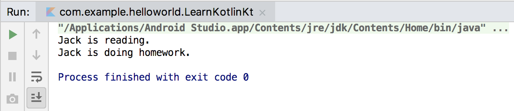

**图 2.20　调用接口中的函数**

这样我们就将 Kotlin 中接口的用法基本学完了，是不是很简单？不过为了让接口的功能更加灵活，Kotlin 还增加了一个额外的功能：允许对接口中定义的函数进行默认实现。其实 Java 在 JDK 1.8 之后也开始支持这个功能了，因此总体来说，Kotlin 和 Java 在接口方面的功能仍然是一模一样的。

下面我们学习一下如何对接口中的函数进行默认实现，修改 `Study` 接口中的代码，如下所示：

```Kotlin
interface Study {
    fun readBooks()

    fun doHomework() {
        println("do homework default implementation.")
    }
}
```

可以看到，我们给 `doHomework()` 函数加上了函数体，并且在里面打印了一行日志。如果接口中的一个函数拥有了函数体，这个函数体中的内容就是它的默认实现。现在当一个类去实现 `Study` 接口时，只会强制要求实现 `readBooks()` 函数，而 `doHomework()` 函数则可以自由选择实现或者不实现，不实现时就会自动使用默认的实现逻辑。

现在回到 `Student` 类当中，你会发现如果我们删除了 `doHomework()` 函数，代码是不会提示错误的，而删除 `readBooks()` 函数则不行。当删除了 `doHomework()` 函数之后，重新运行 `main()` 函数，结果如图 2.21 所示。可以看到，程序正如我们所预期的那样运行了。


**图 2.21　调用接口的默认实现函数**

现在你已经掌握了 Kotlin 面向对象编程中最主要的一些内容，接下来我们再学习一个和 Java 相比变化比较大的部分——函数的可见性修饰符。

熟悉 Java 的人一定知道，Java 中有 `public`、`private`、`protected` 和 `default`（什么都不写）这 4 种函数可见性修饰符。Kotlin 中也有 4 种，分别是 `public`、`private`、`protected` 和 `internal`，需要使用哪种修饰符时，直接定义在 `fun` 关键字的前面即可。下面我详细介绍一下 Java 和 Kotlin 中这些函数可见性修饰符的异同。

首先 `private` 修饰符在两种语言中的作用是一模一样的，都表示只对当前类内部可见。`public` 修饰符的作用虽然也是一致的，表示对所有类都可见，但是在 Kotlin 中 `public` 修饰符是默认项，而在 Java 中 `default` 才是默认项。前面我们定义了那么多的函数，都没有加任何的修饰符，所以它们默认都是 `public` 的。`protected` 关键字在 Java 中表示对当前类、子类和同一包路径下的类可见，在 Kotlin 中则表示只对当前类和子类可见。Kotlin 抛弃了 Java 中的 `default` 可见性（同一包路径下的类可见），引入了一种新的可见性概念，只对同一模块中的类可见，使用的是 `internal` 修饰符。比如我们开发了一个模块给别人使用，但是有一些函数只允许在模块内部调用，不想暴露给外部，就可以将这些函数声明成 `internal`。关于模块开发的内容，我们会在本书的最后一章学习。

表 2.2 更直观地对比了 Java 和 Kotlin 中函数可见性修饰符之间的区别。

**表 2.2　Java 和 Kotlin 函数可见性修饰符对照表**

|修饰符|Java|Kotlin|
| ------| ----------------------------------| ------------------|
|`public`|所有类可见|所有类可见（默认）|
|`private`|当前类可见|当前类可见|
|`protected`|当前类、子类、同一包路径下的类可见|当前类、子类可见|
|`default`|同一包路径下的类可见（默认）|无|
|`internal`|无|同一模块中的类可见|

### 2.5.4　数据类与单例类

在面向对象编程这一节，我们已经学习了很多的知识，那么在本节的最后我们再来了解几个 Kotlin 中特有的知识点，从而圆满完成本节的学习任务。

在一个规范的系统架构中，数据类通常占据着非常重要的角色，它们用于将服务器端或数据库中的数据映射到内存中，为编程逻辑提供数据模型的支持。或许你听说过 MVC、MVP、MVVM 之类的架构模式，不管是哪一种架构模式，其中的 M 指的就是数据类。

数据类通常需要重写 `equals()`、`hashCode()`、`toString()` 这几个方法。其中，`equals()` 方法用于判断两个数据类是否相等。`hashCode()` 方法作为 `equals()` 的配套方法，也需要一起重写，否则会导致 `HashMap`、`HashSet` 等 `hash` 相关的系统类无法正常工作。`toString()` 方法用于提供更清晰的输入日志，否则一个数据类默认打印出来的就是一行内存地址。

这里我们新构建一个手机数据类，字段就简单一点，只有品牌和价格这两个字段。如果使用 Java 来实现这样一个数据类，代码就需要这样写：

```Kotlin
public class Cellphone {
    String brand;
    double price;

    public Cellphone(String brand, double price) {
        this.brand = brand;
        this.price = price;
    }

    @Override
    public boolean equals(Object obj) {
        if (obj instanceof Cellphone) {
            Cellphone other = (Cellphone) obj;
            return other.brand.equals(brand) && other.price == price;
        }
        return false;
    }

    @Override
    public int hashCode() {
        return brand.hashCode() + (int) price;
    }

    @Override
    public String toString() {
        return "Cellphone(brand=" + brand + ", price=" + price + ")";
    }
}
```

看上去挺复杂的吧？关键是这些代码还是一些没有实际逻辑意义的代码，只是为了让它拥有数据类的功能而已。而同样的功能使用 Kotlin 来实现就会变得极其简单，右击 com.example.helloworld 包 →New→Kotlin File/Class，在弹出的对话框中输入“Cellphone”，创建类型选择“Class”。然后在创建的类中编写如下代码：

```Kotlin
data class Cellphone(val brand: String, val price: Double)
```

你没看错，只需要一行代码就可以实现了！神奇的地方就在于 `data` 这个关键字，当在一个类前面声明了 `data` 关键字时，就表明你希望这个类是一个数据类，Kotlin 会根据主构造函数中的参数帮你将 `equals()`、`hashCode()`、`toString()` 等固定且无实际逻辑意义的方法自动生成，从而大大减少了开发的工作量。

另外，当一个类中没有任何代码时，还可以将尾部的大括号省略。

下面我们来测试一下这个数据类，在 `main()` 函数中编写如下代码：

```Kotlin
fun main() {
    val cellphone1 = Cellphone("Samsung", 1299.99)
    val cellphone2 = Cellphone("Samsung", 1299.99)
    println(cellphone1)
    println("cellphone1 equals cellphone2 " + (cellphone1 == cellphone2))
}
```

这里我们创建了两个 `Cellphone` 对象，首先直接将第一个对象打印出来，然后判断这两个对象是否相等。运行一下程序，结果如图 2.22 所示。

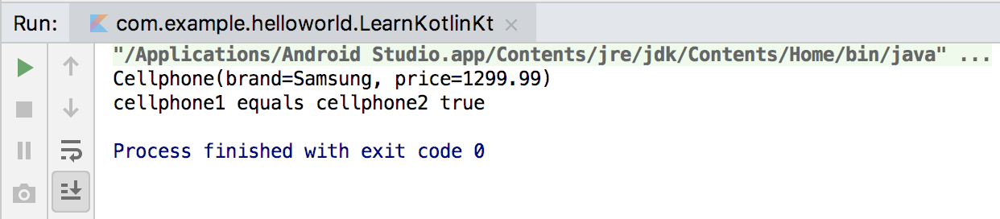

**图 2.22　测试** **`Cellphone`** **数据类的结果**

很明显，`Cellphone` 数据类已经正常工作了。而如果 `Cellphone` 类前面没有 `data` 这个关键字，得到的会是截然不同的结果。如果感兴趣的话，你可以自己动手尝试一下。

掌握了数据类的使用技巧之后，接下来我们再来看另外一个 Kotlin 中特有的功能——单例类。

想必你一定听说过单例模式吧，这是最常用、最基础的设计模式之一，它可以用于避免创建重复的对象。比如我们希望某个类在全局最多只能拥有一个实例，这时就可以使用单例模式。当然单例模式也有很多种写法，这里就演示一种最常见的 Java 写法吧：

```Kotlin
public class Singleton {
    private static Singleton instance;

    private Singleton() {}

    public synchronized static Singleton getInstance() {
        if (instance == null) {
            instance = new Singleton();
        }
        return instance;
    }

    public void singletonTest() {
        System.out.println("singletonTest is called.");
    }
}
```

这段代码其实很好理解，首先为了禁止外部创建 `Singleton` 的实例，我们需要用 `private` 关键字将 `Singleton` 的构造函数私有化，然后给外部提供了一个 `getInstance()` 静态方法用于获取 `Singleton` 的实例。在 `getInstance()` 方法中，我们判断如果当前缓存的 `Singleton` 实例为 `null`，就创建一个新的实例，否则直接返回缓存的实例即可，这就是单例模式的工作机制。

而如果我们想调用单例类中的方法，也很简单，比如想调用上述的 `singletonTest()` 方法，就可以这样写：

```Kotlin
Singleton singleton = Singleton.getInstance();
singleton.singletonTest();
```

虽然 Java 中的单例实现并不复杂，但是 Kotlin 明显做得更好，它同样是将一些固定的、重复的逻辑实现隐藏了起来，只暴露给我们最简单方便的用法。

在 Kotlin 中创建一个单例类的方式极其简单，只需要将 `class` 关键字改成 `object` 关键字即可。现在我们尝试创建一个 Kotlin 版的 `Singleton` 单例类，右击 com.example.helloworld 包 →New→Kotlin File/Class，在弹出的对话框中输入“Singleton”，创建类型选择“Object”，点击“OK”完成创建，初始代码如下所示：

```Kotlin
object Singleton {
}
```

现在 `Singleton` 就已经是一个单例类了，我们可以直接在这个类中编写需要的函数，比如加入一个 `singletonTest()` 函数：

```Kotlin
object Singleton {
    fun singletonTest() {
        println("singletonTest is called.")
    }
}
```

可以看到，在 Kotlin 中我们不需要私有化构造函数，也不需要提供 `getInstance()` 这样的静态方法，只需要把 `class` 关键字改成 `object` 关键字，一个单例类就创建完成了。而调用单例类中的函数也很简单，比较类似于 Java 中静态方法的调用方式：

```Kotlin
Singleton.singletonTest()
```

这种写法虽然看上去像是静态方法的调用，但其实 Kotlin 在背后自动帮我们创建了一个 `Singleton` 类的实例，并且保证全局只会存在一个 `Singleton` 实例。

这样我们就将 Kotlin 面向对象编程最主要的知识掌握了，这也是非常充实的一节内容，希望你能好好掌握和消化。要知道，你往后的编程工作基本上是建立在面向对象编程的基础之上的。

## 2.6　Lambda 编程

可能很多 Java 程序员对于 Lambda 编程还比较陌生，但其实这并不是什么新鲜的技术。许多现代高级编程语言在很早之前就开始支持 Lambda 编程了，但是 Java 却直到 JDK 1.8 之后才加入了 Lambda 编程的语法支持。因此，大量早期开发的 Java 和 Android 程序其实并未使用 Lambda 编程的特性。

而 Kotlin 从第一个版本开始就支持了 Lambda 编程，并且 Kotlin 中的 Lambda 功能极为强大，我甚至认为 Lambda 才是 Kotlin 的灵魂所在。不过，本章只是 Kotlin 的入门章节，我不可能在这短短一节里就将 Lambda 的方方面面全部覆盖。因此，这一节我们只学习一些 Lambda 编程的基础知识，而像高阶函数、DSL 等高级 Lambda 技巧，我们会在本书的后续章节慢慢学习。

### 2.6.1　集合的创建与遍历

集合的函数式 API 是用来入门 Lambda 编程的绝佳示例，不过在此之前，我们得先学习创建集合的方式才行。

传统意义上的集合主要就是 `List` 和 `Set`，再广泛一点的话，像 `Map` 这样的键值对数据结构也可以包含进来。`List`、`Set` 和 `Map` 在 Java 中都是接口，`List` 的主要实现类是 `ArrayList` 和 `LinkedList`，`Set` 的主要实现类是 `HashSet`，`Map` 的主要实现类是 `HashMap`，熟悉 Java 的人对这些集合的实现类一定不会陌生。

现在我们提出一个需求，创建一个包含许多水果名称的集合。如果是在 Java 中你会怎么实现？可能你首先会创建一个 `ArrayList` 的实例，然后将水果的名称一个个添加到集合中。当然，在 Kotlin 中也可以这么做：

```Kotlin
val list = ArrayList<String>()
list.add("Apple")
list.add("Banana")
list.add("Orange")
list.add("Pear")
list.add("Grape")
```

但是这种初始化集合的方式比较烦琐，为此 Kotlin 专门提供了一个内置的 `listOf()` 函数来简化初始化集合的写法，如下所示：

```Kotlin
val list = listOf("Apple", "Banana", "Orange", "Pear", "Grape")
```

可以看到，这里仅用一行代码就完成了集合的初始化操作。

还记得我们在学习循环语句时提到过的吗？`for-in` 循环不仅可以用来遍历区间，还可以用来遍历集合。现在我们就尝试一下使用 `for-in` 循环来遍历这个水果集合，在 `main()` 函数中编写如下代码：

```Kotlin
fun main() {
    val list = listOf("Apple", "Banana", "Orange", "Pear", "Grape")
    for (fruit in list) {
        println(fruit)
    }
}
```

运行一下代码，结果如图 2.23 所示。

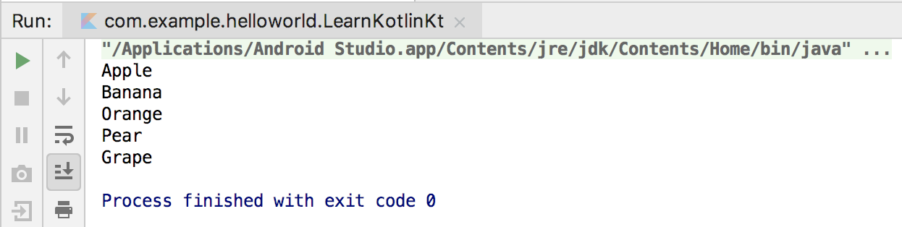

**图 2.23　对集合进行遍历**

不过需要注意的是，`listOf()` 函数创建的是一个不可变的集合。你也许不太能理解什么叫作不可变的集合，因为在 Java 中这个概念不太常见。不可变的集合指的就是该集合只能用于读取，我们无法对集合进行添加、修改或删除操作。

至于这么设计的理由，和 `val` 关键字、类默认不可继承的设计初衷是类似的，可见 Kotlin 在不可变性方面控制得极其严格。那如果我们确实需要创建一个可变的集合呢？也很简单，使用 `mutableListOf()` 函数就可以了，示例如下：

```Kotlin
fun main() {
    val list = mutableListOf("Apple", "Banana", "Orange", "Pear", "Grape")
    list.add("Watermelon")
    for (fruit in list) {
        println(fruit)
    }
}
```

这里先使用 `mutableListOf()` 函数创建一个可变的集合，然后向集合中添加了一个新的水果，最后再使用 `for-in` 循环对集合进行遍历。现在重新运行一下代码，结果如图 2.24 所示。

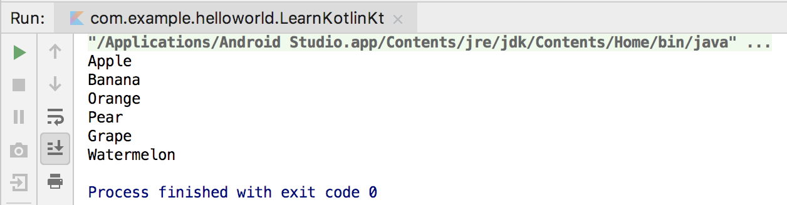

**图 2.24　对可变集合进行遍历**

可以看到，新添加到集合中的水果已经被成功打印出来了。

前面我们介绍的都是 `List` 集合的用法，实际上 `Set` 集合的用法几乎与此一模一样，只是将创建集合的方式换成了 `setOf()` 和 `mutableSetOf()` 函数而已。大致代码如下：

```Kotlin
val set = setOf("Apple", "Banana", "Orange", "Pear", "Grape")
for (fruit in set) {
    println(fruit)
}
```

需要注意，`Set` 集合中是不可以存放重复元素的，如果存放了多个相同的元素，只会保留其中一份，这是和 `List` 集合最大的不同之处。当然这部分知识属于数据结构相关的内容，这里就不展开讨论了。

最后再来看一下 `Map` 集合的用法。`Map` 是一种键值对形式的数据结构，因此在用法上和 `List`、`Set` 集合有较大的不同。传统的 `Map` 用法是先创建一个 `HashMap` 的实例，然后将一个个键值对数据添加到 `Map` 中。比如这里我们给每种水果设置一个对应的编号，就可以这样写：

```Kotlin
val map = HashMap<String, Int>()
map.put("Apple", 1)
map.put("Banana", 2)
map.put("Orange", 3)
map.put("Pear", 4)
map.put("Grape", 5)
```

我之所以先用这种写法，是因为这种写法和 Java 语法是最相似的，因此可能最好理解。但其实在 Kotlin 中并不建议使用 `put()` 和 `get()` 方法来对 `Map` 进行添加和读取数据操作，而是更加推荐使用一种类似于数组下标的语法结构，比如向 `Map` 中添加一条数据就可以这么写：

```Kotlin
map["Apple"] = 1
```

而从 `Map` 中读取一条数据就可以这么写：

```Kotlin
val number = map["Apple"]
```

因此，上述代码经过优化过后就可以变成如下形式：

```Kotlin
val map = HashMap<String, Int>()
map["Apple"] = 1
map["Banana"] = 2
map["Orange"] = 3
map["Pear"] = 4
map["Grape"] = 5
```

当然，这仍然不是最简便的写法，因为 Kotlin 毫无疑问地提供了一对 `mapOf()` 和 `mutableMapOf()` 函数来继续简化 `Map` 的用法。在 `mapOf()` 函数中，我们可以直接传入初始化的键值对组合来完成对 `Map` 集合的创建：

```Kotlin
val map = mapOf("Apple" to 1, "Banana" to 2, "Orange" to 3, "Pear" to 4, "Grape" to 5)
```

这里的键值对组合看上去好像是使用 `to` 这个关键字来进行关联的，但其实 `to` 并不是关键字，而是一个 `infix` 函数，我们会在本书第 9 章的 Kotlin 课堂中深入探究 `infix` 函数的相关内容。

最后再来看一下如何遍历 `Map` 集合中的数据吧，其实使用的仍然是 `for-in` 循环。在 `main()` 函数中编写如下代码：

```Kotlin
fun main() {
    val map = mapOf("Apple" to 1, "Banana" to 2, "Orange" to 3, "Pear" to 4, "Grape" to 5)
    for ((fruit, number) in map) {
        println("fruit is " + fruit + ", number is " + number)
    }
}
```

这段代码主要的区别在于，在 `for-in` 循环中，我们将 `Map` 的键值对变量一起声明到了一对括号里面，这样当进行循环遍历时，每次遍历的结果就会赋值给这两个键值对变量，最后将它们的值打印出来。重新运行一下代码，结果如图 2.25 所示。


**图 2.25　遍历** **`Map`** **中的数据**

好了，关于集合的创建与遍历就学到这里，接下来我们开始学习集合的函数式 API，从而正式入门 Lambda 编程。

### 2.6.2　集合的函数式 API

集合的函数式 API 有很多个，这里我并不打算带你涉猎所有函数式 API 的用法，而是重点学习函数式 API 的语法结构，也就是 Lambda 表达式的语法结构。

首先我们来思考一个需求，如何在一个水果集合里面找到单词最长的那个水果？当然这个需求很简单，也有很多种写法，你可能会很自然地写出如下代码：

```Kotlin
val list = listOf("Apple", "Banana", "Orange", "Pear", "Grape", "Watermelon")
var maxLengthFruit = ""
for (fruit in list) {
    if (fruit.length > maxLengthFruit.length) {
        maxLengthFruit = fruit
    }
}
println("max length fruit is " + maxLengthFruit)
```

这段代码很简洁，思路也很清晰，可以说是一段相当不错的代码了。但是如果我们使用集合的函数式 API，就可以让这个功能变得更加容易：

```Kotlin
val list = listOf("Apple", "Banana", "Orange", "Pear", "Grape", "Watermelon")
val maxLengthFruit = list.maxBy { it.length }
println("max length fruit is " + maxLengthFruit)
```

上述代码使用的就是函数式 API 的用法，只用一行代码就能找到集合中单词最长的那个水果。或许你现在理解这段代码还比较吃力，那是因为我们还没有开始学习 Lambda 表达式的语法结构，等学完之后再来重新看这段代码时，你就会觉得非常简单易懂了。

首先来看一下 Lambda 的定义，如果用最直白的语言来阐述的话，Lambda 就是一小段可以作为参数传递的代码。从定义上看，这个功能就很厉害了，因为正常情况下，我们向某个函数传参时只能传入变量，而借助 Lambda 却允许传入一小段代码。这里两次使用了“一小段代码”这种描述，那么到底多少代码才算一小段代码呢？Kotlin 对此并没有进行限制，但是通常不建议在 Lambda 表达式中编写太长的代码，否则可能会影响代码的可读性。

接着我们来看一下 Lambda 表达式的语法结构：

```json
{参数名1: 参数类型, 参数名2: 参数类型 -> 函数体}
```

这是 Lambda 表达式最完整的语法结构定义。首先最外层是一对大括号，如果有参数传入到 Lambda 表达式中的话，我们还需要声明参数列表，参数列表的结尾使用一个 `->` 符号，表示参数列表的结束以及函数体的开始，函数体中可以编写任意行代码（虽然不建议编写太长的代码），并且最后一行代码会自动作为 Lambda 表达式的返回值。

当然，在很多情况下，我们并不需要使用 Lambda 表达式完整的语法结构，而是有很多种简化的写法。但是简化版的写法对于初学者而言更难理解，因此这里我准备使用一步步推导演化的方式，向你展示这些简化版的写法是从何而来的，这样你就能对 Lambda 表达式的语法结构理解得更加深刻了。那么接下来我们就由繁入简开始吧。

还是回到刚才找出最长单词水果的需求，前面使用的函数式 API 的语法结构看上去好像很特殊，但其实 `maxBy` 就是一个普通的函数而已，只不过它接收的是一个 Lambda 类型的参数，并且会在遍历集合时将每次遍历的值作为参数传递给 Lambda 表达式。`maxBy` 函数的工作原理是根据我们传入的条件来遍历集合，从而找到该条件下的最大值，比如说想要找到单词最长的水果，那么条件自然就应该是单词的长度了。

理解了 `maxBy` 函数的工作原理之后，我们就可以开始套用刚才学习的 Lambda 表达式的语法结构，并将它传入到 `maxBy` 函数中了，如下所示：

```Kotlin
val list = listOf("Apple", "Banana", "Orange", "Pear", "Grape", "Watermelon")
val lambda = { fruit: String -> fruit.length }
val maxLengthFruit = list.maxBy(lambda)
```

可以看到，`maxBy` 函数实质上就是接收了一个 Lambda 参数而已，并且这个 Lambda 参数是完全按照刚才学习的表达式的语法结构来定义的，因此这段代码应该算是比较好懂的。

这种写法虽然可以正常工作，但是比较啰嗦，可简化的点也非常多，下面我们就开始对这段代码一步步进行简化。

首先，我们不需要专门定义一个 `lambda` 变量，而是可以直接将 `lambda` 表达式传入 `maxBy` 函数当中，因此第一步简化如下所示：

```Kotlin
val maxLengthFruit = list.maxBy({ fruit: String -> fruit.length })
```

然后 Kotlin 规定，当 Lambda 参数是函数的最后一个参数时，可以将 Lambda 表达式移到函数括号的外面，如下所示：

```Kotlin
val maxLengthFruit = list.maxBy() { fruit: String -> fruit.length }
```

接下来，如果 Lambda 参数是函数的唯一一个参数的话，还可以将函数的括号省略：

```Kotlin
val maxLengthFruit = list.maxBy { fruit: String -> fruit.length }
```

这样代码看起来就变得清爽多了吧？但是我们还可以继续进行简化。由于 Kotlin 拥有出色的类型推导机制，Lambda 表达式中的参数列表其实在大多数情况下不必声明参数类型，因此代码可以进一步简化成：

```Kotlin
val maxLengthFruit = list.maxBy { fruit -> fruit.length }
```

最后，当 Lambda 表达式的参数列表中只有一个参数时，也不必声明参数名，而是可以使用 `it` 关键字来代替，那么代码就变成了：

```Kotlin
val maxLengthFruit = list.maxBy { it.length }
```

怎么样？通过一步步推导的方式，我们就得到了和一开始那段函数式 API 一模一样的写法，是不是现在理解起来就非常轻松了呢？

正如本小节开头所说的，这里我们重点学习的是函数式 API 的语法结构，理解了语法结构之后，集合中的各种其他函数式 API 都是可以快速掌握的。

接下来我们就再来学习几个集合中比较常用的函数式 API，相信这些对于现在的你来说，应该是没有什么困难的。

集合中的 `map` 函数是最常用的一种函数式 API，它用于将集合中的每个元素都映射成一个另外的值，映射的规则在 Lambda 表达式中指定，最终生成一个新的集合。比如，这里我们希望让所有的水果名都变成大写模式，就可以这样写：

```Kotlin
fun main() {
    val list = listOf("Apple", "Banana", "Orange", "Pear", "Grape", "Watermelon")
    val newList = list.map { it.toUpperCase() }
    for (fruit in newList) {
        println(fruit)
    }
}
```

可以看到，我们在 `map` 函数的 Lambda 表达式中指定将单词转换成了大写模式，然后遍历这个新生成的集合。运行一下代码，结果如图 2.26 所示。


**图 2.26　将水果名都转换成大写模式**

`map` 函数的功能非常强大，它可以按照我们的需求对集合中的元素进行任意的映射转换，上面只是一个简单的示例而已。除此之外，你还可以将水果名全部转换成小写，或者是只取单词的首字母，甚至是转换成单词长度这样一个数字集合，只要在 Lambda 表示式中编写你需要的逻辑即可。

接下来我们再来学习另外一个比较常用的函数式 API——`filter` 函数。顾名思义，`filter` 函数是用来过滤集合中的数据的，它可以单独使用，也可以配合刚才的 `map` 函数一起使用。

比如我们只想保留 5 个字母以内的水果，就可以借助 `filter` 函数来实现，代码如下所示：

```Kotlin
fun main() {
    val list = listOf("Apple", "Banana", "Orange", "Pear", "Grape", "Watermelon")
    val newList = list.filter { it.length <= 5 }
                      .map { it.toUpperCase() }
    for (fruit in newList) {
        println(fruit)
    }
}
```

可以看到，这里同时使用了 `filter` 和 `map` 函数，并通过 Lambda 表示式将水果单词长度限制在 5 个字母以内。重新运行一下代码，结果如图 2.27 所示。

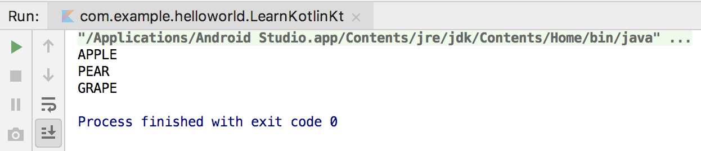

**图 2.27　对水果单词长度进行过滤**

另外值得一提的是，上述代码中我们是先调用了 `filter` 函数再调用 `map` 函数。如果你改成先调用 `map` 函数再调用 `filter` 函数，也能实现同样的效果，但是效率就会差很多，因为这样相当于要对集合中所有的元素都进行一次映射转换后再进行过滤，这是完全不必要的。而先进行过滤操作，再对过滤后的元素进行映射转换，就会明显高效得多。

接下来我们继续学习两个比较常用的函数式 API——`any` 和 `all` 函数。其中 `any` 函数用于判断集合中是否至少存在一个元素满足指定条件，`all` 函数用于判断集合中是否所有元素都满足指定条件。由于这两个函数都很好理解，我们就直接通过代码示例学习了：

```Kotlin
fun main() {
    val list = listOf("Apple", "Banana", "Orange", "Pear", "Grape", "Watermelon")
    val anyResult = list.any { it.length <= 5 }
    val allResult = list.all { it.length <= 5 }
    println("anyResult is " + anyResult + ", allResult is " + allResult)
}
```

这里还是在 Lambda 表达式中将条件设置为 5 个字母以内的单词，那么 `any` 函数就表示集合中是否存在 5 个字母以内的单词，而 `all` 函数就表示集合中是否所有单词都在 5 个字母以内。现在重新运行一下代码，结果如图 2.28 所示。


**图 2.28** **`any`** **和** **`all`** **函数的执行结果**

这样我们就将 Lambda 表达式的语法结构和几个常用的函数式 API 的用法都学习完了，虽然集合中还有许多其他函数式 API，但是只要掌握了基本的语法规则，其他函数式 API 的用法只要看一看文档就能掌握了，相信这对你来说并不是难事。

### 2.6.3　Java 函数式 API 的使用

现在我们已经学习了 Kotlin 中函数式 API 的用法，但实际上在 Kotlin 中调用 Java 方法时也可以使用函数式 API，只不过这是有一定条件限制的。具体来讲，如果我们在 Kotlin 代码中调用了一个 Java 方法，并且该方法接收一个 Java 单抽象方法接口参数，就可以使用函数式 API。Java 单抽象方法接口指的是接口中只有一个待实现方法，如果接口中有多个待实现方法，则无法使用函数式 API。

如果你觉得上面的描述有些模糊的话，没关系，下面我们通过一个具体的例子来学习一下，你就能明白了。Java 原生 API 中有一个最为常见的单抽象方法接口——`Runnable` 接口。这个接口中只有一个待实现的 `run()` 方法，定义如下：

```Kotlin
public interface Runnable {
    void run();
}
```

根据前面的讲解，对于任何一个 Java 方法，只要它接收 `Runnable` 参数，就可以使用函数式 API。那么什么 Java 方法接收了 `Runnable` 参数呢？这就有很多了，不过 `Runnable` 接口主要还是结合线程来一起使用的，因此这里我们就通过 Java 的线程类 `Thread` 来学习一下。

`Thread` 类的构造方法中接收了一个 `Runnable` 参数，我们可以使用如下 Java 代码创建并执行一个子线程：

```Kotlin
new Thread(new Runnable() {
    @Override
    public void run() {
        System.out.println("Thread is running");
    }
}).start();
```

注意，这里使用了匿名类的写法，我们创建了一个 `Runnable` 接口的匿名类实例，并将它传给了 `Thread` 类的构造方法，最后调用 `Thread` 类的 `start()` 方法执行这个线程。

而如果直接将这段代码翻译成 Kotlin 版本，写法将如下所示：

```Kotlin
Thread(object : Runnable {
    override fun run() {
        println("Thread is running")
    }
}).start()
```

Kotlin 中匿名类的写法和 Java 有一点区别，由于 Kotlin 完全舍弃了 `new` 关键字，因此创建匿名类实例的时候就不能再使用 `new` 了，而是改用了 `object` 关键字。这种写法虽然算不上复杂，但是相比于 Java 的匿名类写法，并没有什么简化之处。

但是别忘了，目前 `Thread` 类的构造方法是符合 Java 函数式 API 的使用条件的，下面我们就看看如何对代码进行精简，如下所示：

```Kotlin
Thread(Runnable {
    println("Thread is running")
}).start()
```

这段代码明显简化了很多，既可以实现同样的功能，又不会造成任何歧义。因为 `Runnable` 类中只有一个待实现方法，即使这里没有显式地重写 `run()` 方法，Kotlin 也能自动明白 `Runnable` 后面的 Lambda 表达式就是要在 `run()` 方法中实现的内容。

另外，如果一个 Java 方法的参数列表中有且仅有一个 Java 单抽象方法接口参数，我们还可以将接口名进行省略，这样代码就变得更加精简了：

```Kotlin
Thread({
    println("Thread is running")
}).start()
```

不过到这里还没有结束，和之前 Kotlin 中函数式 API 的用法类似，当 Lambda 表达式是方法的最后一个参数时，可以将 Lambda 表达式移到方法括号的外面。同时，如果 Lambda 表达式还是方法的唯一一个参数，还可以将方法的括号省略，最终简化结果如下：

```Kotlin
Thread {
    println("Thread is running")
}.start()
```

如果你将上述代码写到 `main()` 函数中并执行，就会得到如图 2.29 所示的结果。


**图 2.29　Java 函数式 API 的运行结果**

或许你会觉得，既然本书中所有的代码都是使用 Kotlin 编写的，这种 Java 函数式 API 应该并不常用吧？其实并不是这样的，因为我们后面要经常打交道的 Android SDK 还是使用 Java 语言编写的，当我们在 Kotlin 中调用这些 SDK 接口时，就很可能会用到这种 Java 函数式 API 的写法。

举个例子，Android 中有一个极为常用的点击事件接口 `OnClickListener`，其定义如下：

```Kotlin
public interface OnClickListener {
    void onClick(View v);
}
```

可以看到，这又是一个单抽象方法接口。假设现在我们拥有一个按钮 `button` 的实例，然后使用 Java 代码去注册这个按钮的点击事件，需要这么写：

```Kotlin
button.setOnClickListener(new View.OnClickListener() {
    @Override
    public void onClick(View v) {
    }
});
```

而用 Kotlin 代码实现同样的功能，就可以使用函数式 API 的写法来对代码进行简化，结果如下：

```Kotlin
button.setOnClickListener {
}
```

可以看到，使用这种写法，代码明显精简了很多。这段给按钮注册点击事件的代码，我们在正式开始学习 Android 程序开发之后将会经常用到。

最后提醒你一句，本小节中学习的 Java 函数式 API 的使用都限定于从 Kotlin 中调用 Java 方法，并且单抽象方法接口也必须是用 Java 语言定义的。你可能会好奇为什么要这样设计。这是因为 Kotlin 中有专门的高阶函数来实现更加强大的自定义函数式 API 功能，从而不需要像 Java 这样借助单抽象方法接口来实现。关于高阶函数的用法，我们会在本书的第 6 章进行学习。

## 2.7　空指针检查

我之前看过某国外机构做的一个统计，Android 系统上崩溃率最高的异常类型就是空指针异常（NullPointerException）。相信不只是 Android，其他系统上也面临着相同的问题。若要分析其根本原因的话，我觉得主要是因为空指针是一种不受编程语言检查的运行时异常，只能由程序员主动通过逻辑判断来避免，但即使是最出色的程序员，也不可能将所有潜在的空指针异常全部考虑到。

我们来看一段非常简单的 Java 代码：

```Kotlin
public void doStudy(Study study) {
    study.readBooks();
    study.doHomework();
}
```

这是我们在 2.5.3 小节编写过的一个 `doStudy()` 方法，我将它翻译成了 Java 版。这段代码没有任何复杂的逻辑，只是接收了一个 `Study` 参数，并且调用了参数的 `readBooks()` 和 `doHomework()` 方法。

这段代码安全吗？不一定，因为这要取决于调用方传入的参数是什么，如果我们向 `doStudy()` 方法传入了一个 `null` 参数，那么毫无疑问这里就会发生空指针异常。因此，更加稳妥的做法是在调用参数的方法之前先进行一个判空处理，如下所示：

```Kotlin
public void doStudy(Study study) {
    if (study != null) {
        study.readBooks();
        study.doHomework();
    }
}
```

这样就能保证不管传入的参数是什么，这段代码始终都是安全的。

由此可以看出，即使是如此简单的一小段代码，都有产生空指针异常的潜在风险，那么在一个大型项目中，想要完全规避空指针异常几乎是不可能的事情，这也是它高居各类崩溃排行榜首位的原因。

### 2.7.1　可空类型系统

然而，Kotlin 却非常科学地解决了这个问题，它利用编译时判空检查的机制几乎杜绝了空指针异常。虽然编译时判空检查的机制有时候会导致代码变得比较难写，但是不用担心，Kotlin 提供了一系列的辅助工具，让我们能轻松地处理各种判空情况。下面我们就逐步开始学习吧。

还是回到刚才的 `doStudy()` 函数，现在将这个函数再翻译回 Kotlin 版本，代码如下所示：

```Kotlin
fun doStudy(study: Study) {
    study.readBooks()
    study.doHomework()
}
```

这段代码看上去和刚才的 Java 版本并没有什么区别，但实际上它是没有空指针风险的，因为 Kotlin 默认所有的参数和变量都不可为空，所以这里传入的 `Study` 参数也一定不会为空，我们可以放心地调用它的任何函数。如果你尝试向 `doStudy()` 函数传入一个 `null` 参数，则会提示如图 2.30 所示的错误。


**图 2.30　向** **`doStudy()`**  **方法传入** **`null`** **参数**

也就是说，Kotlin 将空指针异常的检查提前到了编译时期，如果我们的程序存在空指针异常的风险，那么在编译的时候会直接报错，修正之后才能成功运行，这样就可以保证程序在运行时期不会出现空指针异常了。

看到这里，你可能产生了巨大的疑惑，所有的参数和变量都不可为空？这可真是前所未闻的事情，那如果我们的业务逻辑就是需要某个参数或者变量为空该怎么办呢？不用担心，Kotlin 提供了另外一套可为空的类型系统，只不过在使用可为空的类型系统时，我们需要在编译时期就将所有潜在的空指针异常都处理掉，否则代码将无法编译通过。

那么可为空的类型系统是什么样的呢？很简单，就是在类名的后面加上一个问号。比如，`Int` 表示不可为空的整型，而 `Int?` 就表示可为空的整型；`String` 表示不可为空的字符串，而 `String?` 就表示可为空的字符串。

回到刚才的 `doStudy()` 函数，如果我们希望传入的参数可以为空，那么就应该将参数的类型由 `Study` 改成 `Study?`，如图 2.31 所示。


**图 2.31　允许** **`Study`** **参数为空**

可以看到，现在在调用 `doStudy()` 函数时传入 `null` 参数，就不会再提示错误了。然而你会发现，在 `doStudy()` 函数中调用参数的 `readBooks()` 和 `doHomework()` 方法时，却出现了一个红色下滑线的错误提示，这又是为什么呢？

其实原因也很明显，由于我们将参数改成了可为空的 `Study?` 类型，此时调用参数的 `readBooks()` 和 `doHomework()` 方法都可能造成空指针异常，因此 Kotlin 在这种情况下不允许编译通过。

那么该如何解决呢？很简单，只要把空指针异常都处理掉就可以了，比如做个判断处理，如下所示：

```Kotlin
fun doStudy(study: Study?) {
    if (study != null) {
        study.readBooks()
        study.doHomework()
    }
}
```

现在代码就可以正常编译通过了，并且还能保证完全不会出现空指针异常。

其实学到这里，我们就已经基本掌握了 Kotlin 的可空类型系统以及空指针检查的机制，但是为了在编译时期就处理掉所有的空指针异常，通常需要编写很多额外的检查代码才行。如果每处检查代码都使用 `if` 判断语句，则会让代码变得比较啰嗦，而且 `if` 判断语句还处理不了全局变量的判空问题。为此，Kotlin 专门提供了一系列的辅助工具，使开发者能够更轻松地进行判空处理，下面我们就来逐个学习一下。

### 2.7.2　判空辅助工具

首先学习最常用的 `?.` 操作符。这个操作符的作用非常好理解，就是当对象不为空时正常调用相应的方法，当对象为空时则什么都不做。比如以下的判空处理代码：

```Kotlin
if (a != null) {
    a.doSomething()
}
```

这段代码使用 `?.` 操作符就可以简化成：

```Kotlin
a?.doSomething()
```

了解了 `?.` 操作符的作用，下面我们来看一下如何使用这个操作符对 `doStudy()` 函数进行优化，代码如下所示：

```Kotlin
fun doStudy(study: Study?) {
    study?.readBooks()
    study?.doHomework()
}
```

可以看到，这样我们就借助 `?.` 操作符将 `if` 判断语句去掉了。可能你会觉得使用 `if` 语句来进行判空处理也没什么复杂的，那是因为目前的代码还非常简单，当以后我们开发的功能越来越复杂，需要判空的对象也越来越多的时候，你就会觉得 `?.` 操作符特别好用了。

下面我们再来学习另外一个非常常用的 `?:` 操作符。这个操作符的左右两边都接收一个表达式，如果左边表达式的结果不为空就返回左边表达式的结果，否则就返回右边表达式的结果。观察如下代码：

```Kotlin
val c = if (a ! = null) {
    a
} else {
    b
}
```

这段代码的逻辑使用 `?:` 操作符就可以简化成：

```Kotlin
val c = a ?: b
```

接下来我们通过一个具体的例子来结合使用 `?.` 和 `?:` 这两个操作符，从而让你加深对它们的理解。

比如现在我们要编写一个函数用来获得一段文本的长度，使用传统的写法就可以这样写：

```Kotlin
fun getTextLength(text: String?): Int {
    if (text != null) {
        return text.length
    }
    return 0
}
```

由于文本是可能为空的，因此我们需要先进行一次判空操作，如果文本不为空就返回它的长度，如果文本为空就返回 0。

这段代码看上去也并不复杂，但是我们却可以借助操作符让它变得更加简单，如下所示：

```Kotlin
fun getTextLength(text: String?) = text?.length ?: 0
```

这里我们将 `?.` 和 `?:` 操作符结合到了一起使用，首先由于 `text` 是可能为空的，因此我们在调用它的 `length` 字段时需要使用 `?.` 操作符，而当 `text` 为空时，`text?.length` 会返回一个 `null` 值，这个时候我们再借助 `?:` 操作符让它返回 0。怎么样，是不是觉得这些操作符越来越好用了呢？

不过 Kotlin 的空指针检查机制也并非总是那么智能，有的时候我们可能从逻辑上已经将空指针异常处理了，但是 Kotlin 的编译器并不知道，这个时候它还是会编译失败。

观察如下的代码示例：

```Kotlin
var content: String? = "hello"

fun main() {
    if (content != null) {
        printUpperCase()
    }
}

fun printUpperCase() {
    val upperCase = content.toUpperCase()
    println(upperCase)
}
```

这里我们定义了一个可为空的全局变量 `content`，然后在 `main()` 函数里先进行一次判空操作，当 `content` 不为空的时候才会调用 `printUpperCase()` 函数，在 `printUpperCase()` 函数里，我们将 `content` 转换为大写模式，最后打印出来。

看上去好像逻辑没什么问题，但是很遗憾，这段代码一定是无法运行的。因为 `printUpperCase()` 函数并不知道外部已经对 `content` 变量进行了非空检查，在调用 `toUpperCase()` 方法时，还认为这里存在空指针风险，从而无法编译通过。

在这种情况下，如果我们想要强行通过编译，可以使用非空断言工具，写法是在对象的后面加上 `!!`，如下所示：

```Kotlin
fun printUpperCase() {
    val upperCase = content!!.toUpperCase()
    println(upperCase)
}
```

这是一种有风险的写法，意在告诉 Kotlin，我非常确信这里的对象不会为空，所以不用你来帮我做空指针检查了，如果出现问题，你可以直接抛出空指针异常，后果由我自己承担。

虽然这样编写代码确实可以通过编译，但是当你想要使用非空断言工具的时候，最好提醒一下自己，是不是还有更好的实现方式。你最自信这个对象不会为空的时候，其实可能就是一个潜在空指针异常发生的时候。

最后我们再来学习一个比较与众不同的辅助工具——`let`。`let` 既不是操作符，也不是什么关键字，而是一个函数。这个函数提供了函数式 API 的编程接口，并将原始调用对象作为参数传递到 Lambda 表达式中。示例代码如下：

```Kotlin
obj.let { obj2 ->
    // 编写具体的业务逻辑
}
```

可以看到，这里调用了 `obj` 对象的 `let` 函数，然后 Lambda 表达式中的代码就会立即执行，并且这个 `obj` 对象本身还会作为参数传递到 Lambda 表达式中。不过，为了防止变量重名，这里我将参数名改成了 `obj2`，但实际上它们是同一个对象，这就是 `let` 函数的作用。

`let` 函数属于 Kotlin 中的标准函数，在下一章中我们将会学习更多 Kotlin 标准函数的用法。

你可能就要问了，这个 `let` 函数和空指针检查有什么关系呢？其实 `let` 函数的特性配合 `?.` 操作符可以在空指针检查的时候起到很大的作用。

我们回到 `doStudy()` 函数当中，目前的代码如下所示：

```Kotlin
fun doStudy(study: Study?) {
    study?.readBooks()
    study?.doHomework()
}
```

虽然这段代码我们通过 `?.` 操作符优化之后可以正常编译通过，但其实这种表达方式是有点啰嗦的，如果将这段代码准确翻译成使用 `if` 判断语句的写法，对应的代码如下：

```Kotlin
fun doStudy(study: Study?) {
    if (study != null) {
        study.readBooks()
    }
    if (study != null) {
        study.doHomework()
    }
}
```

也就是说，本来我们进行一次 `if` 判断就能随意调用 `study` 对象的任何方法，但受制于 `?.` 操作符的限制，现在变成了每次调用 `study` 对象的方法时都要进行一次 `if` 判断。

这个时候就可以结合使用 `?.` 操作符和 `let` 函数来对代码进行优化了，如下所示：

```Kotlin
fun doStudy(study: Study?) {
    study?.let { stu ->
        stu.readBooks()
        stu.doHomework()
    }
}
```

我来简单解释一下上述代码，`?.` 操作符表示对象为空时什么都不做，对象不为空时就调用 `let` 函数，而 `let` 函数会将 `study` 对象本身作为参数传递到 Lambda 表达式中，此时的 `study` 对象肯定不为空了，我们就能放心地调用它的任意方法了。

另外还记得 Lambda 表达式的语法特性吗？当 Lambda 表达式的参数列表中只有一个参数时，可以不用声明参数名，直接使用 `it` 关键字来代替即可，那么代码就可以进一步简化成：

```Kotlin
fun doStudy(study: Study?) {
    study?.let {
        it.readBooks()
        it.doHomework()
    }
}
```

在结束本小节内容之前，我还得再讲一点，`let` 函数是可以处理全局变量的判空问题的，而 `if` 判断语句则无法做到这一点。比如我们将 `doStudy()` 函数中的参数变成一个全局变量，使用 `let` 函数仍然可以正常工作，但使用 `if` 判断语句则会提示错误，如图 2.32 所示。

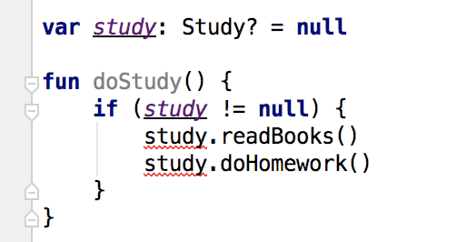

**图 2.32　使用 if 判断语句对全局变量进行判空**

之所以这里会报错，是因为全局变量的值随时都有可能被其他线程所修改，即使做了判空处理，仍然无法保证 `if` 语句中的 `study` 变量没有空指针风险。从这一点上也能体现出 `let` 函数的优势。

好了，最常用的 Kotlin 空指针检查辅助工具大概就是这些了，只要能将本节的内容掌握好，你就可以写出更加健壮、几乎杜绝空指针异常的代码了。

## 2.8　Kotlin 中的小魔术

到目前为止，我们已经学习了很多 Kotlin 方面的编程知识，相信现在的你已经有能力进行一些日常的 Kotlin 开发工作了。在结束本章内容之前，我们再来学习几个魔术类的小技巧，虽说是小技巧，但是相信我，它们一定会给你带来巨大的帮助。

### 2.8.1　字符串内嵌表达式

字符串内嵌表达式是我认为 Java 最应该支持的功能，因为大多数现代高级语言是支持这个非常方便的功能的，但是 Java 直到今天都还不支持，至于为什么，我也想不明白，或许 Java 的开发团队有不这么做的原因和道理吧。

不过值得高兴的是，Kotlin 从一开始就支持了字符串内嵌表达式的功能，弥补了 Java 在这一点上的遗憾。在 Kotlin 中，我们不需要再像使用 Java 时那样傻傻地拼接字符串了，而是可以直接将表达式写在字符串里面，即使是构建非常复杂的字符串，也会变得轻而易举。

本书到目前为止，我都还没有使用过字符串内嵌表达式的写法，一直在使用传统的加号连接符来拼接字符串。在学完本节的内容之后，我们就会永远和加号连接符的写法说“再见”了。

首先来看一下 Kotlin 中字符串内嵌表达式的语法规则：

```Kotlin
"hello, ${obj.name}. nice to meet you!"
```

可以看到，Kotlin 允许我们在字符串里嵌入 `${}` 这种语法结构的表达式，并在运行时使用表达式执行的结果替代这一部分内容。

另外，当表达式中仅有一个变量的时候，还可以将两边的大括号省略，如下所示：

```Kotlin
"hello, $name. nice to meet you!"
```

这种字符串内嵌表达式的写法到底有多么方便，我们通过一个具体的例子来学习一下就知道了。在 2.5.4 小节中，我们用 Java 编写了一个 `Cellphone` 数据类，其中 `toString()` 方法里就使用了比较复杂的拼接字符串的写法。这里我将当时的拼接逻辑单独提炼了出来，代码如下：

```Kotlin
val brand = "Samsung"
val price = 1299.99
println("Cellphone(brand=" + brand + ", price=" + price + ")")
```

可以看到，上述字符串中一共使用了 4 个加号连接符，这种写法不仅写起来非常吃力，很容易写错，而且在代码可读性方面也很糟糕。

而使用字符串内嵌表达式的写法就变得非常简单了，如下所示：

```Kotlin
val brand = "Samsung"
val price = 1299.99
println("Cellphone(brand=$brand, price=$price)")
```

很明显，这种写法不管是在易读性还是易写性方面都更胜一筹，是 Kotlin 更加推崇的写法。这个小技巧会给我们以后的开发工作带来巨大的便利。

### 2.8.2　函数的参数默认值

接下来我们开始学习另外一个非常有用的小技巧——给函数设定参数默认值。

其实之前在学习次构造函数用法的时候我就提到过，次构造函数在 Kotlin 中很少用，因为 Kotlin 提供了给函数设定参数默认值的功能，它在很大程度上能够替代次构造函数的作用。

具体来讲，我们可以在定义函数的时候给任意参数设定一个默认值，这样当调用此函数时就不会强制要求调用方为此参数传值，在没有传值的情况下会自动使用参数的默认值。

给参数设定默认值的方式也很简单，观察如下代码：

```Kotlin
fun printParams(num: Int, str: String = "hello") {
    println("num is $num , str is $str")
}
```

可以看到，这里我们给 `printParams()` 函数的第二个参数设定了一个默认值，这样当调用 `printParams()` 函数时，可以选择给第二个参数传值，也可以选择不传，在不传的情况下就会自动使用默认值。

现在我们在 `main()` 函数中调用一下 `printParams()` 函数来进行测试，代码如下：

```Kotlin
fun printParams(num: Int, str: String = "hello") {
    println("num is $num , str is $str")
}

fun main() {
    printParams(123)
}
```

注意，这里并没有给第二个参数传值。运行一下代码，结果如图 2.33 所示。

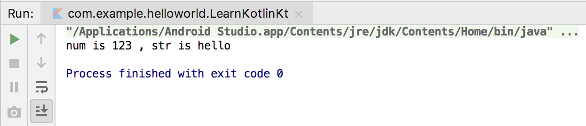

**图 2.33** **`str`** **参数使用默认值的打印结果**

可以看到，在没有给第二个参数传值的情况下，`printParams()` 函数自动使用了参数的默认值。

当然上面这个例子比较理想化，因为正好是给最后一个参数设定了默认值，现在我们将代码改成给第一个参数设定默认值，如下所示：

```Kotlin
fun printParams(num: Int = 100, str: String) {
    println("num is $num , str is $str")
}
```

这时如果想让 `num` 参数使用默认值该怎么办呢？模仿刚才的写法肯定是行不通的，因为编译器会认为我们想把字符串赋值给第一个 `num` 参数，从而报类型不匹配的错误，如图 2.34 所示。

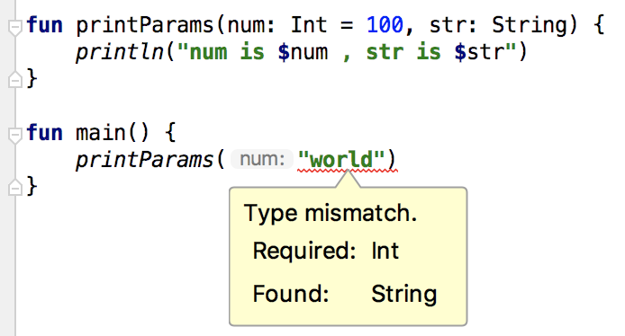

**图 2.34　类型不匹配错误提示**

不过不用担心，Kotlin 提供了另外一种神奇的机制，就是可以通过键值对的方式来传参，从而不必像传统写法那样按照参数定义的顺序来传参。比如调用 `printParams()` 函数，我们还可以这样写：

```Kotlin
printParams(str = "world", num = 123)
```

此时哪个参数在前哪个参数在后都无所谓，Kotlin 可以准确地将参数匹配上。而使用这种键值对的传参方式之后，我们就可以省略 `num` 参数了，代码如下：

```Kotlin
fun printParams(num: Int = 100, str: String) {
    println("num is $num , str is $str")
}

fun main() {
    printParams(str = "world")
}
```

重新运行一下程序，结果如图 2.35 所示。


**图 2.35** **`num`** **参数使用默认值的打印结果**

现在你已经掌握了如何给函数设定参数默认值，那么为什么说这个功能可以在很大程度上替代次构造函数的作用呢？

回忆一下当初我们学习次构造函数时所编写的代码：

```Kotlin
class Student(val sno: String, val grade: Int, name: String, age: Int) :
         Person(name, age) {
    constructor(name: String, age: Int) : this("", 0, name, age) {
    }

    constructor() : this("", 0) {
    }
}
```

上述代码中有一个主构造函数和两个次构造函数，次构造函数在这里的作用是提供了使用更少参数来对 `Student` 类进行实例化的方式。无参的次构造函数会调用两个参数的次构造函数，并将这两个参数赋值成初始值。两个参数的次构造函数会调用 4 个参数的主构造函数，并将缺失的两个参数也赋值成初始值。

这种写法在 Kotlin 中其实是不必要的，因为我们完全可以通过只编写一个主构造函数，然后给参数设定默认值的方式来实现，代码如下所示：

```Kotlin
class Student(val sno: String = "", val grade: Int = 0, name: String = "", age: Int = 0) :
         Person(name, age) {
}
```

在给主构造函数的每个参数都设定了默认值之后，我们就可以使用任何传参组合的方式来对 `Student` 类进行实例化，当然也包含了刚才两种次构造函数的使用场景。

由此可见，给函数设定参数默认值这个小技巧的作用还是极大的。

## 2.9　小结与点评

本章的内容可着实不少，在这一章里面，我们全面学习了 Kotlin 编程中最主要的知识点，包括变量和函数、逻辑控制语句、面向对象编程、Lambda 编程、空指针检查机制，等等。虽然这还远不足以涵盖 Kotlin 的所有内容，但是这里我要祝贺你，现在你已经有足够的实力使用 Kotlin 来学习 Android 程序开发了。

因此，从下一章开始，我们将正式踏上 Android 开发学习之旅。不过在这之后的每一章里，我都会结合相应章节的内容穿插讲解一些 Kotlin 进阶方面的知识，从而让你在 Android 和 Kotlin 两方面都能够持续不断地进步。那么稍事休息，让我们继续前行吧！