# 第 3 章　先从看得到的入手，探究 Activity

通过第 1 章的学习，你已经成功创建了第一个 Android 项目。不过，仅仅满足于此显然是不够的，是时候学点新的东西了。作为你的导师，我有义务帮你制定好后面的学习路线，那么今天我们应该从哪儿入手呢？现在你可以想象一下，假如你已经写出了一个非常优秀的应用程序，然后推荐给你的第一个用户，你会从哪里开始介绍呢？毫无疑问，当然是从界面开始介绍了！因为即使你的程序算法再高效，架构再出色，用户也根本不会在乎这些，他们一开始只会对看得到的东西感兴趣，那么我们今天的主题自然要从看得到的入手了。

## 3.1　Activity 是什么

Activity 是最容易吸引用户的地方，它是一种可以包含用户界面的组件，主要用于和用户进行交互。一个应用程序中可以包含零个或多个 Activity，但不包含任何 Activity 的应用程序很少见，谁也不想让自己的应用永远无法被用户看到吧？

其实在第 1 章中，你已经和 Activity 打过交道了，并且对 Activity 有了初步的认识。不过当时的重点是创建你的第一个 Android 项目，对 Activity 的介绍并不多，在本章中，我将对 Activity 进行详细的介绍。

## 3.2　Activity 的基本用法

到现在为止，你还没有手动创建过 Activity 呢，因为第 1 章中的 MainActivity 是 Android Studio 自动帮我们创建的。手动创建 Activity 可以加深我们的理解，因此现在是时候自己动手了。

我们先将当前的项目关闭，点击导航栏 File→Close Project。然后再新建一个 Android 项目，新建项目的步骤你已经在第 1 章学习过了，不过图 1.9 中的那一步需要稍做修改，我们不再选择“Empty Activity”这个选项，而是选择“Add No Activity”，如图 3.1 所示。


**图 3.1　选择不添加 Activity**

点击“Next”进入项目配置界面。

项目名可以叫作 ActivityTest，包名我们就使用默认值 com.example.activitytest，其他选项都和第 1 章创建的项目保持一致。点击“Finish”，等待 Gradle 构建完成后，项目就创建成功了。

### 3.2.1　手动创建 Activity

项目创建成功后，仍然会默认使用 Android 模式的项目结构，这里我们手动改成 Project 模式，本书后面的所有项目都要这样修改，以后就不再赘述了。目前 ActivityTest 项目中虽然还是会自动生成很多文件，但是 app/src/main/java/com.example.activitytest 目录将会是空的，如图 3.2 所示。


**图 3.2　初始项目结构**

现在右击 com.example.activitytest 包 →New→Activity→Empty Activity，会弹出一个创建 Activity 的对话框，我们将 Activity 命名为 FirstActivity，并且不要勾选 Generate Layout File 和 Launcher Activity 这两个选项，如图 3.3 所示。

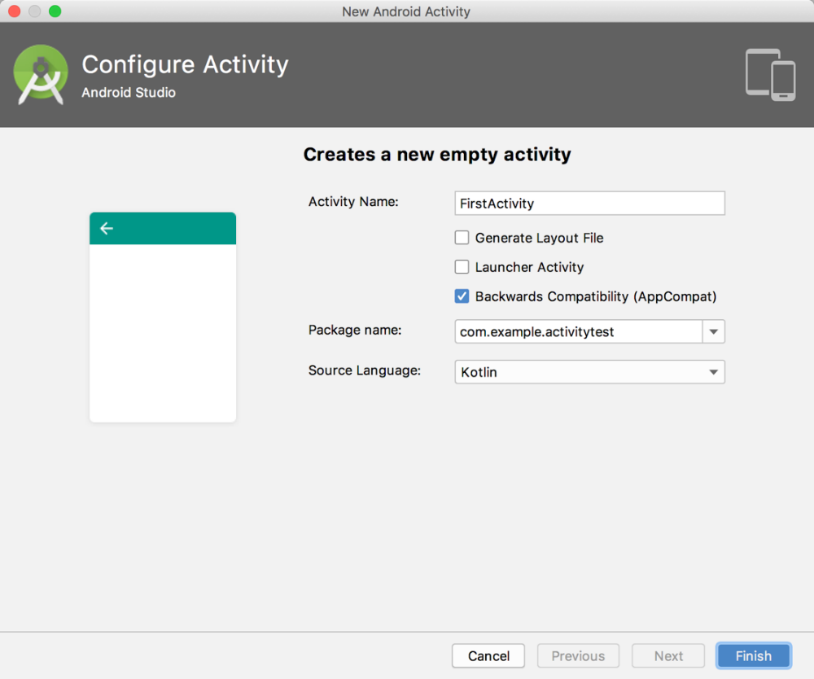

**图 3.3　新建 Activity 对话框**

勾选 Generate Layout File 表示会自动为 FirstActivity 创建一个对应的布局文件，勾选 Launcher Activity 表示会自动将 FirstActivity 设置为当前项目的主 Activity。由于你是第一次手动创建 Activity，这些自动生成的东西暂时都不要勾选，下面我们将会一个个手动来完成。勾选 Backwards Compatibility 表示会为项目启用向下兼容旧版系统的模式，这个选项要勾上。点击“Finish”完成创建。

你需要知道，项目中的任何 Activity 都应该重写 `onCreate()` 方法，而目前我们的 FirstActivity 中已经重写了这个方法，这是 Android Studio 自动帮我们完成的，代码如下所示：

```Kotlin
class FirstActivity : AppCompatActivity() {

    override fun onCreate(savedInstanceState: Bundle?) {
        super.onCreate(savedInstanceState)
    }

}
```

可以看到，`onCreate()` 方法非常简单，就是调用了父类的 `onCreate()` 方法。当然这只是默认的实现，后面我们还需要在里面加入很多自己的逻辑。

### 3.2.2　创建和加载布局

前面我们说过，Android 程序的设计讲究逻辑和视图分离，最好每一个 Activity 都能对应一个布局。布局是用来显示界面内容的，我们现在就来手动创建一个布局文件。

右击 app/src/main/res 目录 →New→Directory，会弹出一个新建目录的窗口，这里先创建一个名为 layout 的目录。然后对着 layout 目录右键 →New→Layout resource file，又会弹出一个新建布局资源文件的窗口，我们将这个布局文件命名为 first_layout，根元素默认选择为 LinearLayout，如图 3.4 所示。

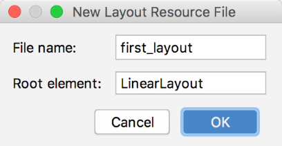

**图 3.4　新建布局资源文件**

点击“OK”完成布局的创建，这时候你会看到如图 3.5 所示的布局编辑器。


**图 3.5　布局编辑器**

这是 Android Studio 为我们提供的可视化布局编辑器，你可以在屏幕的中央区域预览当前的布局。在窗口的左下方有两个切换卡：左边是 Design，右边是 Text。Design 是当前的可视化布局编辑器，在这里你不仅可以预览当前的布局，还可以通过拖放的方式编辑布局。而 Text 则是通过 XML 文件的方式来编辑布局的，现在点击一下 Text 切换卡，可以看到如下代码：

```xml
<LinearLayout xmlns:android="http://schemas.android.com/apk/res/android"
      android:orientation="vertical"
      android:layout_width="match_parent"
      android:layout_height="match_parent">

</LinearLayout>
```

由于我们刚才在创建布局文件时选择了 LinearLayout 作为根元素，因此现在布局文件中已经有一个 LinearLayout 元素了。我们现在对这个布局稍做编辑，添加一个按钮，如下所示：

```xml
<LinearLayout xmlns:android="http://schemas.android.com/apk/res/android"
      android:orientation="vertical"
      android:layout_width="match_parent"
      android:layout_height="match_parent">

    <Button
        android:id="@+id/button1"
        android:layout_width="match_parent"
        android:layout_height="wrap_content"
        android:text="Button 1"
    />

</LinearLayout>
```

这里添加了一个 Button 元素，并在 Button 元素的内部增加了几个属性。`android:id` 是给当前的元素定义一个唯一的标识符，之后可以在代码中对这个元素进行操作。你可能会对 `@+id/button1` 这种语法感到陌生，但如果把加号去掉，变成 `@id/button1`，你就会觉得有些熟悉了吧。这不就是在 XML 中引用资源的语法吗？只不过是把 `string` 替换成了 `id`。是的，如果你需要在 XML 中引用一个 `id`，就使用 `@id/id_name` 这种语法，而如果你需要在 XML 中定义一个 `id`，则要使用 `@+id/id_name` 这种语法。随后 `android:layout_width` 指定了当前元素的宽度，这里使用 `match_parent` 表示让当前元素和父元素一样宽。`android:layout_height` 指定了当前元素的高度，这里使用 `wrap_content` 表示当前元素的高度只要能刚好包含里面的内容就行。`android:text` 指定了元素中显示的文字内容。如果你还不能完全看明白，没有关系，关于编写布局的详细内容我会在下一章中重点讲解，本章只是先简单涉及一些。现在按钮已经添加完了，你可以通过右侧工具栏的 Preview 来预览一下当前布局，如图 3.6 所示。


**图 3.6　预览当前布局**

可以看到，按钮已经成功显示出来了，这样一个简单的布局就编写完成了。那么接下来我们要做的，就是在 Activity 中加载这个布局。

重新回到 FirstActivity，在 `onCreate()` 方法中加入如下代码：

```Kotlin
class FirstActivity : AppCompatActivity() {

    override fun onCreate(savedInstanceState: Bundle?) {
        super.onCreate(savedInstanceState)
        setContentView(R.layout.first_layout)
    }

}
```

可以看到，这里调用了 `setContentView()` 方法来给当前的 Activity 加载一个布局，而在 `setContentView()` 方法中，我们一般会传入一个布局文件的 `id`。在第 1 章介绍项目资源的时候我曾提到过，项目中添加的任何资源都会在 R 文件中生成一个相应的资源 `id`，因此我们刚才创建的 `first_layout.xml` 布局的 `id` 现在已经添加到 R 文件中了。在代码中引用布局文件的方法你也已经学过了，只需要调用 `R.layout.first_layout` 就可以得到 `first_layout.xml` 布局的 `id`，然后将这个值传入 `setContentView()` 方法即可。

### 3.2.3　在 AndroidManifest 文件中注册

在第 1 章我们学过，所有的 Activity 都要在 AndroidManifest.xml 中进行注册才能生效。实际上 FirstActivity 已经在 AndroidManifest.xml 中注册过了，我们打开 app/src/main/AndroidManifest.xml 文件瞧一瞧，代码如下所示：

```xml
<manifest xmlns:android="http://schemas.android.com/apk/res/android"
         package="com.example.activitytest">

    <application
            android:allowBackup="true"
            android:icon="@mipmap/ic_launcher"
            android:label="@string/app_name"
            android:roundIcon="@mipmap/ic_launcher_round"
            android:supportsRtl="true"
            android:theme="@style/AppTheme">
        <activity android:name=".FirstActivity">
        </activity>
    </application>

</manifest>
```

可以看到，Activity 的注册声明要放在 `<application>` 标签内，这里是通过 `<activity>` 标签来对 Activity 进行注册的。那么又是谁帮我们自动完成了对 FirstActivity 的注册呢？当然是 Android Studio 了。在过去，当创建 Activity 或其他系统组件时，很多人会忘记要去 Android Manifest.xml 中进行注册，从而导致程序运行崩溃，很显然 Android Studio 在这方面做得更加人性化。

在 `<activity>` 标签中，我们使用了 `android:name` 来指定具体注册哪一个 Activity，那么这里填入的 `.FirstActivity` 是什么意思呢？其实这不过是 `com.example.activitytest.FirstActivity` 的缩写而已。由于在最外层的 `<manifest>` 标签中已经通过 `package` 属性指定了程序的包名是 `com.example.activitytest`，因此在注册 Activity 时，这一部分可以省略，直接使用 `.FirstActivity` 就足够了。

不过，仅仅是这样注册了 Activity，我们的程序仍然不能运行，因为还没有为程序配置主 Activity。也就是说，程序运行起来的时候，不知道要首先启动哪个 Activity。配置主 Activity 的方法其实在第 1 章中已经介绍过了，就是在 `<activity>` 标签的内部加入 `<intent-filter>` 标签，并在这个标签里添加 `<action android:name="android.intent.action.MAIN"/>` 和 `<category android:name="android.intent.category.LAUNCHER" />` 这两句声明即可。

除此之外，我们还可以使用 `android:label` 指定 Activity 中标题栏的内容，标题栏是显示在 Activity 最顶部的，待会儿运行的时候你就会看到。需要注意的是，给主 Activity 指定的 label 不仅会成为标题栏中的内容，还会成为启动器（Launcher）中应用程序显示的名称。

修改后的 AndroidManifest.xml 文件代码如下所示：

```xml
<manifest xmlns:android="http://schemas.android.com/apk/res/android"
          package="com.example.activitytest">

    <application
        ...>
        <activity android:name=".FirstActivity"
            android:label="This is FirstActivity">
            <intent-filter>
                <action android:name="android.intent.action.MAIN" />
                <category android:name="android.intent.category.LAUNCHER" />
            </intent-filter>
        </activity>
    </application>

</manifest>
```

这样，FirstActivity 就成为我们这个程序的主 Activity 了，点击桌面应用程序图标时首先打开的就是这个 Activity。另外需要注意，如果你的应用程序中没有声明任何一个 Activity 作为主 Activity，这个程序仍然是可以正常安装的，只是你无法在启动器中看到或者打开这个程序。这种程序一般是作为第三方服务供其他应用在内部进行调用的。

好了，现在一切都已准备就绪，让我们来运行一下程序吧，结果如图 3.7 所示。

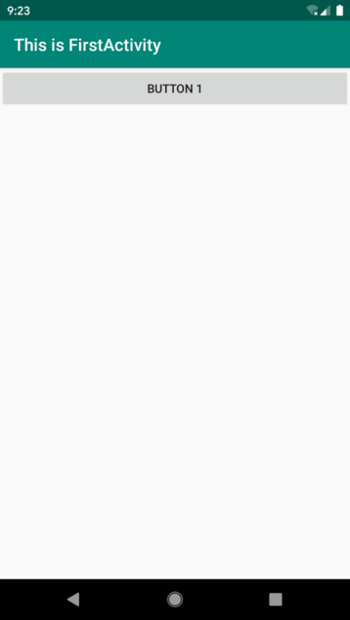

**图 3.7　首次运行结果**

在界面的最顶部是一个标题栏，里面显示着我们刚才在注册 Activity 时指定的内容。标题栏的下面就是在布局文件 first_layout.xml 中编写的界面，可以看到我们刚刚定义的按钮。现在你已经成功掌握了手动创建 Activity 的方法，下面让我们继续看一看你在 Activity 中还能做哪些事情吧。

### 3.2.4　在 Activity 中使用 Toast

Toast 是 Android 系统提供的一种非常好的提醒方式，在程序中可以使用它将一些短小的信息通知给用户，这些信息会在一段时间后自动消失，并且不会占用任何屏幕空间，我们现在就尝试一下如何在 Activity 中使用 Toast。

首先需要定义一个弹出 Toast 的触发点，正好界面上有个按钮，那我们就让这个按钮的点击事件作为弹出 Toast 的触发点吧。在 `onCreate()` 方法中添加如下代码：

```Kotlin
override fun onCreate(savedInstanceState: Bundle?) {
    super.onCreate(savedInstanceState)
    setContentView(R.layout.first_layout)
    val button1: Button = findViewById(R.id.button1)
    button1.setOnClickListener {
        Toast.makeText(this, "You clicked Button 1", Toast.LENGTH_SHORT).show()
    }
}
```

在 Activity 中，可以通过 `findViewById()` 方法获取在布局文件中定义的元素，这里我们传入 `R.id.button1` 来得到按钮的实例，这个值是刚才在 first_layout.xml 中通过 `android:id` 属性指定的。`findViewById()` 方法返回的是一个继承自 `View` 的泛型对象，因此 Kotlin 无法自动推导出它是一个 Button 还是其他控件，所以我们需要将 `button1` 变量显式地声明成 `Button` 类型。得到按钮的实例之后，我们通过调用 `setOnClickListener()` 方法为按钮注册一个监听器，点击按钮时就会执行监听器中的 `onClick()` 方法。因此，弹出 Toast 的功能当然是要在 `onClick()` 方法中编写了。

Toast 的用法非常简单，通过静态方法 `makeText()` 创建出一个 `Toast` 对象，然后调用 `show()` 将 Toast 显示出来就可以了。这里需要注意的是，`makeText()` 方法需要传入 3 个参数。第一个参数是 `Context`，也就是 Toast 要求的上下文，由于 Activity 本身就是一个 `Context` 对象，因此这里直接传入 `this` 即可。第二个参数是 Toast 显示的文本内容。第三个参数是 Toast 显示的时长，有两个内置常量可以选择：`Toast.LENGTH_SHORT` 和 `Toast.LENGTH_LONG`。

现在重新运行程序，并点击一下按钮，效果如图 3.8 所示。

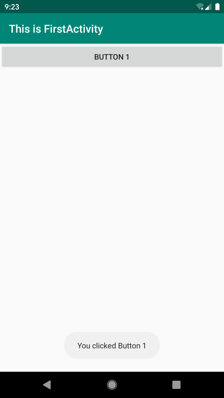

**图 3.8　Toast 运行效果**

关于 `findViewById()` 方法的使用，我还得再多讲一些。我们已经知道，`findViewById()` 方法的作用就是获取布局文件中控件的实例，但是前面的例子比较简单，只有一个按钮，如果某个布局文件中有 10 个控件呢？没错，我们就需要调用 10 次 `findViewById()` 方法才行。这种写法虽然很正确，但是很笨拙，于是就滋生出了诸如 ButterKnife 之类的第三方开源库，来简化 `findViewById()` 方法的调用。

不过，这个问题在 Kotlin 中就不复存在了，因为使用 Kotlin 编写的 Android 项目在 app/build.gradle 文件的头部默认引入了一个 kotlin-android-extensions 插件，这个插件会根据布局文件中定义的控件 id 自动生成一个具有相同名称的变量，我们可以在 Activity 里直接使用这个变量，而不用再调用 `findViewById()` 方法了，如图 3.9 所示。

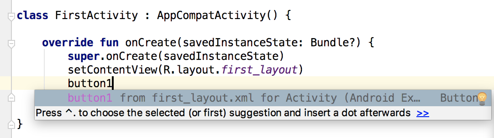

**图 3.9　调用自动生成的** **`button1`** **变量**

这里我仍然建议你使用上一章中介绍的 Android Studio 代码补全功能，因为自动生成的这些变量也是需要导包的。

现在我们就可以进一步简化代码了，如下所示：

```Kotlin
override fun onCreate(savedInstanceState: Bundle?) {
    super.onCreate(savedInstanceState)
    setContentView(R.layout.first_layout)
    button1.setOnClickListener {
        Toast.makeText(this, "You clicked Button 1", Toast.LENGTH_SHORT).show()
    }
}
```

可以看到，这样就不用再调用 `findViewById()` 方法了。

这种写法其实是 Kotlin 编程最推荐的写法，除非特殊情况，本书后面将尽量不再使用 `findViewById()` 方法，而是会直接调用这些自动生成的控件变量。当然，即使你以后很少会用到 `findViewById()` 方法，我们还是得了解它才行，因为 kotlin-android-extensions 这个插件背后也是通过调用 `findViewById()` 方法来实现的。

### 3.2.5　在 Activity 中使用 Menu

手机毕竟和电脑不同，它的屏幕空间非常有限，因此充分地利用屏幕空间在手机界面设计中就显得非常重要了。如果你的 Activity 中有大量的菜单需要显示，界面设计就会比较尴尬，因为仅这些菜单就可能占用将近三分之一的屏幕空间，这该怎么办呢？不用担心，Android 给我们提供了一种方式，可以让菜单都能得到展示，还不占用任何屏幕空间。

首先在 res 目录下新建一个 menu 文件夹，右击 res 目录 →New→Directory，输入文件夹名“menu”，点击“OK”。接着在这个文件夹下新建一个名叫“main”的菜单文件，右击 menu 文件夹 →New→Menu resource file，如图 3.10 所示。

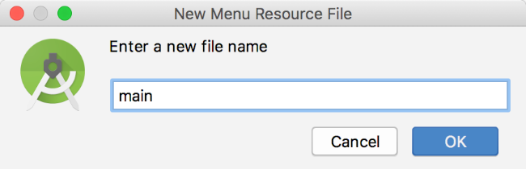

**图 3.10　新建 Menu 资源文件**

文件名输入“main”，点击“OK”完成创建，然后在 main.xml 中添加如下代码：

```xml
<menu xmlns:android="http://schemas.android.com/apk/res/android">
    <item
        android:id="@+id/add_item"
        android:title="Add"/>
    <item
        android:id="@+id/remove_item"
        android:title="Remove"/>
</menu>
```

这里我们创建了两个菜单项，其中 `<item>` 标签用来创建具体的某一个菜单项，然后通过 `android:id` 给这个菜单项指定一个唯一的标识符，通过 `android:title` 给这个菜单项指定一个名称。

接着回到 FirstActivity 中来重写 `onCreateOptionsMenu()` 方法，重写方法可以使用 Ctrl + O 快捷键（Mac 系统是 control + O），如图 3.11 所示。


**图 3.11　重写** **`onCreateOptionsMenu()`**  **方法**

然后在 `onCreateOptionsMenu()` 方法中编写如下代码：

```Kotlin
override fun onCreateOptionsMenu(menu: Menu?): Boolean {
    menuInflater.inflate(R.menu.main, menu)
    return true
}
```

在继续讲解这段代码之前，我还得再介绍一个 Kotlin 的语法糖。如果你熟悉 Java 的话，应该知道 Java Bean 的概念，它是一个非常简单的 Java 类，会根据类中的字段自动生成相应的 Getter 和 Setter 方法，如下所示：

```Kotlin
public class Book {

   private int pages;

   public int getPages() {
      return pages;
   }

   public void setPages(int pages) {
      this.pages = pages;
   }

}
```

在 Kotlin 中调用这种语法结构的 Java 方法时，可以使用一种更加简便的写法，比如用如下代码来设置和读取 `Book` 类中的 `pages` 字段：

```Kotlin
val book = Book()
book.pages = 500
val bookPages = book.pages
```

这里看上去好像我们并没有调用 `Book` 类的 `setPages()` 和 `getPages()` 方法，而是直接对 `pages` 字段进行了赋值和读取。其实这就是 Kotlin 给我们提供的语法糖，它会在背后自动将上述代码转换成调用 `setPages()` 方法和 `getPages()` 方法。

而我们刚才在 `onCreateOptionsMenu()` 方法中编写的 `menuInflater` 就使用了这种语法糖，它实际上是调用了父类的 `getMenuInflater()` 方法。`getMenuInflater()` 方法能够得到一个 `MenuInflater` 对象，再调用它的 `inflate()` 方法，就可以给当前 Activity 创建菜单了。`inflate()` 方法接收两个参数：第一个参数用于指定我们通过哪一个资源文件来创建菜单，这里当然是传入 `R.menu.main`；第二个参数用于指定我们的菜单项将添加到哪一个 `Menu` 对象当中，这里直接使用 `onCreateOptionsMenu()` 方法中传入的 `menu` 参数。最后给这个方法返回 `true`，表示允许创建的菜单显示出来，如果返回了 `false`，创建的菜单将无法显示。

当然，仅仅让菜单显示出来是不够的，我们定义菜单不仅是为了看的，关键是要菜单真正可用才行，因此还要再定义菜单响应事件。在 FirstActivity 中重写 `onOptionsItemSelected()` 方法，如下所示：

```Kotlin
override fun onOptionsItemSelected(item: MenuItem): Boolean {
    when (item.itemId) {
        R.id.add_item -> Toast.makeText(this, "You clicked Add",
                             Toast.LENGTH_SHORT).show()
        R.id.remove_item -> Toast.makeText(this, "You clicked Remove",
                                Toast.LENGTH_SHORT).show()
    }
    return true
}
```

在 `onOptionsItemSelected()` 方法中，我们通过调用 `item.itemId` 来判断点击的是哪一个菜单项。另外，其实这里也应用了刚刚学到的语法糖，Kotlin 实际上在背后调用的是 `item` 的 `getItemId()` 方法。接下来我们将 `item.itemId` 的结果传入 `when` 语句当中，然后给每个菜单项加入自己的逻辑处理，这里我们就活学活用，弹出一个刚刚学会的 Toast。

重新运行程序，你会发现在标题栏的右侧多了一个三点的符号，这个就是菜单按钮了，如图 3.12 所示。


**图 3.12　带菜单按钮的 Activity**

可以看到，菜单里的菜单项默认是不显示的，只有点击菜单按钮才会弹出里面具体的内容，因此它不会占用任何 Activity 的空间，如图 3.13 所示。


**图 3.13　弹出菜单项的界面**

如果你点击了 Add 菜单项，就会弹出 You clicked Add 提示（如图 3.14 所示）；如果点击了 Remove 菜单项，就会弹出 You clicked Remove 提示。


**图 3.14　点击了 Add 菜单项**

### 3.2.6　销毁一个 Activity

通过上一节的学习，你已经掌握了手动创建 Activity 的方法，并学会了如何在 Activity 中创建 Toast 和菜单。或许你现在心中会有个疑惑：如何销毁一个 Activity 呢？

其实答案非常简单，只要按一下 Back 键就可以销毁当前的 Activity 了。不过，如果你不想通过按键的方式，而是希望在程序中通过代码来销毁 Activity，当然也可以，Activity 类提供了一个 `finish()` 方法，我们只需要调用一下这个方法就可以销毁当前的 Activity 了。

修改按钮监听器中的代码，如下所示：

```Kotlin
button1.setOnClickListener {
    finish()
}
```

重新运行程序，这时点击一下按钮，当前的 Activity 就被成功销毁了，效果和按下 Back 键是一样的。

## 3.3　使用 Intent 在 Activity 之间穿梭

只有一个 Activity 的应用也太简单了吧？没错，你的追求应该更高一点。不管你想创建多少个 Activity，方法都和上一节中介绍的是一样的。唯一的问题在于，你在启动器中点击应用的图标只会进入该应用的主 Activity，那么怎样才能由主 Activity 跳转到其他 Activity 呢？我们现在就一起来看一看。

### 3.3.1　使用显式 Intent

你应该已经对创建 Activity 的流程比较熟悉了，那我们现在在 ActivityTest 项目中再快速地创建一个 Activity。

还是右击 com.example.activitytest 包 →New→Activity→Empty Activity，会弹出一个创建 Activity 的对话框，这次我们命名为 SecondActivity，并勾选 Generate Layout File，给布局文件起名为 second_layout，但不要勾选 Launcher Activity 选项，如图 3.15 所示。

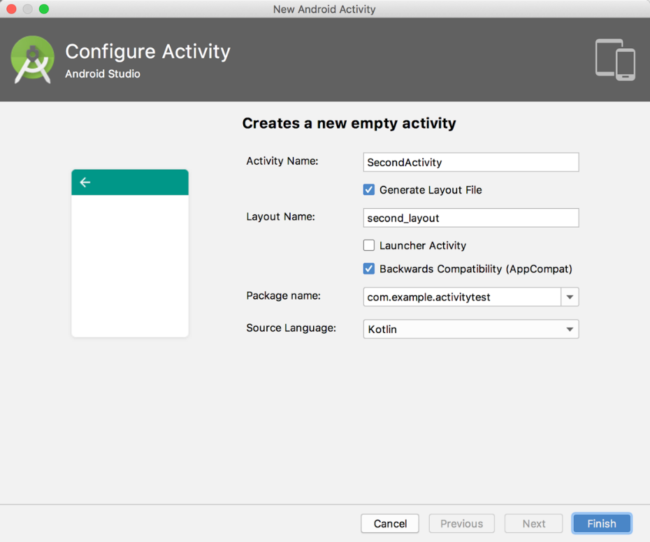

**图 3.15　创建 SecondActivity**

点击“Finish”完成创建，Android Studio 会为我们自动生成 SecondActivity.kt 和 second_layout.xml 这两个文件。不过自动生成的布局代码目前对你来说可能有些难以理解，这里我们还是使用比较熟悉的 LinearLayout，编辑 second_layout.xml，将里面的代码替换成如下内容：

```xml
<LinearLayout xmlns:android="http://schemas.android.com/apk/res/android"
    android:orientation="vertical"
    android:layout_width="match_parent"
    android:layout_height="match_parent">

    <Button
        android:id="@+id/button2"
        android:layout_width="match_parent"
        android:layout_height="wrap_content"
        android:text="Button 2"
    />

</LinearLayout>
```

我们还是定义了一个按钮，并在按钮上显示 Button 2。

SecondActivity 中的代码已经自动生成了一部分，我们保持默认不变即可，如下所示：

```Kotlin
class SecondActivity : AppCompatActivity() {

    override fun onCreate(savedInstanceState: Bundle?) {
        super.onCreate(savedInstanceState)
        setContentView(R.layout.second_layout)
    }

}
```

另外不要忘记，任何一个 Activity 都是需要在 AndroidManifest.xml 中注册的。不过幸运的是，Android Studio 已经帮我们自动完成了，你可以打开 AndroidManifest.xml 瞧一瞧：

```xml
<application
    ...>
    <activity android:name=".SecondActivity">
    </activity>
    <activity
            android:name=".FirstActivity"
            android:label="This is FirstActivity">
        <intent-filter>
            <action android:name="android.intent.action.MAIN"/>
            <category android:name="android.intent.category.LAUNCHER"/>
        </intent-filter>
    </activity>
</application>
```

由于 SecondActivity 不是主 Activity，因此不需要配置 `<intent-filter>` 标签里的内容，注册 Activity 的代码也简单了许多。现在第二个 Activity 已经创建完成，剩下的问题就是如何去启动它了，这里我们需要引入一个新的概念：Intent。

Intent 是 Android 程序中各组件之间进行交互的一种重要方式，它不仅可以指明当前组件想要执行的动作，还可以在不同组件之间传递数据。Intent 一般可用于启动 Activity、启动 Service 以及发送广播等场景，由于 Service、广播等概念你暂时还未涉及，那么本章我们的目光无疑就锁定在了启动 Activity 上面。

Intent 大致可以分为两种：显式 Intent 和隐式 Intent。我们先来看一下显式 Intent 如何使用。

Intent 有多个构造函数的重载，其中一个是 `Intent(Context packageContext, Class<?> cls)`。这个构造函数接收两个参数：第一个参数 `Context` 要求提供一个启动 Activity 的上下文；第二个参数 `Class` 用于指定想要启动的目标 Activity，通过这个构造函数就可以构建出 Intent 的“意图”。那么接下来我们应该怎么使用这个 Intent 呢？Activity 类中提供了一个 `startActivity()` 方法，专门用于启动 Activity，它接收一个 Intent 参数，这里我们将构建好的 Intent 传入 `startActivity()` 方法就可以启动目标 Activity 了。

修改 FirstActivity 中按钮的点击事件，代码如下所示：

```Kotlin
button1.setOnClickListener {
    val intent = Intent(this, SecondActivity::class.java)
    startActivity(intent)
}
```

我们首先构建了一个 Intent 对象，第一个参数传入 `this` 也就是 FirstActivity 作为上下文，第二个参数传入 `SecondActivity::class.java` 作为目标 Activity，这样我们的“意图”就非常明显了，即在 FirstActivity 的基础上打开 SecondActivity。注意，Kotlin 中 `SecondActivity::class.java` 的写法就相当于 Java 中 `SecondActivity.class` 的写法。接下来再通过 `startActivity()` 方法执行这个 Intent 就可以了。

重新运行程序，在 FirstActivity 的界面点击一下按钮，结果如图 3.16 所示。

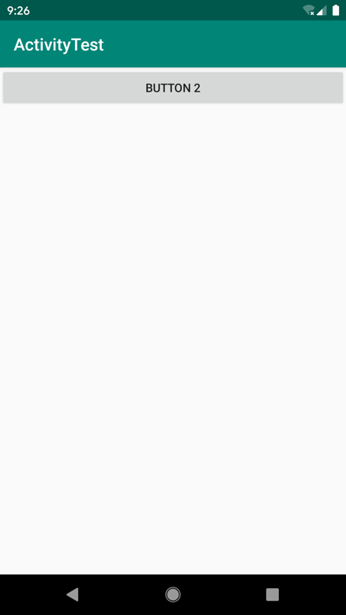

**图 3.16　SecondActivity 界面**

可以看到，我们已经成功启动 SecondActivity 了。如果你想要回到上一个 Activity 怎么办呢？很简单，按一下 Back 键就可以销毁当前 Activity，从而回到上一个 Activity 了。

使用这种方式来启动 Activity，Intent 的“意图”非常明显，因此我们称之为显式 Intent。

### 3.3.2　使用隐式 Intent

相比于显式 Intent，隐式 Intent 则含蓄了许多，它并不明确指出想要启动哪一个 Activity，而是指定了一系列更为抽象的 `action` 和 `category` 等信息，然后交由系统去分析这个 Intent，并帮我们找出合适的 Activity 去启动。

什么叫作合适的 Activity 呢？简单来说就是可以响应这个隐式 Intent 的 Activity，那么目前 SecondActivity 可以响应什么样的隐式 Intent 呢？额，现在好像还什么都响应不了，不过很快就可以了。

通过在 `<activity>` 标签下配置 `<intent-filter>` 的内容，可以指定当前 Activity 能够响应的 `action` 和 `category`，打开 AndroidManifest.xml，添加如下代码：

```xml
<activity android:name=".SecondActivity" >
    <intent-filter>
        <action android:name="com.example.activitytest.ACTION_START" />
        <category android:name="android.intent.category.DEFAULT" />
    </intent-filter>
</activity>
```

在 `<action>` 标签中我们指明了当前 Activity 可以响应 `com.example.activitytest.ACTION_START` 这个 `action`，而 `<category>` 标签则包含了一些附加信息，更精确地指明了当前 Activity 能够响应的 Intent 中还可能带有的 `category`。只有 `<action>` 和 `<category>` 中的内容同时匹配 Intent 中指定的 `action` 和 `category` 时，这个 Activity 才能响应该 Intent。

修改 FirstActivity 中按钮的点击事件，代码如下所示：

```Kotlin
button1.setOnClickListener {
    val intent = Intent("com.example.activitytest.ACTION_START")
    startActivity(intent)
}
```

可以看到，我们使用了 Intent 的另一个构造函数，直接将 `action` 的字符串传了进去，表明我们想要启动能够响应 `com.example.activitytest.ACTION_START` 这个 `action` 的 Activity。前面不是说要 `<action>` 和 `<category>` 同时匹配才能响应吗？怎么没看到哪里有指定 `category` 呢？这是因为 `android.intent.category.DEFAULT` 是一种默认的 `category`，在调用 `startActivity()` 方法的时候会自动将这个 `category` 添加到 Intent 中。

重新运行程序，在 FirstActivity 的界面点击一下按钮，你同样成功启动 SecondActivity 了。不同的是，这次你是使用隐式 Intent 的方式来启动的，说明我们在 `<activity>` 标签下配置的 `action` 和 `category` 的内容已经生效了！

每个 Intent 中只能指定一个 `action`，但能指定多个 `category`。目前我们的 Intent 中只有一个默认的 `category`，那么现在再来增加一个吧。

修改 FirstActivity 中按钮的点击事件，代码如下所示：

```Kotlin
button1.setOnClickListener {
    val intent = Intent("com.example.activitytest.ACTION_START")
    intent.addCategory("com.example.activitytest.MY_CATEGORY")
    startActivity(intent)
}
```

可以调用 Intent 中的 `addCategory()` 方法来添加一个 `category`，这里我们指定了一个自定义的 `category`，值为 `com.example.activitytest.MY_CATEGORY`。

现在重新运行程序，在 FirstActivity 的界面点击一下按钮，你会发现，程序崩溃了！这是你第一次遇到程序崩溃，可能会有些束手无策。别紧张，只要你善于分析，其实大多数的崩溃问题很好解决。在 Logcat 界面查看错误日志，你会看到如图 3.17 所示的错误信息。

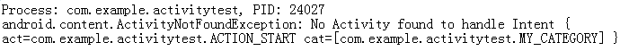

**图 3.17　错误信息**

错误信息提醒我们，没有任何一个 Activity 可以响应我们的 Intent。这是因为我们刚刚在 Intent 中新增了一个 `category`，而 SecondActivity 的 `<intent-filter>` 标签中并没有声明可以响应这个 `category`，所以就出现了没有任何 Activity 可以响应该 Intent 的情况。现在我们在 `<intent-filter>` 中再添加一个 `category` 的声明，如下所示：

```xml
<activity android:name=".SecondActivity" >
    <intent-filter>
        <action android:name="com.example.activitytest.ACTION_START" />
        <category android:name="android.intent.category.DEFAULT" />
        <category android:name="com.example.activitytest.MY_CATEGORY"/>
    </intent-filter>
</activity>
```

再次重新运行程序，你就会发现一切都正常了。

### 3.3.3　更多隐式 Intent 的用法

上一节中，你掌握了通过隐式 Intent 来启动 Activity 的方法，但实际上隐式 Intent 还有更多的内容需要你去了解，本节我们就来展开介绍一下。

使用隐式 Intent，不仅可以启动自己程序内的 Activity，还可以启动其他程序的 Activity，这就使多个应用程序之间的功能共享成为了可能。比如你的应用程序中需要展示一个网页，这时你没有必要自己去实现一个浏览器（事实上也不太可能），只需要调用系统的浏览器来打开这个网页就行了。

修改 FirstActivity 中按钮点击事件的代码，如下所示：

```Kotlin
button1.setOnClickListener {
    val intent = Intent(Intent.ACTION_VIEW)
    intent.data = Uri.parse("https://www.baidu.com")
    startActivity(intent)
}
```

这里我们首先指定了 Intent 的 `action` 是 `Intent.ACTION_VIEW`，这是一个 Android 系统内置的动作，其常量值为 `android.intent.action.VIEW`。然后通过 `Uri.parse()` 方法将一个网址字符串解析成一个 `Uri` 对象，再调用 Intent 的 `setData()` 方法将这个 `Uri` 对象传递进去。当然，这里再次使用了前面学习的语法糖，看上去像是给 Intent 的 `data` 属性赋值一样。

重新运行程序，在 FirstActivity 界面点击按钮就可以看到打开了系统浏览器，如图 3.18 所示。


**图 3.18　系统浏览器界面**

在上述代码中，可能你会对 `setData()` 方法部分感到陌生，这是我们前面没有讲到的。这个方法其实并不复杂，它接收一个 `Uri` 对象，主要用于指定当前 Intent 正在操作的数据，而这些数据通常是以字符串形式传入 `Uri.parse()` 方法中解析产生的。

与此对应，我们还可以在 `<intent-filter>` 标签中再配置一个 `<data>` 标签，用于更精确地指定当前 Activity 能够响应的数据。`<data>` 标签中主要可以配置以下内容。

- `android:scheme`。用于指定数据的协议部分，如上例中的 https 部分。
- `android:host`。用于指定数据的主机名部分，如上例中的 www.baidu.com 部分。
- `android:port`。用于指定数据的端口部分，一般紧随在主机名之后。
- `android:path`。用于指定主机名和端口之后的部分，如一段网址中跟在域名之后的内容。
- `android:mimeType`。用于指定可以处理的数据类型，允许使用通配符的方式进行指定。

只有当 `<data>` 标签中指定的内容和 Intent 中携带的 Data 完全一致时，当前 Activity 才能够响应该 Intent。不过，在 `<data>` 标签中一般不会指定过多的内容。例如在上面的浏览器示例中，其实只需要指定 `android:scheme` 为 https，就可以响应所有 https 协议的 Intent 了。

为了让你能够更加直观地理解，我们来自己建立一个 Activity，让它也能响应打开网页的 Intent。

右击 com.example.activitytest 包 →New→Activity→Empty Activity，新建 ThirdActivity，并勾选 Generate Layout File，给布局文件起名为 third_layout，点击“Finish”完成创建。然后编辑 third_layout.xml，将里面的代码替换成如下内容：

```xml
<LinearLayout xmlns:android="http://schemas.android.com/apk/res/android"
    android:orientation="vertical"
    android:layout_width="match_parent"
    android:layout_height="match_parent">

    <Button
        android:id="@+id/button3"
        android:layout_width="match_parent"
        android:layout_height="wrap_content"
        android:text="Button 3"
    />

</LinearLayout>
```

ThirdActivity 中的代码保持不变即可，最后在 AndroidManifest.xml 中修改 ThirdActivity 的注册信息：

```xml
<activity android:name=".ThirdActivity">
    <intent-filter tools:ignore="AppLinkUrlError">
        <action android:name="android.intent.action.VIEW" />
        <category android:name="android.intent.category.DEFAULT" />
        <data android:scheme="https" />
    </intent-filter>
</activity>
```

我们在 ThirdActivity 的 `<intent-filter>` 中配置了当前 Activity 能够响应的 `action` 是 `Intent.ACTION_VIEW` 的常量值，而 `category` 则毫无疑问地指定了默认的 `category` 值，另外在 `<data>` 标签中，我们通过 `android:scheme` 指定了数据的协议必须是 https 协议，这样 ThirdActivity 应该就和浏览器一样，能够响应一个打开网页的 Intent 了。另外，由于 Android Studio 认为所有能够响应 `ACTION_VIEW` 的 Activity 都应该加上 BROWSABLE 的 `category`，否则就会给出一段警告提醒。加上 BROWSABLE 的 `category` 是为了实现 deep link 功能，和我们目前学习的东西无关，所以这里直接在 `<intent-filter>` 标签上使用 `tools:ignore` 属性将警告忽略即可。

现在让我们运行一下程序试试吧，在 FirstActivity 的界面点击一下按钮，结果如图 3.19 所示。

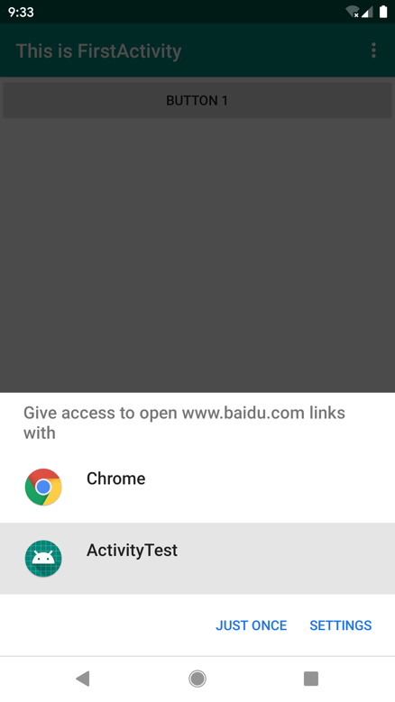

**图 3.19　选择响应 Intent 的程序**

可以看到，系统自动弹出了一个列表，显示了目前能够响应这个 Intent 的所有程序。选择 Chrome 还会像之前一样打开浏览器，并显示百度的主页，而如果选择了 ActivityTest，则会启动 ThirdActivity。`JUST ONCE` 表示只是这次使用选择的程序打开，`ALWAYS` 则表示以后一直使用这次选择的程序打开。需要注意的是，虽然我们声明了 ThirdActivity 是可以响应打开网页的 Intent 的，但实际上这个 Activity 并没有加载并显示网页的功能，所以在真正的项目中尽量不要出现这种有可能误导用户的行为，不然会让用户对我们的应用产生负面的印象。

除了 https 协议外，我们还可以指定很多其他协议，比如 geo 表示显示地理位置、tel 表示拨打电话。下面的代码展示了如何在我们的程序中调用系统拨号界面。

```Kotlin
button1.setOnClickListener {
    val intent = Intent(Intent.ACTION_DIAL)
    intent.data = Uri.parse("tel:10086")
    startActivity(intent)
}
```

首先指定了 Intent 的 `action` 是 `Intent.ACTION_DIAL`，这又是一个 Android 系统的内置动作。然后在 `data` 部分指定了协议是 `tel`，号码是 10086。重新运行一下程序，在 FirstActivity 的界面点击一下按钮，结果如图 3.20 所示。


**图 3.20　系统拨号界面**

### 3.3.4　向下一个 Activity 传递数据

经过前面几节的学习，你已经对 Intent 有了一定的了解。不过到目前为止，我们只是简单地使用 Intent 来启动一个 Activity，其实 Intent 在启动 Activity 的时候还可以传递数据，下面我们来一起看一下。

在启动 Activity 时传递数据的思路很简单，Intent 中提供了一系列 `putExtra()` 方法的重载，可以把我们想要传递的数据暂存在 Intent 中，在启动另一个 Activity 后，只需要把这些数据从 Intent 中取出就可以了。比如说 FirstActivity 中有一个字符串，现在想把这个字符串传递到 SecondActivity 中，你就可以这样编写：

```Kotlin
button1.setOnClickListener {
    val data = "Hello SecondActivity"
    val intent = Intent(this, SecondActivity::class.java)
    intent.putExtra("extra_data", data)
    startActivity(intent)
}
```

这里我们还是使用显式 Intent 的方式来启动 SecondActivity，并通过 `putExtra()` 方法传递了一个字符串。注意，这里 `putExtra()` 方法接收两个参数，第一个参数是键，用于之后从 Intent 中取值，第二个参数才是真正要传递的数据。

然后在 SecondActivity 中将传递的数据取出，并打印出来，代码如下所示：

```Kotlin
class SecondActivity : AppCompatActivity() {

    override fun onCreate(savedInstanceState: Bundle?) {
        super.onCreate(savedInstanceState)
        setContentView(R.layout.second_layout)
        val extraData = intent.getStringExtra("extra_data")
        Log.d("SecondActivity", "extra data is $extraData")
    }

}
```

上述代码中的 `intent` 实际上调用的是父类的 `getIntent()` 方法，该方法会获取用于启动 SecondActivity 的 Intent，然后调用 `getStringExtra()` 方法并传入相应的键值，就可以得到传递的数据了。这里由于我们传递的是字符串，所以使用 `getStringExtra()` 方法来获取传递的数据。如果传递的是整型数据，则使用 `getIntExtra()` 方法；如果传递的是布尔型数据，则使用 `getBooleanExtra()` 方法，以此类推。

重新运行程序，在 FirstActivity 的界面点击一下按钮会跳转到 SecondActivity，查看 Logcat 打印信息，如图 3.21 所示。

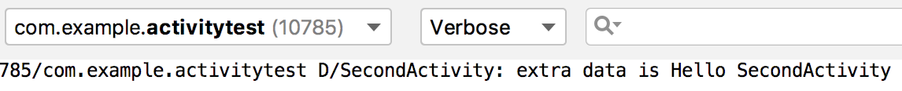

**图 3.21　SecondActivity 中的打印信息**

可以看到，我们在 SecondActivity 中成功得到了从 FirstActivity 传递过来的数据。

### 3.3.5　返回数据给上一个 Activity

既然可以传递数据给下一个 Activity，那么能不能够返回数据给上一个 Activity 呢？答案是肯定的。不过不同的是，返回上一个 Activity 只需要按一下 Back 键就可以了，并没有一个用于启动 Activity 的 Intent 来传递数据，这该怎么办呢？其实 Activity 类中还有一个用于启动 Activity 的 `startActivityForResult()` 方法，但它期望在 Activity 销毁的时候能够返回一个结果给上一个 Activity。毫无疑问，这就是我们所需要的。

`startActivityForResult()` 方法接收两个参数：第一个参数还是 Intent；第二个参数是请求码，用于在之后的回调中判断数据的来源。我们还是来实战一下，修改 FirstActivity 中按钮的点击事件，代码如下所示：

```Kotlin
button1.setOnClickListener {
    val intent = Intent(this, SecondActivity::class.java)
    startActivityForResult(intent, 1)
}
```

这里我们使用了 `startActivityForResult()` 方法来启动 SecondActivity，请求码只要是一个唯一值即可，这里传入了 1。接下来我们在 SecondActivity 中给按钮注册点击事件，并在点击事件中添加返回数据的逻辑，代码如下所示：

```Kotlin
class SecondActivity : AppCompatActivity() {

    override fun onCreate(savedInstanceState: Bundle?) {
        super.onCreate(savedInstanceState)
        setContentView(R.layout.second_layout)
        button2.setOnClickListener {
            val intent = Intent()
            intent.putExtra("data_return", "Hello FirstActivity")
            setResult(RESULT_OK, intent)
            finish()
        }
    }

}
```

可以看到，我们还是构建了一个 Intent，只不过这个 Intent 仅仅用于传递数据而已，它没有指定任何的“意图”。紧接着把要传递的数据存放在 Intent 中，然后调用了 `setResult()` 方法。这个方法非常重要，专门用于向上一个 Activity 返回数据。`setResult()` 方法接收两个参数：第一个参数用于向上一个 Activity 返回处理结果，一般只使用 `RESULT_OK` 或 `RESULT_CANCELED` 这两个值；第二个参数则把带有数据的 Intent 传递回去。最后调用了 `finish()` 方法来销毁当前 Activity。

由于我们是使用 `startActivityForResult()` 方法来启动 SecondActivity 的，在 SecondActivity 被销毁之后会回调上一个 Activity 的 `onActivityResult()` 方法，因此我们需要在 FirstActivity 中重写这个方法来得到返回的数据，如下所示：

```Kotlin
override fun onActivityResult(requestCode: Int, resultCode: Int, data: Intent?) {
    super.onActivityResult(requestCode, resultCode, data)
    when (requestCode) {
        1 -> if (resultCode == RESULT_OK) {
            val returnedData = data?.getStringExtra("data_return")
            Log.d("FirstActivity", "returned data is $returnedData")
        }
    }
}
```

`onActivityResult()` 方法带有 3 个参数：第一个参数 `requestCode`，即我们在启动 Activity 时传入的请求码；第二个参数 `resultCode`，即我们在返回数据时传入的处理结果；第三个参数 `data`，即携带着返回数据的 Intent。由于在一个 Activity 中有可能调用 `startActivityForResult()` 方法去启动很多不同的 Activity，每一个 Activity 返回的数据都会回调到 `onActivityResult()` 这个方法中，因此我们首先要做的就是通过检查 `requestCode` 的值来判断数据来源。确定数据是从 SecondActivity 返回的之后，我们再通过 `resultCode` 的值来判断处理结果是否成功。最后从 `data` 中取值并打印出来，这样就完成了向上一个 Activity 返回数据的工作。

重新运行程序，在 FirstActivity 的界面点击按钮会打开 SecondActivity，然后在 SecondActivity 界面点击 Button 2 按钮会回到 FirstActivity，这时查看 Logcat 的打印信息，如图 3.22 所示。

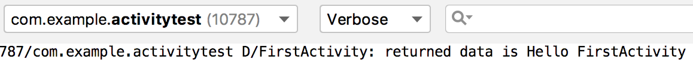

**图 3.22　FirstActivity 中的打印信息**

可以看到，SecondActivity 已经成功返回数据给 FirstActivity 了。

你可能会问，如果用户在 SecondActivity 中并不是通过点击按钮，而是通过按下 Back 键回到 FirstActivity，这样数据不就没法返回了吗？没错，不过这种情况还是很好处理的，我们可以通过在 SecondActivity 中重写 `onBackPressed()` 方法来解决这个问题，代码如下所示：

```Kotlin
override fun onBackPressed() {
    val intent = Intent()
    intent.putExtra("data_return", "Hello FirstActivity")
    setResult(RESULT_OK, intent)
    finish()
}
```

这样，当用户按下 Back 键后，就会执行 `onBackPressed()` 方法中的代码，我们在这里添加返回数据的逻辑就行了。

## 3.4　Activity 的生命周期

掌握 Activity 的生命周期对任何 Android 开发者来说都非常重要，当你深入理解 Activity 的生命周期之后，就可以写出更加连贯流畅的程序，并在如何合理管理应用资源方面发挥得游刃有余。你的应用程序也将会拥有更好的用户体验。

### 3.4.1　返回栈

经过前面几节的学习，相信你已经发现了 Android 中的 Activity 是可以层叠的。我们每启动一个新的 Activity，就会覆盖在原 Activity 之上，然后点击 Back 键会销毁最上面的 Activity，下面的一个 Activity 就会重新显示出来。

其实 Android 是使用任务（task）来管理 Activity 的，一个任务就是一组存放在栈里的 Activity 的集合，这个栈也被称作返回栈（back stack）。栈是一种后进先出的数据结构，在默认情况下，每当我们启动了一个新的 Activity，它就会在返回栈中入栈，并处于栈顶的位置。而每当我们按下 Back 键或调用 `finish()` 方法去销毁一个 Activity 时，处于栈顶的 Activity 就会出栈，前一个入栈的 Activity 就会重新处于栈顶的位置。系统总是会显示处于栈顶的 Activity 给用户。

示意图 3.23 展示了返回栈是如何管理 Activity 入栈出栈操作的。

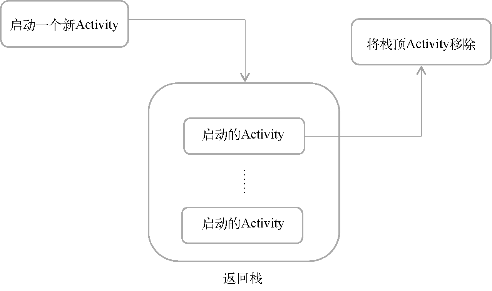

**图 3.23　返回栈工作示意图**

### 3.4.2　Activity 状态

每个 Activity 在其生命周期中最多可能会有 4 种状态。

1. **运行状态**

   当一个 Activity 位于返回栈的栈顶时，Activity 就处于运行状态。系统最不愿意回收的就是处于运行状态的 Activity，因为这会带来非常差的用户体验。
2. **暂停状态**

   当一个 Activity 不再处于栈顶位置，但仍然可见时，Activity 就进入了暂停状态。你可能会觉得，既然 Activity 已经不在栈顶了，怎么会可见呢？这是因为并不是每一个 Activity 都会占满整个屏幕，比如对话框形式的 Activity 只会占用屏幕中间的部分区域。处于暂停状态的 Activity 仍然是完全存活着的，系统也不愿意回收这种 Activity（因为它还是可见的，回收可见的东西都会在用户体验方面有不好的影响），只有在内存极低的情况下，系统才会去考虑回收这种 Activity。
3. **停止状态**

   当一个 Activity 不再处于栈顶位置，并且完全不可见的时候，就进入了停止状态。系统仍然会为这种 Activity 保存相应的状态和成员变量，但是这并不是完全可靠的，当其他地方需要内存时，处于停止状态的 Activity 有可能会被系统回收。
4. **销毁状态**

   一个 Activity 从返回栈中移除后就变成了销毁状态。系统最倾向于回收处于这种状态的 Activity，以保证手机的内存充足。

### 3.4.3　Activity 的生存期

Activity 类中定义了 7 个回调方法，覆盖了 Activity 生命周期的每一个环节，下面就来一一介绍这 7 个方法。

- `onCreate()`。这个方法你已经看到过很多次了，我们在每个 Activity 中都重写了这个方法，它会在 Activity 第一次被创建的时候调用。你应该在这个方法中完成 Activity 的初始化操作，比如加载布局、绑定事件等。
- `onStart()`。这个方法在 Activity 由不可见变为可见的时候调用。
- `onResume()`。这个方法在 Activity 准备好和用户进行交互的时候调用。此时的 Activity 一定位于返回栈的栈顶，并且处于运行状态。
- `onPause()`。这个方法在系统准备去启动或者恢复另一个 Activity 的时候调用。我们通常会在这个方法中将一些消耗 CPU 的资源释放掉，以及保存一些关键数据，但这个方法的执行速度一定要快，不然会影响到新的栈顶 Activity 的使用。
- `onStop()`。这个方法在 Activity 完全不可见的时候调用。它和 `onPause()` 方法的主要区别在于，如果启动的新 Activity 是一个对话框式的 Activity，那么 `onPause()` 方法会得到执行，而 `onStop()` 方法并不会执行。
- `onDestroy()`。这个方法在 Activity 被销毁之前调用，之后 Activity 的状态将变为销毁状态。
- `onRestart()`。这个方法在 Activity 由停止状态变为运行状态之前调用，也就是 Activity 被重新启动了。

以上 7 个方法中除了 `onRestart()` 方法，其他都是两两相对的，从而又可以将 Activity 分为以下 3 种生存期。

- **完整生存期**。Activity 在 `onCreate()` 方法和 `onDestroy()` 方法之间所经历的就是完整生存期。一般情况下，一个 Activity 会在 `onCreate()` 方法中完成各种初始化操作，而在 `onDestroy()` 方法中完成释放内存的操作。
- **可见生存期**。Activity 在 `onStart()` 方法和 `onStop()` 方法之间所经历的就是可见生存期。在可见生存期内，Activity 对于用户总是可见的，即便有可能无法和用户进行交互。我们可以通过这两个方法合理地管理那些对用户可见的资源。比如在 `onStart()` 方法中对资源进行加载，而在 `onStop()` 方法中对资源进行释放，从而保证处于停止状态的 Activity 不会占用过多内存。
- **前台生存期**。Activity 在 `onResume()` 方法和 `onPause()` 方法之间所经历的就是前台生存期。在前台生存期内，Activity 总是处于运行状态，此时的 Activity 是可以和用户进行交互的，我们平时看到和接触最多的就是这个状态下的 Activity。

为了帮助你更好地理解，Android 官方提供了一张 Activity 生命周期的示意图，如图 3.24 所示。


**图 3.24　Activity 的生命周期**

### 3.4.4　体验 Activity 的生命周期

讲了这么多理论知识，是时候进行实战了。下面我们将通过一个实例，让你可以更加直观地体验 Activity 的生命周期。

这次我们不准备在 ActivityTest 这个项目的基础上修改了，而是新建一个项目。因此，首先关闭 ActivityTest 项目，点击导航栏 File→Close Project。然后新建一个 ActivityLifeCycleTest 项目，新建项目的过程你应该已经非常清楚了，不需要我再进行赘述，这次我们允许 Android Studio 帮我们自动创建 Activity 和布局，这样可以省去不少工作，创建的 Activity 名和布局名都使用默认值。

这样主 Activity 就创建完成了，我们还需要分别再创建两个子 Activity——NormalActivity 和 DialogActivity，下面一步步来实现。

右击 com.example.activitylifecycletest 包 →New→Activity→Empty Activity，新建 NormalActivity，布局起名为 normal_layout。然后使用同样的方式创建 DialogActivity，布局起名为 dialog_layout。

现在编辑 normal_layout.xml 文件，将里面的代码替换成如下内容：

```xml
<LinearLayout xmlns:android="http://schemas.android.com/apk/res/android"
    android:orientation="vertical"
    android:layout_width="match_parent"
    android:layout_height="match_parent">

    <TextView
        android:layout_width="match_parent"
        android:layout_height="wrap_content"
        android:text="This is a normal activity"
    />

</LinearLayout>
```

在这个布局中，我们非常简单地使用了一个 TextView，用于显示一行文字，在下一章中你将会学到关于 TextView 的更多用法。

然后编辑 dialog_layout.xml 文件，将里面的代码替换成如下内容：

```xml
<LinearLayout xmlns:android="http://schemas.android.com/apk/res/android"
    android:orientation="vertical"
    android:layout_width="match_parent"
    android:layout_height="match_parent">

    <TextView
        android:layout_width="match_parent"
        android:layout_height="wrap_content"
        android:text="This is a dialog activity"
    />

</LinearLayout>
```

两个布局文件的代码几乎没有区别，只是显示的文字不同而已。

NormalActivity 和 DialogActivity 中的代码我们保持默认就好，不需要改动。

其实从名字上就可以看出，这两个 Activity 一个是普通的 Activity，一个是对话框式的 Activity。可是我们并没有修改 Activity 的任何代码，两个 Activity 的代码应该几乎是一模一样的，那么是在哪里将 Activity 设成对话框式的呢？别着急，下面我们马上开始设置。修改 AndroidManifest.xml 的 `<activity>` 标签的配置，如下所示：

```xml
<activity android:name=".DialogActivity"
    android:theme="@style/Theme.AppCompat.Dialog">
</activity>
<activity android:name=".NormalActivity">
</activity>
```

这里是两个 Activity 的注册代码，但是 DialogActivity 的代码有些不同，我们给它使用了一个 `android:theme` 属性，用于给当前 Activity 指定主题，Android 系统内置有很多主题可以选择，当然我们也可以定制自己的主题，而这里的 `@style/Theme.AppCompat.Dialog` 则毫无疑问是让 DialogActivity 使用对话框式的主题。

接下来我们修改 activity_main.xml，重新定制主 Activity 的布局，将里面的代码替换成如下内容：

```xml
<LinearLayout xmlns:android="http://schemas.android.com/apk/res/android"
    android:orientation="vertical"
    android:layout_width="match_parent"
    android:layout_height="match_parent">

    <Button
        android:id="@+id/startNormalActivity"
        android:layout_width="match_parent"
        android:layout_height="wrap_content"
        android:text="Start NormalActivity" />

    <Button
        android:id="@+id/startDialogActivity"
        android:layout_width="match_parent"
        android:layout_height="wrap_content"
        android:text="Start DialogActivity" />

</LinearLayout>
```

可以看到，我们在 LinearLayout 中加入了两个按钮，一个用于启动 NormalActivity，一个用于启动 DialogActivity。

最后修改 MainActivity 中的代码，如下所示：

```Kotlin
class MainActivity : AppCompatActivity() {

    private val tag = "MainActivity"

    override fun onCreate(savedInstanceState: Bundle?) {
        super.onCreate(savedInstanceState)
        Log.d(tag, "onCreate")
        setContentView(R.layout.activity_main)
        startNormalActivity.setOnClickListener {
            val intent = Intent(this, NormalActivity::class.java)
            startActivity(intent)
        }
        startDialogActivity.setOnClickListener {
            val intent = Intent(this, DialogActivity::class.java)
            startActivity(intent)
        }
    }

    override fun onStart() {
        super.onStart()
        Log.d(tag, "onStart")
    }

    override fun onResume() {
        super.onResume()
        Log.d(tag, "onResume")
    }

    override fun onPause() {
        super.onPause()
        Log.d(tag, "onPause")
    }

    override fun onStop() {
        super.onStop()
        Log.d(tag, "onStop")
    }

    override fun onDestroy() {
        super.onDestroy()
        Log.d(tag, "onDestroy")
    }

    override fun onRestart() {
        super.onRestart()
        Log.d(tag, "onRestart")
    }

}
```

在 `onCreate()` 方法中，我们分别为两个按钮注册了点击事件，点击第一个按钮会启动 NormalActivity，点击第二个按钮会启动 DialogActivity。然后在 Activity 的 7 个回调方法中分别打印了一句话，这样就可以通过观察日志来更直观地理解 Activity 的生命周期。

现在运行程序，效果如图 3.25 所示。

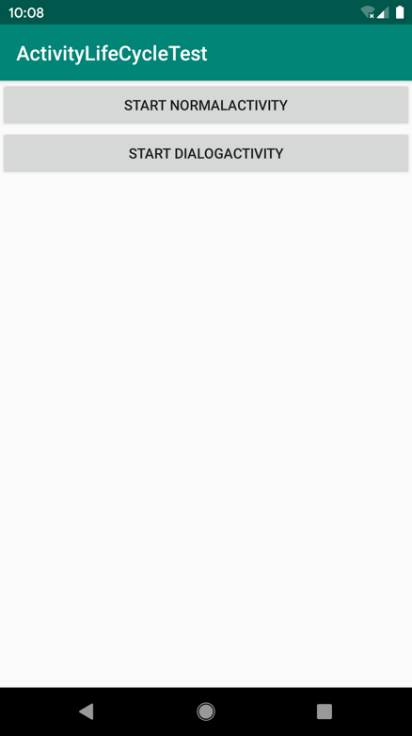

**图 3.25　MainActivity 界面**

这时观察 Logcat 中的打印日志，如图 3.26 所示。

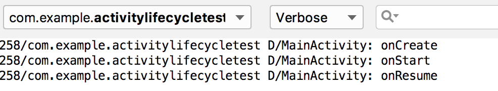

**图 3.26　启动程序时的打印日志**

可以看到，当 MainActivity 第一次被创建时会依次执行 `onCreate()`、`onStart()` 和 `onResume()` 方法。然后点击第一个按钮，启动 NormalActivity，如图 3.27 所示。


**图 3.27　NormalActivity 界面**

此时的打印信息如图 3.28 所示。

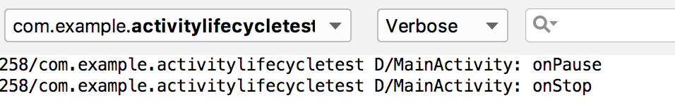

**图 3.28　打开 NormalActivity 时的打印日志**

由于 NormalActivity 已经把 MainActivity 完全遮挡住，因此 `onPause()` 和 `onStop()` 方法都会得到执行。然后按下 Back 键返回 MainActivity，打印信息如图 3.29 所示。


**图 3.29　返回 MainActivity 时的打印日志**

由于之前 MainActivity 已经进入了停止状态，所以 `onRestart()` 方法会得到执行，之后会依次执行 `onStart()` 和 `onResume()` 方法。注意，此时 `onCreate()` 方法不会执行，因为 MainActivity 并没有重新创建。

然后点击第二个按钮，启动 DialogActivity，如图 3.30 所示。


**图 3.30　DialogActivity 界面**

此时观察打印信息，如图 3.31 所示。


**图 3.31　打开 DialogActivity 时的打印日志**

可以看到，只有 `onPause()` 方法得到了执行，`onStop()` 方法并没有执行，这是因为 DialogActivity 并没有完全遮挡住 MainActivity，此时 MainActivity 只是进入了暂停状态，并没有进入停止状态。相应地，按下 Back 键返回 MainActivity 也应该只有 `onResume()` 方法会得到执行，如图 3.32 所示。

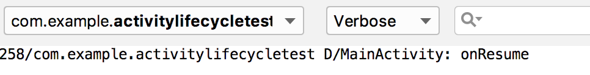

**图 3.32　再次返回 MainActivity 时的打印日志**

最后在 MainActivity 按下 Back 键退出程序，打印信息如图 3.33 所示。


**图 3.33　退出程序时的打印日志**

依次会执行 `onPause()`、`onStop()` 和 `onDestroy()` 方法，最终销毁 MainActivity。

这样 Activity 完整的生命周期你已经体验了一遍，是不是理解得更加深刻了？

### 3.4.5　Activity 被回收了怎么办

前面我们说过，当一个 Activity 进入了停止状态，是有可能被系统回收的。那么想象以下场景：应用中有一个 Activity A，用户在 Activity A 的基础上启动了 Activity B，Activity A 就进入了停止状态，这个时候由于系统内存不足，将 Activity A 回收掉了，然后用户按下 Back 键返回 Activity A，会出现什么情况呢？其实还是会正常显示 Activity A 的，只不过这时并不会执行 `onRestart()` 方法，而是会执行 Activity A 的 `onCreate()` 方法，因为 Activity A 在这种情况下会被重新创建一次。

这样看上去好像一切正常，可是别忽略了一个重要问题：Activity A 中是可能存在临时数据和状态的。打个比方，MainActivity 中如果有一个文本输入框，现在你输入了一段文字，然后启动 NormalActivity，这时 MainActivity 由于系统内存不足被回收掉，过了一会你又点击了 Back 键回到 MainActivity，你会发现刚刚输入的文字都没了，因为 MainActivity 被重新创建了。

如果我们的应用出现了这种情况，是会比较影响用户体验的，所以得想想办法解决这个问题。其实，Activity 中还提供了一个 `onSaveInstanceState()` 回调方法，这个方法可以保证在 Activity 被回收之前一定会被调用，因此我们可以通过这个方法来解决问题。

`onSaveInstanceState()` 方法会携带一个 `Bundle` 类型的参数，`Bundle` 提供了一系列的方法用于保存数据，比如可以使用 `putString()` 方法保存字符串，使用 `putInt()` 方法保存整型数据，以此类推。每个保存方法需要传入两个参数，第一个参数是键，用于后面从 `Bundle` 中取值，第二个参数是真正要保存的内容。

在 MainActivity 中添加如下代码就可以将临时数据进行保存了：

```Kotlin
override fun onSaveInstanceState(outState: Bundle) {
    super.onSaveInstanceState(outState)
    val tempData = "Something you just typed"
    outState.putString("data_key", tempData)
}
```

数据是已经保存下来了，那么我们应该在哪里进行恢复呢？细心的你也许早就发现，我们一直使用的 `onCreate()` 方法其实也有一个 `Bundle` 类型的参数。这个参数在一般情况下都是 `null`，但是如果在 Activity 被系统回收之前，你通过 `onSaveInstanceState()` 方法保存数据，这个参数就会带有之前保存的全部数据，我们只需要再通过相应的取值方法将数据取出即可。

修改 MainActivity 的 `onCreate()` 方法，如下所示：

```Kotlin
override fun onCreate(savedInstanceState: Bundle?) {
    super.onCreate(savedInstanceState)
    Log.d(tag, "onCreate")
    setContentView(R.layout.activity_main)
    if (savedInstanceState != null) {
        val tempData = savedInstanceState.getString("data_key")
        Log.d(tag, "tempData is $tempData")
    }
    ...
}
```

取出值之后再做相应的恢复操作就可以了，比如将文本内容重新赋值到文本输入框上，这里我们只是简单地打印一下。

不知道你有没有察觉，使用 `Bundle` 保存和取出数据是不是有些似曾相识呢？没错！我们在使用 Intent 传递数据时也用的类似的方法。这里提醒一点，Intent 还可以结合 `Bundle` 一起用于传递数据。首先我们可以把需要传递的数据都保存在 `Bundle` 对象中，然后再将 `Bundle` 对象存放在 Intent 里。到了目标 Activity 之后，先从 Intent 中取出 `Bundle`，再从 `Bundle` 中一一取出数据。具体的代码我就不写了，要学会举一反三哦。

另外，当手机的屏幕发生旋转的时候，Activity 也会经历一个重新创建的过程，因而在这种情况下，Activity 中的数据也会丢失。虽然这个问题同样可以通过 `onSaveInstanceState()` 方法来解决，但是一般不太建议这么做，因为对于横竖屏旋转的情况，现在有更加优雅的解决方案，我们将 13.2 节中学习。

## 3.5　Activity 的启动模式

Activity 的启动模式对你来说应该是个全新的概念，在实际项目中我们应该根据特定的需求为每个 Activity 指定恰当的启动模式。启动模式一共有 4 种，分别是 standard、singleTop、singleTask 和 singleInstance，可以在 AndroidManifest.xml 中通过给 `<activity>` 标签指定 `android:launchMode` 属性来选择启动模式。下面我们来逐个进行学习。

### 3.5.1　standard

standard 是 Activity 默认的启动模式，在不进行显式指定的情况下，所有 Activity 都会自动使用这种启动模式。到目前为止，我们写过的所有 Activity 都是使用的 standard 模式。经过上一节的学习，你已经知道了 Android 是使用返回栈来管理 Activity 的，在 standard 模式下，每当启动一个新的 Activity，它就会在返回栈中入栈，并处于栈顶的位置。对于使用 standard 模式的 Activity，系统不会在乎这个 Activity 是否已经在返回栈中存在，每次启动都会创建一个该 Activity 的新实例。

我们现在通过实践来体会一下 standard 模式，这次还是在 ActivityTest 项目的基础上修改。首先关闭 ActivityLifeCycleTest 项目，打开 ActivityTest 项目。

修改 FirstActivity 中 `onCreate()` 方法的代码，如下所示：

```Kotlin
override fun onCreate(savedInstanceState: Bundle?) {
    super.onCreate(savedInstanceState)
    Log.d("FirstActivity", this.toString())
    setContentView(R.layout.first_layout)
    button1.setOnClickListener {
        val intent = Intent(this, FirstActivity::class.java)
        startActivity(intent)
    }
}
```

代码看起来有些奇怪吧？在 FirstActivity 的基础上启动 FirstActivity。从逻辑上来讲，这确实没什么意义，不过我们的重点在于研究 standard 模式，因此不必在意这段代码有什么实际用途。另外我们还在 `onCreate()` 方法中添加了一行打印信息，用于打印当前 Activity 的实例。

现在重新运行程序，然后在 FirstActivity 界面连续点击两次按钮，可以看到 Logcat 中的打印信息如图 3.34 所示。


**图 3.34　standard 模式下的打印日志**

从打印信息中可以看出，每点击一次按钮，就会创建出一个新的 FirstActivity 实例。此时返回栈中也会存在 3 个 FirstActivity 的实例，因此你需要连按 3 次 Back 键才能退出程序。

standard 模式的原理如图 3.35 所示。


**图 3.35　standard 模式原理示意图**

### 3.5.2　singleTop

可能在有些情况下，你会觉得 standard 模式不太合理。Activity 明明已经在栈顶了，为什么再次启动的时候还要创建一个新的 Activity 实例呢？别着急，这只是系统默认的一种启动模式而已，你完全可以根据自己的需要进行修改，比如使用 singleTop 模式。当 Activity 的启动模式指定为 singleTop，在启动 Activity 时如果发现返回栈的栈顶已经是该 Activity，则认为可以直接使用它，不会再创建新的 Activity 实例。

我们还是通过实践来体会一下，修改 AndroidManifest.xml 中 FirstActivity 的启动模式，如下所示：

```xml
<activity
    android:name=".FirstActivity"
    android:launchMode="singleTop"
    android:label="This is FirstActivity">
    <intent-filter>
        <action android:name="android.intent.action.MAIN"/>
        <category android:name="android.intent.category.LAUNCHER"/>
    </intent-filter>
</activity>
```

然后重新运行程序，查看 Logcat，你会看到已经创建了一个 FirstActivity 的实例，如图 3.36 所示。


**图 3.36　singleTop 模式下的打印日志**

但是之后不管你点击多少次按钮都不会再有新的打印信息出现，因为目前 FirstActivity 已经处于返回栈的栈顶，每当想要再启动一个 FirstActivity 时，都会直接使用栈顶的 Activity，因此 FirstActivity 只会有一个实例，仅按一次 Back 键就可以退出程序。

不过当 FirstActivity 并未处于栈顶位置时，再启动 FirstActivity 还是会创建新的实例的。

下面我们来实验一下，修改 FirstActivity 中 `onCreate()` 方法的代码，如下所示：

```Kotlin
override fun onCreate(savedInstanceState: Bundle?) {
    super.onCreate(savedInstanceState)
    Log.d("FirstActivity", this.toString())
    setContentView(R.layout.first_layout)
    button1.setOnClickListener {
        val intent = Intent(this, SecondActivity::class.java)
        startActivity(intent)
    }
}
```

这次我们点击按钮后启动的是 SecondActivity。然后修改 SecondActivity 中 `onCreate()` 方法的代码，如下所示：

```Kotlin
override fun onCreate(savedInstanceState: Bundle?) {
    super.onCreate(savedInstanceState)
    Log.d("SecondActivity", this.toString())
    setContentView(R.layout.second_layout)
    button2.setOnClickListener {
        val intent = Intent(this, FirstActivity::class.java)
        startActivity(intent)
    }
}
```

我们在 SecondActivity 中添加了一行打印日志，并且在按钮点击事件里加入了启动 FirstActivity 的代码。现在重新运行程序，在 FirstActivity 界面点击按钮进入 SecondActivity，然后在 SecondActivity 界面点击按钮，又会重新进入 FirstActivity。

查看 Logcat 中的打印信息，如图 3.37 所示。

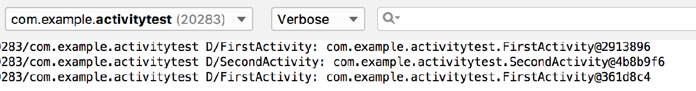

**图 3.37　singleTop 模式下的打印日志**

可以看到系统创建了两个不同的 FirstActivity 实例，这是由于在 SecondActivity 中再次启动 FirstActivity 时，栈顶 Activity 已经变成了 SecondActivity，因此会创建一个新的 FirstActivity 实例。现在按下 Back 键会返回到 SecondActivity，再次按下 Back 键又会回到 FirstActivity，再按一次 Back 键才会退出程序。

singleTop 模式的原理如图 3.38 所示。

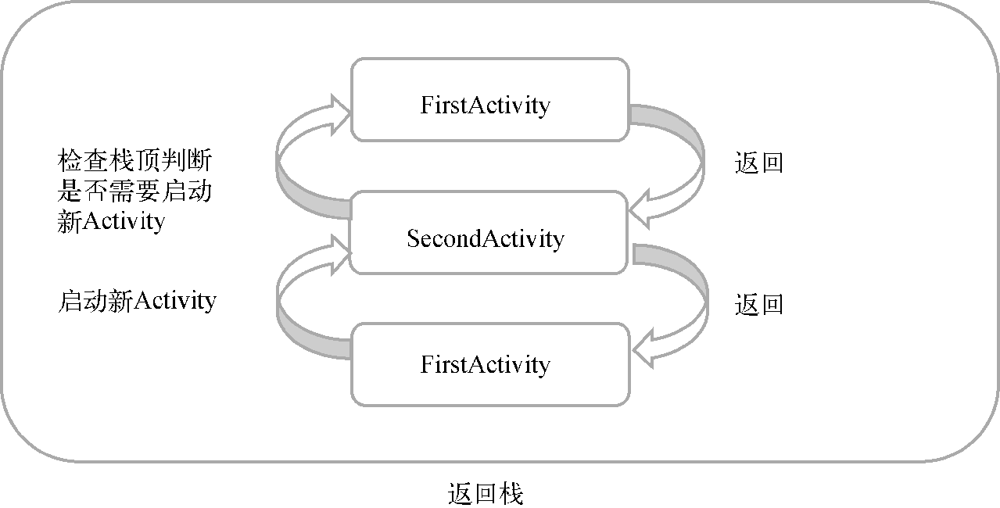

**图 3.38　singleTop 模式原理示意图**

### 3.5.3　singleTask

使用 singleTop 模式可以很好地解决重复创建栈顶 Activity 的问题，但是正如你在上一节所看到的，如果该 Activity 并没有处于栈顶的位置，还是可能会创建多个 Activity 实例的。那么有没有什么办法可以让某个 Activity 在整个应用程序的上下文中只存在一个实例呢？这就要借助 singleTask 模式来实现了。当 Activity 的启动模式指定为 singleTask，每次启动该 Activity 时，系统首先会在返回栈中检查是否存在该 Activity 的实例，如果发现已经存在则直接使用该实例，并把在这个 Activity 之上的所有其他 Activity 统统出栈，如果没有发现就会创建一个新的 Activity 实例。

我们还是通过代码来更加直观地理解一下。修改 AndroidManifest.xml 中 FirstActivity 的启动模式：

```xml
<activity
    android:name=".FirstActivity"
    android:launchMode="singleTask"
    android:label="This is FirstActivity">
    <intent-filter>
        <action android:name="android.intent.action.MAIN" />
        <category android:name="android.intent.category.LAUNCHER" />
    </intent-filter>
</activity>
```

然后在 FirstActivity 中添加 `onRestart()` 方法，并打印日志：

```Kotlin
override fun onRestart() {
    super.onRestart()
    Log.d("FirstActivity", "onRestart")
}
```

最后在 SecondActivity 中添加 `onDestroy()` 方法，并打印日志：

```Kotlin
override fun onDestroy() {
    super.onDestroy()
    Log.d("SecondActivity", "onDestroy")
}
```

现在重新运行程序，在 FirstActivity 界面点击按钮进入 SecondActivity，然后在 SecondActivity 界面点击按钮，又会重新进入 FirstActivity。

查看 Logcat 中的打印信息，如图 3.39 所示。

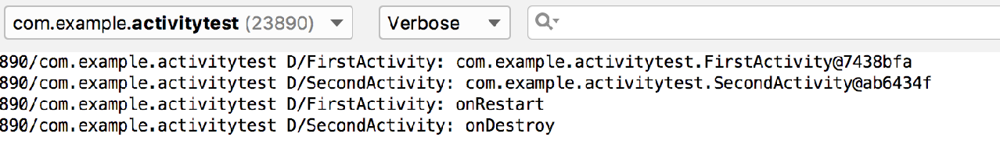

**图 3.39　singleTask 模式下的打印日志**

其实从打印信息中就可以明显看出，在 SecondActivity 中启动 FirstActivity 时，会发现返回栈中已经存在一个 FirstActivity 的实例，并且是在 SecondActivity 的下面，于是 SecondActivity 会从返回栈中出栈，而 FirstActivity 重新成为了栈顶 Activity，因此 FirstActivity 的 `onRestart()` 方法和 SecondActivity 的 `onDestroy()` 方法会得到执行。现在返回栈中只剩下一个 FirstActivity 的实例了，按一下 Back 键就可以退出程序。

singleTask 模式的原理如图 3.40 所示。

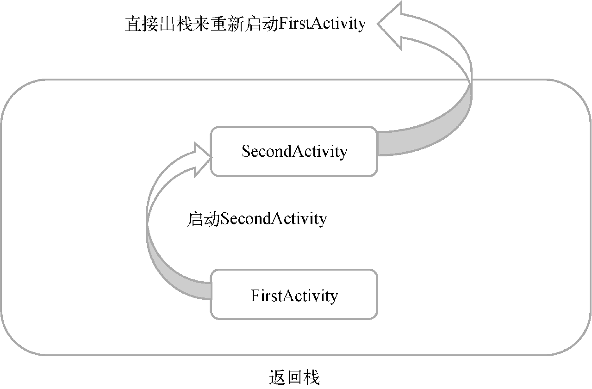

**图 3.40　singleTask 模式原理示意图**

### 3.5.4　singleInstance

singleInstance 模式应该算是 4 种启动模式中最特殊也最复杂的一个了，你也需要多花点工夫来理解这个模式。不同于以上 3 种启动模式，指定为 singleInstance 模式的 Activity 会启用一个新的返回栈来管理这个 Activity（其实如果 singleTask 模式指定了不同的 taskAffinity，也会启动一个新的返回栈）。那么这样做有什么意义呢？想象以下场景，假设我们的程序中有一个 Activity 是允许其他程序调用的，如果想实现其他程序和我们的程序可以共享这个 Activity 的实例，应该如何实现呢？使用前面 3 种启动模式肯定是做不到的，因为每个应用程序都会有自己的返回栈，同一个 Activity 在不同的返回栈中入栈时必然创建了新的实例。而使用 singleInstance 模式就可以解决这个问题，在这种模式下，会有一个单独的返回栈来管理这个 Activity，不管是哪个应用程序来访问这个 Activity，都共用同一个返回栈，也就解决了共享 Activity 实例的问题。

为了帮助你更好地理解这种启动模式，我们还是来实践一下。修改 AndroidManifest.xml 中 SecondActivity 的启动模式：

```xml
<activity android:name=".SecondActivity"
    android:launchMode="singleInstance">
    <intent-filter>
        <action android:name="com.example.activitytest.ACTION_START" />
        <category android:name="android.intent.category.DEFAULT" />
        <category android:name="com.example.activitytest.MY_CATEGORY" />
    </intent-filter>
</activity>
```

我们先将 SecondActivity 的启动模式指定为 singleInstance，然后修改 FirstActivity 中 `onCreate()` 方法的代码：

```Kotlin
override fun onCreate(savedInstanceState: Bundle?) {
    super.onCreate(savedInstanceState)
    Log.d("FirstActivity", "Task id is $taskId")
    setContentView(R.layout.first_layout)
    button1.setOnClickListener {
        val intent = Intent(this, SecondActivity::class.java)
        startActivity(intent)
    }
}
```

这里我们在 `onCreate()` 方法中打印了当前返回栈的 `id`。注意上述代码中的 `taskId` 实际上调用的是父类的 `getTaskId()` 方法。然后修改 SecondActivity 中 `onCreate()` 方法的代码：

```Kotlin
override fun onCreate(savedInstanceState: Bundle?) {
    super.onCreate(savedInstanceState)
    Log.d("SecondActivity", "Task id is $taskId")
    setContentView(R.layout.second_layout)
    button2.setOnClickListener {
        val intent = Intent(this, ThirdActivity::class.java)
        startActivity(intent)
    }
}
```

同样在 `onCreate()` 方法中打印了当前返回栈的 `id`，然后又修改了按钮点击事件的代码，用于启动 ThirdActivity。最后修改 ThirdActivity 中 `onCreate()` 方法的代码：

```Kotlin
override fun onCreate(savedInstanceState: Bundle?) {
    super.onCreate(savedInstanceState)
    Log.d("ThirdActivity", "Task id is $taskId")
    setContentView(R.layout.third_layout)
}
```

仍然是在 `onCreate()` 方法中打印了当前返回栈的 `id`。

现在重新运行程序，在 FirstActivity 界面点击按钮进入 SecondActivity，然后在 SecondActivity 界面点击按钮进入 ThirdActivity。

查看 Logcat 中的打印信息，如图 3.41 所示。


**图 3.41　singleInstance 模式下的打印日志**

可以看到，SecondActivity 的 `Task id` 不同于 FirstActivity 和 ThirdActivity，这说明 SecondActivity 确实是存放在一个单独的返回栈里的，而且这个栈中只有 SecondActivity 这一个 Activity。

然后我们按下 Back 键进行返回，你会发现 ThirdActivity 竟然直接返回到了 FirstActivity，再按下 Back 键又会返回到 SecondActivity，再按下 Back 键才会退出程序，这是为什么呢？其实原理很简单，由于 FirstActivity 和 ThirdActivity 是存放在同一个返回栈里的，当在 ThirdActivity 的界面按下 Back 键时，ThirdActivity 会从返回栈中出栈，那么 FirstActivity 就成为了栈顶 Activity 显示在界面上，因此也就出现了从 ThirdActivity 直接返回到 FirstActivity 的情况。然后在 FirstActivity 界面再次按下 Back 键，这时当前的返回栈已经空了，于是就显示了另一个返回栈的栈顶 Activity，即 SecondActivity。最后再次按下 Back 键，这时所有返回栈都已经空了，也就自然退出了程序。

singleInstance 模式的原理如图 3.42 所示。

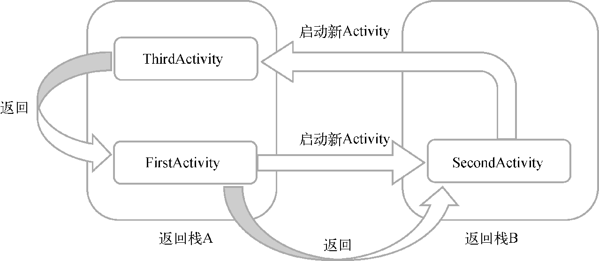

**图 3.42　singleInstance 模式原理示意图**

## 3.6　Activity 的最佳实践

关于 Activity，你已经掌握了非常多的知识，不过恐怕离能够完全灵活运用还有一段距离。虽然知识点只有这么多，但运用的技巧却是多种多样的。所以，在这里我准备教你几种关于 Activity 的最佳实践技巧，这些技巧在你以后的开发工作当中将会非常有用。

### 3.6.1　知晓当前是在哪一个 Activity

这个技巧将教会你如何根据程序当前的界面就能判断出这是哪一个 Activity。可能你会觉得挺纳闷的，我自己写的代码怎么会不知道这是哪一个 Activity 呢？然而现实情况是，在你进入一家公司之后，更有可能的是接手一份别人写的代码，因为你刚进公司就正好有一个新项目启动的概率并不高。阅读别人的代码时有一个很头疼的问题，就是当你需要在某个界面上修改一些非常简单的东西时，却半天找不到这个界面对应的 Activity 是哪一个。学会了本节的技巧之后，这对你来说就再也不是难题了。

我们还是在 ActivityTest 项目的基础上修改，首先需要新建一个 `BaseActivity` 类。右击 com.example.activitytest 包 →New→Kotlin File/Class，在弹出的窗口中输入 BaseActivity，创建类型选择 Class，如图 3.43 所示。


**图 3.43　创建** **`BaseActivity`** **类**

注意，这里的 `BaseActivity` 和普通 Activity 的创建方式并不一样，因为我们不需要让 `BaseActivity` 在 AndroidManifest.xml 中注册，所以选择创建一个普通的 Kotlin 类就可以了。然后让 `BaseActivity` 继承自 `AppCompatActivity`，并重写 `onCreate()` 方法，如下所示：

```Kotlin
open class BaseActivity : AppCompatActivity() {

    override fun onCreate(savedInstanceState: Bundle?) {
        super.onCreate(savedInstanceState)
        Log.d("BaseActivity", javaClass.simpleName)
    }

}
```

我们在 `onCreate()` 方法中加了一行日志，用于打印当前实例的类名。这里我要额外说明一下，Kotlin 中的 `javaClass` 表示获取当前实例的 Class 对象，相当于在 Java 中调用 `getClass()` 方法；而 Kotlin 中的 `BaseActivity::class.java` 表示获取 BaseActivity 类的 Class 对象，相当于在 Java 中调用 `BaseActivity.class`。在上述代码中，我们先是获取了当前实例的 Class 对象，然后再调用 `simpleName` 获取当前实例的类名。

接下来我们需要让 `BaseActivity` 成为 ActivityTest 项目中所有 Activity 的父类，为了使 `BaseActivity` 可以被继承，我已经提前在类名的前面加上了 `open` 关键字。然后修改 FirstActivity、SecondActivity 和 ThirdActivity 的继承结构，让它们不再继承自 `AppCompatActivity`，而是继承自 `BaseActivity`。而由于 `BaseActivity` 又是继承自 `AppCompatActivity` 的，所以项目中所有 Activity 的现有功能并不受影响，它们仍然继承了 Activity 中的所有特性。

现在重新运行程序，然后通过点击按钮分别进入 FirstActivity、SecondActivity 和 ThirdActivity 的界面，这时观察 Logcat 中的打印信息，如图 3.44 所示。


**图 3.44　BaseActivity 中的打印日志**

现在每当我们进入一个 Activity 的界面，该 Activity 的类名就会被打印出来，这样我们就可以时刻知晓当前界面对应的是哪一个 Activity 了。

### 3.6.2　随时随地退出程序

如果目前你手机的界面还停留在 ThirdActivity，你会发现当前想退出程序是非常不方便的，需要连按 3 次 Back 键才行。按 Home 键只是把程序挂起，并没有退出程序。如果我们的程序需要注销或者退出的功能该怎么办呢？看来要有一个随时随地都能退出程序的方案才行。

其实解决思路也很简单，只需要用一个专门的集合对所有的 Activity 进行管理就可以了。下面我们就来实现一下。

新建一个单例类 `ActivityCollector` 作为 Activity 的集合，代码如下所示：

```Kotlin
object ActivityCollector {

    private val activities = ArrayList<Activity>()

    fun addActivity(activity: Activity) {
        activities.add(activity)
    }

    fun removeActivity(activity: Activity) {
        activities.remove(activity)
    }

    fun finishAll() {
        for (activity in activities) {
            if (!activity.isFinishing) {
                activity.finish()
            }
        }
        activities.clear()
    }

}
```

这里使用了单例类，是因为全局只需要一个 Activity 集合。在集合中，我们通过一个 ArrayList 来暂存 Activity，然后提供了一个 `addActivity()` 方法，用于向 ArrayList 中添加 Activity；提供了一个 `removeActivity()` 方法，用于从 ArrayList 中移除 Activity；最后提供了一个 `finishAll()` 方法，用于将 ArrayList 中存储的 Activity 全部销毁。注意在销毁 Activity 之前，我们需要先调用 `activity.isFinishing` 来判断 Activity 是否正在销毁中，因为 Activity 还可能通过按下 Back 键等方式被销毁，如果该 Activity 没有正在销毁中，我们再去调用它的 `finish()` 方法来销毁它。

接下来修改 `BaseActivity` 中的代码，如下所示：

```Kotlin
open class BaseActivity : AppCompatActivity() {

    override fun onCreate(savedInstanceState: Bundle?) {
        super.onCreate(savedInstanceState)
        Log.d("BaseActivity", javaClass.simpleName)
        ActivityCollector.addActivity(this)
    }

    override fun onDestroy() {
        super.onDestroy()
        ActivityCollector.removeActivity(this)
    }

}
```

在 `BaseActivity` 的 `onCreate()` 方法中调用了 `ActivityCollector` 的 `addActivity()` 方法，表明将当前正在创建的 Activity 添加到集合里。然后在 `BaseActivity` 中重写 `onDestroy()` 方法，并调用了 `ActivityCollector` 的 `removeActivity()` 方法，表明从集合里移除一个马上要销毁的 Activity。

从此以后，不管你想在什么地方退出程序，只需要调用 `ActivityCollector.finishAll()` 方法就可以了。例如在 ThirdActivity 界面想通过点击按钮直接退出程序，只需将代码改成如下形式：

```Kotlin
class ThirdActivity : BaseActivity() {

    override fun onCreate(savedInstanceState: Bundle?) {
        super.onCreate(savedInstanceState)
        Log.d("ThirdActivity", "Task id is $taskId")
        setContentView(R.layout.third_layout)
        button3.setOnClickListener {
            ActivityCollector.finishAll()
        }
    }

}
```

当然你还可以在销毁所有 Activity 的代码后面再加上杀掉当前进程的代码，以保证程序完全退出，杀掉进程的代码如下所示：

```Kotlin
android.os.Process.killProcess(android.os.Process.myPid())
```

`killProcess()` 方法用于杀掉一个进程，它接收一个进程 `id` 参数，我们可以通过 `myPid()` 方法来获得当前程序的进程 `id`。需要注意的是，`killProcess()` 方法只能用于杀掉当前程序的进程，不能用于杀掉其他程序。

### 3.6.3　启动 Activity 的最佳写法

启动 Activity 的方法相信你已经非常熟悉了，首先通过 Intent 构建出当前的“意图”，然后调用 `startActivity()` 或 `startActivityForResult()` 方法将 Activity 启动起来，如果有数据需要在 Activity 之间传递，也可以借助 Intent 来完成。

假设 SecondActivity 中需要用到两个非常重要的字符串参数，在启动 SecondActivity 的时候必须传递过来，那么我们很容易会写出如下代码：

```Kotlin
val intent = Intent(this, SecondActivity::class.java)
intent.putExtra("param1", "data1")
intent.putExtra("param2", "data2")
startActivity(intent)
```

虽然这样写是完全正确的，但是在真正的项目开发中经常会出现对接的问题。比如 SecondActivity 并不是由你开发的，但现在你负责开发的部分需要启动 SecondActivity，而你却不清楚启动 SecondActivity 需要传递哪些数据。这时无非就有两个办法：一个是你自己去阅读 SecondActivity 中的代码，另一个是询问负责编写 SecondActivity 的同事。你会不会觉得很麻烦呢？其实只需要换一种写法，就可以轻松解决上面的窘境。

修改 SecondActivity 中的代码，如下所示：

```Kotlin
class SecondActivity : BaseActivity() {
    ...
    companion object {
        fun actionStart(context: Context, data1: String, data2: String) {
            val intent = Intent(context, SecondActivity::class.java)
            intent.putExtra("param1", data1)
            intent.putExtra("param2", data2)
            context.startActivity(intent)
        }
    }
}
```

在这里我们使用了一个新的语法结构 `companion object`，并在 `companion object` 中定义了一个 `actionStart()` 方法。之所以要这样写，是因为 Kotlin 规定，所有定义在 `companion object` 中的方法都可以使用类似于 Java 静态方法的形式调用。关于 `companion object` 的更多内容，我会在本章的 Kotlin 课堂中进行讲解。

接下来我们重点看 `actionStart()` 方法，在这个方法中完成了 Intent 的构建，另外所有 SecondActivity 中需要的数据都是通过 `actionStart()` 方法的参数传递过来的，然后把它们存储到 Intent 中，最后调用 `startActivity()` 方法启动 SecondActivity。

这样写的好处在哪里呢？最重要的一点就是一目了然，SecondActivity 所需要的数据在方法参数中全部体现出来了，这样即使不用阅读 SecondActivity 中的代码，不去询问负责编写 SecondActivity 的同事，你也可以非常清晰地知道启动 SecondActivity 需要传递哪些数据。另外，这样写还简化了启动 Activity 的代码，现在只需要一行代码就可以启动 SecondActivity，如下所示：

```Kotlin
button1.setOnClickListener {
    SecondActivity.actionStart(this, "data1", "data2")
}
```

养成一个良好的习惯，给你编写的每个 Activity 都添加类似的启动方法，这样不仅可以让启动 Activity 变得非常简单，还可以节省不少你同事过来询问你的时间。

## 3.7　Kotlin 课堂：标准函数和静态方法

现在我们即将进入本书首次的 Kotlin 课堂，之后的几乎每一章中都会有这样一个环节。虽说目前你已经可以上手 Kotlin 编程了，但我们只是在第 2 章中学习了一些 Kotlin 的基础知识而已，其实还有许多的高级技巧并没有涉猎。因此每章的 Kotlin 课堂里，我都会结合所在章节的内容，拓展出更多 Kotlin 的使用技巧，这将会是你提升自己 Kotlin 水平的绝佳机会。

### 3.7.1　标准函数 `with`、`run` 和 `apply`

Kotlin 的标准函数指的是 Standard.kt 文件中定义的函数，任何 Kotlin 代码都可以自由地调用所有的标准函数。

虽说标准函数并不多，但是想要一次性全部学完还是比较吃力的，因此这里我们主要学习几个最常用的标准函数。

首先在上一章中，我们已经学习了 `let` 这个标准函数，它的主要作用就是配合 `?.` 操作符来进行辅助判空处理，这里就不再赘述了。

下面我们从 `with` 函数开始学起。`with` 函数接收两个参数：第一个参数可以是一个任意类型的对象，第二个参数是一个 Lambda 表达式。`with` 函数会在 Lambda 表达式中提供第一个参数对象的上下文，并使用 Lambda 表达式中的最后一行代码作为返回值返回。示例代码如下：

```Kotlin
val result = with(obj) {
    // 这里是obj的上下文
    "value" // with函数的返回值
}
```

那么这个函数有什么作用呢？它可以在连续调用同一个对象的多个方法时让代码变得更加精简，下面我们来看一个具体的例子。

比如有一个水果列表，现在我们想吃完所有水果，并将结果打印出来，就可以这样写：

```Kotlin
val list = listOf("Apple", "Banana", "Orange", "Pear", "Grape")
val builder = StringBuilder()
builder.append("Start eating fruits.\n")
for (fruit in list) {
    builder.append(fruit).append("\n")
}
builder.append("Ate all fruits.")
val result = builder.toString()
println(result)
```

这段代码的逻辑很简单，就是使用 `StringBuilder` 来构建吃水果的字符串，最后将结果打印出来。如果运行一下上述代码，那么一定会得到如图 3.45 所示的打印结果。

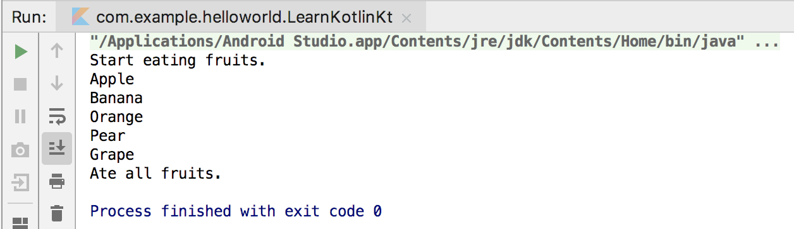

**图 3.45　吃水果字符串的打印结果**

仔细观察上述代码，你会发现我们连续调用了很多次 `builder` 对象的方法。其实这个时候就可以考虑使用 `with` 函数来让代码变得更加精简，如下所示：

```Kotlin
val list = listOf("Apple", "Banana", "Orange", "Pear", "Grape")
val result = with(StringBuilder()) {
    append("Start eating fruits.\n")
    for (fruit in list) {
        append(fruit).append("\n")
    }
    append("Ate all fruits.")
    toString()
}
println(result)
```

这段代码乍一看可能有点迷惑性，其实很好理解。首先我们给 `with` 函数的第一个参数传入了一个 `StringBuilder` 对象，那么接下来整个 Lambda 表达式的上下文就会是这个 `StringBuilder` 对象。于是我们在 Lambda 表达式中就不用再像刚才那样调用 `builder.append()` 和 `builder.toString()` 方法了，而是可以直接调用 `append()` 和 `toString()` 方法。Lambda 表达式的最后一行代码会作为 `with` 函数的返回值返回，最终我们将结果打印出来。

这两段代码的执行结果是一模一样的，但是明显第二段代码的写法更加简洁一些，这就是 `with` 函数的作用。

下面我们再来学习另外一个常用的标准函数：`run` 函数。`run` 函数的用法和使用场景其实和 `with` 函数是非常类似的，只是稍微做了一些语法改动而已。首先 `run` 函数通常不会直接调用，而是要在某个对象的基础上调用；其次 `run` 函数只接收一个 Lambda 参数，并且会在 Lambda 表达式中提供调用对象的上下文。其他方面和 `with` 函数是一样的，包括也会使用 Lambda 表达式中的最后一行代码作为返回值返回。示例代码如下：

```Kotlin
val result = obj.run {
    // 这里是obj的上下文
    "value" // run函数的返回值
}
```

那么现在我们就可以使用 `run` 函数来修改一下吃水果的这段代码，如下所示：

```Kotlin
val list = listOf("Apple", "Banana", "Orange", "Pear", "Grape")
val result = StringBuilder().run {
    append("Start eating fruits.\n")
    for (fruit in list) {
        append(fruit).append("\n")
    }
    append("Ate all fruits.")
    toString()
}
println(result)
```

总体来说变化非常小，只是将调用 `with` 函数并传入 `StringBuilder` 对象改成了调用 `StringBuilder` 对象的 `run` 方法，其他都没有任何区别，这两段代码最终的执行结果是完全相同的。

最后我们再来学习标准函数中的 `apply` 函数。`apply` 函数和 `run` 函数也是极其类似的，都要在某个对象上调用，并且只接收一个 Lambda 参数，也会在 Lambda 表达式中提供调用对象的上下文，但是 `apply` 函数无法指定返回值，而是会自动返回调用对象本身。示例代码如下：

```Kotlin
val result = obj.apply {
     // 这里是obj的上下文
}
// result == obj
```

那么现在我们再使用 `apply` 函数来修改一下吃水果的这段代码，如下所示：

```Kotlin
val list = listOf("Apple", "Banana", "Orange", "Pear", "Grape")
val result = StringBuilder().apply {
    append("Start eating fruits.\n")
    for (fruit in list) {
        append(fruit).append("\n")
    }
    append("Ate all fruits.")
}
println(result.toString())
```

注意这里的代码变化，由于 `apply` 函数无法指定返回值，只能返回调用对象本身，因此这里的 `result` 实际上是一个 `StringBuilder` 对象，所以我们在最后打印的时候还要再调用它的 `toString()` 方法才行。这段代码的执行结果和前面两段仍然是完全相同的，我就不再重复演示了。

这样我们就将 Kotlin 中最常用的几个标准函数学完了，你会发现其实 `with`、`run` 和 `apply` 这几个函数的用法和使用场景是非常类似的。在大多数情况下，它们可以相互转换，但你最好还是要掌握它们之间的区别，以便在编程时能够作出最佳的选择。

回想一下刚刚在最佳实践环节编写的启动 Activity 的代码：

```Kotlin
val intent = Intent(context, SecondActivity::class.java)
intent.putExtra("param1", "data1")
intent.putExtra("param2", "data2")
context.startActivity(intent)
```

这里每传递一个参数就要调用一次 `intent.putExtra()` 方法，如果要传递 10 个参数，那就得调用 10 次。对于这种情况，我们就可以使用标准函数来对代码进行精简，如下所示：

```Kotlin
val intent = Intent(context, SecondActivity::class.java).apply {
    putExtra("param1", "data1")
    putExtra("param2", "data2")
}
context.startActivity(intent)
```

可以看到，由于 Lambda 表达式中的上下文就是 Intent 对象，所以我们不再需要调用 `intent.putExtra()` 方法，而是直接调用 `putExtra()` 方法就可以了。传递的参数越多，这种写法的优势也就越明显。

好了，关于 Kotlin 的标准函数就讲到这里，本书后面的章节中还将会有大量使用标准函数的代码示例，到时候你会对它们掌握得越来越熟练。

### 3.7.2　定义静态方法

静态方法在某些编程语言里面又叫作类方法，指的就是那种不需要创建实例就能调用的方法，所有主流的编程语言都会支持静态方法这个特性。

在 Java 中定义一个静态方法非常简单，只需要在方法上声明一个 `static` 关键字就可以了，如下所示：

```Kotlin
public class Util {

    public static void doAction() {
        System.out.println("do action");
    }

}
```

这是一个非常简单的工具类，上述代码中的 `doAction()` 方法就是一个静态方法。调用静态方法并不需要创建类的实例，而是可以直接以 `Util.doAction()` 这种写法来调用。因而静态方法非常适合用于编写一些工具类的功能，因为工具类通常没有创建实例的必要，基本是全局通用的。

但是和绝大多数主流编程语言不同的是，Kotlin 却极度弱化了静态方法这个概念，想要在 Kotlin 中定义一个静态方法反倒不是一件容易的事。

那么 Kotlin 为什么要这样设计呢？因为 Kotlin 提供了比静态方法更好用的语法特性，并且我们在上一节中已经学习过了，那就是单例类。

像工具类这种功能，在 Kotlin 中就非常推荐使用单例类的方式来实现，比如上述的 `Util` 工具类，如果使用 Kotlin 来实现的话就可以这样写：

```Kotlin
object Util {

    fun doAction() {
        println("do action")
    }

}
```

虽然这里的 `doAction()` 方法并不是静态方法，但是我们仍然可以使用 `Util.doAction()` 的方式来调用，这就是单例类所带来的便利性。

不过，使用单例类的写法会将整个类中的所有方法全部变成类似于静态方法的调用方式，而如果我们只是希望让类中的某一个方法变成静态方法的调用方式该怎么办呢？这个时候就可以使用刚刚在最佳实践环节用到的 `companion object` 了，示例如下：

```Kotlin
class Util {

    fun doAction1() {
        println("do action1")
    }

    companion object {

        fun doAction2() {
            println("do action2")
        }

    }

}
```

这里首先我们将 `Util` 从单例类改成了一个普通类，然后在类中直接定义了一个 `doAction1()` 方法，又在 `companion object` 中定义了一个 `doAction2()` 方法。现在这两个方法就有了本质的区别，因为 `doAction1()` 方法是一定要先创建 `Util` 类的实例才能调用的，而 `doAction2()` 方法可以直接使用 `Util.doAction2()` 的方式调用。

不过，`doAction2()` 方法其实也并不是静态方法，`companion object` 这个关键字实际上会在 `Util` 类的内部创建一个伴生类，而 `doAction2()` 方法就是定义在这个伴生类里面的实例方法。只是 Kotlin 会保证 `Util` 类始终只会存在一个伴生类对象，因此调用 `Util.doAction2()` 方法实际上就是调用了 `Util` 类中伴生对象的 `doAction2()` 方法。

由此可以看出，Kotlin 确实没有直接定义静态方法的关键字，但是提供了一些语法特性来支持类似于静态方法调用的写法，这些语法特性基本可以满足我们平时的开发需求了。

然而如果你确确实实需要定义真正的静态方法， Kotlin 仍然提供了两种实现方式：注解和顶层方法。下面我们来逐个学习一下。

先来看注解，前面使用的单例类和 `companion object` 都只是在语法的形式上模仿了静态方法的调用方式，实际上它们都不是真正的静态方法。因此如果你在 Java 代码中以静态方法的形式去调用的话，你会发现这些方法并不存在。而如果我们给单例类或 `companion object` 中的方法加上 `@JvmStatic` 注解，那么 Kotlin 编译器就会将这些方法编译成真正的静态方法，如下所示：

```Kotlin
class Util {

    fun doAction1() {
        println("do action1")
    }

    companion object {

        @JvmStatic
        fun doAction2() {
            println("do action2")
        }

    }

}
```

注意，`@JvmStatic` 注解只能加在单例类或 `companion object` 中的方法上，如果你尝试加在一个普通方法上，会直接提示语法错误。

由于 `doAction2()` 方法已经成为了真正的静态方法，那么现在不管是在 Kotlin 中还是在 Java 中，都可以使用 `Util.doAction2()` 的写法来调用了。

再来看顶层方法，顶层方法指的是那些没有定义在任何类中的方法，比如我们在上一节中编写的 `main()` 方法。Kotlin 编译器会将所有的顶层方法全部编译成静态方法，因此只要你定义了一个顶层方法，那么它就一定是静态方法。

想要定义一个顶层方法，首先需要创建一个 Kotlin 文件。对着任意包名右击 → New → Kotlin File/Class，在弹出的对话框中输入文件名即可。注意创建类型要选择 File，如图 3.46 所示。

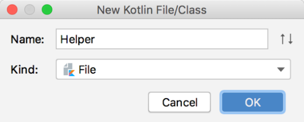

**图 3.46　创建一个 Kotlin 文件**

点击“OK”完成创建，这样刚刚的包名路径下就会出现一个 Helper.kt 文件。现在我们在这个文件中定义的任何方法都会是顶层方法，比如这里我就定义一个 `doSomething()` 方法吧，如下所示：

```Kotlin
fun doSomething() {
    println("do something")
}
```

刚才已经讲过了，Kotlin 编译器会将所有的顶层方法全部编译成静态方法，那么我们要怎么调用这个 `doSomething()` 方法呢？

如果是在 Kotlin 代码中调用的话，那就很简单了，所有的顶层方法都可以在任何位置被直接调用，不用管包名路径，也不用创建实例，直接键入 `doSomething()` 即可，如图 3.47 所示。

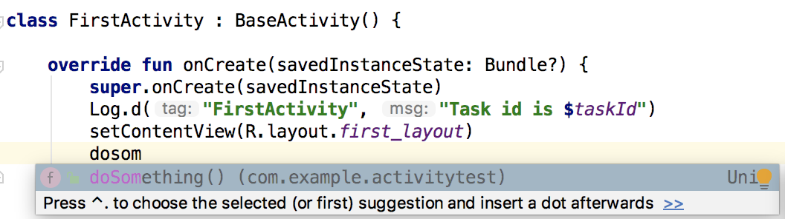

**图 3.47　在 Kotlin 代码中调用** **`doSomething()`**  **方法**

但如果是在 Java 代码中调用，你会发现是找不到 `doSomething()` 这个方法的，因为 Java 中没有顶层方法这个概念，所有的方法必须定义在类中。那么这个 `doSomething()` 方法被藏在了哪里呢？我们刚才创建的 Kotlin 文件名叫作 Helper.kt，于是 Kotlin 编译器会自动创建一个叫作 HelperKt 的 Java 类，`doSomething()` 方法就是以静态方法的形式定义在 HelperKt 类里面的，因此在 Java 中使用 `HelperKt.doSomething()` 的写法来调用就可以了，如图 3.48 所示。


**图 3.48　在 Java 代码中调用** **`doSomething()`**  **方法**

好了，关于静态方法的相关内容就学到这里。本小节中所学的知识，除了 `@JvmStatic` 注解不太常用之外，其他像单例类、`companion object`、顶层方法都是 Kotlin 中十分常用的技巧，希望你能将它们牢牢掌握。

## 3.8　小结与点评

真是好疲惫啊！没错，学习了这么多的东西，不疲惫才怪呢。但是，你内心那种掌握了知识的喜悦感相信也是无法掩盖的。本章的收获非常多啊，不管是理论型还是实践型的东西都涉及了，从 Activity 的基本用法，到启动 Activity 和传递数据的方式，再到 Activity 的生命周期以及 Activity 的启动模式，你几乎已经学会了关于 Activity 所有重要的知识点。在本章的最后，还学习了几种可以应用在 Activity 中的最佳实践技巧。毫不夸张地说，你在 Android Activity 方面已经算是一个小高手了。

另外，在本节的 Kotlin 课堂中我们还学习了 Kotlin 标准函数的用法，以及静态方法的定义方式，现在你的 Kotlin 水平又得到了进一步的提升。

不过，你的 Android 旅途才刚刚开始呢，后面需要学习的东西还很多，也许会比现在还累，一定要做好心理准备哦。总体来说，我给你现在的状态打满分，毕竟你已经学会了那么多的东西，也是时候放松一下了。自己适当控制一下休息的时间，然后我们继续前进吧！