# 第 4 章　软件也要拼脸蛋，UI 开发的点点滴滴

我一直认为程序员在软件的审美方面普遍比较差，至少我个人就是如此。如果要追究其根本原因，我觉得这是由程序员的工作性质所导致的。每当我们看到一个软件时，不会像普通用户一样仅仅是关注一下它的界面和功能。我们总是会不自觉地思考这些功能是如何实现的，很多在普通用户看来理所应当的功能，背后可能需要非常复杂的算法来完成。以至于当别人唾骂一句，这软件做得真丑的时候，我们还可能赞叹一句，这功能做得好牛啊！

不过缺乏审美毕竟不是一件值得炫耀的事情，在软件开发过程中，界面设计和功能开发同样重要。界面美观的应用程序不仅可以大大增加用户粘性，还能帮我们吸引到更多的新用户。而 Android 也给我们提供了大量的 UI 开发工具，只要合理地使用它们，就可以编写出各种各样漂亮的界面。

在这里，我无法教会你如何提升自己的审美，但我可以教会你怎样使用 Android 提供的 UI 开发工具来编写程序界面。想必你在上一章中反反复复地使用那几个按钮都快要吐了吧，本章我们就来学习更多 UI 开发方面的知识。

## 4.1　该如何编写程序界面

在过去，Android 应用程序的界面主要是通过编写 XML 的方式来实现的。写 XML 的好处是，我们不仅能够了解界面背后的实现原理，而且编写出来的界面还可以具备很好的屏幕适配性。等你完全掌握了使用 XML 来编写界面的方法之后，不管是进行高复杂度的界面实现，还是分析和修改当前现有的界面，对你来说都将是手到擒来。

不过最近几年，Google 又推出了一个全新的界面布局：ConstraintLayout。和以往传统的布局不同，ConstraintLayout 不是非常适合通过编写 XML 的方式来开发界面，而是更加适合在可视化编辑器中使用拖放控件的方式来进行操作，并且 Android Studio 中也提供了非常完备的可视化编辑器。

虽然现在 Google 官方更加推荐使用 ConstraintLayout 来开发程序界面，但由于 ConstraintLayout 的特殊性，书中很难展示如何通过可视化编辑器来对界面进行动态操作。因此本书中我们仍然采用编写 XML 的传统方式来开发程序界面，并且这也是我认为你必须掌握的基本技能。至于 ConstraintLayout，如果你有兴趣学习的话，可以关注我的微信公众号（见封面），回复“ConstraintLayout”或“约束布局”即可，我专门写了一篇非常详细的文章来对 ConstraintLayout 进行讲解。

讲了这么多理论的东西，也是时候学习一下到底如何编写程序界面了，我们就从 Android 中几种常见的控件开始吧。

## 4.2　常用控件的使用方法

Android 给我们提供了大量的 UI 控件，合理地使用这些控件就可以非常轻松地编写出相当不错的界面，下面我们就挑选几种常用的控件，详细介绍一下它们的使用方法。

首先新建一个 UIWidgetTest 项目。简单起见，我们还是允许 Android Studio 自动创建 Activity，Activity 名和布局名都使用默认值。

### 4.2.1　TextView

TextView 可以说是 Android 中最简单的一个控件了，你在前面其实已经和它打过一些交道了。它主要用于在界面上显示一段文本信息，比如你在第 1 章看到的 Hello world！

下面我们就来看一看 TextView 的更多用法，将 activity_main.xml 中的代码改成如下所示：

```xml
<LinearLayout xmlns:android="http://schemas.android.com/apk/res/android"
    android:orientation="vertical"
    android:layout_width="match_parent"
    android:layout_height="match_parent">

    <TextView
        android:id="@+id/textView"
        android:layout_width="match_parent"
        android:layout_height="wrap_content"
        android:text="This is TextView"/>

</LinearLayout>
```

外面的 LinearLayout 先忽略不看，在 TextView 中我们使用 `android:id` 给当前控件定义了一个唯一标识符，这个属性在上一章中已经讲解过了。然后使用 `android:layout_width` 和 `android:layout_height` 指定了控件的宽度和高度。Android 中所有的控件都具有这两个属性，可选值有 3 种：`match_parent`、`wrap_content` 和固定值。`match_parent` 表示让当前控件的大小和父布局的大小一样，也就是由父布局来决定当前控件的大小。`wrap_content` 表示让当前控件的大小能够刚好包含住里面的内容，也就是由控件内容决定当前控件的大小。固定值表示表示给控件指定一个固定的尺寸，单位一般用 dp，这是一种屏幕密度无关的尺寸单位，可以保证在不同分辨率的手机上显示效果尽可能地一致，如 50 dp 就是一个有效的固定值。

所以上面的代码就表示让 TextView 的宽度和父布局一样宽，也就是手机屏幕的宽度，让 TextView 的高度足够包含住里面的内容就行。现在运行程序，效果如图 4.1 所示。

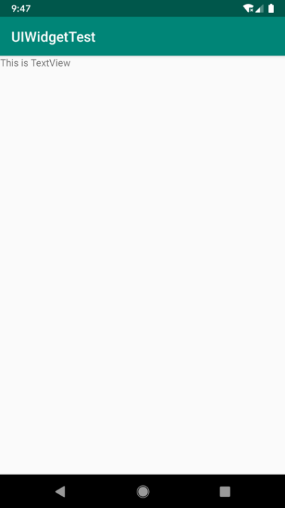

**图 4.1　TextView 运行效果**

虽然指定的文本内容正常显示了，不过我们好像没看出来 TextView 的宽度是和屏幕一样宽的。其实这是由于 TextView 中的文字默认是居左上角对齐的，虽然 TextView 的宽度充满了整个屏幕，可是由于文字内容不够长，所以从效果上完全看不出来。现在我们修改 TextView 的文字对齐方式，如下所示：

```xml
<LinearLayout xmlns:android="http://schemas.android.com/apk/res/android"
    android:orientation="vertical"
    android:layout_width="match_parent"
    android:layout_height="match_parent">

    <TextView
        android:id="@+id/textView"
        android:layout_width="match_parent"
        android:layout_height="wrap_content"
        android:gravity="center"
        android:text="This is TextView"/>

</LinearLayout>
```

我们使用 `android:gravity` 来指定文字的对齐方式，可选值有 `top`、`bottom`、`start`、`end`、`center` 等，可以用“\|”来同时指定多个值，这里我们指定的是 `"center"`，效果等同于 `"center_vertical|center_horizontal"`，表示文字在垂直和水平方向都居中对齐。现在重新运行程序，效果如图 4.2 所示。

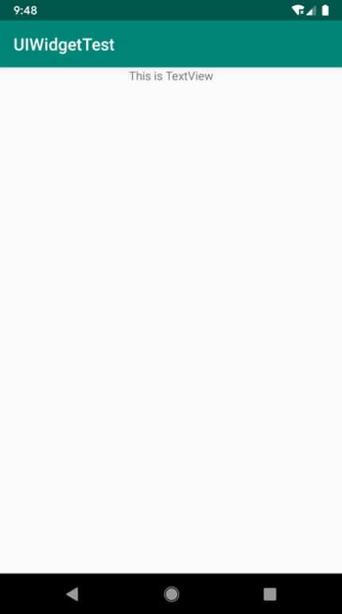

**图 4.2　TextView 居中效果**

这也说明了 TextView 的宽度确实是和屏幕宽度一样的。

另外，我们还可以对 TextView 中文字的颜色和大小进行修改，如下所示：

```xml
<LinearLayout xmlns:android="http://schemas.android.com/apk/res/android"
    android:orientation="vertical"
    android:layout_width="match_parent"
    android:layout_height="match_parent">

    <TextView
        android:id="@+id/textView"
        android:layout_width="match_parent"
        android:layout_height="wrap_content"
        android:gravity="center"
        android:textColor="#00ff00"
        android:textSize="24sp"
        android:text="This is TextView"/>

</LinearLayout>
```

通过 `android:textColor` 属性可以指定文字的颜色，通过 `android:textSize` 属性可以指定文字的大小。文字大小要使用 sp 作为单位，这样当用户在系统中修改了文字显示尺寸时，应用程序中的文字大小也会跟着变化。重新运行程序，效果如图 4.3 所示。

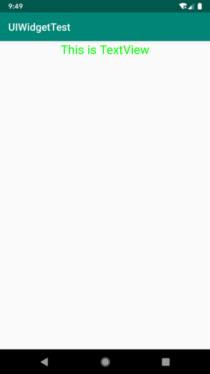

**图 4.3　改变 TextView 文字大小和颜色的效果**

当然 TextView 中还有很多其他的属性，这里我就不再一一介绍了，你需要用到的时候去查阅文档就可以了。

### 4.2.2　Button

Button 是程序用于和用户进行交互的一个重要控件，相信你对这个控件已经非常熟悉了，因为我们在上一章用了很多次。它可配置的属性和 TextView 是差不多的，我们可以在 activity_main.xml 中这样加入 Button：

```xml
<LinearLayout xmlns:android="http://schemas.android.com/apk/res/android"
    android:orientation="vertical"
    android:layout_width="match_parent"
    android:layout_height="match_parent">

    ...

    <Button
        android:id="@+id/button"
        android:layout_width="match_parent"
        android:layout_height="wrap_content"
        android:text="Button" />

</LinearLayout>
```

加入 Button 之后的界面如图 4.4 所示。


**图 4.4　Button 运行效果**

如果你很细心的话，可能会发现我们在 XML 中指定按钮上的文字明明是 Button，可是为什么界面上显示的却是 BUTTON 呢？这是因为 Android 系统默认会将按钮上的英文字母全部转换成大写，可能是认为按钮上的内容都比较重要吧。如果这不是你想要的效果，可以在 XML 中添加 `android:textAllCaps="false"` 这个属性，这样系统就会保留你指定的原始文字内容了。

接下来我们可以在 MainActivity 中为 Button 的点击事件注册一个监听器，如下所示：

```Kotlin
class MainActivity : AppCompatActivity() {

    override fun onCreate(savedInstanceState: Bundle?) {
        super.onCreate(savedInstanceState)
        setContentView(R.layout.activity_main)
        button.setOnClickListener {
            // 在此处添加逻辑
        }
    }

}
```

这里调用 button 的 `setOnClickListener()` 方法时利用了 Java 单抽象方法接口的特性，从而可以使用函数式 API 的写法来监听按钮的点击事件。这样每当点击按钮时，就会执行 Lambda 表达式中的代码，我们只需要在 Lambda 表达式中添加待实现的逻辑就行了。关于 Java 函数式 API 的讲解，可以参考 2.6.3 小节。

除了使用函数式 API 的方式来注册监听器，也可以使用实现接口的方式来进行注册，代码如下所示：

```Kotlin
class MainActivity : AppCompatActivity(), View.OnClickListener {

    override fun onCreate(savedInstanceState: Bundle?) {
        super.onCreate(savedInstanceState)
        setContentView(R.layout.activity_main)
        button.setOnClickListener(this)
    }

    override fun onClick(v: View?) {
        when (v?.id) {
            R.id.button -> {
                // 在此处添加逻辑
            }
        }
    }

}
```

这里我们让 MainActivity 实现了 `View.OnClickListener` 接口，并重写了 `onClick()` 方法，然后在调用 button 的 `setOnClickListener()` 方法时将 MainActivity 的实例传了进去。这样每当点击按钮时，就会执行 `onClick()` 方法中的代码了。关于 Kotlin 接口这部分知识的讲解可以参考 2.5.3 小节。

这两种写法都可以实现对按钮点击事件的监听，至于使用哪一种，就全凭你的喜好了。

### 4.2.3　EditText

EditText 是程序用于和用户进行交互的另一个重要控件，它允许用户在控件里输入和编辑内容，并可以在程序中对这些内容进行处理。EditText 的应用场景应该算是非常普遍了，发短信、发微博、聊 QQ 等等，在进行这些操作时，你不得不使用到 EditText。那我们来看一看如何在界面上加入 EditText 吧，修改 activity_main.xml 中的代码，如下所示：

```xml
<LinearLayout xmlns:android="http://schemas.android.com/apk/res/android"
    android:orientation="vertical"
    android:layout_width="match_parent"
    android:layout_height="match_parent">

    ...

    <EditText
        android:id="@+id/editText"
        android:layout_width="match_parent"
        android:layout_height="wrap_content"
        />

</LinearLayout>
```

其实看到这里，估计你已经总结出 Android 控件的使用规律了。用法都很相似，给控件定义一个 id，指定控件的宽度和高度，然后再适当加入些控件特有的属性就差不多了，所以使用 XML 来编写界面其实一点都不难。现在重新运行一下程序，EditText 就已经在界面上显示出来了，并且我们是可以在里面输入内容的，如图 4.5 所示。

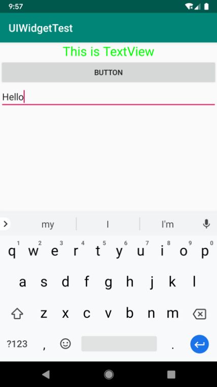

**图 4.5　EditText 运行效果**

你可能平时会留意到，一些做得比较人性化的软件会在输入框里显示一些提示性的文字，一旦用户输入了任何内容，这些提示性的文字就会消失。这种提示功能在 Android 里是非常容易实现的，我们甚至不需要做任何逻辑控制，因为系统已经帮我们都处理好了。修改 activity_main.xml，如下所示：

```xml
<LinearLayout xmlns:android="http://schemas.android.com/apk/res/android"
    android:orientation="vertical"
    android:layout_width="match_parent"
    android:layout_height="match_parent">

    ...

    <EditText
        android:id="@+id/editText"
        android:layout_width="match_parent"
        android:layout_height="wrap_content"
        android:hint="Type something here"
        />

</LinearLayout>
```

这里使用 `android:hint` 属性指定了一段提示性的文本，然后重新运行程序，效果如图 4.6 所示。

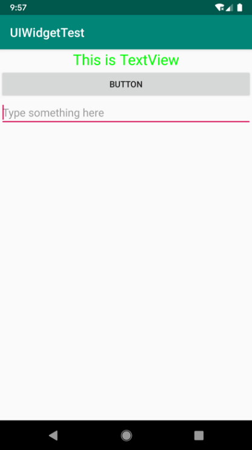

**图 4.6　EditText 设置 hint 效果**

可以看到，EditText 中显示了一段提示性文本，然后当我们输入任何内容时，这段文本就会自动消失。

不过，随着输入的内容不断增多，EditText 会被不断地拉长。这是由于 EditText 的高度指定的是 `wrap_content`，因此它总能包含住里面的内容，但是当输入的内容过多时，界面就会变得非常难看。我们可以使用 `android:maxLines` 属性来解决这个问题，修改 activity_main.xml，如下所示：

```xml
<LinearLayout xmlns:android="http://schemas.android.com/apk/res/android"
    android:orientation="vertical"
    android:layout_width="match_parent"
    android:layout_height="match_parent">

    ...

    <EditText
        android:id="@+id/editText"
        android:layout_width="match_parent"
        android:layout_height="wrap_content"
        android:hint="Type something here"
        android:maxLines="2"
        />

</LinearLayout>
```

这里通过 `android:maxLines` 指定了 EditText 的最大行数为两行，这样当输入的内容超过两行时，文本就会向上滚动，EditText 则不会再继续拉伸，如图 4.7 所示。

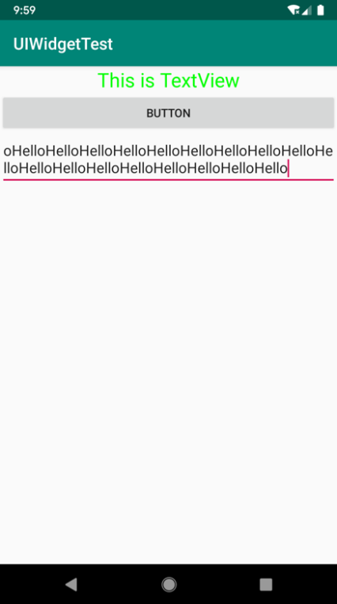

**图 4.7　EditText 设置 maxLines 效果**

我们还可以结合使用 EditText 与 Button 来完成一些功能，比如通过点击按钮获取 EditText 中输入的内容。修改 MainActivity 中的代码，如下所示：

```Kotlin
class MainActivity : AppCompatActivity(), View.OnClickListener {

    ...

    override fun onClick(v: View?) {
        when (v?.id) {
            R.id.button -> {
                val inputText = editText.text.toString()
                Toast.makeText(this, inputText, Toast.LENGTH_SHORT).show()
            }
        }
    }

}
```

我们在按钮的点击事件里调用 EditText 的 `getText()` 方法获取输入的内容，再调用 `toString()` 方法将内容转换成字符串，最后使用 Toast 将输入的内容显示出来。

当然，上述代码再次使用了 Kotlin 调用 Java `Getter` 和 `Setter` 方法的语法糖，在代码中好像调用的是 EditText 的 `text` 属性，实际上调用的却是 EditText 的 `getText()` 方法。这种语法糖虽然简化了书写，但是不太利于我的讲解，因此这里我有必要和你做一个约定。

其实我们没有必要去记忆这个语法糖的具体规则是什么样的，在编写代码的时候直接调用它的实际方法就可以了，Android Studio 会自动在代码提示中显示使用语法糖后的优化代码调用，如图 4.8 所示。

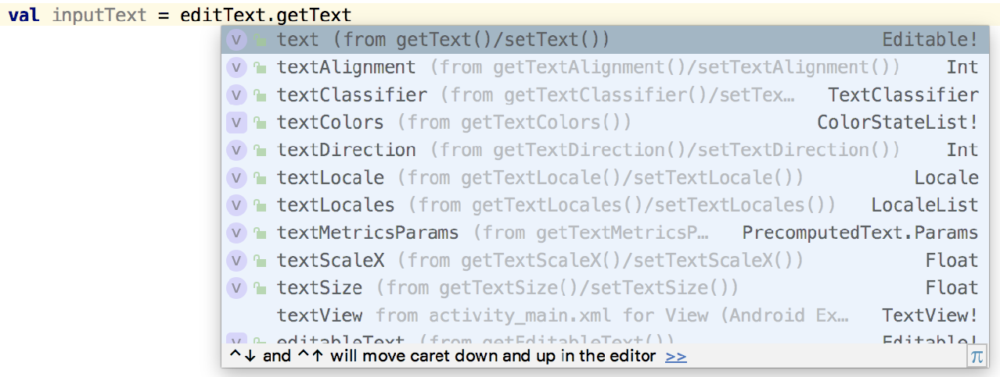

**图 4.8　Android Studio 的语法糖代码提示**

可以看到，这里我们键入的是 getText，但是代码提示的第一条就是将它转换成 text，因此现在只要按一下 Enter 键就可以完成转换了。

有了这个前提，本书后面在涉及这种 `Getter` 和 `Setter` 方法调用的时候，我都会使用真实调用的方式名来进行讲解，虽然和实际代码看上去有可能会对不上，但是你没必要在这个地方产生疑惑，编写代码时只要借助 Android Studio 的代码提示功能转换一下就可以了。

好了，讲完了题外话，现在重新运行程序。在 EditText 中输入一段内容，然后点击按钮，效果如图 4.9 所示。

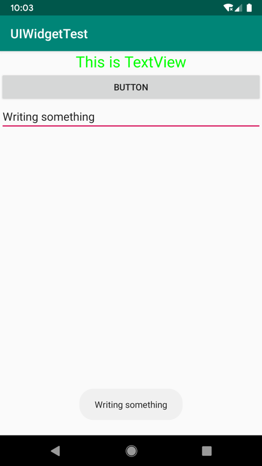

**图 4.9　获取 EditText 中输入的内容**

### 4.2.4　ImageView

ImageView 是用于在界面上展示图片的一个控件，它可以让我们的程序界面变得更加丰富多彩。学习这个控件需要提前准备好一些图片，你可以自己准备任意的图片，也可以使用随书源码附带的图片资源（资源下载地址见前言）。图片通常是放在以 drawable 开头的目录下的，并且要带上具体的分辨率。现在最主流的手机屏幕分辨率大多是 xxhdpi 的，所以我们在 res 目录下再新建一个 drawable-xxhdpi 目录，然后将事先准备好的两张图片 img_1.png 和 img_2.png 复制到该目录当中。

接下来修改 activity_main.xml，如下所示：

```xml
<LinearLayout xmlns:android="http://schemas.android.com/apk/res/android"
    android:orientation="vertical"
    android:layout_width="match_parent"
    android:layout_height="match_parent">

    ...

    <ImageView
        android:id="@+id/imageView"
        android:layout_width="wrap_content"
        android:layout_height="wrap_content"
        android:src="@drawable/img_1"
        />

</LinearLayout>
```

可以看到，这里使用 `android:src` 属性给 ImageView 指定了一张图片。由于图片的宽和高都是未知的，所以将 ImageView 的宽和高都设定为 `wrap_content`，这样就保证了不管图片的尺寸是多少，都可以完整地展示出来。重新运行程序，效果如图 4.10 所示。


**图 4.10　ImageView 运行效果**

我们还可以在程序中通过代码动态地更改 ImageView 中的图片，修改 MainActivity 的代码，如下所示：

```Kotlin
class MainActivity : AppCompatActivity(), View.OnClickListener {

    ...

    override fun onClick(v: View?) {
        when (v?.id) {
            R.id.button -> {
                imageView.setImageResource(R.drawable.img_2)
            }
        }
    }

}
```

在按钮的点击事件里，通过调用 ImageView 的 `setImageResource()` 方法将显示的图片改成 img_2。现在重新运行程序，点击一下按钮，就可以看到 ImageView 中显示的图片改变了，如图 4.11 所示。

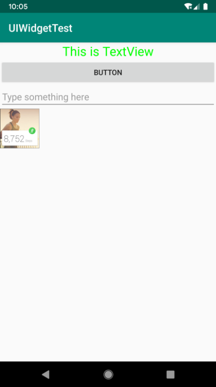

**图 4.11　动态更改 ImageView 中的图片**

### 4.2.5　ProgressBar

ProgressBar 用于在界面上显示一个进度条，表示我们的程序正在加载一些数据。它的用法也非常简单，修改 activity_main.xml 中的代码，如下所示：

```xml
<LinearLayout xmlns:android="http://schemas.android.com/apk/res/android"
    android:orientation="vertical"
    android:layout_width="match_parent"
    android:layout_height="match_parent">

    ...

    <ProgressBar
        android:id="@+id/progressBar"
        android:layout_width="match_parent"
        android:layout_height="wrap_content"
        />

</LinearLayout>
```

重新运行程序，会看到屏幕中有一个圆形进度条正在旋转，如图 4.12 所示。


**图 4.12　ProgressBar 运行效果**

这时你可能会问，旋转的进度条表明我们的程序正在加载数据，那数据总会有加载完的时候吧，如何才能让进度条在数据加载完成时消失呢？这里我们就需要用到一个新的知识点：Android 控件的可见属性。所有的 Android 控件都具有这个属性，可以通过 `android:visibility` 进行指定，可选值有 3 种：`visible`、`invisible` 和 `gone`。`visible` 表示控件是可见的，这个值是默认值，不指定 `android:visibility` 时，控件都是可见的。`invisible` 表示控件不可见，但是它仍然占据着原来的位置和大小，可以理解成控件变成透明状态了。`gone` 则表示控件不仅不可见，而且不再占用任何屏幕空间。我们可以通过代码来设置控件的可见性，使用的是 `setVisibility()` 方法，允许传入 `View.VISIBLE`、`View.INVISIBLE` 和 `View.GONE` 这 3 种值。

接下来我们就来尝试实现一种效果：点击一下按钮让进度条消失，再点击一下按钮让进度条出现。修改 MainActivity 中的代码，如下所示：

```Kotlin
class MainActivity : AppCompatActivity(), View.OnClickListener {

    ...

    override fun onClick(v: View?) {
        when (v?.id) {
            R.id.button -> {
                if (progressBar.visibility == View.VISIBLE) {
                    progressBar.visibility = View.GONE
                } else {
                    progressBar.visibility = View.VISIBLE
                }
            }
        }
    }

}
```

在按钮的点击事件中，我们通过 `getVisibility()` 方法来判断 ProgressBar 是否可见，如果可见就将 ProgressBar 隐藏掉，如果不可见就将 ProgressBar 显示出来。重新运行程序，然后不断地点击按钮，你就会看到进度条在显示与隐藏之间来回切换了。

另外，我们还可以给 ProgressBar 指定不同的样式，刚刚是圆形进度条，通过 style 属性可以将它指定成水平进度条，修改 activity_main.xml 中的代码，如下所示：

```xml
<LinearLayout xmlns:android="http://schemas.android.com/apk/res/android"
    android:orientation="vertical"
    android:layout_width="match_parent"
    android:layout_height="match_parent">

    ...

    <ProgressBar
        android:id="@+id/progressBar"
        android:layout_width="match_parent"
        android:layout_height="wrap_content"
        style="?android:attr/progressBarStyleHorizontal"
        android:max="100"
        />

</LinearLayout>
```

指定成水平进度条后，我们还可以通过 `android:max` 属性给进度条设置一个最大值，然后在代码中动态地更改进度条的进度。修改 MainActivity 中的代码，如下所示：

```Kotlin
class MainActivity : AppCompatActivity(), View.OnClickListener {

    ...

    override fun onClick(v: View?) {
        when (v?.id) {
            R.id.button -> {
                progressBar.progress = progressBar.progress + 10
            }
        }
    }

}
```

每点击一次按钮，我们就获取进度条的当前进度，然后在现有的进度上加 10 作为更新后的进度。重新运行程序，点击数次按钮后，效果如图 4.13 所示。

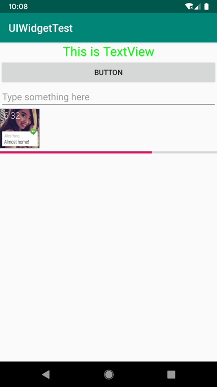

**图 4.13　ProgressBar 水平样式效果**

### 4.2.6　AlertDialog

AlertDialog 可以在当前界面弹出一个对话框，这个对话框是置顶于所有界面元素之上的，能够屏蔽其他控件的交互能力，因此 AlertDialog 一般用于提示一些非常重要的内容或者警告信息。比如为了防止用户误删重要内容，在删除前弹出一个确认对话框。下面我们来学习一下它的用法，修改 MainActivity 中的代码，如下所示：

```Kotlin
class MainActivity : AppCompatActivity(), View.OnClickListener {
   ...
    override fun onClick(v: View?) {
        when (v?.id) {
            R.id.button -> {
                AlertDialog.Builder(this).apply {
                    setTitle("This is Dialog")
                    setMessage("Something important.")
                    setCancelable(false)
                    setPositiveButton("OK") { dialog, which ->
                    }
                    setNegativeButton("Cancel") { dialog, which ->
                    }
                    show()
                }
            }
        }
    }

}
```

首先通过 AlertDialog.Builder 构建一个对话框，这里我们使用了 Kotlin 标准函数中的 `apply` 函数。在 `apply` 函数中为这个对话框设置标题、内容、可否使用 Back 键关闭对话框等属性，接下来调用 `setPositiveButton()` 方法为对话框设置确定按钮的点击事件，调用 `setNegativeButton()` 方法设置取消按钮的点击事件，最后调用 `show()` 方法将对话框显示出来就可以了。重新运行程序，点击按钮后，效果如图 4.14 所示。

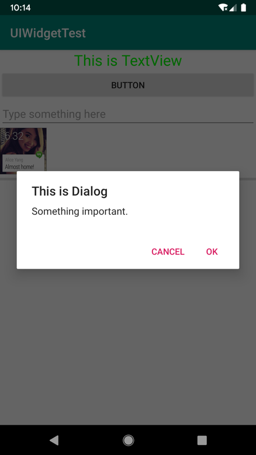

**图 4.14　AlertDialog 运行效果**

好了，关于 Android 常用控件的使用，我要讲的就只有这么多。一节内容就想覆盖 Android 控件所有的相关知识不太现实，同样，一口气就想学会所有 Android 控件的使用方法也不太现实。本节所讲的内容对于你来说只是起到了一个引导的作用，你还需要在以后的学习和工作中不断地摸索，通过查阅文档以及网上搜索的方式学习更多控件的更多用法。当然，当本书后面涉及一些我们前面没学过的控件和相关用法时，我仍然会在相应的章节做详细的讲解。

## 4.3　详解 3 种基本布局

一个丰富的界面是由很多个控件组成的，那么我们如何才能让各个控件都有条不紊地摆放在界面上，而不是乱糟糟的呢？这就需要借助布局来实现了。布局是一种可用于放置很多控件的容器，它可以按照一定的规律调整内部控件的位置，从而编写出精美的界面。当然，布局的内部除了放置控件外，也可以放置布局，通过多层布局的嵌套，我们就能够完成一些比较复杂的界面实现，图 4.15 很好地展示了它们之间的关系。


**图 4.15　布局和控件的关系**

下面我们就来详细学习一下 Android 中 3 种最基本的布局。先做好准备工作，新建一个 UILayoutTest 项目，并让 Android Studio 自动帮我们创建好 Activity，Activity 名和布局名都使用默认值。

### 4.3.1　LinearLayout

LinearLayout 又称作线性布局，是一种非常常用的布局。正如它的名字所描述的一样，这个布局会将它所包含的控件在线性方向上依次排列。相信你之前也已经注意到了，我们在上一节中学习控件用法时，所有的控件就都是放在 LinearLayout 布局里的，因此上一节中的控件也确实是在垂直方向上线性排列的。

既然是线性排列，肯定就不只有一个方向，那为什么上一节中的控件都是在垂直方向排列的呢？这是由于我们通过 `android:orientation` 属性指定了排列方向是 vertical，如果指定的是 horizontal，控件就会在水平方向上排列了。下面我们通过实战来体会一下，修改 activity_main.xml 中的代码，如下所示：

```xml
<LinearLayout xmlns:android="http://schemas.android.com/apk/res/android"
    android:orientation="vertical"
    android:layout_width="match_parent"
    android:layout_height="match_parent">

    <Button
        android:id="@+id/button1"
        android:layout_width="wrap_content"
        android:layout_height="wrap_content"
        android:text="Button 1" />

    <Button
        android:id="@+id/button2"
        android:layout_width="wrap_content"
        android:layout_height="wrap_content"
        android:text="Button 2" />

    <Button
        android:id="@+id/button3"
        android:layout_width="wrap_content"
        android:layout_height="wrap_content"
        android:text="Button 3" />

</LinearLayout>
```

我们在 LinearLayout 中添加了 3 个 Button，每个 Button 的长和宽都是 `wrap_content`，并指定了排列方向是 `vertical`。现在运行一下程序，效果如图 4.16 所示。


**图 4.16　LinearLayout 垂直排列**

然后我们修改一下 LinearLayout 的排列方向，如下所示：

```xml
<LinearLayout xmlns:android="http://schemas.android.com/apk/res/android"
    android:orientation="horizontal"
    android:layout_width="match_parent"
    android:layout_height="match_parent">

    ...

</LinearLayout>
```

这里将 `android:orientation` 属性的值改成了 `horizontal`，这就意味着要让 LinearLayout 中的控件在水平方向上依次排列。当然，如果不指定 `android:orientation` 属性的值，默认的排列方向就是 `horizontal`。重新运行一下程序，效果如图 4.17 所示。

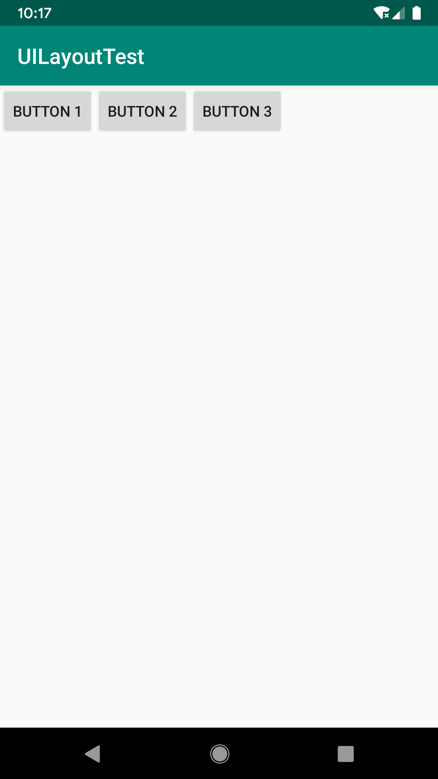

**图 4.17　LinearLayout 水平排列**

需要注意，如果 LinearLayout 的排列方向是 `horizontal`，内部的控件就绝对不能将宽度指定为 `match_parent`，否则，单独一个控件就会将整个水平方向占满，其他的控件就没有可放置的位置了。同样的道理，如果 LinearLayout 的排列方向是 `vertical`，内部的控件就不能将高度指定为 `match_parent`。

下面来看 `android:layout_gravity` 属性，它和我们上一节中学到的 `android:gravity` 属性看起来有些相似，这两个属性有什么区别呢？其实从名字就可以看出，`android:gravity` 用于指定文字在控件中的对齐方式，而 `android:layout_gravity` 用于指定控件在布局中的对齐方式。`android:layout_gravity` 的可选值和 `android:gravity` 差不多，但是需要注意，当 LinearLayout 的排列方向是 `horizontal` 时，只有垂直方向上的对齐方式才会生效。因为此时水平方向上的长度是不固定的，每添加一个控件，水平方向上的长度都会改变，因而无法指定该方向上的对齐方式。同样的道理，当 LinearLayout 的排列方向是 `vertical` 时，只有水平方向上的对齐方式才会生效。修改 activity_main.xml 中的代码，如下所示：

```xml
<LinearLayout xmlns:android="http://schemas.android.com/apk/res/android"
    android:orientation="horizontal"
    android:layout_width="match_parent"
    android:layout_height="match_parent">

    <Button
        android:id="@+id/button1"
        android:layout_width="wrap_content"
        android:layout_height="wrap_content"
        android:layout_gravity="top"
        android:text="Button 1" />

    <Button
        android:id="@+id/button2"
        android:layout_width="wrap_content"
        android:layout_height="wrap_content"
        android:layout_gravity="center_vertical"
        android:text="Button 2" />

    <Button
        android:id="@+id/button3"
        android:layout_width="wrap_content"
        android:layout_height="wrap_content"
        android:layout_gravity="bottom"
        android:text="Button 3" />

</LinearLayout>
```

由于目前 LinearLayout 的排列方向是 `horizontal`，因此我们只能指定垂直方向上的排列方向，将第一个 Button 的对齐方式指定为 `top`，第二个 Button 的对齐方式指定为 `center_vertical`，第三个 Button 的对齐方式指定为 `bottom`。重新运行程序，效果如图 4.18 所示。

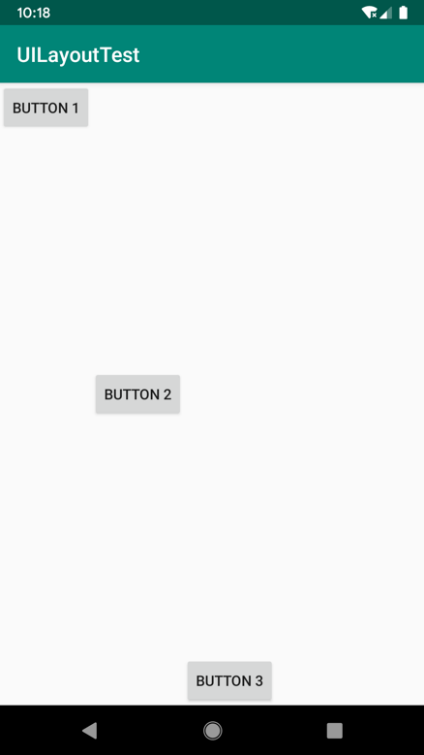

**图 4.18　指定 layout_gravity 的效果**

接下来我们学习 LinearLayout 中的另一个重要属性——`android:layout_weight`。这个属性允许我们使用比例的方式来指定控件的大小，它在手机屏幕的适配性方面可以起到非常重要的作用。比如，我们正在编写一个消息发送界面，需要一个文本编辑框和一个发送按钮，修改 activity_main.xml 中的代码，如下所示：

```xml
<LinearLayout xmlns:android="http://schemas.android.com/apk/res/android"
    android:orientation="horizontal"
    android:layout_width="match_parent"
    android:layout_height="match_parent">

    <EditText
        android:id="@+id/input_message"
        android:layout_width="0dp"
        android:layout_height="wrap_content"
        android:layout_weight="1"
        android:hint="Type something"
        />

    <Button
        android:id="@+id/send"
        android:layout_width="0dp"
        android:layout_height="wrap_content"
        android:layout_weight="1"
        android:text="Send"
        />

</LinearLayout>
```

你会发现，这里竟然将 EditText 和 Button 的宽度都指定成了 0 dp，这样文本编辑框和按钮还能显示出来吗？不用担心，由于我们使用了 `android:layout_weight` 属性，此时控件的宽度就不应该再由 `android:layout_width` 来决定了，这里指定成 0 dp 是一种比较规范的写法。

然后在 EditText 和 Button 里将 `android:layout_weight` 属性的值指定为 1，这表示 EditText 和 Button 将在水平方向平分宽度。

重新运行程序，你会看到如图 4.19 所示的效果。

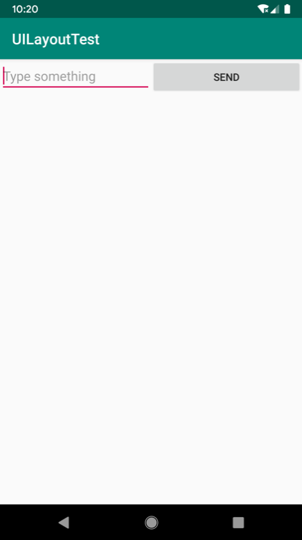

**图 4.19　指定** **`layout_weight`** **的效果**

为什么将 `android:layout_weight` 属性的值同时指定为 1 就会平分屏幕宽度呢？其实原理很简单，系统会先把 LinearLayout 下所有控件指定的 `layout_weight` 值相加，得到一个总值，然后每个控件所占大小的比例就是用该控件的 `layout_weight` 值除以刚才算出的总值。因此如果想让 EditText 占据屏幕宽度的 3/5，Button 占据屏幕宽度的 2/5，只需要将 EditText 的 `layout_ weight` 改成 3，Button 的 `layout_weight` 改成 2 就可以了。

我们还可以通过指定部分控件的 `layout_weight` 值来实现更好的效果。修改 activity_main. xml 中的代码，如下所示：

```xml
<LinearLayout xmlns:android="http://schemas.android.com/apk/res/android"
    android:orientation="horizontal"
    android:layout_width="match_parent"
    android:layout_height="match_parent">

    <EditText
        android:id="@+id/input_message"
        android:layout_width="0dp"
        android:layout_height="wrap_content"
        android:layout_weight="1"
        android:hint="Type something"
        />

    <Button
        android:id="@+id/send"
        android:layout_width="wrap_content"
        android:layout_height="wrap_content"
        android:text="Send"
        />

</LinearLayout>
```

这里我们仅指定了 EditText 的 `android:layout_weight` 属性，并将 Button 的宽度改回了 `wrap_content`。这表示 Button 的宽度仍然按照 `wrap_content` 来计算，而 EditText 则会占满屏幕所有的剩余空间。使用这种方式编写的界面，不仅可以适配各种屏幕，而且看起来也更加舒服。重新运行程序，效果如图 4.20 所示。

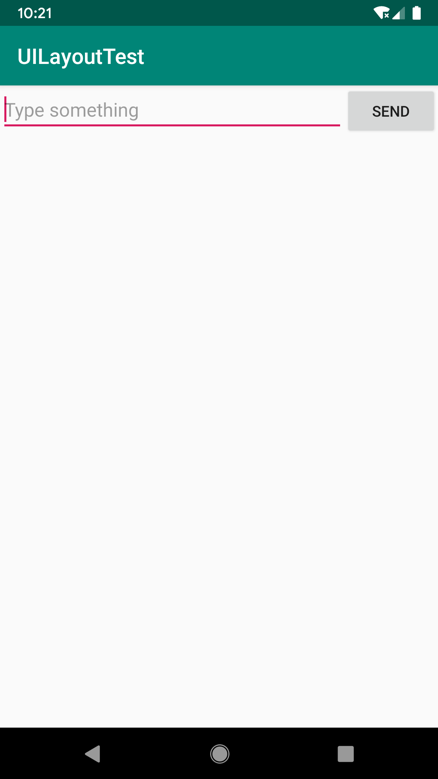

**图 4.20　使用** **`layout_weight`** **实现宽度自适配效果**

### 4.3.2　RelativeLayout

RelativeLayout 又称作相对布局，也是一种非常常用的布局。和 LinearLayout 的排列规则不同，RelativeLayout 显得更加随意，它可以通过相对定位的方式让控件出现在布局的任何位置。也正因为如此，RelativeLayout 中的属性非常多，不过这些属性都是有规律可循的，其实并不难理解和记忆。我们还是通过实践来体会一下，修改 activity_main.xml 中的代码，如下所示：

```xml
<RelativeLayout xmlns:android="http://schemas.android.com/apk/res/android"
    android:layout_width="match_parent"
    android:layout_height="match_parent">

    <Button
        android:id="@+id/button1"
        android:layout_width="wrap_content"
        android:layout_height="wrap_content"
        android:layout_alignParentLeft="true"
        android:layout_alignParentTop="true"
        android:text="Button 1" />

    <Button
        android:id="@+id/button2"
        android:layout_width="wrap_content"
        android:layout_height="wrap_content"
        android:layout_alignParentRight="true"
        android:layout_alignParentTop="true"
        android:text="Button 2" />

    <Button
        android:id="@+id/button3"
        android:layout_width="wrap_content"
        android:layout_height="wrap_content"
        android:layout_centerInParent="true"
        android:text="Button 3" />

    <Button
        android:id="@+id/button4"
        android:layout_width="wrap_content"
        android:layout_height="wrap_content"
        android:layout_alignParentBottom="true"
        android:layout_alignParentLeft="true"
        android:text="Button 4" />

    <Button
        android:id="@+id/button5"
        android:layout_width="wrap_content"
        android:layout_height="wrap_content"
        android:layout_alignParentBottom="true"
        android:layout_alignParentRight="true"
        android:text="Button 5" />

</RelativeLayout>
```

以上代码不需要做过多解释，因为实在是太好理解了。我们让 Button 1 和父布局的左上角对齐，Button 2 和父布局的右上角对齐，Button 3 居中显示，Button 4 和父布局的左下角对齐，Button 5 和父布局的右下角对齐。虽然 `android:layout_alignParentLeft`、`android:layout_alignParentTop`、`android:layout_alignParentRight`、`android:layout_alignParentBottom`、`android:layout_centerInParent` 这几个属性我们之前都没接触过，可是它们的名字已经完全说明了它们的作用。重新运行程序，效果如图 4.21 所示。


**图 4.21　相对于父布局定位的效果**

上面例子中的每个控件都是相对于父布局进行定位的，那控件可不可以相对于控件进行定位呢？当然是可以的，修改 activity_main.xml 中的代码，如下所示：

```xml
<RelativeLayout xmlns:android="http://schemas.android.com/apk/res/android"
    android:layout_width="match_parent"
    android:layout_height="match_parent">

    <Button
        android:id="@+id/button3"
        android:layout_width="wrap_content"
        android:layout_height="wrap_content"
        android:layout_centerInParent="true"
        android:text="Button 3" />

    <Button
        android:id="@+id/button1"
        android:layout_width="wrap_content"
        android:layout_height="wrap_content"
        android:layout_above="@id/button3"
        android:layout_toLeftOf="@id/button3"
        android:text="Button 1" />

    <Button
        android:id="@+id/button2"
        android:layout_width="wrap_content"
        android:layout_height="wrap_content"
        android:layout_above="@id/button3"
        android:layout_toRightOf="@id/button3"
        android:text="Button 2" />

    <Button
        android:id="@+id/button4"
        android:layout_width="wrap_content"
        android:layout_height="wrap_content"
        android:layout_below="@id/button3"
        android:layout_toLeftOf="@id/button3"
        android:text="Button 4" />

    <Button
        android:id="@+id/button5"
        android:layout_width="wrap_content"
        android:layout_height="wrap_content"
        android:layout_below="@id/button3"
        android:layout_toRightOf="@id/button3"
        android:text="Button 5" />

</RelativeLayout>
```

这次的代码稍微复杂一点，不过仍然是有规律可循的。`android:layout_above` 属性可以让一个控件位于另一个控件的上方，需要为这个属性指定相对控件 id 的引用，这里我们填入了 `@id/button3`，表示让该控件位于 Button 3 的上方。其他的属性也是相似的，`android: layout_below` 表示让一个控件位于另一个控件的下方，`android:layout_toLeftOf` 表示让一个控件位于另一个控件的左侧，`android:layout_toRightOf` 表示让一个控件位于另一个控件的右侧。注意，当一个控件去引用另一个控件的 id 时，该控件一定要定义在引用控件的后面，不然会出现找不到 id 的情况。重新运行程序，效果如图 4.22 所示。


**图 4.22　相对于控件定位的效果**

RelativeLayout 中还有另外一组相对于控件进行定位的属性，`android:layout_alignLeft` 表示让一个控件的左边缘和另一个控件的左边缘对齐，`android:layout_alignRight` 表示让一个控件的右边缘和另一个控件的右边缘对齐。此外，还有 `android:layout_alignTop` 和 `android:layout_alignBottom`，道理都是一样的，我就不再多说了，这几个属性就留给你自己去尝试吧。

好了，正如我前面所说的，RelativeLayout 中的属性虽然多，但都是有规律可循的，所以学起来一点都不觉得吃力吧？

### 4.3.3　FrameLayout

FrameLayout 又称作帧布局，它相比于前面两种布局就简单太多了，因此它的应用场景少了很多。这种布局没有丰富的定位方式，所有的控件都会默认摆放在布局的左上角。让我们通过例子来看一看吧，修改 activity_main.xml 中的代码，如下所示：

```xml
<FrameLayout xmlns:android="http://schemas.android.com/apk/res/android"
    android:layout_width="match_parent"
    android:layout_height="match_parent">

    <TextView
        android:id="@+id/textView"
        android:layout_width="wrap_content"
        android:layout_height="wrap_content"
        android:text="This is TextView"
        />

    <Button
        android:id="@+id/button"
        android:layout_width="wrap_content"
        android:layout_height="wrap_content"
        android:text="Button"
        />

</FrameLayout>
```

FrameLayout 中只是放置了一个 TextView 和一个 Button。重新运行程序，效果如图 4.23 所示。


**图 4.23　FrameLayout 运行效果**

可以看到，文字和按钮都位于布局的左上角。由于 Button 是在 TextView 之后添加的，因此按钮压在了文字的上面。

当然，除了这种默认效果之外，我们还可以使用 `layout_gravity` 属性来指定控件在布局中的对齐方式，这和 LinearLayout 中的用法是相似的。修改 activity_main.xml 中的代码，如下所示：

```xml
<FrameLayout xmlns:android="http://schemas.android.com/apk/res/android"
    android:layout_width="match_parent"
    android:layout_height="match_parent">

    <TextView
        android:id="@+id/textView"
        android:layout_width="wrap_content"
        android:layout_height="wrap_content"
        android:layout_gravity="left"
        android:text="This is TextView"
        />

    <Button
        android:id="@+id/button"
        android:layout_width="wrap_content"
        android:layout_height="wrap_content"
        android:layout_gravity="right"
        android:text="Button"
        />

</FrameLayout>
```

我们指定 TextView 在 FrameLayout 中居左对齐，指定 Button 在 FrameLayout 中居右对齐，然后重新运行程序，效果如图 4.24 所示。


**图 4.24　指定** **`layout_gravity`** **的效果**

总体来讲，由于定位方式的欠缺，FrameLayout 的应用场景相对偏少一些，不过在下一章中介绍 Fragment 的时候我们还是可以用到它的。

## 4.4　系统控件不够用？创建自定义控件

在前两节我们学习了 Android 中的一些常用控件和基本布局的用法，不过当时我们并没有关注这些控件和布局的继承结构，现在是时候来看一下了，如图 4.25 所示。


**图 4.25　常用控件和布局的继承结构**

可以看到，我们所用的所有控件都是直接或间接继承自 View 的，所用的所有布局都是直接或间接继承自 ViewGroup 的。View 是 Android 中最基本的一种 UI 组件，它可以在屏幕上绘制一块矩形区域，并能响应这块区域的各种事件，因此，我们使用的各种控件其实就是在 View 的基础上又添加了各自特有的功能。而 ViewGroup 则是一种特殊的 View，它可以包含很多子 View 和子 ViewGroup，是一个用于放置控件和布局的容器。

这个时候我们就可以思考一下，当系统自带的控件并不能满足我们的需求时，可不可以利用上面的继承结构来创建自定义控件呢？答案是肯定的，下面我们就来学习一下创建自定义控件的两种简单方法。先将准备工作做好，创建一个 UICustomViews 项目。

### 4.4.1　引入布局

如果你用过 iPhone，应该会知道，iPhone 应用的界面顶部有一个标题栏，标题栏上会有一到两个按钮可用于返回或其他操作（iPhone 没有专门的返回键）。现在很多 Android 程序喜欢模仿 iPhone 的风格，会在界面的顶部也放置一个标题栏。虽然 Android 系统已经给每个 Activity 提供了标题栏功能，但这里我们决定先不使用它，而是创建一个自定义的标题栏。

经过前两节的学习，相信创建一个标题栏布局对你来说已经不是什么困难的事情了，只需要加入两个 Button 和一个 TextView，然后在布局中摆放好就可以了。可是这样做会存在一个问题，一般我们的程序中可能有很多个 Activity 需要这样的标题栏，如果在每个 Activity 的布局中都编写一遍同样的标题栏代码，明显就会导致代码的大量重复。这时我们就可以使用引入布局的方式来解决这个问题，在 layout 目录下新建一个 title.xml 布局，代码如下所示：

```xml
<LinearLayout xmlns:android="http://schemas.android.com/apk/res/android"
    android:layout_width="match_parent"
    android:layout_height="wrap_content"
    android:background="@drawable/title_bg">

    <Button
        android:id="@+id/titleBack"
        android:layout_width="wrap_content"
        android:layout_height="wrap_content"
        android:layout_gravity="center"
        android:layout_margin="5dp"
        android:background="@drawable/back_bg"
        android:text="Back"
        android:textColor="#fff" />

    <TextView
        android:id="@+id/titleText"
        android:layout_width="0dp"
        android:layout_height="wrap_content"
        android:layout_gravity="center"
        android:layout_weight="1"
        android:gravity="center"
        android:text="Title Text"
        android:textColor="#fff"
        android:textSize="24sp" />

    <Button
        android:id="@+id/titleEdit"
        android:layout_width="wrap_content"
        android:layout_height="wrap_content"
        android:layout_gravity="center"
        android:layout_margin="5dp"
        android:background="@drawable/edit_bg"
        android:text="Edit"
        android:textColor="#fff" />

</LinearLayout>
```

可以看到，我们在 LinearLayout 中分别加入了两个 Button 和一个 TextView，左边的 Button 可用于返回，右边的 Button 可用于编辑，中间的 TextView 则可以显示一段标题文本。上面代码中的大多数属性是你已经见过的，下面我来说明一下几个之前没有讲过的属性。`android:background` 用于为布局或控件指定一个背景，可以使用颜色或图片来进行填充。这里我提前准备好了 3 张图片——title_bg.png、back_bg.png 和 edit_bg.png（资源下载地址见前言），分别用于作为标题栏、返回按钮和编辑按钮的背景。另外，在两个 Button 中我们都使用了 `android:layout_margin` 这个属性，它可以指定控件在上下左右方向上的间距。当然也可以使用 `android:layout_marginLeft` 或 `android:layout_marginTop` 等属性来单独指定控件在某个方向上的间距。

现在标题栏布局已经编写完成了，剩下的就是如何在程序中使用这个标题栏了，修改 activity_main.xml 中的代码，如下所示：

```xml
<LinearLayout xmlns:android="http://schemas.android.com/apk/res/android"
    android:layout_width="match_parent"
    android:layout_height="match_parent" >

    <include layout="@layout/title" />

</LinearLayout>
```

没错！我们只需要通过一行 `include` 语句引入标题栏布局就可以了。

最后别忘了在 MainActivity 中将系统自带的标题栏隐藏掉，代码如下所示：

```Kotlin
class MainActivity : AppCompatActivity() {

    override fun onCreate(savedInstanceState: Bundle?) {
        super.onCreate(savedInstanceState)
        setContentView(R.layout.activity_main)
        supportActionBar?.hide()
    }

}
```

这里我们调用了 `getSupportActionBar()` 方法来获得 ActionBar 的实例，然后再调用它的 `hide()` 方法将标题栏隐藏起来。由于 ActionBar 有可能为空，所以这里还使用了 `?.` 操作符。关于 ActionBar 的更多用法，我将会在第 12 章中讲解，现在你只需要知道可以通过这种写法来隐藏标题栏就足够了。现在运行一下程序，效果如图 4.26 所示。


**图 4.26　引入标题栏布局的效果**

使用这种方式，不管有多少布局需要添加标题栏，只需一行 `include` 语句就可以了。

### 4.4.2　创建自定义控件

引入布局的技巧确实解决了重复编写布局代码的问题，但是如果布局中有一些控件要求能够响应事件，我们还是需要在每个 Activity 中为这些控件单独编写一次事件注册的代码。比如标题栏中的返回按钮，其实不管是在哪一个 Activity 中，这个按钮的功能都是相同的，即销毁当前 Activity。而如果在每一个 Activity 中都需要重新注册一遍返回按钮的点击事件，无疑会增加很多重复代码，这种情况最好是使用自定义控件的方式来解决。

新建 TitleLayout 继承自 LinearLayout，让它成为我们自定义的标题栏控件，代码如下所示：

```Kotlin
class TitleLayout(context: Context, attrs: AttributeSet) : LinearLayout(context, attrs) {

    init {
        LayoutInflater.from(context).inflate(R.layout.title, this)
    }

}
```

这里我们在 TitleLayout 的主构造函数中声明了 Context 和 AttributeSet 这两个参数，在布局中引入 TitleLayout 控件时就会调用这个构造函数。然后在 init 结构体中需要对标题栏布局进行动态加载，这就要借助 LayoutInflater 来实现了。通过 LayoutInflater 的 `from()` 方法可以构建出一个 `LayoutInflater` 对象，然后调用 `inflate()` 方法就可以动态加载一个布局文件。`inflate()` 方法接收两个参数：第一个参数是要加载的布局文件的 id，这里我们传入 `R.layout.title`；第二个参数是给加载好的布局再添加一个父布局，这里我们想要指定为 TitleLayout，于是直接传入 `this`。

现在自定义控件已经创建好了，接下来我们需要在布局文件中添加这个自定义控件，修改 activity_main.xml 中的代码，如下所示：

```xml
<LinearLayout xmlns:android="http://schemas.android.com/apk/res/android"
    android:layout_width="match_parent"
    android:layout_height="match_parent" >

    <com.example.uicustomviews.TitleLayout
        android:layout_width="match_parent"
        android:layout_height="wrap_content" />

</LinearLayout>
```

添加自定义控件和添加普通控件的方式基本是一样的，只不过在添加自定义控件的时候，我们需要指明控件的完整类名，包名在这里是不可以省略的。

重新运行程序，你会发现此时的效果和使用引入布局方式的效果是一样的。

下面我们尝试为标题栏中的按钮注册点击事件，修改 TitleLayout 中的代码，如下所示：

```Kotlin
class TitleLayout(context: Context, attrs: AttributeSet) : LinearLayout(context, attrs) {

    init {
        LayoutInflater.from(context).inflate(R.layout.title, this)
        titleBack.setOnClickListener {
            val activity = context as Activity
            activity.finish()
        }
        titleEdit.setOnClickListener {
            Toast.makeText(context, "You clicked Edit button", Toast.LENGTH_SHORT).show()
        }
    }

}
```

这里我们分别给返回和编辑这两个按钮注册了点击事件，当点击返回按钮时销毁当前 Activity，当点击编辑按钮时弹出一段文本。

注意，TitleLayout 中接收的 `context` 参数实际上是一个 Activity 的实例，在返回按钮的点击事件里，我们要先将它转换成 Activity 类型，然后再调用 `finish()` 方法销毁当前的 Activity。Kotlin 中的类型强制转换使用的关键字是 `as`，由于是第一次用到，所以这里单独讲解一下。

重新运行程序，点击一下编辑按钮，效果如图 4.27 所示。点击返回按钮，当前界面就会立即关闭。由此说明，我们的自定义控件确实已经可以正常工作了。

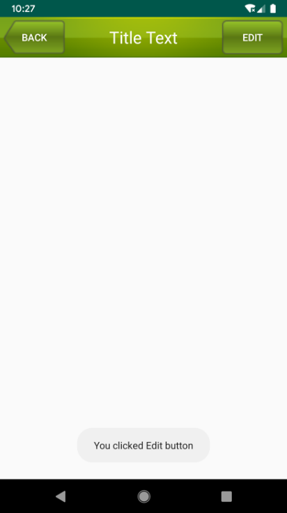

**图 4.27　点击编辑按钮的效果**

这样的话，每当我们在一个布局中引入 TitleLayout 时，返回按钮和编辑按钮的点击事件就已经自动实现好了，这就省去了很多编写重复代码的工作。

## 4.5　最常用和最难用的控件：ListView

ListView 在过去绝对可以称得上是 Android 中最常用的控件之一，几乎所有的应用程序都会用到它。由于手机屏幕空间比较有限，能够一次性在屏幕上显示的内容并不多，当我们的程序中有大量的数据需要展示的时候，就可以借助 ListView 来实现。ListView 允许用户通过手指上下滑动的方式将屏幕外的数据滚动到屏幕内，同时屏幕上原有的数据会滚动出屏幕。你其实每天都在使用这个控件，比如查看 QQ 聊天记录，翻阅微博最新消息，等等。

不过比起前面介绍的几种控件，ListView 的用法相对复杂了很多，因此我们就单独使用一节内容来对 ListView 进行非常详细的讲解。

### 4.5.1　ListView 的简单用法

首先新建一个 ListViewTest 项目，并让 Android Studio 自动帮我们创建好 Activity。然后修改 activity_main.xml 中的代码，如下所示：

```xml
<LinearLayout xmlns:android="http://schemas.android.com/apk/res/android"
    android:layout_width="match_parent"
    android:layout_height="match_parent">

    <ListView
        android:id="@+id/listView"
        android:layout_width="match_parent"
        android:layout_height="match_parent" />

</LinearLayout>
```

在布局中加入 ListView 控件还算非常简单，先为 ListView 指定一个 id，然后将宽度和高度都设置为 `match_parent`，这样 ListView 就占满了整个布局的空间。

接下来修改 MainActivity 中的代码，如下所示：

```Kotlin
class MainActivity : AppCompatActivity() {

    private val data = listOf("Apple", "Banana", "Orange", "Watermelon",
        "Pear", "Grape", "Pineapple", "Strawberry", "Cherry", "Mango",
        "Apple", "Banana", "Orange", "Watermelon", "Pear", "Grape",
        "Pineapple", "Strawberry", "Cherry", "Mango")

    override fun onCreate(savedInstanceState: Bundle?) {
        super.onCreate(savedInstanceState)
        setContentView(R.layout.activity_main)
        val adapter = ArrayAdapter<String>(this,android.R.layout.simple_list_item_1,data)
        listView.adapter = adapter
    }

}
```

既然 ListView 是用于展示大量数据的，那我们就应该先将数据提供好。这些数据可以从网上下载，也可以从数据库中读取，应该视具体的应用程序场景而定。这里我们就简单使用一个 data 集合来进行测试，里面包含了很多水果的名称，初始化集合的方式使用的是之前在第 2 章学过的 `listOf()` 函数。

不过，集合中的数据是无法直接传递给 ListView 的，我们还需要借助适配器来完成。Android 中提供了很多适配器的实现类，其中我认为最好用的就是 ArrayAdapter。它可以通过泛型来指定要适配的数据类型，然后在构造函数中把要适配的数据传入。ArrayAdapter 有多个构造函数的重载，你应该根据实际情况选择最合适的一种。由于我们这里提供的数据都是字符串，因此将 ArrayAdapter 的泛型指定为 `String`，然后在 ArrayAdapter 的构造函数中依次传入 Activity 的实例、ListView 子项布局的 id，以及数据源。注意，我们使用了 `android.R.layout.simple_list_item_1` 作为 ListView 子项布局的 id，这是一个 Android 内置的布局文件，里面只有一个 TextView，可用于简单地显示一段文本。这样适配器对象就构建好了。

最后，还需要调用 ListView 的 `setAdapter()` 方法，将构建好的适配器对象传递进去，这样 ListView 和数据之间的关联就建立完成了。

现在运行一下程序，效果如图 4.28 所示。可以通过滚动的方式查看屏幕外的数据。

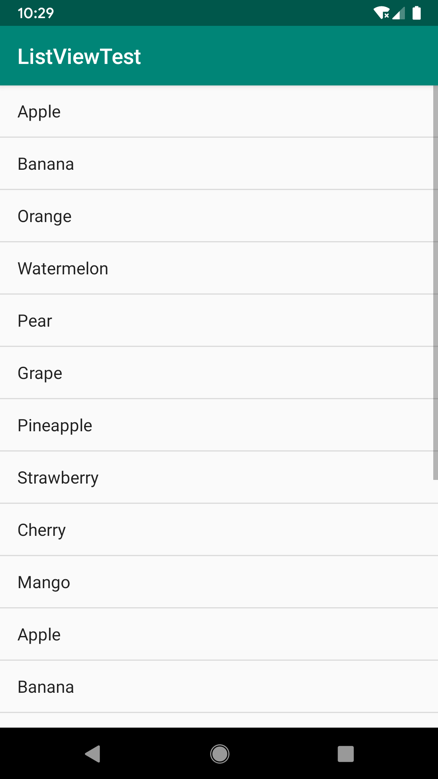

**图 4.28　ListView 运行效果**

### 4.5.2　定制 ListView 的界面

只能显示一段文本的 ListView 实在是太单调了，我们现在就来对 ListView 的界面进行定制，让它可以显示更加丰富的内容。

首先需要准备好一组图片资源（资源下载地址见前言），分别对应上面提供的每一种水果，待会我们要让这些水果名称的旁边都有一张相应的图片。

接着定义一个实体类，作为 ListView 适配器的适配类型。新建 `Fruit` 类，代码如下所示：

```Kotlin
class Fruit(val name:String, val imageId: Int)
```

`Fruit` 类中只有两个字段：`name` 表示水果的名字，`imageId` 表示水果对应图片的资源 id。

然后需要为 ListView 的子项指定一个我们自定义的布局，在 layout 目录下新建 fruit_item.xml，代码如下所示：

```xml
<LinearLayout xmlns:android="http://schemas.android.com/apk/res/android"
    android:layout_width="match_parent"
    android:layout_height="60dp">

    <ImageView
        android:id="@+id/fruitImage"
        android:layout_width="40dp"
        android:layout_height="40dp"
        android:layout_gravity="center_vertical"
        android:layout_marginLeft="10dp"/>

    <TextView
        android:id="@+id/fruitName"
        android:layout_width="wrap_content"
        android:layout_height="wrap_content"
        android:layout_gravity="center_vertical"
        android:layout_marginLeft="10dp" />

</LinearLayout>
```

在这个布局中，我们定义了一个 ImageView 用于显示水果的图片，又定义了一个 TextView 用于显示水果的名称，并让 ImageView 和 TextView 都在垂直方向上居中显示。

接下来需要创建一个自定义的适配器，这个适配器继承自 `ArrayAdapter`，并将泛型指定为 `Fruit` 类。新建类 `FruitAdapter`，代码如下所示：

```Kotlin
class FruitAdapter(activity: Activity, val resourceId: Int, data: List<Fruit>) :
        ArrayAdapter<Fruit>(activity, resourceId, data) {

    override fun getView(position: Int, convertView: View?, parent: ViewGroup): View {
        val view = LayoutInflater.from(context).inflate(resourceId, parent, false)
        val fruitImage: ImageView = view.findViewById(R.id.fruitImage)
        val fruitName: TextView = view.findViewById(R.id.fruitName)
        val fruit = getItem(position) // 获取当前项的Fruit实例
        if (fruit != null) {
            fruitImage.setImageResource(fruit.imageId)
            fruitName.text = fruit.name
        }
        return view
    }

}
```

`FruitAdapter` 定义了一个主构造函数，用于将 Activity 的实例、ListView 子项布局的 id 和数据源传递进来。另外又重写了 `getView()` 方法，这个方法在每个子项被滚动到屏幕内的时候会被调用。

在 `getView()` 方法中，首先使用 `LayoutInflater` 来为这个子项加载我们传入的布局。`LayoutInflater` 的 `inflate()` 方法接收 3 个参数，前两个参数我们已经知道是什么意思了，第三个参数指定成 `false`，表示只让我们在父布局中声明的 `layout` 属性生效，但不会为这个 View 添加父布局。因为一旦 View 有了父布局之后，它就不能再添加到 ListView 中了。如果你现在还不能理解这段话的含义，也没关系，只需要知道这是 ListView 中的标准写法就可以了，当你以后对 View 理解得更加深刻的时候，再来读这段话就没有问题了。

我们继续往下看，接下来调用 View 的 `findViewById()` 方法分别获取到 ImageView 和 TextView 的实例，然后通过 `getItem()` 方法得到当前项的 `Fruit` 实例，并分别调用它们的 `setImageResource()` 和 `setText()` 方法设置显示的图片和文字，最后将布局返回，这样我们自定义的适配器就完成了。

需要注意的是，kotlin-android-extensions 插件在 ListView 的适配器中也能正常工作，将上述代码中的两处 `findViewById()` 方法分别替换成 `view.fruitImage` 和 `view.fruitName`，效果是一模一样的，你可以自己动手尝试一下。

最后修改 MainActivity 中的代码，如下所示：

```Kotlin
class MainActivity : AppCompatActivity() {

    private val fruitList = ArrayList<Fruit>()

    override fun onCreate(savedInstanceState: Bundle?) {
        super.onCreate(savedInstanceState)
        setContentView(R.layout.activity_main)
        initFruits() // 初始化水果数据
        val adapter = FruitAdapter(this, R.layout.fruit_item, fruitList)
        listView.adapter = adapter
    }

    private fun initFruits() {
        repeat(2) {
            fruitList.add(Fruit("Apple", R.drawable.apple_pic))
            fruitList.add(Fruit("Banana", R.drawable.banana_pic))
            fruitList.add(Fruit("Orange", R.drawable.orange_pic))
            fruitList.add(Fruit("Watermelon", R.drawable.watermelon_pic))
            fruitList.add(Fruit("Pear", R.drawable.pear_pic))
            fruitList.add(Fruit("Grape", R.drawable.grape_pic))
            fruitList.add(Fruit("Pineapple", R.drawable.pineapple_pic))
            fruitList.add(Fruit("Strawberry", R.drawable.strawberry_pic))
            fruitList.add(Fruit("Cherry", R.drawable.cherry_pic))
            fruitList.add(Fruit("Mango", R.drawable.mango_pic))
        }
    }

}
```

可以看到，这里添加了一个 `initFruits()` 方法，用于初始化所有的水果数据。在 `Fruit` 类的构造函数中将水果的名字和对应的图片 id 传入，然后把创建好的对象添加到水果列表中。另外，我们使用了一个 `repeat` 函数将所有的水果数据添加了两遍，这是因为如果只添加一遍的话，数据量还不足以充满整个屏幕。`repeat` 函数是 Kotlin 中另外一个非常常用的标准函数，它允许你传入一个数值 *n*，然后会把 Lambda 表达式中的内容执行 *n* 遍。接着在 `onCreate()` 方法中创建了 `FruitAdapter` 对象，并将它作为适配器传递给 ListView，这样定制 ListView 界面的任务就完成了。

现在重新运行程序，效果如图 4.29 所示。


**图 4.29　定制界面的 ListView 运行效果**

虽然目前我们定制的界面还很简单，但是相信你已经领悟到了诀窍，只要修改 fruit_item.xml 中的内容，就可以定制出各种复杂的界面了。

### 4.5.3　提升 ListView 的运行效率

之所以说 ListView 这个控件很难用，是因为它有很多细节可以优化，其中运行效率就是很重要的一点。目前我们 ListView 的运行效率是很低的，因为在 `FruitAdapter` 的 `getView()` 方法中，每次都将布局重新加载了一遍，当 ListView 快速滚动的时候，这就会成为性能的瓶颈。

仔细观察你会发现，`getView()` 方法中还有一个 `convertView` 参数，这个参数用于将之前加载好的布局进行缓存，以便之后进行重用，我们可以借助这个参数来进行性能优化。修改 `FruitAdapter` 中的代码，如下所示：

```Kotlin
class FruitAdapter(activity: Activity, val resourceId: Int, data: List<Fruit>) :
        ArrayAdapter<Fruit>(activity, resourceId, data) {

    override fun getView(position: Int, convertView: View?, parent: ViewGroup): View {
        val view: View
        if (convertView == null) {
            view = LayoutInflater.from(context).inflate(resourceId, parent, false)
        } else {
            view = convertView
        }
        val fruitImage: ImageView = view.findViewById(R.id.fruitImage)
        val fruitName: TextView = view.findViewById(R.id.fruitName)
        val fruit = getItem(position) // 获取当前项的Fruit实例
        if (fruit != null) {
            fruitImage.setImageResource(fruit.imageId)
            fruitName.text = fruit.name
        }
        return view
    }

}
```

可以看到，现在我们在 `getView()` 方法中进行了判断：如果 `convertView` 为 `null`，则使用 `LayoutInflater` 去加载布局；如果不为 `null`，则直接对 `convertView` 进行重用。这样就大大提高了 ListView 的运行效率，在快速滚动的时候可以表现出更好的性能。

不过，目前我们的这份代码还是可以继续优化的，虽然现在已经不会再重复去加载布局，但是每次在 `getView()` 方法中仍然会调用 `View` 的 `findViewById()` 方法来获取一次控件的实例。我们可以借助一个 `ViewHolder` 来对这部分性能进行优化，修改 `FruitAdapter` 中的代码，如下所示：

```Kotlin
class FruitAdapter(activity: Activity, val resourceId: Int, data: List<Fruit>) :
        ArrayAdapter<Fruit>(activity, resourceId, data) {

    inner class ViewHolder(val fruitImage: ImageView, val fruitName: TextView)

    override fun getView(position: Int, convertView: View?, parent: ViewGroup): View {
        val view: View
        val viewHolder: ViewHolder
        if (convertView == null) {
            view = LayoutInflater.from(context).inflate(resourceId, parent, false)
            val fruitImage: ImageView = view.findViewById(R.id.fruitImage)
            val fruitName: TextView = view.findViewById(R.id.fruitName)
            viewHolder = ViewHolder(fruitImage, fruitName)
            view.tag = viewHolder
        } else {
            view = convertView
            viewHolder = view.tag as ViewHolder
        }

        val fruit = getItem(position) // 获取当前项的Fruit实例
        if (fruit != null) {
            viewHolder.fruitImage.setImageResource(fruit.imageId)
            viewHolder.fruitName.text = fruit.name
        }
        return view
    }

}
```

我们新增了一个内部类 `ViewHolder`，用于对 ImageView 和 TextView 的控件实例进行缓存，Kotlin 中使用 `inner class` 关键字来定义内部类。当 `convertView` 为 `null` 的时候，创建一个 `ViewHolder` 对象，并将控件的实例存放在 `ViewHolder` 里，然后调用 `View` 的 `setTag()` 方法，将 `ViewHolder` 对象存储在 `View` 中。当 `convertView` 不为 `null` 的时候，则调用 `View` 的 `getTag()` 方法，把 `ViewHolder` 重新取出。这样所有控件的实例都缓存在了 `ViewHolder` 里，就没有必要每次都通过 `findViewById()` 方法来获取控件实例了。

通过这两步优化之后，我们 ListView 的运行效率就已经非常不错了。

### 4.5.4　ListView 的点击事件

话说回来，ListView 的滚动毕竟只是满足了我们视觉上的效果，可是如果 ListView 中的子项不能点击的话，这个控件就没有什么实际的用途了。因此，本小节我们就来学习一下 ListView 如何才能响应用户的点击事件。

修改 MainActivity 中的代码，如下所示：

```Kotlin
class MainActivity : AppCompatActivity() {

    private val fruitList = ArrayList<Fruit>()

    override fun onCreate(savedInstanceState: Bundle?) {
        super.onCreate(savedInstanceState)
        setContentView(R.layout.activity_main)
        initFruits() // 初始化水果数据
        val adapter = FruitAdapter(this, R.layout.fruit_item, fruitList)
        listView.adapter = adapter
        listView.setOnItemClickListener { parent, view, position, id ->
            val fruit = fruitList[position]
            Toast.makeText(this, fruit.name, Toast.LENGTH_SHORT).show()
        }
    }

    ...

}
```

可以看到，我们使用 `setOnItemClickListener()` 方法为 ListView 注册了一个监听器，当用户点击了 ListView 中的任何一个子项时，就会回调到 Lambda 表达式中。这里我们可以通过 `position` 参数判断用户点击的是哪一个子项，然后获取到相应的水果，并通过 Toast 将水果的名字显示出来。

重新运行程序，并点击一下橘子，效果如图 4.30 所示。

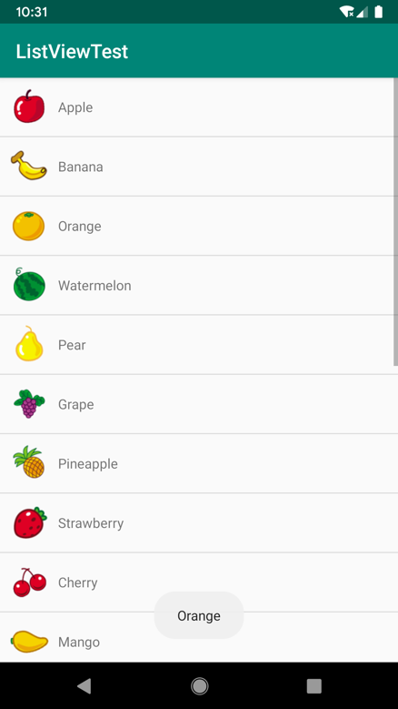

**图 4.30　点击 ListView 的效果**

上述代码的 Lambda 表达式在参数列表中声明了 4 个参数，那么我们如何知道需要声明哪几个参数呢？这里我来教你一个办法，按住 Ctrl 键（Mac 系统是 command 键）点击 `setOnItemClickListener()` 方法查看它的源码，你会发现 `setOnItemClickListener()` 方法接收一个 `OnItemClickListener` 参数，这当然就是一个 Java 单抽象方法接口了，要不然这里我们也无法使用函数式 API 的写法。`OnItemClickListener` 接口的定义如图 4.31 所示。

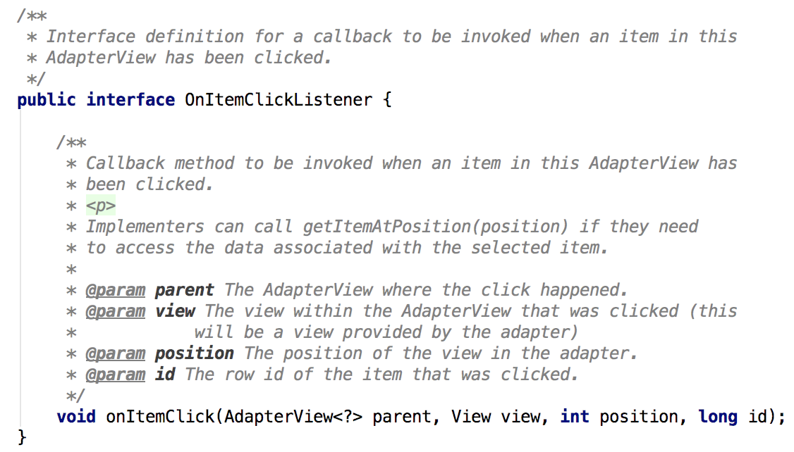

**图 4.31** **`OnItemClickListener`** **接口的定义**

可以看到，它的唯一待实现方法 `onItemClick()` 中接收 4 个参数，这些就是我们要在 Lambda 表达式的参数列表中声明的参数了。

另外你会发现，虽然这里我们必须在 Lambda 表达式中声明 4 个参数，但实际上却只用到了 `position` 这一个参数而已。针对这种情况，Kotlin 允许我们将没有用到的参数使用下划线来替代，因此下面这种写法也是合法且更加推荐的：

```Kotlin
listView.setOnItemClickListener { _, _, position, _ ->
    val fruit = fruitList[position]
    Toast.makeText(this, fruit.name, Toast.LENGTH_SHORT).show()
}
```

注意，即使将没有用到的参数使用下划线来代替，它们之间的位置是不能改变的，`position` 参数仍然得在第三个参数的位置。

## 4.6　更强大的滚动控件：RecyclerView

ListView 由于强大的功能，在过去的 Android 开发当中可以说是贡献卓越，直到今天仍然还有不计其数的程序在使用 ListView。不过 ListView 并不是完美无缺的，比如如果不使用一些技巧来提升它的运行效率，那么 ListView 的性能就会非常差。还有，ListView 的扩展性也不够好，它只能实现数据纵向滚动的效果，如果我们想实现横向滚动的话，ListView 是做不到的。

为此，Android 提供了一个更强大的滚动控件——RecyclerView。它可以说是一个增强版的 ListView，不仅可以轻松实现和 ListView 同样的效果，还优化了 ListView 存在的各种不足之处。目前 Android 官方更加推荐使用 RecyclerView，未来也会有更多的程序逐渐从 ListView 转向 RecyclerView，那么本节我们就来详细讲解一下 RecyclerView 的用法。

首先新建一个 RecyclerViewTest 项目，并让 Android Studio 自动帮我们创建好 Activity。

### 4.6.1　RecyclerView 的基本用法

和之前我们所学的所有控件不同，RecyclerView 属于新增控件，那么怎样才能让新增的控件在所有 Android 系统版本上都能使用呢？为此，Google 将 RecyclerView 控件定义在了 AndroidX 当中，我们只需要在项目的 build.gradle 中添加 RecyclerView 库的依赖，就能保证在所有 Android 系统版本上都可以使用 RecyclerView 控件了。

打开 app/build.gradle 文件，在 `dependencies` 闭包中添加如下内容：

```gradle
dependencies {
    implementation fileTree(dir: 'libs', include: ['*.jar'])
    implementation"org.jetbrains.kotlin:kotlin-stdlib-jdk7:$kotlin_version"
    implementation 'androidx.appcompat:appcompat:1.0.2'
    implementation 'androidx.core:core-ktx:1.0.2'
    implementation 'androidx.constraintlayout:constraintlayout:1.1.3'
    implementation 'androidx.recyclerview:recyclerview:1.0.0'
    testImplementation 'junit:junit:4.12'
    androidTestImplementation 'androidx.test:runner:1.1.1'
    androidTestImplementation 'androidx.test.espresso:espresso-core:3.1.1'
}
```

上述代码就表示将 RecyclerView 库引入我们的项目当中，其中除了版本号部分可能会变化，其他部分是固定不变的。那么可能你会好奇，我怎么知道每个库现在最新的版本号是多少呢？这里告诉你一个小窍门，当你不能确定最新的版本号是多少的时候，可以就像上述代码一样填入 1.0.0，当有更新的库版本时，Android Studio 会主动提醒你，并告诉你最新的版本号是多少，如图 4.32 所示。

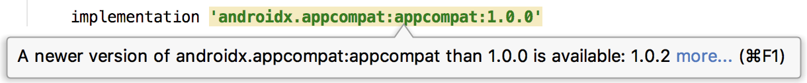

**图 4.32　Android Studio 提醒有库版本更新**

另外，每当修改了任何 gradle 文件，Android Studio 都弹出一个如图 4.33 所示的提示。


**图 4.33　gradle 文件修改后的提示**

这个提示告诉我们，gradle 文件自上次同步之后又发生了变化，需要再次同步才能使项目正常工作。这里只需要点击“Sync Now”就可以了，然后 gradle 会开始进行同步，把我们新添加的 RecyclerView 库引入项目当中。

接下来修改 activity_main.xml 中的代码，如下所示：

```xml
<LinearLayout xmlns:android="http://schemas.android.com/apk/res/android"
    android:layout_width="match_parent"
    android:layout_height="match_parent">

    <androidx.recyclerview.widget.RecyclerView
        android:id="@+id/recyclerView"
        android:layout_width="match_parent"
        android:layout_height="match_parent" />

</LinearLayout>
```

在布局中加入 RecyclerView 控件也是非常简单的，先为 RecyclerView 指定一个 id，然后将宽度和高度都设置为 `match_parent`，这样 RecyclerView 就占满了整个布局的空间。需要注意的是，由于 RecyclerView 并不是内置在系统 SDK 当中的，所以需要把完整的包路径写出来。

这里我们想要使用 RecyclerView 来实现和 ListView 相同的效果，因此就需要准备一份同样的水果图片。简单起见，我们就直接从 ListViewTest 项目中把图片复制过来，另外顺便将 `Fruit` 类和 fruit_item.xml 也复制过来，省得将同样的代码再写一遍。

接下来需要为 RecyclerView 准备一个适配器，新建 `FruitAdapter` 类，让这个适配器继承自 `RecyclerView.Adapter`，并将泛型指定为 `FruitAdapter.ViewHolder`。其中，`ViewHolder` 是我们在 `FruitAdapter` 中定义的一个内部类，代码如下所示：

```Kotlin
class FruitAdapter(val fruitList: List<Fruit>) :
        RecyclerView.Adapter<FruitAdapter.ViewHolder>() {

    inner class ViewHolder(view: View) : RecyclerView.ViewHolder(view) {
        val fruitImage: ImageView = view.findViewById(R.id.fruitImage)
        val fruitName: TextView = view.findViewById(R.id.fruitName)
    }

    override fun onCreateViewHolder(parent: ViewGroup, viewType: Int): ViewHolder {
        val view = LayoutInflater.from(parent.context)
        .inflate(R.layout.fruit_item, parent, false)
        return ViewHolder(view)
    }

    override fun onBindViewHolder(holder: ViewHolder, position: Int) {
        val fruit = fruitList[position]
        holder.fruitImage.setImageResource(fruit.imageId)
        holder.fruitName.text = fruit.name
    }

    override fun getItemCount() = fruitList.size

}
```

这是 RecyclerView 适配器标准的写法，虽然看上去好像多了好几个方法，但其实它比 ListView 的适配器要更容易理解。这里我们首先定义了一个内部类 `ViewHolder`，它要继承自 `RecyclerView.ViewHolder`。然后 `ViewHolder` 的主构造函数中要传入一个 `View` 参数，这个参数通常就是 RecyclerView 子项的最外层布局，那么我们就可以通过 `findViewById()` 方法来获取布局中 ImageView 和 TextView 的实例了。

`FruitAdapter` 中也有一个主构造函数，它用于把要展示的数据源传进来，我们后续的操作都将在这个数据源的基础上进行。

继续往下看，由于 `FruitAdapter` 是继承自 `RecyclerView.Adapter` 的，那么就必须重写 `onCreateViewHolder()`、`onBindViewHolder()` 和 `getItemCount()` 这 3 个方法。`onCreateViewHolder()` 方法是用于创建 `ViewHolder` 实例的，我们在这个方法中将 `fruit_item` 布局加载进来，然后创建一个 `ViewHolder` 实例，并把加载出来的布局传入构造函数当中，最后将 `ViewHolder` 的实例返回。`onBindViewHolder()` 方法用于对 RecyclerView 子项的数据进行赋值，会在每个子项被滚动到屏幕内的时候执行，这里我们通过 `position` 参数得到当前项的 `Fruit` 实例，然后再将数据设置到 `ViewHolder` 的 ImageView 和 TextView 当中即可。`getItemCount()` 方法就非常简单了，它用于告诉 RecyclerView 一共有多少子项，直接返回数据源的长度就可以了。

适配器准备好了之后，我们就可以开始使用 RecyclerView 了，修改 MainActivity 中的代码，如下所示：

```Kotlin
class MainActivity : AppCompatActivity() {

    private val fruitList = ArrayList<Fruit>()

    override fun onCreate(savedInstanceState: Bundle?) {
        super.onCreate(savedInstanceState)
        setContentView(R.layout.activity_main)
        initFruits() // 初始化水果数据
        val layoutManager = LinearLayoutManager(this)
        recyclerView.layoutManager = layoutManager
        val adapter = FruitAdapter(fruitList)
        recyclerView.adapter = adapter
    }

    private fun initFruits() {
        repeat(2) {
            fruitList.add(Fruit("Apple", R.drawable.apple_pic))
            fruitList.add(Fruit("Banana", R.drawable.banana_pic))
            fruitList.add(Fruit("Orange", R.drawable.orange_pic))
            fruitList.add(Fruit("Watermelon", R.drawable.watermelon_pic))
            fruitList.add(Fruit("Pear", R.drawable.pear_pic))
            fruitList.add(Fruit("Grape", R.drawable.grape_pic))
            fruitList.add(Fruit("Pineapple", R.drawable.pineapple_pic))
            fruitList.add(Fruit("Strawberry", R.drawable.strawberry_pic))
            fruitList.add(Fruit("Cherry", R.drawable.cherry_pic))
            fruitList.add(Fruit("Mango", R.drawable.mango_pic))
        }
    }

}
```

可以看到，这里使用了一个同样的 `initFruits()` 方法，用于初始化所有的水果数据。接着在 `onCreate()` 方法中先创建了一个 `LinearLayoutManager` 对象，并将它设置到 RecyclerView 当中。LayoutManager 用于指定 RecyclerView 的布局方式，这里使用的 LinearLayoutManager 是线性布局的意思，可以实现和 ListView 类似的效果。接下来我们创建了 `FruitAdapter` 的实例，并将水果数据传入 `FruitAdapter` 的构造函数中，最后调用 RecyclerView 的 `setAdapter()` 方法来完成适配器设置，这样 RecyclerView 和数据之间的关联就建立完成了。

现在运行一下程序，效果如图 4.34 所示。

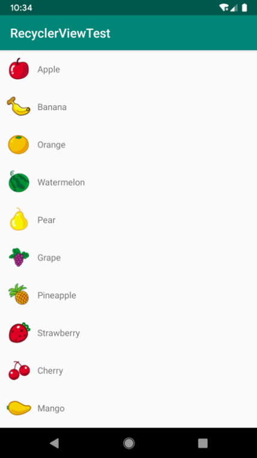

**图 4.34　RecyclerView 运行效果**

可以看到，我们使用 RecyclerView 实现了和 ListView 几乎一模一样的效果，虽说在代码量方面并没有明显的减少，但是逻辑变得更加清晰了。当然这只是 RecyclerView 的基本用法而已，接下来我们就看一看 RecyclerView 还能实现哪些 ListView 实现不了的效果。

### 4.6.2　实现横向滚动和瀑布流布局

我们已经知道，ListView 的扩展性并不好，它只能实现纵向滚动的效果，如果想进行横向滚动的话，ListView 就做不到了。那么 RecyclerView 就能做得到吗？当然可以，不仅能做得到，还非常简单。接下来我们就尝试实现一下横向滚动的效果。

首先要对 `fruit_item` 布局进行修改，因为目前这个布局里面的元素是水平排列的，适用于纵向滚动的场景，而如果我们要实现横向滚动的话，应该把 `fruit_item` 里的元素改成垂直排列才比较合理。修改 fruit_item.xml 中的代码，如下所示：

```xml
<LinearLayout xmlns:android="http://schemas.android.com/apk/res/android"
    android:orientation="vertical"
    android:layout_width="80dp"
    android:layout_height="wrap_content">

    <ImageView
        android:id="@+id/fruitImage"
        android:layout_width="40dp"
        android:layout_height="40dp"
        android:layout_gravity="center_horizontal"
        android:layout_marginTop="10dp" />

    <TextView
        android:id="@+id/fruitName"
        android:layout_width="wrap_content"
        android:layout_height="wrap_content"
        android:layout_gravity="center_horizontal"
        android:layout_marginTop="10dp" />

</LinearLayout>
```

可以看到，我们将 LinearLayout 改成垂直方向排列，并把宽度设为 80 dp。这里将宽度指定为固定值是因为每种水果的文字长度不一致，如果用 `wrap_content` 的话，RecyclerView 的子项就会有长有短，非常不美观，而如果用 `match_parent` 的话，就会导致宽度过长，一个子项占满整个屏幕。

然后我们将 ImageView 和 TextView 都设置成了在布局中水平居中，并且使用 `layout_marginTop` 属性让文字和图片之间保持一定距离。

接下来修改 MainActivity 中的代码，如下所示：

```Kotlin
class MainActivity : AppCompatActivity() {

    private val fruitList = ArrayList<Fruit>()

    override fun onCreate(savedInstanceState: Bundle?) {
        super.onCreate(savedInstanceState)
        setContentView(R.layout.activity_main)
        initFruits() // 初始化水果数据
        val layoutManager = LinearLayoutManager(this)
        layoutManager.orientation = LinearLayoutManager.HORIZONTAL
        recyclerView.layoutManager = layoutManager
        val adapter = FruitAdapter(fruitList)
        recyclerView.adapter = adapter
    }
    ...
}
```

MainActivity 中只加入了一行代码，调用 LinearLayoutManager 的 `setOrientation()` 方法设置布局的排列方向。默认是纵向排列的，我们传入 `LinearLayoutManager.HORIZONTAL` 表示让布局横行排列，这样 RecyclerView 就可以横向滚动了。

重新运行一下程序，效果如图 4.35 所示。


**图 4.35　横向 RecyclerView 效果**

你可以用手指在水平方向上滑动来查看屏幕外的数据。

为什么 ListView 很难或者根本无法实现的效果在 RecyclerView 上这么轻松就实现了呢？这主要得益于 RecyclerView 出色的设计。ListView 的布局排列是由自身去管理的，而 RecyclerView 则将这个工作交给了 LayoutManager。LayoutManager 制定了一套可扩展的布局排列接口，子类只要按照接口的规范来实现，就能定制出各种不同排列方式的布局了。

除了 LinearLayoutManager 之外，RecyclerView 还给我们提供了 GridLayoutManager 和 StaggeredGridLayoutManager 这两种内置的布局排列方式。GridLayoutManager 可以用于实现网格布局，StaggeredGridLayoutManager 可以用于实现瀑布流布局。这里我们来实现一下效果更加炫酷的瀑布流布局，网格布局就作为课后习题，交给你自己来研究了。

首先还是来修改一下 fruit_item.xml 中的代码，如下所示：

```xml
<LinearLayout xmlns:android="http://schemas.android.com/apk/res/android"
    android:orientation="vertical"
    android:layout_width="match_parent"
    android:layout_height="wrap_content"
    android:layout_margin="5dp">

    <ImageView
        android:id="@+id/fruitImage"
        android:layout_width="40dp"
        android:layout_height="40dp"
        android:layout_gravity="center_horizontal"
        android:layout_marginTop="10dp" />

    <TextView
        android:id="@+id/fruitName"
        android:layout_width="wrap_content"
        android:layout_height="wrap_content"
        android:layout_gravity="left"
        android:layout_marginTop="10dp" />

</LinearLayout>
```

这里做了几处小的调整，首先将 LinearLayout 的宽度由 80 dp 改成了 `match_parent`，因为瀑布流布局的宽度应该是根据布局的列数来自动适配的，而不是一个固定值。其次我们使用了 `layout_margin` 属性来让子项之间互留一点间距，这样就不至于所有子项都紧贴在一些。最后还将 TextView 的对齐属性改成了居左对齐，因为待会我们会将文字的长度变长，如果还是居中显示就会感觉怪怪的。

接着修改 MainActivity 中的代码，如下所示：

```Kotlin
class MainActivity : AppCompatActivity() {

    private val fruitList = ArrayList<Fruit>()

    override fun onCreate(savedInstanceState: Bundle?) {
        super.onCreate(savedInstanceState)
        setContentView(R.layout.activity_main)
        initFruits() // 初始化水果数据
        val layoutManager = StaggeredGridLayoutManager(3,
        StaggeredGridLayoutManager.VERTICAL)
        recyclerView.layoutManager = layoutManager
        val adapter = FruitAdapter(fruitList)
        recyclerView.adapter = adapter
    }

    private fun initFruits() {
        repeat(2) {
            fruitList.add(Fruit(getRandomLengthString("Apple"),
                R.drawable.apple_pic))
            fruitList.add(Fruit(getRandomLengthString("Banana"),
                R.drawable.banana_pic))
            fruitList.add(Fruit(getRandomLengthString("Orange"),
                R.drawable.orange_pic))
            fruitList.add(Fruit(getRandomLengthString("Watermelon"),
                R.drawable.watermelon_pic))
            fruitList.add(Fruit(getRandomLengthString("Pear"),
                R.drawable.pear_pic))
            fruitList.add(Fruit(getRandomLengthString("Grape"),
                R.drawable.grape_pic))
            fruitList.add(Fruit(getRandomLengthString("Pineapple"),
                R.drawable.pineapple_pic))
            fruitList.add(Fruit(getRandomLengthString("Strawberry"),
                R.drawable.strawberry_pic))
            fruitList.add(Fruit(getRandomLengthString("Cherry"),
                R.drawable.cherry_pic))
            fruitList.add(Fruit(getRandomLengthString("Mango"),
                R.drawable.mango_pic))
        }
    }

    private fun getRandomLengthString(str: String): String {
        val n =  (1..20).random()
        val builder = StringBuilder()
        repeat(n) {
            builder.append(str)
        }
        return builder.toString()
    }

}
```

首先，在 `onCreate()` 方法中，我们创建了一个 `StaggeredGridLayoutManager` 的实例。`StaggeredGridLayoutManager` 的构造函数接收两个参数：第一个参数用于指定布局的列数，传入 3 表示会把布局分为 3 列；第二个参数用于指定布局的排列方向，传入 `StaggeredGridLayoutManager.VERTICAL` 表示会让布局纵向排列。最后把创建好的实例设置到 RecyclerView 当中就可以了，就是这么简单！

没错，仅仅修改了一行代码，我们就已经成功实现瀑布流布局的效果了。不过由于瀑布流布局需要各个子项的高度不一致才能看出明显的效果，为此我又使用了一个小技巧。这里我们把眼光聚焦到 `getRandomLengthString()` 这个方法上，这个方法中调用了 Range 对象的 `random()` 函数来创造一个 1 到 20 之间的随机数，然后将参数中传入的字符串随机重复几遍。在 `initFruits()` 方法中，每个水果的名字都改成调用 `getRandomLengthString()` 这个方法来生成，这样就能保证各水果名字的长短差距比较大，子项的高度也就各不相同了。

现在重新运行一下程序，效果如图 4.36 所示。


**图 4.36　瀑布流布局效果**

当然，由于水果名字的长度每次都是随机生成的，你运行时的效果肯定和图中是不一样的。

### 4.6.3　RecyclerView 的点击事件

和 ListView 一样，RecyclerView 也必须能响应点击事件才可以，不然的话就没什么实际用途了。不过不同于 ListView 的是，RecyclerView 并没有提供类似于 `setOnItemClickListener()` 这样的注册监听器方法，而是需要我们自己给子项具体的 View 去注册点击事件。这相比于 ListView 来说，实现起来要复杂一些。

那么你可能就有疑问了，为什么 RecyclerView 在各方面的设计都要优于 ListView，偏偏在点击事件上却没有处理得非常好呢？其实不是这样的，ListView 在点击事件上的处理并不人性化，`setOnItemClickListener()` 方法注册的是子项的点击事件，但如果我想点击的是子项里具体的某一个按钮呢？虽然 ListView 也能做到，但是实现起来就相对比较麻烦了。为此，RecyclerView 干脆直接摒弃了子项点击事件的监听器，让所有的点击事件都由具体的 View 去注册，就再没有这个困扰了。

下面我们来具体学习一下如何在 RecyclerView 中注册点击事件，修改 `FruitAdapter` 中的代码，如下所示：

```Kotlin
class FruitAdapter(val fruitList: List<Fruit>) :
        RecyclerView.Adapter<FruitAdapter.ViewHolder>() {
    ...
    override fun onCreateViewHolder(parent: ViewGroup, viewType: Int): ViewHolder {
        val view = LayoutInflater.from(parent.context)
        .inflate(R.layout.fruit_item, parent, false)
        val viewHolder = ViewHolder(view)
        viewHolder.itemView.setOnClickListener {
            val position = viewHolder.adapterPosition
            val fruit = fruitList[position]
            Toast.makeText(parent.context, "you clicked view ${fruit.name}",
                Toast.LENGTH_SHORT).show()
        }
        viewHolder.fruitImage.setOnClickListener {
            val position = viewHolder.adapterPosition
            val fruit = fruitList[position]
            Toast.makeText(parent.context, "you clicked image ${fruit.name}",
                Toast.LENGTH_SHORT).show()
        }
        return viewHolder
    }
    ...
}
```

可以看到，这里我们是在 `onCreateViewHolder()` 方法中注册点击事件。上述代码分别为最外层布局和 ImageView 都注册了点击事件，itemView 表示的就是最外层布局。RecyclerView 的强大之处也在于此，它可以轻松实现子项中任意控件或布局的点击事件。我们在两个点击事件中先获取了用户点击的 position，然后通过 position 拿到相应的 `Fruit` 实例，再使用 Toast 分别弹出两种不同的内容以示区别。

现在重新运行代码，并点击苹果的图片部分，效果如图 4.37 所示。可以看到，这时触发了 ImageView 的点击事件。

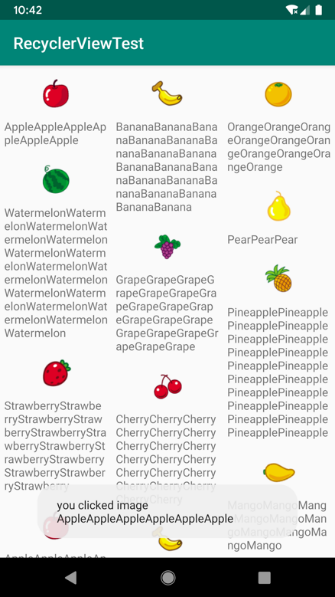

**图 4.37　点击苹果的图片部分**

然后点击橘子的文字部分，由于 TextView 并没有注册点击事件，因此点击文字这个事件会被子项的最外层布局捕获，效果如图 4.38 所示。

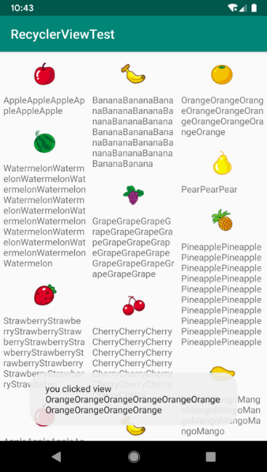

**图 4.38　点击橘子的文字部分**

## 4.7　编写界面的最佳实践

既然已经学习了那么多 UI 开发的知识，是时候实战一下了。这次我们要综合运用前面所学的大量内容来编写出一个较为复杂且相当美观的聊天界面，你准备好了吗？要先创建一个 UIBestPractice 项目才算准备好了哦。

### 4.7.1　制作 9-Patch 图片

在实战正式开始之前，我们需要先学习一下如何制作 9-Patch 图片。你之前可能没有听说过这个名词，它是一种被特殊处理过的 png 图片，能够指定哪些区域可以被拉伸、哪些区域不可以。

那么 9-Patch 图片到底有什么实际作用呢？我们还是通过一个例子来看一下吧。首先在 UIBestPractice 项目中放置一张气泡样式的图片 message_left.png（资源下载地址见前言），如图 4.39 所示。


**图 4.39　气泡样式图片**

我们将这张图片设置为 LinearLayout 的背景图片，修改 activity_main.xml 中的代码，如下所示：

```xml
<LinearLayout xmlns:android="http://schemas.android.com/apk/res/android"
    android:layout_width="match_parent"
    android:layout_height="50dp"
    android:background="@drawable/message_left">
</LinearLayout>
```

这里将 LinearLayout 的宽度指定为 `match_parent`，将它的背景图设置为 `message_left`。现在运行程序，效果如图 4.40 所示。


**图 4.40　气泡被均匀拉伸的效果**

可以看到，由于 `message_left` 的宽度不足以填满整个屏幕的宽度，整张图片被均匀地拉伸了！这种效果非常差，用户肯定是不能容忍的，这时就可以使用 9-Patch 图片来进行改善。

制作 9-Patch 图片其实并不复杂，只要掌握好规则就行了，那么现在我们就来学习一下。

在 Android Studio 中，我们可以将任何 png 类型的图片制作成 9-Patch 图片。首先对着 message_left.png 图片右击 →Create 9-Patch file，会弹出如图 4.41 所示的对话框。

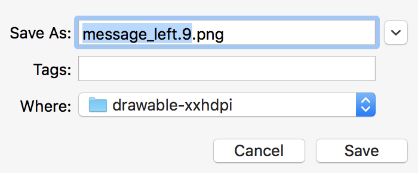

**图 4.41　创建 9-Patch 图片的对话框**

这里保持默认文件名就可以了，其实就相当于创建了一张以 9.png 为后缀的同名图片，点击“Save”完成保存。这时 Android Studio 会显示如图 4.42 所示的编辑界面。

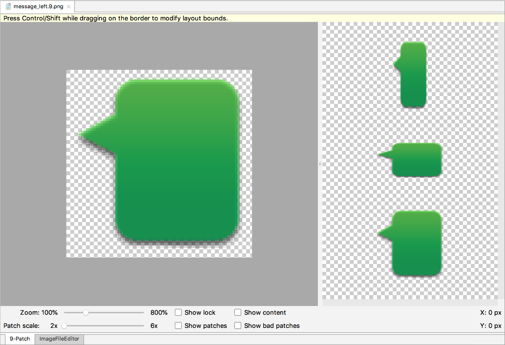

**图 4.42　9-Patch 图片的编辑界面**

我们可以在图片的 4 个边框绘制一个个的小黑点，在上边框和左边框绘制的部分表示当图片需要拉伸时就拉伸黑点标记的区域，在下边框和右边框绘制的部分表示内容允许被放置的区域。使用鼠标在图片的边缘拖动就可以进行绘制了，按住 Shift 键拖动可以进行擦除。绘制完成后效果如图 4.43 所示。

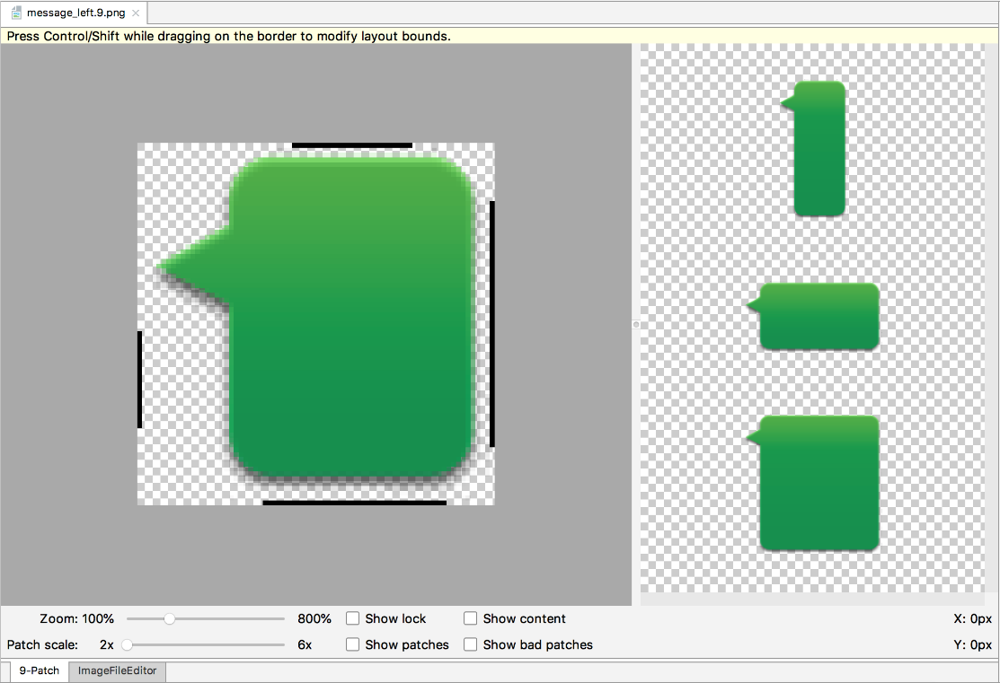

**图 4.43　绘制完成后的 message_left 图片**

最后记得要将原来的 message_left.png 图片删除，只保留制作好的 message_left.9.png 图片即可，因为 Android 项目中不允许同一文件夹下有两张相同名称的图片（即使后缀名不同也不行）。重新运行程序，效果如图 4.44 所示。


**图 4.44　气泡只拉伸绘制区域的效果**

这样当图片需要拉伸的时候，就可以只拉伸指定的区域，程序在外观上也有了很大的改进。有了这个知识储备之后，我们就可以进入实战环节了。

### 4.7.2　编写精美的聊天界面

既然是要编写一个聊天界面，那肯定要有收到的消息和发出的消息。上一小节中我们制作的 message_left.9.png 可以作为收到消息的背景图，那么毫无疑问你还需要再制作一张 message_right.9.png 作为发出消息的背景图。制作过程是完全一样的，我就不再重复演示了。

图片都准备好了之后，就可以开始编码了。由于待会我们会用到 RecyclerView，因此首先需要在 app/build.gradle 当中添加依赖库，如下所示：

```gradle
dependencies {
    implementation fileTree(dir: 'libs', include: ['*.jar'])
    implementation"org.jetbrains.kotlin:kotlin-stdlib-jdk7:$kotlin_version"
    implementation 'androidx.appcompat:appcompat:1.0.2'
    implementation 'androidx.core:core-ktx:1.0.2'
    implementation 'androidx.constraintlayout:constraintlayout:1.1.3'
    implementation 'androidx.recyclerview:recyclerview:1.0.0'
    testImplementation 'junit:junit:4.12'
    androidTestImplementation 'androidx.test:runner:1.1.1'
    androidTestImplementation 'androidx.test.espresso:espresso-core:3.1.1'
}
```

接下来开始编写主界面，修改 activity_main.xml 中的代码，如下所示：

```xml
<LinearLayout xmlns:android="http://schemas.android.com/apk/res/android"
    android:orientation="vertical"
    android:layout_width="match_parent"
    android:layout_height="match_parent"
    android:background="#d8e0e8" >

    <androidx.recyclerview.widget.RecyclerView
        android:id="@+id/recyclerView"
        android:layout_width="match_parent"
        android:layout_height="0dp"
        android:layout_weight="1" />

    <LinearLayout
        android:layout_width="match_parent"
        android:layout_height="wrap_content" >

        <EditText
            android:id="@+id/inputText"
            android:layout_width="0dp"
            android:layout_height="wrap_content"
            android:layout_weight="1"
            android:hint="Type something here"
            android:maxLines="2" />

        <Button
            android:id="@+id/send"
            android:layout_width="wrap_content"
            android:layout_height="wrap_content"
            android:text="Send" />

    </LinearLayout>

</LinearLayout>
```

我们在主界面中放置了一个 RecyclerView 用于显示聊天的消息内容，又放置了一个 EditText 用于输入消息，还放置了一个 Button 用于发送消息。这里用到的所有属性都是我们之前学过的，相信你理解起来应该不费力。

然后定义消息的实体类，新建 `Msg`，代码如下所示：

```Kotlin
class Msg(val content: String, val type: Int) {
    companion object {
        const val TYPE_RECEIVED = 0
        const val TYPE_SENT = 1
    }
}
```

`Msg` 类中只有两个字段：`content` 表示消息的内容，`type` 表示消息的类型。其中消息类型有两个值可选：`TYPE_RECEIVED` 表示这是一条收到的消息，`TYPE_SENT` 表示这是一条发出的消息。这里我们将 `TYPE_RECEIVED` 和 `TYPE_SENT` 定义成了常量，定义常量的关键字是 `const`，注意只有在单例类、companion object 或顶层方法中才可以使用 `const` 关键字。

接下来开始编写 RecyclerView 的子项布局，新建 msg_left_item.xml，代码如下所示：

```xml
<FrameLayout xmlns:android="http://schemas.android.com/apk/res/android"
    android:layout_width="match_parent"
    android:layout_height="wrap_content"
    android:padding="10dp" >

    <LinearLayout
        android:layout_width="wrap_content"
        android:layout_height="wrap_content"
        android:layout_gravity="left"
        android:background="@drawable/message_left" >

        <TextView
            android:id="@+id/leftMsg"
            android:layout_width="wrap_content"
            android:layout_height="wrap_content"
            android:layout_gravity="center"
            android:layout_margin="10dp"
            android:textColor="#fff" />

    </LinearLayout>

</FrameLayout>
```

这是接收消息的子项布局。这里我们让收到的消息居左对齐，并使用 message_left.9.png 作为背景图。

类似地，我们还需要再编写一个发送消息的子项布局，新建 msg_right_item.xml，代码如下所示：

```xml
<FrameLayout xmlns:android="http://schemas.android.com/apk/res/android"
    android:layout_width="match_parent"
    android:layout_height="wrap_content"
    android:padding="10dp" >

    <LinearLayout
        android:layout_width="wrap_content"
        android:layout_height="wrap_content"
        android:layout_gravity="right"
        android:background="@drawable/message_right" >

        <TextView
            android:id="@+id/rightMsg"
            android:layout_width="wrap_content"
            android:layout_height="wrap_content"
            android:layout_gravity="center"
            android:layout_margin="10dp"
            android:textColor="#000" />

    </LinearLayout>

</FrameLayout>
```

这里我们让发出的消息居右对齐，并使用 message_right.9.png 作为背景图，基本上和刚才的 msg_left_item.xml 是差不多的。

接下来需要创建 RecyclerView 的适配器类，新建类 `MsgAdapter`，代码如下所示：

```Kotlin
class MsgAdapter(val msgList: List<Msg>) : RecyclerView.Adapter<RecyclerView.ViewHolder>() {

    inner class LeftViewHolder(view: View) : RecyclerView.ViewHolder(view) {
        val leftMsg: TextView = view.findViewById(R.id.leftMsg)
    }

    inner class RightViewHolder(view: View) : RecyclerView.ViewHolder(view) {
        val rightMsg: TextView = view.findViewById(R.id.rightMsg)
    }

    override fun getItemViewType(position: Int): Int {
        val msg = msgList[position]
        return msg.type
    }

    override fun onCreateViewHolder(parent: ViewGroup, viewType: Int) = if (viewType ==
             Msg.TYPE_RECEIVED) {
        val view = LayoutInflater.from(parent.context).inflate(R.layout.msg_left_item,
                       parent, false)
        LeftViewHolder(view)
    } else {
        val view = LayoutInflater.from(parent.context).inflate(R.layout.msg_right_item,
                       parent, false)
        RightViewHolder(view)
    }

    override fun onBindViewHolder(holder: RecyclerView.ViewHolder, position: Int) {
        val msg = msgList[position]
        when (holder) {
            is LeftViewHolder -> holder.leftMsg.text = msg.content
            is RightViewHolder -> holder.rightMsg.text = msg.content
            else -> throw IllegalArgumentException()
        }
    }

    override fun getItemCount() = msgList.size

}
```

上述代码中用到了一个新的知识点：根据不同的 `viewType` 创建不同的界面。首先我们定义了 `LeftViewHolder` 和 `RightViewHolder` 这两个 ViewHolder，分别用于缓存 msg_left_item.xml 和 msg_right_item.xml 布局中的控件。然后要重写 `getItemViewType()` 方法，并在这个方法中返回当前 `position` 对应的消息类型。

接下来的代码你应该就比较熟悉了，和我们之前学习的 RecyclerView 用法是比较相似的，只是要在 `onCreateViewHolder()` 方法中根据不同的 `viewType` 来加载不同的布局并创建不同的 ViewHolder。然后在 `onBindViewHolder()` 方法中判断 ViewHolder 的类型：如果是 `LeftViewHolder`，就将内容显示到左边的消息布局；如果是 `RightViewHolder`，就将内容显示到右边的消息布局。

最后修改 MainActivity 中的代码，为 RecyclerView 初始化一些数据，并给发送按钮加入事件响应，代码如下所示：

```Kotlin
class MainActivity : AppCompatActivity(), View.OnClickListener {

    private val msgList = ArrayList<Msg>()

    private var adapter: MsgAdapter? = null

    override fun onCreate(savedInstanceState: Bundle?) {
        super.onCreate(savedInstanceState)
        setContentView(R.layout.activity_main)
        initMsg()
        val layoutManager = LinearLayoutManager(this)
        recyclerView.layoutManager = layoutManager
        adapter = MsgAdapter(msgList)
        recyclerView.adapter = adapter
        send.setOnClickListener(this)
    }

    override fun onClick(v: View?) {
        when (v) {
            send -> {
                val content = inputText.text.toString()
                if (content.isNotEmpty()) {
                    val msg = Msg(content, Msg.TYPE_SENT)
                    msgList.add(msg)
                    adapter?.notifyItemInserted(msgList.size - 1) // 当有新消息时，
                        刷新RecyclerView中的显示
                    recyclerView.scrollToPosition(msgList.size - 1)  // 将RecyclerView
                        定位到最后一行
                    inputText.setText("") // 清空输入框中的内容
                }
            }
        }
    }

    private fun initMsg() {
        val msg1 = Msg("Hello guy.", Msg.TYPE_RECEIVED)
        msgList.add(msg1)
        val msg2 = Msg("Hello. Who is that?", Msg.TYPE_SENT)
        msgList.add(msg2)
        val msg3 = Msg("This is Tom. Nice talking to you. ", Msg.TYPE_RECEIVED)
        msgList.add(msg3)
    }

}
```

我们先在 `initMsg()` 方法中初始化了几条数据用于在 RecyclerView 中显示，接下来按照标准的方式构建 RecyclerView，给它指定一个 LayoutManager 和一个适配器。

然后在发送按钮的点击事件里获取了 EditText 中的内容，如果内容不为空字符串，则创建一个新的 `Msg` 对象并添加到 msgList 列表中去。之后又调用了适配器的 `notifyItemInserted()` 方法，用于通知列表有新的数据插入，这样新增的一条消息才能够在 RecyclerView 中显示出来。或者你也可以调用适配器的 `notifyDataSetChanged()` 方法，它会将 RecyclerView 中所有可见的元素全部刷新，这样不管是新增、删除、还是修改元素，界面上都会显示最新的数据，但缺点是效率会相对差一些。接着调用 RecyclerView 的 `scrollToPosition()` 方法将显示的数据定位到最后一行，以保证一定可以看得到最后发出的一条消息。最后调用 EditText 的 `setText()` 方法将输入的内容清空。

这样所有的工作都完成了，终于可以检验一下我们的成果了。运行程序之后，你将会看到非常美观的聊天界面，并且可以输入和发送消息，如图 4.45 所示。

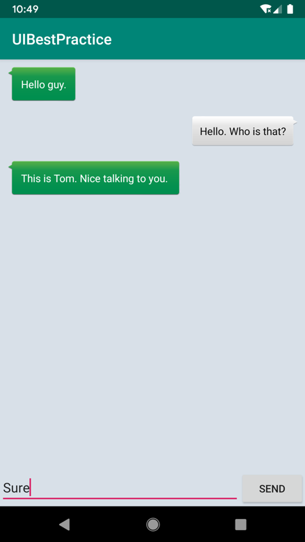

**图 4.45　精美的聊天界面**

相信这个例子的实战过程不仅加深了你对本章中所学 UI 知识的理解，还让你有了如何灵活运用这些知识来设计出优秀界面的思路。

## 4.8　Kotlin 课堂：延迟初始化和密封类

结束了干货满满的一整章，现在又来到最受期待的 Kotlin 课堂了。我之前说过，每章的 Kotlin 课堂都会结合当前章节的内容来拓展出 Kotlin 更多的使用技巧，那么本章可以拓展哪些知识点呢？这里我已经帮你安排好了，本节的 Kotlin 课堂，我们就来学习延迟初始化和密封类这两部分内容。

### 4.8.1　对变量延迟初始化

前面我们已经学习了 Kotlin 语言的许多特性，包括变量不可变，变量不可为空，等等。这些特性都是为了尽可能地保证程序安全而设计的，但是有些时候这些特性也会在编码时给我们带来不少的麻烦。

比如，如果你的类中存在很多全局变量实例，为了保证它们能够满足 Kotlin 的空指针检查语法标准，你不得不做许多的非空判断保护才行，即使你非常确定它们不会为空。

下面我们通过一个具体的例子来看一下吧，就使用刚刚的 UIBestPractice 项目来作为例子。如果你仔细观察 MainActivity 中的代码，会发现这里适配器的写法略微有点特殊：

```Kotlin
class MainActivity : AppCompatActivity(), View.OnClickListener {

    private var adapter: MsgAdapter? = null

    override fun onCreate(savedInstanceState: Bundle?) {
        ...
        adapter = MsgAdapter(msgList)
        ...
    }

    override fun onClick(v: View?) {
        ...
        adapter?.notifyItemInserted(msgList.size - 1)
        ...
    }

}
```

这里我们将 `adapter` 设置为了全局变量，但是它的初始化工作是在 `onCreate()` 方法中进行的，因此不得不先将 `adapter` 赋值为 `null`，同时把它的类型声明成 `MsgAdapter?`。

虽然我们会在 `onCreate()` 方法中对 `adapter` 进行初始化，同时能确保 `onClick()` 方法必然在 `onCreate()` 方法之后才会调用，但是我们在 `onClick()` 方法中调用 `adapter` 的任何方法时仍然要进行判空处理才行，否则编译肯定无法通过。

而当你的代码中有了越来越多的全局变量实例时，这个问题就会变得越来越明显，到时候你可能必须编写大量额外的判空处理代码，只是为了满足 Kotlin 编译器的要求。

幸运的是，这个问题其实是有解决办法的，而且非常简单，那就是对全局变量进行延迟初始化。

延迟初始化使用的是 `lateinit` 关键字，它可以告诉 Kotlin 编译器，我会在晚些时候对这个变量进行初始化，这样就不用在一开始的时候将它赋值为 `null` 了。

接下来我们就使用延迟初始化的方式对上述代码进行优化，如下所示：

```Kotlin
class MainActivity : AppCompatActivity(), View.OnClickListener {

    private lateinit var adapter: MsgAdapter

    override fun onCreate(savedInstanceState: Bundle?) {
        ...
        adapter = MsgAdapter(msgList)
        ...
    }

    override fun onClick(v: View?) {
        ...
        adapter.notifyItemInserted(msgList.size - 1)
        ...
    }

}
```

可以看到，我们在 `adapter` 变量的前面加上了 `lateinit` 关键字，这样就不用在一开始的时候将它赋值为 `null`，同时类型声明也就可以改成 `MsgAdapter` 了。由于 `MsgAdapter` 是不可为空的类型，所以我们在 `onClick()` 方法中也就不再需要进行判空处理，直接调用 `adapter` 的任何方法就可以了。

当然，使用 `lateinit` 关键字也不是没有任何风险，如果我们在 `adapter` 变量还没有初始化的情况下就直接使用它，那么程序就一定会崩溃，并且抛出一个 UninitializedPropertyAccessException 异常，如图 4.46 所示。


**图 4.46　抛出 UninitializedPropertyAccessException 异常**

所以，当你对一个全局变量使用了 `lateinit` 关键字时，请一定要确保它在被任何地方调用之前已经完成了初始化工作，否则 Kotlin 将无法保证程序的安全性。

另外，我们还可以通过代码来判断一个全局变量是否已经完成了初始化，这样在某些时候能够有效地避免重复对某一个变量进行初始化操作，示例代码如下：

```Kotlin
class MainActivity : AppCompatActivity(), View.OnClickListener {

    private lateinit var adapter: MsgAdapter

    override fun onCreate(savedInstanceState: Bundle?) {
        ...
        if (!::adapter.isInitialized) {
            adapter = MsgAdapter(msgList)
        }
        ...
    }

}
```

具体语法就是这样，`::adapter.isInitialized` 可用于判断 `adapter` 变量是否已经初始化。虽然语法看上去有点奇怪，但这是固定的写法。然后我们再对结果进行取反，如果还没有初始化，那么就立即对 `adapter` 变量进行初始化，否则什么都不用做。

以上就是关于延迟初始化的所有重要内容，剩下的就是在合理的地方使用它了，相信这对于你来说并不是什么难题。

### 4.8.2　使用密封类优化代码

由于密封类通常可以结合 RecyclerView 适配器中的 ViewHolder 一起使用，因此我们就正好借这个机会在本节学习一下它的用法。当然，密封类的使用场景远不止于此，它可以在很多时候帮助你写出更加规范和安全的代码，所以非常值得一学。

首先来了解一下密封类具体的作用，这里我们来看一个简单的例子。新建一个 Kotlin 文件，文件名就叫 Result.kt 好了，然后在这个文件中编写如下代码：

```Kotlin
interface Result
class Success(val msg: String) : Result
class Failure(val error: Exception) : Result
```

这里定义了一个 `Result` 接口，用于表示某个操作的执行结果，接口中不用编写任何内容。然后定义了两个类去实现 `Result` 接口：一个 `Success` 类用于表示成功时的结果，一个 `Failure` 类用于表示失败时的结果，这样就把准备工作做好了。

接下来再定义一个 `getResultMsg()` 方法，用于获取最终执行结果的信息，代码如下所示：

```Kotlin
fun getResultMsg(result: Result) = when (result) {
    is Success -> result.msg
    is Failure -> result.error.message
    else -> throw IllegalArgumentException()
}
```

`getResultMsg()` 方法中接收一个 `Result` 参数。我们通过 `when` 语句来判断：如果 `Result` 属于 `Success`，那么就返回成功的消息；如果 `Result` 属于 `Failure`，那么就返回错误信息。到目前为止，代码都是没有问题的，但比较让人讨厌的是，接下来我们不得不再编写一个 `else` 条件，否则 Kotlin 编译器会认为这里缺少条件分支，代码将无法编译通过。但实际上 `Result` 的执行结果只可能是 `Success` 或者 `Failure`，这个 `else` 条件是永远走不到的，所以我们在这里直接抛出了一个异常，只是为了满足 Kotlin 编译器的语法检查而已。

另外，编写 `else` 条件还有一个潜在的风险。如果我们现在新增了一个 `Unknown` 类并实现 `Result` 接口，用于表示未知的执行结果，但是忘记在 `getResultMsg()` 方法中添加相应的条件分支，编译器在这种情况下是不会提醒我们的，而是会在运行的时候进入 `else` 条件里面，从而抛出异常并导致程序崩溃。

当然，这种为了满足编译器的要求而编写无用条件分支的情况不仅在 Kotlin 当中存在，在 Java 或者是其他编程语言当中也普遍存在。

不过好消息是，Kotlin 的密封类可以很好地解决这个问题，下面我们就来学习一下。

密封类的关键字是 `sealed class`，它的用法同样非常简单，我们可以轻松地将 `Result` 接口改造成密封类的写法：

```Kotlin
sealed class Result
class Success(val msg: String) : Result()
class Failure(val error: Exception) : Result()
```

可以看到，代码并没有什么太大的变化，只是将 `interface` 关键字改成了 `sealed class`。另外，由于密封类是一个可继承的类，因此在继承它的时候需要在后面加上一对括号，这一点我们在第 2 章就学习过了。

那么改成密封类之后有什么好处呢？你会发现现在 `getResultMsg()` 方法中的 `else` 条件已经不再需要了，如下所示：

```Kotlin
fun getResultMsg(result: Result) = when (result) {
    is Success -> result.msg
    is Failure -> "Error is ${result.error.message}"
}
```

为什么这里去掉了 `else` 条件仍然能编译通过呢？这是因为当在 `when` 语句中传入一个密封类变量作为条件时，Kotlin 编译器会自动检查该密封类有哪些子类，并强制要求你将每一个子类所对应的条件全部处理。这样就可以保证，即使没有编写 `else` 条件，也不可能会出现漏写条件分支的情况。而如果我们现在新增一个 `Unknown` 类，并也让它继承自 `Result`，此时 `getResultMsg()` 方法就一定会报错，必须增加一个 `Unknown` 的条件分支才能让代码编译通过。

这就是密封类主要的作用和使用方法了。另外再多说一句，密封类及其所有子类只能定义在同一个文件的顶层位置，不能嵌套在其他类中，这是被密封类底层的实现机制所限制的。

了解了这么多关于密封类的知识，接下来我们看一下它该如何结合 `MsgAdapter` 中的 ViewHolder 一起使用，并顺便优化一下 `MsgAdapter` 中的代码。

观看 `MsgAdapter` 现在的代码，你会发现 `onBindViewHolder()` 方法中就存在一个没有实际作用的 `else` 条件，只是抛出了一个异常而已。对于这部分代码，我们就可以借助密封类的特性来进行优化。首先删除 MsgAdapter 中的 LeftViewHolder 和 RightViewHolder，然后新建一个 MsgViewHolder.kt 文件，在其中加入如下代码：

```Kotlin
sealed class MsgViewHolder(view: View) : RecyclerView.ViewHolder(view)

class LeftViewHolder(view: View) : MsgViewHolder(view) {
    val leftMsg: TextView = view.findViewById(R.id.leftMsg)
}

class RightViewHolder(view: View) : MsgViewHolder(view) {
    val rightMsg: TextView = view.findViewById(R.id.rightMsg)
}
```

这里我们定义了一个密封类 `MsgViewHolder`，并让它继承自 `RecyclerView.ViewHolder`，然后让 `LeftViewHolder` 和 `RightViewHolder` 继承自 `MsgViewHolder`。这样就相当于密封类 `MsgViewHolder` 只有两个已知子类，因此在 `when` 语句中只要处理这两种情况的条件分支即可。

现在修改 `MsgAdapter` 中的代码，如下所示：

```Kotlin
class MsgAdapter(val msgList: List<Msg>) : RecyclerView.Adapter<MsgViewHolder>() {

    ...

    override fun onBindViewHolder(holder: MsgViewHolder, position: Int) {
        val msg = msgList[position]
        when (holder) {
            is LeftViewHolder -> holder.leftMsg.text = msg.content
            is RightViewHolder -> holder.rightMsg.text = msg.content
         }
    }
    ...
}
```

这里我们将 `RecyclerView.Adapter` 的泛型指定成刚刚定义的密封类 `MsgViewHolder`，这样 `onBindViewHolder()` 方法传入的参数就变成了 `MsgViewHolder`。然后我们只要在 `when` 语句当中处理 `LeftViewHolder` 和 `RightViewHolder` 这两种情况就可以了，那个讨厌的 `else` 终于不再需要了，这种 RecyclerView 适配器的写法更加规范也更加推荐。

通过本次 Kotlin 课堂的学习，UIBestPractice 项目中的代码现在变得更加完善了。这一章你也学到了不少东西，让我们来总结一下吧。

## 4.9　小结与点评

虽然本章的内容很多，但我觉得学习起来应该还是挺愉快的吧。不同于上一章中我们来来回回使用那几个按钮，本章可以说是使用了各种各样的控件，制作出了丰富多彩的界面。尤其是在最佳实践环节，编写出了那么精美的聊天界面，你的满足感应该比上一章还要强吧？

本章从 Android 中的一些常见控件入手，依次介绍了基本布局的用法、自定义控件的方法、ListView 的详细用法以及 RecyclerView 的使用，基本已经将重要的 UI 知识点全部覆盖了。另外在最后的 Kotlin 课堂中，我们还学习了延迟初始化和密封类的用法，并借助它们进一步完善了最佳实践环节的代码，结合实例来学习，相信你已经将这些知识点掌握得非常牢固了。

不过到目前为止，我们还只是学习了 Android 手机方面的开发技巧，下一章将会涉及一些 Android 平板方面的知识点，能够同时兼容手机和平板也是自 Android 4.0 系统开始就支持的特性。适当地放松和休息一段时间后，我们再来继续前行吧！