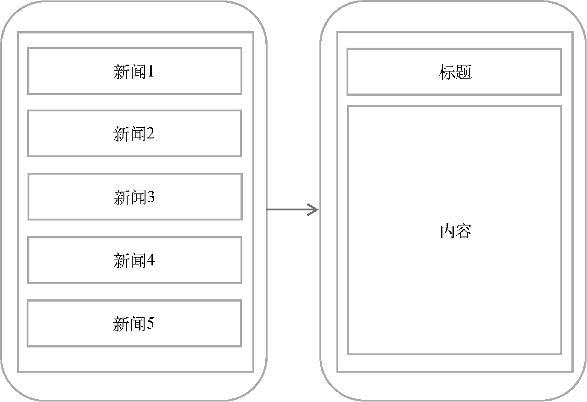
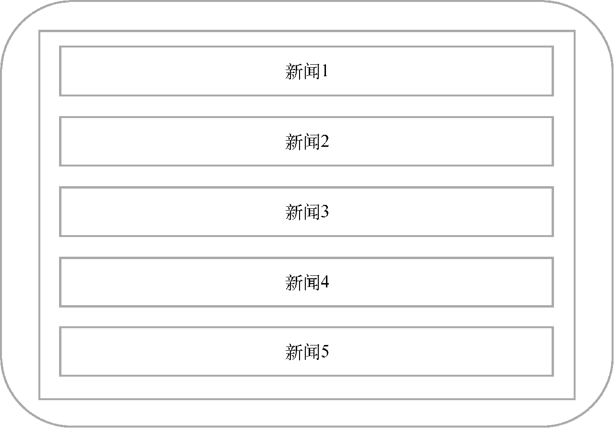
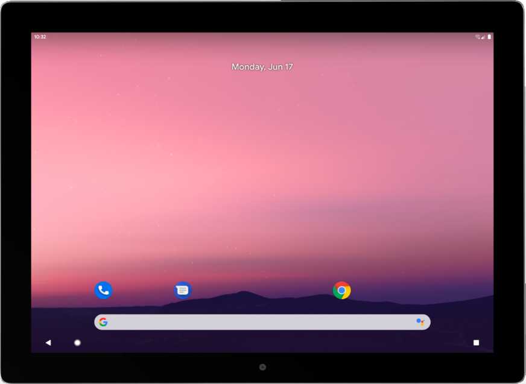
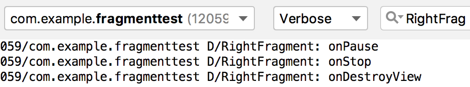
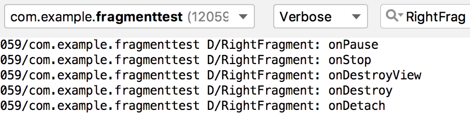
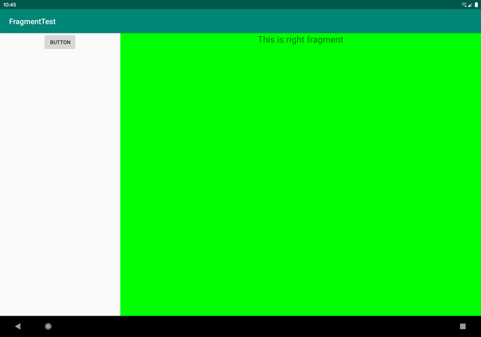
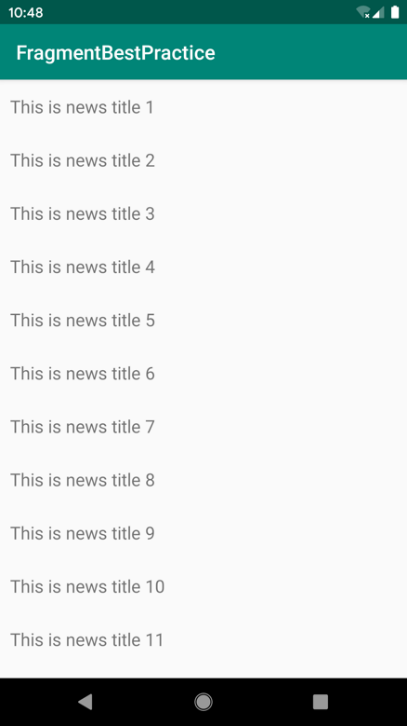
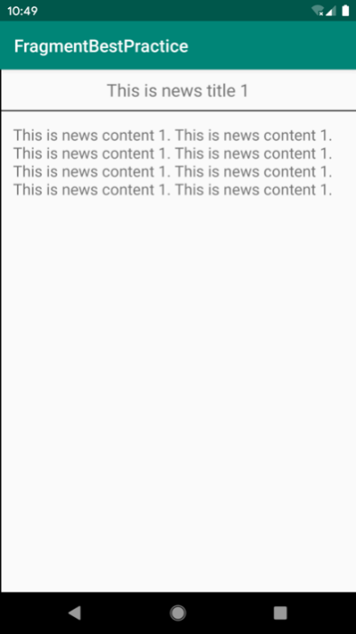
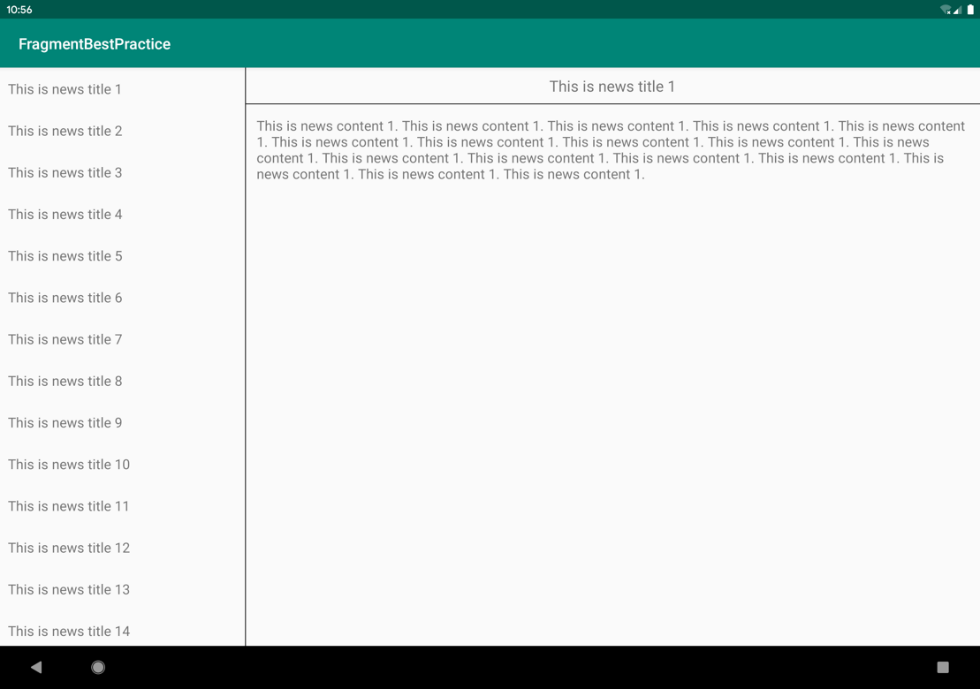

# 第 5 章　手机平板要兼顾，探究 Fragment

当今是移动设备发展非常迅速的时代，不仅手机已经成为了生活必需品，而且平板也变得越来越普及。平板和手机最大的区别就在于屏幕的大小：一般手机屏幕的大小在 3 英寸到 6 英寸之间，平板屏幕的大小在 7 英寸到 10 英寸之间。屏幕大小差距过大有可能会让同样的界面在视觉效果上有较大的差异，比如一些界面在手机上看起来非常美观，但在平板上看起来可能会有控件被过分拉长、元素之间空隙过大等情况。

对于一名专业的 Android 开发人员而言，能够兼顾手机和平板的开发是我们尽可能要做到的事情。Android 自 3.0 版本开始引入了 Fragment 的概念，它可以让界面在平板上更好地展示，下面我们就一起来学习一下。

## 5.1　Fragment 是什么

Fragment 是一种可以嵌入在 Activity 当中的 UI 片段，它能让程序更加合理和充分地利用大屏幕的空间，因而在平板上应用得非常广泛。虽然 Fragment 对你来说是个全新的概念，但我相信你学习起来应该毫不费力，因为它和 Activity 实在是太像了，同样都能包含布局，同样都有自己的生命周期。你甚至可以将 Fragment 理解成一个迷你型的 Activity，虽然这个迷你型的 Activity 有可能和普通的 Activity 是一样大的。

那么究竟要如何使用 Fragment 才能充分地利用平板屏幕的空间呢？想象我们正在开发一个新闻应用，其中一个界面使用 RecyclerView 展示了一组新闻的标题，当点击其中一个标题时，就打开另一个界面显示新闻的详细内容。如果是在手机中设计，我们可以将新闻标题列表放在一个 Activity 中，将新闻的详细内容放在另一个 Activity 中，如图 5.1 所示。



**图 5.1　手机的设计方案**

可是如果在平板上也这么设计，那么新闻标题列表将会被拉长至填充满整个平板的屏幕，而新闻的标题一般不会太长，这样将会导致界面上有大量的空白区域，如图 5.2 所示。



**图 5.2　平板的新闻列表**

因此，更好的设计方案是将新闻标题列表界面和新闻详细内容界面分别放在两个 Fragment 中，然后在同一个 Activity 里引入这两个 Fragment，这样就可以将屏幕空间充分地利用起来了，如图 5.3 所示。


**图 5.3　平板的双页设计**

## 5.2　Fragment 的使用方式

介绍了这么多抽象的东西，是时候学习一下 Fragment 的具体用法了。首先我们要创建一个平板模拟器，创建模拟器的方法在第 1 章中已经学过了，这里就不再赘述。这次我们选择创建一个 Pixel C 平板模拟器，创建完成后启动模拟器，效果如图 5.4 所示。



**图 5.4　平板模拟器的运行效果**

好了，准备工作都完成了，接着新建一个 FragmentTest 项目，然后开始我们的 Fragment 探索之旅吧。

### 5.2.1　Fragment 的简单用法

这里我们准备先写一个最简单的 Fragment 示例来练练手。在一个 Activity 当中添加两个 Fragment，并让这两个 Fragment 平分 Activity 的空间。

新建一个左侧 Fragment 的布局 left_fragment.xml，代码如下所示：

```xml
<LinearLayout xmlns:android="http://schemas.android.com/apk/res/android"
    android:orientation="vertical"
    android:layout_width="match_parent"
    android:layout_height="match_parent">

    <Button
        android:id="@+id/button"
        android:layout_width="wrap_content"
        android:layout_height="wrap_content"
        android:layout_gravity="center_horizontal"
        android:text="Button"
        />

</LinearLayout>
```

这个布局非常简单，只放置了一个按钮，并让它水平居中显示。

然后新建右侧 Fragment 的布局 right_fragment.xml，代码如下所示：

```xml
<LinearLayout xmlns:android="http://schemas.android.com/apk/res/android"
    android:orientation="vertical"
    android:background="#00ff00"
    android:layout_width="match_parent"
    android:layout_height="match_parent">

    <TextView
        android:layout_width="wrap_content"
        android:layout_height="wrap_content"
        android:layout_gravity="center_horizontal"
        android:textSize="24sp"
        android:text="This is right fragment"
        />

</LinearLayout>
```

可以看到，我们将这个布局的背景色设置成了绿色，并放置了一个 TextView 用于显示一段文本。

接着新建一个 `LeftFragment` 类，并让它继承自 Fragment。注意，这里可能会有两个不同包下的 Fragment 供你选择：一个是系统内置的 android.app.Fragment，一个是 AndroidX 库中的 androidx.fragment.app.Fragment。这里请一定要使用 AndroidX 库中的 Fragment，因为它可以让 Fragment 的特性在所有 Android 系统版本中保持一致，而系统内置的 Fragment 在 Android 9.0 版本中已被废弃。使用 AndroidX 库中的 Fragment 并不需要在 build.gradle 文件中添加额外的依赖，只要你在创建新项目时勾选了 Use androidx.\* artifacts 选项，Android Studio 会自动帮你导入必要的 AndroidX 库。

现在编写一下 `LeftFragment` 中的代码，如下所示：

```Kotlin
class LeftFragment : Fragment() {

    override fun onCreateView(inflater: LayoutInflater, container: ViewGroup?,
            savedInstanceState: Bundle?): View? {
        return inflater.inflate(R.layout.left_fragment, container, false)
    }

}
```

这里仅仅是重写了 Fragment 的 `onCreateView()` 方法，然后在这个方法中通过 LayoutInflater 的 `inflate()` 方法将刚才定义的 left_fragment 布局动态加载进来，整个方法简单明了。接着我们用同样的方法再新建一个 `RightFragment`，代码如下所示：

```Kotlin
class RightFragment : Fragment() {

    override fun onCreateView(inflater: LayoutInflater, container: ViewGroup?,
            savedInstanceState: Bundle?): View? {
        return inflater.inflate(R.layout.right_fragment, container, false)
    }

}
```

代码基本上是相同的，相信已经没有必要再做什么解释了。接下来修改 activity_main.xml 中的代码，如下所示：

```xml
<LinearLayout xmlns:android="http://schemas.android.com/apk/res/android"
    android:orientation="horizontal"
    android:layout_width="match_parent"
    android:layout_height="match_parent" >

    <fragment
        android:id="@+id/leftFrag"
        android:name="com.example.fragmenttest.LeftFragment"
        android:layout_width="0dp"
        android:layout_height="match_parent"
        android:layout_weight="1" />

    <fragment
        android:id="@+id/rightFrag"
        android:name="com.example.fragmenttest.RightFragment"
        android:layout_width="0dp"
        android:layout_height="match_parent"
        android:layout_weight="1" />

</LinearLayout>
```

可以看到，我们使用了 `<fragment>` 标签在布局中添加 Fragment，其中指定的大多数属性你已经非常熟悉了，只不过这里还需要通过 `android:name` 属性来显式声明要添加的 Fragment 类名，注意一定要将类的包名也加上。

这样最简单的 Fragment 示例就已经写好了，现在运行一下程序，效果如图 5.5 所示。


**图 5.5　Fragment 的简单运行效果**

正如我们预期的一样，两个 Fragment 平分了整个 Activity 的布局。不过这个例子实在是太简单了，在真正的项目中很难有什么实际的作用，因此下面我们马上来看一看，关于 Fragment 更加高级的使用技巧。

### 5.2.2　动态添加 Fragment

在上一节当中，你已经学会了在布局文件中添加 Fragment 的方法，不过 Fragment 真正的强大之处在于，它可以在程序运行时动态地添加到 Activity 当中。根据具体情况来动态地添加 Fragment，你就可以将程序界面定制得更加多样化。

我们在上一节代码的基础上继续完善，新建 another_right_fragment.xml，代码如下所示：

```xml
<LinearLayout xmlns:android="http://schemas.android.com/apk/res/android"
    android:orientation="vertical"
    android:background="#ffff00"
    android:layout_width="match_parent"
    android:layout_height="match_parent">

    <TextView
        android:layout_width="wrap_content"
        android:layout_height="wrap_content"
        android:layout_gravity="center_horizontal"
        android:textSize="24sp"
        android:text="This is another right fragment"
        />

</LinearLayout>
```

这个布局文件的代码和 right_fragment.xml 中的代码基本相同，只是将背景色改成了黄色，并将显示的文字改了改。然后新建 `AnotherRightFragment` 作为另一个右侧 Fragment，代码如下所示：

```Kotlin
class AnotherRightFragment : Fragment() {

    override fun onCreateView(inflater: LayoutInflater, container: ViewGroup?,
            savedInstanceState: Bundle?): View? {
        return inflater.inflate(R.layout.another_right_fragment, container, false)
    }

}
```

代码同样非常简单，在 `onCreateView()` 方法中加载了刚刚创建的 another_right_fragment 布局。这样我们就准备好了另一个 Fragment，接下来看一下如何将它动态地添加到 Activity 当中。修改 activity_main.xml，代码如下所示：

```xml
<LinearLayout xmlns:android="http://schemas.android.com/apk/res/android"
    android:orientation="horizontal"
    android:layout_width="match_parent"
    android:layout_height="match_parent" >

    <fragment
        android:id="@+id/leftFrag"
        android:name="com.example.fragmenttest.LeftFragment"
        android:layout_width="0dp"
        android:layout_height="match_parent"
        android:layout_weight="1" />

    <FrameLayout
        android:id="@+id/rightLayout"
        android:layout_width="0dp"
        android:layout_height="match_parent"
        android:layout_weight="1" >
    </FrameLayout>

</LinearLayout>
```

可以看到，现在将右侧 Fragment 替换成了一个 FrameLayout。还记得这个布局吗？在上一章中我们学过，这是 Android 中最简单的一种布局，所有的控件默认都会摆放在布局的左上角。由于这里仅需要在布局里放入一个 Fragment，不需要任何定位，因此非常适合使用 FrameLayout。

下面我们将在代码中向 FrameLayout 里添加内容，从而实现动态添加 Fragment 的功能。修改 MainActivity 中的代码，如下所示：

```Kotlin
class MainActivity : AppCompatActivity() {

    override fun onCreate(savedInstanceState: Bundle?) {
        super.onCreate(savedInstanceState)
        setContentView(R.layout.activity_main)
        button.setOnClickListener {
            replaceFragment(AnotherRightFragment())
        }
        replaceFragment(RightFragment())
    }

    private fun replaceFragment(fragment: Fragment) {
        val fragmentManager = supportFragmentManager
        val transaction = fragmentManager.beginTransaction()
        transaction.replace(R.id.rightLayout, fragment)
        transaction.commit()
    }

}
```

可以看到，首先我们给左侧 Fragment 中的按钮注册了一个点击事件，然后调用 `replaceFragment()` 方法动态添加了 RightFragment。当点击左侧 Fragment 中的按钮时，又会调用 `replaceFragment()` 方法，将右侧 Fragment 替换成 AnotherRightFragment。结合 `replaceFragment()` 方法中的代码可以看出，动态添加 Fragment 主要分为 5 步。

\(1\) 创建待添加 Fragment 的实例。

\(2\) 获取 FragmentManager，在 Activity 中可以直接调用 `getSupportFragmentManager()` 方法获取。

\(3\) 开启一个事务，通过调用 `beginTransaction()` 方法开启。

\(4\) 向容器内添加或替换 Fragment，一般使用 `replace()` 方法实现，需要传入容器的 id 和待添加的 Fragment 实例。

\(5\) 提交事务，调用 `commit()` 方法来完成。

这样就完成了在 Activity 中动态添加 Fragment 的功能，重新运行程序，可以看到和之前相同的界面，然后点击一下按钮，效果如图 5.6 所示。


**图 5.6　动态添加 Fragment 的效果**

### 5.2.3　在 Fragment 中实现返回栈

在上一小节中，我们成功实现了向 Activity 中动态添加 Fragment 的功能。不过你尝试一下就会发现，通过点击按钮添加了一个 Fragment 之后，这时按下 Back 键程序就会直接退出。如果我们想实现类似于返回栈的效果，按下 Back 键可以回到上一个 Fragment，该如何实现呢？

其实很简单，FragmentTransaction 中提供了一个 `addToBackStack()` 方法，可以用于将一个事务添加到返回栈中。修改 MainActivity 中的代码，如下所示：

```Kotlin
class MainActivity : AppCompatActivity() {

    ...

    private fun replaceFragment(fragment: Fragment) {
        val fragmentManager = supportFragmentManager
        val transaction = fragmentManager.beginTransaction()
        transaction.replace(R.id.rightLayout, fragment)
        transaction.addToBackStack(null)
        transaction.commit()
    }

}
```

这里我们在事务提交之前调用了 FragmentTransaction 的 `addToBackStack()` 方法，它可以接收一个名字用于描述返回栈的状态，一般传入 `null` 即可。现在重新运行程序，并点击按钮将 AnotherRightFragment 添加到 Activity 中，然后按下 Back 键，你会发现程序并没有退出，而是回到了 RightFragment 界面。继续按下 Back 键，RightFragment 界面也会消失，再次按下 Back 键，程序才会退出。

### 5.2.4　Fragment 和 Activity 之间的交互

虽然 Fragment 是嵌入在 Activity 中显示的，可是它们的关系并没有那么亲密。实际上，Fragment 和 Activity 是各自存在于一个独立的类当中的，它们之间并没有那么明显的方式来直接进行交互。如果想要在 Activity 中调用 Fragment 里的方法，或者在 Fragment 中调用 Activity 里的方法，应该如何实现呢？

为了方便 Fragment 和 Activity 之间进行交互，FragmentManager 提供了一个类似于 `findViewById()` 的方法，专门用于从布局文件中获取 Fragment 的实例，代码如下所示：

```Kotlin
val fragment = supportFragmentManager.findFragmentById(R.id.leftFrag) as LeftFragment
```

调用 FragmentManager 的 `findFragmentById()` 方法，可以在 Activity 中得到相应 Fragment 的实例，然后就能轻松地调用 Fragment 里的方法了。

另外，类似于 `findViewById()` 方法，kotlin-android-extensions 插件也对 `findFragmentById()` 方法进行了扩展，允许我们直接使用布局文件中定义的 Fragment id 名称来自动获取相应的 Fragment 实例，如下所示：

```Kotlin
val fragment = leftFrag as LeftFragment
```

那么毫无疑问，第二种写法是我们现在更加推荐的写法。

掌握了如何在 Activity 中调用 Fragment 里的方法，那么在 Fragment 中又该怎样调用 Activity 里的方法呢？这就更简单了，在每个 Fragment 中都可以通过调用 `getActivity()` 方法来得到和当前 Fragment 相关联的 Activity 实例，代码如下所示：

```Kotlin
if (activity != null) {
    val mainActivity = activity as MainActivity
}
```

这里由于 `getActivity()` 方法有可能返回 `null`，因此我们需要先进行一个判空处理。有了 Activity 的实例，在 Fragment 中调用 Activity 里的方法就变得轻而易举了。另外当 Fragment 中需要使用 `Context` 对象时，也可以使用 `getActivity()` 方法，因为获取到的 Activity 本身就是一个 `Context` 对象。

这时不知道你心中会不会产生一个疑问：既然 Fragment 和 Activity 之间的通信问题已经解决了，那么不同的 Fragment 之间可不可以进行通信呢？

说实在的，这个问题并没有看上去那么复杂，它的基本思路非常简单：首先在一个 Fragment 中可以得到与它相关联的 Activity，然后再通过这个 Activity 去获取另外一个 Fragment 的实例，这样就实现了不同 Fragment 之间的通信功能。因此，这里我们的回答是肯定的。

## 5.3　Fragment 的生命周期

和 Activity 一样，Fragment 也有自己的生命周期，并且它和 Activity 的生命周期实在是太像了，我相信你很快就能学会，下面我们马上就来看一下。

### 5.3.1　Fragment 的状态和回调

还记得每个 Activity 在其生命周期内可能会有哪几种状态吗？没错，一共有运行状态、暂停状态、停止状态和销毁状态这 4 种。类似地，每个 Fragment 在其生命周期内也可能会经历这几种状态，只不过在一些细小的地方会有部分区别。

1. **运行状态**

   当一个 Fragment 所关联的 Activity 正处于运行状态时，该 Fragment 也处于运行状态。
2. **暂停状态**

   当一个 Activity 进入暂停状态时（由于另一个未占满屏幕的 Activity 被添加到了栈顶），与它相关联的 Fragment 就会进入暂停状态。
3. **停止状态**

   当一个 Activity 进入停止状态时，与它相关联的 Fragment 就会进入停止状态，或者通过调用 FragmentTransaction 的 `remove()`、`replace()` 方法将 Fragment 从 Activity 中移除，但在事务提交之前调用了 `addToBackStack()` 方法，这时的 Fragment 也会进入停止状态。总的来说，进入停止状态的 Fragment 对用户来说是完全不可见的，有可能会被系统回收。
4. **销毁状态**

   Fragment 总是依附于 Activity 而存在，因此当 Activity 被销毁时，与它相关联的 Fragment 就会进入销毁状态。或者通过调用 FragmentTransaction 的 `remove()`、`replace()` 方法将 Fragment 从 Activity 中移除，但在事务提交之前并没有调用 `addToBackStack()` 方法，这时的 Fragment 也会进入销毁状态。

结合之前的 Activity 状态，相信你理解起来应该毫不费力吧。同样地，Fragment 类中也提供了一系列的回调方法，以覆盖它生命周期的每个环节。其中，Activity 中有的回调方法，Fragment 中基本上也有，不过 Fragment 还提供了一些附加的回调方法，下面我们就重点看一下这几个回调。

- `onAttach()`：当 Fragment 和 Activity 建立关联时调用。
- `onCreateView()`：为 Fragment 创建视图（加载布局）时调用。
- `onActivityCreated()`：确保与 Fragment 相关联的 Activity 已经创建完毕时调用。
- `onDestroyView()`：当与 Fragment 关联的视图被移除时调用。
- `onDetach()`：当 Fragment 和 Activity 解除关联时调用。

Fragment 完整的生命周期可参考图 5.7（图片源自 Android 官网）。


**图 5.7　Fragment 的生命周期**

### 5.3.2　体验 Fragment 的生命周期

为了让你能够更加直观地体验 Fragment 的生命周期，我们还是通过一个例子来实践一下。例子很简单，仍然是在 FragmentTest 项目的基础上改动的。

修改 RightFragment 中的代码，如下所示：

```Kotlin
class RightFragment : Fragment() {

    companion object {
        const val TAG = "RightFragment"
    }

    override fun onAttach(context: Context) {
        super.onAttach(context)
        Log.d(TAG, "onAttach")
    }

    override fun onCreate(savedInstanceState: Bundle?) {
        super.onCreate(savedInstanceState)
        Log.d(TAG, "onCreate")
    }

    override fun onCreateView(inflater: LayoutInflater, container: ViewGroup?,
             savedInstanceState: Bundle?): View? {
        Log.d(TAG, "onCreateView")
        return inflater.inflate(R.layout.right_fragment, container, false)
    }

    override fun onActivityCreated(savedInstanceState: Bundle?) {
        super.onActivityCreated(savedInstanceState)
        Log.d(TAG, "onActivityCreated")
    }

    override fun onStart() {
        super.onStart()
        Log.d(TAG, "onStart")
    }

    override fun onResume() {
        super.onResume()
        Log.d(TAG, "onResume")
    }

    override fun onPause() {
        super.onPause()
        Log.d(TAG, "onPause")
    }

    override fun onStop() {
        super.onStop()
        Log.d(TAG, "onStop")
    }

    override fun onDestroyView() {
        super.onDestroyView()
        Log.d(TAG, "onDestroyView")
    }

    override fun onDestroy() {
        super.onDestroy()
        Log.d(TAG, "onDestroy")
    }

    override fun onDetach() {
        super.onDetach()
        Log.d(TAG, "onDetach")
    }

}
```

注意，这里为了方便日志打印，我们先定义了一个 `TAG` 常量。Kotlin 中定义常量都是使用的这种方式，在 companion object、单例类或顶层作用域中使用 `const` 关键字声明一个变量即可。

接下来，我们在 RightFragment 中的每一个回调方法里都加入了打印日志的代码，然后重新运行程序。这时观察 Logcat 中的打印信息，如图 5.8 所示。


**图 5.8　启动程序时的打印日志**

可以看到，当 RightFragment 第一次被加载到屏幕上时，会依次执行 `onAttach()`、`onCreate()`、`onCreateView()`、`onActivityCreated()`、`onStart()` 和 `onResume()` 方法。然后点击 LeftFragment 中的按钮，此时打印信息如图 5.9 所示。



**图 5.9　替换成 AnotherRightFragment 时的打印日志**

由于 AnotherRightFragment 替换了 RightFragment，此时的 RightFragment 进入了停止状态，因此 `onPause()`、`onStop()` 和 `onDestroyView()` 方法会得到执行。当然，如果在替换的时候没有调用 `addToBackStack()` 方法，此时的 RightFragment 就会进入销毁状态，`onDestroy()` 和 `onDetach()` 方法就会得到执行。

接着按下 Back 键，RightFragment 会重新回到屏幕，打印信息如图 5.10 所示。


**图 5.10　返回 RightFragment 时的打印日志**

由于 RightFragment 重新回到了运行状态，因此 `onCreateView()`、`onActivityCreated()`、`onStart()` 和 `onResume()` 方法会得到执行。注意，此时 `onCreate()` 方法并不会执行，因为我们借助了 `addToBackStack()` 方法使得 RightFragment 并没有被销毁。

现在再次按下 Back 键，打印信息如图 5.11 所示。



**图 5.11　退出程序时的打印日志**

依次执行 `onPause()`、`onStop()`、`onDestroyView()`、`onDestroy()` 和 `onDetach()` 方法，最终将 Fragment 销毁。现在，你体验了一遍 Fragment 完整的生命周期，是不是理解得更加深刻了？

另外值得一提的是，在 Fragment 中你也可以通过 `onSaveInstanceState()` 方法来保存数据，因为进入停止状态的 Fragment 有可能在系统内存不足的时候被回收。保存下来的数据在 `onCreate()`、`onCreateView()` 和 `onActivityCreated()` 这 3 个方法中你都可以重新得到，它们都含有一个 Bundle 类型的 `savedInstanceState` 参数。具体的代码我就不在这里展示了，如果你忘记了该如何编写，可以参考 3.4.5 小节。

## 5.4　动态加载布局的技巧

虽然动态添加 Fragment 的功能很强大，可以解决很多实际开发中的问题，但是它毕竟只是在一个布局文件中进行一些添加和替换操作。如果程序能够根据设备的分辨率或屏幕大小，在运行时决定加载哪个布局，那我们可发挥的空间就更多了。因此本节我们就来探讨一下 Android 中动态加载布局的技巧。

### 5.4.1　使用限定符

如果你经常使用平板，应该会发现很多平板应用采用的是双页模式（程序会在左侧的面板上显示一个包含子项的列表，在右侧的面板上显示内容），因为平板的屏幕足够大，完全可以同时显示两页的内容，但手机的屏幕就只能显示一页的内容，因此两个页面需要分开显示。

那么怎样才能在运行时判断程序应该是使用双页模式还是单页模式呢？这就需要借助限定符（qualifier）来实现了。下面我们通过一个例子来学习一下它的用法，修改 FragmentTest 项目中的 activity_main.xml 文件，代码如下所示：

```xml
<LinearLayout xmlns:android="http://schemas.android.com/apk/res/android"
    android:orientation="horizontal"
    android:layout_width="match_parent"
    android:layout_height="match_parent" >

    <fragment
        android:id="@+id/leftFrag"
        android:name="com.example.fragmenttest.LeftFragment"
        android:layout_width="match_parent"
        android:layout_height="match_parent"/>

</LinearLayout>
```

这里将多余的代码删掉，只留下一个左侧 Fragment，并让它充满整个父布局。接着在 res 目录下新建 layout-large 文件夹，在这个文件夹下新建一个布局，也叫作 activity_main.xml，代码如下所示：

```xml
<LinearLayout xmlns:android="http://schemas.android.com/apk/res/android"
    android:orientation="horizontal"
    android:layout_width="match_parent"
    android:layout_height="match_parent">

    <fragment
        android:id="@+id/leftFrag"
        android:name="com.example.fragmenttest.LeftFragment"
        android:layout_width="0dp"
        android:layout_height="match_parent"
        android:layout_weight="1" />

    <fragment
        android:id="@+id/rightFrag"
        android:name="com.example.fragmenttest.RightFragment"
        android:layout_width="0dp"
        android:layout_height="match_parent"
        android:layout_weight="3" />

</LinearLayout>
```

可以看到，layout/activity_main 布局只包含了一个 Fragment，即单页模式，而 layout-large/ activity_main 布局包含了两个 Fragment，即双页模式。其中，`large` 就是一个限定符，那些屏幕被认为是 large 的设备就会自动加载 layout-large 文件夹下的布局，小屏幕的设备则还是会加载 layout 文件夹下的布局。

然后将 MainActivity 中 `replaceFragment()` 方法里的代码注释掉，并在平板模拟器上重新运行程序，效果如图 5.12 所示。



**图 5.12　双页模式运行效果**

再启动一个手机模拟器，并重新运行程序，效果如图 5.13 所示。


**图 5.13　单页模式运行效果**

这样我们就实现了在程序运行时动态加载布局的功能。

Android 中一些常见的限定符可以如表 5.1 所示。

**表 5.1　Android 中常见的限定符**

||||
| --------| ------| -----------------------------------------------|
|屏幕特征|限定符|描述|
|大小|`small`|提供给小屏幕设备的资源|
||`normal`|提供给中等屏幕设备的资源|
||`large`|提供给大屏幕设备的资源|
||`xlarge`|提供给超大屏幕设备的资源|
|分辨率|`ldpi`|提供给低分辨率设备的资源（120 dpi 以下）|
||`mdpi`|提供给中等分辨率设备的资源（120 dpi~160 dpi）|
||`hdpi`|提供给高分辨率设备的资源（160 dpi~240 dpi）|
||`xhdpi`|提供给超高分辨率设备的资源（240 dpi~320 dpi）|
||`xxhdpi`|提供给超超高分辨率设备的资源（320 dpi~480 dpi）|
|方向|`land`|提供给横屏设备的资源|
||`port`|提供给竖屏设备的资源|

### 5.4.2　使用最小宽度限定符

在上一小节中我们使用 `large` 限定符成功解决了单页双页的判断问题，不过很快又有一个新的问题出现了：large 到底是指多大呢？有时候我们希望可以更加灵活地为不同设备加载布局，不管它们是不是被系统认定为 large，这时就可以使用最小宽度限定符（smallest-width qualifier）。

最小宽度限定符允许我们对屏幕的宽度指定一个最小值（以 dp 为单位），然后以这个最小值为临界点，屏幕宽度大于这个值的设备就加载一个布局，屏幕宽度小于这个值的设备就加载另一个布局。

在 res 目录下新建 layout-sw600dp 文件夹，然后在这个文件夹下新建 activity_main.xml 布局，代码如下所示：

```xml
<LinearLayout xmlns:android="http://schemas.android.com/apk/res/android"
    android:orientation="horizontal"
    android:layout_width="match_parent"
    android:layout_height="match_parent">

    <fragment
        android:id="@+id/leftFrag"
        android:name="com.example.fragmenttest.LeftFragment"
        android:layout_width="0dp"
        android:layout_height="match_parent"
        android:layout_weight="1" />

    <fragment
        android:id="@+id/rightFrag"
        android:name="com.example.fragmenttest.RightFragment"
        android:layout_width="0dp"
        android:layout_height="match_parent"
        android:layout_weight="3" />

</LinearLayout>
```

这就意味着，当程序运行在屏幕宽度大于等于 600 dp 的设备上时，会加载 layout-sw600dp/activity_main 布局，当程序运行在屏幕宽度小于 600 dp 的设备上时，则仍然加载默认的 layout/activity_main 布局。

## 5.5　Fragment 的最佳实践：一个简易版的新闻应用

现在你已经将关于 Fragment 的重要知识点掌握得差不多了，不过在灵活运用方面可能还有些欠缺，因此下面该进入我们本章的最佳实践环节了。

前面提到过，Fragment 很多时候是在平板开发当中使用的，因为它可以解决屏幕空间不能充分利用的问题。那是不是就表明，我们开发的程序都需要提供一个手机版和一个平板版呢？确实有不少公司是这么做的，但是这样会耗费很多的人力物力财力。因为维护两个版本的代码成本很高：每当增加新功能时，需要在两份代码里各写一遍；每当发现一个 bug 时，需要在两份代码里各修改一次。因此，今天我们最佳实践的内容就是教你如何编写兼容手机和平板的应用程序。

还记得我们在本章开始的时候提到的一个新闻应用吗？现在我们就运用本章所学的知识来编写一个简易版的新闻应用，并且要求它可以兼容手机和平板。新建好一个 FragmentBestPractice 项目，然后开始动手吧！

由于待会在编写新闻列表时会使用到 RecyclerView，因此首先需要在 app/build.gradle 当中添加依赖库，如下所示：

```gradle
dependencies {
    implementation fileTree(dir: 'libs', include: ['*.jar'])
    implementation"org.jetbrains.kotlin:kotlin-stdlib-jdk7:$kotlin_version"
    implementation 'androidx.appcompat:appcompat:1.0.2'
    implementation 'androidx.core:core-ktx:1.0.2'
    implementation 'androidx.recyclerview:recyclerview:1.0.0'
    implementation 'androidx.constraintlayout:constraintlayout:1.1.3'
    testImplementation 'junit:junit:4.12'
    androidTestImplementation 'androidx.test:runner:1.1.1'
    androidTestImplementation 'androidx.test.espresso:espresso-core:3.1.1'
}
```

接下来我们要准备好一个新闻的实体类，新建类 `News`，代码如下所示：

```Kotlin
class News(val title: String, val content: String)
```

`News` 类的代码非常简单，`title` 字段表示新闻标题，`content` 字段表示新闻内容。接着新建布局文件 news_content_frag.xml，作为新闻内容的布局：

```xml
<RelativeLayout xmlns:android="http://schemas.android.com/apk/res/android"
    android:layout_width="match_parent"
    android:layout_height="match_parent">

    <LinearLayout
        android:id="@+id/contentLayout"
        android:layout_width="match_parent"
        android:layout_height="match_parent"
        android:orientation="vertical"
        android:visibility="invisible" >

        <TextView
            android:id="@+id/newsTitle"
            android:layout_width="match_parent"
            android:layout_height="wrap_content"
            android:gravity="center"
            android:padding="10dp"
            android:textSize="20sp" />

        <View
            android:layout_width="match_parent"
            android:layout_height="1dp"
            android:background="#000" />

        <TextView
            android:id="@+id/newsContent"
            android:layout_width="match_parent"
            android:layout_height="0dp"
            android:layout_weight="1"
            android:padding="15dp"
            android:textSize="18sp" />

    </LinearLayout>

    <View
        android:layout_width="1dp"
        android:layout_height="match_parent"
        android:layout_alignParentLeft="true"
        android:background="#000" />

</RelativeLayout>
```

新闻内容的布局主要可以分为两个部分：头部部分显示新闻标题，正文部分显示新闻内容，中间使用一条水平方向的细线分隔开。除此之外，这里还使用了一条垂直方向的细线，它的作用是在双页模式时将左侧的新闻列表和右侧的新闻内容分隔开。细线是利用 View 来实现的，将 View 的宽或高设置为 1 dp，再通过 `background` 属性给细线设置一下颜色就可以了，这里我们把细线设置成黑色。

另外，我们还要将新闻内容的布局设置成不可见。因为在双页模式下，如果还没有选中新闻列表中的任何一条新闻，是不应该显示新闻内容布局的。

接下来新建一个 `NewsContentFragment` 类，继承自 Fragment，代码如下所示：

```Kotlin
class NewsContentFragment : Fragment() {

    override fun onCreateView(inflater: LayoutInflater, container: ViewGroup?,
            savedInstanceState: Bundle?): View? {
        return inflater.inflate(R.layout.news_content_frag, container, false)
    }

    fun refresh(title: String, content: String) {
        contentLayout.visibility = View.VISIBLE
        newsTitle.text = title // 刷新新闻的标题
        newsContent.text = content // 刷新新闻的内容
    }

}
```

这里首先在 `onCreateView()` 方法中加载了我们刚刚创建的 news_content_frag 布局，这个没什么好解释的。接下来又提供了一个 `refresh()` 方法，用于将新闻的标题和内容显示在我们刚刚定义的界面上。注意，当调用了 `refresh()` 方法时，需要将我们刚才隐藏的新闻内容布局设置成可见。

这样我们就把新闻内容的 Fragment 和布局都创建好了，但是它们都是在双页模式中使用的，如果想在单页模式中使用的话，我们还需要再创建一个 Activity。右击 com.example.fragmentbestpractice 包 →New→Activity→Empty Activity，新建一个 NewsContentActivity，布局名就使用默认的 activity_news_content 即可。然后修改 activity_news_content.xml 中的代码，如下所示：

```xml
<LinearLayout xmlns:android="http://schemas.android.com/apk/res/android"
    android:orientation="vertical"
    android:layout_width="match_parent"
    android:layout_height="match_parent">

    <fragment
        android:id="@+id/newsContentFrag"
        android:name="com.example.fragmentbestpractice.NewsContentFragment"
        android:layout_width="match_parent"
        android:layout_height="match_parent"
        />

</LinearLayout>
```

这里我们充分发挥了代码的复用性，直接在布局中引入了 `NewsContentFragment`。这样相当于把 news_content_frag 布局的内容自动加了进来。

然后修改 `NewsContentActivity` 中的代码，如下所示：

```Kotlin
class NewsContentActivity : AppCompatActivity() {

    companion object {
        fun actionStart(context: Context, title: String, content: String) {
            val intent = Intent(context, NewsContentActivity::class.java).apply {
                putExtra("news_title", title)
                putExtra("news_content", content)
            }
            context.startActivity(intent)
        }
    }

    override fun onCreate(savedInstanceState: Bundle?) {
        super.onCreate(savedInstanceState)
        setContentView(R.layout.activity_news_content)
        val title = intent.getStringExtra("news_title") // 获取传入的新闻标题
        val content = intent.getStringExtra("news_content") // 获取传入的新闻内容
        if (title != null && content != null) {
            val fragment = newsContentFrag as NewsContentFragment
            fragment.refresh(title, content) //刷新NewsContentFragment界面
        }
    }

}
```

可以看到，在 `onCreate()` 方法中我们通过 Intent 获取到了传入的新闻标题和新闻内容，然后使用 kotlin-android-extensions 插件提供的简洁写法得到了 `NewsContentFragment` 的实例，接着调用它的 `refresh()` 方法，将新闻的标题和内容传入，就可以把这些数据显示出来了。注意，这里我们还提供了一个 `actionStart()` 方法，还记得它的作用吗？如果忘记的话就再去阅读一遍 3.6.3 小节吧。

接下来还需要再创建一个用于显示新闻列表的布局，新建 news_title_frag.xml，代码如下所示：

```xml
<LinearLayout xmlns:android="http://schemas.android.com/apk/res/android"
    android:orientation="vertical"
    android:layout_width="match_parent"
    android:layout_height="match_parent">

    <androidx.recyclerview.widget.RecyclerView
        android:id="@+id/newsTitleRecyclerView"
        android:layout_width="match_parent"
        android:layout_height="match_parent"
        />

</LinearLayout>
```

这个布局的代码就非常简单了，里面只有一个用于显示新闻列表的 RecyclerView。既然要用到 RecyclerView，那么就必定少不了子项的布局。新建 news_item.xml 作为 RecyclerView 子项的布局，代码如下所示：

```xml
<TextView xmlns:android="http://schemas.android.com/apk/res/android"
    android:id="@+id/newsTitle"
    android:layout_width="match_parent"
    android:layout_height="wrap_content"
    android:maxLines="1"
    android:ellipsize="end"
    android:textSize="18sp"
    android:paddingLeft="10dp"
    android:paddingRight="10dp"
    android:paddingTop="15dp"
    android:paddingBottom="15dp" />
```

子项的布局也非常简单，只有一个 TextView。仔细观察 TextView，你会发现其中有几个属性是我们之前没有学过的：`android:padding` 表示给控件的周围加上补白，这样不至于让文本内容紧靠在边缘上；`android:maxLines` 设置为 `1` 表示让这个 TextView 只能单行显示；`android:ellipsize` 用于设定当文本内容超出控件宽度时文本的缩略方式，这里指定成 `end` 表示在尾部进行缩略。

既然新闻列表和子项的布局都已经创建好了，那么接下来我们就需要一个用于展示新闻列表的地方。这里新建 NewsTitleFragment 作为展示新闻列表的 Fragment，代码如下所示：

```Kotlin
class NewsTitleFragment : Fragment() {

    private var isTwoPane = false

    override fun onCreateView(inflater: LayoutInflater, container: ViewGroup?,
            savedInstanceState: Bundle?): View? {
        return inflater.inflate(R.layout.news_title_frag, container, false)
    }

    override fun onActivityCreated(savedInstanceState: Bundle?) {
        super.onActivityCreated(savedInstanceState)
        isTwoPane = activity?.findViewById<View>(R.id.newsContentLayout) != null
    }

}
```

可以看到，NewsTitleFragment 中并没有多少代码，在 `onCreateView()` 方法中加载了 news_title_frag 布局，这个没什么好说的。我们注意看一下 `onActivityCreated()` 方法，这个方法通过在 Activity 中能否找到一个 id 为 newsContentLayout 的 View，来判断当前是双页模式还是单页模式，因此我们需要让这个 id 为 newsContentLayout 的 View 只在双页模式中才会出现。注意，由于在 Fragment 中调用 `getActivity()` 方法有可能返回 `null`，所以在上述代码中我们使用了一个 `?.` 操作符来保证代码的安全性。

那么怎样才能实现让 id 为 newsContentLayout 的 View 只在双页模式中才会出现呢？其实并不复杂，只需要借助我们刚刚学过的限定符就可以了。首先修改 activity_main.xml 中的代码，如下所示：

```xml
<FrameLayout xmlns:android="http://schemas.android.com/apk/res/android"
    android:id="@+id/newsTitleLayout"
    android:layout_width="match_parent"
    android:layout_height="match_parent" >

    <fragment
        android:id="@+id/newsTitleFrag"
        android:name="com.example.fragmentbestpractice.NewsTitleFragment"
        android:layout_width="match_parent"
        android:layout_height="match_parent"
        />

</FrameLayout>
```

上述代码表示在单页模式下只会加载一个新闻标题的 Fragment。

然后新建 layout-sw600dp 文件夹，在这个文件夹下再新建一个 activity_main.xml 文件，代码如下所示：

```xml
<LinearLayout xmlns:android="http://schemas.android.com/apk/res/android"
    android:orientation="horizontal"
    android:layout_width="match_parent"
    android:layout_height="match_parent" >

    <fragment
        android:id="@+id/newsTitleFrag"
        android:name="com.example.fragmentbestpractice.NewsTitleFragment"
        android:layout_width="0dp"
        android:layout_height="match_parent"
        android:layout_weight="1" />

    <FrameLayout
        android:id="@+id/newsContentLayout"
        android:layout_width="0dp"
        android:layout_height="match_parent"
        android:layout_weight="3" >

        <fragment
            android:id="@+id/newsContentFrag"
            android:name="com.example.fragmentbestpractice.NewsContentFragment"
            android:layout_width="match_parent"
            android:layout_height="match_parent" />
    </FrameLayout>

</LinearLayout>
```

可以看出，在双页模式下，我们同时引入了两个 Fragment，并将新闻内容的 Fragment 放在了一个 FrameLayout 布局下，而这个布局的 id 正是 newsContentLayout。因此，能够找到这个 id 的时候就是双页模式，否则就是单页模式。

现在我们已经将绝大部分的工作完成了，但还剩下至关重要的一点，就是在 NewsTitleFragment 中通过 RecyclerView 将新闻列表展示出来。我们在 NewsTitleFragment 中新建一个内部类 `NewsAdapter` 来作为 RecyclerView 的适配器，如下所示：

```Kotlin
class NewsTitleFragment : Fragment() {

    private var isTwoPane = false

    ...

    inner class NewsAdapter(val newsList: List<News>) :
            RecyclerView.Adapter<NewsAdapter.ViewHolder>() {

        inner class ViewHolder(view: View) : RecyclerView.ViewHolder(view) {
            val newsTitle: TextView = view.findViewById(R.id.newsTitle)
        }

        override fun onCreateViewHolder(parent: ViewGroup, viewType: Int): ViewHolder {
            val view = LayoutInflater.from(parent.context)
            .inflate(R.layout.news_item, parent, false)
            val holder = ViewHolder(view)
            holder.itemView.setOnClickListener {
                val news = newsList[holder.adapterPosition]
                if (isTwoPane) {
                    // 如果是双页模式，则刷新NewsContentFragment中的内容
                    val fragment = newsContentFrag as NewsContentFragment
                    fragment.refresh(news.title, news.content)
                } else {
                    // 如果是单页模式，则直接启动NewsContentActivity
                    NewsContentActivity.actionStart(parent.context, news.title,
                        news.content)
                }
            }
            return holder
        }

        override fun onBindViewHolder(holder: ViewHolder, position: Int) {
            val news = newsList[position]
            holder.newsTitle.text = news.title
        }

        override fun getItemCount() = newsList.size

    }

}
```

RecyclerView 的用法你已经相当熟悉了，因此这个适配器的代码对你来说应该没有什么难度吧？需要注意的是，之前我们都是将适配器写成一个独立的类，其实也可以写成内部类。这里写成内部类的好处就是可以直接访问 NewsTitleFragment 的变量，比如 `isTwoPane`。

观察一下 `onCreateViewHolder()` 方法中注册的点击事件，首先获取了点击项的 `News` 实例，然后通过 `isTwoPane` 变量判断当前是单页还是双页模式。如果是单页模式，就启动一个新的 Activity 去显示新闻内容；如果是双页模式，就更新 NewsContentFragment 里的数据。

现在还剩最后一步收尾工作，就是向 RecyclerView 中填充数据了。修改 NewsTitleFragment 中的代码，如下所示：

```Kotlin
class NewsTitleFragment : Fragment() {
    ...
    override fun onActivityCreated(savedInstanceState: Bundle?) {
        super.onActivityCreated(savedInstanceState)
        isTwoPane = activity?.findViewById<View>(R.id.newsContentLayout) != null
        val layoutManager = LinearLayoutManager(activity)
        newsTitleRecyclerView.layoutManager = layoutManager
        val adapter = NewsAdapter(getNews())
        newsTitleRecyclerView.adapter = adapter
    }

    private fun getNews(): List<News> {
        val newsList = ArrayList<News>()
        for (i in 1..50) {
            val news = News("This is news title $i", getRandomLengthString("This is news
                        content $i. "))
            newsList.add(news)
        }
        return newsList
    }

    private fun getRandomLengthString(str: String): String {
        val n = (1..20).random()
        val builder = StringBuilder()
        repeat(n) {
            builder.append(str)
        }
        return builder.toString()
    }
    ...
}
```

可以看到，`onActivityCreated()` 方法中添加了 RecyclerView 标准的使用方法。在 Fragment 中使用 RecyclerView 和在 Activity 中使用几乎是一模一样的，相信没有什么需要解释的。另外，这里调用了 `getNews()` 方法来初始化 50 条模拟新闻数据，同样使用了一个 `getRandomLengthString()` 方法来随机生成新闻内容的长度，以保证每条新闻的内容差距比较大，相信你对这个方法肯定不会陌生了。

这样我们所有的编码工作就已经完成了，赶快来运行一下吧！首先在手机模拟器上运行，效果如图 5.14 所示。



**图 5.14　单页模式的新闻列表界面**

可以看到许多条新闻的标题，然后点击第一条新闻，会启动一个新的 Activity 来显示新闻的内容，效果如图 5.15 所示。



**图 5.15　单页模式的新闻内容界面**

接下来将程序在平板模拟器上运行，同样点击第一条新闻，效果如图 5.16 所示。



**图 5.16　双页模式的新闻标题和内容界面**

怎么样？同样的一份代码，在手机和平板上运行却得到两种完全不同的效果，这说明我们程序的兼容性已经相当不错了。通过这个例子，我相信你对 Fragment 的理解一定又加深了许多。那么关于 Fragment 的知识就先学到这里，现在让我们进入本章的 Kotlin 课堂。

## 5.6　Kotlin 课堂：扩展函数和运算符重载

很开心，又要开始学习 Kotlin 的新知识了。通过前面几章内容的锻炼，相信现在的你已经可以颇为熟练地使用 Kotlin 来编写代码了。现在是时候去探究一些 Kotlin 更加深入的内容了，那么赶快进入本章的 Kotlin 课堂当中吧。

### 5.6.1　大有用途的扩展函数

不少现代高级编程语言中有扩展函数这个概念，Java 却一直以来都不支持这个非常有用的功能，这多少会让人有些遗憾。但值得高兴的是，Kotlin 对扩展函数进行了很好的支持，因此这个知识点是我们无论如何都不能错过的。

首先看一下什么是扩展函数。扩展函数表示即使在不修改某个类的源码的情况下，仍然可以打开这个类，向该类添加新的函数。

为了帮助你更好地理解，我们先来思考一个功能。一段字符串中可能包含字母、数字和特殊符号等字符，现在我们希望统计字符串中字母的数量，你要怎么实现这个功能呢？如果按照一般的编程思维，可能大多数人会很自然地写出如下函数：

```Kotlin
object StringUtil {

    fun lettersCount(str: String): Int {
        var count = 0
        for (char in str) {
            if (char.isLetter()) {
                count++
            }
        }
        return count
    }

}
```

这里先定义了一个 `StringUtil` 单例类，然后在这个单例类中定义了一个 `lettersCount()` 函数，该函数接收一个字符串参数。在 `lettersCount()` 方法中，我们使用 `for-in` 循环去遍历字符串中的每一个字符。如果该字符是一个字母的话，那么就将计数器加 1，最终返回计数器的值。

现在，当我们需要统计某个字符串中的字母数量时，只需要编写如下代码即可：

```Kotlin
val str = "ABC123xyz!@#"
val count = StringUtil.lettersCount(str)
```

这种写法绝对可以正常工作，并且这也是 Java 编程中最标准的实现思维。但是有了扩展函数之后就不一样了，我们可以使用一种更加面向对象的思维来实现这个功能，比如说将 `lettersCount()` 函数添加到 `String` 类当中。

下面我们先来学习一下定义扩展函数的语法结构，其实非常简单，如下所示：

```Kotlin
fun ClassName.methodName(param1: Int, param2: Int): Int {
    return 0
}
```

相比于定义一个普通的函数，定义扩展函数只需要在函数名的前面加上一个 `ClassName.` 的语法结构，就表示将该函数添加到指定类当中了。

了解了定义扩展函数的语法结构，接下来我们就尝试使用扩展函数的方式来优化刚才的统计功能。

由于我们希望向 `String` 类中添加一个扩展函数，因此需要先创建一个 String.kt 文件。文件名虽然并没有固定的要求，但是我建议向哪个类中添加扩展函数，就定义一个同名的 Kotlin 文件，这样便于你以后查找。当然，扩展函数也是可以定义在任何一个现有类当中的，并不一定非要创建新文件。不过通常来说，最好将它定义成顶层方法，这样可以让扩展函数拥有全局的访问域。

现在在 String.kt 文件中编写如下代码：

```Kotlin
fun String.lettersCount(): Int {
    var count = 0
    for (char in this) {
        if (char.isLetter()) {
            count++
        }
    }
    return count
}
```

注意这里的代码变化，现在我们将 `lettersCount()` 方法定义成了 `String` 类的扩展函数，那么函数中就自动拥有了 `String` 实例的上下文。因此 `lettersCount()` 函数就不再需要接收一个字符串参数了，而是直接遍历 `this` 即可，因为现在 `this` 就代表着字符串本身。

定义好了扩展函数之后，统计某个字符串中的字母数量只需要这样写即可：

```Kotlin
val count = "ABC123xyz!@#".lettersCount()
```

是不是很神奇？看上去就好像是 `String` 类中自带了 `lettersCount()` 方法一样。

扩展函数在很多情况下可以让 API 变得更加简洁、丰富，更加面向对象。我们再次以 `String` 类为例，这是一个 `final` 类，任何一个类都不可以继承它，也就是说它的 API 只有固定的那些而已，至少在 Java 中就是如此。然而到了 Kotlin 中就不一样了，我们可以向 `String` 类中扩展任何函数，使它的 API 变得更加丰富。比如，你会发现 Kotlin 中的 `String` 甚至还有 `reverse()` 函数用于反转字符串，`capitalize()` 函数用于对首字母进行大写，等等，这都是 Kotlin 语言自带的一些扩展函数。这个特性使我们的编程工作可以变得更加简便。

另外，不要被本节的示例内容所局限，除了 `String` 类之外，你还可以向任何类中添加扩展函数，Kotlin 对此基本没有限制。如果你能利用好扩展函数这个功能，将会大幅度地提升你的代码质量和开发效率。

### 5.6.2　有趣的运算符重载

运算符重载是 Kotlin 提供的一个比较有趣的语法糖。我们知道，Java 中有许多语言内置的运算符关键字，如 `+ - * / % ++ --`。而 Kotlin 允许我们将所有的运算符甚至其他的关键字进行重载，从而拓展这些运算符和关键字的用法。

本小节的内容相比于之前所学的 Kotlin 知识会相对复杂一些，但是我向你保证，这是一节非常有趣的内容，掌握之后你一定会受益良多。

我们先来回顾一下运算符的基本用法。相信每个人都使用过加减乘除这种四则运算符。在编程语言里面，两个数字相加表示求这两个数字之和，两个字符串相加表示对这两个字符串进行拼接，这种基本用法相信接触过编程的人都明白。但是 Kotlin 的运算符重载却允许我们让任意两个对象进行相加，或者是进行更多其他的运算操作。

当然，虽然 Kotlin 赋予了我们这种能力，在实际编程的时候也要考虑逻辑的合理性。比如说，让两个 `Student` 对象相加好像并没有什么意义，但是让两个 `Money` 对象相加就变得有意义了，因为钱是可以相加的。

那么接下来，我们首先学习一下运算符重载的基本语法，然后再来实现让两个 `Money` 对象相加的功能。

运算符重载使用的是 `operator` 关键字，只要在指定函数的前面加上 `operator` 关键字，就可以实现运算符重载的功能了。但问题在于这个指定函数是什么？这是运算符重载里面比较复杂的一个问题，因为不同的运算符对应的重载函数也是不同的。比如说加号运算符对应的是 `plus()` 函数，减号运算符对应的是 `minus()` 函数。

我们这里还是以加号运算符为例，如果想要实现让两个对象相加的功能，那么它的语法结构如下：

```Kotlin
class Obj {

    operator fun plus(obj: Obj): Obj {
        // 处理相加的逻辑
    }

}
```

在上述语法结构中，关键字 `operator` 和函数名 `plus` 都是固定不变的，而接收的参数和函数返回值可以根据你的逻辑自行设定。那么上述代码就表示一个 `Obj` 对象可以与另一个 `Obj` 对象相加，最终返回一个新的 `Obj` 对象。对应的调用方式如下：

```Kotlin
val obj1 = Obj()
val obj2 = Obj()
val obj3 = obj1 + obj2
```

这种 `obj1 + obj2` 的语法看上去好像很神奇，但其实这就是 Kotlin 给我们提供的一种语法糖，它会在编译的时候被转换成 `obj1.plus(obj2)` 的调用方式。

了解了运算符重载的基本语法之后，下面我们开始实现一个更加有意义功能：让两个 `Money` 对象相加。

首先定义 `Money` 类的结构，这里我准备让 `Money` 的主构造函数接收一个 `value` 参数，用于表示钱的金额。创建 Money.kt 文件，代码如下所示：

```Kotlin
class Money(val value: Int)
```

定义好了 `Money` 类的结构，接下来我们就使用运算符重载来实现让两个 `Money` 对象相加的功能：

```Kotlin
class Money(val value: Int) {

    operator fun plus(money: Money): Money {
        val sum = value + money.value
        return Money(sum)
    }

}
```

可以看到，这里使用了 `operator` 关键字来修饰 `plus()` 函数，这是必不可少的。在 `plus()` 函数中，我们将当前 `Money` 对象的 `value` 和参数传入的 `Money` 对象的 `value` 相加，然后将得到的和传给一个新的 `Money` 对象并将该对象返回。这样两个 `Money` 对象就可以相加了，就是这么简单。

现在我们可以使用如下代码来对刚刚编写的功能进行测试：

```Kotlin
val money1 = Money(5)
val money2 = Money(10)
val money3 = money1 + money2
println(money3.value)
```

最终打印的结果一定是 15，你可以自己验证一下。

但是，`Money` 对象只允许和另一个 `Money` 对象相加，有没有觉得这样不够方便呢？或许你会觉得，如果 `Money` 对象能够直接和数字相加的话，就更好了。这个功能当然也是可以实现的，因为 Kotlin 允许我们对同一个运算符进行多重重载，代码如下所示：

```Kotlin
class Money(val value: Int) {

    operator fun plus(money: Money): Money {
        val sum = value + money.value
        return Money(sum)
    }

    operator fun plus(newValue: Int): Money {
        val sum = value + newValue
        return Money(sum)
    }

}
```

这里我们又重载了一个 `plus()` 函数，不过这次接收的参数是一个整型数字，其他代码基本是一样的。

那么现在，`Money` 对象就拥有了和数字相加的能力：

```Kotlin
val money1 = Money(5)
val money2 = Money(10)
val money3 = money1 + money2
val money4 = money3 + 20
println(money4.value)
```

这里让 `money3` 对象再加上 20 的金额，最终打印的结果就变成了 35。

当然，你还可以对这个例子进一步扩展，比如加上汇率转换的功能。让 1 人民币的 `Money` 对象和 1 美元的 `Money` 对象相加，然后根据实时汇率进行转换，从而返回一个新的 `Money` 对象。这类功能都是非常有趣的，运算符重载如果运用得好的话，可以玩出很多花样。

前面我们花了很长的篇幅介绍加号运算符重载的用法，但实际上 Kotlin 允许我们重载的运算符和关键字多达十几个。显然这里我不可能将每一种重载的用法都逐个进行介绍，因此我在表 5.2 中列出了所有常用的可重载运算符和关键字对应的语法糖表达式，以及它们会被转换成的实际调用函数。如果你想重载其中某一种运算符或关键字，只要参考刚才加号运算符重载的写法去实现就可以了。

**表 5.2　语法糖表达式和实际调用函数对照表**

|||
| ------------| ------------|
|语法糖表达式|实际调用函数|
|`a + b`|`a.plus(b)`|
|`a - b`|`a.minus(b)`|
|`a * b`|`a.times(b)`|
|`a / b`|`a.div(b)`|
|`a % b`|`a.rem(b)`|
|`a++`|`a.inc()`|
|`a--`|`a.dec()`|
|`+a`|`a.unaryPlus()`|
|`-a`|`a.unaryMinus()`|
|`!a`|`a.not()`|
|`a == b`|`a.equals(b)`|
|`a > b`||
|`a < b`||
|`a >= b`||
|`a <= b`|`a.compareTo(b)`|
|`a..b`|`a.rangeTo(b)`|
|`a[b]`|`a.get(b)`|
|`a[b] = c`|`a.set(b, c)`|
|`a in b`|`b.contains(a)`|

注意，最后一个 `a in b` 的语法糖表达式对应的实际调用函数是 `b.contains(a)`，`a`、`b` 对象的顺序是反过来的。这在语义上很好理解，因为 `a in b` 表示判断 `a` 是否在 `b` 当中，而 `b.contains(a)` 表示判断 `b` 是否包含 `a`，因此这两种表达方式是等价的。举个例子，Kotlin 中的 `String` 类就对 `contains()` 函数进行了重载，因此当我们判断 `"hello"` 字符串中是否包含 `"he"` 子串时，首先可以这样写：

```Kotlin
if ("hello".contains("he")) {
}
```

而借助重载的语法糖表达式，我们也可以这样写：

```Kotlin
if ("he" in "hello") {
}
```

这两种写法的效果是一模一样的，但后者显得更加精简一些。

那么关于运算符重载的内容就学到这里。接下来，我们结合刚刚学习的扩展函数以及运算符重载的知识，对之前编写的一个小功能进行优化。

回想一下，在第 4 章和本章中，我们都使用了一个随机生成字符串长度的函数，代码如下所示：

```Kotlin
fun getRandomLengthString(str: String): String {
    val n = (1..20).random()
    val builder = StringBuilder()
    repeat(n) {
        builder.append(str)
    }
    return builder.toString()
}
```

其实，这个函数的核心思想就是将传入的字符串重复 *n* 次，如果我们能够使用 `str * n` 这种写法来表示让 `str` 字符串重复 *n* 次，这种语法体验是不是非常棒呢？而在 Kotlin 中这是可以实现的。

先来讲一下思路吧。要让一个字符串可以乘以一个数字，那么肯定要在 `String` 类中重载乘号运算符才行，但是 `String` 类是系统提供的类，我们无法修改这个类的代码。这个时候就可以借助扩展函数功能向 `String` 类中添加新函数了。

既然是向 `String` 类中添加扩展函数，那么我们还是打开刚才创建的 String.kt 文件，然后加入如下代码：

```Kotlin
operator fun String.times(n: Int): String {
    val builder = StringBuilder()
    repeat(n) {
        builder.append(this)
    }
    return builder.toString()
}
```

这段代码应该不难理解，这里只讲几个关键的点。首先，`operator` 关键字肯定是必不可少的；然后既然是要重载乘号运算符，参考表 5.2 可知，函数名必须是 times；最后，由于是定义扩展函数，因此还要在方向名前面加上 `String.` 的语法结构。其他就没什么需要解释的了。在 `times()` 函数中，我们借助 StringBuilder 和 `repeat` 函数将字符串重复 *n* 次，最终将结果返回。

现在，字符串就拥有了和一个数字相乘的能力，比如执行如下代码：

```Kotlin
val str = "abc" * 3
println(str)
```

最终的打印结果是：abcabcabc。

另外，必须说明的是，其实 Kotlin 的 `String` 类中已经提供了一个用于将字符串重复 *n* 遍的 `repeat()` 函数，因此 `times()` 函数还可以进一步精简成如下形式：

```Kotlin
operator fun String.times(n: Int) = repeat(n)
```

掌握了上述功能之后，现在我们就可以在 `getRandomLengthString()` 函数中使用这种魔术一般的写法了，代码如下所示：

```Kotlin
fun getRandomLengthString(str: String) = str * (1..20).random()
```

怎么样，有没有觉得这种语法用起来特别舒服呢？只要你能灵活使用本节学习的扩展函数和运算符重载，就可以定义出更多有趣且高效的语法结构来，本书在后续章节中也会对这部分功能进行更多的拓展。

## 5.7　小结与点评

你应该可以感受到，在最佳实践环节中，我们开发的新闻应用的代码复杂度还是有点高的。比起只需要兼容一个终端的应用，我们要考虑的东西多了很多。不过在开发的过程中多付出一些，在以后的代码维护中就可以轻松很多。因此，有时候提前付出还是很值得的。

下面我们来回顾一下本章所学的内容吧。首先你了解了 Fragment 的基本概念和使用场景，然后通过几个实例掌握了 Fragment 的常见用法，随后学习了 Fragment 生命周期的相关内容以及动态加载布局的技巧，最后在本章的最佳实践部分将前面所学的内容综合运用了一遍，相信你已经将 Fragment 相关的知识点都牢记在心，并可以较为熟练地应用了。另外，本章的 Kotlin 课堂可以说是格外充实，我们学习了扩展函数和运算符重载这两种非常有用的技术，并结合这两种技术实现了一些非常有趣的功能。

本章其实是具有里程碑式的意义的，因为到这里为止，我们已经基本将 Android UI 相关的重要知识点都讲完了。后面在很长一段时间内都不会再系统性地介绍 UI 方面的知识，而是将结合前面所学的 UI 知识来更好地讲解相应章节的内容。那么我们下一章将要学习什么呢？还记得在第 1 章里介绍过的 Android 四大组件吧？目前我们只掌握了 Activity 这一个组件，那么下一章就来学习 BroadcastReceiver 吧。跟上脚步，准备继续前进！