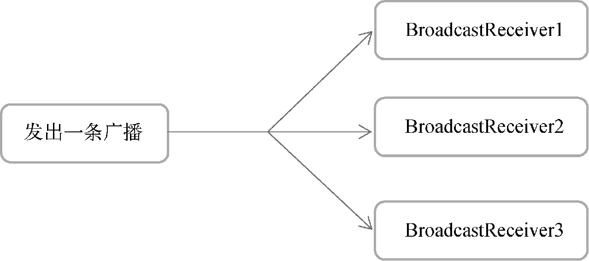
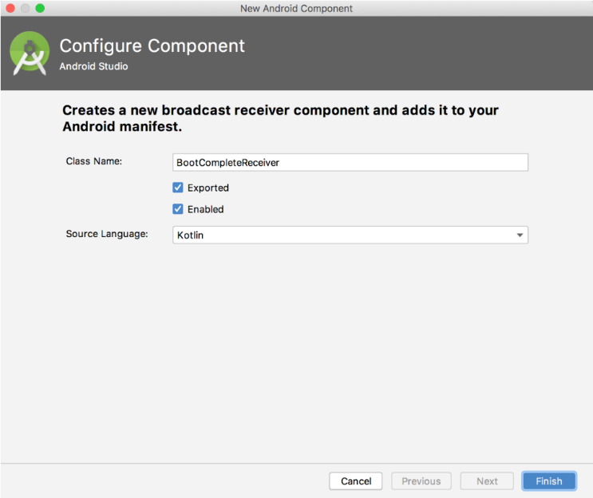
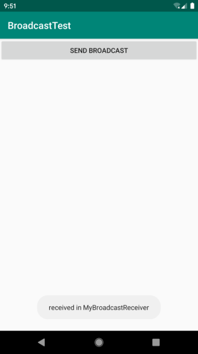
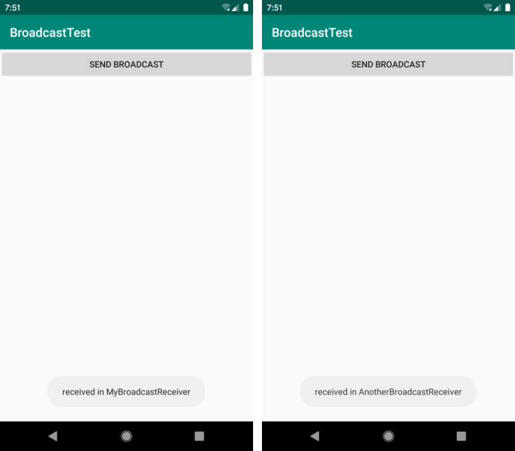
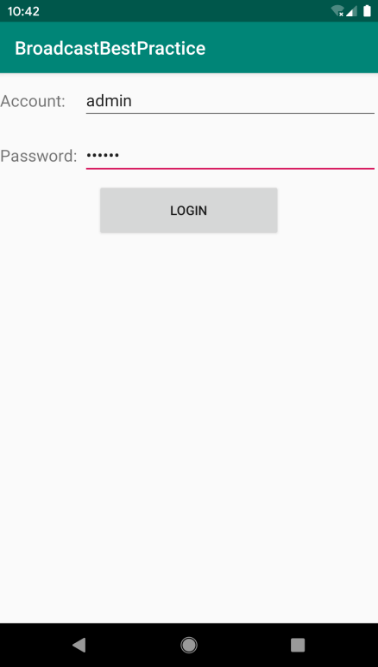
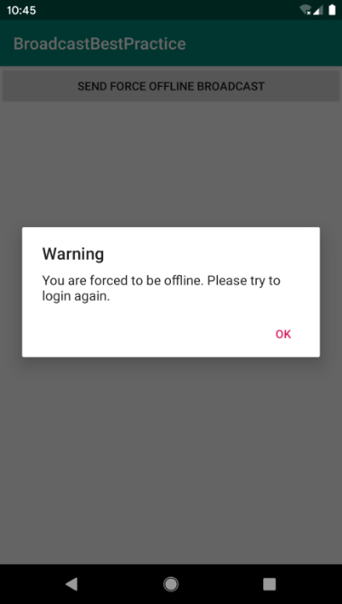
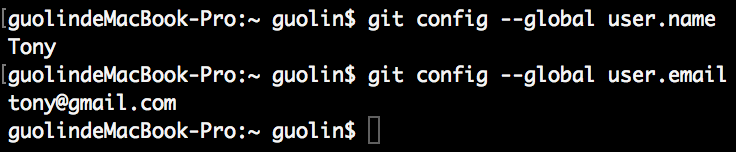
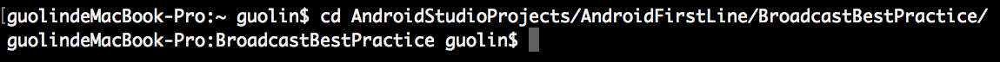
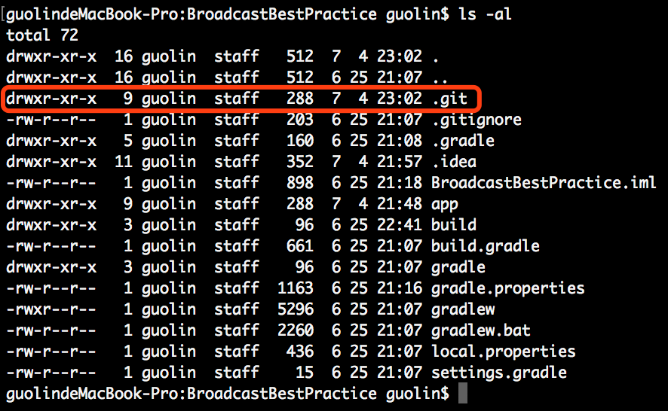

# 第 6 章　全局大喇叭，详解广播机制

记得在我上学的时候，每个班级的教室里都装有一个喇叭，这些喇叭接到学校的广播室，一旦有什么重要的通知，就会播放一条广播来告知全校的师生。类似的工作机制其实在计算机领域也有很广泛的应用，如果你了解网络通信原理，应该会知道，在一个 IP 网络范围中，最大的 IP 地址是被保留作为广播地址来使用的。比如某个网络的 IP 范围是 192.168.0.XXX，子网掩码是 255.255.255.0，那么这个网络的广播地址就是 192.168.0.255。广播数据包会被发送到同一网络上的所有端口，这样该网络中的每台主机都会收到这条广播。

为了便于进行系统级别的消息通知，Android 也引入了一套类似的广播消息机制。相比于我前面举的两个例子，Android 中的广播机制显得更加灵活，本章就将对这一机制的方方面面进行详细的讲解。

## 6.1　广播机制简介

为什么说 Android 中的广播机制更加灵活呢？这是因为 Android 中的每个应用程序都可以对自己感兴趣的广播进行注册，这样该程序就只会收到自己所关心的广播内容，这些广播可能是来自于系统的，也可能是来自于其他应用程序的。Android 提供了一套完整的 API，允许应用程序自由地发送和接收广播。发送广播的方法其实之前稍微提到过，如果你记性好的话，可能还会有印象，就是借助我们第 3 章学过的 Intent。而接收广播的方法则需要引入一个新的概念——BroadcastReceiver。

BroadcastReceiver 的具体用法将会在下一节介绍，这里我们先来了解一下广播的类型。Android 中的广播主要可以分为两种类型：标准广播和有序广播。

- 标准广播（normal broadcasts）是一种完全异步执行的广播，在广播发出之后，所有的 BroadcastReceiver 几乎会在同一时刻收到这条广播消息，因此它们之间没有任何先后顺序可言。这种广播的效率会比较高，但同时也意味着它是无法被截断的。标准广播的工作流程如图 6.1 所示。

  

  **图 6.1　标准广播工作示意图**
- 有序广播（ordered broadcasts）则是一种同步执行的广播，在广播发出之后，同一时刻只会有一个 BroadcastReceiver 能够收到这条广播消息，当这个 BroadcastReceiver 中的逻辑执行完毕后，广播才会继续传递。所以此时的 BroadcastReceiver 是有先后顺序的，优先级高的 BroadcastReceiver 就可以先收到广播消息，并且前面的 BroadcastReceiver 还可以截断正在传递的广播，这样后面的 BroadcastReceiver 就无法收到广播消息了。有序广播的工作流程如图 6.2 所示。

  

  **图 6.2　有序广播工作示意图**

掌握了这些基本概念后，我们就可以来学习广播的用法了，首先从接收系统广播开始吧。

## 6.2　接收系统广播

Android 内置了很多系统级别的广播，我们可以在应用程序中通过监听这些广播来得到各种系统的状态信息。比如手机开机完成后会发出一条广播，电池的电量发生变化会发出一条广播，系统时间发生改变也会发出一条广播，等等。如果想要接收这些广播，就需要使用 BroadcastReceiver，下面我们就来看一下它的具体用法。

### 6.2.1　动态注册监听时间变化

我们可以根据自己感兴趣的广播，自由地注册 BroadcastReceiver，这样当有相应的广播发出时，相应的 BroadcastReceiver 就能够收到该广播，并可以在内部进行逻辑处理。注册 BroadcastReceiver 的方式一般有两种：在代码中注册和在 AndroidManifest.xml 中注册。其中前者也被称为动态注册，后者也被称为静态注册。

那么如何创建一个 BroadcastReceiver 呢？其实只需新建一个类，让它继承自 BroadcastReceiver，并重写父类的 `onReceive()` 方法就行了。这样当有广播到来时，`onReceive()` 方法就会得到执行，具体的逻辑就可以在这个方法中处理。

下面我们就先通过动态注册的方式编写一个能够监听时间变化的程序，借此学习一下 BroadcastReceiver 的基本用法。新建一个 BroadcastTest 项目，然后修改 MainActivity 中的代码，如下所示：

```Kotlin
class MainActivity : AppCompatActivity() {

    lateinit var timeChangeReceiver: TimeChangeReceiver

    override fun onCreate(savedInstanceState: Bundle?) {
        super.onCreate(savedInstanceState)
        setContentView(R.layout.activity_main)
        val intentFilter = IntentFilter()
        intentFilter.addAction("android.intent.action.TIME_TICK")
        timeChangeReceiver = TimeChangeReceiver()
        registerReceiver(timeChangeReceiver, intentFilter)
    }

    override fun onDestroy() {
        super.onDestroy()
        unregisterReceiver(timeChangeReceiver)
    }

    inner class TimeChangeReceiver : BroadcastReceiver() {

        override fun onReceive(context: Context, intent: Intent) {
            Toast.makeText(context, "Time has changed", Toast.LENGTH_SHORT).show()
        }

    }

}
```

可以看到，我们在 MainActivity 中定义了一个内部类 `TimeChangeReceiver`，这个类是继承自 `BroadcastReceiver` 的，并重写了父类的 `onReceive()` 方法。这样每当系统时间发生变化时，`onReceive()` 方法就会得到执行，这里只是简单地使用 Toast 提示了一段文本信息。

然后观察 `onCreate()` 方法，首先我们创建了一个 `IntentFilter` 的实例，并给它添加了一个值为 `android.intent.action.TIME_TICK` 的 action，为什么要添加这个值呢？因为当系统时间发生变化时，系统发出的正是一条值为 `android.intent.action.TIME_TICK` 的广播，也就是说我们的 `BroadcastReceiver` 想要监听什么广播，就在这里添加相应的 action。接下来创建了一个 `TimeChangeReceiver` 的实例，然后调用 `registerReceiver()` 方法进行注册，将 `TimeChangeReceiver` 的实例和 `IntentFilter` 的实例都传了进去，这样 `TimeChangeReceiver` 就会收到所有值为 `android.intent.action.TIME_TICK` 的广播，也就实现了监听系统时间变化的功能。

最后要记得，动态注册的 `BroadcastReceiver` 一定要取消注册才行，这里我们是在 `onDestroy()` 方法中通过调用 `unregisterReceiver()` 方法来实现的。

整体来说，代码还是非常简单的。现在运行一下程序，然后静静等待时间发生变化。系统每隔一分钟就会发出一条 `android.intent.action.TIME_TICK` 的广播，因此我们最多只需要等待一分钟就可以收到这条广播了，如图 6.3 所示。


**图 6.3　监听到系统时间发生了变化**

这就是动态注册 `BroadcastReceiver` 的基本用法，虽然这里我们只使用了一种系统广播来举例，但是接收其他系统广播的用法是一模一样的。Android 系统还会在亮屏熄屏、电量变化、网络变化等场景下发出广播。如果你想查看完整的系统广播列表，可以到如下的路径中去查看：

```xml
<Android SDK>/platforms/<任意android api版本>/data/broadcast_actions.txt
```

### 6.2.2　静态注册实现开机启动

动态注册的 BroadcastReceiver 可以自由地控制注册与注销，在灵活性方面有很大的优势。但是它存在着一个缺点，即必须在程序启动之后才能接收广播，因为注册的逻辑是写在 `onCreate()` 方法中的。那么有没有什么办法可以让程序在未启动的情况下也能接收广播呢？这就需要使用静态注册的方式了。

其实从理论上来说，动态注册能监听到的系统广播，静态注册也应该能监听到，在过去的 Android 系统中确实是这样的。但是由于大量恶意的应用程序利用这个机制在程序未启动的情况下监听系统广播，从而使任何应用都可以频繁地从后台被唤醒，严重影响了用户手机的电量和性能，因此 Android 系统几乎每个版本都在削减静态注册 BroadcastReceiver 的功能。

在 Android 8.0 系统之后，所有隐式广播都不允许使用静态注册的方式来接收了。隐式广播指的是那些没有具体指定发送给哪个应用程序的广播，大多数系统广播属于隐式广播，但是少数特殊的系统广播目前仍然允许使用静态注册的方式来接收。这些特殊的系统广播列表详见 [https://developer.android.google.cn/guide/components/broadcast-exceptions.html](https://developer.android.google.cn/guide/components/broadcast-exceptions.html)。

在这些特殊的系统广播当中，有一条值为 `android.intent.action.BOOT_COMPLETED` 的广播，这是一条开机广播，那么就使用它来举例学习吧。

这里我们准备实现一个开机启动的功能。在开机的时候，我们的应用程序肯定是没有启动的，因此这个功能显然不能使用动态注册的方式来实现，而应该使用静态注册的方式来接收开机广播，然后在 `onReceive()` 方法里执行相应的逻辑，这样就可以实现开机启动的功能了。

那么就开始动手吧。上一小节中我们是使用内部类的方式创建的 BroadcastReceiver，其实还可以通过 Android Studio 提供的快捷方式来创建。右击 com.example.broadcasttest 包 →New→Other→Broadcast Receiver，会弹出如图 6.4 所示的窗口。



**图 6.4　创建 BroadcastReceiver 的窗口**

可以看到，这里我们将创建的类命名为 BootCompleteReceiver，`Exported` 属性表示是否允许这个 BroadcastReceiver 接收本程序以外的广播，`Enabled` 属性表示是否启用这个 BroadcastReceiver。勾选这两个属性，点击“Finish”完成创建。

然后修改 BootCompleteReceiver 中的代码，如下所示：

```Kotlin
class BootCompleteReceiver : BroadcastReceiver() {

    override fun onReceive(context: Context, intent: Intent) {
        Toast.makeText(context, "Boot Complete", Toast.LENGTH_LONG).show()
    }

}
```

代码非常简单，我们只是在 `onReceive()` 方法中使用 Toast 弹出一段提示信息。

另外，静态的 BroadcastReceiver 一定要在 AndroidManifest.xml 文件中注册才可以使用。不过，由于我们是使用 Android Studio 的快捷方式创建的 BroadcastReceiver，因此注册这一步已经自动完成了。打开 AndroidManifest.xml 文件瞧一瞧，代码如下所示：

```xml
<manifest xmlns:android="http://schemas.android.com/apk/res/android"
        package="com.example.broadcasttest">

    <application
        android:allowBackup="true"
        android:icon="@mipmap/ic_launcher"
        android:label="@string/app_name"
        android:roundIcon="@mipmap/ic_launcher_round"
        android:supportsRtl="true"
        android:theme="@style/AppTheme">
        ...
        <receiver
            android:name=".BootCompleteReceiver"
            android:enabled="true"
            android:exported="true">
        </receiver>
    </application>

</manifest>
```

可以看到，`<application>` 标签内出现了一个新的标签 `<receiver>`，所有静态的 BroadcastReceiver 都是在这里进行注册的。它的用法其实和 `<activity>` 标签非常相似，也是通过 `android:name` 指定具体注册哪一个 BroadcastReceiver，而 `enabled` 和 `exported` 属性则是根据我们刚才勾选的状态自动生成的。

不过目前的 BootCompleteReceiver 是无法收到开机广播的，因为我们还需要对 AndroidManifest.xml 文件进行修改才行，如下所示：

```xml
<manifest xmlns:android="http://schemas.android.com/apk/res/android"
        package="com.example.broadcasttest">

    <uses-permission android:name="android.permission.RECEIVE_BOOT_COMPLETED" />

    <application
        android:allowBackup="true"
        android:icon="@mipmap/ic_launcher"
        android:label="@string/app_name"
        android:roundIcon="@mipmap/ic_launcher_round"
        android:supportsRtl="true"
        android:theme="@style/AppTheme">
        ...
        <receiver
            android:name=".BootCompleteReceiver"
            android:enabled="true"
            android:exported="true">
            <intent-filter>
                <action android:name="android.intent.action.BOOT_COMPLETED" />
            </intent-filter>
        </receiver>
    </application>

</manifest>
```

由于 Android 系统启动完成后会发出一条值为 `android.intent.action.BOOT_COMPLETED` 的广播，因此我们在 `<receiver>` 标签中又添加了一个 `<intent-filter>` 标签，并在里面声明了相应的 action。

另外，这里有非常重要的一点需要说明。Android 系统为了保护用户设备的安全和隐私，做了严格的规定：如果程序需要进行一些对用户来说比较敏感的操作，必须在 AndroidManifest.xml 文件中进行权限声明，否则程序将会直接崩溃。比如这里接收系统的开机广播就是需要进行权限声明的，所以我们在上述代码中使用 `<uses-permission>` 标签声明了 `android.permission.RECEIVE_BOOT_COMPLETED` 权限。

这是你第一次遇到权限的问题，其实 Android 中的许多操作是需要声明权限才可以进行的，后面我们还会不断使用新的权限。不过目前这个接收系统开机广播的权限还是比较简单的，只需要在 AndroidManifest.xml 文件中声明一下就可以了。Android 6.0 系统中引入了更加严格的运行时权限，从而能够更好地保证用户设备的安全和隐私。关于这部分内容我们将在第 8 章中学习。

重新运行程序，现在我们的程序已经可以接收开机广播了。长按模拟器右侧工具栏中的 Power 按钮，会在模拟器界面上弹出关机重启选项，如图 6.5 所示。


**图 6.5　模拟器的关机重启选项**

点击“Restart”按钮重启模拟器，在启动完成之后就会收到开机广播，如图 6.6 所示。


**图 6.6　接收系统开机广播**

到目前为止，我们在 BroadcastReceiver 的 `onReceive()` 方法中只是简单地使用 Toast 提示了一段文本信息，当你真正在项目中使用它的时候，可以在里面编写自己的逻辑。需要注意的是，不要在 `onReceive()` 方法中添加过多的逻辑或者进行任何的耗时操作，因为 BroadcastReceiver 中是不允许开启线程的，当 `onReceive()` 方法运行了较长时间而没有结束时，程序就会出现错误。

## 6.3　发送自定义广播

现在你已经学会了通过 BroadcastReceiver 来接收系统广播，接下来我们就要学习一下如何在应用程序中发送自定义的广播。前面已经介绍过了，广播主要分为两种类型：标准广播和有序广播。本节我们就通过实践的方式来看一下这两种广播具体的区别。

### 6.3.1　发送标准广播

在发送广播之前，我们还是需要先定义一个 BroadcastReceiver 来准备接收此广播，不然发出去也是白发。因此新建一个 MyBroadcastReceiver，并在 `onReceive()` 方法中加入如下代码：

```Kotlin
class MyBroadcastReceiver : BroadcastReceiver() {

    override fun onReceive(context: Context, intent: Intent) {
        Toast.makeText(context, "received in MyBroadcastReceiver",
            Toast.LENGTH_SHORT).show()
    }

}
```

当 MyBroadcastReceiver 收到自定义的广播时，就会弹出“received in MyBroadcastReceiver”的提示。

然后在 AndroidManifest.xml 中对这个 BroadcastReceiver 进行修改：

```xml
<manifest xmlns:android="http://schemas.android.com/apk/res/android"
        package="com.example.broadcasttest">
    ...
    <application
        android:allowBackup="true"
        android:icon="@mipmap/ic_launcher"
        android:label="@string/app_name"
        android:roundIcon="@mipmap/ic_launcher_round"
        android:supportsRtl="true"
        android:theme="@style/AppTheme">
        ...
        <receiver
            android:name=".MyBroadcastReceiver"
            android:enabled="true"
            android:exported="true">
            <intent-filter>
                <action android:name="com.example.broadcasttest.MY_BROADCAST"/>
            </intent-filter>
        </receiver>
    </application>
</manifest>
```

可以看到，这里让 MyBroadcastReceiver 接收一条值为 `com.example.broadcasttest.MY_BROADCAST` 的广播，因此待会儿在发送广播的时候，我们就需要发出这样的一条广播。

接下来修改 activity_main.xml 中的代码，如下所示：

```xml
<LinearLayout xmlns:android="http://schemas.android.com/apk/res/android"
    android:orientation="vertical"
    android:layout_width="match_parent"
    android:layout_height="match_parent" >

    <Button
        android:id="@+id/button"
        android:layout_width="match_parent"
        android:layout_height="wrap_content"
        android:text="Send Broadcast"
        />

</LinearLayout>
```

这里在布局文件中定义了一个按钮，用于作为发送广播的触发点。然后修改 MainActivity 中的代码，如下所示：

```Kotlin
class MainActivity : AppCompatActivity() {
    ...
    override fun onCreate(savedInstanceState: Bundle?) {
        super.onCreate(savedInstanceState)
        setContentView(R.layout.activity_main)
        button.setOnClickListener {
            val intent = Intent("com.example.broadcasttest.MY_BROADCAST")
            intent.setPackage(packageName)
            sendBroadcast(intent)
        }
        ...
    }
    ...
}
```

可以看到，我们在按钮的点击事件里面加入了发送自定义广播的逻辑。

首先构建了一个 Intent 对象，并把要发送的广播的值传入。然后调用 `Intent` 的 `setPackage()` 方法，并传入当前应用程序的包名。`packageName` 是 `getPackageName()` 的语法糖写法，用于获取当前应用程序的包名。最后调用 `sendBroadcast()` 方法将广播发送出去，这样所有监听 `com.example.broadcasttest.MY_BROADCAST` 这条广播的 BroadcastReceiver 就会收到消息了。此时发出去的广播就是一条标准广播。

这里我还得对第 2 步调用的 `setPackage()` 方法进行更详细的说明。前面已经说过，在 Android 8.0 系统之后，静态注册的 BroadcastReceiver 是无法接收隐式广播的，而默认情况下我们发出的自定义广播恰恰都是隐式广播。因此这里一定要调用 `setPackage()` 方法，指定这条广播是发送给哪个应用程序的，从而让它变成一条显式广播，否则静态注册的 BroadcastReceiver 将无法接收到这条广播。

现在重新运行程序，并点击“Send Broadcast”按钮，效果如图 6.7 所示。



**图 6.7　接收到自定义广播**

这样我们就成功完成了发送自定义广播的功能。

另外，由于广播是使用 Intent 来发送的，因此你还可以在 Intent 中携带一些数据传递给相应的 BroadcastReceiver，这一点和 Activity 的用法是比较相似的。

### 6.3.2　发送有序广播

和标准广播不同，有序广播是一种同步执行的广播，并且是可以被截断的。为了验证这一点，我们需要再创建一个新的 BroadcastReceiver。新建 AnotherBroadcastReceiver，代码如下所示：

```Kotlin
class AnotherBroadcastReceiver : BroadcastReceiver() {

    override fun onReceive(context: Context, intent: Intent) {
        Toast.makeText(context, "received in AnotherBroadcastReceiver",
                  Toast.LENGTH_SHORT).show()
    }

}
```

很简单，这里仍然是在 `onReceive()` 方法中弹出了一段文本信息。

然后在 AndroidManifest.xml 中对这个 BroadcastReceiver 的配置进行修改，代码如下所示：

```xml
<manifest xmlns:android="http://schemas.android.com/apk/res/android"
        package="com.example.broadcasttest">
    ...
    <application
        android:allowBackup="true"
        android:icon="@mipmap/ic_launcher"
        android:label="@string/app_name"
        android:roundIcon="@mipmap/ic_launcher_round"
        android:supportsRtl="true"
        android:theme="@style/AppTheme">
        ...
        <receiver
            android:name=".AnotherBroadcastReceiver"
            android:enabled="true"
            android:exported="true">
            <intent-filter>
                <action android:name="com.example.broadcasttest.MY_BROADCAST" />
            </intent-filter>
        </receiver>
    </application>
</manifest>
```

可以看到，AnotherBroadcastReceiver 同样接收的是 `com.example.broadcasttest.MY_BROADCAST` 这条广播。现在重新运行程序，并点击“Send Broadcast”按钮，就会分别弹出两次提示信息，如图 6.8 所示。



**图 6.8　两个 BroadcastReceiver 都接收到了自定义广播**

不过，到目前为止，程序发出的都是标准广播，现在我们来尝试一下发送有序广播。重新回到 BroadcastTest 项目，然后修改 MainActivity 中的代码，如下所示：

```Kotlin
class MainActivity : AppCompatActivity() {
    ...
    override fun onCreate(savedInstanceState: Bundle?) {
        super.onCreate(savedInstanceState)
        setContentView(R.layout.activity_main)
        button.setOnClickListener {
            val intent = Intent("com.example.broadcasttest.MY_BROADCAST")
            intent.setPackage(packageName)
            sendOrderedBroadcast(intent, null)
        }
        ...
    }
    ...
}
```

可以看到，发送有序广播只需要改动一行代码，即将 `sendBroadcast()` 方法改成 `sendOrderedBroadcast()` 方法。`sendOrderedBroadcast()` 方法接收两个参数：第一个参数仍然是 `Intent`；第二个参数是一个与权限相关的字符串，这里传入 `null` 就行了。现在重新运行程序，并点击“Send Broadcast”按钮，你会发现，两个 BroadcastReceiver 仍然都可以收到这条广播。

看上去好像和标准广播并没有什么区别嘛。不过别忘了，这个时候的 BroadcastReceiver 是有先后顺序的，而且前面的 BroadcastReceiver 还可以将广播截断，以阻止其继续传播。

那么该如何设定 BroadcastReceiver 的先后顺序呢？当然是在注册的时候进行设定了，修改 AndroidManifest.xml 中的代码，如下所示：

```xml
<manifest xmlns:android="http://schemas.android.com/apk/res/android"
        package="com.example.broadcasttest">
    ...
    <application
        android:allowBackup="true"
        android:icon="@mipmap/ic_launcher"
        android:label="@string/app_name"
        android:roundIcon="@mipmap/ic_launcher_round"
        android:supportsRtl="true"
        android:theme="@style/AppTheme">
        ...
        <receiver
            android:name=".MyBroadcastReceiver"
            android:enabled="true"
            android:exported="true">
            <intent-filter android:priority="100">
                <action android:name="com.example.broadcasttest.MY_BROADCAST"/>
            </intent-filter>
        </receiver>
        ...
    </application>
</manifest>
```

可以看到，我们通过 `android:priority` 属性给 BroadcastReceiver 设置了优先级，优先级比较高的 BroadcastReceiver 就可以先收到广播。这里将 MyBroadcastReceiver 的优先级设成了 100，以保证它一定会在 AnotherBroadcastReceiver 之前收到广播。

既然已经获得了接收广播的优先权，那么 MyBroadcastReceiver 就可以选择是否允许广播继续传递了。修改 MyBroadcastReceiver 中的代码，如下所示：

```Kotlin
class MyBroadcastReceiver : BroadcastReceiver() {

    override fun onReceive(context: Context, intent: Intent) {
        Toast.makeText(context, "received in MyBroadcastReceiver",
                  Toast.LENGTH_SHORT).show()
        abortBroadcast()
    }

}
```

如果在 `onReceive()` 方法中调用了 `abortBroadcast()` 方法，就表示将这条广播截断，后面的 BroadcastReceiver 将无法再接收到这条广播。

现在重新运行程序，并点击“Send Broadcast”按钮，你会发现只有 MyBroadcastReceiver 中的 Toast 信息能够弹出，说明这条广播经过 MyBroadcastReceiver 之后确实终止传递了。

## 6.4　广播的最佳实践：实现强制下线功能

本章的内容不是非常多，相信你一定学得很轻松吧。现在我们就准备通过一个完整例子的实践，综合运用一下本章所学到的知识。

强制下线应该算是一个比较常见的功能，比如如果你的 QQ 号在别处登录了，就会将你强制挤下线。其实实现强制下线功能的思路比较简单，只需要在界面上弹出一个对话框，让用户无法进行任何其他操作，必须点击对话框中的“确定”按钮，然后回到登录界面即可。可是这样就会存在一个问题：当用户被通知需要强制下线时，可能正处于任何一个界面，难道要在每个界面上都编写一个弹出对话框的逻辑？如果你真的这么想，那思路就偏远了。我们完全可以借助本章所学的广播知识，非常轻松地实现这一功能。新建一个 BroadcastBestPractice 项目，然后开始动手吧。

强制下线功能需要先关闭所有的 Activity，然后回到登录界面。如果你的反应足够快，应该会想到我们在第 3 章的最佳实践部分已经实现过关闭所有 Activity 的功能了，因此这里使用同样的方案即可。先创建一个 `ActivityCollector` 类用于管理所有的 Activity，代码如下所示：

```Kotlin
object ActivityCollector {

    private val activities = ArrayList<Activity>()

    fun addActivity(activity: Activity) {
        activities.add(activity)
    }

    fun removeActivity(activity: Activity) {
        activities.remove(activity)
    }

    fun finishAll() {
        for (activity in activities) {
            if (!activity.isFinishing) {
                activity.finish()
            }
        }
        activities.clear()
    }

}
```

然后创建 `BaseActivity` 类作为所有 Activity 的父类，代码如下所示：

```Kotlin
open class BaseActivity : AppCompatActivity() {

    override fun onCreate(savedInstanceState: Bundle?) {
        super.onCreate(savedInstanceState)
        ActivityCollector.addActivity(this)
    }

    override fun onDestroy() {
        super.onDestroy()
        ActivityCollector.removeActivity(this)
    }

}
```

以上代码都是直接用的之前写好的内容，非常开心。不过从这里开始，就要靠我们自己去动手实现了。首先需要创建一个 `LoginActivity` 来作为登录界面，并让 Android Studio 帮我们自动生成相应的布局文件。然后编辑布局文件 activity_login.xml，代码如下所示：

```xml
<LinearLayout xmlns:android="http://schemas.android.com/apk/res/android"
    android:orientation="vertical"
    android:layout_width="match_parent"
    android:layout_height="match_parent">

    <LinearLayout
        android:orientation="horizontal"
        android:layout_width="match_parent"
        android:layout_height="60dp">
        <TextView
            android:layout_width="90dp"
            android:layout_height="wrap_content"
            android:layout_gravity="center_vertical"
            android:textSize="18sp"
            android:text="Account:" />

        <EditText
            android:id="@+id/accountEdit"
            android:layout_width="0dp"
            android:layout_height="wrap_content"
            android:layout_weight="1"
            android:layout_gravity="center_vertical" />
    </LinearLayout>

    <LinearLayout
        android:orientation="horizontal"
        android:layout_width="match_parent"
        android:layout_height="60dp">
        <TextView
            android:layout_width="90dp"
            android:layout_height="wrap_content"
            android:layout_gravity="center_vertical"
            android:textSize="18sp"
            android:text="Password:" />

        <EditText
            android:id="@+id/passwordEdit"
            android:layout_width="0dp"
            android:layout_height="wrap_content"
            android:layout_weight="1"
            android:layout_gravity="center_vertical"
            android:inputType="textPassword" />
    </LinearLayout>

    <Button
        android:id="@+id/login"
        android:layout_width="200dp"
        android:layout_height="60dp"
        android:layout_gravity="center_horizontal"
        android:text="Login" />

</LinearLayout>
```

这里我们使用 LinearLayout 编写了一个登录布局，最外层是一个纵向的 LinearLayout，里面包含了 3 行直接子元素。第一行是一个横向的 LinearLayout，用于输入账号信息；第二行也是一个横向的 LinearLayout，用于输入密码信息；第三行是一个登录按钮。这个布局文件里用到的全部都是我们之前学过的内容，相信你理解起来应该不会费劲。

接下来修改 LoginActivity 中的代码，如下所示：

```Kotlin
class LoginActivity : BaseActivity() {

    override fun onCreate(savedInstanceState: Bundle?) {
        super.onCreate(savedInstanceState)
        setContentView(R.layout.activity_login)
        login.setOnClickListener {
            val account = accountEdit.text.toString()
            val password = passwordEdit.text.toString()
            // 如果账号是admin且密码是123456，就认为登录成功
            if (account == "admin" && password == "123456") {
                val intent = Intent(this, MainActivity::class.java)
                startActivity(intent)
                finish()
            } else {
                Toast.makeText(this, "account or password is invalid",
                          Toast.LENGTH_SHORT).show()
            }
        }
    }

}
```

这里我们模拟了一个非常简单的登录功能。首先将 LoginActivity 的继承结构改成继承自 BaseActivity，然后在登录按钮的点击事件里对输入的账号和密码进行判断：如果账号是 admin 并且密码是 123456，就认为登录成功并跳转到 MainActivity，否则就提示用户账号或密码错误。

因此，你可以将 MainActivity 理解成是登录成功后进入的程序主界面，这里我们并不需要在主界面提供什么花哨的功能，只需要加入强制下线功能就可以了。修改 activity_main.xml 中的代码，如下所示：

```xml
<LinearLayout xmlns:android="http://schemas.android.com/apk/res/android"
    android:orientation="vertical"
    android:layout_width="match_parent"
    android:layout_height="match_parent" >

    <Button
        android:id="@+id/forceOffline"
        android:layout_width="match_parent"
        android:layout_height="wrap_content"
        android:text="Send force offline broadcast" />

</LinearLayout>
```

非常简单，只有一个按钮用于触发强制下线功能。然后修改 MainActivity 中的代码，如下所示：

```Kotlin
class MainActivity : BaseActivity() {

    override fun onCreate(savedInstanceState: Bundle?) {
        super.onCreate(savedInstanceState)
        setContentView(R.layout.activity_main)
        forceOffline.setOnClickListener {
            val intent = Intent("com.example.broadcastbestpractice.FORCE_OFFLINE")
            sendBroadcast(intent)
        }
    }

}
```

同样非常简单，不过这里有个重点，我们在按钮的点击事件里发送了一条广播，广播的值为 `com.example.broadcastbestpractice.FORCE_OFFLINE`，这条广播就是用于通知程序强制用户下线的。也就是说，强制用户下线的逻辑并不是写在 MainActivity 里的，而是应该写在接收这条广播的 BroadcastReceiver 里。这样强制下线的功能就不会依附于任何界面了，不管是在程序的任何地方，只要发出这样一条广播，就可以完成强制下线的操作了。

那么毫无疑问，接下来我们就需要创建一个 BroadcastReceiver 来接收这条强制下线广播。唯一的问题就是，应该在哪里创建呢？由于 BroadcastReceiver 中需要弹出一个对话框来阻塞用户的正常操作，但如果创建的是一个静态注册的 BroadcastReceiver，是没有办法在 `onReceive()` 方法里弹出对话框这样的 UI 控件的，而我们显然也不可能在每个 Activity 中都注册一个动态的 BroadcastReceiver。

那么到底应该怎么办呢？答案其实很明显，只需要在 BaseActivity 中动态注册一个 BroadcastReceiver 就可以了，因为所有的 Activity 都继承自 BaseActivity。

修改 BaseActivity 中的代码，如下所示：

```Kotlin
open class BaseActivity : AppCompatActivity() {

    lateinit var receiver: ForceOfflineReceiver

    override fun onCreate(savedInstanceState: Bundle?) {
        super.onCreate(savedInstanceState)
        ActivityCollector.addActivity(this)
    }

    override fun onResume() {
        super.onResume()
        val intentFilter = IntentFilter()
        intentFilter.addAction("com.example.broadcastbestpractice.FORCE_OFFLINE")
        receiver = ForceOfflineReceiver()
        registerReceiver(receiver, intentFilter)
    }

    override fun onPause() {
        super.onPause()
        unregisterReceiver(receiver)
    }

    override fun onDestroy() {
        super.onDestroy()
        ActivityCollector.removeActivity(this)
    }

    inner class ForceOfflineReceiver : BroadcastReceiver() {

        override fun onReceive(context: Context, intent: Intent) {
            AlertDialog.Builder(context).apply {
                setTitle("Warning")
                setMessage("You are forced to be offline. Please try to login again.")
                setCancelable(false)
                setPositiveButton("OK") { _, _ ->
                    ActivityCollector.finishAll() // 销毁所有Activity
                    val i = Intent(context, LoginActivity::class.java)
                    context.startActivity(i) // 重新启动LoginActivity
                }
                show()
            }
        }

    }

}
```

先来看一下 ForceOfflineReceiver 中的代码，这次 `onReceive()` 方法里可不再是仅仅弹出一个 Toast 了，而是加入了较多的代码，那我们就来仔细看看吧。首先是使用 AlertDialog.Builder 构建一个对话框。注意，这里一定要调用 `setCancelable()` 方法将对话框设为不可取消，否则用户按一下 Back 键就可以关闭对话框继续使用程序了。然后使用 `setPositiveButton()` 方法给对话框注册确定按钮，当用户点击了“OK”按钮时，就调用 ActivityCollector 的 `finishAll()` 方法销毁所有 Activity，并重新启动 LoginActivity。

再来看一下我们是怎么注册 ForceOfflineReceiver 这个 BroadcastReceiver 的。可以看到，这里重写了 `onResume()` 和 `onPause()` 这两个生命周期方法，然后分别在这两个方法里注册和取消注册了 ForceOfflineReceiver。

为什么要这样写呢？之前不都是在 `onCreate()` 和 `onDestroy()` 方法里注册和取消注册 BroadcastReceiver 的吗？这是因为我们始终需要保证只有处于栈顶的 Activity 才能接收到这条强制下线广播，非栈顶的 Activity 不应该也没必要接收这条广播，所以写在 `onResume()` 和 `onPause()` 方法里就可以很好地解决这个问题，当一个 Activity 失去栈顶位置时就会自动取消 BroadcastReceiver 的注册。

这样的话，所有强制下线的逻辑就已经完成了，接下来我们还需要对 AndroidManifest.xml 文件进行修改，代码如下所示：

```xml
<manifest xmlns:android="http://schemas.android.com/apk/res/android"
        package="com.example.broadcastbestpractice">
    <application
        android:allowBackup="true"
        android:icon="@mipmap/ic_launcher"
        android:label="@string/app_name"
        android:roundIcon="@mipmap/ic_launcher_round"
        android:supportsRtl="true"
        android:theme="@style/AppTheme">
        <activity android:name=".LoginActivity">
            <intent-filter>
                <action android:name="android.intent.action.MAIN"/>
                <category android:name="android.intent.category.LAUNCHER"/>
            </intent-filter>
        </activity>

        <activity android:name=".MainActivity">
        </activity>
    </application>
</manifest>
```

这里只需要对一处代码进行修改，就是将主 Activity 设置为 LoginActivity，而不再是 MainActivity，因为你肯定不希望用户在没登录的情况下就能直接进入程序主界面吧？

好了，现在来尝试运行一下程序吧。首先会进入登录界面，并可以在这里输入账号和密码，如图 6.9 所示。



**图 6.9　登录界面**

如果输入的账号是 admin，密码是 123456，点击登录按钮就会进入程序的主界面，如图 6.10 所示。这时点击一下发送广播的按钮，就会发出一条强制下线的广播，ForceOfflineReceiver 收到这条广播后会弹出一个对话框，提示用户已被强制下线，如图 6.11 所示。


**图 6.10　主界面**



**图 6.11　强制下线提示**

这时用户将无法再对界面的任何元素进行操作，只能点击“OK”按钮，然后重新回到登录界面。这样，强制下线功能就完整地实现了。

结束了本章的最佳实践部分，接下来又要进入我们本章的 Kotlin 课堂了。

## 6.5　Kotlin 课堂：高阶函数详解

学到这里，你已经可以算是完全入门 Kotlin 编程了。因此，从本章的 Kotlin 课堂起，我们就将告别基础知识，开始转向 Kotlin 的高级用法，从而进一步提升你的 Kotlin 水平。

那么就从高阶函数开始吧。

### 6.5.1　定义高阶函数

高阶函数和 Lambda 的关系是密不可分的。在第 2 章快速入门 Kotlin 编程的时候，我们已经学习了 Lambda 编程的基础知识，并且掌握了一些与集合相关的函数式 API 的用法，如 `map`、`filter` 函数等。另外，在第 3 章的 Kotlin 课堂中，我们又学习了 Kotlin 的标准函数，如 `run`、`apply` 函数等。

你有没有发现，这几个函数有一个共同的特点：它们都会要求我们传入一个 Lambda 表达式作为参数。像这种接收 Lambda 参数的函数就可以称为具有函数式编程风格的 API，而如果你想要定义自己的函数式 API，那就得借助高阶函数来实现了，这也是我们本节 Kotlin 课堂所要重点学习的内容。

首先来看一下高阶函数的定义。如果一个函数接收另一个函数作为参数，或者返回值的类型是另一个函数，那么该函数就称为高阶函数。

这个定义可能有点不太好理解，一个函数怎么能接收另一个函数作为参数呢？这就涉及另外一个概念了：函数类型。我们知道，编程语言中有整型、布尔型等字段类型，而 Kotlin 又增加了一个函数类型的概念。如果我们将这种函数类型添加到一个函数的参数声明或者返回值声明当中，那么这就是一个高阶函数了。

接下来我们就学习一下如何定义一个函数类型。不同于定义一个普通的字段类型，函数类型的语法规则是有点特殊的，基本规则如下：

```Kotlin
(String, Int) -> Unit
```

突然看到这样的语法规则，你一定一头雾水吧？不过不用担心，耐心听完我的解释之后，你就能够轻松理解了。

既然是定义一个函数类型，那么最关键的就是要声明该函数接收什么参数，以及它的返回值是什么。因此，`->` 左边的部分就是用来声明该函数接收什么参数的，多个参数之间使用逗号隔开，如果不接收任何参数，写一对空括号就可以了。而 `->` 右边的部分用于声明该函数的返回值是什么类型，如果没有返回值就使用 `Unit`，它大致相当于 Java 中的 `void`。

现在将上述函数类型添加到某个函数的参数声明或者返回值声明上，那么这个函数就是一个高阶函数了，如下所示：

```Kotlin
fun example(func: (String, Int) -> Unit) {
    func("hello", 123)
}
```

可以看到，这里的 `example()` 函数接收了一个函数类型的参数，因此 `example()` 函数就是一个高阶函数。而调用一个函数类型的参数，它的语法类似于调用一个普通的函数，只需要在参数名的后面加上一对括号，并在括号中传入必要的参数即可。

现在我们已经了解了高阶函数的定义方式，但是这种函数具体有什么用途呢？由于高阶函数的用途实在是太广泛了，这里如果要让我简单概括一下的话，那就是高阶函数允许让函数类型的参数来决定函数的执行逻辑。即使是同一个高阶函数，只要传入不同的函数类型参数，那么它的执行逻辑和最终的返回结果就可能是完全不同的。为了详细说明这一点，下面我们来举一个具体的例子。

这里我准备定义一个叫作 `num1AndNum2()` 的高阶函数，并让它接收两个整型和一个函数类型的参数。我们会在 `num1AndNum2()` 函数中对传入的两个整型参数进行某种运算，并返回最终的运算结果，但是具体进行什么运算是由传入的函数类型参数决定的。

新建一个 HigherOrderFunction.kt 文件，然后在这个文件中编写如下代码：

```Kotlin
fun num1AndNum2(num1: Int, num2: Int, operation: (Int, Int) -> Int): Int {
    val result = operation(num1, num2)
    return result
}
```

这是一个非常简单的高阶函数，可能它并没有多少实际的意义，却是个很好的学习示例。`num1AndNum2()` 函数的前两个参数没有什么需要解释的，第三个参数是一个接收两个整型参数并且返回值也是整型的函数类型参数。在 `num1AndNum2()` 函数中，我们没有进行任何具体的运算操作，而是将 `num1` 和 `num2` 参数传给了第三个函数类型参数，并获取它的返回值，最终将得到的返回值返回。

现在高阶函数已经定义好了，那么我们该如何调用它呢？由于 `num1AndNum2()` 函数接收一个函数类型的参数，因此我们还得先定义与其函数类型相匹配的函数才行。在 HigherOrderFunction.kt 文件中添加如下代码：

```Kotlin
fun plus(num1: Int, num2: Int): Int {
    return num1 + num2
}

fun minus(num1: Int, num2: Int): Int {
    return num1 - num2
}
```

这里定义了两个函数，并且这两个函数的参数声明和返回值声明都和 `num1AndNum2()` 函数中的函数类型参数是完全匹配的。其中，`plus()` 函数将两个参数相加并返回，`minus()` 函数将两个参数相减并返回，分别对应了两种不同的运算操作。

有了上述函数之后，我们就可以调用 `num1AndNum2()` 函数了，在 `main()` 函数中编写如下代码：

```Kotlin
fun main() {
    val num1 = 100
    val num2 = 80
    val result1 = num1AndNum2(num1, num2, ::plus)
    val result2 = num1AndNum2(num1, num2, ::minus)
    println("result1 is $result1")
    println("result2 is $result2")
}
```

注意这里调用 `num1AndNum2()` 函数的方式，第三个参数使用了 `::plus` 和 `::minus` 这种写法。这是一种函数引用方式的写法，表示将 `plus()` 和 `minus()` 函数作为参数传递给 `num1AndNum2()` 函数。而由于 `num1AndNum2()` 函数中使用了传入的函数类型参数来决定具体的运算逻辑，因此这里实际上就是分别使用了 `plus()` 和 `minus()` 函数来对两个数字进行运算。

现在运行一下程序，结果如图 6.12 所示。


**图 6.12　高阶函数的运行结果**

这和我们预期的结果是一致的。

使用这种函数引用的写法虽然能够正常工作，但是如果每次调用任何高阶函数的时候都还得先定义一个与其函数类型参数相匹配的函数，这是不是有些太复杂了？

没错，因此 Kotlin 还支持其他多种方式来调用高阶函数，比如 Lambda 表达式、匿名函数、成员引用等。其中，Lambda 表达式是最常见也是最普遍的高阶函数调用方式，也是我们接下来要重点学习的内容。

上述代码如果使用 Lambda 表达式的写法来实现的话，代码如下所示：

```Kotlin
fun main() {
    val num1 = 100
    val num2 = 80
    val result1 = num1AndNum2(num1, num2) { n1, n2 ->
        n1 + n2
    }
    val result2 = num1AndNum2(num1, num2) { n1, n2 ->
        n1 - n2
    }
    println("result1 is $result1")
    println("result2 is $result2")
}
```

Lambda 表达式的语法规则我们在 2.6.2 小节已经学习过了，因此这段代码对于你来说应该不难理解。你会发现，Lambda 表达式同样可以完整地表达一个函数的参数声明和返回值声明（Lambda 表达式中的最后一行代码会自动作为返回值），但是写法却更加精简。

现在你就可以将刚才定义的 `plus()` 和 `minus()` 函数删掉了，重新运行一下代码，你会发现结果是一模一样的。

下面我们继续对高阶函数进行探究。回顾之前在第 3 章学习的 `apply` 函数，它可以用于给 Lambda 表达式提供一个指定的上下文，当需要连续调用同一个对象的多个方法时，`apply` 函数可以让代码变得更加精简，比如 `StringBuilder` 就是一个典型的例子。接下来我们就使用高阶函数模仿实现一个类似的功能。

修改 HigherOrderFunction.kt 文件，在其中加入如下代码：

```Kotlin
fun StringBuilder.build(block: StringBuilder.() -> Unit): StringBuilder {
    block()
    return this
}
```

这里我们给 `StringBuilder` 类定义了一个 `build` 扩展函数，这个扩展函数接收一个函数类型参数，并且返回值类型也是 `StringBuilder`。

注意，这个函数类型参数的声明方式和我们前面学习的语法有所不同：它在函数类型的前面加上了一个 `StringBuilder.` 的语法结构。这是什么意思呢？其实这才是定义高阶函数完整的语法规则，在函数类型的前面加上 `ClassName.` 就表示这个函数类型是定义在哪个类当中的。

那么这里将函数类型定义到 `StringBuilder` 类当中有什么好处呢？好处就是当我们调用 `build` 函数时传入的 Lambda 表达式将会自动拥有 `StringBuilder` 的上下文，同时这也是 `apply` 函数的实现方式。

现在我们就可以使用自己创建的 `build` 函数来简化 `StringBuilder` 构建字符串的方式了。这里仍然用吃水果这个功能来举例：

```Kotlin
fun main() {
    val list = listOf("Apple", "Banana", "Orange", "Pear", "Grape")
    val result = StringBuilder().build {
        append("Start eating fruits.\n")
        for (fruit in list) {
            append(fruit).append("\n")
        }
        append("Ate all fruits.")
    }
    println(result.toString())
}
```

可以看到，`build` 函数的用法和 `apply` 函数基本上是一模一样的，只不过我们编写的 `build` 函数目前只能作用在 `StringBuilder` 类上面，而 `apply` 函数是可以作用在所有类上面的。如果想实现 `apply` 函数的这个功能，需要借助于 Kotlin 的泛型才行，我们将在第 8 章学习泛型的相关内容。

现在，你已经完全掌握了高阶函数的基本功能，接下来我们要学习一些更加高级的知识。

### 6.5.2　内联函数的作用

高阶函数确实非常神奇，用途也十分广泛，可是你知道它背后的实现原理是怎样的吗？当然，这个话题并不要求每个人都必须了解，但是为了接下来可以更好地理解内联函数这个知识点，我们还是简单分析一下高阶函数的实现原理。

这里仍然使用刚才编写的 `num1AndNum2()` 函数来举例，代码如下所示：

```Kotlin
fun num1AndNum2(num1: Int, num2: Int, operation: (Int, Int) -> Int): Int {
    val result = operation(num1, num2)
    return result
}

fun main() {
    val num1 = 100
    val num2 = 80
    val result = num1AndNum2(num1, num2) { n1, n2 ->
        n1 + n2
    }
}
```

可以看到，上述代码中调用了 `num1AndNum2()` 函数，并通过 Lambda 表达式指定对传入的两个整型参数进行求和。这段代码在 Kotlin 中非常好理解，因为这是高阶函数最基本的用法。可是我们都知道，Kotlin 的代码最终还是要编译成 Java 字节码的，但 Java 中并没有高阶函数的概念。

那么 Kotlin 究竟使用了什么魔法来让 Java 支持这种高阶函数的语法呢？这就要归功于 Kotlin 强大的编译器了。Kotlin 的编译器会将这些高阶函数的语法转换成 Java 支持的语法结构，上述的 Kotlin 代码大致会被转换成如下 Java 代码：

```Kotlin
public static int num1AndNum2(int num1, int num2, Function operation) {
    int result = (int) operation.invoke(num1, num2);
    return result;
}

public static void main() {
    int num1 = 100;
    int num2 = 80;
    int result = num1AndNum2(num1, num2, new Function() {
        @Override
        public Integer invoke(Integer n1, Integer n2) {
            return n1 + n2;
        }
    });
}
```

考虑到可读性，我对这段代码进行了些许调整，并不是严格对应了 Kotlin 转换成的 Java 代码。可以看到，在这里 `num1AndNum2()` 函数的第三个参数变成了一个 `Function` 接口，这是一种 Kotlin 内置的接口，里面有一个待实现的 `invoke()` 函数。而 `num1AndNum2()` 函数其实就是调用了 `Function` 接口的 `invoke()` 函数，并把 `num1` 和 `num2` 参数传了进去。

在调用 `num1AndNum2()` 函数的时候，之前的 Lambda 表达式在这里变成了 `Function` 接口的匿名类实现，然后在 `invoke()` 函数中实现了 `n1 + n2` 的逻辑，并将结果返回。

这就是 Kotlin 高阶函数背后的实现原理。你会发现，原来我们一直使用的 Lambda 表达式在底层被转换成了匿名类的实现方式。这就表明，我们每调用一次 Lambda 表达式，都会创建一个新的匿名类实例，当然也会造成额外的内存和性能开销。

为了解决这个问题，Kotlin 提供了内联函数的功能，它可以将使用 Lambda 表达式带来的运行时开销完全消除。

内联函数的用法非常简单，只需要在定义高阶函数时加上 `inline` 关键字的声明即可，如下所示：

```Kotlin
inline fun num1AndNum2(num1: Int, num2: Int, operation: (Int, Int) -> Int): Int {
    val result = operation(num1, num2)
    return result
}
```

那么内联函数的工作原理又是什么呢？其实并不复杂，就是 Kotlin 编译器会将内联函数中的代码在编译的时候自动替换到调用它的地方，这样也就不存在运行时的开销了。

当然，仅仅一句话的描述可能还是让人不太容易理解，下面我们通过图例的方式来详细说明内联函数的代码替换过程。

首先，Kotlin 编译器会将 Lambda 表达式中的代码替换到函数类型参数调用的地方，如图 6.13 所示。


**图 6.13　第一步替换过程**

接下来，再将内联函数中的全部代码替换到函数调用的地方，如图 6.14 所示。


**图 6.14　第二步替换过程**

最终的代码就被替换成了如图 6.15 所示的样子。


**图 6.15　最终的替换结果**

也正是如此，内联函数才能完全消除 Lambda 表达式所带来的运行时开销。

### 6.5.3　`noinline` 与 `crossinline`

接下来我们要讨论一些更加特殊的情况。比如，一个高阶函数中如果接收了两个或者更多函数类型的参数，这时我们给函数加上了 `inline` 关键字，那么 Kotlin 编译器会自动将所有引用的 Lambda 表达式全部进行内联。

但是，如果我们只想内联其中的一个 Lambda 表达式该怎么办呢？这时就可以使用 `noinline` 关键字了，如下所示：

```Kotlin
inline fun inlineTest(block1: () -> Unit, noinline block2: () -> Unit) {
}
```

可以看到，这里使用 `inline` 关键字声明了 `inlineTest()` 函数，原本 `block1` 和 `block2` 这两个函数类型参数所引用的 Lambda 表达式都会被内联。但是我们在 `block2` 参数的前面又加上了一个 `noinline` 关键字，那么现在就只会对 `block1` 参数所引用的 Lambda 表达式进行内联了。这就是 `noinline` 关键字的作用。

前面我们已经解释了内联函数的好处，那么为什么 Kotlin 还要提供一个 `noinline` 关键字来排除内联功能呢？这是因为内联的函数类型参数在编译的时候会被进行代码替换，因此它没有真正的参数属性。非内联的函数类型参数可以自由地传递给其他任何函数，因为它就是一个真实的参数，而内联的函数类型参数只允许传递给另外一个内联函数，这也是它最大的局限性。

另外，内联函数和非内联函数还有一个重要的区别，那就是内联函数所引用的 Lambda 表达式中是可以使用 `return` 关键字来进行函数返回的，而非内联函数只能进行局部返回。为了说明这个问题，我们来看下面的例子。

```Kotlin
fun printString(str: String, block: (String) -> Unit) {
    println("printString begin")
    block(str)
    println("printString end")
}

fun main() {
    println("main start")
    val str = ""
    printString(str) { s ->
        println("lambda start")
        if (s.isEmpty()) return@printString
        println(s)
        println("lambda end")
    }
    println("main end")
}
```

这里定义了一个叫作 `printString()` 的高阶函数，用于在 Lambda 表达式中打印传入的字符串参数。但是如果字符串参数为空，那么就不进行打印。注意，Lambda 表达式中是不允许直接使用 `return` 关键字的，这里使用了 `return@printString` 的写法，表示进行局部返回，并且不再执行 Lambda 表达式的剩余部分代码。

现在我们就刚好传入一个空的字符串参数，运行程序，打印结果如图 6.16 所示。


**图 6.16　局部返回的运行结果**

可以看到，除了 Lambda 表达式中 `return@printString` 语句之后的代码没有打印，其他的日志是正常打印的，说明 `return@printString` 确实只能进行局部返回。

但是如果我们将 `printString()` 函数声明成一个内联函数，那么情况就不一样了，如下所示：

```Kotlin
inline fun printString(str: String, block: (String) -> Unit) {
    println("printString begin")
    block(str)
    println("printString end")
}

fun main() {
    println("main start")
    val str = ""
    printString(str) { s ->
        println("lambda start")
        if (s.isEmpty()) return
        println(s)
        println("lambda end")
    }
    println("main end")
}
```

现在 `printString()` 函数变成了内联函数，我们就可以在 Lambda 表达式中使用 `return` 关键字了。此时的 `return` 代表的是返回外层的调用函数，也就是 `main()` 函数，如果想不通为什么的话，可以回顾一下在上一小节中学习的内联函数的代码替换过程。

现在重新运行一下程序，打印结果如图 6.17 所示。


**图 6.17　非局部返回的运行结果**

可以看到，不管是 `main()` 函数还是 `printString()` 函数，确实都在 `return` 关键字之后停止执行了，和我们所预期的结果一致。

将高阶函数声明成内联函数是一种良好的编程习惯，事实上，绝大多数高阶函数是可以直接声明成内联函数的，但是也有少部分例外的情况。观察下面的代码示例：

```Kotlin
inline fun runRunnable(block: () -> Unit) {
    val runnable = Runnable {
        block()
    }
    runnable.run()
}
```

这段代码在没有加上 `inline` 关键字声明的时候绝对是可以正常工作的，但是在加上 `inline` 关键字之后就会提示如图 6.18 所示的错误。


**图 6.18　使用内联函数可能出现的错误**

这个错误出现的原因解释起来可能会稍微有点复杂。首先，在 `runRunnable()` 函数中，我们创建了一个 `Runnable` 对象，并在 Runnable 的 Lambda 表达式中调用了传入的函数类型参数。而 Lambda 表达式在编译的时候会被转换成匿名类的实现方式，也就是说，上述代码实际上是在匿名类中调用了传入的函数类型参数。

而内联函数所引用的 Lambda 表达式允许使用 `return` 关键字进行函数返回，但是由于我们是在匿名类中调用的函数类型参数，此时是不可能进行外层调用函数返回的，最多只能对匿名类中的函数调用进行返回，因此这里就提示了上述错误。

也就是说，如果我们在高阶函数中创建了另外的 Lambda 或者匿名类的实现，并且在这些实现中调用函数类型参数，此时再将高阶函数声明成内联函数，就一定会提示错误。

那么是不是在这种情况下就真的无法使用内联函数了呢？也不是，比如借助 `crossinline` 关键字就可以很好地解决这个问题：

```Kotlin
inline fun runRunnable(crossinline block: () -> Unit) {
    val runnable = Runnable {
        block()
    }
    runnable.run()
}
```

可以看到，这里在函数类型参数的前面加上了 `crossinline` 的声明，代码就可以正常编译通过了。

那么这个 `crossinline` 关键字又是什么呢？前面我们已经分析过，之所以会提示图 6.18 所示的错误，就是因为内联函数的 Lambda 表达式中允许使用 `return` 关键字，和高阶函数的匿名类实现中不允许使用 `return` 关键字之间造成了冲突。而 `crossinline` 关键字就像一个契约，它用于保证在内联函数的 Lambda 表达式中一定不会使用 `return` 关键字，这样冲突就不存在了，问题也就巧妙地解决了。

声明了 `crossinline` 之后，我们就无法在调用 `runRunnable` 函数时的 Lambda 表达式中使用 `return` 关键字进行函数返回了，但是仍然可以使用 `return@runRunnable` 的写法进行局部返回。总体来说，除了在 `return` 关键字的使用上有所区别之外，`crossinline` 保留了内联函数的其他所有特性。

好了，以上就是关于高阶函数的几乎所有的重要内容，希望你能将这些内容好好掌握，因为后面与 Lambda 以及高阶函数相关的很多知识是建立在本节课堂的基础之上的。

结束了本章的 Kotlin 课堂，接下来我们要进入一个特殊的环节。相信你一定知道，很多出色的项目并不是由一个人单枪匹马完成的，而是由一个团队共同合作开发完成的。这个时候多人之间代码同步的问题就显得异常重要了，因此版本控制工具也就应运而生。常见的版本控制工具主要有 SVN 和 Git，本书将会对 Git 的使用方法进行全面的讲解，并且讲解的内容是穿插于一些章节当中的。那么今天，我们就先来看一看 Git 最基本的用法。

## 6.6　Git 时间：初识版本控制工具

Git 是一个开源的分布式版本控制工具，它的开发者就是鼎鼎大名的 Linux 操作系统的作者 Linus Torvalds。Git 被开发出来的初衷是为了更好地管理 Linux 内核，而现在早已被广泛应用于全球各种大中小型项目中。今天是我们关于 Git 的第一堂课，主要是讲解一下它最基本的用法，那么就从安装 Git 开始吧。

### 6.6.1　安装 Git

由于 Git 和 Linux 操作系统是同一个作者，因此不用我说，你也应该猜到 Git 在 Linux 上的安装是最简单方便的。比如你使用的是 Ubuntu 系统，只需要打开终端界面，输入命令 `sudo apt-get install git`，按下回车键后输入密码，即可完成 Git 的安装。

Mac 系统是类似的，如果你已经安装了 Homebrew，只需要在终端中输入命令 `brew install git` 即可完成安装。

而 Windows 系统就要相对麻烦一些了，我们需要先下载 Git 的安装包。访问 Git for Windows 官网（[https://gitforwindows.org/](https://gitforwindows.org/)），可以看到如图 6.19 所示的页面。


**图 6.19　Git for Windows 的主页**

点击“Download”按钮即可下载，下载完成后双击安装包进行安装，之后一直点击“下一步”就可以完成安装了。

### 6.6.2　创建代码仓库

虽然在 Windows 上安装的 Git 是可以在图形界面上进行操作的，并且 Android Studio 也支持以图形化的形式操作 Git，但是我暂时还不建议你这样做，因为 Git 的各种命令才是你目前应该掌握的核心技能。不管在哪个操作系统中，使用命令来操作 Git 肯定是通用的。而图形化的操作应该是在你能熟练掌握命令用法的前提下，进一步提升工作效率的手段。

那么我们现在就来尝试一下通过命令来使用 Git。如果你使用的是 Linux 或 Mac 系统，就先打开终端界面；如果使用的是 Windows 系统，就从“开始”里找到 Git Bash 并打开。

首先配置一下你的身份，这样在提交代码的时候，Git 就可以知道是谁提交的了。命令如下所示：

```bash
git config --global user.name "Tony"
git config --global user.email "tony@gmail.com"
```

配置完成后，你还可以使用同样的命令来查看是否配置成功，只需要将最后的名字和邮箱地址去掉即可，如图 6.20 所示。



**图 6.20　查看 Git 用户名和邮箱**

然后我们就可以开始创建代码仓库了，仓库（repository）是用于保存版本管理所需信息的地方，所有本地提交的代码都会被提交到代码仓库中，如果有需要还可以推送到远程仓库中。

这里我们尝试给 BroadcastBestPractice 项目建立一个代码仓库。先进入 BroadcastBestPractice 项目的目录下，如图 6.21 所示。



**图 6.21　切换到 BroadcastBestPractice 项目目录下**

然后在这个目录下面输入如下命令：

```bash
git init
```

很简单吧！只需要一行命令就可以完成创建代码仓库的操作，如图 6.22 所示。


**图 6.22　创建代码仓库**

仓库创建完成后，会在 BroadcastBestPractice 项目的根目录下生成一个隐藏的.git 目录，这个目录就是用来记录本地所有的 Git 操作的，可以通过 `ls -al` 命令查看一下，如图 6.23 所示。



**图 6.23　查看.git 目录**

如果你想要删除本地仓库，只需要删除这个目录就行了。

### 6.6.3　提交本地代码

建立完代码仓库之后就可以提交代码了。提交代码的方法非常简单，只需要使用 `add` 和 `commit` 命令就可以了。`add` 用于把想要提交的代码添加进来，`commit` 则是真正执行提交操作。比如我们想添加 build.gradle 文件，就可以输入如下命令：

```bash
git add build.gradle
```

这是添加单个文件的方法，如果我们想添加某个目录呢？其实只需要在 `add` 后面加上目录名就可以了。比如要添加整个 app 目录下的所有文件，就可以输入如下命令：

```bash
git add app
```

可是这样一个个地添加还是有些复杂，有没有什么办法可以一次性把所有的文件都添加好呢？当然有了，只需要在 `add` 后面加上一个点，就表示添加所有的文件了，命令如下所示：

```bash
git add .
```

现在 BroadcastBestPractice 项目下所有的文件都已经添加好了，我们可以进行提交了，输入如下命令即可：

```bash
git commit -m "First commit."
```

注意，在 `commit` 命令的后面，我们一定要通过 `-m` 参数加上提交的描述信息，没有描述信息的提交被认为是不合法的。这样所有的代码就成功提交了！

好了，关于 Git 的内容，今天我们就学到这里。虽然内容并不多，但是你已经将 Git 最基本的用法都掌握了，不是吗？在本书后面的章节还会穿插一些 Git 的讲解，到时候你将学会更多关于 Git 的使用技巧，现在就让我们来总结一下吧。

## 6.7　小结与点评

本章我们主要是对 Android 的广播机制进行了深入的研究，不仅了解了广播的理论知识，还掌握了接收广播、发送自定义广播以及本地广播的使用方法。BroadcastReceiver 属于 Android 四大组件之一，在不知不觉中，你已经掌握了四大组件中的两个了。

在最佳实践环节中，你一定也收获了不少，不仅运用到了本章所学的广播知识，还综合运用到了前面章节所学到的技巧。通过这个例子，相信你对涉及的每个知识点都有了更深的认识。本章的 Kotlin 课堂也是干货满满，高阶函数这个知识点非常重要，你一定要好好掌握。

另外，本章还添加了一个特殊的环节，即 Git 时间。在这个环节中，我们对 Git 这个版本控制工具进行了初步的学习，后续章节里还会继续学习关于它的更多内容。

下一章我们本应该学习 Android 四大组件中的 ContentProvider，不过由于学习 ContentProvider 之前需要先掌握 Android 中的持久化技术，因此下一章我们就先对这一主题展开讨论。