# 第 7 章　数据存储全方案，详解持久化技术

任何一个应用程序，其实说白了就是在不停地和数据打交道，我们聊 QQ、看新闻、刷微博，所关心的都是里面的数据，没有数据的应用程序就变成了一个空壳子，对用户来说没有任何实际用途。那么这些数据是从哪儿来的呢？现在多数的数据基本是由用户产生的，比如你发微博、评论新闻，其实都是在产生数据。

我们前面章节所编写的众多例子中也使用到了一些数据，例如第 4 章最佳实践部分在聊天界面编写的聊天内容，第 6 章最佳实践部分在登录界面输入的账号和密码。这些数据有一个共同点，即它们都属于瞬时数据。那么什么是瞬时数据呢？就是指那些存储在内存当中，有可能会因为程序关闭或其他原因导致内存被回收而丢失的数据。这对于一些关键性的数据信息来说是绝对不能容忍的，谁都不希望自己刚发出去的一条微博，刷新一下就没了吧。那么怎样才能保证一些关键性的数据不会丢失呢？这就需要用到数据持久化技术了。

## 7.1　持久化技术简介

数据持久化就是指将那些内存中的瞬时数据保存到存储设备中，保证即使在手机或计算机关机的情况下，这些数据仍然不会丢失。保存在内存中的数据是处于瞬时状态的，而保存在存储设备中的数据是处于持久状态的。持久化技术提供了一种机制，可以让数据在瞬时状态和持久状态之间进行转换。

持久化技术被广泛应用于各种程序设计领域，而本节要探讨的自然是 Android 中的数据持久化技术。Android 系统中主要提供了 3 种方式用于简单地实现数据持久化功能：文件存储、SharedPreferences 存储以及数据库存储。

下面我就将对这 3 种数据持久化的方式一一进行详细的讲解。

## 7.2　文件存储

文件存储是 Android 中最基本的数据存储方式，它不对存储的内容进行任何格式化处理，所有数据都是原封不动地保存到文件当中的，因而它比较适合存储一些简单的文本数据或二进制数据。如果你想使用文件存储的方式来保存一些较为复杂的结构化数据，就需要定义一套自己的格式规范，方便之后将数据从文件中重新解析出来。

那么首先我们就来看一看，Android 中是如何通过文件来保存数据的。

### 7.2.1　将数据存储到文件中

`Context` 类中提供了一个 `openFileOutput()` 方法，可以用于将数据存储到指定的文件中。这个方法接收两个参数：第一个参数是文件名，在文件创建的时候使用，注意这里指定的文件名不可以包含路径，因为所有的文件都默认存储到/data/data/\<package name\>/files/目录下；第二个参数是文件的操作模式，主要有 `MODE_PRIVATE` 和 `MODE_APPEND` 两种模式可选，默认是 `MODE_PRIVATE`，表示当指定相同文件名的时候，所写入的内容将会覆盖原文件中的内容，而 `MODE_APPEND` 则表示如果该文件已存在，就往文件里面追加内容，不存在就创建新文件。其实文件的操作模式本来还有另外两种：`MODE_WORLD_READABLE` 和 `MODE_WORLD_WRITEABLE`。这两种模式表示允许其他应用程序对我们程序中的文件进行读写操作，不过由于这两种模式过于危险，很容易引起应用的安全漏洞，已在 Android 4.2 版本中被废弃。

`openFileOutput()` 方法返回的是一个 `FileOutputStream` 对象，得到这个对象之后就可以使用 Java 流的方式将数据写入文件中了。以下是一段简单的代码示例，展示了如何将一段文本内容保存到文件中：

```Kotlin
fun save(inputText: String) {
    try {
        val output = openFileOutput("data", Context.MODE_PRIVATE)
        val writer = BufferedWriter(OutputStreamWriter(output))
        writer.use {
            it.write(inputText)
        }
    } catch (e: IOException) {
        e.printStackTrace()
    }
}
```

如果你已经比较熟悉 Java 流了，上面的代码一定不难理解吧。这里通过 `openFileOutput()` 方法能够得到一个 `FileOutputStream` 对象，然后借助它构建出一个 `OutputStreamWriter` 对象，接着再使用 `OutputStreamWriter` 构建出一个 `BufferedWriter` 对象，这样你就可以通过 `BufferedWriter` 将文本内容写入文件中了。

注意，这里还使用了一个 `use` 函数，这是 Kotlin 提供的一个内置扩展函数。它会保证在 Lambda 表达式中的代码全部执行完之后自动将外层的流关闭，这样就不需要我们再编写一个 `finally` 语句，手动去关闭流了，是一个非常好用的扩展函数。

另外，Kotlin 是没有异常检查机制（checked exception）的。这意味着使用 Kotlin 编写的所有代码都不会强制要求你进行异常捕获或异常抛出。上述代码中的 `try catch` 代码块是参照 Java 的编程规范添加的，即使你不写 `try catch` 代码块，在 Kotlin 中依然可以编译通过。

至于为什么 Kotlin 中没有异常检查机制，我写了一篇非常详细的文章来分析这个问题。如果你有兴趣学习，可以关注我的微信公众号（见封面），回复“异常检查”即可。

下面我们就编写一个完整的例子，借此学习一下如何在 Android 项目中使用文件存储的技术。首先创建一个 FilePersistenceTest 项目，并修改 activity_main.xml 中的代码，如下所示：

```xml
<LinearLayout xmlns:android="http://schemas.android.com/apk/res/android"
    android:orientation="vertical"
    android:layout_width="match_parent"
    android:layout_height="match_parent" >

    <EditText
        android:id="@+id/editText"
        android:layout_width="match_parent"
        android:layout_height="wrap_content"
        android:hint="Type something here"
        />

</LinearLayout>
```

这里只是在布局中加入了一个 EditText，用于输入文本内容。

其实现在你就可以运行一下程序了，界面上肯定会有一个文本输入框。然后在文本输入框中随意输入点什么内容，再按下 Back 键，这时输入的内容肯定就已经丢失了，因为它只是瞬时数据，在 Activity 被销毁后就会被回收。而这里我们要做的，就是在数据被回收之前，将它存储到文件当中。修改 MainActivity 中的代码，如下所示：

```Kotlin
class MainActivity : AppCompatActivity() {

    override fun onCreate(savedInstanceState: Bundle?) {
        super.onCreate(savedInstanceState)
        setContentView(R.layout.activity_main)
    }

    override fun onDestroy() {
        super.onDestroy()
        val inputText = editText.text.toString()
        save(inputText)
    }

    private fun save(inputText: String) {
        try {
            val output = openFileOutput("data", Context.MODE_PRIVATE)
            val writer = BufferedWriter(OutputStreamWriter(output))
            writer.use {
                it.write(inputText)
            }
        } catch (e: IOException) {
            e.printStackTrace()
        }
    }
}
```

可以看到，首先我们重写了 `onDestroy()` 方法，这样就可以保证在 Activity 销毁之前一定会调用这个方法。在 `onDestroy()` 方法中，我们获取了 EditText 中输入的内容，并调用 `save()` 方法把输入的内容存储到文件中，文件命名为 data。`save()` 方法中的代码和之前的示例基本相同，这里就不再做解释了。现在重新运行一下程序，并在 EditText 中输入一些内容，如图 7.1 所示。


**图 7.1　在 EditText 中随意输入点内容**

然后按下 Back 键关闭程序，这时我们输入的内容就保存到文件中了。那么如何才能证实数据确实已经保存成功了呢？我们可以借助 Device File Explorer 工具查看一下。这个工具在 Android Studio 的右侧边栏当中，通常是在右下角的位置，如果你的右侧边栏中没有这个工具的话，也可以使用快捷键 Ctrl + Shift + A（Mac 系统是 command + shift + A）打开搜索功能，在搜索框中输入“Device File Explorer”即可找到这个工具。

这个工具其实就相当于一个设备文件浏览器，我们在这里找到/data/data/com.example.filepersistencetest/files/目录，可以看到，现在已经生成了一个 data 文件，如图 7.2 所示。


**图 7.2　生成的 data 文件**

双击这个文件就可以查看里面的内容，如图 7.3 所示。

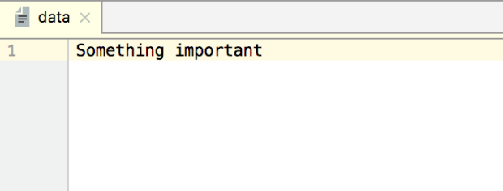

**图 7.3　data 文件中的内容**

这样就证实了在 EditText 中输入的内容确实已经成功保存到文件中了。

不过，只是成功将数据保存下来还不够，我们还需要想办法在下次启动程序的时候让这些数据能够还原到 EditText 中，因此接下来我们就要学习一下如何从文件中读取数据。

### 7.2.2　从文件中读取数据

类似于将数据存储到文件中，`Context` 类中还提供了一个 `openFileInput()` 方法，用于从文件中读取数据。这个方法要比 `openFileOutput()` 简单一些，它只接收一个参数，即要读取的文件名，然后系统会自动到/data/data/\<package name\>/files/目录下加载这个文件，并返回一个 `FileInputStream` 对象，得到这个对象之后，再通过流的方式就可以将数据读取出来了。

以下是一段简单的代码示例，展示了如何从文件中读取文本数据：

```Kotlin
fun load(): String {
    val content = StringBuilder()
    try {
        val input = openFileInput("data")
        val reader = BufferedReader(InputStreamReader(input))
        reader.use {
            reader.forEachLine {
                content.append(it)
            }
        }
    } catch (e: IOException) {
        e.printStackTrace()
    }
    return content.toString()
}
```

在这段代码中，首先通过 `openFileInput()` 方法获取了一个 `FileInputStream` 对象，然后借助它又构建出了一个 `InputStreamReader` 对象，接着再使用 `InputStreamReader` 构建出一个 `BufferedReader` 对象，这样我们就可以通过 `BufferedReader` 将文件中的数据一行行读取出来，并拼接到 `StringBuilder` 对象当中，最后将读取的内容返回就可以了。

注意，这里从文件中读取数据使用了一个 `forEachLine` 函数，这也是 Kotlin 提供的一个内置扩展函数，它会将读到的每行内容都回调到 Lambda 表达式中，我们在 Lambda 表达式中完成拼接逻辑即可。

了解了从文件中读取数据的方法，那么我们就来继续完善上一小节中的例子，使得重新启动程序时 EditText 中能够保留我们上次输入的内容。修改 MainActivity 中的代码，如下所示：

```Kotlin
class MainActivity : AppCompatActivity() {

    override fun onCreate(savedInstanceState: Bundle?) {
        super.onCreate(savedInstanceState)
        setContentView(R.layout.activity_main)
        val inputText = load()
        if (inputText.isNotEmpty()) {
            editText.setText(inputText)
            editText.setSelection(inputText.length)
            Toast.makeText(this, "Restoring succeeded", Toast.LENGTH_SHORT).show()
        }
    }

    private fun load(): String {
        val content = StringBuilder()
        try {
            val input = openFileInput("data")
            val reader = BufferedReader(InputStreamReader(input))
            reader.use {
                reader.forEachLine {
                    content.append(it)
                }
            }
        } catch (e: IOException) {
            e.printStackTrace()
        }
        return content.toString()
    }
    ...
}
```

可以看到，这里的思路非常简单，在 `onCreate()` 方法中调用 `load()` 方法读取文件中存储的文本内容，如果读到的内容不为空，就调用 EditText 的 `setText()` 方法将内容填充到 EditText 里，并调用 `setSelection()` 方法将输入光标移动到文本的末尾位置以便继续输入，然后弹出一句还原成功的提示。`load()` 方法中的细节我们在前面已经讲过，这里就不再赘述了。

现在重新运行一下程序，刚才保存的 `Something important` 字符串肯定会被填充到 EditText 中，然后编写一点其他的内容，比如在 EditText 中输入“Hello world”，接着按下 Back 键退出程序，再重新启动程序，这时刚才输入的内容并不会丢失，而是还原到了 EditText 中，如图 7.4 所示。

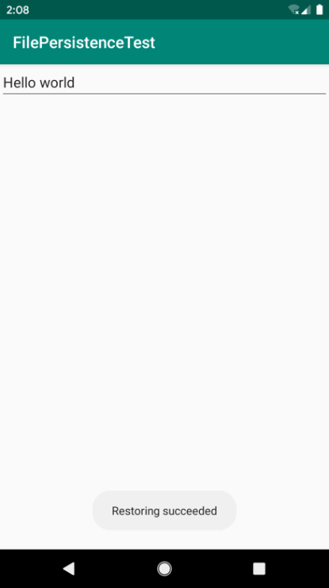

**图 7.4　成功还原保存的内容**

这样我们就已经把文件存储方面的知识学习完了，其实所用到的核心技术就是 `Context` 类中提供的 `openFileInput()` 和 `openFileOutput()` 方法，之后就是利用各种流来进行读写操作。

不过，正如我前面所说，文件存储的方式并不适合用于保存一些较为复杂的结构型数据，因此，下面我们就来学习一下 Android 中另一种数据持久化的方式，它比文件存储更加简单易用，而且可以很方便地对某些指定的数据进行读写操作。

## 7.3　SharedPreferences 存储

不同于文件的存储方式，SharedPreferences 是使用键值对的方式来存储数据的。也就是说，当保存一条数据的时候，需要给这条数据提供一个对应的键，这样在读取数据的时候就可以通过这个键把相应的值取出来。而且 SharedPreferences 还支持多种不同的数据类型存储，如果存储的数据类型是整型，那么读取出来的数据也是整型的；如果存储的数据是一个字符串，那么读取出来的数据仍然是字符串。

这样你应该就能明显地感觉到，使用 SharedPreferences 进行数据持久化要比使用文件方便很多，下面我们就来看一下它的具体用法吧。

### 7.3.1　将数据存储到 SharedPreferences 中

要想使用 SharedPreferences 存储数据，首先需要获取 `SharedPreferences` 对象。Android 中主要提供了以下两种方法用于得到 `SharedPreferences` 对象。

1. **`Context`** **类中的** **`getSharedPreferences()`**  **方法**

   此方法接收两个参数：第一个参数用于指定 SharedPreferences 文件的名称，如果指定的文件不存在则会创建一个，SharedPreferences 文件都是存放在/data/data/\<package name\>/shared_prefs/目录下的；第二个参数用于指定操作模式，目前只有默认的 `MODE_PRIVATE` 这一种模式可选，它和直接传入 0 的效果是相同的，表示只有当前的应用程序才可以对这个 SharedPreferences 文件进行读写。其他几种操作模式均已被废弃，`MODE_WORLD_READABLE` 和 `MODE_WORLD_WRITEABLE` 这两种模式是在 Android 4.2 版本中被废弃的，`MODE_MULTI_PROCESS` 模式是在 Android 6.0 版本中被废弃的。
2. **`Activity`** **类中的** **`getPreferences()`**  **方法**

   这个方法和 Context 中的 `getSharedPreferences()` 方法很相似，不过它只接收一个操作模式参数，因为使用这个方法时会自动将当前 `Activity` 的类名作为 SharedPreferences 的文件名。

   得到了 `SharedPreferences` 对象之后，就可以开始向 SharedPreferences 文件中存储数据了，主要可以分为 3 步实现。

   \(1\) 调用 `SharedPreferences` 对象的 `edit()` 方法获取一个 `SharedPreferences.Editor` 对象。

   \(2\) 向 `SharedPreferences.Editor` 对象中添加数据，比如添加一个布尔型数据就使用 `putBoolean()` 方法，添加一个字符串则使用 `putString()` 方法，以此类推。

   \(3\) 调用 `apply()` 方法将添加的数据提交，从而完成数据存储操作。

   不知不觉中已经将理论知识介绍得挺多了，那我们就赶快通过一个例子来体验一下 SharedPreferences 存储的用法吧。新建一个 SharedPreferencesTest 项目，然后修改 activity_main.xml 中的代码，如下所示：

   ```Kotlin
   <LinearLayout xmlns:android="http://schemas.android.com/apk/res/android"
       android:layout_width="match_parent"
       android:layout_height="match_parent"
       android:orientation="vertical" >

       <Button
           android:id="@+id/saveButton"
           android:layout_width="match_parent"
           android:layout_height="wrap_content"
           android:text="Save Data"
           />

   </LinearLayout>
   ```

   这里我们不做任何复杂的功能，只是简单地放置了一个按钮，用于将一些数据存储到 SharedPreferences 文件当中。然后修改 MainActivity 中的代码，如下所示：

   ```Kotlin
   class MainActivity : AppCompatActivity() {

       override fun onCreate(savedInstanceState: Bundle?) {
           super.onCreate(savedInstanceState)
           setContentView(R.layout.activity_main)
           saveButton.setOnClickListener {
               val editor = getSharedPreferences("data", Context.MODE_PRIVATE).edit()
               editor.putString("name", "Tom")
               editor.putInt("age", 28)
               editor.putBoolean("married", false)
               editor.apply()
           }
       }

   }
   ```

   可以看到，这里首先给按钮注册了一个点击事件，然后在点击事件中通过 `getSharedPreferences()` 方法指定 SharedPreferences 的文件名为 data，并得到了 `SharedPreferences.Editor` 对象。接着向这个对象中添加了 3 条不同类型的数据，最后调用 `apply()` 方法进行提交，从而完成了数据存储的操作。

   很简单吧？现在就可以运行一下程序了。进入程序的主界面后，点击一下“Save Data”按钮。这时的数据应该已经保存成功了，不过为了证实一下，我们还是要借助 Device File Explorer 来进行查看。打开 Device File Explorer，然后进入/data/data/com.example.sharedpreferencestest/shared_prefs/目录下，可以看到生成了一个 data.xml 文件，如图 7.5 所示。

   

   **图 7.5　生成的 data.xml 文件**

   接下来同样是双击打开这个文件，里面的内容如图 7.6 所示。

   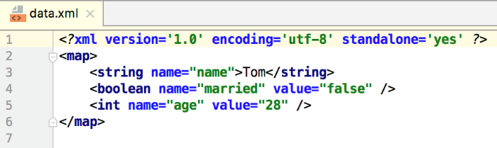

   **图 7.6　data.xml 文件中的内容**

   可以看到，我们刚刚在按钮的点击事件中添加的所有数据都已经成功保存下来了，并且 SharedPreferences 文件是使用 XML 格式来对数据进行管理的。

   那么接下来我们自然要看一看，如何从 SharedPreferences 文件中去读取这些存储的数据了。

### 7.3.2　从 SharedPreferences 中读取数据

你应该已经感觉到了，使用 SharedPreferences 存储数据是非常简单的，不过下面还有更好的消息，因为从 SharedPreferences 文件中读取数据会更加简单。`SharedPreferences` 对象中提供了一系列的 `get` 方法，用于读取存储的数据，每种 `get` 方法都对应了 `SharedPreferences.Editor` 中的一种 `put` 方法，比如读取一个布尔型数据就使用 `getBoolean()` 方法，读取一个字符串就使用 `getString()` 方法。这些 `get` 方法都接收两个参数：第一个参数是键，传入存储数据时使用的键就可以得到相应的值了；第二个参数是默认值，即表示当传入的键找不到对应的值时会以什么样的默认值进行返回。

我们还是通过例子来实际体验一下吧，仍然是在 SharedPreferencesTest 项目的基础上继续开发，修改 activity_main.xml 中的代码，如下所示：

```xml
<LinearLayout xmlns:android="http://schemas.android.com/apk/res/android"
    android:layout_width="match_parent"
    android:layout_height="match_parent"
    android:orientation="vertical" >

    <Button
        android:id="@+id/saveButton"
        android:layout_width="match_parent"
        android:layout_height="wrap_content"
        android:text="Save Data"
        />

    <Button
        android:id="@+id/restoreButton"
        android:layout_width="match_parent"
        android:layout_height="wrap_content"
        android:text="Restore Data"
        />

</LinearLayout>
```

这里增加了一个还原数据的按钮，我们希望通过点击这个按钮来从 SharedPreferences 文件中读取数据。修改 MainActivity 中的代码，如下所示：

```Kotlin
class MainActivity : AppCompatActivity() {

    override fun onCreate(savedInstanceState: Bundle?) {
        super.onCreate(savedInstanceState)
        setContentView(R.layout.activity_main)
        ...
        restoreButton.setOnClickListener {
            val prefs = getSharedPreferences("data", Context.MODE_PRIVATE)
            val name = prefs.getString("name", "")
            val age = prefs.getInt("age", 0)
            val married = prefs.getBoolean("married", false)
            Log.d("MainActivity", "name is $name")
            Log.d("MainActivity", "age is $age")
            Log.d("MainActivity", "married is $married")
        }
    }

}
```

可以看到，我们在还原数据按钮的点击事件中首先通过 `getSharedPreferences()` 方法得到了 `SharedPreferences` 对象，然后分别调用它的 `getString()`、`getInt()` 和 `getBoolean()` 方法，去获取前面所存储的姓名、年龄和是否已婚，如果没有找到相应的值，就会使用方法中传入的默认值来代替，最后通过 Log 将这些值打印出来。

现在重新运行一下程序，并点击界面上的“Restore data”按钮，然后查看 Logcat 中的打印信息，如图 7.7 所示。

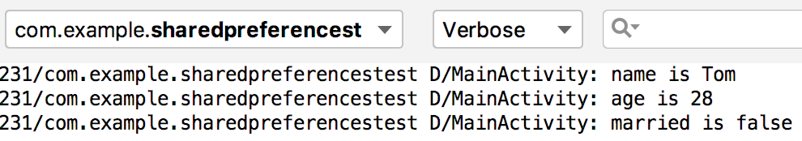

**图 7.7　打印 data.xml 中存储的内容**

所有之前存储的数据都成功读取出来了！通过这个例子，我们就把 SharedPreferences 存储的知识学习完了。相比之下，SharedPreferences 存储确实要比文本存储简单方便了许多，应用场景也多了不少，比如很多应用程序中的偏好设置功能其实就使用到了 SharedPreferences 技术。那么下面我们就来编写一个记住密码的功能，相信通过这个例子能够加深你对 SharedPreferences 的理解。

### 7.3.3　实现记住密码功能

既然是实现记住密码的功能，那么我们就不需要从头去写了，因为在上一章中的最佳实践部分已经编写过一个登录界面了，有可以重用的代码为什么不用呢？那就首先打开 BroadcastBestPractice 项目，编辑一下登录界面的布局。修改 activity_login.xml 中的代码，如下所示：

```xml
<LinearLayout xmlns:android="http://schemas.android.com/apk/res/android"
    android:orientation="vertical"
    android:layout_width="match_parent"
    android:layout_height="match_parent">

    ...

    <LinearLayout
        android:orientation="horizontal"
        android:layout_width="match_parent"
        android:layout_height="wrap_content">

        <CheckBox
            android:id="@+id/rememberPass"
            android:layout_width="wrap_content"
            android:layout_height="wrap_content" />

        <TextView
            android:layout_width="wrap_content"
            android:layout_height="wrap_content"
            android:textSize="18sp"
            android:text="Remember password" />

    </LinearLayout>

    <Button
        android:id="@+id/login"
        android:layout_width="match_parent"
        android:layout_height="60dp"
        android:text="Login" />

</LinearLayout>
```

这里使用了一个新控件：CheckBox。这是一个复选框控件，用户可以通过点击的方式进行选中和取消，我们就使用这个控件来表示用户是否需要记住密码。

然后修改 LoginActivity 中的代码，如下所示：

```Kotlin
class LoginActivity : BaseActivity() {

    override fun onCreate(savedInstanceState: Bundle?) {
        super.onCreate(savedInstanceState)
        setContentView(R.layout.activity_login)
        val prefs = getPreferences(Context.MODE_PRIVATE)
        val isRemember = prefs.getBoolean("remember_password", false)
        if (isRemember) {
            // 将账号和密码都设置到文本框中
            val account = prefs.getString("account", "")
            val password = prefs.getString("password", "")
            accountEdit.setText(account)
            passwordEdit.setText(password)
            rememberPass.isChecked = true
        }
        login.setOnClickListener {
            val account = accountEdit.text.toString()
            val password = passwordEdit.text.toString()
            // 如果账号是admin且密码是123456，就认为登录成功
            if (account == "admin" && password == "123456") {
                val editor = prefs.edit()
                if (rememberPass.isChecked) { // 检查复选框是否被选中
                    editor.putBoolean("remember_password", true)
                    editor.putString("account", account)
                    editor.putString("password", password)
                } else {
                    editor.clear()
                }
                editor.apply()
                val intent = Intent(this, MainActivity::class.java)
                startActivity(intent)
                finish()
            } else {
                Toast.makeText(this, "account or password is invalid",
                    Toast.LENGTH_SHORT).show()
            }
        }
    }

}
```

可以看到，这里首先在 `onCreate()` 方法中获取了 `SharedPreferences` 对象，然后调用它的 `getBoolean()` 方法去获取 `remember_password` 这个键对应的值。一开始当然不存在对应的值了，所以会使用默认值 `false`，这样就什么都不会发生。接着在登录成功之后，会调用 CheckBox 的 `isChecked()` 方法来检查复选框是否被选中。如果被选中了，则表示用户想要记住密码，这时将 `remember_password` 设置为 `true`，然后把 `account` 和 `password` 对应的值都存入 SharedPreferences 文件中并提交；如果没有被选中，就简单地调用一下 `clear()` 方法，将 SharedPreferences 文件中的数据全部清除掉。

当用户选中了记住密码复选框，并成功登录一次之后，`remember_password` 键对应的值就是 `true` 了，这个时候如果重新启动登录界面，就会从 SharedPreferences 文件中将保存的账号和密码都读取出来，并填充到文本输入框中，然后把记住密码复选框选中，这样就完成记住密码的功能了。

现在重新运行一下程序，可以看到界面上多了一个记住密码复选框，如图 7.8 所示。


**图 7.8　带有记住密码复选框的登录界面**

然后账号输入 admin，密码输入 123456，并选中记住密码复选框，点击登录，就会跳转到 MainActivity。接着在 MainActivity 中发出一条强制下线广播，会让程序重新回到登录界面，此时你会发现，账号和密码已经自动填充到界面上了，如图 7.9 所示。

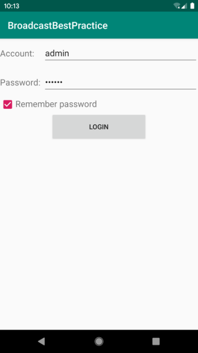

**图 7.9　实现记住账号密码功能**

这样我们就使用 SharedPreferences 技术将记住密码功能成功实现了，你是不是对 SharedPreferences 理解得更加深刻了呢？

不过需要注意，这里实现的记住密码功能仍然只是个简单的示例，不能在实际的项目中直接使用。因为将密码以明文的形式存储在 SharedPreferences 文件中是非常不安全的，很容易被别人盗取，因此在正式的项目里必须结合一定的加密算法对密码进行保护才行。

好了，关于 SharedPreferences 的内容就讲到这里，接下来我们要学习一下本章的重头戏：Android 中的数据库技术。

## 7.4　SQLite 数据库存储

在刚开始接触 Android 的时候，我甚至都不敢相信，Android 系统竟然是内置了数据库的！好吧，是我太孤陋寡闻了。SQLite 是一款轻量级的关系型数据库，它的运算速度非常快，占用资源很少，通常只需要几百 KB 的内存就足够了，因而特别适合在移动设备上使用。SQLite 不仅支持标准的 SQL 语法，还遵循了数据库的 ACID 事务，所以只要你以前使用过其他的关系型数据库，就可以很快地上手 SQLite。而 SQLite 又比一般的数据库要简单得多，它甚至不用设置用户名和密码就可以使用。Android 正是把这个功能极为强大的数据库嵌入到了系统当中，使得本地持久化的功能有了一次质的飞跃。

前面我们所学的文件存储和 `SharedPreferences` 存储毕竟只适用于保存一些简单的数据和键值对，当需要存储大量复杂的关系型数据的时候，你就会发现以上两种存储方式很难应付得了。比如我们手机的短信程序中可能会有很多个会话，每个会话中又包含了很多条信息内容，并且大部分会话还可能各自对应了通讯录中的某个联系人。很难想象如何用文件或者 `SharedPreferences` 来存储这些数据量大、结构性复杂的数据吧？但是使用数据库就可以做得到，那么我们就赶快来看一看，Android 中的 SQLite 数据库到底是如何使用的。

### 7.4.1　创建数据库

Android 为了让我们能够更加方便地管理数据库，专门提供了一个 `SQLiteOpenHelper` 帮助类，借助这个类可以非常简单地对数据库进行创建和升级。既然有好东西可以直接使用，那我们自然要尝试一下了，下面我就对 `SQLiteOpenHelper` 的基本用法进行介绍。

首先，你要知道 `SQLiteOpenHelper` 是一个抽象类，这意味着如果我们想要使用它，就需要创建一个自己的帮助类去继承它。`SQLiteOpenHelper` 中有两个抽象方法：`onCreate()` 和 `onUpgrade()`。我们必须在自己的帮助类里重写这两个方法，然后分别在这两个方法中实现创建和升级数据库的逻辑。

`SQLiteOpenHelper` 中还有两个非常重要的实例方法：`getReadableDatabase()` 和 `getWritableDatabase()`。这两个方法都可以创建或打开一个现有的数据库（如果数据库已存在则直接打开，否则要创建一个新的数据库），并返回一个可对数据库进行读写操作的对象。不同的是，当数据库不可写入的时候（如磁盘空间已满），`getReadableDatabase()` 方法返回的对象将以只读的方式打开数据库，而 `getWritableDatabase()` 方法则将出现异常。

`SQLiteOpenHelper` 中有两个构造方法可供重写，一般使用参数少一点的那个构造方法即可。这个构造方法中接收 4 个参数：第一个参数是 `Context`，这个没什么好说的，必须有它才能对数据库进行操作；第二个参数是数据库名，创建数据库时使用的就是这里指定的名称；第三个参数允许我们在查询数据的时候返回一个自定义的 Cursor，一般传入 `null` 即可；第四个参数表示当前数据库的版本号，可用于对数据库进行升级操作。构建出 `SQLiteOpenHelper` 的实例之后，再调用它的 `getReadableDatabase()` 或 `getWritableDatabase()` 方法就能够创建数据库了，数据库文件会存放在/data/data/\<package name\>/databases/目录下。此时，重写的 `onCreate()` 方法也会得到执行，所以通常会在这里处理一些创建表的逻辑。

接下来还是让我们通过具体的例子来更加直观地体会 `SQLiteOpenHelper` 的用法吧，首先新建一个 DatabaseTest 项目。

这里我们希望创建一个名为 BookStore.db 的数据库，然后在这个数据库中新建一张 Book 表，表中有 id（主键）、作者、价格、页数和书名等列。创建数据库表当然还是需要用建表语句的，这里就要考验一下你的 SQL 基本功了，Book 表的建表语句如下所示：

```Kotlin
create table Book (
    id integer primary key autoincrement,
    author text,
    price real,
    pages integer,
    name text)
```

只要你对 SQL 方面的知识稍微有一些了解，上面的建表语句对你来说应该不难吧。SQLite 不像其他的数据库拥有众多繁杂的数据类型，它的数据类型很简单：`integer` 表示整型，`real` 表示浮点型，`text` 表示文本类型，`blob` 表示二进制类型。另外，在上述建表语句中，我们还使用了 `primary key` 将 id 列设为主键，并用 `autoincrement` 关键字表示 id 列是自增长的。

然后需要在代码中执行这条 SQL 语句，才能完成创建表的操作。新建 `MyDatabaseHelper` 类继承自 `SQLiteOpenHelper`，代码如下所示：

```Kotlin
class MyDatabaseHelper(val context: Context, name: String, version: Int) :
        SQLiteOpenHelper(context, name, null, version) {

    private val createBook = "create table Book (" +
            " id integer primary key autoincrement," +
            "author text," +
            "price real," +
            "pages integer," +
            "name text)"

    override fun onCreate(db: SQLiteDatabase) {
        db.execSQL(createBook)
        Toast.makeText(context, "Create succeeded", Toast.LENGTH_SHORT).show()
    }

    override fun onUpgrade(db: SQLiteDatabase, oldVersion: Int, newVersion: Int) {
    }

}
```

可以看到，我们把建表语句定义成了一个字符串变量，然后在 `onCreate()` 方法中又调用了 SQLiteDatabase 的 `execSQL()` 方法去执行这条建表语句，并弹出一个 Toast 提示创建成功，这样就可以保证在数据库创建完成的同时还能成功创建 Book 表。

现在修改 activity_main.xml 中的代码，如下所示：

```xml
<LinearLayout xmlns:android="http://schemas.android.com/apk/res/android"
    android:orientation="vertical"
    android:layout_width="match_parent"
    android:layout_height="match_parent"
    >

    <Button
        android:id="@+id/createDatabase"
        android:layout_width="match_parent"
        android:layout_height="wrap_content"
        android:text="Create Database"
        />

</LinearLayout>
```

布局文件很简单，就是加入了一个按钮，用于创建数据库。最后修改 MainActivity 中的代码，如下所示：

```Kotlin
class MainActivity : AppCompatActivity() {

    override fun onCreate(savedInstanceState: Bundle?) {
        super.onCreate(savedInstanceState)
        setContentView(R.layout.activity_main)
        val dbHelper = MyDatabaseHelper(this, "BookStore.db", 1)
        createDatabase.setOnClickListener {
            dbHelper.writableDatabase
        }
  }

}
```

这里我们在 `onCreate()` 方法中构建了一个 `MyDatabaseHelper` 对象，并且通过构造函数的参数将数据库名指定为 BookStore.db，版本号指定为 1，然后在“Create Database”按钮的点击事件里调用了 `getWritableDatabase()` 方法。这样当第一次点击“Create Database”按钮时，就会检测到当前程序中并没有 BookStore.db 这个数据库，于是会创建该数据库并调用 `MyDatabaseHelper` 中的 `onCreate()` 方法，这样 Book 表也就创建好了，然后会弹出一个 Toast 提示创建成功。再次点击“Create Database”按钮时，会发现此时已经存在 BookStore.db 数据库了，因此不会再创建一次。

现在就可以运行一下代码了，在程序主界面点击“Create Database”按钮，结果如图 7.10 所示。


**图 7.10　创建数据库成功**

此时 BookStore.db 数据库和 Book 表应该已经创建成功了，因为当你再次点击“Create Database”按钮时，不会再有 Toast 弹出。可是又回到了之前的那个老问题：怎样才能证实它们的确创建成功了？

这里我们仍然还是可以使用 Device File Explorer，但是这个工具最多只能看到 databases 目录下出现了一个 BookStore.db 文件，是无法查看 Book 表的。因此我们还需要借助一个叫作 Database Navigator 的插件工具。

Android Studio 是基于 IntelliJ IDEA 进行开发的，因此 IntelliJ IDEA 中各种丰富的插件在 Android Studio 中也可以使用。从 Android Studio 导航栏中打开 Preferences→Plugins，就可以进入插件管理界面了，如图 7.11 所示。


**图 7.11　插件管理界面**

这是一个官方的插件市场，你只需要在搜索框中输入“Database Navigator”，即可找到我们需要的插件，如图 7.12 所示。

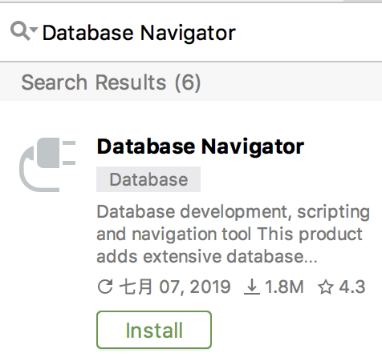

**图 7.12　Database Navigator 插件**

点击“Install”，Android Studio 会自动下载并安装插件，安装完成后根据提示重启 Android Studio，新安装的插件就可以正常工作了。

现在打开 Device File Explorer，然后进入/data/data/com.example.databasetest/databases/目录下，可以看到已经存在了一个 BookStore.db 文件，如图 7.13 所示。


**图 7.13　生成的 BookStore.db 文件**

这个目录下还存在另外一个 BookStore.db-journal 文件，这是一个为了让数据库能够支持事务而产生的临时日志文件，通常情况下这个文件的大小是 0 字节，我们可以暂时不用管它。

现在对着 BookStore.db 文件右击 →Save As，将它从模拟器导出到你的计算机的任意位置。然后观察 Android Studio 的左侧边栏，现在应该多出了一个 DB Browser 工具，这就是我们刚刚安装的插件了。如果你的左侧边栏中找不到这个工具，也可以使用快捷键 Ctrl + Shift + A（Mac 系统是 command + shift + A）打开搜索功能，在搜索框中输入“DB Browser”即可找到这个工具。

为了打开刚刚导出的数据库文件，我们需要点击这个工具左上角的加号按钮，并选择 SQLite 选项，如图 7.14 所示。

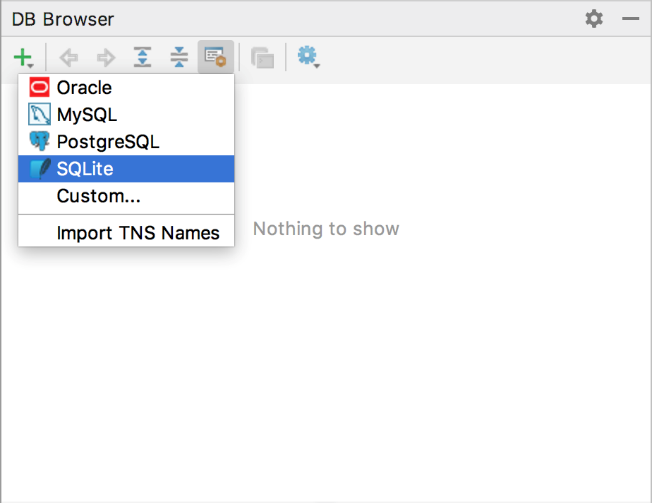

**图 7.14　在 DB Browser 中选择 SQLite**

然后在弹出窗口的 Database 配置中选择我们刚才导出的 BookStore.db 文件，如图 7.15 所示。

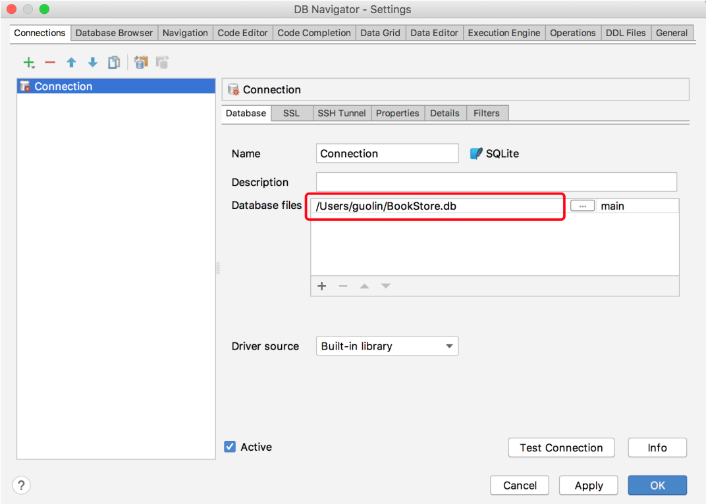

**图 7.15　选择 BookStore.db 文件**

点击“OK”完成配置，这个时候 DB Browser 中就会显示出 BookStore.db 数据库里所有的内容了，如图 7.16 所示。

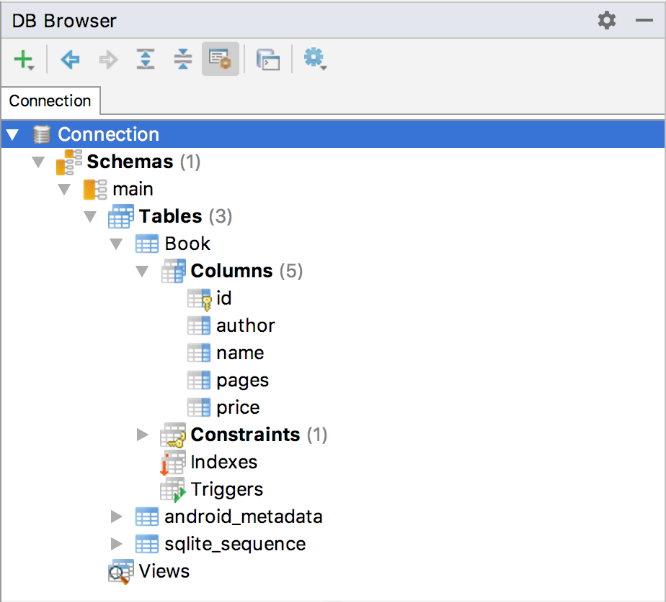

**图 7.16　BookStore.db 数据库中的内容**

可以看到，BookStore.db 数据库中确实存在了一张 Book 表，并且 Book 表中的列也和我们前面使用的建表语句完全匹配，由此证明 BookStore.db 数据库和 Book 表确实已经创建成功了。

### 7.4.2　升级数据库

如果你足够细心，一定会发现 `MyDatabaseHelper` 中还有一个空方法呢！没错，`onUpgrade()` 方法是用于对数据库进行升级的，它在整个数据库的管理工作当中起着非常重要的作用，可千万不能忽视它哟。

目前，DatabaseTest 项目中已经有一张 Book 表用于存放书的各种详细数据，如果我们想再添加一张 Category 表用于记录图书的分类，该怎么做呢？

比如 Category 表中有 `id`（主键）、分类名和分类代码这几个列，那么建表语句就可以写成：

```Kotlin
create table Category (
    id integer primary key autoincrement,
    category_name text,
    category_code integer)
```

接下来我们将这条建表语句添加到 `MyDatabaseHelper` 中，代码如下所示：

```Kotlin
class MyDatabaseHelper(val context: Context, name: String, version: Int):
        SQLiteOpenHelper(context, name, null, version) {
    ...
    private val createCategory = "create table Category (" +
            "id integer primary key autoincrement," +
            "category_name text," +
            "category_code integer)"

    override fun onCreate(db: SQLiteDatabase) {
        db.execSQL(createBook)
        db.execSQL(createCategory)
        Toast.makeText(context, "Create succeeded", Toast.LENGTH_SHORT).show()
    }

    override fun onUpgrade(db: SQLiteDatabase, oldVersion: Int, newVersion: Int) {
    }

}
```

看上去好像都挺对的吧？现在我们重新运行一下程序，并点击“Create Database”按钮，咦？竟然没有弹出创建成功的提示。当然，你也可以通过 DB Browser 工具到数据库中再去检查一下，这样你会更加确认 Category 表没有创建成功！

其实没有创建成功的原因不难思考，因为此时 BookStore.db 数据库已经存在了，之后不管我们怎样点击“Create Database”按钮，`MyDatabaseHelper` 中的 `onCreate()` 方法都不会再次执行，因此新添加的表也就无法得到创建了。

解决这个问题的办法也相当简单，只需要先将程序卸载，然后重新运行，这时 BookStore.db 数据库已经不存在了，如果再点击“Create Database”按钮，`MyDatabaseHelper` 中的 `onCreate()` 方法就会执行，这时 Category 表就可以创建成功了。

不过，通过卸载程序的方式来新增一张表毫无疑问是很极端的做法，其实我们只需要巧妙地运用 `SQLiteOpenHelper` 的升级功能，就可以很轻松地解决这个问题。修改 `MyDatabaseHelper` 中的代码，如下所示：

```Kotlin
class MyDatabaseHelper(val context: Context, name: String, version: Int):
        SQLiteOpenHelper(context, name, null, version) {
    ...
    override fun onUpgrade(db: SQLiteDatabase, oldVersion: Int, newVersion: Int) {
        db.execSQL("drop table if exists Book")
        db.execSQL("drop table if exists Category")
        onCreate(db)
    }

}
```

可以看到，我们在 `onUpgrade()` 方法中执行了两条 `DROP` 语句，如果发现数据库中已经存在 Book 表或 Category 表，就将这两张表删除，然后调用 `onCreate()` 方法重新创建。这里先将已经存在的表删除，是因为如果在创建表时发现这张表已经存在了，就会直接报错。

接下来的问题就是如何让 `onUpgrade()` 方法能够执行了。还记得 `SQLiteOpenHelper` 的构造方法里接收的第四个参数吗？它表示当前数据库的版本号，之前我们传入的是 1，现在只要传入一个比 1 大的数，就可以让 `onUpgrade()` 方法得到执行了。修改 MainActivity 中的代码，如下所示：

```Kotlin
class MainActivity : AppCompatActivity() {

    override fun onCreate(savedInstanceState: Bundle?) {
        super.onCreate(savedInstanceState)
        setContentView(R.layout.activity_main)
        val dbHelper = MyDatabaseHelper(this, "BookStore.db", 2)
        createDatabase.setOnClickListener {
            dbHelper.writableDatabase
        }
    }

}
```

这里将数据库版本号指定为 2，表示我们对数据库进行升级了。现在重新运行程序，并点击“Create Database”按钮，这时就会再次弹出创建成功的提示。

为了验证一下 Category 表是不是已经创建成功了，我们还可以使用同样的方式将 BookStore.db 文件导出到计算机本地，并覆盖之前的 BookStore.db 文件，然后在 DB Browser 中重新导入，这样就会加载新的 BookStore.db 文件了，如图 7.17 所示。


**图 7.17　BookStore.db 数据库升级后的内容**

可以看到，Category 表已经创建成功了，说明我们的升级功能的确起到了作用。

### 7.4.3　添加数据

现在你已经掌握了创建和升级数据库的方法，接下来就该学习一下如何对表中的数据进行操作了。其实我们可以对数据进行的操作无非有 4 种，即 CRUD。其中 C 代表添加（create），R 代表查询（retrieve），U 代表更新（update），D 代表删除（delete）。每一种操作都对应了一种 SQL 命令，如果你比较熟悉 SQL 语言的话，一定会知道添加数据时使用 `insert`，查询数据时使用 `select`，更新数据时使用 `update`，删除数据时使用 `delete`。但是开发者的水平是参差不齐的，未必每一个人都能非常熟悉 SQL 语言，因此 Android 提供了一系列的辅助性方法，让你在 Android 中即使不用编写 SQL 语句，也能轻松完成所有的 CRUD 操作。

前面我们已经知道，调用 `SQLiteOpenHelper` 的 `getReadableDatabase()` 或 `getWritableDatabase()` 方法是可以用于创建和升级数据库的，不仅如此，这两个方法还都会返回一个 `SQLiteDatabase` 对象，借助这个对象就可以对数据进行 CRUD 操作了。

那么下面我们首先学习一下如何向数据库的表中添加数据吧。`SQLiteDatabase` 中提供了一个 `insert()` 方法，专门用于添加数据。它接收 3 个参数：第一个参数是表名，我们希望向哪张表里添加数据，这里就传入该表的名字；第二个参数用于在未指定添加数据的情况下给某些可为空的列自动赋值 `NULL`，一般我们用不到这个功能，直接传入 `null` 即可；第三个参数是一个 `ContentValues` 对象，它提供了一系列的 `put()` 方法重载，用于向 `ContentValues` 中添加数据，只需要将表中的每个列名以及相应的待添加数据传入即可。

介绍完了基本用法，接下来还是让我们通过例子来亲身体验一下如何添加数据吧。修改 activity_main.xml 中的代码，如下所示：

```xml
<LinearLayout xmlns:android="http://schemas.android.com/apk/res/android"
    android:orientation="vertical"
    android:layout_width="match_parent"
    android:layout_height="match_parent"
    >

    ...

    <Button
        android:id="@+id/addData"
        android:layout_width="match_parent"
        android:layout_height="wrap_content"
        android:text="Add Data"
        />
</LinearLayout>
```

可以看到，我们在布局文件中又新增了一个按钮，稍后就会在这个按钮的点击事件里编写添加数据的逻辑。接着修改 MainActivity 中的代码，如下所示：

```Kotlin
class MainActivity : AppCompatActivity() {

    override fun onCreate(savedInstanceState: Bundle?) {
        super.onCreate(savedInstanceState)
        setContentView(R.layout.activity_main)
        val dbHelper = MyDatabaseHelper(this, "BookStore.db", 2)
        ...
        addData.setOnClickListener {
            val db = dbHelper.writableDatabase
            val values1 = ContentValues().apply {
                // 开始组装第一条数据
                put("name", "The Da Vinci Code")
                put("author", "Dan Brown")
                put("pages", 454)
                put("price", 16.96)
            }
            db.insert("Book", null, values1) // 插入第一条数据
            val values2 = ContentValues().apply {
                // 开始组装第二条数据
                put("name", "The Lost Symbol")
                put("author", "Dan Brown")
                put("pages", 510)
                put("price", 19.95)
            }
            db.insert("Book", null, values2) // 插入第二条数据
        }
    }

}
```

在添加数据按钮的点击事件里，我们先获取了 `SQLiteDatabase` 对象，然后使用 `ContentValues` 对要添加的数据进行组装。如果你比较细心的话，应该会发现这里只对 Book 表里其中 4 列的数据进行了组装，id 那一列并没给它赋值。这是因为在前面创建表的时候，我们就将 id 列设置为自增长了，它的值会在入库的时候自动生成，所以不需要手动赋值了。接下来调用了 `insert()` 方法将数据添加到表当中，注意这里我们添加了两条数据。

好了，现在可以重新运行一下程序了，界面如图 7.18 所示。

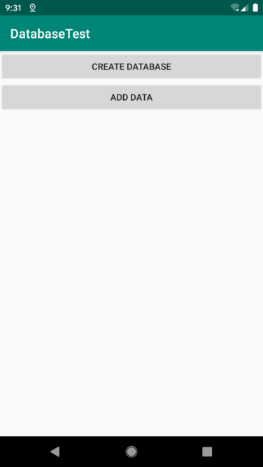

**图 7.18　加入添加数据按钮**

点击一下“Add Data”按钮，此时两条数据应该都已经添加成功了。我们仍然可以使用 DB Browser 来验证一下，同样先将 BookStore.db 文件导出到本地，然后重新加载数据库，想要查询哪张表的内容，只需要双击这张表就可以了，这里我们双击 Book 表，会弹出一个如图 7.19 所示的窗口。


**图 7.19　设置查询条件的窗口**

这个窗口是用来设置查询条件的，这里我们不需要设置任何查询条件，直接点击窗口下方的“No Filter”按钮即可，然后就可以看到如图 7.20 所示的数据了。


**图 7.20　Book 表中的数据**

由此可以看出，我们刚刚组装的两条数据都已经准确无误地添加到 Book 表中了。

### 7.4.4　更新数据

学习完了如何向表中添加数据，接下来我们看看怎样才能修改表中已有的数据。`SQLiteDatabase` 中提供了一个非常好用的 `update()` 方法，用于对数据进行更新。这个方法接收 4 个参数：第一个参数和 `insert()` 方法一样，也是表名，指定更新哪张表里的数据；第二个参数是 `ContentValues` 对象，要把更新数据在这里组装进去；第三、第四个参数用于约束更新某一行或某几行中的数据，不指定的话默认会更新所有行。

那么接下来，我们仍然是在 DatabaseTest 项目的基础上修改，看一下更新数据的具体用法。比如刚才添加到数据库里的第一本书，由于过了畅销季，卖得不是很火了，现在需要通过降低价格的方式来吸引更多的顾客，我们应该怎么操作呢？首先修改 activity_main.xml 中的代码，如下所示：

```xml
<LinearLayout xmlns:android="http://schemas.android.com/apk/res/android"
    android:orientation="vertical"
    android:layout_width="match_parent"
    android:layout_height="match_parent"
    >

    ...

    <Button
        android:id="@+id/updateData"
        android:layout_width="match_parent"
        android:layout_height="wrap_content"
        android:text="Update Data"
        />
</LinearLayout>
```

布局文件中的代码已经非常简单了，就是添加了一个用于更新数据的按钮。然后修改 MainActivity 中的代码，如下所示：

```Kotlin
class MainActivity : AppCompatActivity() {

    override fun onCreate(savedInstanceState: Bundle?) {
        super.onCreate(savedInstanceState)
        setContentView(R.layout.activity_main)
        val dbHelper = MyDatabaseHelper(this, "BookStore.db", 2)
        ...
        updateData.setOnClickListener {
            val db = dbHelper.writableDatabase
            val values = ContentValues()
            values.put("price", 10.99)
            db.update("Book", values, "name = ?", arrayOf("The Da Vinci Code"))
        }
    }

}
```

这里在更新数据按钮的点击事件里面构建了一个 `ContentValues` 对象，并且只给它指定了一组数据，说明我们只是想把价格这一列的数据更新成 10.99。然后调用了 `SQLiteDatabase` 的 `update()` 方法执行具体的更新操作，可以看到，这里使用了第三、第四个参数来指定具体更新哪几行。第三个参数对应的是 SQL 语句的 `where` 部分，表示更新所有 `name` 等于 `?` 的行，而 `?` 是一个占位符，可以通过第四个参数提供的一个字符串数组为第三个参数中的每个占位符指定相应的内容，`arrayOf()` 方法是 Kotlin 提供的一种用于便捷创建数组的内置方法。因此上述代码想表达的意图就是将 *The Da Vinci Code* 这本书的价格改成 10.99。

现在重新运行一下程序，界面如图 7.21 所示。

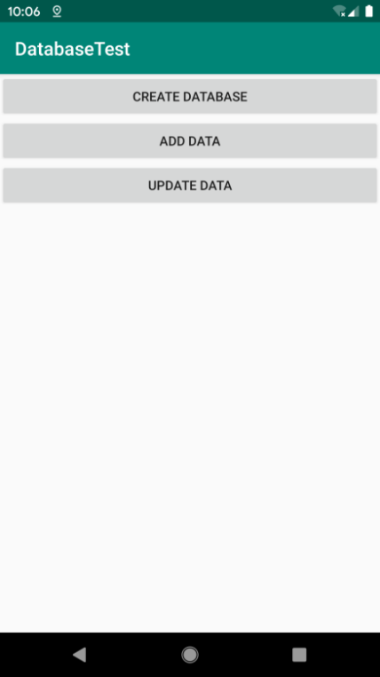

**图 7.21　加入更新数据按钮**

点击“Update Data”按钮，再次使用同样的操作方式查看 Book 表中的数据情况，结果如图 7.22 所示。


**图 7.22　查看更新后的数据**

可以看到，*The Da Vinci Code* 这本书的价格已经被成功改为 10.99 了。

### 7.4.5　删除数据

怎么样？添加和更新数据的功能还挺简单的吧，代码也不多，理解起来又容易，那么我们要马不停蹄地开始学习下一种操作了，即从表中删除数据。

删除数据对你来说应该就更简单了，因为它所需要用到的知识点你已经全部学过了。`SQLiteDatabase` 中提供了一个 `delete()` 方法，专门用于删除数据。这个方法接收 3 个参数：第一个参数仍然是表名，这个没什么好说的；第二、第三个参数用于约束删除某一行或某几行的数据，不指定的话默认会删除所有行。

是不是理解起来很轻松了？那我们就继续动手实践吧，修改 activity_main.xml 中的代码，如下所示：

```xml
<LinearLayout xmlns:android="http://schemas.android.com/apk/res/android"
    android:orientation="vertical"
    android:layout_width="match_parent"
    android:layout_height="match_parent"
    >

    ...

    <Button
        android:id="@+id/deleteData"
        android:layout_width="match_parent"
        android:layout_height="wrap_content"
        android:text="Delete Data"
        />
</LinearLayout>
```

仍然是在布局文件中添加了一个按钮，用于删除数据。然后修改 MainActivity 中的代码，如下所示：

```Kotlin
class MainActivity : AppCompatActivity() {

    override fun onCreate(savedInstanceState: Bundle?) {
        super.onCreate(savedInstanceState)
        setContentView(R.layout.activity_main)
        val dbHelper = MyDatabaseHelper(this, "BookStore.db", 2)
        ...
        deleteData.setOnClickListener {
            val db = dbHelper.writableDatabase
            db.delete("Book", "pages > ?", arrayOf("500"))
        }
    }

}
```

可以看到，我们在删除按钮的点击事件里指明删除 Book 表中的数据，并且通过第二、第三个参数来指定仅删除那些页数超过 500 页的书。当然这个需求很奇怪，这里仅仅是为了做个测试。你可以先查看一下当前 Book 表里的数据，其中 *The Lost Symbol* 这本书的页数超过了 500 页，也就是说当我们点击删除按钮时，这条记录应该会被删除。

现在重新运行一下程序，界面如图 7.23 所示。

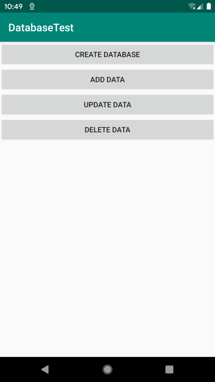

**图 7.23　加入删除数据按钮**

点击“Delete Data”按钮，再次查看表中的数据情况，结果如图 7.24 所示。


**图 7.24　查看删除后的数据**

### 7.4.6　查询数据

终于到最后一种操作了，掌握了查询数据的方法之后，你就将数据库的 CRUD 操作全部学完了。不过千万不要因此而放松，因为查询数据是 CRUD 中最复杂的一种操作。

SQL 的全称是 Structured Query Language，翻译成中文就是结构化查询语言。它的大部分功能体现在“查”这个字上，而“增删改”只是其中的一小部分功能。由于 SQL 查询涉及的内容实在是太多了，因此在这里我不准备对它展开讲解，而是只会介绍 Android 上的查询功能。如果你对 SQL 语言非常感兴趣，可以找一本专门介绍 SQL 的书进行学习。

相信你已经猜到了，SQLiteDatabase 中还提供了一个 `query()` 方法用于对数据进行查询。这个方法的参数非常复杂，最短的一个方法重载也需要传入 7 个参数。那我们就先来看一下这 7 个参数各自的含义吧。第一个参数不用说，当然还是表名，表示我们希望从哪张表中查询数据。第二个参数用于指定去查询哪几列，如果不指定则默认查询所有列。第三、第四个参数用于约束查询某一行或某几行的数据，不指定则默认查询所有行的数据。第五个参数用于指定需要去 group by 的列，不指定则表示不对查询结果进行 group by 操作。第六个参数用于对 group by 之后的数据进行进一步的过滤，不指定则表示不进行过滤。第七个参数用于指定查询结果的排序方式，不指定则表示使用默认的排序方式。更多详细的内容可以参考表 7.1。其他几个 `query()` 方法的重载也大同小异，你可以自己去研究一下，这里就不再进行介绍了。

**表 7.1** **`query()`**  **方法参数的详细解释**

|`query()` 方法参数|对应 SQL 部分|描述|
| ---------| -------------| --------------------------|
|`table`|`from table_name`|指定查询的表名|
|`columns`|`select column1, column2`|指定查询的列名|
|`selection`|`where column = value`|指定 `where` 的约束条件|
|`selectionArgs`|\-|为 `where` 中的占位符提供具体的值|
|`groupBy`|`group by column`|指定需要 `group by` 的列|
|`having`|`having column = value`|对 `group by` 后的结果进一步约束|
|`orderBy`|`order by column1, column2`|指定查询结果的排序方式|

虽然 `query()` 方法的参数非常多，但是不要对它产生畏惧，因为我们不必为每条查询语句都指定所有的参数，多数情况下只需要传入少数几个参数就可以完成查询操作了。调用 `query()` 方法后会返回一个 `Cursor` 对象，查询到的所有数据都将从这个对象中取出。

下面还是让我们通过具体的例子来体验一下查询数据的用法，修改 activity_main.xml 中的代码，如下所示：

```xml
<LinearLayout xmlns:android="http://schemas.android.com/apk/res/android"
    android:orientation="vertical"
    android:layout_width="match_parent"
    android:layout_height="match_parent"
    >

    ...

    <Button
        android:id="@+id/queryData"
        android:layout_width="match_parent"
        android:layout_height="wrap_content"
        android:text="Query Data"
        />
</LinearLayout>
```

这个已经没什么好说的了，添加了一个按钮用于查询数据。然后修改 MainActivity 中的代码，如下所示：

```Kotlin
class MainActivity : AppCompatActivity() {

    override fun onCreate(savedInstanceState: Bundle?) {
        super.onCreate(savedInstanceState)
        setContentView(R.layout.activity_main)
        val dbHelper = MyDatabaseHelper(this, "BookStore.db", 2)
        ...
        queryData.setOnClickListener {
            val db = dbHelper.writableDatabase
            // 查询Book表中所有的数据
            val cursor = db.query("Book", null, null, null, null, null, null)
            if (cursor.moveToFirst()) {
                do {
                    // 遍历Cursor对象，取出数据并打印
                    val name = cursor.getString(cursor.getColumnIndex("name"))
                    val author = cursor.getString(cursor.getColumnIndex("author"))
                    val pages = cursor.getInt(cursor.getColumnIndex("pages"))
                    val price = cursor.getDouble(cursor.getColumnIndex("price"))
                    Log.d("MainActivity", "book name is $name")
                    Log.d("MainActivity", "book author is $author")
                    Log.d("MainActivity", "book pages is $pages")
                    Log.d("MainActivity", "book price is $price")
                } while (cursor.moveToNext())
            }
            cursor.close()
        }
    }

}
```

可以看到，我们首先在查询按钮的点击事件里面调用了 SQLiteDatabase 的 `query()` 方法查询数据。这里的 `query()` 方法非常简单，只使用了第一个参数指明查询 Book 表，后面的参数全部为 `null`。这就表示希望查询这张表中的所有数据，虽然这张表中目前只剩下一条数据了。查询完之后就得到了一个 `Cursor` 对象，接着我们调用它的 `moveToFirst()` 方法，将数据的指针移动到第一行的位置，然后进入一个循环当中，去遍历查询到的每一行数据。在这个循环中可以通过 `Cursor` 的 `getColumnIndex()` 方法获取某一列在表中对应的位置索引，然后将这个索引传入相应的取值方法中，就可以得到从数据库中读取到的数据了。接着我们使用 Log 将取出的数据打印出来，借此检查读取工作有没有成功完成。最后别忘了调用 `close()` 方法来关闭 `Cursor`。

好了，现在重新运行程序，界面如图 7.25 所示。

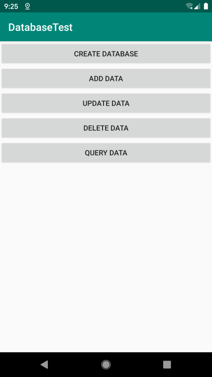

**图 7.25　加入查询数据按钮**

点击“Query Data”按钮，查看 Logcat 的打印内容，结果如图 7.26 所示。


**图 7.26　打印查询到的数据**

可以看到，这里已经将 Book 表中唯一的一条数据成功地读取出来了。

当然，这个例子只是对查询数据的用法进行了最简单的示范。在真正的项目中，你可能会遇到比这要复杂得多的查询功能，更多高级的用法还需要你自己去慢慢摸索，毕竟 `query()` 方法中还有那么多的参数我们都还没用到呢。

### 7.4.7　使用 SQL 操作数据库

虽然 Android 已经给我们提供了很多非常方便的 API 用于操作数据库，不过总会有一些人不习惯使用这些辅助性的方法，而是更加青睐于直接使用 SQL 来操作数据库。如果你也是其中之一的话，那么恭喜，Android 充分考虑到了你们的编程习惯，同样提供了一系列的方法，使得可以直接通过 SQL 来操作数据库。

下面我就来简略演示一下，如何直接使用 SQL 来完成前面几个小节中学过的 CRUD 操作。

添加数据：

```Kotlin
db.execSQL("insert into Book (name, author, pages, price) values(?, ?, ?, ?)",
    arrayOf("The Da Vinci Code", "Dan Brown", "454", "16.96")
)
db.execSQL("insert into Book (name, author, pages, price) values(?, ?, ?, ?)",
    arrayOf("The Lost Symbol", "Dan Brown", "510", "19.95")
)
```

更新数据：

```Kotlin
db.execSQL("update Book set price = ? where name = ?", arrayOf("10.99", "The Da Vinci Code"))
```

删除数据：

```Kotlin
db.execSQL("delete from Book where pages > ?", arrayOf("500"))
```

查询数据：

```Kotlin
val cursor = db.rawQuery("select * from Book", null)
```

可以看到，除了查询数据的时候调用的是 SQLiteDatabase 的 `rawQuery()` 方法，其他操作都是调用的 `execSQL()` 方法。以上演示的几种方式的执行结果会和前面我们学习的 CRUD 操作的结果完全相同，选择使用哪一种方式就看你个人的喜好了。

## 7.5　SQLite 数据库的最佳实践

上一节我们只能算是学习了 SQLite 数据库的基本用法，如果你想继续深入钻研，SQLite 数据库中可拓展的知识就太多了。既然还有那么多的高级技巧在等着我们，自然又要进入本章的最佳实践环节了。

### 7.5.1　使用事务

我们知道，SQLite 数据库是支持事务的，事务的特性可以保证让一系列的操作要么全部完成，要么一个都不会完成。那么在什么情况下才需要使用事务呢？想象以下场景，比如你正在进行一次转账操作，银行会先将转账的金额从你的账户中扣除，然后再向收款方的账户中添加等量的金额。看上去好像没什么问题吧？可是，如果当你账户中的金额刚刚被扣除，这时由于一些异常原因导致对方收款失败，这一部分钱就凭空消失了！当然银行肯定已经充分考虑到了这种情况，它会保证扣款和收款的操作要么一起成功，要么都不会成功，而使用的技术当然就是事务了。

接下来我们看一看如何在 Android 中使用事务吧，仍然是在 DatabaseTest 项目的基础上进行修改。比如 Book 表中的数据已经很老了，现在准备全部废弃，替换成新数据，可以先使用 `delete()` 方法将 Book 表中的数据删除，然后再使用 `insert()` 方法将新的数据添加到表中。我们要保证删除旧数据和添加新数据的操作必须一起完成，否则就要继续保留原来的旧数据。修改 activity_main.xml 中的代码，如下所示：

```xml
<LinearLayout xmlns:android="http://schemas.android.com/apk/res/android"
    android:layout_width="match_parent"
    android:layout_height="match_parent"
    android:orientation="vertical" >

    ...

    <Button
        android:id="@+id/replaceData"
        android:layout_width="match_parent"
        android:layout_height="wrap_content"
        android:text="Replace Data"
        />
</LinearLayout>
```

可以看到，这里又添加了一个按钮，用于进行数据替换操作。然后修改 MainActivity 中的代码，如下所示：

```Kotlin
class MainActivity : AppCompatActivity() {

    override fun onCreate(savedInstanceState: Bundle?) {
        super.onCreate(savedInstanceState)
        setContentView(R.layout.activity_main)
        val dbHelper = MyDatabaseHelper(this, "BookStore.db", 2)
        ...
        replaceData.setOnClickListener {
            val db = dbHelper.writableDatabase
            db.beginTransaction() // 开启事务
            try {
                db.delete("Book", null, null)
                if (true) {
                    // 手动抛出一个异常，让事务失败
                    throw NullPointerException()
                }
                val values = ContentValues().apply {
                    put("name", "Game of Thrones")
                    put("author", "George Martin")
                    put("pages", 720)
                    put("price", 20.85)
                }
                db.insert("Book", null, values)
                db.setTransactionSuccessful() // 事务已经执行成功
            } catch (e: Exception) {
                e.printStackTrace()
            } finally {
                db.endTransaction() // 结束事务
            }
        }
    }

}
```

上述代码就是 Android 中事务的标准用法，首先调用 SQLiteDatabase 的 `beginTransaction()` 方法开启一个事务，然后在一个异常捕获的代码块中执行具体的数据库操作，当所有的操作都完成之后，调用 `setTransactionSuccessful()` 表示事务已经执行成功了，最后在 `finally` 代码块中调用 `endTransaction()` 结束事务。注意观察，我们在删除旧数据的操作完成后手动抛出了一个 `NullPointerException`，这样添加新数据的代码就执行不到了。不过由于事务的存在，中途出现异常会导致事务的失败，此时旧数据应该是删除不掉的。

现在运行一下程序并点击“Replace Data”按钮，然后点击“Query Data”按钮。你会发现，Book 表中存在的还是之前的旧数据，说明我们的事务确实生效了。然后将手动抛出异常的那行代码删除并重新运行程序，此时点击一下“Replace Data”按钮，就会将 Book 表中的数据替换成新数据了，你可以再使用“Query Data”按钮来验证一次。

### 7.5.2　升级数据库的最佳写法

在 7.4.2 小节中我们学习的升级数据库的方式是非常粗暴的，为了保证数据库中的表是最新的，我们只是简单地在 `onUpgrade()` 方法中删除掉了当前所有的表，然后强制重新执行了一遍 `onCreate()` 方法。这种方式在产品的开发阶段确实可以用，但是当产品真正上线之后就绝对不行了。想象以下场景，比如你编写的某个应用已经成功上线了，并且还拥有了不错的下载量。现在由于添加了新功能，数据库需要一起升级，结果用户更新了这个版本之后却发现以前程序中存储的本地数据全部丢失了！那么很遗憾，你的用户群体可能已经流失一大半了。

听起来好像挺恐怖的样子，难道在产品发布出去之后还不能升级数据库了？当然不是，其实只需要进行一些合理的控制，就可以保证在升级数据库的时候数据并不会丢失了。

下面我们就来学习一下如何实现这样的功能。你已经知道，每一个数据库版本都会对应一个版本号，当指定的数据库版本号大于当前数据库版本号的时候，就会进入 `onUpgrade()` 方法中执行更新操作。这里需要为每一个版本号赋予其所对应的数据库变动，然后在 `onUpgrade()` 方法中对当前数据库的版本号进行判断，再执行相应的改变就可以了。

下面就让我们模拟一个数据库升级的案例，还是由 `MyDatabaseHelper` 类对数据库进行管理。第 1 版的程序要求非常简单，只需要创建一张 Book 表。`MyDatabaseHelper` 中的代码如下所示：

```Kotlin
class MyDatabaseHelper(val context: Context, name: String, version: Int):
        SQLiteOpenHelper(context, name, null, version) {

    private val createBook = "create table Book (" +
            " id integer primary key autoincrement," +
            "author text," +
            "price real," +
            "pages integer," +
            "name text)"

    override fun onCreate(db: SQLiteDatabase) {
        db.execSQL(createBook)
    }

    override fun onUpgrade(db: SQLiteDatabase, oldVersion: Int, newVersion: Int) {
    }

}
```

不过，几星期之后又有了新需求，这次需要向数据库中再添加一张 Category 表。于是，修改 `MyDatabaseHelper` 中的代码，如下所示：

```Kotlin
class MyDatabaseHelper(val context: Context, name: String, version: Int):
        SQLiteOpenHelper(context, name, null, version) {

    private val createBook = "create table Book (" +
            " id integer primary key autoincrement," +
            "author text," +
            "price real," +
            "pages integer," +
            "name text)"

    private val createCategory = "create table Category (" +
            "id integer primary key autoincrement," +
            "category_name text," +
            "category_code integer)"

    override fun onCreate(db: SQLiteDatabase) {
        db.execSQL(createBook)
        db.execSQL(createCategory)
    }

    override fun onUpgrade(db: SQLiteDatabase, oldVersion: Int, newVersion: Int) {
        if (oldVersion <= 1) {
            db.execSQL(createCategory)
        }
    }

}
```

可以看到，在 `onCreate()` 方法里我们新增了一条建表语句，然后又在 `onUpgrade()` 方法中添加了一个 `if` 判断，如果用户数据库的旧版本号小于等于 1，就只会创建一张 Category 表。

这样当用户直接安装第 2 版的程序时，就会进入 `onCreate()` 方法，将两张表一起创建。而当用户使用第 2 版的程序覆盖安装第 1 版的程序时，就会进入升级数据库的操作中，此时由于 Book 表已经存在了，因此只需要创建一张 Category 表即可。

但是没过多久，新的需求又来了，这次要给 Book 表和 Category 表之间建立关联，需要在 Book 表中添加一个 `category_id` 字段。再次修改 `MyDatabaseHelper` 中的代码，如下所示：

```Kotlin
class MyDatabaseHelper(val context: Context, name: String, version: Int):
        SQLiteOpenHelper(context, name, null, version) {

    private val createBook = "create table Book (" +
            " id integer primary key autoincrement," +
            "author text," +
            "price real," +
            "pages integer," +
            "name text," +
            "category_id integer)"

    private val createCategory = "create table Category (" +
            "id integer primary key autoincrement," +
            "category_name text," +
            "category_code integer)"

    override fun onCreate(db: SQLiteDatabase) {
        db.execSQL(createBook)
        db.execSQL(createCategory)
    }

    override fun onUpgrade(db: SQLiteDatabase, oldVersion: Int, newVersion: Int) {
        if (oldVersion <= 1) {
            db.execSQL(createCategory)
        }
        if (oldVersion <= 2) {
            db.execSQL("alter table Book add column category_id integer")
        }
    }

}
```

可以看到，首先我们在 Book 表的建表语句中添加了一个 `category_id` 列，这样当用户直接安装第 3 版的程序时，这个新增的列就已经自动添加成功了。然而，如果用户之前已经安装了某一版本的程序，现在需要覆盖安装，就会进入升级数据库的操作中。在 `onUpgrade()` 方法里，我们添加了一个新的条件，如果当前数据库的版本号是 2，就会执行 `alter` 命令，为 Book 表新增一个 `category_id` 列。

这里请注意一个非常重要的细节：每当升级一个数据库版本的时候，`onUpgrade()` 方法里都一定要写一个相应的 `if` 判断语句。为什么要这么做呢？这是为了保证 App 在跨版本升级的时候，每一次的数据库修改都能被全部执行。比如用户当前是从第 2 版升级到第 3 版，那么只有第二条判断语句会执行，而如果用户是直接从第 1 版升级到第 3 版，那么两条判断语句都会执行。使用这种方式来维护数据库的升级，不管版本怎样更新，都可以保证数据库的表结构是最新的，而且表中的数据完全不会丢失。

好了，关于 SQLite 数据库的最佳实践部分我们就学到这里。本节中我们学习的是 Android 中操作数据库最传统的方式，而实际上现在 Google 又推出了一个专门用于 Android 平台的数据库框架——Room。相比于传统的数据库 API，Room 的用法要更加复杂一些，但是却更加科学和规范，也更加符合现代高质量 App 的开发标准，我们将在第 13 章中学习这部分内容。

那么不用多说，现在又该进入我们本章的 Kotlin 课堂了。

## 7.6　Kotlin 课堂：高阶函数的应用

在上一章的 Kotlin 课堂中，我们学习了高阶函数应该如何使用，而本章的 Kotlin 课堂里，我们将会学习高阶函数具体可以用在哪里。这节课的内容会相对简单一些，前提是你已经将上一节课的内容都牢牢掌握了。

高阶函数非常适用于简化各种 API 的调用，一些 API 的原有用法在使用高阶函数简化之后，不管是在易用性还是可读性方面，都可能会有很大的提升。

为了进行举例说明，我们在本节 Kotlin 课堂里会使用高阶函数简化 `SharedPreferences` 和 `ContentValues` 这两种 API 的用法，让它们的使用变得更加简单。

### 7.6.1　简化 `SharedPreferences` 的用法

首先来看 `SharedPreferences`，在开始对它进行简化之前，我们先回顾一下 `SharedPreferences` 原来的用法。向 `SharedPreferences` 中存储数据的过程大致可以分为以下 3 步：

\(1\) 调用 `SharedPreferences` 的 `edit()` 方法获取 `SharedPreferences.Editor` 对象；

\(2\) 向 `SharedPreferences.Editor` 对象中添加数据；

\(3\) 调用 `apply()` 方法将添加的数据提交，完成数据存储操作。

对应的代码示例如下：

```Kotlin
val editor = getSharedPreferences("data", Context.MODE_PRIVATE).edit()
editor.putString("name", "Tom")
editor.putInt("age", 28)
editor.putBoolean("married", false)
editor.apply()
```

当然，这段代码其实本身已经足够简单了，但是这种写法更多还是在用 Java 的编程思维来编写代码，而在 Kotlin 当中我们明显可以做到更好。

接下来我们就尝试使用高阶函数简化 `SharedPreferences` 的用法，新建一个 SharedPreferences.kt 文件，然后在里面加入如下代码：

```Kotlin
fun SharedPreferences.open(block: SharedPreferences.Editor.() -> Unit) {
    val editor = edit()
    editor.block()
    editor.apply()
}
```

这段代码虽然不长，但是涵盖了高阶函数的各种精华，下面我来解释一下。

首先，我们通过扩展函数的方式向 `SharedPreferences` 类中添加了一个 `open` 函数，并且它还接收一个函数类型的参数，因此 `open` 函数自然就是一个高阶函数了。

由于 `open` 函数内拥有 `SharedPreferences` 的上下文，因此这里可以直接调用 `edit()` 方法来获取 `SharedPreferences.Editor` 对象。另外 `open` 函数接收的是一个 `SharedPreferences.Editor` 的函数类型参数，因此这里需要调用 `editor.block()` 对函数类型参数进行调用，我们就可以在函数类型参数的具体实现中添加数据了。最后还要调用 `editor.apply()` 方法来提交数据，从而完成数据存储操作。

如果你将上一节 Kotlin 课堂的内容很好地掌握了，相信这段代码理解起来应该没有什么难度。

定义好了 `open` 函数之后，我们以后在项目中使用 `SharedPreferences` 存储数据就会更加方便了，写法如下所示：

```Kotlin
GETSharedPreferences("data", Context.MODE_PRIVATE).open {
    putString("name", "Tom")
    putInt("age", 28)
    putBoolean("married", false)
}
```

可以看到，我们可以直接在 `SharedPreferences` 对象上调用 `open` 函数，然后在 Lambda 表达式中完成数据的添加操作。注意，现在 Lambda 表达式拥有的是 `SharedPreferences.Editor` 的上下文环境，因此这里可以直接调用相应的 `put` 方法来添加数据。最后我们也不再需要调用 `apply()` 方法来提交数据了，因为 `open` 函数会自动完成提交操作。

怎么样，使用高阶函数简化之后，不管是在易用性还是在可读性上，`SharedPreferences` 的用法是不是都简化了很多？这就是高阶函数的魅力所在。好好掌握这个知识点，以后在诸多其他 API 的使用方面，我们都可以使用这个技巧，让 API 变得更加简单。

当然，最后不得不提的是，其实 Google 提供的 KTX 扩展库中已经包含了上述 `SharedPreferences` 的简化用法，这个扩展库会在 Android Studio 创建项目的时候自动引入 `build.gradle` 的 `dependencies` 中，如图 7.27 所示。

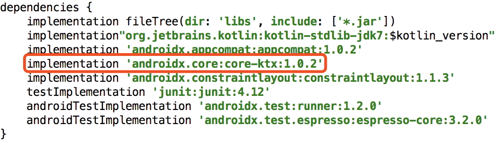

**图 7.27　自动引入的 KTX 扩展库**

因此，我们实际上可以直接在项目中使用如下写法来向 `SharedPreferences` 存储数据：

```Kotlin
GETSharedPreferences("data", Context.MODE_PRIVATE).edit {
    putString("name", "Tom")
    putInt("age", 28)
    putBoolean("married", false)
}
```

可以看到，其实就是将 `open` 函数换成了 `edit` 函数，但是 `edit` 函数的语义性明显要更好一些。当然，我前面命名成 `open` 函数，主要是为了防止和 KTX 的 `edit` 函数同名，以免你在理解的时候产生混淆。

那么你可能会问了，既然 Google 的 KTX 库中已经自带了一个 `edit` 函数，我们为什么还编写这个 `open` 函数呢？这是因为我希望你对于高阶函数的理解不要仅仅停留在使用的层面，而是要知其然也知其所以然。KTX 中提供的功能必然是有限的，但是掌握了它们背后的实现原理，你将可以对无限的 API 进行更多的扩展。

### 7.6.2　简化 `ContentValues` 的用法

接下来我们开始学习如何简化 `ContentValues` 的用法。

`ContentValues` 的基本用法在 7.4 节中已经学过了，它主要用于结合 SQLiteDatabase 的 API 存储和修改数据库中的数据，具体的用法示例如下：

```Kotlin
val values = ContentValues()
values.put("name", "Game of Thrones")
values.put("author", "George Martin")
values.put("pages", 720)
values.put("price", 20.85)
db.insert("Book", null, values)
```

你可能会说，这段代码可以使用 `apply` 函数进行简化。这当然没有错，只是我们其实还可以做到更好。

不过在正式开始我们的简化之旅之前，我还得向你介绍一个额外的知识点。还记得在 2.6.1 小节中学过的 `mapOf()` 函数的用法吗？它允许我们使用 `"Apple" to 1` 这样的语法结构快速创建一个键值对。这里我先为你进行部分解密，在 Kotlin 中使用 `A to B` 这样的语法结构会创建一个 `Pair` 对象，暂时你只需要知道这些就可以了，至于为什么，我们将在第 9 章的 Kotlin 课堂中学习。

有了这个知识前提之后，就可以进行下一步了。新建一个 ContentValues.kt 文件，然后在里面定义一个 `cvOf()` 方法，如下所示：

```Kotlin
fun cvOf(vararg pairs: Pair<String, Any?>): ContentValues {
}
```

这个方法的作用是构建一个 `ContentValues` 对象，有几点我需要解释一下。首先，`cvOf()` 方法接收了一个 `Pair` 参数，也就是使用 `A to B` 语法结构创建出来的参数类型，但是我们在参数前面加上了一个 `vararg` 关键字，这是什么意思呢？其实 `vararg` 对应的就是 Java 中的可变参数列表，我们允许向这个方法传入 0 个、1 个、2 个甚至任意多个 `Pair` 类型的参数，这些参数都会被赋值到使用 `vararg` 声明的这一个变量上面，然后使用 `for-in` 循环可以将传入的所有参数遍历出来。

再来看声明的 `Pair` 类型。由于 `Pair` 是一种键值对的数据结构，因此需要通过泛型来指定它的键和值分别对应什么类型的数据。值得庆幸的是，`ContentValues` 的所有键都是字符串类型的，这里可以直接将 `Pair` 键的泛型指定成 `String`。但 `ContentValues` 的值却可以有多种类型（字符串型、整型、浮点型，甚至是 `null`），所以我们需要将 `Pair` 值的泛型指定成 `Any?`。这是因为 `Any` 是 Kotlin 中所有类的共同基类，相当于 Java 中的 `Object`，而 `Any?` 则表示允许传入空值。

接下来我们开始为 `cvOf()` 方法实现功能逻辑，核心思路就是先创建一个 `ContentValues` 对象，然后遍历 `pairs` 参数列表，取出其中的数据并填入 `ContentValues` 中，最终将 `ContentValues` 对象返回即可。思路并不复杂，但是存在一个问题：`Pair` 参数的值是 `Any?` 类型的，我们怎样让它和 `ContentValues` 所支持的数据类型对应起来呢？这个确实没有什么好的办法，只能使用 `when` 语句一一进行条件判断，并覆盖 `ContentValues` 所支持的所有数据类型。结合下面的代码来理解应该更加清楚一些：

```Kotlin
fun cvOf(vararg pairs: Pair<String, Any?>): ContentValues {
    val cv = ContentValues()
    for (pair in pairs) {
        val key = pair.first
        val value = pair.second
        when (value) {
            is Int -> cv.put(key, value)
            is Long -> cv.put(key, value)
            is Short -> cv.put(key, value)
            is Float -> cv.put(key, value)
            is Double -> cv.put(key, value)
            is Boolean -> cv.put(key, value)
            is String -> cv.put(key, value)
            is Byte -> cv.put(key, value)
            is ByteArray -> cv.put(key, value)
            null -> cv.putNull(key)
        }
    }
    return cv
}
```

可以看到，上述代码基本就是按照刚才所说的思路进行实现的。我们使用 `for-in` 循环遍历了 `pairs` 参数列表，在循环中取出了 `key` 和 `value`，并使用 `when` 语句来判断 `value` 的类型。注意，这里将 `ContentValues` 所支持的所有数据类型全部覆盖了进去，然后将参数中传入的键值对逐个添加到 `ContentValues` 中，最终将 `ContentValues` 返回。

另外，这里还使用了 Kotlin 中的 Smart Cast 功能。比如 `when` 语句进入 `Int` 条件分支后，这个条件下面的 `value` 会被自动转换成 `Int` 类型，而不再是 `Any?` 类型，这样我们就不需要像 Java 中那样再额外进行一次向下转型了，这个功能在 `if` 语句中也同样适用。

有了这个 `cvOf()` 方法之后，我们使用 `ContentValues` 时就会变得更加简单了，比如向数据库中插入一条数据就可以这样写：

```Kotlin
val values = cvOf("name" to "Game of Thrones", "author" to "George Martin",
    "pages" to 720, "price" to 20.85)
db.insert("Book", null, values)
```

怎么样？现在我们可以使用类似于 `mapOf()` 函数的语法结构来构建 `ContentValues` 对象，有没有觉得很神奇？

当然，虽然 `cvOf()` 方法已经非常好用了，但是它和高阶函数却一点关系也没有。因为 `cvOf()` 方法接收的参数是 `Pair` 类型的可变参数列表，返回值是 `ContentValues` 对象，完全没有用到函数类型，这和高阶函数的定义不符。

从功能性方面，`cvOf()` 方法好像确实用不到高阶函数的知识，但是从代码实现方面，却可以结合高阶函数来进行进一步的优化。比如借助 `apply` 函数，`cvOf()` 方法的实现将会变得更加优雅：

```Kotlin
fun cvOf(vararg pairs: Pair<String, Any?>) = ContentValues().apply {
    for (pair in pairs) {
        val key = pair.first
        val value = pair.second
        when (value) {
            is Int -> put(key, value)
            is Long -> put(key, value)
            is Short -> put(key, value)
            is Float -> put(key, value)
            is Double -> put(key, value)
            is Boolean -> put(key, value)
            is String -> put(key, value)
            is Byte -> put(key, value)
            is ByteArray -> put(key, value)
            null -> putNull(key)
        }
    }
}
```

由于 `apply` 函数的返回值就是它的调用对象本身，因此这里我们可以使用单行代码函数的语法糖，用等号替代返回值的声明。另外，`apply` 函数的 Lambda 表达式中会自动拥有 `ContentValues` 的上下文，所以这里可以直接调用 `ContentValues` 的各种 `put` 方法。借助高阶函数之后，你有没有觉得代码变得更加优雅一些了呢？

当然，虽然我们编写了一个非常好用的 `cvOf()` 方法，但是或许你已经猜到了，KTX 库中也提供了一个具有同样功能的 `contentValuesOf()` 方法，用法如下所示：

```Kotlin
val values = contentValuesOf("name" to "Game of Thrones", "author" to "George Martin",
    "pages" to 720, "price" to 20.85)
db.insert("Book", null, values)
```

平时我们在编写代码的时候，直接使用 KTX 提供的 `contentValuesOf()` 方法就可以了，但是通过本小节的学习，你不仅掌握了它的用法，还明白了它的源码实现，有没有觉得收获了更多呢？

## 7.7　小结与点评

经过这一章漫长的学习，我们终于可以缓解一下疲劳，对本章所学的知识进行梳理和总结了。本章主要对 Android 常用的数据持久化方式进行了详细的讲解，包括文件存储、SharedPreferences 存储以及数据库存储。其中，文件存储适用于存储一些简单的文本数据和二进制数据，SharedPreferences 存储适用于存储一些键值对，而数据库存储则适用于存储那些复杂的关系型数据。虽然目前你已经掌握了这 3 种数据持久化方式的用法，但是如何根据项目的实际需求选择最合适的方式是你未来需要继续探索的。

在本章的 Kotlin 课堂中，我们并没有学习太多新的知识，而是通过两节实践课程让你更好地理解了高阶函数的使用场景，以及如何借助高阶函数和其他一些技巧对现有的 API 进行扩展。

正如上一章小结里提到的，既然现在我们已经掌握了 Android 中的数据持久化技术，接下来就应该继续学习 Android 中的四大组件了。放松一下自己，然后踏上 ContentProvider 的学习之旅吧。