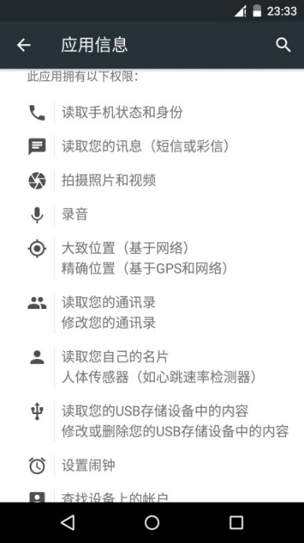
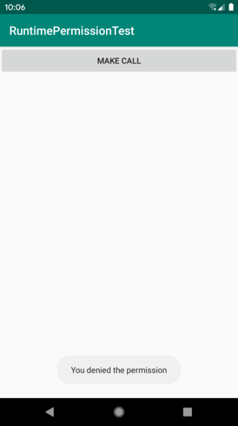
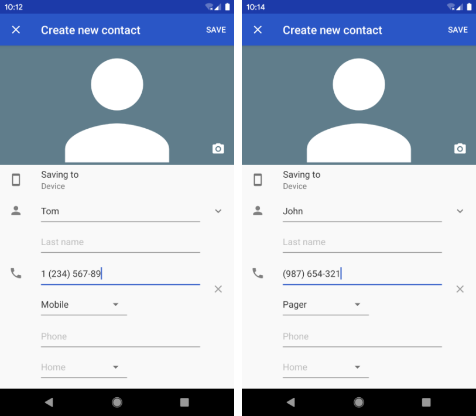
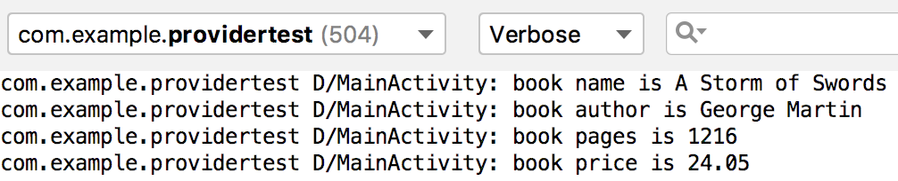

# 第 8 章　跨程序共享数据，探究 ContentProvider

在上一章中我们学了 Android 数据持久化技术，包括文件存储、SharedPreferences 存储以及数据库存储。不知道你有没有发现，使用这些持久化技术所保存的数据只能在当前应用程序中访问。虽然文件存储和 SharedPreferences 存储中提供了 `MODE_WORLD_READABLE` 和 `MODE_WORLD_WRITEABLE` 这两种操作模式，用于供给其他应用程序访问当前应用的数据，但这两种模式在 Android 4.2 版本中都已被废弃了。为什么呢？因为 Android 官方已经不再推荐使用这种方式来实现跨程序数据共享的功能，而是推荐使用更加安全可靠的 ContentProvider 技术。

可能你会有些疑惑，为什么要将我们程序中的数据共享给其他程序呢？当然，这个是要视情况而定的，比如账号和密码这样的隐私数据显然是不能共享给其他程序的，不过一些可以让其他程序进行二次开发的数据是可以共享的。例如系统的通讯录程序，它的数据库中保存了很多联系人信息，如果这些数据都不允许第三方程序进行访问的话，恐怕很多应用的功能就要大打折扣了。除了通讯录之外，还有短信、媒体库等程序都实现了跨程序数据共享的功能，而使用的技术当然就是 ContentProvider 了，下面我们就对这一技术进行深入的探讨。

## 8.1　ContentProvider 简介

ContentProvider 主要用于在不同的应用程序之间实现数据共享的功能，它提供了一套完整的机制，允许一个程序访问另一个程序中的数据，同时还能保证被访问数据的安全性。目前，使用 ContentProvider 是 Android 实现跨程序共享数据的标准方式。

不同于文件存储和 SharedPreferences 存储中的两种全局可读写操作模式，ContentProvider 可以选择只对哪一部分数据进行共享，从而保证我们程序中的隐私数据不会有泄漏的风险。

不过，在正式开始学习 ContentProvider 之前，我们需要先掌握另外一个非常重要的知识——Android 运行时权限，因为待会的 ContentProvider 示例中会用到运行时权限的功能。当然，不光是 ContentProvider，以后我们的开发过程中会经常使用运行时权限，因此你必须能够牢牢掌握它才行。

## 8.2　运行时权限

Android 的权限机制并不是什么新鲜事物，从系统的第一个版本开始就已经存在了。但其实之前 Android 的权限机制在保护用户安全和隐私等方面起到的作用比较有限，尤其是一些大家都离不开的常用软件，非常容易“店大欺客”。为此，Android 开发团队在 Android 6.0 系统中引入了运行时权限这个功能，从而更好地保护了用户的安全和隐私，那么本节我们就来详细学习一下这个新功能。

### 8.2.1　Android 权限机制详解

首先回顾一下过去 Android 的权限机制。我们在第 6 章写 BroadcastTest 项目的时候第一次接触了 Android 权限相关的内容，当时为了要监听开机广播，我们在 AndroidManifest.xml 文件中添加了这样一句权限声明：

```xml
<manifest xmlns:android="http://schemas.android.com/apk/res/android"
    package="com.example.broadcasttest">

    <uses-permission android:name="android.permission.RECEIVE_BOOT_COMPLETED" />
    ...
</manifest>
```

因为监听开机广播涉及了用户设备的安全，因此必须在 AndroidManifest.xml 中加入权限声明，否则我们的程序就会崩溃。

那么现在问题来了，加入了这句权限声明后，对于用户来说到底有什么影响呢？为什么这样就可以保护用户设备的安全了呢？

其实用户主要在两个方面得到了保护。一方面，如果用户在低于 Android 6.0 系统的设备上安装该程序，会在安装界面给出如图 8.1 所示的提醒。这样用户就可以清楚地知晓该程序一共申请了哪些权限，从而决定是否要安装这个程序。


**图 8.1　安装界面的权限提醒**

另一方面，用户可以随时在应用程序管理界面查看任意一个程序的权限申请情况，如图 8.2 所示。这样该程序申请的所有权限就尽收眼底，什么都瞒不过用户的眼睛，以此保证应用程序不会出现各种滥用权限的情况。


**图 8.2　管理界面的权限展示**

这种权限机制的设计思路其实非常简单，就是用户如果认可你所申请的权限，就会安装你的程序，如果不认可你所申请的权限，那么拒绝安装就可以了。

但是理想是美好的，现实却很残酷。很多我们离不开的常用软件普遍存在着滥用权限的情况，不管到底用不用得到，反正先把权限申请了再说。比如微信所申请的权限列表如图 8.3 所示。



**图 8.3　微信的权限列表**

这还只是微信所申请的一半左右的权限，因为权限太多，一屏截不全。其中有一些权限我并不认可，比如微信为什么要读取我手机的短信和彩信？但是不认可又能怎样，难道我拒绝安装微信？没错，这种例子比比皆是，一些软件在让用户产生依赖以后就会容易 “店大欺客”，反正这个权限我就是要了，你自己看着办吧！

Android 开发团队当然也意识到了这个问题，于是在 Android 6.0 系统中加入了运行时权限功能。也就是说，用户不需要在安装软件的时候一次性授权所有申请的权限，而是可以在软件的使用过程中再对某一项权限申请进行授权。比如一款相机应用在运行时申请了地理位置定位权限，就算我拒绝了这个权限，也应该可以使用这个应用的其他功能，而不是像之前那样直接无法安装它。

当然，并不是所有权限都需要在运行时申请，对于用户来说，不停地授权也很烦琐。Android 现在将常用的权限大致归成了两类，一类是普通权限，一类是危险权限。准确地讲，其实还有一些特殊权限，不过这些权限使用得相对较少，因此不在本书的讨论范围之内。普通权限指的是那些不会直接威胁到用户的安全和隐私的权限，对于这部分权限申请，系统会自动帮我们进行授权，不需要用户手动操作，比如在 BroadcastTest 项目中申请的权限就是普通权限。危险权限则表示那些可能会触及用户隐私或者对设备安全性造成影响的权限，如获取设备联系人信息、定位设备的地理位置等，对于这部分权限申请，必须由用户手动授权才可以，否则程序就无法使用相应的功能。

但是 Android 中一共有上百种权限，我们怎么从中区分哪些是普通权限，哪些是危险权限呢？其实并没有那么难，因为危险权限总共就那么些，除了危险权限之外，剩下的大多就是普通权限了。表 8.1 列出了到 Android 10 系统为止所有的危险权限，一共是 11 组 30 个权限。

**表 8.1　到 Android 10 系统为止所有的危险权限**

[TABLE]

这张表格你看起来可能并不会那么轻松，因为里面的权限全都是你没使用过的。不过没有关系，你并不需要了解表格中每个权限的作用，只要把它当成一个参照表来查看就行了。每当要使用一个权限时，可以先到这张表中查一下，如果是这张表中的权限，就需要进行运行时权限处理，否则，只需要在 AndroidManifest.xml 文件中添加一下权限声明就可以了。

另外注意，表格中每个危险权限都属于一个权限组，我们在进行运行时权限处理时使用的是权限名。原则上，用户一旦同意了某个权限申请之后，同组的其他权限也会被系统自动授权。但是请谨记，不要基于此规则来实现任何功能逻辑，因为 Android 系统随时有可能调整权限的分组。

好了，关于 Android 权限机制的内容就讲这么多，理论知识你已经了解得非常充分了。接下来我们就学习一下如何在程序运行的时候申请权限。

### 8.2.2　在程序运行时申请权限

首先新建一个 RuntimePermissionTest 项目，我们就在这个项目的基础上学习运行时权限的使用方法。在开始动手之前，你需要考虑一下到底要申请什么权限，其实表 8.1 中列出的所有权限都是可以申请的，这里简单起见，我们就使用 `CALL_PHONE` 这个权限来作为本小节的示例吧。

`CALL_PHONE` 这个权限是编写拨打电话功能的时候需要声明的，因为拨打电话会涉及用户手机的资费问题，因而被列为了危险权限。在 Android 6.0 系统出现之前，拨打电话功能的实现其实非常简单，修改 activity_main.xml 布局文件，如下所示：

```xml
<LinearLayout xmlns:android="http://schemas.android.com/apk/res/android"
    android:layout_width="match_parent"
    android:layout_height="match_parent">

    <Button
        android:id="@+id/makeCall"
        android:layout_width="match_parent"
        android:layout_height="wrap_content"
        android:text="Make Call" />

</LinearLayout>
```

我们在布局文件中只是定义了一个按钮，点击按钮就去触发拨打电话的逻辑。接着修改 MainActivity 中的代码，如下所示：

```Kotlin
class MainActivity : AppCompatActivity() {

    override fun onCreate(savedInstanceState: Bundle?) {
        super.onCreate(savedInstanceState)
        setContentView(R.layout.activity_main)
        makeCall.setOnClickListener {
            try {
                val intent = Intent(Intent.ACTION_CALL)
                intent.data = Uri.parse("tel:10086")
                startActivity(intent)
            } catch (e: SecurityException) {
                e.printStackTrace()
            }
        }
    }

}
```

可以看到，在按钮的点击事件中，我们构建了一个隐式 Intent，Intent 的 action 指定为 `Intent.ACTION_CALL`，这是一个系统内置的打电话的动作，然后在 data 部分指定了协议是 tel，号码是 10086。其实这部分代码我们在 3.3.3 小节中就已经见过了，只不过当时指定的 action 是 `Intent.ACTION_DIAL`，表示打开拨号界面，这个是不需要声明权限的，而 `Intent.ACTION_CALL` 则表示直接拨打电话，因此必须声明权限。另外，为了防止程序崩溃，我们将所有操作都放在了异常捕获代码块当中。

接下来修改 AndroidManifest.xml 文件，在其中声明如下权限：

```xml
<manifest xmlns:android="http://schemas.android.com/apk/res/android"
    package="com.example.runtimepermissiontest">

    <uses-permission android:name="android.permission.CALL_PHONE" />

    <application
        android:allowBackup="true"
        android:icon="@mipmap/ic_launcher"
        android:label="@string/app_name"
        android:roundIcon="@mipmap/ic_launcher_round"
        android:supportsRtl="true"
        android:theme="@style/AppTheme">
        ...
    </application>

</manifest>
```

这样我们就将拨打电话的功能成功实现了，并且在低于 Android 6.0 系统的手机上都是可以正常运行的。但是，如果我们在 Android 6.0 或者更高版本系统的手机上运行，点击“Make Call”按钮就没有任何效果了，这时观察 Logcat 中的打印日志，你会看到如图 8.4 所示的错误信息。


**图 8.4　错误日志信息**

错误信息中提醒我们“Permission Denial”，可以看出，这是由于权限被禁止所导致的，因为 Android 6.0 及以上系统在使用危险权限时必须进行运行时权限处理。

那么下面我们就来尝试修复这个问题，修改 MainActivity 中的代码，如下所示：

```Kotlin
class MainActivity : AppCompatActivity() {

    override fun onCreate(savedInstanceState: Bundle?) {
        super.onCreate(savedInstanceState)
        setContentView(R.layout.activity_main)
        makeCall.setOnClickListener {
            if (ContextCompat.checkSelfPermission(this,
                Manifest.permission.CALL_PHONE) != PackageManager.PERMISSION_GRANTED) {
                ActivityCompat.requestPermissions(this,
                    arrayOf(Manifest.permission.CALL_PHONE), 1)
            } else {
                call()
            }
        }
    }

    override fun onRequestPermissionsResult(requestCode: Int,
            permissions: Array<String>, grantResults: IntArray) {
        super.onRequestPermissionsResult(requestCode, permissions, grantResults)
        when (requestCode) {
            1 -> {
                if (grantResults.isNotEmpty() &&
                    grantResults[0] == PackageManager.PERMISSION_GRANTED) {
                    call()
                } else {
                    Toast.makeText(this, "You denied the permission",
                        Toast.LENGTH_SHORT).show()
                }
            }
        }
    }

    private fun call() {
        try {
            val intent = Intent(Intent.ACTION_CALL)
            intent.data = Uri.parse("tel:10086")
            startActivity(intent)
        } catch (e: SecurityException) {
            e.printStackTrace()
        }
    }

}
```

上面的代码覆盖了运行时权限的完整流程，下面我们具体解析一下。说白了，运行时权限的核心就是在程序运行过程中由用户授权我们去执行某些危险操作，程序是不可以擅自做主去执行这些危险操作的。因此，第一步就是要先判断用户是不是已经给过我们授权了，借助的是 `ContextCompat.checkSelfPermission()` 方法。`checkSelfPermission()` 方法接收两个参数：第一个参数是 `Context`，这个没什么好说的；第二个参数是具体的权限名，比如打电话的权限名就是 `Manifest.permission.CALL_PHONE`。然后我们使用方法的返回值和 `PackageManager.PERMISSION_GRANTED` 做比较，相等就说明用户已经授权，不等就表示用户没有授权。

如果已经授权的话就简单了，直接执行拨打电话的逻辑操作就可以了，这里我们把拨打电话的逻辑封装到了 `call()` 方法当中。如果没有授权的话，则需要调用 `ActivityCompat.requestPermissions()` 方法向用户申请授权。`requestPermissions()` 方法接收 3 个参数：第一个参数要求是 Activity 的实例；第二个参数是一个 `String` 数组，我们把要申请的权限名放在数组中即可；第三个参数是请求码，只要是唯一值就可以了，这里传入了 1。

调用完 `requestPermissions()` 方法之后，系统会弹出一个权限申请的对话框，用户可以选择同意或拒绝我们的权限申请。不论是哪种结果，最终都会回调到 `onRequestPermissionsResult()` 方法中，而授权的结果则会封装在 `grantResults` 参数当中。这里我们只需要判断一下最后的授权结果：如果用户同意的话，就调用 `call()` 方法拨打电话；如果用户拒绝的话，我们只能放弃操作，并且弹出一条失败提示。

现在重新运行一下程序，并点击“Make Call”按钮，效果如图 8.5 所示。


**图 8.5　申请电话权限对话框**

由于用户还没有授权过我们拨打电话权限，因此第一次运行会弹出这样一个权限申请的对话框，用户可以选择同意或者拒绝，比如说这里点击了“Deny”，结果如图 8.6 所示。



**图 8.6　用户拒绝了权限申请**

由于用户没有同意授权，我们只能弹出一个操作失败的提示。下面我们再次点击“Make Call”按钮，仍然会弹出权限申请的对话框，这次点击“Allow”，结果如图 8.7 所示。


**图 8.7　拨打电话界面**

可以看到，这次我们就成功进入拨打电话界面了。并且由于用户已经完成了授权操作，之后再点击“Make Call”按钮不会再次弹出权限申请对话框，而是可以直接拨打电话。那可能你会担心，万一以后我又后悔了怎么办？没有关系，用户随时都可以将授予程序的危险权限进行关闭，进入 Settings → Apps & notifications → RuntimePermissionTest → Permissions，界面如图 8.8 所示。


**图 8.8　应用程序权限管理界面**

在这里我们可以通过点击相应的权限来对授权过的危险权限进行关闭。

好了，关于运行时权限的内容就讲到这里，现在你已经有能力处理 Android 上各种关于权限的问题了，下面我们就来进入本章的正题——ContentProvider。

## 8.3　访问其他程序中的数据

ContentProvider 的用法一般有两种：一种是使用现有的 ContentProvider 读取和操作相应程序中的数据；另一种是创建自己的 ContentProvider，给程序的数据提供外部访问接口。那么接下来我们就一个一个开始学习吧，首先从使用现有的 ContentProvider 开始。

如果一个应用程序通过 ContentProvider 对其数据提供了外部访问接口，那么任何其他的应用程序都可以对这部分数据进行访问。Android 系统中自带的通讯录、短信、媒体库等程序都提供了类似的访问接口，这就使得第三方应用程序可以充分地利用这部分数据实现更好的功能。下面我们就来看一看 ContentProvider 到底是如何使用的。

### 8.3.1　ContentResolver 的基本用法

对于每一个应用程序来说，如果想要访问 ContentProvider 中共享的数据，就一定要借助 ContentResolver 类，可以通过 Context 中的 `getContentResolver()` 方法获取该类的实例。ContentResolver 中提供了一系列的方法用于对数据进行增删改查操作，其中 `insert()` 方法用于添加数据，`update()` 方法用于更新数据，`delete()` 方法用于删除数据，`query()` 方法用于查询数据。有没有似曾相识的感觉？没错，SQLiteDatabase 中也是使用这几个方法进行增删改查操作的，只不过它们在方法参数上稍微有一些区别。

不同于 SQLiteDatabase，ContentResolver 中的增删改查方法都是不接收表名参数的，而是使用一个 `Uri` 参数代替，这个参数被称为内容 URI。内容 URI 给 ContentProvider 中的数据建立了唯一标识符，它主要由两部分组成：authority 和 path。authority 是用于对不同的应用程序做区分的，一般为了避免冲突，会采用应用包名的方式进行命名。比如某个应用的包名是 com.example.app，那么该应用对应的 authority 就可以命名为 com.example.app.provider。path 则是用于对同一应用程序中不同的表做区分的，通常会添加到 authority 的后面。比如某个应用的数据库里存在两张表 table1 和 table2，这时就可以将 path 分别命名为/table1 和/table2，然后把 authority 和 path 进行组合，内容 URI 就变成了 com.example.app.provider/table1 和 com.example.app.provider/table2。不过，目前还很难辨认出这两个字符串就是两个内容 URI，我们还需要在字符串的头部加上协议声明。因此，内容 URI 最标准的格式如下：

```js
content://com.example.app.provider/table1
content://com.example.app.provider/table2
```

有没有发现，内容 URI 可以非常清楚地表达我们想要访问哪个程序中哪张表里的数据。也正是因此，ContentResolver 中的增删改查方法才都接收 `Uri` 对象作为参数。如果使用表名的话，系统将无法得知我们期望访问的是哪个应用程序里的表。

在得到了内容 URI 字符串之后，我们还需要将它解析成 `Uri` 对象才可以作为参数传入。解析的方法也相当简单，代码如下所示：

```Kotlin
val uri = Uri.parse("content://com.example.app.provider/table1")
```

只需要调用 `Uri.parse()` 方法，就可以将内容 URI 字符串解析成 `Uri` 对象了。

现在我们就可以使用这个 `Uri` 对象查询 table1 表中的数据了，代码如下所示：

```Kotlin
val cursor = contentResolver.query(
    uri,
    projection,
    selection,
    selectionArgs,
    sortOrder)
```

这些参数和 SQLiteDatabase 中 `query()` 方法里的参数很像，但总体来说要简单一些，毕竟这是在访问其他程序中的数据，没必要构建过于复杂的查询语句。表 8.2 对使用到的这部分参数进行了详细的解释。

**表 8.2** **`query()`**  **方法的参数说明**

|`query()` 方法参数|对应 SQL 部分|描述|
| ---------| -------------| --------------------------------|
|`uri`|`from table_name`|指定查询某个应用程序下的某一张表|
|`projection`|`select column1, column2`|指定查询的列名|
|`selection`|`where column = value`|指定 `where` 的约束条件|
|`selectionArgs`|\-|为 `where` 中的占位符提供具体的值|
|`sortOrder`|`order by column1, column2`|指定查询结果的排序方式|

查询完成后返回的仍然是一个 `Cursor` 对象，这时我们就可以将数据从 `Cursor` 对象中逐个读取出来了。读取的思路仍然是通过移动游标的位置遍历 `Cursor` 的所有行，然后取出每一行中相应列的数据，代码如下所示：

```Kotlin
while (cursor.moveToNext()) {
    val column1 = cursor.getString(cursor.getColumnIndex("column1"))
    val column2 = cursor.getInt(cursor.getColumnIndex("column2"))
}
cursor.close()
```

掌握了最难的查询操作，剩下的增加、修改、删除操作就更不在话下了。我们先来看看如何向 table1 表中添加一条数据，代码如下所示：

```Kotlin
val values = contentValuesOf("column1" to "text", "column2" to 1)
contentResolver.insert(uri, values)
```

可以看到，仍然是将待添加的数据组装到 `ContentValues` 中，然后调用 ContentResolver 的 `insert()` 方法，将 `Uri` 和 `ContentValues` 作为参数传入即可。

如果我们想要更新这条新添加的数据，把 `column1` 的值清空，可以借助 ContentResolver 的 `update()` 方法实现，代码如下所示：

```Kotlin
val values = contentValuesOf("column1" to "")
contentResolver.update(uri, values, "column1 = ? and column2 = ?", arrayOf("text", "1"))
```

注意，上述代码使用了 `selection` 和 `selectionArgs` 参数来对想要更新的数据进行约束，以防止所有的行都会受影响。

最后，可以调用 ContentResolver 的 `delete()` 方法将这条数据删除掉，代码如下所示：

```js
contentResolver.delete(uri, "column2 = ?", arrayOf("1"))
```

到这里为止，我们就把 ContentResolver 中的增删改查方法全部学完了。是不是感觉一看就懂？因为这些知识早在上一章中学习 SQLiteDatabase 的时候你就已经掌握了，所需特别注意的就只有 `uri` 这个参数而已。那么接下来，我们就利用目前所学的知识，看一看如何读取系统通讯录中的联系人信息。

### 8.3.2　读取系统联系人

由于我们一直都是使用模拟器来学习的，通讯录里面并没有联系人存在，所以现在需要自己手动添加几个，以便稍后进行读取。打开通讯录程序，界面如图 8.9 所示。


**图 8.9　通讯录程序主界面**

可以看到，目前通讯录里没有任何联系人，我们可以通过点击“Create new contact”创建联系人。这里就先创建两个联系人吧，分别填入他们的姓名和手机号，如图 8.10 所示。



**图 8.10　创建两个联系人**

这样准备工作就做好了，现在新建一个 ContactsTest 项目，让我们开始动手吧。

首先还是来编写一下布局文件，这里我们希望读取出来的联系人信息能够在 ListView 中显示，因此，修改 activity_main.xml 中的代码，如下所示：

```xml
<LinearLayout xmlns:android="http://schemas.android.com/apk/res/android"
    android:orientation="vertical"
    android:layout_width="match_parent"
    android:layout_height="match_parent" >

    <ListView
        android:id="@+id/contactsView"
        android:layout_width="match_parent"
        android:layout_height="match_parent" >
    </ListView>

</LinearLayout>
```

简单起见，LinearLayout 里只放置了一个 ListView。这里之所以使用 ListView 而不是 RecyclerView，是因为我们要将关注的重点放在读取系统联系人上面，如果使用 RecyclerView 的话，代码偏多，会容易让我们找不着重点。

接着修改 MainActivity 中的代码，如下所示：

```Kotlin
class MainActivity : AppCompatActivity() {

    private val contactsList = ArrayList<String>()
    private lateinit var adapter: ArrayAdapter<String>

    override fun onCreate(savedInstanceState: Bundle?) {
        super.onCreate(savedInstanceState)
        setContentView(R.layout.activity_main)
        adapter = ArrayAdapter(this, android.R.layout.simple_list_item_1, contactsList)
        contactsView.adapter = adapter
        if (ContextCompat.checkSelfPermission(this, Manifest.permission.READ_CONTACTS)
        != PackageManager.PERMISSION_GRANTED) {
            ActivityCompat.requestPermissions(this,
                arrayOf(Manifest.permission.READ_CONTACTS), 1)
        } else {
            readContacts()
        }
    }

    override fun onRequestPermissionsResult(requestCode: Int, permissions: Array<String>,
            grantResults: IntArray) {
        super.onRequestPermissionsResult(requestCode, permissions, grantResults)
        when (requestCode) {
            1 -> {
                if (grantResults.isNotEmpty()
                && grantResults[0] == PackageManager.PERMISSION_GRANTED) {
                    readContacts()
                } else {
                    Toast.makeText(this, "You denied the permission",
                        Toast.LENGTH_SHORT).show()
                }
            }
        }
    }

    private fun readContacts() {
        // 查询联系人数据
        contentResolver.query(ContactsContract.CommonDataKinds.Phone.CONTENT_URI,
                null, null, null, null)?.apply {
            while (moveToNext()) {
                // 获取联系人姓名
                val displayName = getString(getColumnIndex(
                ContactsContract.CommonDataKinds.Phone.DISPLAY_NAME))
                // 获取联系人手机号
                val number = getString(getColumnIndex(
                ContactsContract.CommonDataKinds.Phone.NUMBER))
                contactsList.add("$displayName\n$number")
            }
            adapter.notifyDataSetChanged()
            close()
        }
    }
}
```

在 `onCreate()` 方法中，我们首先按照 ListView 的标准用法对其初始化，然后开始调用运行时权限的处理逻辑，因为 `READ_CONTACTS` 权限属于危险权限。关于运行时权限的处理流程，相信你已经熟练掌握了，这里我们在用户授权之后，调用 `readContacts()` 方法读取系统联系人信息。

下面重点看一下 `readContacts()` 方法，可以看到，这里使用了 `ContentResolver` 的 `query()` 方法查询系统的联系人数据。不过传入的 `Uri` 参数怎么有些奇怪啊？为什么没有调用 `Uri.parse()` 方法去解析一个内容 URI 字符串呢？这是因为 `ContactsContract.CommonDataKinds.Phone` 类已经帮我们做好了封装，提供了一个 `CONTENT_URI` 常量，而这个常量就是使用 `Uri.parse()` 方法解析出来的结果。接着我们对 `query()` 方法返回的 `Cursor` 对象进行遍历，这里使用了 `?.` 操作符和 `apply` 函数来简化遍历的代码。在 `apply` 函数中将联系人姓名和手机号逐个取出，联系人姓名这一列对应的常量是 `ContactsContract.CommonDataKinds.Phone.DISPLAY_NAME`，联系人手机号这一列对应的常量是 `ContactsContract.CommonDataKinds.Phone.NUMBER`。将两个数据取出后进行拼接，并且在中间加上换行符，然后将拼接后的数据添加到 ListView 的数据源里，并通知刷新一下 ListView，最后千万不要忘记将 `Cursor` 对象关闭。

这样就结束了吗？还差一点点，读取系统联系人的权限千万不能忘记声明。修改 AndroidManifest.xml 中的代码，如下所示：

```xml
<manifest xmlns:android="http://schemas.android.com/apk/res/android"
    package="com.example.contactstest">

    <uses-permission android:name="android.permission.READ_CONTACTS" />
    ...
</manifest>
```

加入了 `android.permission.READ_CONTACTS` 权限，这样我们的程序就可以访问系统的联系人数据了。现在终于大功告成，让我们来运行一下程序吧，效果如图 8.11 所示。


**图 8.11　申请访问联系人权限对话框**

首先弹出了申请访问联系人权限的对话框，我们点击“Allow”，结果如图 8.12 所示。


**图 8.12　展示系统联系人信息**

刚刚创建的两个联系人的数据都成功读取出来了！这说明跨程序访问数据的功能确实成功实现了。

## 8.4　创建自己的 ContentProvider

上一节我们学习了如何在自己的程序中访问其他应用程序的数据。总体来说，思路还是非常简单的，只需要获得该应用程序的内容 URI，然后借助 ContentResolver 进行增删改查操作就可以了。可是你有没有想过，那些提供外部访问接口的应用程序都是如何实现这种功能的呢？它们又是怎样保证数据的安全，使得隐私数据不会泄漏出去？学习完本节的知识后，你的疑惑将会被一一解开。

### 8.4.1　创建 ContentProvider 的步骤

前面已经提到过，如果想要实现跨程序共享数据的功能，可以通过新建一个类去继承 ContentProvider 的方式来实现。ContentProvider 类中有 6 个抽象方法，我们在使用子类继承它的时候，需要将这 6 个方法全部重写。观察下面的代码示例：

```Kotlin
class MyProvider : ContentProvider() {

    override fun onCreate(): Boolean {
        return false
    }

    override fun query(uri: Uri, projection: Array<String>?, selection: String?,
            selectionArgs: Array<String>?, sortOrder: String?): Cursor? {
        return null
    }

    override fun insert(uri: Uri, values: ContentValues?): Uri? {
        return null
    }

    override fun update(uri: Uri, values: ContentValues?, selection: String?,
            selectionArgs: Array<String>?): Int {
        return 0
    }

    override fun delete(uri: Uri, selection: String?, selectionArgs: Array<String>?): Int {
        return 0
    }

    override fun getType(uri: Uri): String? {
        return null
    }

}
```

对于这 6 个方法，相信大多数你已经非常熟悉了，我再来简单介绍一下吧。

\(1\) `onCreate()`。初始化 ContentProvider 的时候调用。通常会在这里完成对数据库的创建和升级等操作，返回 `true` 表示 ContentProvider 初始化成功，返回 `false` 则表示失败。

\(2\) `query()`。从 ContentProvider 中查询数据。`uri` 参数用于确定查询哪张表，`projection` 参数用于确定查询哪些列，`selection` 和 `selectionArgs` 参数用于约束查询哪些行，`sortOrder` 参数用于对结果进行排序，查询的结果存放在 `Cursor` 对象中返回。

\(3\) `insert()`。向 ContentProvider 中添加一条数据。`uri` 参数用于确定要添加到的表，待添加的数据保存在 `values` 参数中。添加完成后，返回一个用于表示这条新记录的 URI。

\(4\) `update()`。更新 ContentProvider 中已有的数据。`uri` 参数用于确定更新哪一张表中的数据，新数据保存在 `values` 参数中，`selection` 和 `selectionArgs` 参数用于约束更新哪些行，受影响的行数将作为返回值返回。

\(5\) `delete()`。从 ContentProvider 中删除数据。`uri` 参数用于确定删除哪一张表中的数据，`selection` 和 `selectionArgs` 参数用于约束删除哪些行，被删除的行数将作为返回值返回。

\(6\) `getType()`。根据传入的内容 URI 返回相应的 `MIME` 类型。

可以看到，很多方法里带有 `uri` 这个参数，这个参数也正是调用 ContentResolver 的增删改查方法时传递过来的。而现在我们需要对传入的 `uri` 参数进行解析，从中分析出调用方期望访问的表和数据。

回顾一下，一个标准的内容 URI 写法是：

```js
content://com.example.app.provider/table1
```

这就表示调用方期望访问的是 com.example.app 这个应用的 table1 表中的数据。

除此之外，我们还可以在这个内容 URI 的后面加上一个 id，例如：

```js
content://com.example.app.provider/table1/1
```

这就表示调用方期望访问的是 com.example.app 这个应用的 table1 表中 id 为 1 的数据。

内容 URI 的格式主要就只有以上两种，以路径结尾表示期望访问该表中所有的数据，以 id 结尾表示期望访问该表中拥有相应 id 的数据。我们可以使用通配符分别匹配这两种格式的内容 URI，规则如下。

- \*表示匹配任意长度的任意字符。
- \#表示匹配任意长度的数字。

所以，一个能够匹配任意表的内容 URI 格式就可以写成：

```js
content://com.example.app.provider/*
```

一个能够匹配 table1 表中任意一行数据的内容 URI 格式就可以写成：

```js
content://com.example.app.provider/table1/#
```

接着，我们再借助 `UriMatcher` 这个类就可以轻松地实现匹配内容 URI 的功能。`UriMatcher` 中提供了一个 `addURI()` 方法，这个方法接收 3 个参数，可以分别把 `authority`、`path` 和一个自定义代码传进去。这样，当调用 `UriMatcher` 的 `match()` 方法时，就可以将一个 `Uri` 对象传入，返回值是某个能够匹配这个 `Uri` 对象所对应的自定义代码，利用这个代码，我们就可以判断出调用方期望访问的是哪张表中的数据了。修改 MyProvider 中的代码，如下所示：

```Kotlin
class MyProvider : ContentProvider() {

    private val table1Dir = 0
    private val table1Item = 1
    private val table2Dir = 2
    private val table2Item = 3

    private val uriMatcher = UriMatcher(UriMatcher.NO_MATCH)

    init {
        uriMatcher.addURI("com.example.app.provider", "table1", table1Dir)
        uriMatcher.addURI("com.example.app.provider ", "table1/#", table1Item)
        uriMatcher.addURI("com.example.app.provider ", "table2", table2Dir)
        uriMatcher.addURI("com.example.app.provider ", "table2/#", table2Item)
    }
    ...
    override fun query(uri: Uri, projection: Array<String>?, selection: String?,
            selectionArgs: Array<String>?, sortOrder: String?): Cursor? {
        when (uriMatcher.match(uri)) {
            table1Dir -> {
                // 查询table1表中的所有数据
            }
            table1Item -> {
                // 查询table1表中的单条数据
            }
            table2Dir -> {
                // 查询table2表中的所有数据
            }
            table2Item -> {
                // 查询table2表中的单条数据
            }
        }
        ...
    }
    ...
}
```

可以看到，MyProvider 中新增了 4 个整型变量，其中 `table1Dir` 表示访问 table1 表中的所有数据，`table1Item` 表示访问 table1 表中的单条数据，`table2Dir` 表示访问 table2 表中的所有数据，`table2Item` 表示访问 table2 表中的单条数据。接着我们在 `MyProvider` 类实例化的时候立刻创建了 `UriMatcher` 的实例，并调用 `addURI()` 方法，将期望匹配的内容 URI 格式传递进去，注意这里传入的路径参数是可以使用通配符的。然后当 `query()` 方法被调用的时候，就会通过 `UriMatcher` 的 `match()` 方法对传入的 `Uri` 对象进行匹配，如果发现 `UriMatcher` 中某个内容 URI 格式成功匹配了该 `Uri` 对象，则会返回相应的自定义代码，然后我们就可以判断出调用方期望访问的到底是什么数据了。

上述代码只是以 `query()` 方法为例做了个示范，其实 `insert()`、`update()`、`delete()` 这几个方法的实现是差不多的，它们都会携带 `uri` 这个参数，然后同样利用 `UriMatcher` 的 `match()` 方法判断出调用方期望访问的是哪张表，再对该表中的数据进行相应的操作就可以了。

除此之外，还有一个方法你可能会比较陌生，即 `getType()` 方法。它是所有的 ContentProvider 都必须提供的一个方法，用于获取 `Uri` 对象所对应的 `MIME` 类型。一个内容 URI 所对应的 `MIME` 字符串主要由 3 部分组成，Android 对这 3 个部分做了如下格式规定。

- 必须以 `vnd` 开头。
- 如果内容 URI 以路径结尾，则后接 `android.cursor.dir/`；如果内容 URI 以 id 结尾，则后接 `android.cursor.item/`。
- 最后接上 `vnd.<authority>.<path>`。

所以，对于 content://com.example.app.provider/table1 这个内容 URI，它所对应的 `MIME` 类型就可以写成：

```Kotlin
vnd.android.cursor.dir/vnd.com.example.app.provider.table1
```

对于 content://com.example.app.provider/table1/1 这个内容 URI，它所对应的 `MIME` 类型就可以写成：

```Kotlin
vnd.android.cursor.item/vnd.com.example.app.provider.table1
```

现在我们可以继续完善 MyProvider 中的内容了，这次来实现 `getType()` 方法中的逻辑，代码如下所示：

```Kotlin
class MyProvider : ContentProvider() {
    ...
    override fun getType(uri: Uri) = when (uriMatcher.match(uri)) {
        table1Dir -> "vnd.android.cursor.dir/vnd.com.example.app.provider.table1"
        table1Item -> "vnd.android.cursor.item/vnd.com.example.app.provider.table1"
        table2Dir -> "vnd.android.cursor.dir/vnd.com.example.app.provider.table2"
        table2Item -> "vnd.android.cursor.item/vnd.com.example.app.provider.table2"
        else -> null
    }
}
```

到这里，一个完整的 ContentProvider 就创建完成了，现在任何一个应用程序都可以使用 ContentResolver 访问我们程序中的数据。那么，如何才能保证隐私数据不会泄漏出去呢？其实多亏了 ContentProvider 的良好机制，这个问题在不知不觉中已经被解决了。因为所有的增删改查操作都一定要匹配到相应的内容 URI 格式才能进行，而我们当然不可能向 `UriMatcher` 中添加隐私数据的 URI，所以这部分数据根本无法被外部程序访问，安全问题也就不存在了。

好了，创建 ContentProvider 的步骤你已经清楚了，下面就来实战一下，真正体验一回跨程序数据共享的功能。

### 8.4.2　实现跨程序数据共享

简单起见，我们还是在上一章中 DatabaseTest 项目的基础上继续开发，通过 ContentProvider 来给它加入外部访问接口。打开 DatabaseTest 项目，首先将 MyDatabaseHelper 中使用 Toast 弹出创建数据库成功的提示去除，因为跨程序访问时我们不能直接使用 Toast。然后创建一个 ContentProvider，右击 com.example.databasetest 包 →New→Other→Content Provider，会弹出如图 8.13 所示的窗口。


**图 8.13　创建 ContentProvider 的窗口**

可以看到，我们将 ContentProvider 命名为 DatabaseProvider，将 `authority` 指定为 `com.example.databasetest.provider`，`Exported` 属性表示是否允许外部程序访问我们的 ContentProvider，`Enabled` 属性表示是否启用这个 ContentProvider。将两个属性都勾中，点击“Finish”完成创建。

接着我们修改 DatabaseProvider 中的代码，如下所示：

```Kotlin
class DatabaseProvider : ContentProvider() {

    private val bookDir = 0
    private val bookItem = 1
    private val categoryDir = 2
    private val categoryItem = 3
    private val authority = "com.example.databasetest.provider"
    private var dbHelper: MyDatabaseHelper? = null

    private val uriMatcher by lazy {
        val matcher = UriMatcher(UriMatcher.NO_MATCH)
        matcher.addURI(authority, "book", bookDir)
        matcher.addURI(authority, "book/#", bookItem)
        matcher.addURI(authority, "category", categoryDir)
        matcher.addURI(authority, "category/#", categoryItem)
        matcher
    }

    override fun onCreate() = context?.let {
        dbHelper = MyDatabaseHelper(it, "BookStore.db", 2)
        true
    } ?: false

    override fun query(uri: Uri, projection: Array<String>?, selection: String?,
            selectionArgs: Array<String>?, sortOrder: String?) = dbHelper?.let {
        // 查询数据
        val db = it.readableDatabase
        val cursor = when (uriMatcher.match(uri)) {
            bookDir -> db.query("Book", projection, selection, selectionArgs,
                null, null, sortOrder)
            bookItem -> {
                val bookId = uri.pathSegments[1]
                db.query("Book", projection, "id = ?", arrayOf(bookId), null, null,
                    sortOrder)
            }
            categoryDir -> db.query("Category", projection, selection, selectionArgs,
                    null, null, sortOrder)
            categoryItem -> {
                val categoryId = uri.pathSegments[1]
                db.query("Category", projection, "id = ?", arrayOf(categoryId),
                    null, null, sortOrder)
            }
            else -> null
        }
        cursor
    }

    override fun insert(uri: Uri, values: ContentValues?) = dbHelper?.let {
        // 添加数据
        val db = it.writableDatabase
        val uriReturn = when (uriMatcher.match(uri)) {
            bookDir, bookItem -> {
                val newBookId = db.insert("Book", null, values)
                Uri.parse("content://$authority/book/$newBookId")
            }
            categoryDir, categoryItem -> {
                val newCategoryId = db.insert("Category", null, values)
                Uri.parse("content://$authority/category/$newCategoryId")
            }
            else -> null
        }
        uriReturn
    }

    override fun update(uri: Uri, values: ContentValues?, selection: String?,
            selectionArgs: Array<String>?) = dbHelper?.let {
        // 更新数据
        val db = it.writableDatabase
        val updatedRows = when (uriMatcher.match(uri)) {
            bookDir -> db.update("Book", values, selection, selectionArgs)
            bookItem -> {
                val bookId = uri.pathSegments[1]
                db.update("Book", values, "id = ?", arrayOf(bookId))
            }
            categoryDir -> db.update("Category", values, selection, selectionArgs)
            categoryItem -> {
                val categoryId = uri.pathSegments[1]
                db.update("Category", values, "id = ?", arrayOf(categoryId))
            }
            else -> 0
        }
        updatedRows
    } ?: 0

    override fun delete(uri: Uri, selection: String?, selectionArgs: Array<String>?)
            = dbHelper?.let {
        // 删除数据
        val db = it.writableDatabase
        val deletedRows = when (uriMatcher.match(uri)) {
            bookDir -> db.delete("Book", selection, selectionArgs)
            bookItem -> {
                val bookId = uri.pathSegments[1]
                db.delete("Book", "id = ?", arrayOf(bookId))
            }
            categoryDir -> db.delete("Category", selection, selectionArgs)
            categoryItem -> {
                val categoryId = uri.pathSegments[1]
                db.delete("Category", "id = ?", arrayOf(categoryId))
            }
            else -> 0
        }
        deletedRows
    } ?: 0

    override fun getType(uri: Uri) = when (uriMatcher.match(uri)) {
        bookDir -> "vnd.android.cursor.dir/vnd.com.example.databasetest.provider.book"
        bookItem -> "vnd.android.cursor.item/vnd.com.example.databasetest.provider.book"
        categoryDir -> "vnd.android.cursor.dir/vnd.com.example.databasetest.
            provider.category"
        categoryItem -> "vnd.android.cursor.item/vnd.com.example.databasetest.
            provider.category"
        else -> null
    }
}
```

代码虽然很长，不过不用担心，这些内容都不难理解，因为使用的全部都是上一小节中我们学到的知识。首先，在类的一开始，同样是定义了 4 个变量，分别用于表示访问 Book 表中的所有数据、访问 Book 表中的单条数据、访问 Category 表中的所有数据和访问 Category 表中的单条数据。然后在一个 `by lazy` 代码块里对 `UriMatcher` 进行了初始化操作，将期望匹配的几种 URI 格式添加了进去。`by lazy` 代码块是 Kotlin 提供的一种懒加载技术，代码块中的代码一开始并不会执行，只有当 `uriMatcher` 变量首次被调用的时候才会执行，并且会将代码块中最后一行代码的返回值赋给 `uriMatcher`。我们将在本章的 Kotlin 课堂里讨论关于 `by lazy` 的更多内容。

接下来就是每个抽象方法的具体实现了，先来看一下 `onCreate()` 方法。这个方法的代码很短，但是语法可能有点特殊。这里我们综合利用了 `Getter` 方法语法糖、`?.` 操作符、`let` 函数、`?:` 操作符以及单行代码函数语法糖。首先调用了 `getContext()` 方法并借助 `?.` 操作符和 `let` 函数判断它的返回值是否为空：如果为空就使用 `?:` 操作符返回 `false`，表示 ContentProvider 初始化失败；如果不为空就执行 `let` 函数中的代码。在 `let` 函数中创建了一个 `MyDatabaseHelper` 的实例，然后返回 `true` 表示 ContentProvider 初始化成功。由于我们借助了多个操作符和标准函数，因此这段逻辑是在一行表达式内完成的，符合单行代码函数的语法糖要求，所以直接用等号连接返回值即可。其他几个方法的语法结构是类似的，相信你应该能看得明白。

接着看一下 `query()` 方法，在这个方法中先获取了 SQLiteDatabase 的实例，然后根据传入的 `Uri` 参数判断用户想要访问哪张表，再调用 SQLiteDatabase 的 `query()` 进行查询，并将 `Cursor` 对象返回就好了。注意，当访问单条数据的时候，调用了 `Uri` 对象的 `getPathSegments()` 方法，它会将内容 URI 权限之后的部分以“/”符号进行分割，并把分割后的结果放入一个字符串列表中，那这个列表的第 0 个位置存放的就是路径，第 1 个位置存放的就是 id 了。得到了 id 之后，再通过 `selection` 和 `selectionArgs` 参数进行约束，就实现了查询单条数据的功能。

再往后就是 `insert()` 方法，它也是先获取了 SQLiteDatabase 的实例，然后根据传入的 `Uri` 参数判断用户想要往哪张表里添加数据，再调用 SQLiteDatabase 的 `insert()` 方法进行添加就可以了。注意，`insert()` 方法要求返回一个能够表示这条新增数据的 URI，所以我们还需要调用 `Uri.parse()` 方法，将一个内容 URI 解析成 `Uri` 对象，当然这个内容 URI 是以新增数据的 id 结尾的。

接下来就是 `update()` 方法了，相信这个方法中的代码已经完全难不倒你了，也是先获取 SQLiteDatabase 的实例，然后根据传入的 `uri` 参数判断用户想要更新哪张表里的数据，再调用 SQLiteDatabase 的 `update()` 方法进行更新就好了，受影响的行数将作为返回值返回。

下面是 `delete()` 方法，是不是感觉越到后面越轻松了？因为你已经渐入佳境，真正找到窍门了。这里仍然是先获取 SQLiteDatabase 的实例，然后根据传入的 `uri` 参数判断用户想要删除哪张表里的数据，再调用 SQLiteDatabase 的 `delete()` 方法进行删除就好了，被删除的行数将作为返回值返回。

最后是 `getType()` 方法，这个方法中的代码完全是按照上一节中介绍的格式规则编写的，相信已经没有解释的必要了。这样我们就将 ContentProvider 中的代码全部编写完了。

另外，还有一点需要注意，ContentProvider 一定要在 AndroidManifest.xml 文件中注册才可以使用。不过幸运的是，我们是使用 Android Studio 的快捷方式创建的 ContentProvider，因此注册这一步已经自动完成了。打开 AndroidManifest.xml 文件瞧一瞧，代码如下所示：

```xml
<manifest xmlns:android="http://schemas.android.com/apk/res/android"
    package="com.example.databasetest">

    <application
        android:allowBackup="true"
        android:icon="@mipmap/ic_launcher"
        android:roundIcon="@mipmap/ic_launcher_round"
        android:label="@string/app_name"
        android:supportsRtl="true"
        android:theme="@style/AppTheme">
        ...
        <provider
            android:name=".DatabaseProvider"
            android:authorities="com.example.databasetest.provider"
            android:enabled="true"
            android:exported="true">
        </provider>
    </application>

</manifest>
```

可以看到，`<application>` 标签内出现了一个新的标签 `<provider>`，我们使用它来对 DatabaseProvider 进行注册。`android:name` 属性指定了 DatabaseProvider 的类名，`android:authorities` 属性指定了 DatabaseProvider 的 authority，而 `enabled` 和 `exported` 属性则是根据我们刚才勾选的状态自动生成的，这里表示允许 DatabaseProvider 被其他应用程序访问。

现在 DatabaseTest 这个项目就已经拥有了跨程序共享数据的功能了，我们赶快来尝试一下。首先需要将 DatabaseTest 程序从模拟器中删除，以防止上一章中产生的遗留数据对我们造成干扰。然后运行一下项目，将 DatabaseTest 程序重新安装在模拟器上。接着关闭 DatabaseTest 这个项目，并创建一个新项目 ProviderTest，我们将通过这个程序去访问 DatabaseTest 中的数据。

还是先来编写一下布局文件吧，修改 activity_main.xml 中的代码，如下所示：

```xml
<LinearLayout xmlns:android="http://schemas.android.com/apk/res/android"
    android:orientation="vertical"
    android:layout_width="match_parent"
    android:layout_height="match_parent" >

    <Button
        android:id="@+id/addData"
        android:layout_width="match_parent"
        android:layout_height="wrap_content"
        android:text="Add To Book" />

    <Button
        android:id="@+id/queryData"
        android:layout_width="match_parent"
        android:layout_height="wrap_content"
        android:text="Query From Book" />

    <Button
        android:id="@+id/updateData"
        android:layout_width="match_parent"
        android:layout_height="wrap_content"
        android:text="Update Book" />

    <Button
        android:id="@+id/deleteData"
        android:layout_width="match_parent"
        android:layout_height="wrap_content"
        android:text="Delete From Book" />

</LinearLayout>
```

布局文件很简单，里面放置了 4 个按钮，分别用于添加、查询、更新和删除数据。然后修改 MainActivity 中的代码，如下所示：

```Kotlin
class MainActivity : AppCompatActivity() {

    var bookId: String? = null

    override fun onCreate(savedInstanceState: Bundle?) {
        super.onCreate(savedInstanceState)
        setContentView(R.layout.activity_main)
        addData.setOnClickListener {
            // 添加数据
            val uri = Uri.parse("content://com.example.databasetest.provider/book")
            val values = contentValuesOf("name" to "A Clash of Kings",
                "author" to "George Martin", "pages" to 1040, "price" to 22.85)
            val newUri = contentResolver.insert(uri, values)
            bookId = newUri?.pathSegments?.get(1)
        }
        queryData.setOnClickListener {
            // 查询数据
            val uri = Uri.parse("content://com.example.databasetest.provider/book")
            contentResolver.query(uri, null, null, null, null)?.apply {
                while (moveToNext()) {
                    val name = getString(getColumnIndex("name"))
                    val author = getString(getColumnIndex("author"))
                    val pages = getInt(getColumnIndex("pages"))
                    val price = getDouble(getColumnIndex("price"))
                    Log.d("MainActivity", "book name is $name")
                    Log.d("MainActivity", "book author is $author")
                    Log.d("MainActivity", "book pages is $pages")
                    Log.d("MainActivity", "book price is $price")
                }
                close()
            }
        }
        updateData.setOnClickListener {
            // 更新数据
            bookId?.let {
                val uri = Uri.parse("content://com.example.databasetest.provider/
                     book/$it")
                val values = contentValuesOf("name" to "A Storm of Swords",
                    "pages" to 1216, "price" to 24.05)
                contentResolver.update(uri, values, null, null)
            }
        }
        deleteData.setOnClickListener {
            // 删除数据
            bookId?.let {
                val uri = Uri.parse("content://com.example.databasetest.provider/
                    book/$it")
                contentResolver.delete(uri, null, null)
            }
        }
    }

}
```

可以看到，我们分别在这 4 个按钮的点击事件里面处理了增删改查的逻辑。添加数据的时候，首先调用了 `Uri.parse()` 方法将一个内容 URI 解析成 `Uri` 对象，然后把要添加的数据都存放到 `ContentValues` 对象中，接着调用 `ContentResolver` 的 `insert()` 方法执行添加操作就可以了。注意，`insert()` 方法会返回一个 `Uri` 对象，这个对象中包含了新增数据的 id，我们通过 `getPathSegments()` 方法将这个 id 取出，稍后会用到它。

查询数据的时候，同样是调用了 `Uri.parse()` 方法将一个内容 URI 解析成 `Uri` 对象，然后调用 `ContentResolver` 的 `query()` 方法查询数据，查询的结果当然还是存放在 `Cursor` 对象中。之后对 `Cursor` 进行遍历，从中取出查询结果，并一一打印出来。

更新数据的时候，也是先将内容 URI 解析成 `Uri` 对象，然后把想要更新的数据存放到 `ContentValues` 对象中，再调用 `ContentResolver` 的 `update()` 方法执行更新操作就可以了。注意，这里我们为了不想让 Book 表中的其他行受到影响，在调用 `Uri.parse()` 方法时，给内容 URI 的尾部增加了一个 id，而这个 id 正是添加数据时所返回的。这就表示我们只希望更新刚刚添加的那条数据，Book 表中的其他行都不会受影响。

删除数据的时候，也是使用同样的方法解析了一个以 id 结尾的内容 URI，然后调用 `ContentResolver` 的 `delete()` 方法执行删除操作就可以了。由于我们在内容 URI 里指定了一个 id，因此只会删掉拥有相应 id 的那行数据，Book 表中的其他数据都不会受影响。

现在运行一下 ProviderTest 项目，会显示如图 8.14 所示的界面。


**图 8.14　ProviderTest 主界面**

点击一下“Add To Book”按钮，此时数据就应该已经添加到 DatabaseTest 程序的数据库中了，我们可以通过点击“Query From Book”按钮进行检查，打印日志如图 8.15 所示。


**图 8.15　查询添加的数据**

然后点击一下“Update Book”按钮更新数据，再点击一下“Query From Book”按钮进行检查，结果如图 8.16 所示。



**图 8.16　查询更新后的数据**

最后点击“Delete From Book”按钮删除数据，此时再点击“Query From Book”按钮就查询不到数据了。由此可以看出，我们的跨程序共享数据功能已经成功实现了！现在不仅是 ProviderTest 程序，任何一个程序都可以轻松访问 DatabaseTest 中的数据，而且我们还丝毫不用担心隐私数据泄漏的问题。

到这里，与 ContentProvider 相关的重要内容就基本全部介绍完了，下面就让我们进入本章的 Kotlin 课堂，学习更多 Kotlin 的高级知识。

## 8.5　Kotlin 课堂：泛型和委托

本章的 Kotlin 课堂我们将继续学习一些新的高级知识：泛型和委托。其实在前面的章节中我们已经使用过好几次泛型了，只是还没有系统地介绍过，而委托则是一个全新的主题内容。那么在这节 Kotlin 课堂里，我们就针对这两块主题内容进行学习。

### 8.5.1　泛型的基本用法

准确来讲，泛型并不是什么新鲜的事物。Java 早在 1.5 版本中就引入了泛型的机制，Kotlin 自然也就支持了泛型功能。但是 Kotlin 中的泛型和 Java 中的泛型有同有异。我们在本小节中就先学习泛型的基本用法，也就是和 Java 中相同的部分，然后在第 10 章的 Kotlin 课堂中再延伸学习 Kotlin 特有的泛型功能。

首先解释一下什么是泛型。在一般的编程模式下，我们需要给任何一个变量指定一个具体的类型，而泛型允许我们在不指定具体类型的情况下进行编程，这样编写出来的代码将会拥有更好的扩展性。

举个例子，List 是一个可以存放数据的列表，但是 List 并没有限制我们只能存放整型数据或字符串数据，因为它没有指定一个具体的类型，而是使用泛型来实现的。也正是如此，我们才可以使用 `List<Int>`、`List<String>` 之类的语法来构建具体类型的列表。

那么要怎样才能定义自己的泛型实现呢？这里我们来学习一下基本的语法。

泛型主要有两种定义方式：一种是定义泛型类，另一种是定义泛型方法，使用的语法结构都是 `<T>`。当然括号内的 `T` 并不是固定要求的，事实上你使用任何英文字母或单词都可以，但是通常情况下，`T` 是一种约定俗成的泛型写法。

如果我们要定义一个泛型类，就可以这么写：

```Kotlin
class MyClass<T> {

    fun method(param: T): T {
        return param
    }

}
```

此时的 `MyClass` 就是一个泛型类，`MyClass` 中的方法允许使用 `T` 类型的参数和返回值。

我们在调用 `MyClass` 类和 `method()` 方法的时候，就可以将泛型指定成具体的类型，如下所示：

```Kotlin
val myClass = MyClass<Int>()
val result = myClass.method(123)
```

这里我们将 `MyClass` 类的泛型指定成 `Int` 类型，于是 `method()` 方法就可以接收一个 `Int` 类型的参数，并且它的返回值也变成了 `Int` 类型。

而如果我们不想定义一个泛型类，只是想定义一个泛型方法，应该要怎么写呢？也很简单，只需要将定义泛型的语法结构写在方法上面就可以了，如下所示：

```Kotlin
class MyClass {

    fun <T> method(param: T): T {
        return param
    }

}
```

此时的调用方式也需要进行相应的调整：

```Kotlin
val myClass = MyClass()
val result = myClass.method<Int>(123)
```

可以看到，现在是在调用 `method()` 方法的时候指定泛型类型了。另外，Kotlin 还拥有非常出色的类型推导机制，例如我们传入了一个 `Int` 类型的参数，它能够自动推导出泛型的类型就是 `Int` 型，因此这里也可以直接省略泛型的指定：

```Kotlin
val myClass = MyClass()
val result = myClass.method(123)
```

Kotlin 还允许我们对泛型的类型进行限制。目前你可以将 `method()` 方法的泛型指定成任意类型，但是如果这并不是你想要的话，还可以通过指定上界的方式来对泛型的类型进行约束，比如这里将 `method()` 方法的泛型上界设置为 `Number` 类型，如下所示：

```Kotlin
class MyClass {

    fun <T : Number> method(param: T): T {
        return param
    }

}
```

这种写法就表明，我们只能将 `method()` 方法的泛型指定成数字类型，比如 `Int`、`Float`、`Double` 等。但是如果你指定成字符串类型，就肯定会报错，因为它不是一个数字。

另外，在默认情况下，所有的泛型都是可以指定成可空类型的，这是因为在不手动指定上界的时候，泛型的上界默认是 `Any?`。而如果想要让泛型的类型不可为空，只需要将泛型的上界手动指定成 `Any` 就可以了。

接下来，我们尝试对本小节所学的泛型知识进行应用。回想一下，在 6.5.1 小节学习高阶函数的时候，我们编写了一个 `build` 函数，代码如下所示：

```Kotlin
fun StringBuilder.build(block: StringBuilder.() -> Unit): StringBuilder {
    block()
    return this
}
```

这个函数的作用和 `apply` 函数基本是一样的，只是 `build` 函数只能作用在 `StringBuilder` 类上面，而 `apply` 函数是可以作用在所有类上面的。现在我们就通过本小节所学的泛型知识对 `build` 函数进行扩展，让它实现和 `apply` 函数完全一样的功能。

思考一下，其实并不复杂，只需要使用 `<T>` 将 `build` 函数定义成泛型函数，再将原来所有强制指定 `StringBuilder` 的地方都替换成 `T` 就可以了。新建一个 build.kt 文件，并编写如下代码：

```Kotlin
fun <T> T.build(block: T.() -> Unit): T {
    block()
    return this
}
```

大功告成！现在你完全可以像使用 `apply` 函数一样去使用 `build` 函数了，比如说这里我们使用 `build` 函数简化 Cursor 的遍历：

```kotlin
contentResolver.query(uri, null, null, null, null)?.build {
    while (moveToNext()) {
        ...
    }
    close()
}
```

好了，关于 Kotlin 泛型的基本用法就介绍到这里，这部分用法和 Java 中的泛型基本上没什么区别，所以应该还是比较好理解的。接下来我们进入本节 Kotlin 课堂的另一个重要主题——委托。

### 8.5.2　类委托和委托属性

委托是一种设计模式，它的基本理念是：操作对象自己不会去处理某段逻辑，而是会把工作委托给另外一个辅助对象去处理。这个概念对于 Java 程序员来讲可能相对比较陌生，因为 Java 对于委托并没有语言层级的实现，而像 C#等语言就对委托进行了原生的支持。

Kotlin 中也是支持委托功能的，并且将委托功能分为了两种：类委托和委托属性。下面我们逐个进行学习。

首先来看类委托，它的核心思想在于将一个类的具体实现委托给另一个类去完成。在前面的章节中，我们曾经使用过 `Set` 这种数据结构，它和 `List` 有点类似，只是它所存储的数据是无序的，并且不能存储重复的数据。`Set` 是一个接口，如果要使用它的话，需要使用它具体的实现类，比如 `HashSet`。而借助于委托模式，我们可以轻松实现一个自己的实现类。比如这里定义一个 `MySet`，并让它实现 `Set` 接口，代码如下所示：

```Kotlin
class MySet<T>(val helperSet: HashSet<T>) : Set<T> {

    override val size: Int
        get() = helperSet.size

    override fun contains(element: T) = helperSet.contains(element)

    override fun containsAll(elements: Collection<T>) = helperSet.containsAll(elements)

    override fun isEmpty() = helperSet.isEmpty()

    override fun iterator() = helperSet.iterator()

}
```

可以看到，`MySet` 的构造函数中接收了一个 `HashSet` 参数，这就相当于一个辅助对象。然后在 `Set` 接口所有的方法实现中，我们都没有进行自己的实现，而是调用了辅助对象中相应的方法实现，这其实就是一种委托模式。

那么，这种写法的好处是什么呢？既然都是调用辅助对象的方法实现，那还不如直接使用辅助对象得了。这么说确实没错，但如果我们只是让大部分的方法实现调用辅助对象中的方法，少部分的方法实现由自己来重写，甚至加入一些自己独有的方法，那么 `MySet` 就会成为一个全新的数据结构类，这就是委托模式的意义所在。

但是这种写法也有一定的弊端，如果接口中的待实现方法比较少还好，要是有几十甚至上百个方法的话，每个都去这样调用辅助对象中的相应方法实现，那可真是要写哭了。那么这个问题有没有什么解决方案呢？在 Java 中确实没有，但是在 Kotlin 中可以通过类委托的功能来解决。

Kotlin 中委托使用的关键字是 `by`，我们只需要在接口声明的后面使用 `by` 关键字，再接上受委托的辅助对象，就可以免去之前所写的一大堆模板式的代码了，如下所示：

```Kotlin
class MySet<T>(val helperSet: HashSet<T>) : Set<T> by helperSet {
}
```

这两段代码实现的效果是一模一样的，但是借助了类委托的功能之后，代码明显简化了太多。另外，如果我们要对某个方法进行重新实现，只需要单独重写那一个方法就可以了，其他的方法仍然可以享受类委托所带来的便利，如下所示：

```Kotlin
class MySet<T>(val helperSet: HashSet<T>) : Set<T> by helperSet {

    fun helloWorld() = println("Hello World")

    override fun isEmpty() = false

}
```

这里我们新增了一个 `helloWorld()` 方法，并且重写了 `isEmpty()` 方法，让它永远返回 `false`。这当然是一种错误的做法，这里仅仅是为了演示一下而已。现在我们的 `MySet` 就成为了一个全新的数据结构类，它不仅永远不会为空，而且还能打印 `helloWorld()`，至于其他 `Set` 接口中的功能，则和 `HashSet` 保持一致。这就是 Kotlin 的类委托所能实现的功能。

掌握了类委托之后，接下来我们开始学习委托属性。它的基本理念也非常容易理解，真正的难点在于如何灵活地进行应用。

类委托的核心思想是将一个类的具体实现委托给另一个类去完成，而委托属性的核心思想是将一个属性（字段）的具体实现委托给另一个类去完成。

我们看一下委托属性的语法结构，如下所示：

```Kotlin
class MyClass {

    var p by Delegate()

}
```

可以看到，这里使用 `by` 关键字连接了左边的 `p` 属性和右边的 `Delegate` 实例，这是什么意思呢？这种写法就代表着将 `p` 属性的具体实现委托给了 `Delegate` 类去完成。当调用 `p` 属性的时候会自动调用 `Delegate` 类的 `getValue()` 方法，当给 `p` 属性赋值的时候会自动调用 `Delegate` 类的 `setValue()` 方法。

因此，我们还得对 `Delegate` 类进行具体的实现才行，代码如下所示：

```Kotlin
class Delegate {

    var propValue: Any? = null

    operator fun getValue(myClass: MyClass, prop: KProperty<*>): Any? {
        return propValue
    }

    operator fun setValue(myClass: MyClass, prop: KProperty<*>, value: Any?) {
        propValue = value
    }

}
```

这是一种标准的代码实现模板，在 `Delegate` 类中我们必须实现 `getValue()` 和 `setValue()` 这两个方法，并且都要使用 `operator` 关键字进行声明。

`getValue()` 方法要接收两个参数：第一个参数用于声明该 `Delegate` 类的委托功能可以在什么类中使用，这里写成 `MyClass` 表示仅可在 `MyClass` 类中使用；第二个参数 `KProperty<*>` 是 Kotlin 中的一个属性操作类，可用于获取各种属性相关的值，在当前场景下用不着，但是必须在方法参数上进行声明。另外，`<*>` 这种泛型的写法表示你不知道或者不关心泛型的具体类型，只是为了通过语法编译而已，有点类似于 Java 中 `<?>` 的写法。至于返回值可以声明成任何类型，根据具体的实现逻辑去写就行了，上述代码只是一种示例写法。

`setValue()` 方法也是相似的，只不过它要接收 3 个参数。前两个参数和 `getValue()` 方法是相同的，最后一个参数表示具体要赋值给委托属性的值，这个参数的类型必须和 `getValue()` 方法返回值的类型保持一致。

整个委托属性的工作流程就是这样实现的，现在当我们给 `MyClass` 的 `p` 属性赋值时，就会调用 `Delegate` 类的 `setValue()` 方法，当获取 `MyClass` 中 `p` 属性的值时，就会调用 `Delegate` 类的 `getValue()` 方法。是不是很好理解？

不过，其实还存在一种情况可以不用在 `Delegate` 类中实现 `setValue()` 方法，那就是 `MyClass` 中的 `p` 属性是使用 `val` 关键字声明的。这一点也很好理解，如果 `p` 属性是使用 `val` 关键字声明的，那么就意味着 `p` 属性是无法在初始化之后被重新赋值的，因此也就没有必要实现 `setValue()` 方法，只需要实现 `getValue()` 方法就可以了。

好了，关于 Kotlin 的委托功能我们就学到这里。正如前面所说，委托功能本身不难理解，真正的难点在于如何灵活地进行应用。那么接下来，我们就通过一个示例来学习一下委托功能具体的应用。

### 8.5.3　实现一个自己的 `lazy` 函数

在 8.4.2 小节初始化 `uriMatcher` 变量的时候，我们使用了一种懒加载技术。把想要延迟执行的代码放到 `by lazy` 代码块中，这样代码块中的代码在一开始的时候就不会执行，只有当 `uriMatcher` 变量首次被调用的时候，代码块中的代码才会执行。

那么学习了 Kotlin 的委托功能之后，我们就可以对 `by lazy` 的工作原理进行解密了，它的基本语法结构如下：

```Kotlin
val p by lazy { ... }
```

现在再来看这段代码，是不是觉得更有头绪了呢？实际上，`by lazy` 并不是连在一起的关键字，只有 `by` 才是 Kotlin 中的关键字，`lazy` 在这里只是一个高阶函数而已。在 `lazy` 函数中会创建并返回一个 `Delegate` 对象，当我们调用 `p` 属性的时候，其实调用的是 `Delegate` 对象的 `getValue()` 方法，然后 `getValue()` 方法中又会调用 `lazy` 函数传入的 Lambda 表达式，这样表达式中的代码就可以得到执行了，并且调用 `p` 属性后得到的值就是 Lambda 表达式中最后一行代码的返回值。

这样看来，Kotlin 的懒加载技术也并没有那么神秘，掌握了它的实现原理之后，我们也可以实现一个自己的 `lazy` 函数。

那么话不多说，开始动手吧。新建一个 Later.kt 文件，并编写如下代码：

```Kotlin
class Later<T>(val block: () -> T) {
}
```

这里我们首先定义了一个 `Later` 类，并将它指定成泛型类。`Later` 的构造函数中接收一个函数类型参数，这个函数类型参数不接收任何参数，并且返回值类型就是 `Later` 类指定的泛型。

接着我们在 `Later` 类中实现 `getValue()` 方法，代码如下所示：

```Kotlin
class Later<T>(val block: () -> T) {

    var value: Any? = null

    operator fun getValue(any: Any?, prop: KProperty<*>): T {
        if (value == null) {
            value = block()
        }
        return value as T
    }

}
```

这里将 `getValue()` 方法的第一个参数指定成了 `Any?` 类型，表示我们希望 `Later` 的委托功能在所有类中都可以使用。然后使用了一个 `value` 变量对值进行缓存，如果 `value` 为空就调用构造函数中传入的函数类型参数去获取值，否则就直接返回。

由于懒加载技术是不会对属性进行赋值的，因此这里我们就不用实现 `setValue()` 方法了。

代码写到这里，委托属性的功能就已经完成了。虽然我们可以立刻使用它，不过为了让它的用法更加类似于 `lazy` 函数，最好再定义一个顶层函数。这个函数直接写在 Later.kt 文件中就可以了，但是要定义在 `Later` 类的外面，因为只有不定义在任何类当中的函数才是顶层函数。代码如下所示：

```Kotlin
fun <T> later(block: () -> T) = Later(block)
```

我们将这个顶层函数也定义成了泛型函数，并且它也接收一个函数类型参数。这个顶层函数的作用很简单：创建 `Later` 类的实例，并将接收的函数类型参数传给 `Later` 类的构造函数。

现在，我们自己编写的 `later` 懒加载函数就已经完成了，你可以直接使用它来替代之前的 `lazy` 函数，如下所示：

```Kotlin
val uriMatcher by later {
    val matcher = UriMatcher(UriMatcher.NO_MATCH)
    matcher.addURI(authority, "book", bookDir)
    matcher.addURI(authority, "book/#", bookItem)
    matcher.addURI(authority, "category", categoryDir)
    matcher.addURI(authority, "category/#", categoryItem)
    matcher
}
```

但是如何才能验证 `later` 函数的懒加载功能有没有生效呢？这里我有一个非常简单方便的验证方法，写法如下：

```Kotlin
val p by later {
    Log.d("TAG", "run codes inside later block")
    "test later"
}
```

可以看到，我们在 `later` 函数的代码块中打印了一行日志。将这段代码放到任何一个 Activity 中，并在按钮的点击事件里调用 `p` 属性。

你会发现，当 Activity 启动的时候，`later` 函数中的那行日志是不会打印的。只有当你首次点击按钮的时候，日志才会打印出来，说明代码块中的代码成功执行了。而当你再次点击按钮的时候，日志也不会再打印出来，因为代码块中的代码只会执行一次。

通过这种方式就可以验证懒加载功能到底有没有生效了，你可以自己测试一下。

另外，必须说明的是，虽然我们编写了一个自己的懒加载函数，但由于简单起见，这里只是大致还原了 `lazy` 函数的基本实现原理，在一些诸如同步、空值处理等方面并没有实现得很严谨。因此，在正式的项目中，使用 Kotlin 内置的 `lazy` 函数才是最佳的选择。

好了，这节 Kotlin 课堂的内容就到这里，下面就让我们对本章所学的所有知识做个回顾吧。

## 8.6　小结与点评

本章的内容不算多，而且很多时候是在使用上一章中学习的数据库知识，所以理解这部分内容对你来说应该是比较轻松的吧。在本章中，我们一开始先了解了 Android 的权限机制，并且学会了如何在 Android 6.0 以上的系统中使用运行时权限，然后重点学习了 ContentProvider 的相关内容，以实现跨程序数据共享的功能。现在你不仅知道了如何访问其他程序中的数据，还学会了怎样创建自己的 ContentProvider 来共享数据，收获还是挺大的吧。

不过，每次在创建 ContentProvider 的时候，你都需要提醒一下自己，我是不是应该这么做？因为只有在真正需要将数据共享出去的时候才应该创建 ContentProvider，如果仅仅是用于程序内部访问的数据，就没有必要这么做，所以千万别对它进行滥用。

本章的 Kotlin 课堂又是干货满满的一堂课啊。我们学习了泛型和委托这两块主题内容，虽然难度是在渐渐增加的，但是这些都是 Kotlin 中非常重要的功能，你可千万不能掉队。尤其是泛型功能，在后面的章节里还会频繁用到，一定要好好掌握才行。

在连续学了几章系统机制方面的内容之后，是不是感觉有些枯燥？那么下一章中我们就换换口味，学习一下 Android 多媒体方面的知识吧。