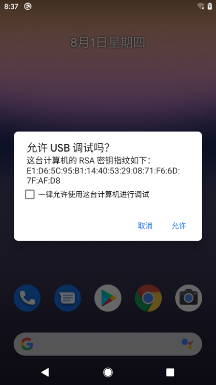
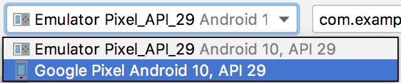
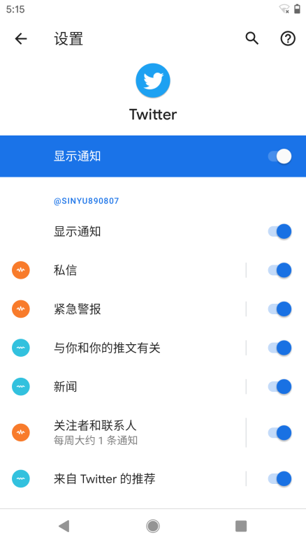
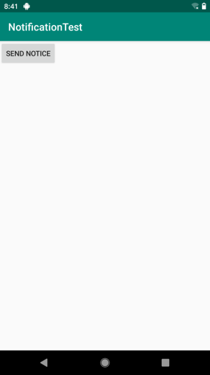
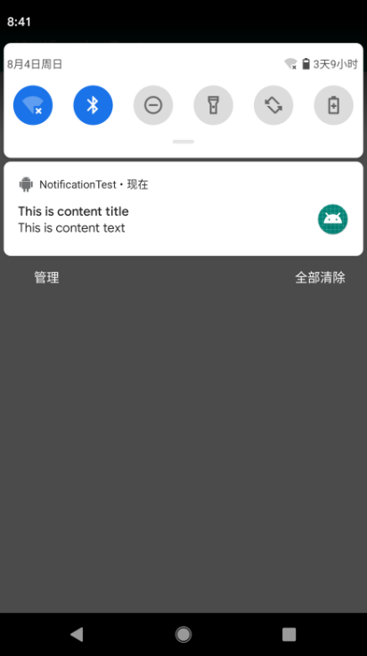
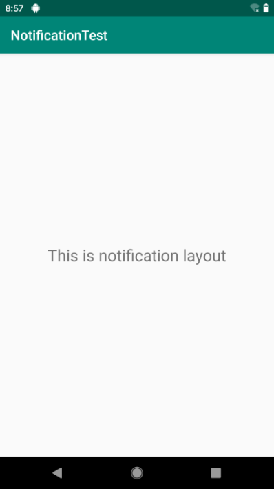
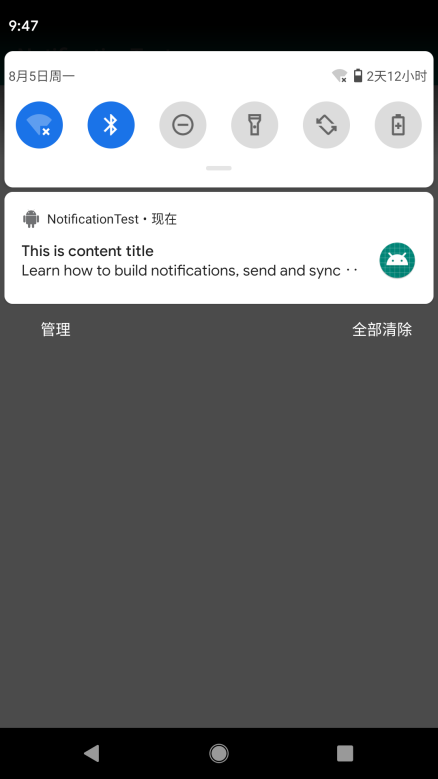
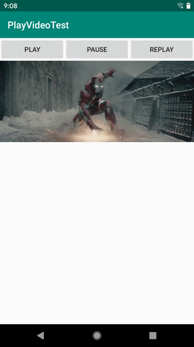
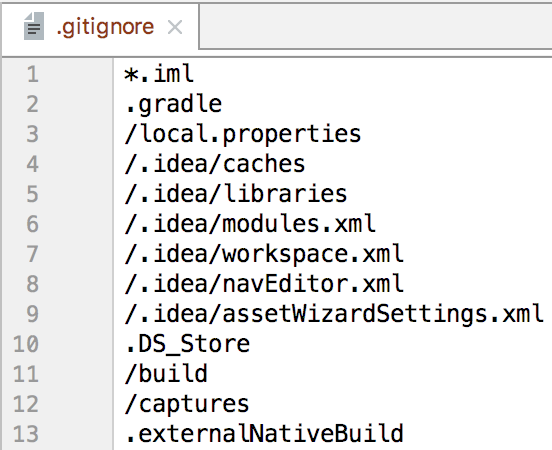
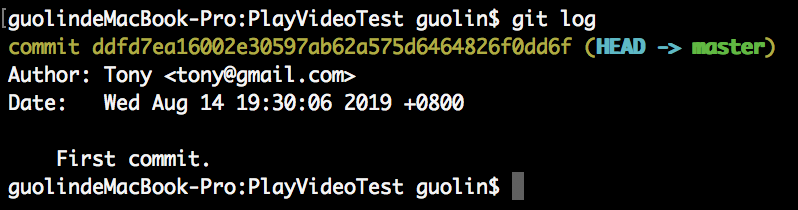

# 第 9 章　丰富你的程序，运用手机多媒体

在很早以前，手机的功能普遍比较单调，仅仅就是用来打电话和发短信的。而如今，手机在我们的生活中正扮演着越来越重要的角色，各种娱乐活动都可以在手机上进行：上班的路上太无聊，可以戴着耳机听音乐；外出旅行的时候，可以在手机上看电影；无论走到哪里，遇到喜欢的事物都可以用手机拍下来。

手机上众多的娱乐方式少不了强大的多媒体功能的支持，而 Android 在这方面做得非常出色。它提供了一系列的 API，使得我们可以在程序中调用很多手机的多媒体资源，从而编写出更加丰富多彩的应用程序。本章我们就将学习 Android 中一些常用的多媒体功能的使用技巧。

在前 8 章中，我们一直是使用模拟器来运行程序的，不过本章涉及的一些功能必须要在真正的 Android 手机上运行才看得到效果。因此，我们就先来学习一下如何使用 Android 手机运行程序。

## 9.1　将程序运行到手机上

不必我多说，首先你需要拥有一部 Android 手机。现在 Android 手机早就不是什么稀罕物，几乎已经是人手一部了，如果你还没有的话，赶紧去购买吧。

想要将程序运行到手机上，我们需要先通过数据线把手机连接到电脑上。然后进入设置 → 系统 → 开发者选项界面，并在这个界面中选中 USB 调试选项，如图 9.1 所示。


**图 9.1　启用 USB 调试**

注意，从 Android 4.2 系统开始，开发者选项默认是隐藏的，你需要先进入“关于手机”界面，然后对着最下面的版本号那一栏连续点击，就会让开发者选项显示出来。

如果你使用的是 Windows 操作系统，可能还需要在电脑上安装手机的驱动。一般借助 360 手机助手或豌豆荚等工具就可以快速进行安装，安装完成后手机就可以连接到电脑上了。

另外，如果这是你首次使用这部手机连接电脑的话，手机上应该还会出现一个如图 9.2 所示的弹窗提示。



**图 9.2　允许 USB 调试的弹窗提示**

勾选“一律允许使用这台计算机进行调试”的选项，然后点击“允许”，这样下次连接电脑的时候就不会再弹出这个提示了。

现在观察 Logcat，你会发现当前是有两个设备在线的，一个是我们一直使用的模拟器，另外一个则是刚刚连接上的手机，如图 9.3 所示。



**图 9.3　在线设备列表**

然后观察 Android Studio 顶部的工具栏，我们可以在这里选择将当前项目运行到哪台设备上，如图 9.4 所示。


**图 9.4　选择当前项目的运行设备**

选中“Google Pixel”这台设备，就可以使用真实的手机来运行程序了。

## 9.2　使用通知

通知（notification）是 Android 系统中比较有特色的一个功能，当某个应用程序希望向用户发出一些提示信息，而该应用程序又不在前台运行时，就可以借助通知来实现。发出一条通知后，手机最上方的状态栏中会显示一个通知的图标，下拉状态栏后可以看到通知的详细内容。Android 的通知功能自推出以来就大获成功，连 iOS 系统也在 5.0 版本之后加入了类似的功能。

### 9.2.1　创建通知渠道

然而，通知这个功能的设计初衷是好的，后来却被开发者给玩坏了。

每发出一条通知，都可能意味着自己的应用程序会拥有更高的打开率，因此有太多太多的应用会想尽办法地给用户发送通知，以博取更多的展示机会。站在应用自身的角度来看，这么做或许并没有什么错；但是站在用户的角度来看，如果每一个应用程序都这么做的话，那么用户手机的状态栏就会被各式各样的通知信息堆满，不胜其烦。

虽然 Android 系统允许我们将某个应用程序的通知完全屏蔽，以防止它一直给我们发送垃圾信息，但是在这些信息中，也可能会有我们所关心的内容。比如说我希望收到某个我所关注的人的微博更新通知，但是却不想让微博一天到晚给我推送一些明星的花边新闻。在过去，用户是没有办法对这些信息做区分的，要么同意接受所有信息，要么屏蔽所有信息，这也是 Android 通知功能的痛点。

于是，Android 8.0 系统引入了通知渠道这个概念。

什么是通知渠道呢？顾名思义，就是每条通知都要属于一个对应的渠道。每个应用程序都可以自由地创建当前应用拥有哪些通知渠道，但是这些通知渠道的控制权是掌握在用户手上的。用户可以自由地选择这些通知渠道的重要程度，是否响铃、是否振动或者是否要关闭这个渠道的通知。

拥有了这些控制权之后，用户就再也不用害怕那些垃圾通知的打扰了，因为用户可以自主地选择关心哪些通知、不关心哪些通知。以刚才的场景举例，微博就可以创建两种通知渠道，一个关注，一个推荐。而我作为用户，如果对推荐类的通知不感兴趣，那么我就可以直接将推荐通知渠道关闭，这样既不影响我接收关心的通知，又不会让那些我不关心的通知来打扰我了。

对于每个应用来说，通知渠道的划分是非常考究的，因为通知渠道一旦创建之后就不能再修改了，因此开发者需要仔细分析自己的应用程序一共有哪些类型的通知，然后再去创建相应的通知渠道。这里我们参考一下 Twitter 的通知渠道划分，如图 9.5 所示。



**图 9.5　Twitter 的通知渠道的划分**

可以看到，Twitter 根据自己的通知类型，对通知渠道进行了非常详细的划分。这样用户的自主选择性就比较高了，也就大大降低了用户因不堪其垃圾通知的骚扰而将应用程序卸载的概率。

而我们的应用程序如果想要发出通知，也必须创建自己的通知渠道才行，下面我们就来学习一下创建通知渠道的详细步骤。

首先需要一个 NotificationManager 对通知进行管理，可以通过调用 Context 的 `getSystemService()` 方法获取。`getSystemService()` 方法接收一个字符串参数用于确定获取系统的哪个服务，这里我们传入 `Context.NOTIFICATION_SERVICE` 即可。因此，获取 NotificationManager 的实例就可以写成：

```Kotlin
val manager = getSystemService(Context.NOTIFICATION_SERVICE) as NotificationManager
```

接下来要使用 `NotificationChannel` 类构建一个通知渠道，并调用 NotificationManager 的 `createNotificationChannel()` 方法完成创建。由于 `NotificationChannel` 类和 `createNotificationChannel()` 方法都是 Android 8.0 系统中新增的 API，因此我们在使用的时候还需要进行版本判断才可以，写法如下：

```Kotlin
if (Build.VERSION.SDK_INT >= Build.VERSION_CODES.O) {
    val channel = NotificationChannel(channelId, channelName, importance)
    manager.createNotificationChannel(channel)
}
```

创建一个通知渠道至少需要渠道 ID、渠道名称以及重要等级这 3 个参数，其中渠道 ID 可以随便定义，只要保证全局唯一性就可以。渠道名称是给用户看的，需要可以清楚地表达这个渠道的用途。通知的重要等级主要有 `IMPORTANCE_HIGH`、`IMPORTANCE_DEFAULT`、`IMPORTANCE_LOW`、`IMPORTANCE_MIN` 这几种，对应的重要程度依次从高到低。不同的重要等级会决定通知的不同行为，后面我们会通过具体的例子进行演示。当然这里只是初始状态下的重要等级，用户可以随时手动更改某个通知渠道的重要等级，开发者是无法干预的。

### 9.2.2　通知的基本用法

了解了如何创建通知渠道之后，下面我们就来看一下通知的使用方法吧。通知的用法还是比较灵活的，既可以在 Activity 里创建，也可以在 BroadcastReceiver 里创建，当然还可以在后面我们即将学习的 Service 里创建。相比于 BroadcastReceiver 和 Service，在 Activity 里创建通知的场景还是比较少的，因为一般只有当程序进入后台的时候才需要使用通知。

不过，无论是在哪里创建通知，整体的步骤都是相同的，下面我们就来学习一下创建通知的详细步骤。

首先需要使用一个 Builder 构造器来创建 `Notification` 对象，但问题在于，Android 系统的每一个版本都会对通知功能进行或多或少的修改，API 不稳定的问题在通知上凸显得尤其严重，比方说刚刚介绍的通知渠道功能在 Android 8.0 系统之前就是没有的。那么该如何解决这个问题呢？其实解决方案我们之前已经见过好几回了，就是使用 AndroidX 库中提供的兼容 API。AndroidX 库中提供了一个 `NotificationCompat` 类，使用这个类的构造器创建 `Notification` 对象，就可以保证我们的程序在所有 Android 系统版本上都能正常工作了，代码如下所示：

```Kotlin
val notification = NotificationCompat.Builder(context, channelId).build()
```

`NotificationCompat.Builder` 的构造函数中接收两个参数：第一个参数是 `context`，这个没什么好说的；第二个参数是渠道 ID，需要和我们在创建通知渠道时指定的渠道 ID 相匹配才行。

当然，上述代码只是创建了一个空的 `Notification` 对象，并没有什么实际作用，我们可以在最终的 `build()` 方法之前连缀任意多的设置方法来创建一个丰富的 `Notification` 对象，先来看一些最基本的设置：

```Kotlin
val notification = NotificationCompat.Builder(context, channelId)
      .setContentTitle("This is content title")
      .setContentText("This is content text")
      .setSmallIcon(R.drawable.small_icon)
      .setLargeIcon(BitmapFactory.decodeResource(getResources(),R.drawable.large_icon))
      .build()
```

上述代码中一共调用了 4 个设置方法，下面我们来一一解析一下。`setContentTitle()` 方法用于指定通知的标题内容，下拉系统状态栏就可以看到这部分内容。`setContentText()` 方法用于指定通知的正文内容，同样下拉系统状态栏就可以看到这部分内容。`setSmallIcon()` 方法用于设置通知的小图标，注意，只能使用纯 alpha 图层的图片进行设置，小图标会显示在系统状态栏上。`setLargeIcon()` 方法用于设置通知的大图标，当下拉系统状态栏时，就可以看到设置的大图标了。

以上工作都完成之后，只需要调用 NotificationManager 的 `notify()` 方法就可以让通知显示出来了。`notify()` 方法接收两个参数：第一个参数是 `id`，要保证为每个通知指定的 `id` 都是不同的；第二个参数则是 `Notification` 对象，这里直接将我们刚刚创建好的 `Notification` 对象传入即可。因此，显示一个通知就可以写成：

```Kotlin
manager.notify(1, notification)
```

到这里就已经把创建通知的每一个步骤都分析完了，下面就让我们通过一个具体的例子来看一看通知到底是长什么样的。

新建一个 NotificationTest 项目，并修改 activity_main.xml 中的代码，如下所示：

```xml
<LinearLayout xmlns:android="http://schemas.android.com/apk/res/android"
    android:orientation="vertical"
    android:layout_width="match_parent"
    android:layout_height="match_parent">

    <Button
        android:id="@+id/sendNotice"
        android:layout_width="wrap_content"
        android:layout_height="wrap_content"
        android:text="Send Notice" />

</LinearLayout>
```

布局文件非常简单，里面只有一个“Send Notice”按钮，用于发出一条通知。接下来修改 MainActivity 中的代码，如下所示：

```Kotlin
class MainActivity : AppCompatActivity() {

    override fun onCreate(savedInstanceState: Bundle?) {
        super.onCreate(savedInstanceState)
        setContentView(R.layout.activity_main)
        val manager = getSystemService(Context.NOTIFICATION_SERVICE) as
                NotificationManager
        if (Build.VERSION.SDK_INT >= Build.VERSION_CODES.O) {
            val channel = NotificationChannel("normal", "Normal",NotificationManager.
                IMPORTANCE_DEFAULT)
            manager.createNotificationChannel(channel)
        }
        sendNotice.setOnClickListener {
            val notification = NotificationCompat.Builder(this, "normal")
                .setContentTitle("This is content title")
                .setContentText("This is content text")
                .setSmallIcon(R.drawable.small_icon)
                .setLargeIcon(BitmapFactory.decodeResource(resources,
                    R.drawable.large_icon))
                .build()
            manager.notify(1, notification)
        }
    }

}
```

可以看到，我们首先获取了 NotificationManager 的实例，并创建了一个 ID 为 normal 通知渠道。创建通知渠道的代码只在第一次执行的时候才会创建，当下次再执行创建代码时，系统会检测到该通知渠道已经存在了，因此不会重复创建，也并不会影响运行效率。

接下来在“Send Notice”按钮的点击事件里完成了通知的创建工作，创建的过程正如前面所描述的一样。注意，在 `NotificationCompat.Builder` 的构造函数中传入的渠道 ID 也必须叫 normal，如果传入了一个不存在的渠道 ID，通知是无法显示出来的。另外，通知上显示的图标你可以使用自己准备的图片，也可以使用随书源码附带的图片资源（源码下载地址见前言），新建一个 drawable-xxhdpi 目录，将图片放入即可。

现在可以来运行一下程序了，其实 MainActivity 一旦打开之后，通知渠道就已经创建成功了，我们可以进入应用程序设置当中查看。依次点击设置 → 应用和通知 →NotificationTest→ 通知，如图 9.6 所示。


**图 9.6　创建的通知渠道**

可以看到，这里已经出现了一个 Normal 通知渠道，就是我们刚刚创建的。

接下来回到 NotificationTest 程序当中，然后点击“Send Notice”按钮，你会在系统状态栏的最左边看到一个小图标，如图 9.7 所示。



**图 9.7　通知的小图标**

下拉系统状态栏可以看到该通知的详细信息，如图 9.8 所示。



**图 9.8　通知的详细信息**

如果你使用过 Android 手机，此时应该会下意识地认为这条通知是可以点击的。但是当你去点击它的时候，会发现没有任何效果。不对啊，每条通知被点击之后都应该有所反应呀。其实要想实现通知的点击效果，我们还需要在代码中进行相应的设置，这就涉及了一个新的概念——PendingIntent。

PendingIntent 从名字上看起来就和 Intent 有些类似，它们确实存在不少共同点。比如它们都可以指明某一个“意图”，都可以用于启动 Activity、启动 Service 以及发送广播等。不同的是，Intent 倾向于立即执行某个动作，而 PendingIntent 倾向于在某个合适的时机执行某个动作。所以，也可以把 PendingIntent 简单地理解为延迟执行的 Intent。

PendingIntent 的用法同样很简单，它主要提供了几个静态方法用于获取 PendingIntent 的实例，可以根据需求来选择是使用 `getActivity()` 方法、`getBroadcast()` 方法，还是 `getService()` 方法。这几个方法所接收的参数都是相同的：第一个参数依旧是 `Context`，不用多做解释；第二个参数一般用不到，传入 0 即可；第三个参数是一个 Intent 对象，我们可以通过这个对象构建出 PendingIntent 的“意图”；第四个参数用于确定 PendingIntent 的行为，有 `FLAG_ONE_SHOT`、`FLAG_NO_CREATE`、`FLAG_CANCEL_CURRENT` 和 `FLAG_UPDATE_CURRENT` 这 4 种值可选，每种值的具体含义你可以查看文档，通常情况下这个参数传入 0 就可以了。

对 PendingIntent 有了一定的了解后，我们再回过头来看一下 `NotificationCompat.Builder`。这个构造器还可以连缀一个 `setContentIntent()` 方法，接收的参数正是一个 PendingIntent 对象。因此，这里就可以通过 PendingIntent 构建一个延迟执行的“意图”，当用户点击这条通知时就会执行相应的逻辑。

现在我们来优化一下 NotificationTest 项目，给刚才的通知加上点击功能，让用户点击它的时候可以启动另一个 Activity。

首先需要准备好另一个 Activity，右击 com.example.notificationtest 包 →New→Activity→Empty Activity，新建 NotificationActivity。然后修改 activity_notification.xml 中的代码，如下所示：

```xml
<RelativeLayout xmlns:android="http://schemas.android.com/apk/res/android"
    android:layout_width="match_parent"
    android:layout_height="match_parent" >

    <TextView
        android:layout_width="wrap_content"
        android:layout_height="wrap_content"
        android:layout_centerInParent="true"
        android:textSize="24sp"
        android:text="This is notification layout"
        />

</RelativeLayout>
```

这样就把 NotificationActivity 准备好了，下面我们修改 MainActivity 中的代码，给通知加入点击功能，如下所示：

```Kotlin
class MainActivity : AppCompatActivity() {

    override fun onCreate(savedInstanceState: Bundle?) {
        ...
        sendNotice.setOnClickListener {
            val intent = Intent(this, NotificationActivity::class.java)
            val pi = PendingIntent.getActivity(this, 0, intent, 0)
            val notification = NotificationCompat.Builder(this, "normal")
                .setContentTitle("This is content title")
                .setContentText("This is content text")
                .setSmallIcon(R.drawable.small_icon)
                .setLargeIcon(BitmapFactory.decodeResource(resources,
                    R.drawable.large_icon))
                .setContentIntent(pi)
                .build()
            manager.notify(1, notification)
        }
    }

}
```

可以看到，这里先是使用 Intent 表达出我们想要启动 NotificationActivity 的“意图”，然后将构建好的 Intent 对象传入 PendingIntent 的 `getActivity()` 方法里，以得到 PendingIntent 的实例，接着在 `NotificationCompat.Builder` 中调用 `setContentIntent()` 方法，把它作为参数传入即可。

现在重新运行一下程序，并点击“Send Notice”按钮，依旧会发出一条通知。然后下拉系统状态栏，点击一下该通知，就会打开 NotificationActivity 的界面了，如图 9.9 所示。



**图 9.9　点击通知后打开 NotificationActivity 界面**

咦？怎么系统状态上的通知图标还没有消失呢？是这样的，如果我们没有在代码中对该通知进行取消，它就会一直显示在系统的状态栏上。解决的方法有两种：一种是在 `NotificationCompat.Builder` 中再连缀一个 `setAutoCancel()` 方法，一种是显式地调用 NotificationManager 的 `cancel()` 方法将它取消。两种方法我们都学习一下。

第一种方法写法如下：

```Kotlin
val notification = NotificationCompat.Builder(this, "normal")
        ...
        .setAutoCancel(true)
        .build()
```

可以看到，`setAutoCancel()` 方法传入 `true`，就表示当点击这个通知的时候，通知会自动取消。

第二种方法写法如下：

```Kotlin
class NotificationActivity : AppCompatActivity() {

    override fun onCreate(savedInstanceState: Bundle?) {
        super.onCreate(savedInstanceState)
        setContentView(R.layout.activity_notification)
        val manager = getSystemService(Context.NOTIFICATION_SERVICE) as
            NotificationManager
        manager.cancel(1)
    }

}
```

这里我们在 `cancel()` 方法中传入了 1，这个 1 是什么意思呢？还记得在创建通知的时候给每条通知指定的 id 吗？当时我们给这条通知设置的 id 就是 1。因此，如果你想取消哪条通知，在 `cancel()` 方法中传入该通知的 id 就行了。

### 9.2.3　通知的进阶技巧

现在你已经掌握了创建和取消通知的方法，并且知道了如何去响应通知的点击事件。不过通知的用法并不仅仅是这些呢，下面我们就来探究一下通知的更多技巧。

上一小节中创建的通知属于最基本的通知，实际上，`NotificationCompat.Builder` 中提供了非常丰富的 API，以便我们创建出更加多样的通知效果。当然，每一个 API 都详细地讲一遍不太可能，我们只能从中选一些比较常用的 API 进行学习。

先来看看 `setStyle()` 方法，这个方法允许我们构建出富文本的通知内容。也就是说，通知中不光可以有文字和图标，还可以包含更多的东西。`setStyle()` 方法接收一个 `NotificationCompat.Style` 参数，这个参数就是用来构建具体的富文本信息的，如长文字、图片等。

在开始使用 `setStyle()` 方法之前，我们先来做一个试验吧，之前的通知内容都比较短，如果设置成很长的文字会是什么效果呢？比如这样写：

```Kotlin
val notification = NotificationCompat.Builder(this, "normal")
        ...
        .setContentText("Learn how to build notifications, send and sync data,
        and use voice actions.Get the official Android IDE and developer tools to
        build apps for Android.")
        ...
        .build()
```

现在重新运行程序并触发通知，效果如图 9.10 所示。



**图 9.10　通知内容文字过长的效果**

可以看到，通知内容是无法完整显示的，多余的部分会用省略号代替。其实这也很正常，因为通知的内容本来就应该言简意赅，详细内容放到点击后打开的 Activity 当中会更加合适。

但是如果你真的非常需要在通知当中显示一段长文字，Android 也是支持的，通过 `setStyle()` 方法就可以做到，具体写法如下：

```Kotlin
val notification = NotificationCompat.Builder(this, "normal")
        ...
        .setStyle(NotificationCompat.BigTextStyle().bigText("Learn how to build
        notifications, send and sync  data, and use voice actions. Get the official
        Android IDE and developer tools to build apps for Android."))
       .build()
```

这里使用了 `setStyle()` 方法替代 `setContentText()` 方法。在 `setStyle()` 方法中，我们创建了一个 `NotificationCompat.BigTextStyle` 对象，这个对象就是用于封装长文字信息的，只要调用它的 `bigText()` 方法并将文字内容传入就可以了。

再次重新运行程序并触发通知，效果如图 9.11 所示。


**图 9.11　通知中显示长文字的效果**

除了显示长文字之外，通知里还可以显示一张大图片，具体用法是基本相似的：

```Kotlin
val notification = NotificationCompat.Builder(this, "normal")
        ...
        .setStyle(NotificationCompat.BigPictureStyle().bigPicture(
            BitmapFactory.decodeResource(resources, R.drawable.big_image)))
        .build()
```

可以看到，这里仍然是调用的 `setStyle()` 方法，这次我们在参数中创建了一个 `NotificationCompat.BigPictureStyle` 对象，这个对象就是用于设置大图片的，然后调用它的 `bigPicture()` 方法并将图片传入。这里我事先准备好了一张图片，通过 BitmapFactory 的 `decodeResource()` 方法将图片解析成 `Bitmap` 对象，再传入 `bigPicture()` 方法中就可以了。

现在重新运行一下程序并触发通知，效果如图 9.12 所示。


**图 9.12　通知中显示大图片的效果**

这样我们就把 `setStyle()` 方法中的重要内容基本掌握了。

接下来，我们学习一下不同重要等级的通知渠道对通知的行为具体有什么影响。其实简单来讲，就是通知渠道的重要等级越高，发出的通知就越容易获得用户的注意。比如高重要等级的通知渠道发出的通知可以弹出横幅、发出声音，而低重要等级的通知渠道发出的通知不仅可能会在某些情况下被隐藏，而且可能会被改变显示的顺序，将其排在更重要的通知之后。

但需要注意的是，开发者只能在创建通知渠道的时候为它指定初始的重要等级，如果用户不认可这个重要等级的话，可以随时进行修改，开发者对此无权再进行调整和变更，因为通知渠道一旦创建就不能再通过代码修改了。

既然无法修改之前创建的通知渠道，那么我们就只好再创建一个新的通知渠道来测试了。修改 MainActivity 中的代码，如下所示：

```Kotlin
class MainActivity : AppCompatActivity() {

    override fun onCreate(savedInstanceState: Bundle?) {
        ...
        if (Build.VERSION.SDK_INT >= Build.VERSION_CODES.O) {
            ...
            val channel2 = NotificationChannel("important", "Important",
                NotificationManager.IMPORTANCE_HIGH)
            manager.createNotificationChannel(channel2)
        }
        sendNotice.setOnClickListener {
            val intent = Intent(this, NotificationActivity::class.java)
            val pi = PendingIntent.getActivity(this, 0, intent, 0)
            val notification = NotificationCompat.Builder(this, "important")
            ...
        }
    }

}
```

这里我们将通知渠道的重要等级设置成了“高”，表示这是一条非常重要的通知，要求用户必须立刻看到。现在重新运行一下程序，并点击“Send notice”按钮，效果如图 9.13 所示。


**图 9.13　触发一条重要通知**

可以看到，这次的通知不是在系统状态栏显示一个小图标了，而是弹出了一个横幅，并附带了通知的详细内容，表示这是一条非常重要的通知。不管用户现在是在玩游戏还是看电影，这条通知都会显示在最上方，以此引起用户的注意。当然，使用这类通知时一定要小心，确保你的通知内容的确是至关重要的，不然如果让用户产生排斥感的话，可能会造成适得其反的效果。

## 9.3　调用摄像头和相册

我们平时在使用 QQ 或微信的时候经常要和别人分享图片，这些图片可以是用手机摄像头拍的，也可以是从相册中选取的。这样的功能实在是太常见了，几乎是应用程序必备的功能，那么本节我们就学习一下调用摄像头和相册方面的知识。

### 9.3.1　调用摄像头拍照

先来看看摄像头方面的知识，现在很多应用会要求用户上传一张图片作为头像，这时打开摄像头拍张照是最简单快捷的。下面就让我们通过一个例子学习一下，如何才能在应用程序里调用手机的摄像头进行拍照。

新建一个 CameraAlbumTest 项目，然后修改 activity_main.xml 中的代码，如下所示：

```xml
<LinearLayout xmlns:android="http://schemas.android.com/apk/res/android"
    android:orientation="vertical"
    android:layout_width="match_parent"
    android:layout_height="match_parent" >

    <Button
        android:id="@+id/takePhotoBtn"
        android:layout_width="match_parent"
        android:layout_height="wrap_content"
        android:text="Take Photo" />

    <ImageView
        android:id="@+id/imageView"
        android:layout_width="wrap_content"
        android:layout_height="wrap_content"
        android:layout_gravity="center_horizontal" />

</LinearLayout>
```

可以看到，布局文件中只有两个控件：一个 Button 和一个 ImageView。Button 是用于打开摄像头进行拍照的，而 ImageView 则是用于将拍到的图片显示出来。

然后开始编写调用摄像头的具体逻辑，修改 MainActivity 中的代码，如下所示：

```Kotlin
class MainActivity : AppCompatActivity() {

    val takePhoto = 1
    lateinit var imageUri: Uri
    lateinit var outputImage: File

    override fun onCreate(savedInstanceState: Bundle?) {
        super.onCreate(savedInstanceState)
        setContentView(R.layout.activity_main)
        takePhotoBtn.setOnClickListener {
            // 创建File对象，用于存储拍照后的图片
            outputImage = File(externalCacheDir, "output_image.jpg")
            if (outputImage.exists()) {
                outputImage.delete()
            }
            outputImage.createNewFile()
            imageUri = if (Build.VERSION.SDK_INT >= Build.VERSION_CODES.N) {
                FileProvider.getUriForFile(this, "com.example.cameraalbumtest.
                    fileprovider", outputImage)
            } else {
                Uri.fromFile(outputImage)
            }
            // 启动相机程序
            val intent = Intent("android.media.action.IMAGE_CAPTURE")
            intent.putExtra(MediaStore.EXTRA_OUTPUT, imageUri)
            startActivityForResult(intent, takePhoto)
        }
    }

    override fun onActivityResult(requestCode: Int, resultCode: Int, data: Intent?) {
        super.onActivityResult(requestCode, resultCode, data)
        when (requestCode) {
            takePhoto -> {
                if (resultCode == Activity.RESULT_OK) {
                    // 将拍摄的照片显示出来
                    val bitmap = BitmapFactory.decodeStream(contentResolver.
                        openInputStream(imageUri))
                    imageView.setImageBitmap(rotateIfRequired(bitmap))
                }
            }
        }
    }

    private fun rotateIfRequired(bitmap: Bitmap): Bitmap {
        val exif = ExifInterface(outputImage.path)
        val orientation = exif.getAttributeInt(ExifInterface.TAG_ORIENTATION,
            ExifInterface.ORIENTATION_NORMAL)
        return when (orientation) {
            ExifInterface.ORIENTATION_ROTATE_90 -> rotateBitmap(bitmap, 90)
            ExifInterface.ORIENTATION_ROTATE_180 -> rotateBitmap(bitmap, 180)
            ExifInterface.ORIENTATION_ROTATE_270 -> rotateBitmap(bitmap, 270)
            else -> bitmap
        }
    }

    private fun rotateBitmap(bitmap: Bitmap, degree: Int): Bitmap {
        val matrix = Matrix()
        matrix.postRotate(degree.toFloat())
        val rotatedBitmap = Bitmap.createBitmap(bitmap, 0, 0, bitmap.width, bitmap.height,
            matrix, true)
        bitmap.recycle() // 将不再需要的Bitmap对象回收
        return rotatedBitmap
    }
}
```

上述代码稍微有点复杂，下面我们来仔细地分析一下。在 MainActivity 中要做的第一件事自然是给 Button 注册点击事件，然后在点击事件里开始处理调用摄像头的逻辑，我们重点看一下这部分代码。

首先这里创建了一个 `File` 对象，用于存放摄像头拍下的图片，这里我们把图片命名为 output_image.jpg，并存放在手机 SD 卡的应用关联缓存目录下。什么叫作应用关联缓存目录呢？就是指 SD 卡中专门用于存放当前应用缓存数据的位置，调用 `getExternalCacheDir()` 方法可以得到这个目录，具体的路径是/sdcard/Android/data/\<package name\>/cache。那么为什么要使用应用关联缓存目录来存放图片呢？因为从 Android 6.0 系统开始，读写 SD 卡被列为了危险权限，如果将图片存放在 SD 卡的任何其他目录，都要进行运行时权限处理才行，而使用应用关联目录则可以跳过这一步。另外，从 Android 10.0 系统开始，公有的 SD 卡目录已经不再允许被应用程序直接访问了，而是要使用作用域存储才行。这部分内容不在本书的讨论范围内，如果你有兴趣学习的话，可以关注我的微信公众号（见封面），回复“作用域存储”即可，我专门写了一篇非常详细的文章来讲解这部分内容。

接着会进行一个判断，如果运行设备的系统版本低于 Android 7.0，就调用 `Uri` 的 `fromFile()` 方法将 `File` 对象转换成 `Uri` 对象，这个 `Uri` 对象标识着 output_image.jpg 这张图片的本地真实路径。否则，就调用 FileProvider 的 `getUriForFile()` 方法将 `File` 对象转换成一个封装过的 `Uri` 对象。`getUriForFile()` 方法接收 3 个参数：第一个参数要求传入 `Context` 对象，第二个参数可以是任意唯一的字符串，第三个参数则是我们刚刚创建的 `File` 对象。之所以要进行这样一层转换，是因为从 Android 7.0 系统开始，直接使用本地真实路径的 `Uri` 被认为是不安全的，会抛出一个 FileUriExposedException 异常。而 FileProvider 则是一种特殊的 ContentProvider，它使用了和 ContentProvider 类似的机制来对数据进行保护，可以选择性地将封装过的 `Uri` 共享给外部，从而提高了应用的安全性。

接下来构建了一个 Intent 对象，并将这个 Intent 的 `action` 指定为 `android.media.action.IMAGE_CAPTURE`，再调用 Intent 的 `putExtra()` 方法指定图片的输出地址，这里填入刚刚得到的 `Uri` 对象，最后调用 `startActivityForResult()` 启动 Activity。由于我们使用的是一个隐式 Intent，系统会找出能够响应这个 Intent 的 Activity 去启动，这样照相机程序就会被打开，拍下的照片将会输出到 output_image.jpg 中。

由于刚才我们是使用 `startActivityForResult()` 启动 Activity 的，因此拍完照后会有结果返回到 `onActivityResult()` 方法中。如果发现拍照成功，就可以调用 BitmapFactory 的 `decodeStream()` 方法将 output_image.jpg 这张照片解析成 `Bitmap` 对象，然后把它设置到 ImageView 中显示出来。

需要注意的是，调用照相机程序去拍照有可能会在一些手机上发生照片旋转的情况。这是因为这些手机认为打开摄像头进行拍摄时手机就应该是横屏的，因此回到竖屏的情况下就会发生 90 度的旋转。为此，这里我们又加上了判断图片方向的代码，如果发现图片需要进行旋转，那么就先将图片旋转相应的角度，然后再显示到界面上。

不过现在还没结束，刚才提到了 ContentProvider，那么我们自然要在 AndroidManifest.xml 中对它进行注册才行，代码如下所示：

```xml
<manifest xmlns:android="http://schemas.android.com/apk/res/android"
        package="com.example.cameraalbumtest">
    <application
        android:allowBackup="true"
        android:icon="@mipmap/ic_launcher"
        android:label="@string/app_name"
        android:supportsRtl="true"
        android:theme="@style/AppTheme">
        ...
        <provider
            android:name="androidx.core.content.FileProvider"
            android:authorities="com.example.cameraalbumtest.fileprovider"
            android:exported="false"
            android:grantUriPermissions="true">
            <meta-data
                android:name="android.support.FILE_PROVIDER_PATHS"
                android:resource="@xml/file_paths" />
        </provider>
    </application>
</manifest>
```

`android:name` 属性的值是固定的，而 `android:authorities` 属性的值必须和刚才 `FileProvider.getUriForFile()` 方法中的第二个参数一致。另外，这里还在 `<provider>` 标签的内部使用 `<meta-data>` 指定 `Uri` 的共享路径，并引用了一个 `@xml/file_paths` 资源。当然，这个资源现在还是不存在的，下面我们就来创建它。

右击 `res` 目录 →New→Directory，创建一个 xml 目录，接着右击 xml 目录 →New→File，创建一个 file_paths.xml 文件。然后修改 file_paths.xml 文件中的内容，如下所示：

```xml
<?xml version="1.0" encoding="utf-8"?>
<paths xmlns:android="http://schemas.android.com/apk/res/android">
    <external-path name="my_images" path="/" />
</paths>
```

`external-path` 就是用来指定 `Uri` 共享路径的，`name` 属性的值可以随便填，`path` 属性的值表示共享的具体路径。这里使用一个单斜线表示将整个 SD 卡进行共享，当然你也可以仅共享存放 output_image.jpg 这张图片的路径。

这样代码就编写完了，现在将程序运行到手机上，点击“Take Photo”按钮即可进行拍照，如图 9.14 所示。拍照完成后，点击中间按钮就会回到我们程序的界面。同时，拍摄的照片也显示出来了，如图 9.15 所示。


**图 9.14　打开摄像头拍照**


**图 9.15　拍照的最终效果**

### 9.3.2　从相册中选择图片

虽然调用摄像头拍照既方便又快捷，但我们并不是每次都需要当场拍一张照片的。因为每个人的手机相册里应该都会存有许多张图片，直接从相册里选取一张现有的图片会比打开相机拍一张照片更加常用。一个优秀的应用程序应该将这两种选择方式都提供给用户，由用户来决定使用哪一种。下面我们就来看一下，如何才能实现从相册中选择图片的功能。

还是在 CameraAlbumTest 项目的基础上进行修改，编辑 activity_main.xml 文件，在布局中添加一个按钮，用于从相册中选择图片，代码如下所示：

```xml
<LinearLayout xmlns:android="http://schemas.android.com/apk/res/android"
    android:orientation="vertical"
    android:layout_width="match_parent"
    android:layout_height="match_parent" >

    <Button
        android:id="@+id/takePhotoBtn"
        android:layout_width="match_parent"
        android:layout_height="wrap_content"
        android:text="Take Photo" />

    <Button
        android:id="@+id/fromAlbumBtn"
        android:layout_width="match_parent"
        android:layout_height="wrap_content"
        android:text="From Album" />

    <ImageView
        android:id="@+id/imageView"
        android:layout_width="wrap_content"
        android:layout_height="wrap_content"
        android:layout_gravity="center_horizontal" />

</LinearLayout>
```

然后修改 MainActivity 中的代码，加入从相册选择图片的逻辑，代码如下所示：

```Kotlin
class MainActivity : AppCompatActivity() {
    ...
    val fromAlbum = 2

    override fun onCreate(savedInstanceState: Bundle?) {
        ...
        fromAlbumBtn.setOnClickListener {
            // 打开文件选择器
            val intent = Intent(Intent.ACTION_OPEN_DOCUMENT)
            intent.addCategory(Intent.CATEGORY_OPENABLE)
            // 指定只显示图片
            intent.type = "image/*"
            startActivityForResult(intent, fromAlbum)
        }
    }

    override fun onActivityResult(requestCode: Int, resultCode: Int, data: Intent?) {
        super.onActivityResult(requestCode, resultCode, data)
        when (requestCode) {
            ...
            fromAlbum -> {
                if (resultCode == Activity.RESULT_OK && data != null) {
                    data.data?.let { uri ->
                        // 将选择的图片显示
                        val bitmap = getBitmapFromUri(uri)
                        imageView.setImageBitmap(bitmap)
                    }
                }
            }
        }
    }

    private fun getBitmapFromUri(uri: Uri) = contentResolver
        .openFileDescriptor(uri, "r")?.use {
        BitmapFactory.decodeFileDescriptor(it.fileDescriptor)
    }
    ...
}
```

可以看到，在“From Album”按钮的点击事件里，我们先构建了一个 Intent 对象，并将它的 action 指定为 `Intent.ACTION_OPEN_DOCUMENT`，表示打开系统的文件选择器。接着给这个 Intent 对象设置一些条件过滤，只允许可打开的图片文件显示出来，然后调用 `startActivityForResult()` 方法即可。注意，在调用 `startActivityForResult()` 方法的时候，我们给第二个参数传入的值变成了 `fromAlbum`，这样当选择完图片回到 `onActivityResult()` 方法时，就会进入 `fromAlbum` 的条件下处理图片。

接下来的部分就很简单了，我们调用了返回 Intent 的 `getData()` 方法来获取选中图片的 `Uri`，然后再调用 `getBitmapFromUri()` 方法将 `Uri` 转换成 `Bitmap` 对象，最终将图片显示到界面上。

现在重新运行程序，然后点击一下“From Album”按钮，就会打开系统的文件选择器了，如图 9.16 所示。


**图 9.16　打开文件选择器**

然后随意选择一张图片，回到我们程序的界面，选中的图片应该就会显示出来了，如图 9.17 所示。


**图 9.17　选择图片的最终效果**

调用摄像头拍照以及从相册中选择图片是很多 Android 应用都会带有的功能，现在你已经将这两种技术都学会了，如果将来在工作中需要开发类似的功能，相信你一定能轻松完成的。不过，目前我们的实现还不算完美，因为如果某些图片的像素很高，直接加载到内存中就有可能会导致程序崩溃。更好的做法是根据项目的需求先对图片进行适当的压缩，然后再加载到内存中。至于如何对图片进行压缩，就要考验你查阅资料的能力了，这里就不再展开进行讲解了。

## 9.4　播放多媒体文件

手机上最常见的休闲方式毫无疑问就是听音乐和看电影了，随着移动设备的普及，越来越多的人可以随时享受优美的音乐，观看精彩的电影。Android 在播放音频和视频方面做了相当不错的支持，它提供了一套较为完整的 API，使得开发者可以很轻松地编写出一个简易的音频或视频播放器，下面我们就来具体地学习一下。

### 9.4.1　播放音频

在 Android 中播放音频文件一般是使用 `MediaPlayer` 类实现的，它对多种格式的音频文件提供了非常全面的控制方法，从而使播放音乐的工作变得十分简单。表 9.1 列出了 `MediaPlayer` 类中一些较为常用的控制方法。

**表 9.1** **`MediaPlayer`** **类中常用的控制方法**

|方法名|功能描述|
| ------| -----------------------------------------------------|
|`setDataSource()`|设置要播放的音频文件的位置|
|`prepare()`|在开始播放之前调用，以完成准备工作|
|`start()`|开始或继续播放音频|
|`pause()`|暂停播放音频|
|`reset()`|将 MediaPlayer 对象重置到刚刚创建的状态|
|`seekTo()`|从指定的位置开始播放音频|
|`stop()`|停止播放音频。调用后的 MediaPlayer 对象无法再播放音频|
|`release()`|释放与 MediaPlayer 对象相关的资源|
|`isPlaying()`|判断当前 MediaPlayer 是否正在播放音频|
|`getDuration()`|获取载入的音频文件的时长|

简单了解了上述方法后，我们再来梳理一下 `MediaPlayer` 的工作流程。首先需要创建一个 `MediaPlayer` 对象，然后调用 `setDataSource()` 方法设置音频文件的路径，再调用 `prepare()` 方法使 `MediaPlayer` 进入准备状态，接下来调用 `start()` 方法就可以开始播放音频，调用 `pause()` 方法就会暂停播放，调用 `reset()` 方法就会停止播放。

下面就让我们通过一个具体的例子来学习一下吧，新建一个 PlayAudioTest 项目，然后修改 activity_main.xml 中的代码，如下所示：

```xml
<LinearLayout xmlns:android="http://schemas.android.com/apk/res/android"
    android:orientation="vertical"
    android:layout_width="match_parent"
    android:layout_height="match_parent" >

    <Button
        android:id="@+id/play"
        android:layout_width="match_parent"
        android:layout_height="wrap_content"
        android:text="Play" />

    <Button
        android:id="@+id/pause"
        android:layout_width="match_parent"
        android:layout_height="wrap_content"
        android:text="Pause" />

    <Button
        android:id="@+id/stop"
        android:layout_width="match_parent"
        android:layout_height="wrap_content"
        android:text="Stop" />

</LinearLayout>
```

布局文件中放置了 3 个按钮，分别用于对音频文件进行播放、暂停和停止操作。

MediaPlayer 可以用于播放网络、本地以及应用程序安装包中的音频。这里简单起见，我们就以播放应用程序安装包中的音频来举例吧。

Android Studio 允许我们在项目工程中创建一个 assets 目录，并在这个目录下存放任意文件和子目录，这些文件和子目录在项目打包时会一并被打包到安装文件中，然后我们在程序中就可以借助 `AssetManager` 这个类提供的接口对 assets 目录下的文件进行读取。

那么首先来创建 assets 目录吧，它必须创建在 app/src/main 这个目录下面，也就是和 java、res 这两个目录是平级的。右击 app/src/main→New→Directory，在弹出的对话框中输入“assets”，目录就创建完成了。

由于我们要播放音频文件，这里我提前准备好了一份 music.mp3 资源（资源下载方式见前言），将它放入 assets 目录中即可，如图 9.18 所示。


**图 9.18　将音频资源放入 assets 目录**

然后修改 MainActivity 中的代码，如下所示：

```Kotlin
class MainActivity : AppCompatActivity() {

    private val mediaPlayer = MediaPlayer()

    override fun onCreate(savedInstanceState: Bundle?) {
        super.onCreate(savedInstanceState)
        setContentView(R.layout.activity_main)
        initMediaPlayer()
        play.setOnClickListener {
            if (!mediaPlayer.isPlaying) {
                mediaPlayer.start() // 开始播放
            }
        }
        pause.setOnClickListener {
            if (mediaPlayer.isPlaying) {
                mediaPlayer.pause() // 暂停播放
            }
        }
        stop.setOnClickListener {
            if (mediaPlayer.isPlaying) {
                mediaPlayer.reset() // 停止播放
                initMediaPlayer()
            }
        }
    }

    private fun initMediaPlayer() {
        val assetManager = assets
        val fd = assetManager.openFd("music.mp3")
        mediaPlayer.setDataSource(fd.fileDescriptor, fd.startOffset, fd.length)
        mediaPlayer.prepare()
    }

    override fun onDestroy() {
        super.onDestroy()
        mediaPlayer.stop()
        mediaPlayer.release()
    }

}
```

可以看到，在类初始化的时候，我们就先创建了一个 MediaPlayer 的实例，然后在 `onCreate()` 方法中调用 `initMediaPlayer()` 方法，为 `MediaPlayer` 对象进行初始化操作。在 `initMediaPlayer()` 方法中，首先通过 `getAssets()` 方法得到了一个 `AssetManager` 的实例，`AssetManager` 可用于读取 assets 目录下的任何资源。接着我们调用了 `openFd()` 方法将音频文件句柄打开，后面又依次调用了 `setDataSource()` 方法和 `prepare()` 方法，为 MediaPlayer 做好了播放前的准备。

接下来我们看一下各个按钮的点击事件中的代码。当点击“Play”按钮时会进行判断，如果当前 MediaPlayer 没有正在播放音频，则调用 `start()` 方法开始播放。当点击“Pause”按钮时会判断，如果当前 MediaPlayer 正在播放音频，则调用 `pause()` 方法暂停播放。当点击“Stop”按钮时会判断，如果当前 MediaPlayer 正在播放音频，则调用 `reset()` 方法将 MediaPlayer 重置为刚刚创建的状态，然后重新调用一遍 `initMediaPlayer()` 方法。

最后在 `onDestroy()` 方法中，我们还需要分别调用 `stop()` 方法和 `release()` 方法，将与 MediaPlayer 相关的资源释放掉。

这样一个简易版的音乐播放器就完成了，现在将程序运行到手机上，界面如图 9.19 所示。


**图 9.19　音乐播放器主界面**

点击一下“Play”按钮，优美的音乐就会响起，然后点击“Pause”按钮，音乐就会停住，再次点击“Play”按钮，会接着暂停之前的位置继续播放。这时如果点击一下“Stop”按钮，音乐也会停住，但是当再次点击“Play”按钮时，音乐就会从头开始播放了。

### 9.4.2　播放视频

播放视频文件其实并不比播放音频文件复杂，主要是使用 VideoView 类来实现的。这个类将视频的显示和控制集于一身，我们仅仅借助它就可以完成一个简易的视频播放器。VideoView 的用法和 MediaPlayer 也比较类似，常用方法如表 9.2 所示。

**表 9.2　VideoView 的常用方法**

|方法名|功能描述|
| ------| ---------------------------|
|`setVideoPath()`|设置要播放的视频文件的位置|
|`start()`|开始或继续播放视频|
|`pause()`|暂停播放视频|
|`resume()`|将视频从头开始播放|
|`seekTo()`|从指定的位置开始播放视频|
|`isPlaying()`|判断当前是否正在播放视频|
|`getDuration()`|获取载入的视频文件的时长|
|`suspend()`|释放 ViedoView 所占用的资源|

我们还是通过一个实际的例子来学习一下吧，新建 PlayVideoTest 项目，然后修改 activity_main.xml 中的代码，如下所示：

```xml
<LinearLayout xmlns:android="http://schemas.android.com/apk/res/android"
    android:orientation="vertical"
    android:layout_width="match_parent"
    android:layout_height="match_parent" >

    <LinearLayout
        android:layout_width="match_parent"
        android:layout_height="wrap_content" >

        <Button
            android:id="@+id/play"
            android:layout_width="0dp"
            android:layout_height="wrap_content"
            android:layout_weight="1"
            android:text="Play" />

        <Button
            android:id="@+id/pause"
            android:layout_width="0dp"
            android:layout_height="wrap_content"
            android:layout_weight="1"
            android:text="Pause" />

        <Button
            android:id="@+id/replay"
            android:layout_width="0dp"
            android:layout_height="wrap_content"
            android:layout_weight="1"
            android:text="Replay" />

    </LinearLayout>

    <VideoView
        android:id="@+id/videoView"
        android:layout_width="match_parent"
        android:layout_height="wrap_content" />

</LinearLayout>
```

这个布局文件中同样放置了 3 个按钮，分别用于控制视频的播放、暂停和重新播放。另外在按钮的下面又放置了一个 VideoView，稍后的视频就将在这里显示。

接下来的问题就是存放视频资源了，很可惜的是，VideoView 不支持直接播放 assets 目录下的视频资源，所以我们只能寻找其他的解决方案。res 目录下允许我们再创建一个 raw 目录，像诸如音频、视频之类的资源文件也可以放在这里，并且 VideoView 是可以直接播放这个目录下的视频资源的。

现在右击 app/src/main/res→New→Directory，在弹出的对话框中输入“raw”，完成 raw 目录的创建，并把要播放的视频资源放在里面。这里我提前准备了一个 video.mp4 资源（资源下载方式见前言），如图 9.20 所示，你也可以使用自己准备的视频资源。


**图 9.20　将视频资源放到 raw 目录当中**

然后修改 MainActivity 中的代码，如下所示：

```Kotlin
class MainActivity : AppCompatActivity() {

    override fun onCreate(savedInstanceState: Bundle?) {
        super.onCreate(savedInstanceState)
        setContentView(R.layout.activity_main)
        val uri = Uri.parse("android.resource://$packageName/${R.raw.video}")
        videoView.setVideoURI(uri)
        play.setOnClickListener {
            if (!videoView.isPlaying) {
                videoView.start() // 开始播放
            }
        }
        pause.setOnClickListener {
            if (videoView.isPlaying) {
                videoView.pause() // 暂停播放
            }
        }
        replay.setOnClickListener {
            if (videoView.isPlaying) {
                videoView.resume() // 重新播放
            }
        }
    }

    override fun onDestroy() {
        super.onDestroy()
        videoView.suspend()
    }

}
```

这段代码现在看起来就非常简单了，因为它和前面播放音频的代码比较类似。我们首先在 `onCreate()` 方法中调用了 `Uri.parse()` 方法，将 raw 目录下的 video.mp4 文件解析成了一个 `Uri` 对象，这里使用的写法是 Android 要求的固定写法。然后调用 VideoView 的 `setVideoURI()` 方法将刚才解析出来的 `Uri` 对象传入，这样 VideoView 就初始化完成了。

下面看一下各个按钮的点击事件。当点击“Play”按钮时会判断，如果当前没有正在播放视频，则调用 `start()` 方法开始播放。当点击“Pause”按钮时会判断，如果当前视频正在播放，则调用 `pause()` 方法暂停播放。当点击“Replay”按钮时会判断，如果当前视频正在播放，则调用 `resume()` 方法从头播放视频。

最后在 `onDestroy()` 方法中，我们还需要调用一下 `suspend()` 方法，将 VideoView 所占用的资源释放掉。

现在将程序运行到手机上，点击一下“Play”按钮，就可以看到视频已经开始播放了，如图 9.21 所示。



**图 9.21　VideoView 播放视频的效果**

点击“Pause”按钮可以暂停视频的播放，点击“Replay”按钮可以从头播放视频。

这样的话，你就已经将 VideoView 的基本用法掌握得差不多了。不过，为什么它的用法和 MediaPlayer 这么相似呢？其实 VideoView 只是帮我们做了一个很好的封装而已，它的背后仍然是使用 MediaPlayer 对视频文件进行控制的。另外需要注意，VideoView 并不是一个万能的视频播放工具类，它在视频格式的支持以及播放效率方面都存在着较大的不足。所以，如果想要仅仅使用 VideoView 就编写出一个功能非常强大的视频播放器是不太现实的。但是如果只是用于播放一些游戏的片头动画，或者某个应用的视频宣传，使用 VideoView 还是绰绰有余的。

好了，关于 Android 多媒体方面的知识你已经学得足够多了，下面就让我们进入本章的 Kotlin 课堂吧。

## 9.5　Kotlin 课堂：使用 `infix` 函数构建更可读的语法

在前面的章节中，我们已经多次使用过 `A to B` 这样的语法结构构建键值对，包括 Kotlin 自带的 `mapOf()` 函数，以及我们在第 7 章中自己创建的 `cvOf()` 函数。

这种语法结构的优点是可读性高，相比于调用一个函数，它更接近于使用英语的语法来编写程序。可能你会好奇，这种功能是怎么实现的呢？`to` 是不是 Kotlin 语言中的一个关键字？本节的 Kotlin 课堂中，我们就对这个功能进行深度解密。

首先，`to` 并不是 Kotlin 语言中的一个关键字，之所以我们能够使用 `A to B` 这样的语法结构，是因为 Kotlin 提供了一种高级语法糖特性：`infix` 函数。当然，`infix` 函数也并不是什么难理解的事物，它只是把编程语言函数调用的语法规则调整了一下而已，比如 `A to B` 这样的写法，实际上等价于 `A.to(B)` 的写法。

下面我们就通过两个具体的例子来学习一下 `infix` 函数的用法，先从简单的例子看起。

`String` 类中有一个 `startsWith()` 函数，你一定使用过，它可以用于判断一个字符串是否是以某个指定参数开头的。比如说下面这段代码的判断结果一定会是 `true`：

```Kotlin
if ("Hello Kotlin".startsWith("Hello")) {
    // 处理具体的逻辑
}
```

`startsWith()` 函数的用法虽然非常简单，但是借助 `infix` 函数，我们可以使用一种更具可读性的语法来表达这段代码。新建一个 infix.kt 文件，然后编写如下代码：

```Kotlin
infix fun String.beginsWith(prefix: String) = startsWith(prefix)
```

首先，除去最前面的 `infix` 关键字不谈，这是一个 `String` 类的扩展函数。我们给 `String` 类添加了一个 `beginsWith()` 函数，它也是用于判断一个字符串是否是以某个指定参数开头的，并且它的内部实现就是调用的 `String` 类的 `startsWith()` 函数。

但是加上了 `infix` 关键字之后，`beginsWith()` 函数就变成了一个 `infix` 函数，这样除了传统的函数调用方式之外，我们还可以用一种特殊的语法糖格式调用 `beginsWith()` 函数，如下所示：

```Kotlin
if ("Hello Kotlin" beginsWith "Hello") {
    // 处理具体的逻辑
}
```

从这个例子就能看出，`infix` 函数的语法规则并不复杂，上述代码其实就是调用的 `" Hello Kotlin "` 这个字符串的 `beginsWith()` 函数，并传入了一个 `"Hello"` 字符串作为参数。但是 `infix` 函数允许我们将函数调用时的小数点、括号等计算机相关的语法去掉，从而使用一种更接近英语的语法来编写程序，让代码看起来更加具有可读性。

另外，`infix` 函数由于其语法糖格式的特殊性，有两个比较严格的限制：首先，`infix` 函数是不能定义成顶层函数的，它必须是某个类的成员函数，可以使用扩展函数的方式将它定义到某个类当中；其次，`infix` 函数必须接收且只能接收一个参数，至于参数类型是没有限制的。只有同时满足这两点，`infix` 函数的语法糖才具备使用的条件，你可以思考一下是不是这个道理。

看完了简单的例子，接下来我们再看一个复杂一些的例子。比如这里有一个集合，如果想要判断集合中是否包括某个指定元素，一般可以这样写：

```Kotlin
val list = listOf("Apple", "Banana", "Orange", "Pear", "Grape")
if (list.contains("Banana")) {
    // 处理具体的逻辑
}
```

很简单对吗？但我们仍然可以借助 `infix` 函数让这段代码变得更加具有可读性。在 infix.kt 文件中添加如下代码：

```Kotlin
infix fun <T> Collection<T>.has(element: T) = contains(element)
```

可以看到，我们给 `Collection` 接口添加了一个扩展函数，这是因为 `Collection` 是 Java 以及 Kotlin 所有集合的总接口，因此给 `Collection` 添加一个 `has()` 函数，那么所有集合的子类就都可以使用这个函数了。

另外，这里还使用了上一章中学习的泛型函数的定义方法，从而使得 `has()` 函数可以接收任意具体类型的参数。而这个函数内部的实现逻辑就相当简单了，只是调用了 `Collection` 接口中的 `contains()` 函数而已。也就是说，`has()` 函数和 `contains()` 函数的功能实际上是一模一样的，只是它多了一个 `infix` 关键字，从而拥有了 `infix` 函数的语法糖功能。

现在我们就可以使用如下的语法来判断集合中是否包括某个指定的元素：

```Kotlin
val list = listOf("Apple", "Banana", "Orange", "Pear", "Grape")
if (list has "Banana") {
    // 处理具体的逻辑
}
```

好了，两个例子都已经看完了，你对于 `infix` 函数应该也了解得差不多了。但是或许现在你的心中还有一个疑惑没有解开，就是 `mapOf()` 函数中允许我们使用 `A to B` 这样的语法来构建键值对，它的具体实现是怎样的呢？为了解开谜团，我们直接来看一看 `to()` 函数的源码吧，按住 Ctrl 键（Mac 系统是 command 键）点击函数名即可查看它的源码，如下所示：

```Kotlin
public infix fun <A, B> A.to(that: B): Pair<A, B> = Pair(this, that)
```

可以看到，这里使用定义泛型函数的方式将 `to()` 函数定义到了 A 类型下，并且接收一个 B 类型的参数。因此 A 和 B 可以是两种不同类型的泛型，也就使得我们可以构建出字符串 `to` 整型这样的键值对。

再来看 `to()` 函数的具体实现，非常简单，就是创建并返回了一个 `Pair` 对象。也就是说，`A to B` 这样的语法结构实际上得到的是一个包含 A、B 数据的 `Pair` 对象，而 `mapOf()` 函数实际上接收的正是一个 `Pair` 类型的可变参数列表，这样我们就将这种神奇的语法结构完全解密了。

本着动手实践的精神，其实我们也可以模仿 `to()` 函数的源码来编写一个自己的键值对构建函数。在 infix.kt 文件中添加如下代码：

```Kotlin
infix fun <A, B> A.with(that: B): Pair<A, B> = Pair(this, that)
```

这里只是将 `to()` 函数改名成了 `with()` 函数，其他实现逻辑是相同的，因此相信没有什么解释的必要。现在我们的项目中就可以使用 `with()` 函数来构建键值对了，还可以将构建的键值对传入 `mapOf()` 方法中：

```Kotlin
val map = mapOf("Apple" with 1, "Banana" with 2, "Orange" with 3, "Pear" with 4,
       "Grape" with 5)
```

是不是很神奇？这就是 `infix` 函数给我们带来的诸多有意思的功能，灵活运用它确实可以让语法变得更具可读性。

本章的 Kotlin 课堂就到这里，接下来我们要再次进入本书的特殊环节，学习 Git 的更多用法。

## 9.6　Git 时间：版本控制工具进阶

在上一次的 Git 时间里，我们学习了关于 Git 最基本的用法，包括安装 Git、创建代码仓库，以及提交本地代码。本节中我们将要学习更多的使用技巧，不过，在开始之前要先把准备工作做好。

所谓的准备工作就是要给一个项目创建代码仓库。这里就选择在 PlayVideoTest 项目中创建吧。打开终端界面，进入这个项目的根目录下面，然后执行 `git init` 命令，如图 9.22 所示。


**图 9.22　创建代码仓库**

这样准备工作就已经完成了，让我们继续开始 Git 之旅吧。

### 9.6.1　忽略文件

代码仓库现在已经创建好了，接下来我们应该去提交 PlayVideoTest 项目中的代码。不过在提交之前，你也许应该思考一下，是不是所有的文件都需要加入版本控制当中呢？

在第 1 章介绍 Android 项目结构的时候我们提到过，build 目录下的文件都是编译项目时自动生成的，我们不应该将这部分文件添加到版本控制当中，那么如何才能实现这样的效果呢？

Git 提供了一种可配性很强的机制，允许用户将指定的文件或目录排除在版本控制之外，它会检查代码仓库的目录下是否存在一个名为.gitignore 的文件，如果存在，就去一行行读取这个文件中的内容，并把每一行指定的文件或目录排除在版本控制之外。注意，.gitignore 中指定的文件或目录是可以使用“\*”通配符的。

神奇的是，我们并不需要自己去创建.gitignore 文件，Android Studio 在创建项目的时候会自动帮我们创建出两个.gitignore 文件，一个在根目录下面，一个在 app 模块下面。首先看一下根目录下面的.gitignore 文件，如图 9.23 所示。



**图 9.23　根目录下面的.gitignore 文件**

这是 Android Studio 自动生成的一些默认配置，通常情况下，这部分内容都不用添加到版本控制当中。我们来简单阅读一下这个文件，除了\*.iml 表示指定任意以.iml 结尾的文件，其他都是指定的具体的文件名或者目录名，上面配置中的所有内容都不会被添加到版本控制当中，因为基本是一些由 IDE 自动生成的配置。

再来看一下 app 模块下面的.gitignore 文件，这个就简单多了，如图 9.24 所示。


**图 9.24　app 模块下面的.gitignore 文件**

由于 app 模块下面大多是我们编写的代码，因此默认情况下只有其中的 build 目录不会被添加到版本控制当中。

当然，我们完全可以对以上两个文件进行任意修改，来满足特定的需求。比如说，app 模块下的所有测试文件都只是给我自己使用的，我并不想把它们添加到版本控制中，那么就可以这样修改 app/.gitignore 文件中的内容：

```Kotlin
/build
/src/test
/src/androidTest
```

没错，只需添加这样两行配置即可，因为所有的测试文件都是放在这两个目录下的。现在我们可以提交代码了，先使用 `add` 命令将所有的文件进行添加，如下所示：

```bash
git add .
```

然后执行 `commit` 命令完成提交，如下所示：

```bash
git commit -m "First commit."
```

### 9.6.2　查看修改内容

在进行了第一次代码提交之后，我们后面还可能会对项目不断地进行维护或添加新功能等。比较理想的情况是，每当完成了一小块功能，就执行一次提交。但是如果某个功能涉及的代码比较多，有可能写到后面的时候我们就已经忘记前面修改什么东西了。遇到这种情况时不用担心，Git 全都帮你记着呢！下面我们就来学习一下如何使用 Git 查看自上次提交后文件修改的内容。

查看文件修改情况的方法非常简单，只需要使用 `status` 命令就可以了，在项目的根目录下输入命令：\`

```bash
git status
```

然后 Git 会提示目前项目中没有任何可提交的文件，因为我们刚刚才提交过嘛。现在对 PlayVideoTest 项目中的代码稍做一下改动，修改 MainActivity 中的代码，如下所示：

```Kotlin
class MainActivity : AppCompatActivity() {

    override fun onCreate(savedInstanceState: Bundle?) {
        ...
        play.setOnClickListener {
            ...
            Log.d("MainActivity", "video is playing")
        }
        ...
    }
    ...
}
```

这里我们仅仅是在 play 按钮的点击事件中添加了一行日志打印。然后重新输入 `git status` 命令，结果如图 9.25 所示。


**图 9.25　查看文件变动情况**

可以看到，Git 提醒我们 MainActivity.kt 这个文件已经发生了更改，那么如何才能看到更改的内容呢？这就需要借助 `diff` 命令了，用法如下：\`

```bash
git diff
```

这样可以查看所有文件的更改内容，如果你只想查看 MainActivity.kt 这个文件的更改内容，可以在后面加上完整的文件路径：

```bash
git diff app/src/main/java/com/example/playvideotest/MainActivity.kt
```

命令的执行结果如图 9.26 所示。


**图 9.26　查看修改的具体内容**

这样文件所有的修改内容就都可以在这里查看了，一览无余。其中，变更部分最左侧的加号代表新添加的内容。如果有删除内容的话，会在最左侧用减号表示。

### 9.6.3　撤销未提交的修改

有时候我们的代码可能会写得过于草率，以至于原本正常的功能，结果反而被我们改出了问题。遇到这种情况时也不用着急，因为只要代码还未提交，所有修改的内容都是可以撤销的。

比如上一小节中我们给 MainActivity 添加了一行日志打印，现在如果想要撤销这个修改就可以使用 `checkout` 命令，用法如下所示：

```bash
git checkout app/src/main/java/com/example/playvideotest/MainActivity.kt
```

执行了这个命令之后，我们对 MainActivity.kt 这个文件所做的一切修改就应该都被撤销了。重新运行 `git status` 命令检查一下，结果如图 9.27 所示。


**图 9.27　重新查看文件变动情况**

可以看到，当前项目中没有任何可提交的文件，说明撤销操作确实成功了。

不过，这种撤销方式只适用于那些还没有执行过 `add` 命令的文件，如果某个文件已经被添加过了，这种方式就无法撤销更改的内容。下面我们来做个实验瞧一瞧。

首先仍然是给 MainActivity 添加一行日志打印，然后输入命令：\`

```bash
git add .
```

这样就把所有修改的文件都进行了添加，可以输入 `git status` 检查一下，结果如图 9.28 所示。


**图 9.28　再次查看文件变动情况**

现在我们再执行一遍 `checkout` 命令，你会发现 MainActivity 仍然处于已添加状态，所修改的内容无法撤销掉。

这种情况应该怎么办？难道我们还没法后悔了？当然不是，只不过对于已添加的文件，我们应该先对其取消添加，然后才可以撤回提交。取消添加使用的是 `reset` 命令，用法如下所示：

```bash
git reset HEAD app/src/main/java/com/example/playvideotest/MainActivity.kt
```

然后再运行一遍 `git status` 命令，你就会发现 MainActivity.kt 这个文件重新变回了未添加状态，此时就可以使用 `checkout` 命令将修改的内容进行撤销了。

### 9.6.4　查看提交记录

当 PlayVideoTest 这个项目开发了几个月之后，我们可能已经执行过上百次的提交操作了，这个时候估计你早就已经忘记每次提交都修改了哪些内容。不过没关系，忠实的 Git 一直都帮我们清清楚楚地记录着呢！可以使用 `log` 命令查看历史提交信息，用法如下所示：\`

```bash
git log
```

由于目前我们只执行过一次提交，所以能看到的信息很少，如图 9.29 所示。



**图 9.29　查看提交记录**

可以看到，每次提交记录都会包含提交 id、提交人、提交日期以及提交描述这 4 个信息。那么我们再次给 MainActivity 添加一行日志打印，然后执行一次提交操作，如下所示：

```bash
git add .
git commit -m "Add log."
```

现在重新执行 `git log` 命令，结果如图 9.30 所示。


**图 9.30　重新查看提交记录**

当提交记录非常多的时候，如果我们只想查看其中一条记录，可以在命令中指定该记录的 id\`：

```bash
git log 2960da5042b2dbf1abbb3691be1b18a6f446b844
```

也可以在命令中通过参数指定查看最近的几次提交，比如 `-1` 就表示我们只想看到最后一次的提交记录：\`

```bash
git log -1
```

好了，本次的 Git 时间就到这里，下面我们对本章中所学的知识做个回顾吧。

## 9.7　小结与点评

本章我们主要学习了 Android 系统中的各种多媒体技术，包括通知的使用技巧、调用摄像头拍照、从相册中选取图片，以及播放音频和视频文件。由于所涉及的多媒体技术在模拟器上很难看得到效果，因此我还特意讲解了在 Android 手机上调试程序的方法。

另外，在本章的 Kotlin 课堂中，我们学习了 `infix` 函数这种高级语法糖的用法，并且对 `mapOf()` 函数以及 `A to B` 这种特殊的语法结构进行了深度解密，那个困扰你心中很久的疑惑终于解开了吧？

至于本章的 Git 时间环节，我们学习了 Git 的进阶用法，包括忽略文件、查看修改内容、查看提交记录等，掌握了这些内容，你基本上可以比较熟练地使用 Git 了。当然，后续我们还会继续学习 Git 相关的更多用法。

又是充实饱满的一章啊！现在多媒体方面的知识你已经学得足够多了，我希望你可以很好地将它们消化掉，尤其是与通知相关的内容，因为在后面的学习当中还会用到它。在进行了一章多媒体相关知识的学习之后，你是否想起来 Android 四大组件中还剩一个没有学过呢，那么下面就让我们进入 Service 的学习旅程当中。