# 第 10 章　后台默默的劳动者，探究 Service

记得在我上大学的时候，iPhone 是属于少数人拥有的稀有物品，Android 甚至还没面世，那个时候全球的手机市场是由诺基亚统治着的。当时我觉得诺基亚的 Symbian 操作系统做得特别出色，因为比起一般的手机，它可以支持后台功能。那个时候能够一边打着电话、听着音乐，一边在后台挂着 QQ，是件非常酷的事情。我也曾经单纯地认为，支持后台的手机就是智能手机。

而如今，Symbian 早已风光不再，Android 和 iOS 几乎占据了智能手机全部的市场份额。在这两大移动操作系统中，iOS 一开始是不支持后台的，后来意识到这个功能的重要性，才逐渐加入了部分后台功能。而 Android 正好相反，一开始支持丰富的后台功能，后来意识到后台太过开放的弊端，于是逐渐削减了后台功能。不管怎么说，用于实现后台功能的 Service 属于四大组件之一，其重要程度不言而喻，那么我们自然要好好学习一下它的用法了。

## 10.1　Service 是什么

Service 是 Android 中实现程序后台运行的解决方案，它非常适合执行那些不需要和用户交互而且还要求长期运行的任务。Service 的运行不依赖于任何用户界面，即使程序被切换到后台，或者用户打开了另外一个应用程序，Service 仍然能够保持正常运行。

不过需要注意的是，Service 并不是运行在一个独立的进程当中的，而是依赖于创建 Service 时所在的应用程序进程。当某个应用程序进程被杀掉时，所有依赖于该进程的 Service 也会停止运行。

另外，也不要被 Service 的后台概念所迷惑，实际上 Service 并不会自动开启线程，所有的代码都是默认运行在主线程当中的。也就是说，我们需要在 Service 的内部手动创建子线程，并在这里执行具体的任务，否则就有可能出现主线程被阻塞的情况。那么本章的第一堂课，我们就先来学习一下关于 Android 多线程编程的知识。

## 10.2　Android 多线程编程

如果你熟悉 Java 的话，对多线程编程一定不会陌生吧。当我们需要执行一些耗时操作，比如发起一条网络请求时，考虑到网速等其他原因，服务器未必能够立刻响应我们的请求，如果不将这类操作放在子线程里运行，就会导致主线程被阻塞，从而影响用户对软件的正常使用。下面就让我们从线程的基本用法开始学起吧。

### 10.2.1　线程的基本用法

Android 多线程编程其实并不比 Java 多线程编程特殊，基本是使用相同的语法。比如，定义一个线程只需要新建一个类继承自 `Thread`，然后重写父类的 `run()` 方法，并在里面编写耗时逻辑即可，如下所示：

```Kotlin
class MyThread : Thread() {
    override fun run() {
        // 编写具体的逻辑
    }
}
```

那么该如何启动这个线程呢？其实很简单，只需要创建 `MyThread` 的实例，然后调用它的 `start()` 方法即可，这样 `run()` 方法中的代码就会在子线程当中运行了，如下所示：

```Kotlin
MyThread().start()
```

当然，使用继承的方式耦合性有点高，我们会更多地选择使用实现 `Runnable` 接口的方式来定义一个线程，如下所示：

```Kotlin
class MyThread : Runnable {
    override fun run() {
        // 编写具体的逻辑
    }
}
```

如果使用了这种写法，启动线程的方法也需要进行相应的改变，如下所示：

```Kotlin
val myThread = MyThread()
Thread(myThread).start()
```

可以看到，`Thread` 的构造函数接收一个 `Runnable` 参数，而我们创建的 `MyThread` 实例正是一个实现了 `Runnable` 接口的对象，所以可以直接将它传入 `Thread` 的构造函数里。接着调用 `Thread` 的 `start()` 方法，`run()` 方法中的代码就会在子线程当中运行了。

当然，如果你不想专门再定义一个类去实现 `Runnable` 接口，也可以使用 Lambda 的方式，这种写法更为常见，如下所示：

```Kotlin
Thread {
    // 编写具体的逻辑
}.start()
```

以上几种线程的使用方式你应该不会感到陌生，因为在 Java 中创建和启动线程也是使用同样的方式。而 Kotlin 还给我们提供了一种更加简单的开启线程的方式，写法如下：

```Kotlin
thread {
    // 编写具体的逻辑
}
```

这里的 `thread` 是一个 Kotlin 内置的顶层函数，我们只需要在 Lambda 表达式中编写具体的逻辑就可以了，连 `start()` 方法都不用调用，`thread` 函数在内部帮我们全部都处理好了。

了解了线程的基本用法后，下面我们来看一下 Android 多线程编程与 Java 多线程编程不同的地方。

### 10.2.2　在子线程中更新 UI

和许多其他的 GUI 库一样，Android 的 UI 也是线程不安全的。也就是说，如果想要更新应用程序里的 UI 元素，必须在主线程中进行，否则就会出现异常。

眼见为实，让我们通过一个具体的例子来验证一下吧。新建一个 AndroidThreadTest 项目，然后修改 activity_main.xml 中的代码，如下所示：

```xml
<RelativeLayout xmlns:android="http://schemas.android.com/apk/res/android"
    android:layout_width="match_parent"
    android:layout_height="match_parent">

    <Button
        android:id="@+id/changeTextBtn"
        android:layout_width="match_parent"
        android:layout_height="wrap_content"
        android:text="Change Text" />

    <TextView
        android:id="@+id/textView"
        android:layout_width="wrap_content"
        android:layout_height="wrap_content"
        android:layout_centerInParent="true"
        android:text="Hello world"
        android:textSize="20sp" />

</RelativeLayout>
```

布局文件中定义了两个控件：TextView 用于在屏幕的正中央显示一个 `"Hello world"` 字符串；Button 用于改变 TextView 中显示的内容，我们希望在点击“Button”后可以把 TextView 中显示的字符串改成 `"Nice to meet you"`。

接下来修改 MainActivity 中的代码，如下所示：

```Kotlin
class MainActivity : AppCompatActivity() {

    override fun onCreate(savedInstanceState: Bundle?) {
        super.onCreate(savedInstanceState)
        setContentView(R.layout.activity_main)
        changeTextBtn.setOnClickListener {
            thread {
                textView.text = "Nice to meet you"
            }
        }
    }

}
```

可以看到，我们在“Change Text”按钮的点击事件里面开启了一个子线程，然后在子线程中调用 TextView 的 `setText()` 方法将显示的字符串改成 `"Nice to meet you"`。代码的逻辑非常简单，只不过我们是在子线程中更新 UI 的。现在运行一下程序，并点击“Change Text”按钮，你会发现程序果然崩溃了。观察 Logcat 中的错误日志，可以看出是由于在子线程中更新 UI 所导致的，如图 10.1 所示。

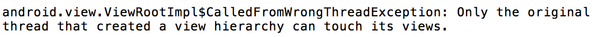

**图 10.1　崩溃的详细信息**

由此证实了 Android 确实是不允许在子线程中进行 UI 操作的。但是有些时候，我们必须在子线程里执行一些耗时任务，然后根据任务的执行结果来更新相应的 UI 控件，这该如何是好呢？

对于这种情况，Android 提供了一套异步消息处理机制，完美地解决了在子线程中进行 UI 操作的问题。我们将在下一小节中再去分析它的原理。

修改 MainActivity 中的代码，如下所示：

```Kotlin
class MainActivity : AppCompatActivity() {

    val updateText = 1

    val handler = object : Handler(Looper.getMaininLooper()) {
        override fun handleMessage(msg: Message) {
            // 在这里可以进行UI操作
            when (msg.what) {
                updateText -> textView.text = "Nice to meet you"
            }
        }
    }

    override fun onCreate(savedInstanceState: Bundle?) {
        super.onCreate(savedInstanceState)
        setContentView(R.layout.activity_main)
        changeTextBtn.setOnClickListener {
            thread {
                val msg = Message()
                msg.what = updateText
                handler.sendMessage(msg) // 将Message对象发送出去
            }
        }
    }

}
```

这里我们先是定义了一个整型变量 `updateText`，用于表示更新 TextView 这个动作。然后新增一个 `Handler` 对象，并重写父类的 `handleMessage()` 方法，在这里对具体的 Message 进行处理。如果发现 Message 的 `what` 字段的值等于 `updateText`，就将 TextView 显示的内容改成“Nice to meet you”。

下面再来看一下“Change Text”按钮的点击事件中的代码。可以看到，这次我们并没有在子线程里直接进行 UI 操作，而是创建了一个 `Message`（`android.os.Message`）对象，并将它的 `what` 字段的值指定为 `updateText`，然后调用 `Handler` 的 `sendMessage()` 方法将这条 Message 发送出去。很快，Handler 就会收到这条 Message，并在 `handleMessage()` 方法中对它进行处理。注意此时 `handleMessage()` 方法中的代码就是在主线程当中运行的了，所以我们可以放心地在这里进行 UI 操作。接下来对 Message 携带的 `what` 字段的值进行判断，如果等于 `updateText`，就将 TextView 显示的内容改成“Nice to meet you”。

现在重新运行程序，可以看到屏幕的正中央显示着“Hello world”。然后点击一下“Change Text”按钮，显示的内容就被替换成“Nice to meet you”，如图 10.2 所示。


**图 10.2　成功替换显示的文字**

这样你就已经掌握了 Android 异步消息处理的基本用法，使用这种机制就可以出色地解决在子线程中更新 UI 的问题。不过恐怕你对它的工作原理还不是很清楚，下面我们就来分析一下 Android 异步消息处理机制到底是如何工作的。

### 10.2.3　解析异步消息处理机制

Android 中的异步消息处理主要由 4 个部分组成：Message、Handler、MessageQueue 和 Looper。其中 Message 和 Handler 在上一小节中我们已经接触过了，而 MessageQueue 和 Looper 对于你来说还是全新的概念，下面我就对这 4 个部分进行一下简要的介绍。

1. **Message**

   Message 是在线程之间传递的消息，它可以在内部携带少量的信息，用于在不同线程之间传递数据。上一小节中我们使用到了 Message 的 `what` 字段，除此之外还可以使用 `arg1` 和 `arg2` 字段来携带一些整型数据，使用 `obj` 字段携带一个 `Object` 对象。
2. **Handler**

   Handler 顾名思义也就是处理者的意思，它主要是用于发送和处理消息的。发送消息一般是使用 Handler 的 `sendMessage()` 方法、`post()` 方法等，而发出的消息经过一系列地辗转处理后，最终会传递到 Handler 的 `handleMessage()` 方法中。
3. **MessageQueue**

   MessageQueue 是消息队列的意思，它主要用于存放所有通过 Handler 发送的消息。这部分消息会一直存在于消息队列中，等待被处理。每个线程中只会有一个 `MessageQueue` 对象。
4. **Looper**

   Looper 是每个线程中的 `MessageQueue` 的管家，调用 Looper 的 `loop()` 方法后，就会进入一个无限循环当中，然后每当发现 MessageQueue 中存在一条消息时，就会将它取出，并传递到 Handler 的 `handleMessage()` 方法中。每个线程中只会有一个 `Looper` 对象。

了解了 Message、Handler、MessageQueue 以及 Looper 的基本概念后，我们再来把异步消息处理的整个流程梳理一遍。首先需要在主线程当中创建一个 `Handler` 对象，并重写 `handleMessage()` 方法。然后当子线程中需要进行 UI 操作时，就创建一个 `Message` 对象，并通过 Handler 将这条消息发送出去。之后这条消息会被添加到 MessageQueue 的队列中等待被处理，而 Looper 则会一直尝试从 MessageQueue 中取出待处理消息，最后分发回 Handler 的 `handleMessage()` 方法中。由于 Handler 的构造函数中我们传入了 `Looper.getMainLooper()`，所以此时 `handleMessage()` 方法中的代码也会在主线程中运行，于是我们在这里就可以安心地进行 UI 操作了。整个异步消息处理机制的流程如图 10.3 所示。

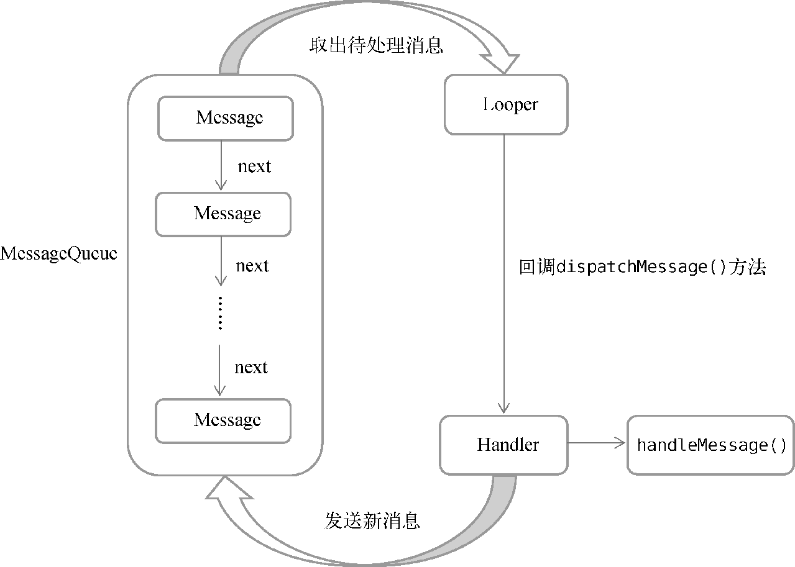

**图 10.3　异步消息处理机制流程示意图**

一条 Message 经过以上流程的辗转调用后，也就从子线程进入了主线程，从不能更新 UI 变成了可以更新 UI，整个异步消息处理的核心思想就是如此。

### 10.2.4　使用 AsyncTask

不过为了更加方便我们在子线程中对 UI 进行操作，Android 还提供了另外一些好用的工具，比如 AsyncTask。借助 AsyncTask，即使你对异步消息处理机制完全不了解，也可以十分简单地从子线程切换到主线程。当然，AsyncTask 背后的实现原理也是基于异步消息处理机制的，只是 Android 帮我们做了很好的封装而已。

首先来看一下 AsyncTask 的基本用法。由于 AsyncTask 是一个抽象类，所以如果我们想使用它，就必须创建一个子类去继承它。在继承时我们可以为 AsyncTask 类指定 3 个泛型参数，这 3 个参数的用途如下。

- `Params`。在执行 AsyncTask 时需要传入的参数，可用于在后台任务中使用。
- `Progress`。在后台任务执行时，如果需要在界面上显示当前的进度，则使用这里指定的泛型作为进度单位。
- `Result`。当任务执行完毕后，如果需要对结果进行返回，则使用这里指定的泛型作为返回值类型。

因此，一个最简单的自定义 AsyncTask 就可以写成如下形式：

```Kotlin
class DownloadTask : AsyncTask<Unit, Int, Boolean>() {
    ...
}
```

这里我们把 AsyncTask 的第一个泛型参数指定为 `Unit`，表示在执行 AsyncTask 的时候不需要传入参数给后台任务。第二个泛型参数指定为 `Int`，表示使用整型数据来作为进度显示单位。第三个泛型参数指定为 `Boolean`，则表示使用布尔型数据来反馈执行结果。

当然，目前我们自定义的 DownloadTask 还是一个空任务，并不能进行任何实际的操作，我们还需要重写 AsyncTask 中的几个方法才能完成对任务的定制。经常需要重写的方法有以下 4 个。

1. **`onPreExecute()`**

   这个方法会在后台任务开始执行之前调用，用于进行一些界面上的初始化操作，比如显示一个进度条对话框等。
2. **`doInBackground(Params...)`**

   这个方法中的所有代码都会在子线程中运行，我们应该在这里去处理所有的耗时任务。任务一旦完成，就可以通过 `return` 语句将任务的执行结果返回，如果 AsyncTask 的第三个泛型参数指定的是 `Unit`，就可以不返回任务执行结果。注意，在这个方法中是不可以进行 UI 操作的，如果需要更新 UI 元素，比如说反馈当前任务的执行进度，可以调用 `publishProgress (Progress...)` 方法来完成。
3. **`onProgressUpdate(Progress...)`**

   当在后台任务中调用了 `publishProgress(Progress...)` 方法后，`onProgressUpdate (Progress...)` 方法就会很快被调用，该方法中携带的参数就是在后台任务中传递过来的。在这个方法中可以对 UI 进行操作，利用参数中的数值就可以对界面元素进行相应的更新。
4. **`onPostExecute(Result)`**

   当后台任务执行完毕并通过 `return` 语句进行返回时，这个方法就很快会被调用。返回的数据会作为参数传递到此方法中，可以利用返回的数据进行一些 UI 操作，比如说提醒任务执行的结果，以及关闭进度条对话框等。

因此，一个比较完整的自定义 AsyncTask 就可以写成如下形式：

```Kotlin
class DownloadTask : AsyncTask<Unit, Int, Boolean>() {

    override fun onPreExecute() {
        progressDialog.show() // 显示进度对话框
    }

    override fun doInBackground(vararg params: Unit?) = try {
        while (true) {
            val downloadPercent = doDownload() // 这是一个虚构的方法
            publishProgress(downloadPercent)
            if (downloadPercent >= 100) {
                break
            }
        }
        true
    } catch (e: Exception) {
        false
    }

    override fun onProgressUpdate(vararg values: Int?) {
        // 在这里更新下载进度
        progressDialog.setMessage("Downloaded ${values[0]}%")
    }

    override fun onPostExecute(result: Boolean) {
        progressDialog.dismiss()// 关闭进度对话框
        // 在这里提示下载结果
        if (result) {
            Toast.makeText(context, "Download succeeded", Toast.LENGTH_SHORT).show()
        } else {
            Toast.makeText(context, " Download failed", Toast.LENGTH_SHORT).show()
        }
    }

}
```

在这个 DownloadTask 中，我们在 `doInBackground()` 方法里执行具体的下载任务。这个方法里的代码都是在子线程中运行的，因而不会影响主线程的运行。注意，这里虚构了一个 `doDownload()` 方法，用于计算当前的下载进度并返回，我们假设这个方法已经存在了。在得到了当前的下载进度后，下面就该考虑如何把它显示到界面上了，由于 `doInBackground()` 方法是在子线程中运行的，在这里肯定不能进行 UI 操作，所以我们可以调用 `publishProgress()` 方法并传入当前的下载进度，这样 `onProgressUpdate()` 方法就会很快被调用，在这里就可以进行 UI 操作了。

当下载完成后，`doInBackground()` 方法会返回一个布尔型变量，这样 `onPostExecute()` 方法就会很快被调用，这个方法也是在主线程中运行的。然后，在这里我们会根据下载的结果弹出相应的 Toast 提示，从而完成整个 DownloadTask 任务。

简单来说，使用 AsyncTask 的诀窍就是，在 `doInBackground()` 方法中执行具体的耗时任务，在 `onProgressUpdate()` 方法中进行 UI 操作，在 `onPostExecute()` 方法中执行一些任务的收尾工作。

如果想要启动这个任务，只需编写以下代码即可：

```Kotlin
DownloadTask().execute()
```

当然，你也可以给 `execute()` 方法传入任意数量的参数，这些参数将会传递到 DownloadTask 的 `doInBackground()` 方法当中。

以上就是 AsyncTask 的基本用法，怎么样，是不是感觉简单方便了许多？我们并不需要去考虑什么异步消息处理机制，也不需要专门使用一个 Handler 来发送和接收消息，只需要调用一下 `publishProgress()` 方法，就可以轻松地从子线程切换到 UI 线程了。

## 10.3　Service 的基本用法

了解了 Android 多线程编程的技术之后，下面就让我们进入本章的正题，开始对 Service 的相关内容进行学习。作为 Android 四大组件之一，Service 也少不了有很多非常重要的知识点，那我们自然要从最基本的用法开始学习了。

### 10.3.1　定义一个 Service

首先看一下如何在项目中定义一个 Service。新建一个 ServiceTest 项目，然后右击 com.example.servicetest→New→Service→Service，会弹出如图 10.4 所示的窗口。

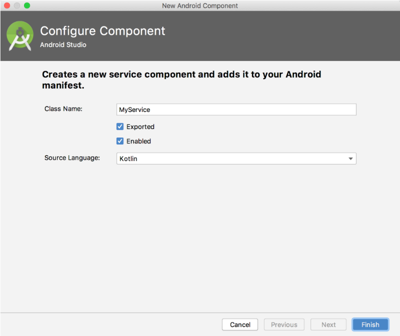

**图 10.4　创建 Service 的窗口**

可以看到，这里我们将类名定义成 MyService，`Exported` 属性表示是否将这个 Service 暴露给外部其他程序访问，`Enabled` 属性表示是否启用这个 Service。将两个属性都勾中，点击“Finish”完成创建。

现在观察 MyService 中的代码，如下所示：

```Kotlin
class MyService : Service() {

    override fun onBind(intent: Intent): IBinder {
        TODO("Return the communication channel to the service.")
    }

}
```

可以看到，MyService 是继承自系统的 Service 类的。目前 MyService 中可以算是空空如也，但有一个 `onBind()` 方法特别醒目。这个方法是 Service 中唯一的抽象方法，所以必须在子类里实现。我们会在后面的小节中使用到 `onBind()` 方法，目前可以暂时将它忽略。

既然是定义一个 Service，自然应该在 Service 中处理一些事情了，那处理事情的逻辑应该写在哪里呢？这时就可以重写 Service 中的另外一些方法了，如下所示：

```Kotlin
class MyService : Service() {
    ...
    override fun onCreate() {
        super.onCreate()
    }

    override fun onStartCommand(intent: Intent, flags: Int, startId: Int): Int {
        return super.onStartCommand(intent, flags, startId)
    }

    override fun onDestroy() {
        super.onDestroy()
    }

}
```

可以看到，这里我们又重写了 `onCreate()`、`onStartCommand()` 和 `onDestroy()` 这 3 个方法，它们是每个 Service 中最常用到的 3 个方法了。其中 `onCreate()` 方法会在 Service 创建的时候调用，`onStartCommand()` 方法会在每次 Service 启动的时候调用，`onDestroy()` 方法会在 Service 销毁的时候调用。

通常情况下，如果我们希望 Service 一旦启动就立刻去执行某个动作，就可以将逻辑写在 `onStartCommand()` 方法里。而当 Service 销毁时，我们又应该在 `onDestroy()` 方法中回收那些不再使用的资源。

另外需要注意，每一个 Service 都需要在 AndroidManifest.xml 文件中进行注册才能生效。不知道你有没有发现，这是 Android 四大组件共有的特点。不过相信你已经猜到了，智能的 Android Studio 早已自动帮我们完成了。打开 AndroidManifest.xml 文件瞧一瞧，代码如下所示：

```xml
<manifest xmlns:android="http://schemas.android.com/apk/res/android"
    package="com.example.servicetest">

    <application
        android:allowBackup="true"
        android:icon="@mipmap/ic_launcher"
        android:roundIcon="@mipmap/ic_launcher_round"
        android:label="@string/app_name"
        android:supportsRtl="true"
        android:theme="@style/AppTheme">
        ...
        <service
            android:name=".MyService"
            android:enabled="true"
            android:exported="true">
        </service>
    </application>

</manifest>
```

这样的话，就已经将一个 Service 完全定义好了。

### 10.3.2　启动和停止 Service

定义好了 Service 之后，接下来就应该考虑如何启动以及停止这个 Service。启动和停止的方法当然你也不会陌生，主要是借助 Intent 来实现的。下面就让我们在 ServiceTest 项目中尝试启动以及停止 MyService。

首先修改 activity_main.xml 中的代码，如下所示：

```xml
<LinearLayout xmlns:android="http://schemas.android.com/apk/res/android"
    android:orientation="vertical"
    android:layout_width="match_parent"
    android:layout_height="match_parent">

    <Button
        android:id="@+id/startServiceBtn"
        android:layout_width="match_parent"
        android:layout_height="wrap_content"
        android:text="Start Service" />

    <Button
        android:id="@+id/stopServiceBtn"
        android:layout_width="match_parent"
        android:layout_height="wrap_content"
        android:text="Stop Service" />

</LinearLayout>
```

这里我们在布局文件中加入了两个按钮，分别用于启动和停止 Service。

然后修改 MainActivity 中的代码，如下所示：

```Kotlin
class MainActivity : AppCompatActivity() {

    override fun onCreate(savedInstanceState: Bundle?) {
        super.onCreate(savedInstanceState)
        setContentView(R.layout.activity_main)
        startServiceBtn.setOnClickListener {
            val intent = Intent(this, MyService::class.java)
            startService(intent) // 启动Service
        }
        stopServiceBtn.setOnClickListener {
            val intent = Intent(this, MyService::class.java)
            stopService(intent) // 停止Service
        }
    }

}
```

可以看到，在“Start Service”按钮的点击事件里，我们构建了一个 Intent 对象，并调用 `startService()` 方法来启动 MyService。在“Stop Service”按钮的点击事件里，我们同样构建了一个 Intent 对象，并调用 `stopService()` 方法来停止 MyService。`startService()` 和 `stopService()` 方法都是定义在 `Context` 类中的，所以我们在 Activity 里可以直接调用这两个方法。另外，Service 也可以自我停止运行，只需要在 Service 内部调用 `stopSelf()` 方法即可。

那么接下来又有一个问题需要思考了，我们如何才能证实 Service 已经成功启动或者停止了呢？最简单的方法就是在 MyService 的几个方法中加入打印日志，如下所示：

```Kotlin
class MyService : Service() {
    ...
    override fun onCreate() {
        super.onCreate()
        Log.d("MyService", "onCreate executed")
    }

    override fun onStartCommand(intent: Intent, flags: Int, startId: Int): Int {
        Log.d("MyService", "onStartCommand executed")
        return super.onStartCommand(intent, flags, startId)
    }

    override fun onDestroy() {
        super.onDestroy()
        Log.d("MyService", "onDestroy executed")
    }
}
```

现在可以运行一下程序来进行测试了，程序的主界面如图 10.5 所示。


**图 10.5　ServiceTest 的主界面**

点击一下“Start Service”按钮，观察 Logcat 中的打印日志，如图 10.6 所示。

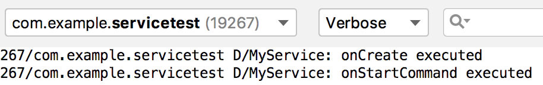

**图 10.6　启动 Service 时的打印日志**

MyService 中的 `onCreate()` 和 `onStartCommand()` 方法都执行了，说明这个 Service 确实已经启动成功了，并且你还可以在 Settings→System→Advanced→Developer options→Running services 中找到它（不同手机路径可能不同，也有可能无此选项），如图 10.7 所示。


**图 10.7　正在运行的 Service 列表**

然后再点击一下“Stop Service”按钮，观察 Logcat 中的打印日志，如图 10.8 所示。

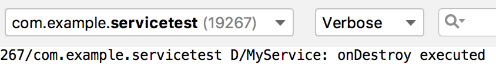

**图 10.8　停止 Service 时的打印日志**

由此证明，MyService 确实已经成功停止下来了。

以上就是 Service 启动和停止的基本用法，但是从 Android 8.0 系统开始，应用的后台功能被大幅削减。现在只有当应用保持在前台可见状态的情况下，Service 才能保证稳定运行，一旦应用进入后台之后，Service 随时都有可能被系统回收。之所以做这样的改动，是为了防止许多恶意的应用程序长期在后台占用手机资源，从而导致手机变得越来越卡。当然，如果你真的非常需要长期在后台执行一些任务，可以使用前台 Service 或者 WorkManager，前台 Service 我们待会马上就会学到，而 WorkManager 将会在第 13 章中进行学习。

回到正题，虽然我们已经学会了启动和停止 Service 的方法，但是不知道你心里现在有没有一个疑惑，那就是 `onCreate()` 方法和 `onStartCommand()` 方法到底有什么区别呢？因为刚刚点击“Start Service”按钮后，两个方法都执行了。

其实 `onCreate()` 方法是在 Service 第一次创建的时候调用的，而 `onStartCommand()` 方法则在每次启动 Service 的时候都会调用。由于刚才我们是第一次点击“Start Service”按钮，Service 此时还未创建过，所以两个方法都会执行，之后如果你再连续多点击几次“Start Service”按钮，你就会发现只有 `onStartCommand()` 方法可以得到执行了。

### 10.3.3　Activity 和 Service 进行通信

在上一小节中，我们学习了启动和停止 Service 的方法。不知道你有没有发现，虽然 Service 是在 Activity 里启动的，但是在启动了 Service 之后，Activity 与 Service 基本就没有什么关系了。确实如此，我们在 Activity 里调用了 `startService()` 方法来启动 MyService，然后 MyService 的 `onCreate()` 和 `onStartCommand()` 方法就会得到执行。之后 Service 会一直处于运行状态，但具体运行的是什么逻辑，Activity 就控制不了了。这就类似于 Activity 通知了 Service 一下：“你可以启动了！”然后 Service 就去忙自己的事情了，但 Activity 并不知道 Service 到底做了什么事情，以及完成得如何。

那么可不可以让 Activity 和 Service 的关系更紧密一些呢？例如在 Activity 中指挥 Service 去干什么，Service 就去干什么。当然可以，这就需要借助我们刚刚忽略的 `onBind()` 方法了。

比如说，目前我们希望在 MyService 里提供一个下载功能，然后在 Activity 中可以决定何时开始下载，以及随时查看下载进度。实现这个功能的思路是创建一个专门的 `Binder` 对象来对下载功能进行管理。修改 MyService 中的代码，如下所示：

```Kotlin
class MyService : Service() {

    private val mBinder = DownloadBinder()

    class DownloadBinder : Binder() {

        fun startDownload() {
            Log.d("MyService", "startDownload executed")
        }

        fun getProgress(): Int {
            Log.d("MyService", "getProgress executed")
            return 0
        }

    }

    override fun onBind(intent: Intent): IBinder {
        return mBinder
    }
    ...
}
```

可以看到，这里我们新建了一个 `DownloadBinder` 类，并让它继承自 `Binder`，然后在它的内部提供了开始下载以及查看下载进度的方法。当然这只是两个模拟方法，并没有实现真正的功能，我们在这两个方法中分别打印了一行日志。

接着，在 MyService 中创建了 `DownloadBinder` 的实例，然后在 `onBind()` 方法里返回了这个实例，这样 MyService 中的工作就全部完成了。

下面就要看一看在 Activity 中如何调用 Service 里的这些方法了。首先需要在布局文件里新增两个按钮，修改 activity_main.xml 中的代码，如下所示：

```xml
<LinearLayout xmlns:android="http://schemas.android.com/apk/res/android"
    android:orientation="vertical"
    android:layout_width="match_parent"
    android:layout_height="match_parent">

    ...

    <Button
        android:id="@+id/bindServiceBtn"
        android:layout_width="match_parent"
        android:layout_height="wrap_content"
        android:text="Bind Service" />

    <Button
        android:id="@+id/unbindServiceBtn"
        android:layout_width="match_parent"
        android:layout_height="wrap_content"
        android:text="Unbind Service" />

</LinearLayout>
```

这两个按钮分别是用于绑定和取消绑定 Service 的，那到底谁需要和 Service 绑定呢？当然就是 Activity 了。当一个 Activity 和 Service 绑定了之后，就可以调用该 Service 里的 `Binder` 提供的方法了。修改 MainActivity 中的代码，如下所示：

```Kotlin
class MainActivity : AppCompatActivity() {

    lateinit var downloadBinder: MyService.DownloadBinder

    private val connection = object : ServiceConnection {

        override fun onServiceConnected(name: ComponentName, service: IBinder) {
            downloadBinder = service as MyService.DownloadBinder
            downloadBinder.startDownload()
            downloadBinder.getProgress()
        }

        override fun onServiceDisconnected(name: ComponentName) {
        }

    }

    override fun onCreate(savedInstanceState: Bundle?) {
        ...
        bindServiceBtn.setOnClickListener {
            val intent = Intent(this, MyService::class.java)
            bindService(intent, connection, Context.BIND_AUTO_CREATE) // 绑定Service
        }
        unbindServiceBtn.setOnClickListener {
            unbindService(connection) // 解绑Service
        }
    }

}
```

这里我们首先创建了一个 `ServiceConnection` 的匿名类实现，并在里面重写了 `onServiceConnected()` 方法和 `onServiceDisconnected()` 方法。`onServiceConnected()` 方法方法会在 Activity 与 Service 成功绑定的时候调用，而 `onServiceDisconnected()` 方法只有在 Service 的创建进程崩溃或者被杀掉的时候才会调用，这个方法不太常用。那么在 `onServiceConnected()` 方法中，我们又通过向下转型得到了 `DownloadBinder` 的实例，有了这个实例，Activity 和 Service 之间的关系就变得非常紧密了。现在我们可以在 Activity 中根据具体的场景来调用 `DownloadBinder` 中的任何 `public` 方法，即实现了指挥 Service 干什么 Service 就去干什么的功能。这里仍然只是做了个简单的测试，在 `onServiceConnected()` 方法中调用了 `DownloadBinder` 的 `startDownload()` 和 `getProgress()` 方法。

当然，现在 Activity 和 Service 其实还没进行绑定呢，这个功能是在“Bind Service”按钮的点击事件里完成的。可以看到，这里我们仍然构建了一个 Intent 对象，然后调用 `bindService()` 方法将 MainActivity 和 MyService 进行绑定。`bindService()` 方法接收 3 个参数，第一个参数就是刚刚构建出的 Intent 对象，第二个参数是前面创建出的 `ServiceConnection` 的实例，第三个参数则是一个标志位，这里传入 `BIND_AUTO_CREATE` 表示在 Activity 和 Service 进行绑定后自动创建 Service。这会使得 MyService 中的 `onCreate()` 方法得到执行，但 `onStartCommand()` 方法不会执行。

如果我们想解除 Activity 和 Service 之间的绑定该怎么办呢？调用一下 `unbindService()` 方法就可以了，这也是“Unbind Service”按钮的点击事件里实现的功能。

现在让我们重新运行一下程序吧，界面如图 10.9 所示。

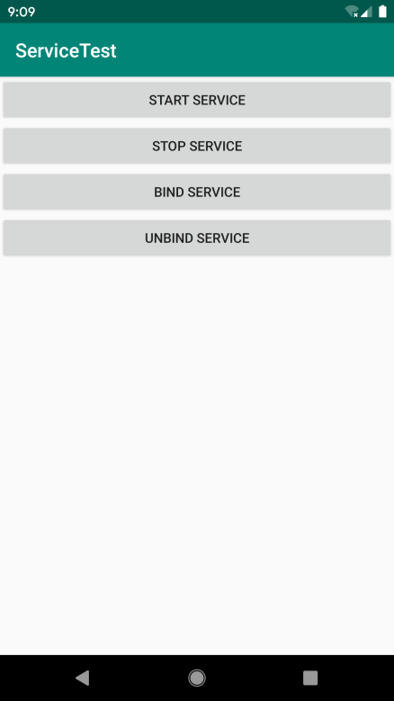

**图 10.9　ServiceTest 新的主界面**

点击一下“Bind Service”按钮，观察 Logcat 中的打印日志，如图 10.10 所示。


**图 10.10　绑定 Service 时的打印日志**

可以看到，首先是 MyService 的 `onCreate()` 方法得到了执行，然后 `startDownload()` 和 `getProgress()` 方法都得到了执行，说明我们确实已经在 Activity 里成功调用了 Service 里提供的方法。

另外需要注意，任何一个 Service 在整个应用程序范围内都是通用的，即 MyService 不仅可以和 MainActivity 绑定，还可以和任何一个其他的 Activity 进行绑定，而且在绑定完成后，它们都可以获取相同的 `DownloadBinder` 实例。

## 10.4　Service 的生命周期

之前我们学习过了 Activity 以及 Fragment 的生命周期。类似地，Service 也有自己的生命周期，前面我们使用到的 `onCreate()`、`onStartCommand()`、`onBind()` 和 `onDestroy()` 等方法都是在 Service 的生命周期内可能回调的方法。

一旦在项目的任何位置调用了 Context 的 `startService()` 方法，相应的 Service 就会启动，并回调 `onStartCommand()` 方法。如果这个 Service 之前还没有创建过，`onCreate()` 方法会先于 `onStartCommand()` 方法执行。Service 启动了之后会一直保持运行状态，直到 `stopService()` 或 `stopSelf()` 方法被调用，或者被系统回收。注意，虽然每调用一次 `startService()` 方法，`onStartCommand()` 就会执行一次，但实际上每个 Service 只会存在一个实例。所以不管你调用了多少次 `startService()` 方法，只需调用一次 `stopService()` 或 `stopSelf()` 方法，Service 就会停止。

另外，还可以调用 Context 的 `bindService()` 来获取一个 Service 的持久连接，这时就会回调 Service 中的 `onBind()` 方法。类似地，如果这个 Service 之前还没有创建过，`onCreate()` 方法会先于 `onBind()` 方法执行。之后，调用方可以获取到 `onBind()` 方法里返回的 `IBinder` 对象的实例，这样就能自由地和 Service 进行通信了。只要调用方和 Service 之间的连接没有断开，Service 就会一直保持运行状态，直到被系统回收。

当调用了 `startService()` 方法后，再去调用 `stopService()` 方法。这时 Service 中的 `onDestroy()` 方法就会执行，表示 Service 已经销毁了。类似地，当调用了 `bindService()` 方法后，再去调用 `unbindService()` 方法，`onDestroy()` 方法也会执行，这两种情况都很好理解。但是需要注意，我们是完全有可能对一个 Service 既调用了 `startService()` 方法，又调用了 `bindService()` 方法的，在这种情况下该如何让 Service 销毁呢？根据 Android 系统的机制，一个 Service 只要被启动或者被绑定了之后，就会处于运行状态，必须要让以上两种条件同时不满足，Service 才能被销毁。所以，这种情况下要同时调用 `stopService()` 和 `unbindService()` 方法，`onDestroy()` 方法才会执行。

这样你就把 Service 的生命周期完整地走了一遍。

## 10.5　Service 的更多技巧

以上所学的内容都是关于 Service 最基本的一些用法和概念，当然也是最常用的。不过，仅仅满足于此显然是不够的，关于 Service 的更多高级使用技巧还在等着我们呢，下面就赶快去看一看吧。

### 10.5.1　使用前台 Service

前面已经说过，从 Android 8.0 系统开始，只有当应用保持在前台可见状态的情况下，Service 才能保证稳定运行，一旦应用进入后台之后，Service 随时都有可能被系统回收。而如果你希望 Service 能够一直保持运行状态，就可以考虑使用前台 Service。前台 Service 和普通 Service 最大的区别就在于，它一直会有一个正在运行的图标在系统的状态栏显示，下拉状态栏后可以看到更加详细的信息，非常类似于通知的效果，如图 10.11 所示。


**图 10.11　前台 Service 的效果**

由于状态栏中一直有一个正在运行的图标，相当于我们的应用以另外一种形式保持在前台可见状态，所以系统不会倾向于回收前台 Service。另外，用户也可以通过下拉状态栏清楚地知道当前什么应用正在运行，因此也不存在某些恶意应用长期在后台偷偷占用手机资源的情况。

那么我们就来看一下如何才能创建一个前台 Service 吧，其实并不复杂，修改 MyService 中的代码，如下所示：

```Kotlin
class MyService : Service() {
    ...
    override fun onCreate() {
        super.onCreate()
        Log.d("MyService", "onCreate executed")
        val manager = getSystemService(Context.NOTIFICATION_SERVICE) as
                NotificationManager
        if (Build.VERSION.SDK_INT >= Build.VERSION_CODES.O) {
            val channel = NotificationChannel("my_service", "前台Service通知",
                    NotificationManager.IMPORTANCE_DEFAULT)
            manager.createNotificationChannel(channel)
        }
        val intent = Intent(this, MainActivity::class.java)
        val pi = PendingIntent.getActivity(this, 0, intent, 0)
        val notification = NotificationCompat.Builder(this, "my_service")
            .setContentTitle("This is content title")
            .setContentText("This is content text")
            .setSmallIcon(R.drawable.small_icon)
            .setLargeIcon(BitmapFactory.decodeResource(resources, R.drawable.large_icon))
            .setContentIntent(pi)
            .build()
        startForeground(1, notification)
    }
    ...
}
```

可以看到，这里只是修改了 `onCreate()` 方法中的代码，相信这部分代码你会非常眼熟。没错！这就是我们在第 9 章中学习的创建通知的方法，并且我还将 small_icon 和 large_icon 这两张图从 NotificationTest 项目中复制了过来。只不过这次在构建 `Notification` 对象后并没有使用 NotificationManager 将通知显示出来，而是调用了 `startForeground()` 方法。这个方法接收两个参数：第一个参数是通知的 id，类似于 `notify()` 方法的第一个参数；第二个参数则是构建的 `Notification` 对象。调用 `startForeground()` 方法后就会让 MyService 变成一个前台 Service，并在系统状态栏显示出来。

另外，从 Android 9.0 系统开始，使用前台 Service 必须在 AndroidManifest.xml 文件中进行权限声明才行，如下所示：

```xml
<manifest xmlns:android="http://schemas.android.com/apk/res/android"
          package="com.example.servicetest">
    <uses-permission android:name="android.permission.FOREGROUND_SERVICE" />
    ...
</manifest>
```

现在重新运行一下程序，并点击“Start Service”按钮，MyService 就会以前台 Service 的模式启动了，并且在系统状态栏会显示一个通知图标，下拉状态栏后可以看到该通知的详细内容，如图 10.12 所示。


**图 10.12　前台 Service 的状态栏效果**

现在即使你退出应用程序，MyService 也会一直处于运行状态，而且不用担心会被系统回收。当然，MyService 所对应的通知也会一直显示在状态栏上面。如果用户不希望我们的程序一直运行，也可以选择手动杀掉应用，这样 MyService 就会跟着一起停止运行了。

前台 Service 的用法就这么简单，只要你在第 9 章中将通知的用法掌握好了，学习本节的知识一定会特别轻松。

### 10.5.2　使用 IntentService

话说回来，在本章一开始的时候我们就已经知道，Service 中的代码都是默认运行在主线程当中的，如果直接在 Service 里处理一些耗时的逻辑，就很容易出现 ANR（Application Not Responding）的情况。

所以这个时候就需要用到 Android 多线程编程的技术了，我们应该在 Service 的每个具体的方法里开启一个子线程，然后在这里处理那些耗时的逻辑。因此，一个比较标准的 Service 就可以写成如下形式：

```Kotlin
class MyService : Service() {
    ...
    override fun onStartCommand(intent: Intent, flags: Int, startId: Int): Int {
        thread {
            // 处理具体的逻辑
        }
        return super.onStartCommand(intent, flags, startId)
    }
}
```

但是，这种 Service 一旦启动，就会一直处于运行状态，必须调用 `stopService()` 或 `stopSelf()` 方法，或者被系统回收，Service 才会停止。所以，如果想要实现让一个 Service 在执行完毕后自动停止的功能，就可以这样写：

```Kotlin
class MyService : Service() {
    ...
    override fun onStartCommand(intent: Intent, flags: Int, startId: Int): Int {
        thread {
            // 处理具体的逻辑
            stopSelf()
        }
        return super.onStartCommand(intent, flags, startId)
    }
}
```

虽说这种写法并不复杂，但是总会有一些程序员忘记开启线程，或者忘记调用 `stopSelf()` 方法。为了可以简单地创建一个异步的、会自动停止的 Service，Android 专门提供了一个 IntentService 类，这个类就很好地解决了前面所提到的两种尴尬，下面我们就来看一下它的用法。

新建一个 MyIntentService 类继承自 IntentService，代码如下所示：

```Kotlin
class MyIntentService : IntentService("MyIntentService") {

    override fun onHandleIntent(intent: Intent?) {
        // 打印当前线程的id
        Log.d("MyIntentService", "Thread id is ${Thread.currentThread().name}")
    }

    override fun onDestroy() {
        super.onDestroy()
        Log.d("MyIntentService", "onDestroy executed")
    }

}
```

这里首先要求必须先调用父类的构造函数，并传入一个字符串，这个字符串可以随意指定，只在调试的时候有用。然后要在子类中实现 `onHandleIntent()` 这个抽象方法，这个方法中可以处理一些耗时的逻辑，而不用担心 ANR 的问题，因为这个方法已经是在子线程中运行的了。这里为了证实一下，我们在 `onHandleIntent()` 方法中打印了当前线程名。另外，根据 IntentService 的特性，这个 Service 在运行结束后应该是会自动停止的，所以我们又重写了 `onDestroy()` 方法，在这里也打印了一行日志，以证实 Service 是不是停止了。

接下来修改 activity_main.xml 中的代码，加入一个用于启动 MyIntentService 的按钮，如下所示：

```xml
<LinearLayout xmlns:android="http://schemas.android.com/apk/res/android"
    android:orientation="vertical"
    android:layout_width="match_parent"
    android:layout_height="match_parent">

    ...

    <Button
        android:id="@+id/startIntentServiceBtn"
        android:layout_width="match_parent"
        android:layout_height="wrap_content"
        android:text="Start IntentService" />

</LinearLayout>
```

然后修改 MainActivity 中的代码，如下所示：

```Kotlin
class MainActivity : AppCompatActivity() {
    ...
    override fun onCreate(savedInstanceState: Bundle?) {
        ...
        startIntentServiceBtn.setOnClickListener {
            // 打印主线程的id
            Log.d("MainActivity", "Thread id is ${Thread.currentThread().name}")
            val intent = Intent(this, MyIntentService::class.java)
            startService(intent)
        }
    }

}
```

可以看到，我们在“Start IntentService”按钮的点击事件里启动了 MyIntentService，并在这里打印了一下主线程名，稍后用于和 IntentService 进行比对。你会发现，其实 IntentService 的启动方式和普通的 Service 没什么两样。

最后不要忘记，Service 都是需要在 AndroidManifest.xml 里注册的，如下所示：

```xml
<manifest xmlns:android="http://schemas.android.com/apk/res/android"
    package="com.example.servicetest">

    <application
        android:allowBackup="true"
        android:icon="@mipmap/ic_launcher"
        android:roundIcon="@mipmap/ic_launcher_round"
        android:label="@string/app_name"
        android:supportsRtl="true"
        android:theme="@style/AppTheme">

        ...

        <service
        android:name=".MyIntentService"
        android:enabled="true"
        android:exported="true"/>

    </application>

</manifest>
```

当然，你也可以使用 Android Studio 提供的快捷方式来创建 IntentService，不过由于这样会自动生成一些我们用不到的代码，因此这里我采用了手动创建的方式。

现在重新运行一下程序，界面如图 10.13 所示。


**图 10.13　ServiceTest 更新后的主界面**

点击“Start IntentService”按钮后，观察 Logcat 中的打印日志，如图 10.14 所示。

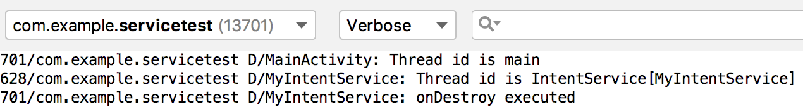

**图 10.14　启动 IntentService 时的打印日志**

可以看到，不仅 MyIntentService 和 MainActivity 所在的线程名不一样，而且 `onDestroy()` 方法也得到了执行，说明 MyIntentService 在运行完毕后确实自动停止了。集开启线程和自动停止于一身，IntentService 还是博得了不少程序员的喜爱。

好了，关于 Service 的知识点你已经学得够多了，下面依照惯例，就让我们进入本章的 Kotlin 课堂吧。

## 10.6　 Kotlin 课堂：泛型的高级特性

还记得在第 8 章的 Kotlin 课堂里我们学习的 Kotlin 泛型的基本用法吗？这些基本用法其实和 Java 中泛型的用法是大致相同的，因此也相对比较好理解。然而实际上，Kotlin 在泛型方面还提供了不少特有的功能，掌握了这些功能，你将可以更好玩转 Kotlin，同时还能实现一些不可思议的语法特性，那么我们自然不能错过这部分内容了。

### 10.6.1　对泛型进行实化

泛型实化这个功能对于绝大多数 Java 程序员来讲是非常陌生的，因为 Java 中完全没有这个概念。而如果我们想要深刻地理解泛型实化，就要先解释一下 Java 的泛型擦除机制才行。

在 JDK 1.5 之前，Java 是没有泛型功能的，那个时候诸如 List 之类的数据结构可以存储任意类型的数据，取出数据的时候也需要手动向下转型才行，这不仅麻烦，而且很危险。比如说我们在同一个 List 中存储了字符串和整型这两种数据，但是在取出数据的时候却无法区分具体的数据类型，如果手动将它们强制转成同一种类型，那么就会抛出类型转换异常。

于是在 JDK 1.5 中，Java 终于引入了泛型功能。这不仅让诸如 List 之类的数据结构变得简单好用，也让我们的代码变得更加安全。

但是实际上，Java 的泛型功能是通过类型擦除机制来实现的。什么意思呢？就是说泛型对于类型的约束只在编译时期存在，运行的时候仍然会按照 JDK 1.5 之前的机制来运行，JVM 是识别不出来我们在代码中指定的泛型类型的。例如，假设我们创建了一个 `List<String>` 集合，虽然在编译时期只能向集合中添加字符串类型的元素，但是在运行时期 JVM 并不能知道它本来只打算包含哪种类型的元素，只能识别出来它是个 List。

所有基于 JVM 的语言，它们的泛型功能都是通过类型擦除机制来实现的，其中当然也包括了 Kotlin。这种机制使得我们不可能使用 `a is T` 或者 `T::class.java` 这样的语法，因为 `T` 的实际类型在运行的时候已经被擦除了。

然而不同的是，Kotlin 提供了一个内联函数的概念，我们在第 6 章的 Kotlin 课堂中已经学过了这个知识点。内联函数中的代码会在编译的时候自动被替换到调用它的地方，这样的话也就不存在什么泛型擦除的问题了，因为代码在编译之后会直接使用实际的类型来替代内联函数中的泛型声明，其工作原理如图 10.15 所示。

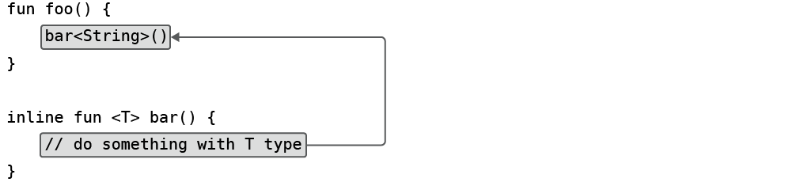

**图 10.15　内联函数的代码替换过程**

最终代码会被替换成如图 10.16 所示的样子。


**图 10.16　替换完成后的代码**

可以看到，`bar()` 是一个带有泛型类型的内联函数，`foo()` 函数调用了 `bar()` 函数，在代码编译之后，`bar()` 函数中的代码将可以获得泛型的实际类型。

这就意味着，Kotlin 中是可以将内联函数中的泛型进行实化的。

那么具体该怎么写才能将泛型实化呢？首先，该函数必须是内联函数才行，也就是要用 `inline` 关键字来修饰该函数。其次，在声明泛型的地方必须加上 `reified` 关键字来表示该泛型要进行实化。示例代码如下：

```Kotlin
inline fun <reified T> getGenericType() {
}
```

上述函数中的泛型 `T` 就是一个被实化的泛型，因为它满足了内联函数和 `reified` 关键字这两个前提条件。那么借助泛型实化，到底可以实现什么样的效果呢？从函数名就可以看出来了，这里我们准备实现一个获取泛型实际类型的功能，代码如下所示：

```Kotlin
inline fun <reified T> getGenericType() = T::class.java
```

虽然只有一行代码，但是这里却实现了一个 Java 中完全不可能实现的功能：`getGenericType()` 函数直接返回了当前指定泛型的实际类型。`T.class` 这样的语法在 Java 中是不合法的，而在 Kotlin 中，借助泛型实化功能就可以使用 `T::class.java` 这样的语法了。

现在我们可以使用如下代码对 `getGenericType()` 函数进行测试：

```Kotlin
fun main() {
    val result1 = getGenericType<String>()
    val result2 = getGenericType<Int>()
    println("result1 is $result1")
    println("result2 is $result2")
}
```

这里给 `getGenericType()` 函数指定了两种不同的泛型，由于 `getGenericType()` 函数会将指定泛型的具体类型返回，因此这里我们将返回的结果进行打印。

现在运行一下 `main()` 函数，结果如图 10.17 所示。

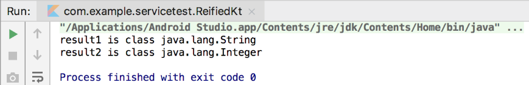

**图 10.17　泛型实化功能的运行结果**

可以看到，如果将泛型指定成了 `String`，那么就可以得到 `java.lang.String` 的类型；如果将泛型指定了 `Int`，就可以得到 `java.lang.Integer` 的类型。

关于泛型实化的基本用法就介绍到这里，接下来我们看一看，泛型实化在 Android 项目当中具体可以有哪些应用。

### 10.6.2　泛型实化的应用

泛型实化功能允许我们在泛型函数当中获得泛型的实际类型，这也就使得类似于 `a is T`、`T::class.java` 这样的语法成为了可能。而灵活运用这一特性将可以实现一些不可思议的语法结构，下面我们赶快来看一下吧。

到目前为止，我们已经将 Android 的四大组件全部学完了，除了 ContentProvider 之外，你会发现其余的 3 个组件有一个共同的特点，它们都是要结合 Intent 一起使用的。比如说启动一个 Activity 就可以这么写：

```Kotlin
val intent = Intent(context, TestActivity::class.java)
context.startActivity(intent)
```

有没有觉得 `TestActivity::class.java` 这样的语法很难受呢？当然，如果在没有更好选择的情况下，这种写法也是可以忍受的，但是 Kotlin 的泛型实化功能使得我们拥有了更好的选择。

新建一个 reified.kt 文件，然后在里面编写如下代码：

```Kotlin
inline fun <reified T> startActivity(context: Context) {
    val intent = Intent(context, T::class.java)
    context.startActivity(intent)
}
```

这里我们定义了一个 `startActivity()` 函数，该函数接收一个 `Context` 参数，并同时使用 `inline` 和 `reified` 关键字让泛型 `T` 成为了一个被实化的泛型。接下来就是神奇的地方了，Intent 接收的第二个参数本来应该是一个具体 Activity 的 `Class` 类型，但由于现在 `T` 已经是一个被实化的泛型了，因此这里我们可以直接传入 `T::class.java`。最后调用 `Context` 的 `startActivity()` 方法来完成 Activity 的启动。

现在，如果我们想要启动 TestActivity，只需要这样写就可以了：

```Kotlin
startActivity<TestActivity>(context)
```

Kotlin 将能够识别出指定泛型的实际类型，并启动相应的 Activity。怎么样，是不是觉得代码瞬间精简了好多？这就是泛型实化所带来的神奇功能。

不过，现在的 `startActivity()` 函数其实还是有问题的，因为通常在启用 Activity 的时候还可能会使用 Intent 附带一些参数，比如下面的写法：

```Kotlin
val intent = Intent(context, TestActivity::class.java)
intent.putExtra("param1", "data")
intent.putExtra("param2", 123)
context.startActivity(intent)
```

而经过刚才的封装之后，我们就无法进行传参了。

这个问题也不难解决，只需要借助之前在第 6 章学习的高阶函数就可以轻松搞定。回到 reified.kt 文件当中，这里添加一个新的 `startActivity()` 函数重载，如下所示：

```Kotlin
inline fun <reified T> startActivity(context: Context, block: Intent.() -> Unit) {
    val intent = Intent(context, T::class.java)
    intent.block()
    context.startActivity(intent)
}
```

可以看到，这次的 `startActivity()` 函数中增加了一个函数类型参数，并且它的函数类型是定义在 Intent 类当中的。在创建完 Intent 的实例之后，随即调用该函数类型参数，并把 Intent 的实例传入，这样调用 `startActivity()` 函数的时候就可以在 Lambda 表达式中为 Intent 传递参数了，如下所示：

```Kotlin
startActivity<TestActivity>(context) {
    putExtra("param1", "data")
    putExtra("param2", 123)
}
```

不得不说，这种启动 Activity 的代码写起来实在是太舒服了，泛型实化和高阶函数使这种语法结构成为了可能，感谢 Kotlin 提供了如此多优秀的语言特性。

好了，泛型实化的具体应用学到这里就基本结束了。虽然我们一直在使用启动 Activity 的代码来举例，但是启动 Service 的代码也是基本类似的，相信对于你来说，通过泛型实化和高阶函数来简化它的用法已经是小菜一碟了，这个功能就当作课后习题让你练练手吧。

那么接下来我们继续学习泛型更多的高级特性。

### 10.6.3　泛型的协变

泛型的协变和逆变功能不太常用，而且我个人认为有点不容易理解。但是 Kotlin 的内置 API 中使用了很多协变和逆变的特性，因此如果想要对这个语言有更加深刻的了解，这部分内容还是有必要学习一下的。

我在学习协变和逆变的时候查阅了很多资料，这些资料大多十分晦涩难懂，因此也让我对这两个知识点产生了一些畏惧。但是真正掌握之后，发现其实也并不是那么难，所以这里我会尽量使用最简明的方式来讲解这两个知识点，希望你可以轻松掌握。

在开始学习协变和逆变之前，我们还得先了解一个约定。一个泛型类或者泛型接口中的方法，它的参数列表是接收数据的地方，因此可以称它为 in 位置，而它的返回值是输出数据的地方，因此可以称它为 out 位置，如图 10.18 所示。


**图 10.18　in 位置和 out 位置的示意图**

有了这个约定前提，我们就可以继续学习了。首先定义如下 3 个类：

```Kotlin
open class Person(val name: String, val age: Int)
class Student(name: String, age: Int) : Person(name, age)
class Teacher(name: String, age: Int) : Person(name, age)
```

这里先定义了一个 `Person` 类，类中包含 `name` 和 `age` 这两个字段。然后又定义了 `Student` 和 `Teacher` 这两个类，让它们成为 `Person` 类的子类。

现在我来问你一个问题：如果某个方法接收一个 `Person` 类型的参数，而我们传入一个 `Student` 的实例，这样合不合法呢？很显然，因为 `Student` 是 `Person` 的子类，学生也是人呀，因此这是一定合法的。

那么我再来升级一下这个问题：如果某个方法接收一个 `List<Person>` 类型的参数，而我们传入一个 `List<Student>` 的实例，这样合不合法呢？看上去好像也挺正确的，但是 Java 中是不允许这么做的，因为 `List<Student>` 不能成为 `List<Person>` 的子类，否则将可能存在类型转换的安全隐患。

为什么会存在类型转换的安全隐患呢？下面我们通过一个具体的例子进行说明。这里自定义一个 `SimpleData` 类，代码如下所示：

```Kotlin
class SimpleData<T> {
    private var data: T? = null

    fun set(t: T?) {
        data = t
    }

    fun get(): T? {
        return data
    }
}
```

`SimpleData` 是一个泛型类，它的内部封装了一个泛型 `data` 字段，调用 `set()` 方法可以给 `data` 字段赋值，调用 `get()` 方法可以获取 `data` 字段的值。

接着我们假设，如果编程语言允许向某个接收 `SimpleData<Person>` 参数的方法传入 `SimpleData<Student>` 的实例，那么如下代码就会是合法的：

```Kotlin
fun main() {
    val student = Student("Tom", 19)
    val data = SimpleData<Student>()
    data.set(student)
    handleSimpleData(data) // 实际上这行代码会报错，这里假设它能编译通过
    val studentData = data.get()
}

fun handleSimpleData(data: SimpleData<Person>) {
    val teacher = Teacher("Jack", 35)
    data.set(teacher)
}
```

发现这段代码有什么问题吗？在 `main()` 方法中，我们创建了一个 `Student` 的实例，并将它封装到 `SimpleData<Student>` 当中，然后将 `SimpleData<Student>` 作为参数传递给 `handleSimpleData()` 方法。但是 `handleSimpleData()` 方法接收的是一个 `SimpleData<Person>` 参数（这里假设可以编译通过），那么在 `handleSimpleData()` 方法中，我们就可以创建一个 `Teacher` 的实例，并用它来替换 `SimpleData<Person>` 参数中的原有数据。这种操作肯定是合法的，因为 `Teacher` 也是 `Person` 的子类，所以可以很安全地将 `Teacher` 的实例设置进去。

但是问题马上来了，回到 `main()` 方法当中，我们调用 `SimpleData<Student>` 的 `get()` 方法来获取它内部封装的 `Student` 数据，可现在 `SimpleData<Student>` 中实际包含的却是一个 `Teacher` 的实例，那么此时必然会产生类型转换异常。

所以，为了杜绝这种安全隐患，Java 是不允许使用这种方式来传递参数的。换句话说，即使 `Student` 是 `Person` 的子类，`SimpleData<Student>` 并不是 `SimpleData<Person>` 的子类。

不过，回顾一下刚才的代码，你会发现问题发生的主要原因是我们在 `handleSimpleData()` 方法中向 `SimpleData<Person>` 里设置了一个 `Teacher` 的实例。如果 `SimpleData` 在泛型 `T` 上是只读的话，肯定就没有类型转换的安全隐患了，那么这个时候 `SimpleData<Student>` 可不可以成为 `SimpleData<Person>` 的子类呢？

讲到这里，我们终于要引出泛型协变的定义了。假如定义了一个 `MyClass<T>` 的泛型类，其中 `A` 是 `B` 的子类型，同时 `MyClass<A>` 又是 `MyClass<B>` 的子类型，那么我们就可以称 `MyClass` 在 `T` 这个泛型上是协变的。

但是如何才能让 `MyClass<A>` 成为 `MyClass<B>` 的子类型呢？刚才已经讲了，如果一个泛型类在其泛型类型的数据上是只读的话，那么它是没有类型转换安全隐患的。而要实现这一点，则需要让 `MyClass<T>` 类中的所有方法都不能接收 `T` 类型的参数。换句话说，`T` 只能出现在 out 位置上，而不能出现在 in 位置上。

现在修改 `SimpleData` 类的代码，如下所示：

```Kotlin
class SimpleData<out T>(val data: T?) {
    fun get(): T? {
        return data
    }
}
```

这里我们对 `SimpleData` 类进行了改造，在泛型 `T` 的声明前面加上了一个 `out` 关键字。这就意味着现在 `T` 只能出现在 out 位置上，而不能出现在 in 位置上，同时也意味着 `SimpleData` 在泛型 `T` 上是协变的。

由于泛型 `T` 不能出现在 in 位置上，因此我们也就不能使用 `set()` 方法为 `data` 参数赋值了，所以这里改成了使用构造函数的方式来赋值。你可能会说，构造函数中的泛型 `T` 不也是在 in 位置上的吗？没错，但是由于这里我们使用了 `val` 关键字，所以构造函数中的泛型 `T` 仍然是只读的，因此这样写是合法且安全的。另外，即使我们使用了 `var` 关键字，但只要给它加上 `private` 修饰符，保证这个泛型 `T` 对于外部而言是不可修改的，那么就都是合法的写法。

经过了这样的修改之后，下面的代码就可以完美编译通过且没有任何安全隐患了：

```Kotlin
fun main() {
    val student = Student("Tom", 19)
    val data = SimpleData<Student>(student)
    handleMyData(data)
    val studentData = data.get()
}

fun handleMyData(data: SimpleData<Person>) {
    val personData = data.get()
}
```

由于 `SimpleData` 类已经进行了协变声明，那么 `SimpleData<Student>` 自然就是 `SimpleData<Person>` 的子类了，所以这里可以安全地向 `handleMyData()` 方法中传递参数。

然后在 `handleMyData()` 方法中去获取 `SimpleData` 封装的数据，虽然这里泛型声明的是 `Person` 类型，实际获得的会是一个 `Student` 的实例，但由于 `Person` 是 `Student` 的父类，向上转型是完全安全的，所以这段代码没有任何问题。

学到这里，关于协变的内容你就掌握得差不多了，不过最后还有个例子需要回顾一下。前面我们提到，如果某个方法接收一个 `List<Person>` 类型的参数，而传入的却是一个 `List<Student>` 的实例， 在 Java 中是不允许这么做的。注意这里我的用语，在 Java 中是不允许这么做的。

你没有猜错，在 Kotlin 中这么做是合法的，因为 Kotlin 已经默认给许多内置的 API 加上了协变声明，其中就包括了各种集合的类与接口。还记得我们在第 2 章中学过的吗？Kotlin 中的 List 本身就是只读的，如果你想要给 List 添加数据，需要使用 MutableList 才行。既然 List 是只读的，也就意味着它天然就是可以协变的，我们来看一下 List 简化版的源码：

```Kotlin
public interface List<out E> : Collection<E> {
    override val size: Int
    override fun isEmpty(): Boolean
    override fun contains(element: @UnsafeVariance E): Boolean
    override fun iterator(): Iterator<E>
    public operator fun get(index: Int): E
}
```

List 在泛型 `E` 的前面加上了 `out` 关键字，说明 List 在泛型 `E` 上是协变的。不过这里还有一点需要说明，原则上在声明了协变之后，泛型 `E` 就只能出现在 out 位置上，可是你会发现，在 `contains()` 方法中，泛型 `E` 仍然出现在了 in 位置上。

这么写本身是不合法的，因为在 in 位置上出现了泛型 `E` 就意味着会有类型转换的安全隐患。但是 `contains()` 方法的目的非常明确，它只是为了判断当前集合中是否包含参数中传入的这个元素，而并不会修改当前集合中的内容，因此这种操作实质上又是安全的。那么为了让编译器能够理解我们的这种操作是安全的，这里在泛型 `E` 的前面又加上了一个 `@UnsafeVariance` 注解，这样编译器就会允许泛型 `E` 出现在 in 位置上了。但是如果你滥用这个功能，导致运行时出现了类型转换异常，Kotlin 对此是不负责的。

好了，关于协变的内容就学到这里，接下来我们开始学习逆变的内容。

### 10.6.4　泛型的逆变

理解了协变之后再来学习逆变，我觉得会相对比较容易一些，因为它们之间是有所关联的。

不过仅从定义上来看，逆变与协变却完全相反。那么这里先引出定义吧，假如定义了一个 `MyClass<T>` 的泛型类，其中 `A` 是 `B` 的子类型，同时 `MyClass<B>` 又是 `MyClass<A>` 的子类型，那么我们就可以称 `MyClass` 在 `T` 这个泛型上是逆变的。协变和逆变的区别如图 10.19 所示。

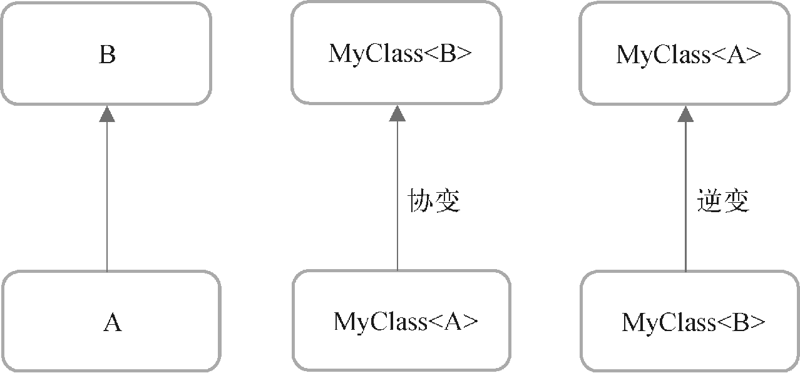

**图 10.19　协变与逆变的区别**

从直观的角度上来思考，逆变的规则好像挺奇怪的，原本 `A` 是 `B` 的子类型，怎么 `MyClass<B>` 能反过来成为 `MyClass<A>` 的子类型了呢？别担心，下面我们通过一个具体的例子来学习一下，你就明白了。

这里先定义一个 `Transformer` 接口，用于执行一些转换操作，代码如下所示：

```Kotlin
interface Transformer<T> {
    fun transform(t: T): String
}
```

可以看到，`Transformer` 接口中声明了一个 `transform()` 方法，它接收一个 `T` 类型的参数，并且返回一个 `String` 类型的数据，这意味着参数 `T` 在经过 `transform()` 方法的转换之后将会变成一个字符串。至于具体的转换逻辑是什么样的，则由子类去实现，`Transformer` 接口对此并不关心。

那么现在我们就尝试对 `Transformer` 接口进行实现，代码如下所示：

```Kotlin
fun main() {
    val trans = object : Transformer<Person> {
        override fun transform(t: Person): String {
            return "${t.name} ${t.age}"
        }
    }
    handleTransformer(trans) // 这行代码会报错
}

fun handleTransformer(trans: Transformer<Student>) {
    val student = Student("Tom", 19)
    val result = trans.transform(student)
}
```

首先我们在 `main()` 方法中编写了一个 `Transformer<Person>` 的匿名类实现，并通过 `transform()` 方法将传入的 `Person` 对象转换成了一个“姓名 + 年龄”拼接的字符串。而 `handleTransformer()` 方法接收的是一个 `Transformer<Student>` 类型的参数，这里在 `handleTransformer()` 方法中创建了一个 `Student` 对象，并调用参数的 `transform()` 方法将 `Student` 对象转换成一个字符串。

这段代码从安全的角度来分析是没有任何问题的，因为 `Student` 是 `Person` 的子类，使用 `Transformer<Person>` 的匿名类实现将 `Student` 对象转换成一个字符串也是绝对安全的，并不存在类型转换的安全隐患。但是实际上，在调用 `handleTransformer()` 方法的时候却会提示语法错误，原因也很简单，`Transformer<Person>` 并不是 `Transformer<Student>` 的子类型。

那么这个时候逆变就可以派上用场了，它就是专门用于处理这种情况的。修改 `Transformer` 接口中的代码，如下所示：

```Kotlin
interface Transformer<in T> {
    fun transform(t: T): String
}
```

这里我们在泛型 `T` 的声明前面加上了一个 `in` 关键字。这就意味着现在 `T` 只能出现在 in 位置上，而不能出现在 out 位置上，同时也意味着 `Transformer` 在泛型 `T` 上是逆变的。

没错，只要做了这样一点修改，刚才的代码就可以编译通过且正常运行了，因为此时 `Transformer<Person>` 已经成为了 `Transformer<Student>` 的子类型。

逆变的用法大概就是这样了，如果你还想再深入思考一下的话，可以想一想为什么逆变的时候泛型 `T` 不能出现在 out 位置上？为了解释这个问题，我们先假设逆变是允许让泛型 `T` 出现在 out 位置上的，然后看一看可能会产生什么样的安全隐患。

修改 `Transformer` 中的代码，如下所示：

```Kotlin
interface Transformer<in T> {
    fun transform(name: String, age: Int): @UnsafeVariance T
}
```

可以看到，我们将 `transform()` 方法改成了接收 `name` 和 `age` 这两个参数，并把返回值类型改成了泛型 `T`。由于逆变是不允许泛型 `T` 出现在 out 位置上的，这里为了能让编译器正常编译通过，所以加上了 `@UnsafeVariance` 注解，这和 List 源码中使用的技巧是一样的。

那么，这个时候可能会产生什么样的安全隐患呢？我们来看一下如下代码就知道了：

```Kotlin
fun main() {
    val trans = object : Transformer<Person> {
        override fun transform(name: String, age: Int): Person {
            return Teacher(name, age)
        }
    }
    handleTransformer(trans)
}

fun handleTransformer(trans: Transformer<Student>) {
    val result = trans.transform("Tom", 19)
}
```

上述代码就是一个典型的违反逆变规则而造成类型转换异常的例子。在 `Transformer<Person>` 的匿名类实现中，我们使用 `transform()` 方法中传入的 `name` 和 `age` 参数构建了一个 `Teacher` 对象，并把这个对象直接返回。由于 `transform()` 方法的返回值要求是一个 `Person` 对象，而 `Teacher` 是 `Person` 的子类，因此这种写法肯定是合法的。

但在 `handleTransformer()` 方法当中，我们调用了 `Transformer<Student>` 的 `transform()` 方法，并传入了 `name` 和 `age` 这两个参数，期望得到的是一个 `Student` 对象的返回，然而实际上 `transform()` 方法返回的却是一个 `Teacher` 对象，因此这里必然会造成类型转换异常。

由于这段代码是可以编译通过的，那么我们可以运行一下，打印出的异常信息如图 10.20 所示。

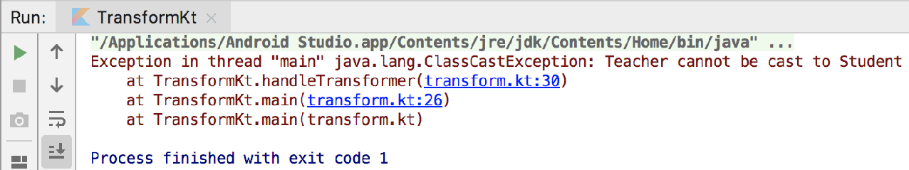

**图 10.20　逆变使用不当造成的类型转换异常**

可以看到，提示我们 `Teacher` 类型是无法转换成 `Student` 类型的。

也就是说，Kotlin 在提供协变和逆变功能时，就已经把各种潜在的类型转换安全隐患全部考虑进去了。只要我们严格按照其语法规则，让泛型在协变时只出现在 out 位置上，逆变时只出现在 in 位置上，就不会存在类型转换异常的情况。虽然 `@UnsafeVariance` 注解可以打破这一语法规则，但同时也会带来额外的风险，所以你在使用 `@UnsafeVariance` 注解时，必须很清楚自己在干什么才行。

最后我们再来介绍一下逆变功能在 Kotlin 内置 API 中的应用，比较典型的例子就是 `Comparable` 的使用。`Comparable` 是一个用于比较两个对象大小的接口，其源码定义如下：

```Kotlin
interface Comparable<in T> {
    operator fun compareTo(other: T): Int
}
```

可以看到，`Comparable` 在 `T` 这个泛型上就是逆变的，`compareTo()` 方法则用于实现具体的比较逻辑。那么这里为什么要让 `Comparable` 接口是逆变的呢？想象如下场景，如果我们使用 `Comparable<Person>` 实现了让两个 `Person` 对象比较大小的逻辑，那么用这段逻辑去比较两个 `Student` 对象的大小也一定是成立的，因此让 `Comparable<Person>` 成为 `Comparable<Student>` 的子类合情合理，这也是逆变非常典型的应用。

好了，关于协变和逆变的内容就到此为止，下面我们就来回顾一下本章所学的内容吧。

## 10.7　小结与点评

在本章中，我们学习了很多与 Service 相关的重要知识点，包括 Android 多线程编程、Service 的基本用法、Service 的生命周期、前台 Service 和 IntentService 等。这些内容已经覆盖了大部分你在日常开发中可能用到的 Service 技术，相信以后不管遇到什么样的 Service 难题，你都能从容解决。

在本章的 Kotlin 课堂中，我们学习了泛型的高级特性，对泛型的理解程度一下子上升了好几个档次。泛型实化在 Kotlin 中是特别有用的一个特性，通过具体的示例演示，相信你已经体会到了，借助此特性可以不断地优化自己的代码。至于协变和逆变，确实有一定的难度，不过我已经尽可能用最简明的方式来讲解这两个知识点，希望你将它们都理解到位了。

另外，本章同样是具有里程碑式的纪念意义的，因为我们已经将 Android 四大组件全部学完了。对于你来说，现在已经脱离了 Android 初级开发者的身份，并且应该具备独立完成很多功能的能力了。

那么后面我们应该再接再厉，争取进一步提升自身的能力，所以现在还不是放松的时候。目前我们所学的所有东西仅仅是在本地进行的，而实际上市场上的绝大多数应用还会涉及网络交互的部分，所以下一章我们就来学习一下 Android 网络编程方面的内容。