# 第 11 章　看看精彩的世界，使用网络技术

如果你在玩手机的时候不能上网，那你一定会感到特别地枯燥乏味。没错，现在早已不是玩单机的时代了，无论是 PC、手机、平板，还是电视，都具备上网的功能， 21 世纪的确是互联网的时代。

当然，Android 手机肯定也是可以上网的。作为开发者，我们就需要考虑如何利用网络编写出更加出色的应用程序，像 QQ、微博、微信等常见的应用都会大量使用网络技术。本章主要讲述如何在手机端使用 HTTP 和服务器进行网络交互，并对服务器返回的数据进行解析，这也是 Android 中最常使用到的网络技术，下面就让我们一起来学习一下吧。

## 11.1　WebView 的用法

有时候我们可能会碰到一些比较特殊的需求，比如说在应用程序里展示一些网页。相信每个人都知道，加载和显示网页通常是浏览器的任务，但是需求里又明确指出，不允许打开系统浏览器，我们当然不可能自己去编写一个浏览器出来，这时应该怎么办呢？

不用担心，Android 早就考虑到了这种需求，并提供了一个 WebView 控件，借助它我们就可以在自己的应用程序里嵌入一个浏览器，从而非常轻松地展示各种各样的网页。

WebView 的用法也相当简单，下面我们就通过一个例子来学习一下吧。新建一个 WebViewTest 项目，然后修改 activity_main.xml 中的代码，如下所示：

```xml
<LinearLayout xmlns:android="http://schemas.android.com/apk/res/android"
    android:layout_width="match_parent"
    android:layout_height="match_parent" >

    <WebView
        android:id="@+id/webView"
        android:layout_width="match_parent"
        android:layout_height="match_parent" />

</LinearLayout>
```

可以看到，我们在布局文件中使用到了一个新的控件：WebView。这个控件就是用来显示网页的，这里的写法很简单，给它设置了一个 id，并让它充满整个屏幕。

然后修改 MainActivity 中的代码，如下所示：

```Kotlin
class MainActivity : AppCompatActivity() {

    override fun onCreate(savedInstanceState: Bundle?) {
        super.onCreate(savedInstanceState)
        setContentView(R.layout.activity_main)
        webView.settings.javaScriptEnabled=true
        webView.webViewClient = WebViewClient()
        webView.loadUrl("https://www.baidu.com")
    }

}
```

MainActivity 中的代码也很短，通过 WebView 的 `getSettings()` 方法可以设置一些浏览器的属性，这里我们并没有设置过多的属性，只是调用了 `setJavaScriptEnabled()` 方法，让 WebView 支持 JavaScript 脚本。

接下来是比较重要的一个部分，我们调用了 WebView 的 `setWebViewClient()` 方法，并传入了一个 WebViewClient 的实例。这段代码的作用是，当需要从一个网页跳转到另一个网页时，我们希望目标网页仍然在当前 WebView 中显示，而不是打开系统浏览器。

最后一步就非常简单了，调用 WebView 的 `loadUrl()` 方法，并将网址传入，即可展示相应网页的内容，这里就让我们看一看百度的首页长什么样吧。

另外还需要注意，由于本程序使用到了网络功能，而访问网络是需要声明权限的，因此我们还得修改 AndroidManifest.xml 文件，并加入权限声明，如下所示：

```xml
<manifest xmlns:android="http://schemas.android.com/apk/res/android"
    package="com.example.webviewtest">

    <uses-permission android:name="android.permission.INTERNET" />

    ...

</manifest>
```

在开始运行之前，确保你的手机或模拟器是联网的。然后就可以运行一下程序了，效果如图 11.1 所示。


**图 11.1　使用 WebView 加载网页**

可以看到，WebViewTest 这个程序现在已经具备了一个简易浏览器的功能，不仅成功将百度的首页展示了出来，还可以通过点击链接浏览更多的网页。

当然，WebView 还有很多更加高级的使用技巧，我们就不再继续探讨了，因为那不是本章的重点。这里先介绍了一下 WebView 的用法，只是希望你能对 HTTP 有一个最基本的认识，接下来我们就要利用这个协议做一些真正的网络开发工作了。

## 11.2　使用 HTTP 访问网络

如果说真的要去深入分析 HTTP，可能需要花费整整一本书的篇幅。这里我当然不会这么干，因为毕竟你是跟着我学习 Android 开发的，而不是网站开发。对于 HTTP，你只需要稍微了解一些就足够了，它的工作原理特别简单，就是客户端向服务器发出一条 HTTP 请求，服务器收到请求之后会返回一些数据给客户端，然后客户端再对这些数据进行解析和处理就可以了。是不是非常简单？一个浏览器的基本工作原理也就是如此了。比如说上一节中使用到的 WebView 控件，其实就是我们向百度的服务器发起了一条 HTTP 请求，接着服务器分析出我们想要访问的是百度的首页，于是把该网页的 HTML 代码进行返回，然后 WebView 再调用手机浏览器的内核对返回的 HTML 代码进行解析，最终将页面展示出来。

简单来说，WebView 已经在后台帮我们处理好了发送 HTTP 请求、接收服务器响应、解析返回数据，以及最终的页面展示这几步工作，只不过它封装得实在是太好了，反而使得我们不能那么直观地看出 HTTP 到底是如何工作的。因此，接下来就让我们通过手动发送 HTTP 请求的方式更加深入地理解这个过程。

### 11.2.1　使用 HttpURLConnection

在过去，Android 上发送 HTTP 请求一般有两种方式：HttpURLConnection 和 HttpClient。不过由于 HttpClient 存在 API 数量过多、扩展困难等缺点，Android 团队越来越不建议我们使用这种方式。终于在 Android 6.0 系统中，HttpClient 的功能被完全移除了，标志着此功能被正式弃用，因此本小节我们就学习一下现在官方建议使用的 HttpURLConnection 的用法。

首先需要获取 HttpURLConnection 的实例，一般只需创建一个 URL 对象，并传入目标的网络地址，然后调用一下 `openConnection()` 方法即可，如下所示：

```Kotlin
val url = URL("https://www.baidu.com")
val connection = url.openConnection() as HttpURLConnection
```

在得到了 HttpURLConnection 的实例之后，我们可以设置一下 HTTP 请求所使用的方法。常用的方法主要有两个：`GET` 和 `POST`。`GET` 表示希望从服务器那里获取数据，而 `POST` 则表示希望提交数据给服务器。写法如下：

```Kotlin
connection.requestMethod = "GET"
```

接下来就可以进行一些自由的定制了，比如设置连接超时、读取超时的毫秒数，以及服务器希望得到的一些消息头等。这部分内容根据自己的实际情况进行编写，示例写法如下：

```Kotlin
connection.connectTimeout = 8000
connection.readTimeout = 8000
```

之后再调用 `getInputStream()` 方法就可以获取到服务器返回的输入流了，剩下的任务就是对输入流进行读取：

```Kotlin
val input = connection.inputStream
```

最后可以调用 `disconnect()` 方法将这个 HTTP 连接关闭：

```Kotlin
connection.disconnect()
```

下面就让我们通过一个具体的例子来真正体验一下 HttpURLConnection 的用法。新建一个 NetworkTest 项目，首先修改 activity_main.xml 中的代码，如下所示：

```xml
<LinearLayout xmlns:android="http://schemas.android.com/apk/res/android"
    android:orientation="vertical"
    android:layout_width="match_parent"
    android:layout_height="match_parent" >

    <Button
        android:id="@+id/sendRequestBtn"
        android:layout_width="match_parent"
        android:layout_height="wrap_content"
        android:text="Send Request" />

    <ScrollView
        android:layout_width="match_parent"
        android:layout_height="match_parent" >

        <TextView
            android:id="@+id/responseText"
            android:layout_width="match_parent"
            android:layout_height="wrap_content" />

    </ScrollView>

</LinearLayout>
```

注意，这里我们使用了一个新的控件：ScrollView。它是用来做什么的呢？由于手机屏幕的空间一般比较小，有些时候过多的内容一屏是显示不下的，借助 ScrollView 控件，我们就可以以滚动的形式查看屏幕外的内容。另外，布局中还放置了一个 Button 和一个 TextView，Button 用于发送 HTTP 请求，TextView 用于将服务器返回的数据显示出来。

接着修改 MainActivity 中的代码，如下所示：

```Kotlin
class MainActivity : AppCompatActivity() {

    override fun onCreate(savedInstanceState: Bundle?) {
        super.onCreate(savedInstanceState)
        setContentView(R.layout.activity_main)
        sendRequestBtn.setOnClickListener {
            sendRequestWithHttpURLConnection()
        }
    }

    private fun sendRequestWithHttpURLConnection() {
        // 开启线程发起网络请求
        thread {
            var connection: HttpURLConnection? = null
            try {
                val response = StringBuilder()
                val url = URL("https://www.baidu.com")
                connection = url.openConnection() as HttpURLConnection
                connection.connectTimeout = 8000
                connection.readTimeout = 8000
                val input = connection.inputStream
                // 下面对获取到的输入流进行读取
                val reader = BufferedReader(InputStreamReader(input))
                reader.use {
                    reader.forEachLine {
                        response.append(it)
                    }
                }
                showResponse(response.toString())
            } catch (e: Exception) {
                e.printStackTrace()
            } finally {
                connection?.disconnect()
            }
        }
    }

    private fun showResponse(response: String) {
        runOnUiThread {
            // 在这里进行UI操作，将结果显示到界面上
            responseText.text = response
        }
    }
}
```

可以看到，我们在“Send Request”按钮的点击事件里调用了 `sendRequestWithHttpURLConnection()` 方法，在这个方法中先是开启了一个子线程，然后在子线程里使用 HttpURLConnection 发出一条 HTTP 请求，请求的目标地址就是百度的首页。接着利用 BufferedReader 对服务器返回的流进行读取，并将结果传入 `showResponse()` 方法中。而在 `showResponse()` 方法里，则是调用了一个 `runOnUiThread()` 方法，然后在这个方法的 Lambda 表达式中进行操作，将返回的数据显示到界面上。

那么这里为什么要用这个 `runOnUiThread()` 方法呢？别忘了，Android 是不允许在子线程中进行 UI 操作的。我们在 10.2.3 小节中学习了异步消息处理机制的工作原理，而 `runOnUiThread()` 方法其实就是对异步消息处理机制进行了一层封装，它背后的工作原理和 10.2.3 小节中所介绍的内容是一模一样的。借助这个方法，我们就可以将服务器返回的数据更新到界面上了。

完整的流程就是这样。不过在开始运行之前，仍然别忘了要声明一下网络权限。修改 AndroidManifest.xml 中的代码，如下所示：

```xml
<manifest xmlns:android="http://schemas.android.com/apk/res/android"
    package="com.example.networktest">

    <uses-permission android:name="android.permission.INTERNET" />

    ...

</manifest>
```

好了，现在运行一下程序，并点击“Send Request”按钮，结果如图 11.2 所示。

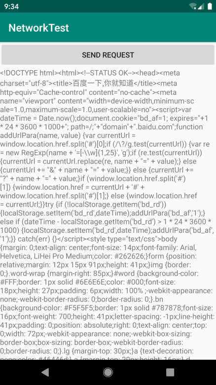

**图 11.2　服务器响应的数据**

是不是看得头晕眼花？没错，服务器返回给我们的就是这种 HTML 代码，只是通常情况下浏览器会将这些代码解析成漂亮的网页后再展示出来。

那么如果想要提交数据给服务器应该怎么办呢？其实也不复杂，只需要将 HTTP 请求的方法改成 `POST`，并在获取输入流之前把要提交的数据写出即可。注意，每条数据都要以键值对的形式存在，数据与数据之间用“&”符号隔开。比如说我们想要向服务器提交用户名和密码，就可以这样写：

```Kotlin
connection.requestMethod = "POST"
val output = DataOutputStream(connection.outputStream)
output.writeBytes("username=admin&password=123456")
```

好了，相信你已经将 HttpURLConnection 的用法很好地掌握了。

### 11.2.2　使用 OkHttp

当然我们并不是只能使用 HttpURLConnection，完全没有任何其他选择，事实上在开源盛行的今天，有许多出色的网络通信库都可以替代原生的 HttpURLConnection，而其中 OkHttp 无疑是做得最出色的一个。

OkHttp 是由鼎鼎大名的 Square 公司开发的，这个公司在开源事业上贡献良多，除了 OkHttp 之外，还开发了 Retrofit、Picasso 等知名的开源项目。OkHttp 不仅在接口封装上做得简单易用，就连在底层实现上也是自成一派，比起原生的 HttpURLConnection，可以说是有过之而无不及，现在已经成了广大 Android 开发者首选的网络通信库。那么本小节我们就来学习一下 OkHttp 的用法。OkHttp 的项目主页地址是：[https://github.com/square/okhttp](https://github.com/square/okhttp)。

在使用 OkHttp 之前，我们需要先在项目中添加 OkHttp 库的依赖。编辑 app/build.gradle 文件，在 `dependencies` 闭包中添加如下内容：

```gradle
dependencies {
    ...
    implementation 'com.squareup.okhttp3:okhttp:4.1.0'
}
```

添加上述依赖会自动下载两个库：一个是 OkHttp 库，一个是 Okio 库，后者是前者的通信基础。其中 4.1.0 是我写本书时 OkHttp 的最新版本，你可以访问 OkHttp 的项目主页，查看当前最新的版本是多少。

下面我们来看一下 OkHttp 的具体用法，首先需要创建一个 `OkHttpClient` 的实例，如下所示：

```Kotlin
val client = OkHttpClient()
```

接下来如果想要发起一条 HTTP 请求，就需要创建一个 `Request` 对象：

```Kotlin
val request = Request.Builder().build()
```

当然，上述代码只是创建了一个空的 `Request` 对象，并没有什么实际作用，我们可以在最终的 `build()` 方法之前连缀很多其他方法来丰富这个 `Request` 对象。比如可以通过 `url()` 方法来设置目标的网络地址，如下所示：

```Kotlin
val request = Request.Builder()
        .url("https://www.baidu.com")
        .build()
```

之后调用 OkHttpClient 的 `newCall()` 方法来创建一个 `Call` 对象，并调用它的 `execute()` 方法来发送请求并获取服务器返回的数据，写法如下：

```Kotlin
val response = client.newCall(request).execute()
```

`Response` 对象就是服务器返回的数据了，我们可以使用如下写法来得到返回的具体内容：

```Kotlin
val responseData = response.body?.string()
```

如果是发起一条 `POST` 请求，会比 `GET` 请求稍微复杂一点，我们需要先构建一个 `Request Body` 对象来存放待提交的参数，如下所示：

```Kotlin
val requestBody = FormBody.Builder()
        .add("username", "admin")
        .add("password", "123456")
        .build()
```

然后在 Request.Builder 中调用一下 `post()` 方法，并将 `RequestBody` 对象传入：

```Kotlin
val request = Request.Builder()
        .url("https://www.baidu.com")
        .post(requestBody)
        .build()
```

接下来的操作就和 `GET` 请求一样了，调用 `execute()` 方法来发送请求并获取服务器返回的数据即可。

好了，OkHttp 的基本用法就先学到这里，在本章的稍后部分我们还会学习 OkHttp 结合 Retrofit 的使用方法，到时候再进一步学习。那么现在我们先把 NetworkTest 这个项目改用 OkHttp 的方式再实现一遍吧。

由于布局部分完全不用改动，所以直接修改 MainActivity 中的代码，如下所示：

```Kotlin
class MainActivity : AppCompatActivity() {

    override fun onCreate(savedInstanceState: Bundle?) {
        super.onCreate(savedInstanceState)
        setContentView(R.layout.activity_main)
        sendRequestBtn.setOnClickListener {
            sendRequestWithOkHttp()
        }
    }
    ...
    private fun sendRequestWithOkHttp() {
        thread {
            try {
                val client = OkHttpClient()
                val request = Request.Builder()
                    .url("https://www.baidu.com")
                    .build()
                val response = client.newCall(request).execute()
                val responseData = response.body?.string()
                if (responseData != null) {
                    showResponse(responseData)
                }
            } catch (e: Exception) {
                e.printStackTrace()
            }
        }
    }
}
```

这里我们并没有做太多的改动，只是添加了一个 `sendRequestWithOkHttp()` 方法，并在“Send Request”按钮的点击事件里调用这个方法。在这个方法中同样还是先开启了一个子线程，然后在子线程里使用 OkHttp 发出一条 HTTP 请求，请求的目标地址还是百度的首页，OkHttp 的用法也正如前面所介绍的一样。最后仍然调用了 `showResponse()` 方法，将服务器返回的数据显示到界面上。

仅仅是改了这么多代码，现在我们就可以重新运行一下程序了。点击“Send Request”按钮后，你会看到和上一小节中同样的运行结果。由此证明，使用 OkHttp 来发送 HTTP 请求的功能也已经成功实现了。

## 11.3　解析 XML 格式数据

通常情况下，每个需要访问网络的应用程序都会有一个自己的服务器，我们可以向服务器提交数据，也可以从服务器上获取数据。不过这个时候就出现了一个问题，这些数据到底要以什么样的格式在网络上传输呢？随便传递一段文本肯定是不行的，因为另一方根本就不知道这段文本的用途是什么。因此，一般我们会在网络上传输一些格式化后的数据，这种数据会有一定的结构规则和语义，当另一方收到数据消息之后，就可以按照相同的结构规则进行解析，从而取出想要的那部分内容。

在网络上传输数据时最常用的格式有两种：XML 和 JSON。下面我们就来一个一个地进行学习。本节首先学习一下如何解析 XML 格式的数据。

在开始之前，我们还需要先解决一个问题，就是从哪儿才能获取一段 XML 格式的数据呢？这里我准备教你搭建一个最简单的 Web 服务器，在这个服务器上提供一段 XML 文本，然后我们在程序里去访问这个服务器，再对得到的 XML 文本进行解析。

搭建 Web 服务器的过程其实非常简单，也有很多种服务器类型可供选择，我们准备使用 Apache 服务器。另外，这里只会演示 Windows 系统下的搭建过程，因为 Mac 和 Ubuntu 系统都是默认安装好 Apache 服务器的，只需要启动一下即可。如果你使用的是这两种系统，可以自行搜索一下具体的操作方法。

下面来看 Window 系统下的搭建过程。首先你需要下载一个 Apache 服务器的安装包，官方下载地址是：[http://httpd.apache.org](http://httpd.apache.org)。下载完成后双击就可以进行安装了，如图 11.3 所示。

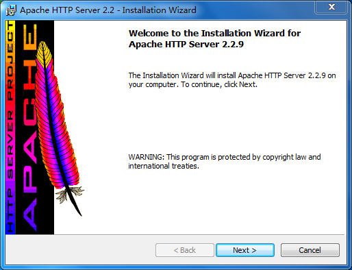

**图 11.3　Apache 服务器安装界面**

然后一直点击“Next”，会提示让你输入自己的域名，我们随便填一个域名就可以了，如图 11.4 所示。


**图 11.4　填入域名和服务器信息**

接着继续一直点击“Next”，会提示让你选择程序安装的路径，这里我选择安装到 C:\Apache 目录下。之后继续点击“Next”就可以完成安装了。安装成功后服务器会自动启动，你可以打开浏览器来验证一下。在地址栏输入 127.0.0.1，如果出现了如图 11.5 所示的界面，就说明服务器已经启动成功了。


**图 11.5　Apache 服务器的默认主页**

接下来进入 C:\Apache\htdocs 目录下，在这里新建一个名为 get_data.xml 的文件，然后编辑这个文件，并加入如下 XML 格式的内容。

```xml
<apps>
    <app>
        <id>1</id>
        <name>Google Maps</name>
        <version>1.0</version>
    </app>
    <app>
        <id>2</id>
        <name>Chrome</name>
        <version>2.1</version>
    </app>
    <app>
        <id>3</id>
        <name>Google Play</name>
        <version>2.3</version>
    </app>
</apps>
```

这时在浏览器中访问 http://127.0.0.1/get_data.xml 这个网址，就应该出现如图 11.6 所示的内容。

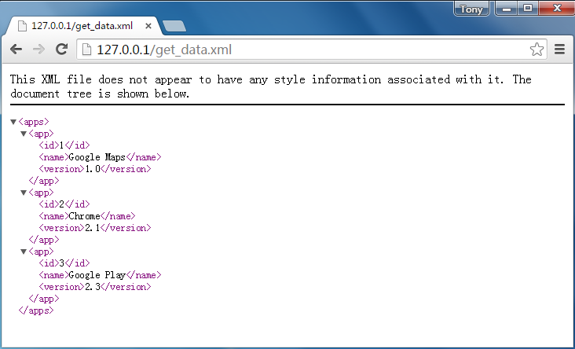

**图 11.6　在浏览器验证 XML 数据**

好了，准备工作到此结束，接下来就让我们在 Android 程序里去获取并解析这段 XML 数据吧。

### 11.3.1　Pull 解析方式

解析 XML 格式的数据其实也有挺多种方式的，本节中我们学习比较常用的两种：Pull 解析和 SAX 解析。那么简单起见，这里仍然是在 NetworkTest 项目的基础上继续开发，这样我们就可以重用之前网络通信部分的代码，从而把工作的重心放在 XML 数据解析上。

既然 XML 格式的数据已经提供好了，现在要做的就是从中解析出我们想要得到的那部分内容。修改 MainActivity 中的代码，如下所示：

```Kotlin
class MainActivity : AppCompatActivity() {
    ...
    private fun sendRequestWithOkHttp() {
        thread {
            try {
                val client = OkHttpClient()
                val request = Request.Builder()
                    // 指定访问的服务器地址是计算机本机
                    .url("http://10.0.2.2/get_data.xml")
                    .build()
                val response = client.newCall(request).execute()
                val responseData = response.body?.string()
                if (responseData != null) {
                    parseXMLWithPull(responseData)
                }
            } catch (e: Exception) {
                e.printStackTrace()
            }
        }
    }
    ...
    private fun parseXMLWithPull(xmlData: String) {
        try {
            val factory = XmlPullParserFactory.newInstance()
            val xmlPullParser = factory.newPullParser()
            xmlPullParser.setInput(StringReader(xmlData))
            var eventType = xmlPullParser.eventType
            var id = ""
            var name = ""
            var version = ""
            while (eventType != XmlPullParser.END_DOCUMENT) {
                val nodeName = xmlPullParser.name
                when (eventType) {
                    // 开始解析某个节点
                    XmlPullParser.START_TAG -> {
                        when (nodeName) {
                            "id" -> id = xmlPullParser.nextText()
                            "name" -> name = xmlPullParser.nextText()
                            "version" -> version = xmlPullParser.nextText()
                        }
                    }
                    // 完成解析某个节点
                    XmlPullParser.END_TAG -> {
                        if ("app" == nodeName) {
                            Log.d("MainActivity", "id is $id")
                            Log.d("MainActivity", "name is $name")
                            Log.d("MainActivity", "version is $version")
                        }
                    }
                }
                eventType = xmlPullParser.next()
            }
        } catch (e: Exception) {
            e.printStackTrace()
        }
    }
}
```

可以看到，这里首先将 HTTP 请求的地址改成了 http://10.0.2.2/get_data.xml，10.0.2.2 对于模拟器来说就是计算机本机的 IP 地址。在得到了服务器返回的数据后，我们不再直接将其展示，而是调用了 `parseXMLWithPull()` 方法来解析服务器返回的数据。

下面就来仔细看下 `parseXMLWithPull()` 方法中的代码吧。这里首先要创建一个 `XmlPullParserFactory` 的实例，并借助这个实例得到 `XmlPullParser` 对象，然后调用 `XmlPullParser` 的 `setInput()` 方法将服务器返回的 XML 数据设置进去，之后就可以开始解析了。解析的过程也非常简单，通过 `getEventType()` 可以得到当前的解析事件，然后在一个 `while` 循环中不断地进行解析，如果当前的解析事件不等于 `XmlPullParser.END_DOCUMENT`，说明解析工作还没完成，调用 `next()` 方法后可以获取下一个解析事件。

在 `while` 循环中，我们通过 `getName()` 方法得到了当前节点的名字。如果发现节点名等于 id、name 或 version，就调用 `nextText()` 方法来获取节点内具体的内容，每当解析完一个 app 节点，就将获取到的内容打印出来。

好了，整体的过程就是这么简单，不过在程序运行之前还得再进行一项额外的配置。从 Android 9.0 系统开始，应用程序默认只允许使用 HTTPS 类型的网络请求，HTTP 类型的网络请求因为有安全隐患默认不再被支持，而我们搭建的 Apache 服务器现在使用的就是 HTTP。

那么为了能让程序使用 HTTP，我们还要进行如下配置才可以。右击 res 目录 →New→Directory，创建一个 xml 目录，接着右击 xml 目录 →New→File，创建一个 network_config.xml 文件。然后修改 network_config.xml 文件中的内容，如下所示：

```xml
<?xml version="1.0" encoding="utf-8"?>
<network-security-config>
    <base-config cleartextTrafficPermitted="true">
        <trust-anchors>
            <certificates src="system" />
        </trust-anchors>
    </base-config>
</network-security-config>
```

这段配置文件的意思就是允许我们以明文的方式在网络上传输数据，而 HTTP 使用的就是明文传输方式。

接下来修改 AndroidManifest.xml 中的代码来启用我们刚才创建的配置文件：

```xml
<manifest xmlns:android="http://schemas.android.com/apk/res/android"
    package="com.example.networktest">
    ...
    <application
        android:allowBackup="true"
        android:icon="@mipmap/ic_launcher"
        android:label="@string/app_name"
        android:roundIcon="@mipmap/ic_launcher_round"
        android:supportsRtl="true"
        android:theme="@style/AppTheme"
        android:networkSecurityConfig="@xml/network_config">
        ...
    </application>
</manifest>
```

这样就可以在程序中使用 HTTP 了，下面让我们来测试一下吧。运行 NetworkTest 项目，然后点击“Send Request”按钮，观察 Logcat 中的打印日志，如图 11.7 所示。


**图 11.7　打印从 XML 中解析出的数据**

可以看到，我们已经将 XML 数据中的指定内容成功解析出来了。

### 11.3.2　SAX 解析方式

Pull 解析方式虽然非常好用，但它并不是我们唯一的选择。SAX 解析也是一种特别常用的 XML 解析方式，虽然它的用法比 Pull 解析要复杂一些，但在语义方面会更加清楚。

要使用 SAX 解析，通常情况下我们会新建一个类继承自 `DefaultHandler`，并重写父类的 5 个方法，如下所示：

```Kotlin
class MyHandler : DefaultHandler() {

    override fun startDocument() {
    }

    override fun startElement(uri: String, localName: String, qName: String, attributes:
        Attributes) {
    }

    override fun characters(ch: CharArray, start: Int, length: Int) {
    }

    override fun endElement(uri: String, localName: String, qName: String) {
    }

    override fun endDocument() {
    }

}
```

这 5 个方法一看就很清楚吧？`startDocument()` 方法会在开始 XML 解析的时候调用，`startElement()` 方法会在开始解析某个节点的时候调用，`characters()` 方法会在获取节点中内容的时候调用，`endElement()` 方法会在完成解析某个节点的时候调用，`endDocument()` 方法会在完成整个 XML 解析的时候调用。其中，`startElement()`、`characters()` 和 `endElement()` 这 3 个方法是有参数的，从 XML 中解析出的数据就会以参数的形式传入这些方法中。需要注意的是，在获取节点中的内容时，`characters()` 方法可能会被调用多次，一些换行符也被当作内容解析出来，我们需要针对这种情况在代码中做好控制。

那么下面就让我们尝试用 SAX 解析的方式来实现和上一小节同样的功能吧。新建一个 `ContentHandler` 类继承自 `DefaultHandler`，并重写父类的 5 个方法，如下所示：

```Kotlin
class ContentHandler : DefaultHandler() {

    private var nodeName = ""

    private lateinit var id: StringBuilder

    private lateinit var name: StringBuilder

    private lateinit var version: StringBuilder

    override fun startDocument() {
        id = StringBuilder()
        name = StringBuilder()
        version = StringBuilder()
    }

    override fun startElement(uri: String, localName: String, qName: String, attributes:
        Attributes) {
        // 记录当前节点名
        nodeName = localName
        Log.d("ContentHandler", "uri is $uri")
        Log.d("ContentHandler", "localName is $localName")
        Log.d("ContentHandler", "qName is $qName")
        Log.d("ContentHandler", "attributes is $attributes")
    }

    override fun characters(ch: CharArray, start: Int, length: Int) {
        // 根据当前节点名判断将内容添加到哪一个StringBuilder对象中
        when (nodeName) {
            "id" -> id.append(ch, start, length)
            "name" -> name.append(ch, start, length)
            "version" -> version.append(ch, start, length)
        }
    }

    override fun endElement(uri: String, localName: String, qName: String) {
        if ("app" == localName) {
            Log.d("ContentHandler", "id is ${id.toString().trim()}")
            Log.d("ContentHandler", "name is ${name.toString().trim()}")
            Log.d("ContentHandler", "version is ${version.toString().trim()}")
            // 最后要将StringBuilder清空
            id.setLength(0)
            name.setLength(0)
            version.setLength(0)
        }
    }

    override fun endDocument() {
    }

}
```

可以看到，我们首先给 `id`、`name` 和 `version` 节点分别定义了一个 `StringBuilder` 对象，并在 `startDocument()` 方法里对它们进行了初始化。每当开始解析某个节点的时候，`startElement()` 方法就会得到调用，其中 `localName` 参数记录着当前节点的名字，这里我们把它记录下来。接着在解析节点中具体内容的时候就会调用 `characters()` 方法，我们会根据当前的节点名进行判断，将解析出的内容添加到哪一个 `StringBuilder` 对象中。最后在 `endElement()` 方法中进行判断，如果 `app` 节点已经解析完成，就打印出 `id`、`name` 和 `version` 的内容。需要注意的是，目前 `id`、`name` 和 `version` 中都可能是包括回车或换行符的，因此在打印之前我们还需要调用一下 `trim()` 方法，并且打印完成后要将 `StringBuilder` 的内容清空，不然的话会影响下一次内容的读取。

接下来的工作就非常简单了，修改 MainActivity 中的代码，如下所示：

```Kotlin
class MainActivity : AppCompatActivity() {
    ...
    private fun sendRequestWithOkHttp() {
        thread {
            try {
                val client = OkHttpClient()
                val request = Request.Builder()
                    // 指定访问的服务器地址是计算机本机
                    .url("http://10.0.2.2/get_data.xml")
                    .build()
                val response = client.newCall(request).execute()
                val responseData = response.body?.string()
                if (responseData != null) {
                    parseXMLWithSAX(responseData)
                }
            } catch (e: Exception) {
                e.printStackTrace()
            }
        }
    }
    ...
    private fun parseXMLWithSAX(xmlData: String) {
        try {
            val factory = SAXParserFactory.newInstance()
            val xmlReader = factory.newSAXParser().XMLReader
            val handler = ContentHandler()
            // 将ContentHandler的实例设置到XMLReader中
            xmlReader.contentHandler = handler
            // 开始执行解析
            xmlReader.parse(InputSource(StringReader(xmlData)))
        } catch (e: Exception) {
            e.printStackTrace()
        }
    }
}
```

在得到了服务器返回的数据后，我们这次通过调用 `parseXMLWithSAX()` 方法来解析 XML 数据。`parseXMLWithSAX()` 方法中先是创建了一个 `SAXParserFactory` 的对象，然后再获取 `XMLReader` 对象，接着将我们编写的 ContentHandler 的实例设置到 XMLReader 中，最后调用 `parse()` 方法开始执行解析。

现在重新运行一下程序，点击“Send Request”按钮后观察 Logcat 中的打印日志，你会看到和图 11.7 中一样的结果。

除了 Pull 解析和 SAX 解析之外，其实还有一种 DOM 解析方式也比较常用，不过这里我们就不再展开进行讲解了，如果感兴趣的话，你可以自己去查阅一下相关资料。

## 11.4　解析 JSON 格式数据

现在你已经掌握了 XML 格式数据的解析方式，那么接下来我们要学习一下如何解析 JSON 格式的数据了。比起 XML，JSON 的主要优势在于它的体积更小，在网络上传输的时候更省流量。但缺点在于，它的语义性较差，看起来不如 XML 直观。

在开始之前，我们还需要在 C:\Apache\htdocs 目录中新建一个 get_data.json 的文件，然后编辑这个文件，并加入如下 JSON 格式的内容：

```json
[{"id":"5","version":"5.5","name":"Clash of Clans"},
{"id":"6","version":"7.0","name":"Boom Beach"},
{"id":"7","version":"3.5","name":"Clash Royale"}]
```

这时在浏览器中访问 http://127.0.0.1/get_data.json 这个网址，就应该出现如图 11.8 所示的内容。

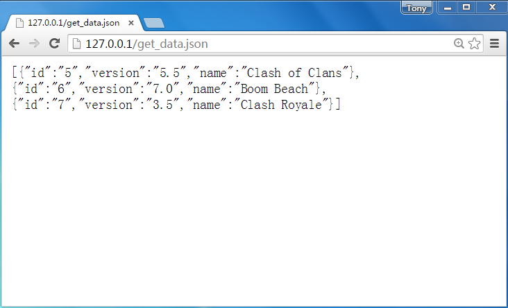

**图 11.8　在浏览器验证 JSON 数据**

好了，这样我们就把 JSON 格式的数据准备好了，下面就开始学习如何在 Android 程序中解析这些数据吧。

### 11.4.1　使用 JSONObject

类似地，解析 JSON 数据也有很多种方法，可以使用官方提供的 JSONObject，也可以使用 Google 的开源库 GSON。另外，一些第三方的开源库如 Jackson、FastJSON 等也非常不错。本节中我们就来学习一下前两种解析方式的用法。

修改 MainActivity 中的代码，如下所示：

```Kotlin
class MainActivity : AppCompatActivity() {
    ...
    private fun sendRequestWithOkHttp() {
        thread {
            try {
                val client = OkHttpClient()
                val request = Request.Builder()
                    // 指定访问的服务器地址是计算机本机
                    .url("http://10.0.2.2/get_data.json")
                    .build()
                val response = client.newCall(request).execute()
                val responseData = response.body?.string()
                if (responseData != null) {
                    parseJSONWithJSONObject(responseData)
                }
            } catch (e: Exception) {
                e.printStackTrace()
            }
        }
    }
    ...
    private fun parseJSONWithJSONObject(jsonData: String) {
        try {
            val jsonArray = JSONArray(jsonData)
            for (i in 0 until jsonArray.length()) {
                val jsonObject = jsonArray.getJSONObject(i)
                val id = jsonObject.getString("id")
                val name = jsonObject.getString("name")
                val version = jsonObject.getString("version")
                Log.d("MainActivity", "id is $id")
                Log.d("MainActivity", "name is $name")
                Log.d("MainActivity", "version is $version")
            }
        } catch (e: Exception) {
            e.printStackTrace()
        }
    }
}
```

首先将 HTTP 请求的地址改成 http://10.0.2.2/get_data.json，然后在得到服务器返回的数据后调用 `parseJSONWithJSONObject()` 方法来解析数据。可以看到，解析 JSON 的代码真的非常简单，由于我们在服务器中定义的是一个 JSON 数组，因此这里首先将服务器返回的数据传入一个 `JSONArray` 对象中。然后循环遍历这个 `JSONArray`，从中取出的每一个元素都是一个 `JSONObject` 对象，每个 `JSONObject` 对象中又会包含 `id`、`name` 和 `version` 这些数据。接下来只需要调用 `getString()` 方法将这些数据取出，并打印出来即可。

好了，就是这么简单！现在重新运行一下程序，并点击“Send Request”按钮，结果如图 11.9 所示。

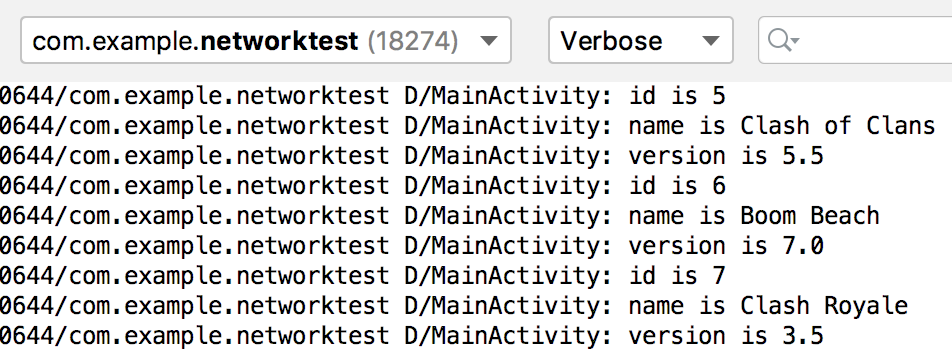

**图 11.9　打印从 JSON 中解析出的数据**

### 11.4.2　使用 GSON

如果你认为使用 JSONObject 来解析 JSON 数据已经非常简单了，那你就太容易满足了。Google 提供的 GSON 开源库可以让解析 JSON 数据的工作简单到让你不敢想象的地步，那我们肯定是不能错过这个学习机会的。

不过，GSON 并没有被添加到 Android 官方的 API 中，因此如果想要使用这个功能的话，就必须在项目中添加 GSON 库的依赖。编辑 app/build.gradle 文件，在 `dependencies` 闭包中添加如下内容：

```gradle
dependencies {
    ...
    implementation 'com.google.code.gson:gson:2.8.5'
}
```

那么 GSON 库究竟是神奇在哪里呢？它的强大之处就在于可以将一段 JSON 格式的字符串自动映射成一个对象，从而不需要我们再手动编写代码进行解析了。

比如说一段 JSON 格式的数据如下所示：

```json
{"name":"Tom","age":20}
```

那我们就可以定义一个 `Person` 类，并加入 `name` 和 `age` 这两个字段，然后只需简单地调用如下代码就可以将 JSON 数据自动解析成一个 `Person` 对象了：

```Kotlin
val gson = Gson()
val person = gson.fromJson(jsonData, Person::class.java)
```

如果需要解析的是一段 JSON 数组，会稍微麻烦一点，比如如下格式的数据：

```json
[{"name":"Tom","age":20}, {"name":"Jack","age":25}, {"name":"Lily","age":22}]
```

这个时候，我们需要借助 TypeToken 将期望解析成的数据类型传入 `fromJson()` 方法中，如下所示：

```Kotlin
val typeOf = object : TypeToken<List<Person>>() {}.type
val people = gson.fromJson<List<Person>>(jsonData, typeOf)
```

好了，基本的用法就是这样，下面就让我们来真正地尝试一下吧。首先新增一个 `App` 类，并加入 `id`、`name` 和 `version` 这 3 个字段，如下所示：

```Kotlin
class App(val id: String, val name: String, val version: String)
```

然后修改 MainActivity 中的代码，如下所示：

```Kotlin
class MainActivity : AppCompatActivity() {
    ...
    private fun sendRequestWithOkHttp() {
        thread {
            try {
                val client = OkHttpClient()
                val request = Request.Builder()
                    // 指定访问的服务器地址是计算机本机
                    .url("http://10.0.2.2/get_data.json")
                    .build()
                val response = client.newCall(request).execute()
                val responseData = response.body?.string()
                if (responseData != null) {
                    parseJSONWithGSON(responseData)
                }
            } catch (e: Exception) {
                e.printStackTrace()
            }
        }
    }
    ...
    private fun parseJSONWithGSON(jsonData: String) {
        val gson = Gson()
        val typeOf = object : TypeToken<List<App>>() {}.type
        val appList = gson.fromJson<List<App>>(jsonData, typeOf)
        for (app in appList) {
            Log.d("MainActivity", "id is ${app.id}")
            Log.d("MainActivity", "name is ${app.name}")
            Log.d("MainActivity", "version is ${app.version}")
        }
    }
}
```

现在重新运行程序，点击“Send Request”按钮后观察 Logcat 中的打印日志，你会看到和图 11.9 中一样的结果。

好了，这样我们就把 XML 和 JSON 这两种数据格式最常用的几种解析方法都学习完了，在网络数据的解析方面，你已经成功毕业了。

## 11.5　网络请求回调的实现方式

目前你已经掌握了 HttpURLConnection 和 OkHttp 的用法，知道了如何发起 HTTP 请求，以及解析服务器返回的数据，但也许你还没有发现，之前我们的写法其实是很有问题的。因为一个应用程序很可能会在许多地方都使用到网络功能，而发送 HTTP 请求的代码基本是相同的，如果我们每次都去编写一遍发送 HTTP 请求的代码，这显然是非常差劲的做法。

没错，通常情况下我们应该将这些通用的网络操作提取到一个公共的类里，并提供一个通用方法，当想要发起网络请求的时候，只需简单地调用一下这个方法即可。比如使用如下的写法：

```Kotlin
object HttpUtil {

    fun sendHttpRequest(address: String): String {
        var connection: HttpURLConnection? = null
        try {
            val response = StringBuilder()
            val url = URL(address)
            connection = url.openConnection() as HttpURLConnection
            connection.connectTimeout = 8000
            connection.readTimeout = 8000
            val input = connection.inputStream
            val reader = BufferedReader(InputStreamReader(input))
            reader.use {
                reader.forEachLine {
                    response.append(it)
                }
            }
            return response.toString()
        } catch (e: Exception) {
            e.printStackTrace()
            return e.message.toString()
        } finally {
            connection?.disconnect()
        }
    }

}
```

以后每当需要发起一条 HTTP 请求的时候，就可以这样写：

```Kotlin
val address = "https://www.baidu.com"
val response = HttpUtil.sendHttpRequest(address)
```

在获取到服务器响应的数据后，我们就可以对它进行解析和处理了。但是需要注意，网络请求通常属于耗时操作，而 `sendHttpRequest()` 方法的内部并没有开启线程，这样就有可能导致在调用 `sendHttpRequest()` 方法的时候主线程被阻塞。

你可能会说，很简单嘛，在 `sendHttpRequest()` 方法内部开启一个线程，不就解决这个问题了吗？其实没有你想象中那么容易，因为如果我们在 `sendHttpRequest()` 方法中开启一个线程来发起 HTTP 请求，服务器响应的数据是无法进行返回的。这是由于所有的耗时逻辑都是在子线程里进行的，`sendHttpRequest()` 方法会在服务器还没来得及响应的时候就执行结束了，当然也就无法返回响应的数据了。

那么在遇到这种情况时应该怎么办呢？其实解决方法并不难，只需要使用编程语言的回调机制就可以了。下面就让我们来学习一下回调机制到底是如何使用的。

首先需要定义一个接口，比如将它命名成 HttpCallbackListener，代码如下所示：

```Kotlin
interface HttpCallbackListener {
    fun onFinish(response: String)
    fun onError(e: Exception)
}
```

可以看到，我们在接口中定义了两个方法：`onFinish()` 方法表示当服务器成功响应我们请求的时候调用，`onError()` 表示当进行网络操作出现错误的时候调用。这两个方法都带有参数，`onFinish()` 方法中的参数代表服务器返回的数据，而 `onError()` 方法中的参数记录着错误的详细信息。

接着修改 HttpUtil 中的代码，如下所示：

```Kotlin
object HttpUtil {

    fun sendHttpRequest(address: String, listener: HttpCallbackListener) {
        thread {
            var connection: HttpURLConnection? = null
            try {
                val response = StringBuilder()
                val url = URL(address)
                connection = url.openConnection() as HttpURLConnection
                connection.connectTimeout = 8000
                connection.readTimeout = 8000
                val input = connection.inputStream
                val reader = BufferedReader(InputStreamReader(input))
                reader.use {
                    reader.forEachLine {
                        response.append(it)
                    }
                }
                // 回调onFinish()方法
                listener.onFinish(response.toString())
            } catch (e: Exception) {
                e.printStackTrace()
                // 回调onError()方法
                listener.onError(e)
            } finally {
                connection?.disconnect()
            }
        }
    }

}
```

我们首先给 `sendHttpRequest()` 方法添加了一个 `HttpCallbackListener` 参数，并在方法的内部开启了一个子线程，然后在子线程里执行具体的网络操作。注意，子线程中是无法通过 `return` 语句返回数据的，因此这里我们将服务器响应的数据传入了 `HttpCallbackListener` 的 `onFinish()` 方法中，如果出现了异常，就将异常原因传入 `onError()` 方法中。

现在 `sendHttpRequest()` 方法接收两个参数，因此我们在调用它的时候还需要将 `HttpCallbackListener` 的实例传入，如下所示：

```Kotlin
HttpUtil.sendHttpRequest(address, object : HttpCallbackListener {
    override fun onFinish(response: String) {
        // 得到服务器返回的具体内容
    }

    override fun onError(e: Exception) {
        // 在这里对异常情况进行处理
    }
})
```

这样当服务器成功响应的时候，我们就可以在 `onFinish()` 方法里对响应数据进行处理了。类似地，如果出现了异常，就可以在 `onError()` 方法里对异常情况进行处理。如此一来，我们就巧妙地利用回调机制将响应数据成功返回给调用方了。

不过你会发现，上述使用 HttpURLConnection 的写法总体来说还是比较复杂的，那么使用 OkHttp 会变得简单吗？答案是肯定的，而且要简单得多，下面我们来具体看一下。在 HttpUtil 中加入一个 `sendOkHttpRequest()` 方法，如下所示：

```Kotlin
object HttpUtil {
    ...
    fun sendOkHttpRequest(address: String, callback: okhttp3.Callback) {
        val client = OkHttpClient()
        val request = Request.Builder()
            .url(address)
            .build()
        client.newCall(request).enqueue(callback)
    }
}
```

可以看到，`sendOkHttpRequest()` 方法中有一个 `okhttp3.Callback` 参数，这个是 OkHttp 库中自带的回调接口，类似于我们刚才自己编写的 `HttpCallbackListener`。然后在 `client.newCall()` 之后没有像之前那样一直调用 `execute()` 方法，而是调用了一个 `enqueue()` 方法，并把 `okhttp3.Callback` 参数传入。相信聪明的你已经猜到了，OkHttp 在 `enqueue()` 方法的内部已经帮我们开好子线程了，然后会在子线程中执行 HTTP 请求，并将最终的请求结果回调到 `okhttp3.Callback` 当中。

那么我们在调用 `sendOkHttpRequest()` 方法的时候就可以这样写：

```Kotlin
HttpUtil.sendOkHttpRequest(address, object : Callback {
    override fun onResponse(call: Call, response: Response) {
        // 得到服务器返回的具体内容
        val responseData = response.body?.string()
    }

    override fun onFailure(call: Call, e: IOException) {
        // 在这里对异常情况进行处理
    }
})
```

由此可以看出，OkHttp 的接口设计得确实非常人性化，它将一些常用的功能进行了很好的封装，使得我们只需编写少量的代码就能完成较为复杂的网络操作。

另外，需要注意的是，不管是使用 HttpURLConnection 还是 OkHttp，最终的回调接口都还是在子线程中运行的，因此我们不可以在这里执行任何的 UI 操作，除非借助 `runOnUiThread()` 方法来进行线程转换。

## 11.6　最好用的网络库：Retrofit

既然我们这一章讲解 Android 网络技术，那么就不得不提到 Retrofit，因为它实在是太好用了。Retrofit 同样是一款由 Square 公司开发的网络库，但是它和 OkHttp 的定位完全不同。OkHttp 侧重的是底层通信的实现，而 Retrofit 侧重的是上层接口的封装。事实上，Retrofit 就是 Square 公司在 OkHttp 的基础上进一步开发出来的应用层网络通信库，使得我们可以用更加面向对象的思维进行网络操作。Retrofit 的项目主页地址是：[https://github.com/square/retrofit](https://github.com/square/retrofit)。

那么本节我们就来学习一下 Retrofit 的用法，新建一个 RetrofitTest 项目，然后马上开始吧。

### 11.6.1　Retrofit 的基本用法

首先我想谈一谈 Retrofit 的基本设计思想。Retrofit 的设计基于以下几个事实。

同一款应用程序中所发起的网络请求绝大多数指向的是同一个服务器域名。这个很好理解，因为任何公司的产品，客户端和服务器都是配套的，很难想象一个客户端一会去这个服务器获取数据，一会又要去另外一个服务器获取数据吧？

另外，服务器提供的接口通常是可以根据功能来归类的。比如新增用户、修改用户数据、查询用户数据这几个接口就可以归为一类，上架新书、销售图书、查询可供销售图书这几个接口也可以归为一类。将服务器接口合理归类能够让代码结构变得更加合理，从而提高可阅读性和可维护性。

最后，开发者肯定更加习惯于“调用一个接口，获取它的返回值”这样的编码方式，但当调用的是服务器接口时，却很难想象该如何使用这样的编码方式。其实大多数人并不关心网络的具体通信细节，但是传统网络库的用法却需要编写太多网络相关的代码。

而 Retrofit 的用法就是基于以上几点来设计的，首先我们可以配置好一个根路径，然后在指定服务器接口地址时只需要使用相对路径即可，这样就不用每次都指定完整的 URL 地址了。

另外，Retrofit 允许我们对服务器接口进行归类，将功能同属一类的服务器接口定义到同一个接口文件当中，从而让代码结构变得更加合理。

最后，我们也完全不用关心网络通信的细节，只需要在接口文件中声明一系列方法和返回值，然后通过注解的方式指定该方法对应哪个服务器接口，以及需要提供哪些参数。当我们在程序中调用该方法时，Retrofit 会自动向对应的服务器接口发起请求，并将响应的数据解析成返回值声明的类型。这就使得我们可以用更加面向对象的思维来进行网络操作。

Retrofit 的基本设计思想差不多就是这些，下面就让我们通过一个具体的例子来快速体验一下 Retrofit 的用法。

要想使用 Retrofit，我们需要先在项目中添加必要的依赖库。编辑 app/build.gradle 文件，在 `dependencies` 闭包中添加如下内容：

```gradle
dependencies {
    ...
    implementation 'com.squareup.retrofit2:retrofit:2.6.1'
    implementation 'com.squareup.retrofit2:converter-gson:2.6.1'
}
```

由于 Retrofit 是基于 OkHttp 开发的，因此添加上述第一条依赖会自动将 Retrofit、OkHttp 和 Okio 这几个库一起下载，我们无须再手动引入 OkHttp 库。另外，Retrofit 还会将服务器返回的 JSON 数据自动解析成对象，因此上述第二条依赖就是一个 Retrofit 的转换库，它是借助 GSON 来解析 JSON 数据的，所以会自动将 GSON 库一起下载下来，这样我们也不用手动引入 GSON 库了。除了 GSON 之外，Retrofit 还支持各种其他主流的 JSON 解析库，包括 Jackson、Moshi 等，不过毫无疑问 GSON 是最常用的。

这里我们打算继续使用 11.4 节提供的 JSON 数据接口。由于 Retrofit 会借助 GSON 将 JSON 数据转换成对象，因此这里同样需要新增一个 `App` 类，并加入 `id`、`name` 和 `version` 这 3 个字段，如下所示：

```Kotlin
class App(val id: String, val name: String, val version: String)
```

接下来，我们可以根据服务器接口的功能进行归类，创建不同种类的接口文件，并在其中定义对应具体服务器接口的方法。不过由于我们的 Apache 服务器上其实只有一个获取 JSON 数据的接口，因此这里只需要定义一个接口文件，并包含一个方法即可。新建 `AppService` 接口，代码如下所示：

```Kotlin
interface AppService {

    @GET("get_data.json")
    fun getAppData(): Call<List<App>>

}
```

通常 Retrofit 的接口文件建议以具体的功能种类名开头，并以 Service 结尾，这是一种比较好的命名习惯。

上述代码中有两点需要我们注意。第一就是在 `getAppData()` 方法上面添加的注解，这里使用了一个 `@GET` 注解，表示当调用 `getAppData()` 方法时 Retrofit 会发起一条 `GET` 请求，请求的地址就是我们在 `@GET` 注解中传入的具体参数。注意，这里只需要传入请求地址的相对路径即可，根路径我们会在稍后设置。

第二就是 `getAppData()` 方法的返回值必须声明成 Retrofit 中内置的 `Call` 类型，并通过泛型来指定服务器响应的数据应该转换成什么对象。由于服务器响应的是一个包含 App 数据的 JSON 数组，因此这里我们将泛型声明成 `List<App>`。当然，Retrofit 还提供了强大的 Call Adapters 功能来允许我们自定义方法返回值的类型，比如 Retrofit 结合 RxJava 使用就可以将返回值声明成 `Observable`、`Flowable` 等类型，不过这些内容就不在本节的讨论范围内了。

定义好了 `AppService` 接口之后，接下来的问题就是该如何使用它。为了方便测试，我们还得在界面上添加一个按钮才行。修改 activity_main.xml 中的代码，如下所示：

```xml
<LinearLayout xmlns:android="http://schemas.android.com/apk/res/android"
    android:orientation="vertical"
    android:layout_width="match_parent"
    android:layout_height="match_parent" >

    <Button
        android:id="@+id/getAppDataBtn"
        android:layout_width="match_parent"
        android:layout_height="wrap_content"
        android:text="Get App Data" />

</LinearLayout>
```

很简单，这里在布局文件中增加了一个 Button 控件，我们在它的点击事件中处理具体的网络请求逻辑即可。

现在修改 MainActivity 中的代码，如下所示：

```Kotlin
class MainActivity : AppCompatActivity() {

    override fun onCreate(savedInstanceState: Bundle?) {
        super.onCreate(savedInstanceState)
        setContentView(R.layout.activity_main)
        getAppDataBtn.setOnClickListener {
            val retrofit = Retrofit.Builder()
                .baseUrl("http://10.0.2.2/")
                .addConverterFactory(GsonConverterFactory.create())
                .build()
            val appService = retrofit.create(AppService::class.java)
            appService.getAppData().enqueue(object : Callback<List<App>> {
                override fun onResponse(call: Call<List<App>>,
                    response: Response<List<App>>) {
                    val list = response.body()
                    if (list != null) {
                        for (app in list) {
                            Log.d("MainActivity", "id is ${app.id}")
                            Log.d("MainActivity", "name is ${app.name}")
                            Log.d("MainActivity", "version is ${app.version}")
                        }
                    }
                }

                override fun onFailure(call: Call<List<App>>, t: Throwable) {
                    t.printStackTrace()
                }
            })
        }
    }

}
```

可以看到，在“Get App Data”按钮的点击事件当中，首先使用了 `Retrofit.Builder` 来构建一个 Retrofit 对象，其中 `baseUrl()` 方法用于指定所有 Retrofit 请求的根路径，`addConverterFactory()` 方法用于指定 Retrofit 在解析数据时所使用的转换库，这里指定成 `GsonConverterFactory`。注意这两个方法都是必须调用的。

有了 Retrofit 对象之后，我们就可以调用它的 `create()` 方法，并传入具体 `Service` 接口所对应的 `Class` 类型，创建一个该接口的动态代理对象。如果你并不熟悉什么是动态代理也没有关系，你只需要知道有了动态代理对象之后，我们就可以随意调用接口中定义的所有方法，而 Retrofit 会自动执行具体的处理就可以了。

对应到上述的代码当中，当调用了 `AppService` 的 `getAppData()` 方法时，会返回一个 `Call<List<App>>` 对象，这时我们再调用一下它的 `enqueue()` 方法，Retrofit 就会根据注解中配置的服务器接口地址去进行网络请求了，服务器响应的数据会回调到 `enqueue()` 方法中传入的 `Callback` 实现里面。需要注意的是，当发起请求的时候，Retrofit 会自动在内部开启子线程，当数据回调到 `Callback` 中之后，Retrofit 又会自动切换回主线程，整个操作过程中我们都不用考虑线程切换问题。在 `Callback` 的 `onResponse()` 方法中，调用 `response.body()` 方法将会得到 Retrofit 解析后的对象，也就是 `List<App>` 类型的数据，最后遍历 List，将其中的数据打印出来即可。

接下来就可以进行一下测试了，不过由于这里使用的服务器接口仍然是 HTTP，因此我们还要按照 11.3.1 小节所示的步骤来进行网络安全配置才行。先从 NetworkTest 项目中复制 network_config.xml 文件到 RetrofitTest 项目当中，然后修改 AndroidManifest.xml 中的代码，如下所示：

```xml
<manifest xmlns:android="http://schemas.android.com/apk/res/android"
    package="com.example.retrofittest">

    <uses-permission android:name="android.permission.INTERNET" />

    <application
        android:allowBackup="true"
        android:icon="@mipmap/ic_launcher"
        android:label="@string/app_name"
        android:roundIcon="@mipmap/ic_launcher_round"
        android:supportsRtl="true"
        android:theme="@style/AppTheme"
        android:networkSecurityConfig="@xml/network_config">
        ...
    </application>

</manifest>
```

这里设置了允许使用明文的方式来进行网络请求，同时声明了网络权限。现在运行 RetrofitTest 项目，然后点击“Get App Data”按钮，观察 Logcat 中的打印日志，如图 11.10 所示。

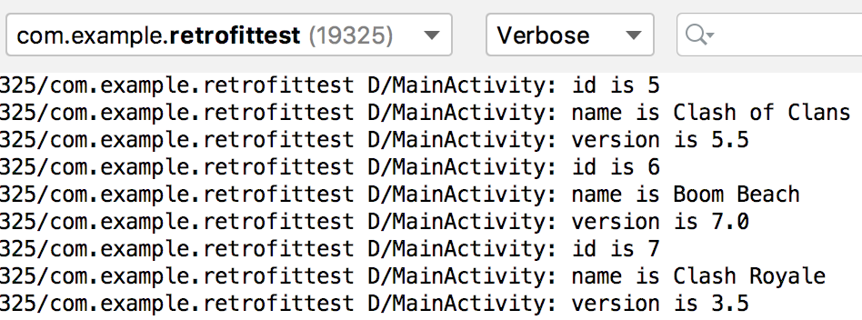

**图 11.10　使用 Retrofit 请求和解析出的数据**

可以看到，服务器响应的数据已经被成功解析出来了，说明我们编写的代码确实已经正常工作了。

以上就是使用 Retrofit 进行网络操作的基本用法。虽然本小节中我们编写的示例程序非常简单，但其实这些都是 Retrofit 用法中最常用且最主要的部分。在了解了基本用法之后，接下来我们就可以去学习一些细节方面的知识了。

### 11.6.2　处理复杂的接口地址类型

在上一小节中，我们通过示例程序向一个非常简单的服务器接口地址发送请求：http://10.0.2.2/get_data.json，然而在真实的开发环境当中，服务器所提供的接口地址不可能一直如此简单。如果你在使用浏览器上网时观察一下浏览器上的网址，你会发现这些网址可能会是千变万化的，那么本小节我们就来学习一下如何使用 Retrofit 来应对这些千变万化的情况。

为了方便举例，这里先定义一个 `Data` 类，并包含 `id` 和 `content` 这两个字段，如下所示：

```Kotlin
class Data(val id: String, val content: String)
```

然后我们先从最简单的看起，比如服务器的接口地址如下所示：

```js
GET http://example.com/get_data.json
```

这是最简单的一种情况，接口地址是静态的，永远不会改变。那么对应到 Retrofit 当中，使用如下的写法即可：

```Kotlin
interface ExampleService {

    @GET("get_data.json")
    fun getData(): Call<Data>

}
```

这也是我们在上一小节中已经学过的部分，理解起来应该非常简单吧。

但是显然服务器不可能总是给我们提供静态类型的接口，在很多场景下，接口地址中的部分内容可能会是动态变化的，比如如下的接口地址：

```js
GET http://example.com/<page>/get_data.json
```

在这个接口当中，`<page>` 部分代表页数，我们传入不同的页数，服务器返回的数据也会不同。这种接口地址对应到 Retrofit 当中应该怎么写呢？其实也很简单，如下所示：

```Kotlin
interface ExampleService {

    @GET("{page}/get_data.json")
    fun getData(@Path("page") page: Int): Call<Data>

}
```

在 `@GET` 注解指定的接口地址当中，这里使用了一个 `{page}` 的占位符，然后又在 `getData()` 方法中添加了一个 `page` 参数，并使用 `@Path("page")` 注解来声明这个参数。这样当调用 `getData()` 方法发起请求时，Retrofit 就会自动将 `page` 参数的值替换到占位符的位置，从而组成一个合法的请求地址。

另外，很多服务器接口还会要求我们传入一系列的参数，格式如下：

```js
GET http://example.com/get_data.json?u=<user>&t=<token>
```

这是一种标准的带参数 `GET` 请求的格式。接口地址的最后使用问号来连接参数部分，每个参数都是一个使用等号连接的键值对，多个参数之间使用“&”符号进行分隔。那么很显然，在上述地址中，服务器要求我们传入 `user` 和 `token` 这两个参数的值。对于这种格式的服务器接口，我们可以使用刚才所学的 `@Path` 注解的方式来解决，但是这样会有些麻烦，Retrofit 针对这种带参数的 `GET` 请求，专门提供了一种语法支持：

```Kotlin
interface ExampleService {

    @GET("get_data.json")
    fun getData(@Query("u") user: String, @Query("t") token: String): Call<Data>

}
```

这里在 `getData()` 方法中添加了 `user` 和 `token` 这两个参数，并使用 `@Query` 注解对它们进行声明。这样当发起网络请求的时候，Retrofit 就会自动按照带参数 `GET` 请求的格式将这两个参数构建到请求地址当中。

学习了以上内容之后，现在你在一定程度上已经可以应对千变万化的服务器接口地址了。不过 HTTP 并不是只有 `GET` 请求这一种类型，而是有很多种，其中比较常用的有 `GET`、`POST`、`PUT`、`PATCH`、`DELETE` 这几种。它们之间的分工也很明确，简单概括的话，`GET` 请求用于从服务器获取数据，`POST` 请求用于向服务器提交数据，`PUT` 和 `PATCH` 请求用于修改服务器上的数据，`DELETE` 请求用于删除服务器上的数据。

而 Retrofit 对所有常用的 HTTP 请求类型都进行了支持，使用 `@GET`、`@POST`、`@PUT`、`@PATCH`、`@DELETE` 注解，就可以让 Retrofit 发出相应类型的请求了。

比如服务器提供了如下接口地址：

```js
DELETE http://example.com/data/<id>
```

这种接口通常意味着要根据 id 删除一条指定的数据，而我们在 Retrofit 当中想要发出这种请求就可以这样写：

```Kotlin
interface ExampleService {

    @DELETE("data/{id}")
    fun deleteData(@Path("id") id: String): Call<ResponseBody>

}
```

这里使用了 `@DELETE` 注解来发出 `DELETE` 类型的请求，并使用了 `@Path` 注解来动态指定 id，这些都很好理解。但是在返回值声明的时候，我们将 `Call` 的泛型指定成了 `ResponseBody`，这是什么意思呢？

由于 `POST`、`PUT` 、`PATCH`、`DELETE` 这几种请求类型与 `GET` 请求不同，它们更多是用于操作服务器上的数据，而不是获取服务器上的数据，所以通常它们对于服务器响应的数据并不关心。这个时候就可以使用 `ResponseBody`，表示 Retrofit 能够接收任意类型的响应数据，并且不会对响应数据进行解析。

那么如果我们需要向服务器提交数据该怎么写呢？比如如下的接口地址：

```js
POST http://example.com/data/create
{"id": 1, "content": "The description for this data."}
```

使用 `POST` 请求来提交数据，需要将数据放到 HTTP 请求的 `body` 部分，这个功能在 Retrofit 中可以借助 `@Body` 注解来完成：

```Kotlin
interface ExampleService {

    @POST("data/create")
    fun createData(@Body data: Data): Call<ResponseBody>

}
```

可以看到，这里我们在 `createData()` 方法中声明了一个 `Data` 类型的参数，并给它加上了 `@Body` 注解。这样当 Retrofit 发出 `POST` 请求时，就会自动将 `Data` 对象中的数据转换成 JSON 格式的文本，并放到 HTTP 请求的 `body` 部分，服务器在收到请求之后只需要从 `body` 中将这部分数据解析出来即可。这种写法同样也可以用来给 `PUT`、`PATCH`、`DELETE` 类型的请求提交数据。

最后，有些服务器接口还可能会要求我们在 HTTP 请求的 `header` 中指定参数，比如：

```js
GET http://example.com/get_data.json
User-Agent: okhttp
Cache-Control: max-age=0
```

这些 `header` 参数其实就是一个个的键值对，我们可以在 Retrofit 中直接使用 `@Headers` 注解来对它们进行声明。

```Kotlin
interface ExampleService {

    @Headers("User-Agent: okhttp", "Cache-Control: max-age=0")
    @GET("get_data.json")
    fun getData(): Call<Data>

}
```

但是这种写法只能进行静态 `header` 声明，如果想要动态指定 `header` 的值，则需要使用 `@Header` 注解，如下所示：

```Kotlin
interface ExampleService {

    @GET("get_data.json")
    fun getData(@Header("User-Agent") userAgent: String,
        @Header("Cache-Control") cacheControl: String): Call<Data>

}
```

现在当发起网络请求的时候，Retrofit 就会自动将参数中传入的值设置到 User-Agent 和 Cache-Control 这两个 `header` 当中，从而实现了动态指定 `header` 值的功能。

好了，这样我们就将使用 Retrofit 处理复杂接口地址类型的内容基本学完了，现在不管服务器给你提供什么样类型的接口，相信你都可以从容面对了吧？

### 11.6.3　Retrofit 构建器的最佳写法

学到这里，其实还有一个问题我们没有正视过，就是获取 `Service` 接口的动态代理对象实在是太麻烦了。先回顾一下之前的写法吧，大致代码如下所示：

```Kotlin
val retrofit = Retrofit.Builder()
    .baseUrl("http://10.0.2.2/")
    .addConverterFactory(GsonConverterFactory.create())
    .build()
val appService = retrofit.create(AppService::class.java)
```

我们想要得到 `AppService` 的动态代理对象，需要先使用 `Retrofit.Builder` 构建出一个 Retrofit 对象，然后再调用 Retrofit 对象的 `create()` 方法创建动态代理对象。如果只是写一次还好，每次调用任何服务器接口时都要这样写一遍的话，肯定没有人能受得了。

事实上，确实也没有每次都写一遍的必要，因为构建出的 Retrofit 对象是全局通用的，只需要在调用 `create()` 方法时针对不同的 `Service` 接口传入相应的 `Class` 类型即可。因此，我们可以将通用的这部分功能封装起来，从而简化获取 `Service` 接口动态代理对象的过程。

新建一个 `ServiceCreator` 单例类，代码如下所示：

```Kotlin
object ServiceCreator {

    private const val BASE_URL = "http://10.0.2.2/"

    private val retrofit = Retrofit.Builder()
        .baseUrl(BASE_URL)
        .addConverterFactory(GsonConverterFactory.create())
        .build()

    fun <T> create(serviceClass: Class<T>): T = retrofit.create(serviceClass)

}
```

这里我们使用 `object` 关键字让 `ServiceCreator` 成为了一个单例类，并在它的内部定义了一个 `BASE_URL` 常量，用于指定 Retrofit 的根路径。然后同样是在内部使用 `Retrofit.Builder` 构建一个 Retrofit 对象，注意这些都是用 `private` 修饰符来声明的，相当于对于外部而言它们都是不可见的。

最后，我们提供了一个外部可见的 `create()` 方法，并接收一个 `Class` 类型的参数。当在外部调用这个方法时，实际上就是调用了 Retrofit 对象的 `create()` 方法，从而创建出相应 `Service` 接口的动态代理对象。

经过这样的封装之后，Retrofit 的用法将会变得异常简单，比如我们想获取一个 `AppService` 接口的动态代理对象，只需要使用如下写法即可：

```Kotlin
val appService = ServiceCreator.create(AppService::class.java)
```

之后就可以随意调用 `AppService` 接口中定义的任何方法了。

不过上述代码其实仍然还有优化空间，还记得我们在上一章的 Kotlin 课堂中学习的泛型实化功能吗？这里立马就可以应用起来了。修改 `ServiceCreator` 中的代码，如下所示：

```Kotlin
object ServiceCreator {
    ...
    inline fun <reified T> create(): T = create(T::class.java)
}
```

可以看到，我们又定义了一个不带参数的 `create()` 方法，并使用 `inline` 关键字来修饰方法，使用 `reified` 关键字来修饰泛型，这是泛型实化的两大前提条件。接下来就可以使用 `T::class.java` 这种语法了，这里调用刚才定义的带有 `Class` 参数的 `create()` 方法即可。

那么现在我们就又有了一种新的方式来获取 `AppService` 接口的动态代理对象，如下所示：

```Kotlin
val appService = ServiceCreator.create<AppService>()
```

代码是不是变得更加简洁了？

好了，关于 Retrofit 的使用就先讲到这里，我们会在第 15 章的实战环节学习如何在实际的项目当中应用 Retrofit。那么接下来，又该进入本章的 Kotlin 课堂了，这次我们来学习一项特别神奇的技术——协程。

## 11.7　Kotlin 课堂：使用协程编写高效的并发程序

协程属于 Kotlin 中非常有特色的一项技术，因为大部分编程语言中是没有协程这个概念的。

那么什么是协程呢？它其实和线程是有点类似的，可以简单地将它理解成一种轻量级的线程。要知道，我们之前所学习的线程是非常重量级的，它需要依靠操作系统的调度才能实现不同线程之间的切换。而使用协程却可以仅在编程语言的层面就能实现不同协程之间的切换，从而大大提升了并发编程的运行效率。

举一个具体点的例子，比如我们有如下 `foo()` 和 `bar()` 两个方法：

```Kotlin
fun foo() {
    a()
    b()
    c()
}

fun bar() {
    x()
    y()
    z()
}
```

在没有开启线程的情况下，先后调用 `foo()` 和 `bar()` 这两个方法，那么理论上结果一定是 `a()`、`b()`、`c()` 执行完了以后，`x()`、`y()`、`z()` 才能够得到执行。而如果使用了协程，在协程 A 中去调用 `foo()` 方法，协程 B 中去调用 `bar()` 方法，虽然它们仍然会运行在同一个线程当中，但是在执行 `foo()` 方法时随时都有可能被挂起转而去执行 `bar()` 方法，执行 `bar()` 方法时也随时都有可能被挂起转而继续执行 `foo()` 方法，最终的输出结果也就变得不确定了。

可以看出，协程允许我们在单线程模式下模拟多线程编程的效果，代码执行时的挂起与恢复完全是由编程语言来控制的，和操作系统无关。这种特性使得高并发程序的运行效率得到了极大的提升，试想一下，开启 10 万个线程完全是不可想象的事吧？而开启 10 万个协程就是完全可行的，待会我们就会对这个功能进行验证。

现在你已经了解了协程的一些基本概念，那么接下来我们就开始学习 Kotlin 中协程的用法。

### 11.7.1　协程的基本用法

Kotlin 并没有将协程纳入标准库的 API 当中，而是以依赖库的形式提供的。所以如果我们想要使用协程功能，需要先在 app/build.gradle 文件当中添加如下依赖库：

```gradle
dependencies {
  ...
  implementation "org.jetbrains.kotlinx:kotlinx-coroutines-core:1.1.1"
  implementation "org.jetbrains.kotlinx:kotlinx-coroutines-android:1.1.1"
}
```

第二个依赖库是在 Android 项目中才会用到的，本节我们编写的代码示例都是纯 Kotlin 程序，所以其实用不到第二个依赖库。但为了下次在 Android 项目中使用协程时不再单独进行说明，这里就一同引入进来了。

接下来创建一个 CoroutinesTest.kt 文件，并定义一个 `main()` 函数，然后开始我们的协程之旅吧。

首先我们要面临的第一个问题就是，如何开启一个协程？最简单的方式就是使用 `Global.launch` 函数，如下所示：

```Kotlin
fun main() {
    GlobalScope.launch {
        println("codes run in coroutine scope")
    }
}
```

`GlobalScope.launch` 函数可以创建一个协程的作用域，这样传递给 `launch` 函数的代码块（Lambda 表达式）就是在协程中运行的了，这里我们只是在代码块中打印了一行日志。那么现在运行 `main()` 函数，日志能成功打印出来吗？如果你尝试一下，会发现没有任何日志输出。

这是因为，`Global.launch` 函数每次创建的都是一个顶层协程，这种协程当应用程序运行结束时也会跟着一起结束。刚才的日志之所以无法打印出来，就是因为代码块中的代码还没来得及运行，应用程序就结束了。

要解决这个问题也很简单，我们让程序延迟一段时间再结束就行了，如下所示：

```Kotlin
fun main() {
    GlobalScope.launch {
        println("codes run in coroutine scope")
    }
    Thread.sleep(1000)
}
```

这里使用 `Thread.sleep()` 方法让主线程阻塞 1 秒钟，现在重新运行程序，你会发现日志可以正常打印出来了，如图 11.11 所示。


**图 11.11　在协程中打印日志**

可是这种写法还是存在问题，如果代码块中的代码在 1 秒钟之内不能运行结束，那么就会被强制中断。观察如下代码：

```Kotlin
fun main() {
    GlobalScope.launch {
        println("codes run in coroutine scope")
        delay(1500)
        println("codes run in coroutine scope finished")
    }
    Thread.sleep(1000)
}
```

我们在代码块中加入了一个 `delay()` 函数，并在之后又打印了一行日志。`delay()` 函数可以让当前协程延迟指定时间后再运行，但它和 `Thread.sleep()` 方法不同。`delay()` 函数是一个非阻塞式的挂起函数，它只会挂起当前协程，并不会影响其他协程的运行。而 `Thread.sleep()` 方法会阻塞当前的线程，这样运行在该线程下的所有协程都会被阻塞。注意，`delay()` 函数只能在协程的作用域或其他挂起函数中调用。

这里我们让协程挂起 1.5 秒，但是主线程却只阻塞了 1 秒，最终会是什么结果呢？重新运行程序，你会发现代码块中新增的一条日志并没有打印出来，因为它还没能来得及运行，应用程序就已经结束了。

那么有没有什么办法能让应用程序在协程中所有代码都运行完了之后再结束呢？当然也是有的，借助 `runBlocking` 函数就可以实现这个功能：

```Kotlin
fun main() {
    runBlocking {
        println("codes run in coroutine scope")
        delay(1500)
        println("codes run in coroutine scope finished")
    }
}
```

`runBlocking` 函数同样会创建一个协程的作用域，但是它可以保证在协程作用域内的所有代码和子协程没有全部执行完之前一直阻塞当前线程。需要注意的是，`runBlocking` 函数通常只应该在测试环境下使用，在正式环境中使用容易产生一些性能上的问题。

现在重新运行程序，结果如图 11.12 所示。

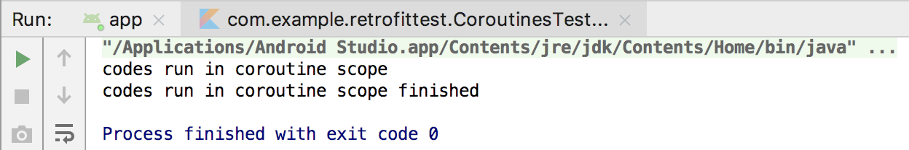

**图 11.12** **`runBlocking`** **函数的运行效果**

可以看到，两条日志都能够正常打印出来了。

虽说现在我们已经能够让代码在协程中运行了，可是好像并没有体会到什么特别的好处。这是因为目前所有的代码都是运行在同一个协程当中的，而一旦涉及高并发的应用场景，协程相比于线程的优势就能体现出来了。

那么如何才能创建多个协程呢？很简单，使用 `launch` 函数就可以了，如下所示：

```Kotlin
fun main() {
    runBlocking {
        launch {
            println("launch1")
            delay(1000)
            println("launch1 finished")
        }
        launch {
            println("launch2")
            delay(1000)
            println("launch2 finished")
        }
    }
}
```

注意这里的 `launch` 函数和我们刚才所使用的 `GlobalScope.launch` 函数不同。首先它必须在协程的作用域中才能调用，其次它会在当前协程的作用域下创建子协程。子协程的特点是如果外层作用域的协程结束了，该作用域下的所有子协程也会一同结束。相比而言，`GlobalScope.launch` 函数创建的永远是顶层协程，这一点和线程比较像，因为线程也没有层级这一说，永远都是顶层的。

这里我们调用了两次 `launch` 函数，也就是创建了两个子协程。重新运行程序，结果如图 11.13 所示。

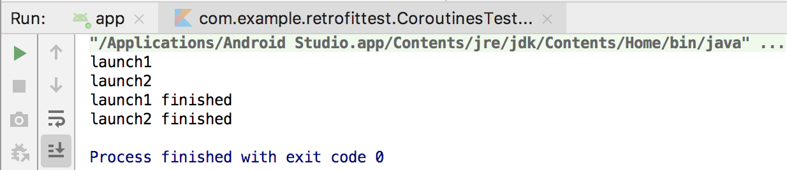

**图 11.13　多个协程并发运行的效果**

可以看到，两个子协程中的日志是交替打印的，说明它们确实是像多线程那样并发运行的。然而这两个子协程实际却运行在同一个线程当中，只是由编程语言来决定如何在多个协程之间进行调度，让谁运行，让谁挂起。调度的过程完全不需要操作系统参与，这也就使得协程的并发效率会出奇得高。

那么具体会有多高呢？我们来做下实验就知道了，代码如下所示：

```Kotlin
fun main() {
    val start = System.currentTimeMillis()
    runBlocking {
        repeat(100000) {
            launch {
                println(".")
            }
        }
    }
    val end = System.currentTimeMillis()
    println(end - start)
}
```

这里使用 `repeat` 函数循环创建了 10 万个协程，不过在协程当中并没有进行什么有意义的操作，只是象征性地打印了一个点，然后记录一下整个操作的运行耗时。现在重新运行一下程序，结果如图 11.14 所示。


**图 11.14　10 万个协程并发的运行效率**

可以看到，这里仅仅耗时了 961 毫秒，这足以证明协程有多么高效。试想一下，如果开启的是 10 万个线程，程序或许已经出现 OOM 异常了。

不过，随着 `launch` 函数中的逻辑越来越复杂，可能你需要将部分代码提取到一个单独的函数中。这个时候就产生了一个问题：我们在 `launch` 函数中编写的代码是拥有协程作用域的，但是提取到一个单独的函数中就没有协程作用域了，那么我们该如何调用像 `delay()` 这样的挂起函数呢？

为此 Kotlin 提供了一个 `suspend` 关键字，使用它可以将任意函数声明成挂起函数，而挂起函数之间都是可以互相调用的，如下所示：

```Kotlin
suspend fun printDot() {
    println(".")
    delay(1000)
}
```

这样就可以在 `printDot()` 函数中调用 `delay()` 函数了。

但是，`suspend` 关键字只能将一个函数声明成挂起函数，是无法给它提供协程作用域的。比如你现在尝试在 `printDot()` 函数中调用 `launch` 函数，一定是无法调用成功的，因为 `launch` 函数要求必须在协程作用域当中才能调用。

这个问题可以借助 `coroutineScope` 函数来解决。`coroutineScope` 函数也是一个挂起函数，因此可以在任何其他挂起函数中调用。它的特点是会继承外部的协程的作用域并创建一个子协程，借助这个特性，我们就可以给任意挂起函数提供协程作用域了。示例写法如下：

```Kotlin
suspend fun printDot() = coroutineScope {
    launch {
        println(".")
        delay(1000)
    }
}
```

可以看到，现在我们就可以在 `printDot()` 这个挂起函数中调用 `launch` 函数了。

另外，`coroutineScope` 函数和 `runBlocking` 函数还有点类似，它可以保证其作用域内的所有代码和子协程在全部执行完之前，外部的协程会一直被挂起。我们来看如下示例代码：

```Kotlin
fun main() {
    runBlocking {
        coroutineScope {
            launch {
                for (i in 1..10) {
                    println(i)
                    delay(1000)
                }
            }
        }
        println("coroutineScope finished")
    }
    println("runBlocking finished")
}
```

这里先使用 `runBlocking` 函数创建了一个协程作用域，然后调用 `coroutineScope` 函数创建了一个子协程。在 `coroutineScope` 的作用域中，我们又调用 `launch` 函数创建了一个子协程，并通过 `for` 循环依次打印数字 1 到 10，每次打印间隔一秒钟。最后在 `runBlocking` 和 `coroutineScope` 函数的结尾，分别又打印了一行日志。现在重新运行一下程序，结果如图 11.15 所示。

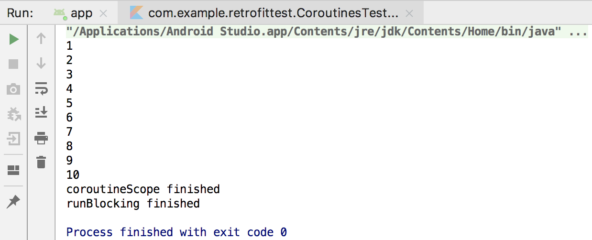

**图 11.15　coroutineScope 函数的运行效果**

你会看到，控制台会以 1 秒钟的间隔依次输出数字 1 到 10，然后才会打印 `coroutineScope` 函数结尾的日志，最后打印 `runBlocking` 函数结尾的日志。

由此可见，`coroutineScope` 函数确实是将外部协程挂起了，只有当它作用域内的所有代码和子协程都执行完毕之后，`coroutineScope` 函数之后的代码才能得到运行。

虽然看上去 `coroutineScope` 函数和 `runBlocking` 函数的作用是有点类似的，但是 `coroutineScope` 函数只会阻塞当前协程，既不影响其他协程，也不影响任何线程，因此是不会造成任何性能上的问题的。而 `runBlocking` 函数由于会挂起外部线程，如果你恰好又在主线程中当中调用它的话，那么就有可能会导致界面卡死的情况，所以不太推荐在实际项目中使用。

好了，现在我们就将协程的基本用法都学习完了，你也算是已经成功入门了。那么接下来，就让我们开始学习协程更多的知识吧。

### 11.7.2　更多的作用域构建器

在上一小节中，我们学习了 `GlobalScope.launch`、`runBlocking`、`launch`、`coroutineScope` 这几种作用域构建器，它们都可以用于创建一个新的协程作用域。不过 `GlobalScope.launch` 和 `runBlocking` 函数是可以在任意地方调用的，`coroutineScope` 函数可以在协程作用域或挂起函数中调用，而 `launch` 函数只能在协程作用域中调用。

前面已经说了，`runBlocking` 由于会阻塞线程，因此只建议在测试环境下使用。而 `GlobalScope.launch` 由于每次创建的都是顶层协程，一般也不太建议使用，除非你非常明确就是要创建顶层协程。

为什么说不太建议使用顶层协程呢？主要还是因为它管理起来成本太高了。举个例子，比如我们在某个 Activity 中使用协程发起了一条网络请求，由于网络请求是耗时的，用户在服务器还没来得及响应的情况下就关闭了当前 Activity，此时按理说应该取消这条网络请求，或者至少不应该进行回调，因为 Activity 已经不存在了，回调了也没有意义。

那么协程要怎样取消呢？不管是 `GlobalScope.launch` 函数还是 `launch` 函数，它们都会返回一个 `Job` 对象，只需要调用 `Job` 对象的 `cancel()` 方法就可以取消协程了，如下所示：

```Kotlin
val job = GlobalScope.launch {
    // 处理具体的逻辑
}
job.cancel()
```

但是如果我们每次创建的都是顶层协程，那么当 Activity 关闭时，就需要逐个调用所有已创建协程的 `cancel()` 方法，试想一下，这样的代码是不是根本无法维护？

因此，`GlobalScope.launch` 这种协程作用域构建器，在实际项目中也是不太常用的。下面我来演示一下实际项目中比较常用的写法：

```Kotlin
val job = Job()
val scope = CoroutineScope(job)
scope.launch {
    // 处理具体的逻辑
}
job.cancel()
```

可以看到，我们先创建了一个 `Job` 对象，然后把它传入 `CoroutineScope()` 函数当中，注意这里的 `CoroutineScope()` 是个函数，虽然它的命名更像是一个类。`CoroutineScope()` 函数会返回一个 `CoroutineScope` 对象，这种语法结构的设计更像是我们创建了一个 `CoroutineScope` 的实例，可能也是 Kotlin 有意为之的。有了 `CoroutineScope` 对象之后，就可以随时调用它的 `launch` 函数来创建一个协程了。

现在所有调用 `CoroutineScope` 的 `launch` 函数所创建的协程，都会被关联在 `Job` 对象的作用域下面。这样只需要调用一次 `cancel()` 方法，就可以将同一作用域内的所有协程全部取消，从而大大降低了协程管理的成本。

不过相比之下，`CoroutineScope()` 函数更适合用于实际项目当中，如果只是在 `main()` 函数中编写一些学习测试用的代码，还是使用 `runBlocking` 函数最为方便。

协程的内容确实比较多，下面我们还要继续学习。你已经知道了调用 `launch` 函数可以创建一个新的协程，但是 `launch` 函数只能用于执行一段逻辑，却不能获取执行的结果，因为它的返回值永远是一个 `Job` 对象。那么有没有什么办法能够创建一个协程并获取它的执行结果呢？当然有，使用 `async` 函数就可以实现。

`async` 函数必须在协程作用域当中才能调用，它会创建一个新的子协程并返回一个 `Deferred` 对象，如果我们想要获取 `async` 函数代码块的执行结果，只需要调用 `Deferred` 对象的 `await()` 方法即可，代码如下所示：

```Kotlin
fun main() {
    runBlocking {
        val result = async {
            5 + 5
        }.await()
        println(result)
    }
}
```

这里我们在 `async` 函数的代码块中进行了一个简单的数学运算，然后调用 `await()` 方法获取运算结果，最终将结果打印出来。重新运行一下代码，结果如图 11.16 所示。

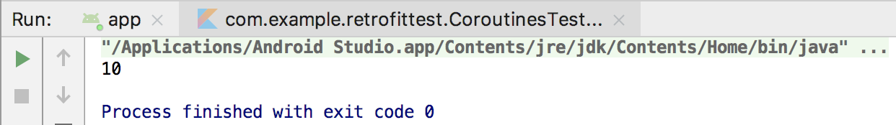

**图 11.16　打印** **`async`** **函数的执行结果**

不过 `async` 函数的奥秘还不止于此。事实上，在调用了 `async` 函数之后，代码块中的代码就会立刻开始执行。当调用 `await()` 方法时，如果代码块中的代码还没执行完，那么 `await()` 方法会将当前协程阻塞住，直到可以获得 `async` 函数的执行结果。

为了证实这一点，我们编写如下代码进行验证：

```Kotlin
fun main() {
    runBlocking {
        val start = System.currentTimeMillis()
        val result1 = async {
            delay(1000)
            5 + 5
        }.await()
        val result2 = async {
            delay(1000)
            4 + 6
        }.await()
        println("result is ${result1 + result2}.")
        val end = System.currentTimeMillis()
        println("cost ${end - start} ms.")
    }
}
```

这里连续使用了两个 `async` 函数来执行任务，并在代码块中调用 `delay()` 方法进行 1 秒的延迟。按照刚才的理论，`await()` 方法在 `async` 函数代码块中的代码执行完之前会一直将当前协程阻塞住，那么为了便于验证，我们记录了代码的运行耗时。现在重新运行程序，结果如图 11.17 所示。

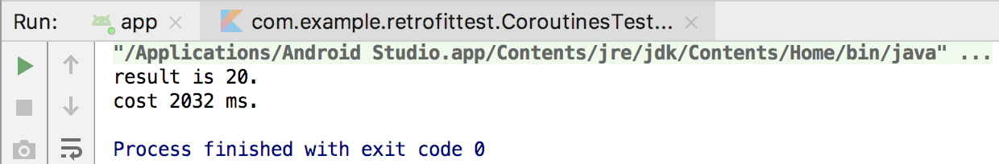

**图 11.17** **`async`** **函数串行运行耗时**

可以看到，整段代码的运行耗时是 2032 毫秒，说明这里的两个 `async` 函数确实是一种串行的关系，前一个执行完了后一个才能执行。

但是这种写法明显是非常低效的，因为两个 `async` 函数完全可以同时执行从而提高运行效率。现在对上述代码使用如下的写法进行修改：

```Kotlin
fun main() {
    runBlocking {
        val start = System.currentTimeMillis()
        val deferred1 = async {
            delay(1000)
            5 + 5
        }
        val deferred2 = async {
            delay(1000)
            4 + 6
        }
        println("result is ${deferred1.await() + deferred2.await()}.")
        val end = System.currentTimeMillis()
        println("cost ${end - start} milliseconds.")
    }
}
```

现在我们不在每次调用 `async` 函数之后就立刻使用 `await()` 方法获取结果了，而是仅在需要用到 `async` 函数的执行结果时才调用 `await()` 方法进行获取，这样两个 `async` 函数就变成一种并行关系了。重新运行程序，结果如图 11.18 所示。

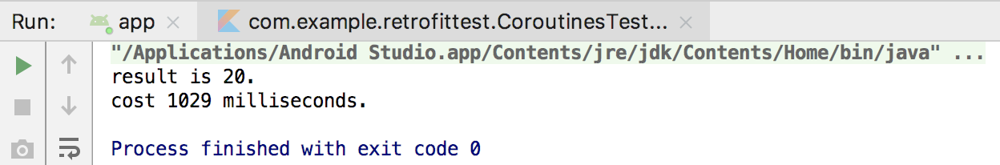

**图 11.18** **`async`** **函数并行运行耗时**

可以看到，现在整段代码的运行耗时变成了 1029 毫秒，运行效率的提升显而易见。

最后，我们再来学习一个比较特殊的作用域构建器：`withContext()` 函数。`withContext()` 函数是一个挂起函数，大体可以将它理解成 `async` 函数的一种简化版写法，示例写法如下：

```Kotlin
fun main() {
    runBlocking {
        val result = withContext(Dispatchers.Default) {
            5 + 5
        }
        println(result)
    }
}
```

我来解释一下这段代码。调用 `withContext()` 函数之后，会立即执行代码块中的代码，同时将外部协程挂起。当代码块中的代码全部执行完之后，会将最后一行的执行结果作为 `withContext()` 函数的返回值返回，因此基本上相当于 `val result = async{ 5 + 5 }.await()` 的写法。唯一不同的是，`withContext()` 函数强制要求我们指定一个线程参数，关于这个参数我准备好好讲一讲。

你已经知道，协程是一种轻量级的线程的概念，因此很多传统编程情况下需要开启多线程执行的并发任务，现在只需要在一个线程下开启多个协程来执行就可以了。但是这并不意味着我们就永远不需要开启线程了，比如说 Android 中要求网络请求必须在子线程中进行，即使你开启了协程去执行网络请求，假如它是主线程当中的协程，那么程序仍然会出错。这个时候我们就应该通过线程参数给协程指定一个具体的运行线程。

线程参数主要有以下 3 种值可选：`Dispatchers.Default`、`Dispatchers.IO` 和 `Dispatchers.Main`。`Dispatchers.Default` 表示会使用一种默认低并发的线程策略，当你要执行的代码属于计算密集型任务时，开启过高的并发反而可能会影响任务的运行效率，此时就可以使用 `Dispatchers.Default`。`Dispatchers.IO` 表示会使用一种较高并发的线程策略，当你要执行的代码大多数时间是在阻塞和等待中，比如说执行网络请求时，为了能够支持更高的并发数量，此时就可以使用 `Dispatchers.IO`。`Dispatchers.Main` 则表示不会开启子线程，而是在 Android 主线程中执行代码，但是这个值只能在 Android 项目中使用，纯 Kotlin 程序使用这种类型的线程参数会出现错误。

事实上，在我们刚才所学的协程作用域构建器中，除了 `coroutineScope` 函数之外，其他所有的函数都是可以指定这样一个线程参数的，只不过 `withContext()` 函数是强制要求指定的，而其他函数则是可选的。

到目前为止，你已经掌握了协程中最常用的一些用法，并且了解了协程的主要用途就是可以大幅度地提升并发编程的运行效率。但实际上，Kotlin 中的协程还可以对传统回调的写法进行优化，从而让代码变得更加简洁，那么接下来我们就开始学习这部分的内容。

### 11.7.3　使用协程简化回调的写法

在 11.5 节，我们学习了编程语言的回调机制，并使用这个机制实现了获取异步网络请求数据响应的功能。不知道你有没有发现，回调机制基本上是依靠匿名类来实现的，但是匿名类的写法通常比较烦琐，比如如下代码：

```Kotlin
HttpUtil.sendHttpRequest(address, object : HttpCallbackListener {
    override fun onFinish(response: String) {
        // 得到服务器返回的具体内容
    }

    override fun onError(e: Exception) {
        // 在这里对异常情况进行处理
    }
})
```

在多少个地方发起网络请求，就需要编写多少次这样的匿名类实现。这不禁引起了我们的思考，有没有更加简单一点的写法呢？

在过去，可能确实没有什么更加简单的写法了。不过现在，Kotlin 的协程使我们的这种设想成为了可能，只需要借助 `suspendCoroutine` 函数就能将传统回调机制的写法大幅简化，下面我们就来具体学习一下。

`suspendCoroutine` 函数必须在协程作用域或挂起函数中才能调用，它接收一个 Lambda 表达式参数，主要作用是将当前协程立即挂起，然后在一个普通的线程中执行 Lambda 表达式中的代码。Lambda 表达式的参数列表上会传入一个 `Continuation` 参数，调用它的 `resume()` 方法或 `resumeWithException()` 可以让协程恢复执行。

了解了 `suspendCoroutine` 函数的作用之后，接下来我们就可以借助这个函数来对传统的回调写法进行优化。首先定义一个 `request()` 函数，代码如下所示：

```Kotlin
suspend fun request(address: String): String {
    return suspendCoroutine { continuation ->
        HttpUtil.sendHttpRequest(address, object : HttpCallbackListener {
            override fun onFinish(response: String) {
                continuation.resume(response)
            }

            override fun onError(e: Exception) {
                continuation.resumeWithException(e)
            }
        })
    }
}
```

可以看到，`request()` 函数是一个挂起函数，并且接收一个 `address` 参数。在 `request()` 函数的内部，我们调用了刚刚介绍的 `suspendCoroutine` 函数，这样当前协程就会被立刻挂起，而 Lambda 表达式中的代码则会在普通线程中执行。接着我们在 Lambda 表达式中调用 `HttpUtil.sendHttpRequest()` 方法发起网络请求，并通过传统回调的方式监听请求结果。如果请求成功就调用 `Continuation` 的 `resume()` 方法恢复被挂起的协程，并传入服务器响应的数据，该值会成为 `suspendCoroutine` 函数的返回值。如果请求失败，就调用 `Continuation` 的 `resumeWithException()` 恢复被挂起的协程，并传入具体的异常原因。

你可能会说，这里不是仍然使用了传统回调的写法吗？代码怎么就变得更加简化了？这是因为，不管之后我们要发起多少次网络请求，都不需要再重复进行回调实现了。比如说获取百度首页的响应数据，就可以这样写：

```Kotlin
suspend fun getBaiduResponse() {
    try {
        val response = request("https://www.baidu.com/")
        // 对服务器响应的数据进行处理
    } catch (e: Exception) {
        // 对异常情况进行处理
    }
}
```

怎么样，有没有觉得代码变得清爽了很多呢？由于 `getBaiduResponse()` 是一个挂起函数，因此当它调用了 `request()` 函数时，当前的协程就会被立刻挂起，然后一直等待网络请求成功或失败后，当前协程才能恢复运行。这样即使不使用回调的写法，我们也能够获得异步网络请求的响应数据，而如果请求失败，则会直接进入 `catch` 语句当中。

不过这里你可能又会产生新的疑惑，`getBaiduResponse()` 函数被声明成了挂起函数，这样它也只能在协程作用域或其他挂起函数中调用了，使用起来是不是非常有局限性？确实如此，因为 `suspendCoroutine` 函数本身就是要结合协程一起使用的。不过通过合理的项目架构设计，我们可以轻松地将各种协程的代码应用到一个普通的项目当中，在第 15 章的项目实战环节你将会学到这部分知识。

事实上，`suspendCoroutine` 函数几乎可以用于简化任何回调的写法，比如之前使用 Retrofit 来发起网络请求需要这样写：

```Kotlin
val appService = ServiceCreator.create<AppService>()
appService.getAppData().enqueue(object : Callback<List<App>> {
    override fun onResponse(call: Call<List<App>>, response: Response<List<App>>) {
        // 得到服务器返回的数据
    }

    override fun onFailure(call: Call<List<App>>, t: Throwable) {
        // 在这里对异常情况进行处理
    }
})
```

有没有觉得这里回调的写法也是相当烦琐的？不用担心，使用 `suspendCoroutine` 函数，我们马上就能对上述写法进行大幅度的简化。

由于不同的 `Service` 接口返回的数据类型也不同，所以这次我们不能像刚才那样针对具体的类型进行编程了，而是要使用泛型的方式。定义一个 `await()` 函数，代码如下所示：

```Kotlin
suspend fun <T> Call<T>.await(): T {
    return suspendCoroutine { continuation ->
        enqueue(object : Callback<T> {
            override fun onResponse(call: Call<T>, response: Response<T>) {
                val body = response.body()
                if (body != null) continuation.resume(body)
                else continuation.resumeWithException(
                    RuntimeException("response body is null"))
            }

            override fun onFailure(call: Call<T>, t: Throwable) {
                continuation.resumeWithException(t)
            }
        })
    }
}
```

这段代码相比于刚才的 `request()` 函数又复杂了一点。首先 `await()` 函数仍然是一个挂起函数，然后我们给它声明了一个泛型 `T`，并将 `await()` 函数定义成了 `Call<T>` 的扩展函数，这样所有返回值是 `Call` 类型的 Retrofit 网络请求接口就都可以直接调用 `await()` 函数了。

接着，`await()` 函数中使用了 `suspendCoroutine` 函数来挂起当前协程，并且由于扩展函数的原因，我们现在拥有了 `Call` 对象的上下文，那么这里就可以直接调用 `enqueue()` 方法让 Retrofit 发起网络请求。接下来，使用同样的方式对 Retrofit 响应的数据或者网络请求失败的情况进行处理就可以了。另外还有一点需要注意，在 `onResponse()` 回调当中，我们调用 `body()` 方法解析出来的对象是可能为空的。如果为空的话，这里的做法是手动抛出一个异常，你也可以根据自己的逻辑进行更加合适的处理。

有了 `await()` 函数之后，我们调用所有 Retrofit 的 `Service` 接口都会变得极其简单，比如刚才同样的功能就可以使用如下写法进行实现：

```Kotlin
suspend fun getAppData() {
    try {
        val appList = ServiceCreator.create<AppService>().getAppData().await()
        // 对服务器响应的数据进行处理
    } catch (e: Exception) {
        // 对异常情况进行处理
    }
}
```

没有了冗长的匿名类实现，只需要简单调用一下 `await()` 函数就可以让 Retrofit 发起网络请求，并直接获得服务器响应的数据，有没有觉得代码变得极其简单？当然你可能会觉得，每次发起网络请求都要进行一次 try catch 处理也比较麻烦，其实这里我们也可以选择不处理。在不处理的情况下，如果发生了异常就会一层层向上抛出，一直到被某一层的函数处理了为止。因此，我们也可以在某个统一的入口函数中只进行一次 try catch，从而让代码变得更加精简。

关于 Kotlin 的协程，你已经掌握了足够多的理论知识，下一步就是将它应用到实际的 Android 项目当中了。不用着急，我们将会在第 15 章中学习这部分内容，现在先回顾一下本章所学的所有知识吧。

## 11.8　小结与点评

本章中我们主要学习了在 Android 中使用 HTTP 来进行网络交互的知识，虽然 Android 中支持的网络通信协议有很多种，但 HTTP 无疑是最常用的一种。通常我们有两种方式来发送 HTTP 请求，分别是 HttpURLConnection 和 OkHttp，相信这两种方式你都已经很好地掌握了。

接着我们又学习了 XML 和 JSON 格式数据的解析方式，因为服务器响应给我们的数据基本属于这两种格式。无论是 XML 还是 JSON，它们各自又拥有多种解析方式，这里我们学习了最常用的几种，相信已经足够应对你日常的工作需求了。

之后我们又学习了编程语言的回调机制以及 Retrofit 的用法，其中 Retrofit 已经几乎成为了所有 Android 项目首选的网络库，使用率非常高，你一定要牢牢掌握它的用法。

在本章的 Kotlin 课堂中，我们学习了一项非常特殊的技术：协程。或许你在之前并没有听说过这个概念，或者不清楚协程的具体作用是什么，那么通过本节课的学习，相信你对协程已经能有一个比较全面的了解了。

关于 Android 网络编程部分的内容就讲到这里，下一章我们将学习一项能让应用界面变得更加好看的技术——Material Design。