# 第 12 章　最佳的 UI 体验，Material Design 实战

其实长久以来，大多数人可能会认为 Android 系统的 UI 并不算美观，至少没有 iOS 系统的美观。以至于很多 IT 公司在进行应用界面设计的时候，为了保证双平台的统一性，强制要求 Android 端的界面风格必须和 iOS 端一致。这种情况在现实工作当中实在是太常见了，虽然我认为这是非常不合理的。因为对于一般用户来说，他们不太可能会在两个操作系统上分别使用同一个应用，但是必定会在同一个操作系统上使用不同的应用。因此，同一个操作系统中各个应用之间的界面统一性要远比一个应用在双平台的界面统一性重要得多。

但是 Android 标准的界面设计风格并不是特别被大众所接受，很多公司觉得自己可以设计出更加好看的界面，从而导致 Android 平台的界面风格长期难以得到统一。为了解决这个问题，Google 也是使出了杀手锏，在 2014 年 Google I/O 大会上重磅推出了一套全新的界面设计语言——Material Design。

本章我们就将对 Material Design 进行一次深入的学习。

## 12.1　什么是 Material Design

Material Design 是由 Google 的设计工程师们基于传统优秀的设计原则，结合丰富的创意和科学技术所开发的一套全新的界面设计语言，包含了视觉、运动、互动效果等特性。那么 Google 凭什么认为 Material Design 就能解决 Android 平台界面风格不统一的问题呢？一言以蔽之，好看！

为了做出表率，Google 从 Android 5.0 系统开始，就将所有内置的应用都使用 Material Design 风格进行设计。图 12.1 是我截取的两张图，你可以先欣赏一下。


**图 12.1　使用 Material Design 设计的应用**

其中，左边的应用是 Play Store，右边的应用是 YouTube。可以看出，它们的界面都十分美观，而它们都是使用 Material Design 进行设计的。

不过，在重磅推出之后，Material Design 的普及程度却不是特别理想。因为这只是一个推荐的设计规范，主要是面向 UI 设计人员的，而不是面向开发者的。很多开发者可能根本就搞不清楚什么样的界面和效果才叫 Material Design，就算搞清楚了，实现起来也会很费劲，因为不少 Material Design 的效果是很难实现的，而 Android 中几乎没有提供相应的 API 支持，基本需要靠开发者自己从零写起。

Google 当然意识到了这个问题，于是在 2015 年的 Google I/O 大会上推出了一个 Design Support 库，这个库将 Material Design 中最具代表性的一些控件和效果进行了封装，使得开发者即使在不了解 Material Design 的情况下，也能非常轻松地将自己的应用 Material 化。后来 Design Support 库又改名成了 Material 库，用于给 Google 全平台类的产品提供 Material Design 的支持。本章我们就将对 Material 库进行深入的学习，并且配合 AndroidX 库中的一些控件来完成一个优秀的 Material Design 应用。

新建一个 MaterialTest 项目，然后我们马上开始吧！

## 12.2　Toolbar

Toolbar 将会是我们本章接触的第一个控件，是由 AndroidX 库提供的。虽说对于 Toolbar 你暂时应该还是比较陌生的，但是对于它的另一个相关控件 ActionBar，你就应该有点熟悉了。

回忆一下，我们曾经在 4.4.1 小节为了使用一个自定义的标题栏，而隐藏了系统原生的 ActionBar。没错，每个 Activity 最顶部的那个标题栏其实就是 ActionBar，之前我们编写的所有程序里一直都有它的身影。

不过 ActionBar 由于其设计的原因，被限定只能位于 Activity 的顶部，从而不能实现一些 Material Design 的效果，因此官方现在已经不再建议使用 ActionBar 了。那么本书中我也就不准备再介绍 ActionBar 的用法了，而是直接讲解现在更加推荐使用的 Toolbar。

Toolbar 的强大之处在于，它不仅继承了 ActionBar 的所有功能，而且灵活性很高，可以配合其他控件完成一些 Material Design 的效果，下面我们就来具体学习一下。

首先你要知道，任何一个新建的项目，默认都是会显示 ActionBar 的，这个想必你已经见识过太多次了。那么这个 ActionBar 到底是从哪里来的呢？其实这是根据项目中指定的主题来显示的。打开 AndroidManifest.xml 文件看一下，如下所示：

```xml
<application
    android:allowBackup="true"
    android:icon="@mipmap/ic_launcher"
    android:label="@string/app_name"
    android:roundIcon="@mipmap/ic_launcher_round"
    android:supportsRtl="true"
    android:theme="@style/AppTheme">
    ...
</application>
```

可以看到，这里使用 `android:theme` 属性指定了一个 AppTheme 的主题。那么这个 AppTheme 又是在哪里定义的呢？打开 res/values/styles.xml 文件，代码如下所示：

```xml
<resources>

    <!-- Base application theme. -->
    <style name="AppTheme" parent="Theme.AppCompat.Light.DarkActionBar">
        <!-- Customize your theme here. -->
        <item name="colorPrimary">@color/colorPrimary</item>
        <item name="colorPrimaryDark">@color/colorPrimaryDark</item>
        <item name="colorAccent">@color/colorAccent</item>
    </style>

</resources>
```

这里定义了一个叫 AppTheme 的主题，然后指定它的 parent 主题是 Theme.AppCompat.Light. DarkActionBar。这个 DarkActionBar 是一个深色的 ActionBar 主题，我们之前所有的项目中自带的 ActionBar 就是因为指定了这个主题才出现的。

而现在我们准备使用 Toolbar 来替代 ActionBar，因此需要指定一个不带 ActionBar 的主题，通常有 Theme.AppCompat.NoActionBar 和 Theme.AppCompat.Light.NoActionBar 这两种主题可选。其中 Theme.AppCompat.NoActionBar 表示深色主题，它会将界面的主体颜色设成深色，陪衬颜色设成浅色。而 Theme.AppCompat.Light.NoActionBar 表示浅色主题，它会将界面的主体颜色设成浅色，陪衬颜色设成深色。具体的效果你可以自己动手试一试，这里由于我们之前的程序一直都是以浅色为主的，那么我就选用浅色主题了，如下所示：

```xml
<resources>

    <!-- Base application theme. -->
    <style name="AppTheme" parent="Theme.AppCompat.Light.NoActionBar">
        <!-- Customize your theme here. -->
        <item name="colorPrimary">@color/colorPrimary</item>
        <item name="colorPrimaryDark">@color/colorPrimaryDark</item>
        <item name="colorAccent">@color/colorAccent</item>
    </style>

</resources>
```

观察一下 AppTheme 中的属性重写，这里重写了 `colorPrimary`、`colorPrimaryDark` 和 `colorAccent` 这 3 个属性的颜色。那么这 3 个属性分别代表什么位置的颜色呢？我用语言比较难描述清楚，还是通过一张图来理解一下吧，如图 12.2 所示。

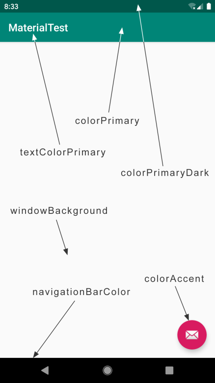

**图 12.2　各属性指定颜色的位置**

可以看到，每个属性所指定颜色的位置直接一目了然了。

除了上述 3 个属性之外，我们还可以通过 `textColorPrimary`、`windowBackground` 和 `navigationBarColor` 等属性控制更多位置的颜色。不过唯独 `colorAccent` 这个属性比较难理解，它不只是用来指定这样一个按钮的颜色，而是更多表达了一种强调的意思，比如一些控件的选中状态也会使用 `colorAccent` 的颜色。

现在我们已经将 ActionBar 隐藏起来了，那么接下来看一看如何使用 Toolbar 来替代 ActionBar。修改 activity_main.xml 中的代码，如下所示：

```xml
<FrameLayout xmlns:android="http://schemas.android.com/apk/res/android"
    xmlns:app="http://schemas.android.com/apk/res-auto"
    android:layout_width="match_parent"
    android:layout_height="match_parent">

    <androidx.appcompat.widget.Toolbar
        android:id="@+id/toolbar"
        android:layout_width="match_parent"
        android:layout_height="?attr/actionBarSize"
        android:background="@color/colorPrimary"
        android:theme="@style/ThemeOverlay.AppCompat.Dark.ActionBar"
        app:popupTheme="@style/ThemeOverlay.AppCompat.Light" />

</FrameLayout>
```

虽然这段代码不长，但是里面着实有不少技术点是需要我们仔细琢磨一下的。首先看一下第 2 行，这里使用 `xmlns:app` 指定了一个新的命名空间。思考一下，正是由于每个布局文件都会使用 `xmlns:android` 来指定一个命名空间，我们才能一直使用 `android:id`、`android: layout_width` 等写法。这里指定了 `xmlns:app`，也就是说现在可以使用 `app:attribute` 这样的写法了。但是为什么这里要指定一个 `xmlns:app` 的命名空间呢？这是由于许多 Material 属性是在新系统中新增的，老系统中并不存在，那么为了能够兼容老系统，我们就不能使用 `android:attribute` 这样的写法了，而是应该使用 `app:attribute`。

接下来定义了一个 Toolbar 控件，这个控件是由 appcompat 库提供的。这里我们给 Toolbar 指定了一个 id，将它的宽度设置为 `match_parent`，高度设置为 actionBar 的高度，背景色设置为 colorPrimary。不过下面的部分就稍微有点难理解了，由于我们刚才在 styles.xml 中将程序的主题指定成了浅色主题，因此 Toolbar 现在也是浅色主题，那么 Toolbar 上面的各种元素就会自动使用深色系，从而和主体颜色区别开。但是之前使用 ActionBar 时文字都是白色的，现在变成黑色的会很难看。那么为了能让 Toolbar 单独使用深色主题，这里我们使用了 `android:theme` 属性，将 Toolbar 的主题指定成了 ThemeOverlay.AppCompat.Dark.ActionBar。但是这样指定之后又会出现新的问题，如果 Toolbar 中有菜单按钮（我们在 3.2.5 小节中学过），那么弹出的菜单项也会变成深色主题，这样就再次变得十分难看了，于是这里又使用了 `app:popupTheme` 属性，单独将弹出的菜单项指定成了浅色主题。

如果你觉得上面的描述很绕的话，可以自己动手做一做实验，看看不指定上述主题会是什么样的效果，这样你会理解得更加深刻。

写完了布局，接下来我们修改 MainActivity，代码如下所示：

```Kotlin
class MainActivity : AppCompatActivity() {

    override fun onCreate(savedInstanceState: Bundle?) {
        super.onCreate(savedInstanceState)
        setContentView(R.layout.activity_main)
        setSupportActionBar(toolbar)
    }
}
```

这里关键的代码只有一句，调用 `setSupportActionBar()` 方法并将 Toolbar 的实例传入，这样我们就做到既使用了 Toolbar，又让它的外观与功能都和 ActionBar 一致了。

现在运行一下程序，效果如图 12.3 所示。

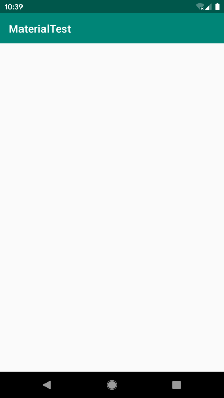

**图 12.3　Toolbar 的标准界面**

这个标题栏我们再熟悉不过了，虽然看上去和之前的标题栏没什么两样，但其实它已经是 Toolbar 而不是 ActionBar 了。因此它现在也具备了实现 Material Design 效果的能力，这个我们在后面就会学到。

接下来我们再学习一些 Toolbar 比较常用的功能吧，比如修改标题栏上显示的文字内容。这段文字内容是在 AndroidManifest.xml 中指定的，如下所示：

```xml
<application
    android:allowBackup="true"
    android:icon="@mipmap/ic_launcher"
    android:label="@string/app_name"
    android:roundIcon="@mipmap/ic_launcher_round"
    android:supportsRtl="true"
    android:theme="@style/AppTheme">
    <activity
        android:name=".MainActivity"
        android:label="Fruits">
        ...
    </activity>
</application>
```

这里给 `activity` 增加了一个 `android:label` 属性，用于指定在 Toolbar 中显示的文字内容，如果没有指定的话，会默认使用 `application` 中指定的 `label` 内容，也就是我们的应用名称。

不过只有一个标题的 Toolbar 看起来太单调了，我们还可以再添加一些 action 按钮来让 Toolbar 更加丰富一些。这里我提前准备了几张图片作为按钮的图标，将它们放在了 drawable-xxhdpi 目录下（资源下载方式见前言）。现在右击 res 目录 →New→Directory，创建一个 menu 文件夹。然后右击 menu 文件夹 →New→Menu resource file，创建一个 toolbar.xml 文件，并编写如下代码：

```xml
<menu xmlns:android="http://schemas.android.com/apk/res/android"
      xmlns:app="http://schemas.android.com/apk/res-auto">
    <item
        android:id="@+id/backup"
        android:icon="@drawable/ic_backup"
        android:title="Backup"
        app:showAsAction="always" />
    <item
        android:id="@+id/delete"
        android:icon="@drawable/ic_delete"
        android:title="Delete"
        app:showAsAction="ifRoom" />
    <item
        android:id="@+id/settings"
        android:icon="@drawable/ic_settings"
        android:title="Settings"
        app:showAsAction="never" />
</menu>
```

可以看到，我们通过 `<item>` 标签来定义 action 按钮，`android:id` 用于指定按钮的 id，`android:icon` 用于指定按钮的图标，`android:title` 用于指定按钮的文字。

接着使用 `app:showAsAction` 来指定按钮的显示位置，这里之所以再次使用了 app 命名空间，同样是为了能够兼容低版本的系统。`showAsAction` 主要有以下几种值可选：`always` 表示永远显示在 Toolbar 中，如果屏幕空间不够则不显示；`ifRoom` 表示屏幕空间足够的情况下显示在 Toolbar 中，不够的话就显示在菜单当中；`never` 则表示永远显示在菜单当中。注意，Toolbar 中的 action 按钮只会显示图标，菜单中的 action 按钮只会显示文字。

接下来的做法就和 3.2.5 小节中的完全一致了，修改 MainActivity 中的代码，如下所示：

```Kotlin
class MainActivity : AppCompatActivity() {
    ...
    override fun onCreateOptionsMenu(menu: Menu?): Boolean {
        menuInflater.inflate(R.menu.toolbar, menu)
        return true
    }

    override fun onOptionsItemSelected(item: MenuItem): Boolean {
        when (item.itemId) {
            R.id.backup -> Toast.makeText(this, "You clicked Backup",
                               Toast.LENGTH_SHORT).show()
            R.id.delete -> Toast.makeText(this, "You clicked Delete",
                               Toast.LENGTH_SHORT).show()
            R.id.settings -> Toast.makeText(this, "You clicked Settings",
                                 Toast.LENGTH_SHORT).show()
        }
        return true
    }

}
```

非常简单，我们在 `onCreateOptionsMenu()` 方法中加载了 toolbar.xml 这个菜单文件，然后在 `onOptionsItemSelected()` 方法中处理各个按钮的点击事件。现在重新运行一下程序，效果如图 12.4 所示。


**图 12.4　带有 action 按钮的 Toolbar**

可以看到，Toolbar 上现在显示了两个 action 按钮，这是因为 Backup 按钮指定的显示位置是 always，Delete 按钮指定的显示位置是 ifRoom，而现在屏幕空间很充足，因此两个按钮都会显示在 Toolbar 中。另外一个 Settings 按钮由于指定的显示位置是 never，所以不会显示在 Toolbar 中，点击一下最右边的菜单按钮来展开菜单项，你就能找到 Settings 按钮了。另外，这些 action 按钮都是可以响应点击事件的，你可以自己去试一试。

好了，关于 Toolbar 的内容就先讲这么多吧。当然 Toolbar 的功能还远远不只这些，不过我们显然无法在一节当中就把所有的用法全部学完，后面会结合其他控件来挖掘 Toolbar 的更多功能。

## 12.3　滑动菜单

滑动菜单可以说是 Material Design 中最常见的效果之一了，许多 Google 自家的应用（如 Gmail、Google Photo 等）具有滑动菜单的功能。虽说这个功能看上去好像挺复杂的，不过借助 Google 提供的各种工具，我们可以很轻松地实现非常炫酷的滑动菜单效果，那么我们马上开始吧。

### 12.3.1　DrawerLayout

所谓的滑动菜单，就是将一些菜单选项隐藏起来，而不是放置在主屏幕上，然后可以通过滑动的方式将菜单显示出来。这种方式既节省了屏幕空间，又实现了非常好的动画效果，是 Material Design 中推荐的做法。

不过，如果我们全靠自己去实现上述功能的话，难度恐怕就很大了。幸运的是，Google 在 AndroidX 库中提供了一个 DrawerLayout 控件，借助这个控件，实现滑动菜单简单又方便。

先来简单介绍一下 DrawerLayout 的用法吧。首先它是一个布局，在布局中允许放入两个直接子控件：第一个子控件是主屏幕中显示的内容，第二个子控件是滑动菜单中显示的内容。因此，我们就可以对 activity_main.xml 中的代码做如下修改：

```xml
<androidx.drawerlayout.widget.DrawerLayout
    xmlns:android="http://schemas.android.com/apk/res/android"
    xmlns:app="http://schemas.android.com/apk/res-auto"
    android:id="@+id/drawerLayout"
    android:layout_width="match_parent"
    android:layout_height="match_parent">

    <FrameLayout
        android:layout_width="match_parent"
        android:layout_height="match_parent">

        <androidx.appcompat.widget.Toolbar
            android:id="@+id/toolbar"
            android:layout_width="match_parent"
            android:layout_height="?attr/actionBarSize"
            android:background="@color/colorPrimary"
            android:theme="@style/ThemeOverlay.AppCompat.Dark.ActionBar"
            app:popupTheme="@style/ThemeOverlay.AppCompat.Light" />

    </FrameLayout>

    <TextView
        android:layout_width="match_parent"
        android:layout_height="match_parent"
        android:layout_gravity="start"
        android:background="#FFF"
        android:text="This is menu"
        android:textSize="30sp" />

</androidx.drawerlayout.widget.DrawerLayout>
```

可以看到，这里最外层的控件使用了 DrawerLayout。DrawerLayout 中放置了两个直接子控件：第一个子控件是 FrameLayout，用于作为主屏幕中显示的内容，当然里面还有我们刚刚定义的 Toolbar；第二个子控件是一个 TextView，用于作为滑动菜单中显示的内容，其实使用什么都可以，DrawerLayout 并没有限制只能使用固定的控件。

但是关于第二个子控件有一点需要注意，`layout_gravity` 这个属性是必须指定的，因为我们需要告诉 DrawerLayout 滑动菜单是在屏幕的左边还是右边，指定 left 表示滑动菜单在左边，指定 right 表示滑动菜单在右边。这里我指定了 start，表示会根据系统语言进行判断，如果系统语言是从左往右的，比如英语、汉语，滑动菜单就在左边，如果系统语言是从右往左的，比如阿拉伯语，滑动菜单就在右边。

没错，只需要改动这么多就可以了，现在重新运行一下程序，然后在屏幕的左侧边缘向右拖动，就可以让滑动菜单显示出来了，如图 12.5 所示。


**图 12.5　显示滑动菜单界面**

向左滑动菜单，或者点击一下菜单以外的区域，都可以让滑动菜单关闭，从而回到主界面。无论是展示还是隐藏滑动菜单，都有非常流畅的动画过渡。

可以看到，我们只是稍微改动了一下布局文件，就能实现如此炫酷的效果，是不是觉得挺激动呢？ 不过现在的滑动菜单还有点问题，因为只有在屏幕的左侧边缘进行拖动时才能将菜单拖出来，而很多用户可能根本就不知道有这个功能，那么该怎么提示他们呢？

Material Design 建议的做法是在 Toolbar 的最左边加入一个导航按钮，点击按钮也会将滑动菜单的内容展示出来。这样就相当于给用户提供了两种打开滑动菜单的方式，防止一些用户不知道屏幕的左侧边缘是可以拖动的。

下面我们来实现这个功能。首先我准备了一张导航按钮的图标 ic_menu.png，将它放在了 drawable-xxhdpi 目录下。然后修改 MainActivity 中的代码，如下所示：

```Kotlin
class MainActivity : AppCompatActivity() {

    override fun onCreate(savedInstanceState: Bundle?) {
        super.onCreate(savedInstanceState)
        setContentView(R.layout.activity_main)
        setSupportActionBar(toolbar)
        supportActionBar?.let {
            it.setDisplayHomeAsUpEnabled(true)
            it.setHomeAsUpIndicator(R.drawable.ic_menu)
        }
    }
    ...
    override fun onOptionsItemSelected(item: MenuItem): Boolean {
        when (item.itemId) {
            android.R.id.home -> drawerLayout.openDrawer(GravityCompat.START)
            ...
        }
        return true
    }

}
```

这里我们并没有改动多少代码，首先调用 `getSupportActionBar()` 方法得到了 ActionBar 的实例，虽然这个 ActionBar 的具体实现是由 Toolbar 来完成的。接着在 ActionBar 不为空的情况下调用 `setDisplayHomeAsUpEnabled()` 方法让导航按钮显示出来，调用 `setHomeAsUpIndicator()` 方法来设置一个导航按钮图标。实际上，Toolbar 最左侧的这个按钮就叫作 Home 按钮，它默认的图标是一个返回的箭头，含义是返回上一个 Activity。很明显，这里我们将它默认的样式和作用都进行了修改。

接下来，在 `onOptionsItemSelected()` 方法中对 Home 按钮的点击事件进行处理，Home 按钮的 id 永远都是 `android.R.id.home`。然后调用 DrawerLayout 的 `openDrawer()` 方法将滑动菜单展示出来，注意，`openDrawer()` 方法要求传入一个 `Gravity` 参数，为了保证这里的行为和 XML 中定义的一致，我们传入了 `GravityCompat.START`。

现在重新运行一下程序，效果如图 12.6 所示。

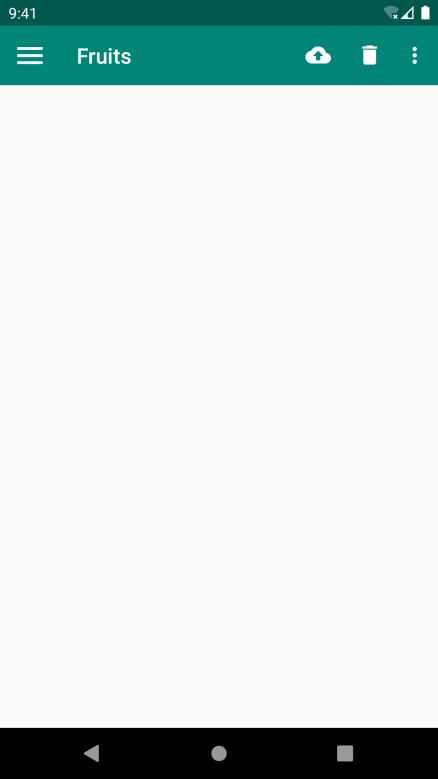

**图 12.6　显示 Home 按钮**

可以看到，在 Toolbar 的最左边出现了一个导航按钮，用户看到这个按钮就知道它肯定是可以点击的。现在点击一下这个按钮，滑动菜单界面就会再次展示出来了。

### 12.3.2　NavigationView

目前我们已经成功实现了滑动菜单功能，其中滑动功能已经做得非常好了，但是菜单却还很丑，毕竟菜单页面仅仅使用了一个 TextView，非常单调。有对比才会有落差，我们看一下 Play Store 的滑动菜单页面是长什么样的，如图 12.7 所示。

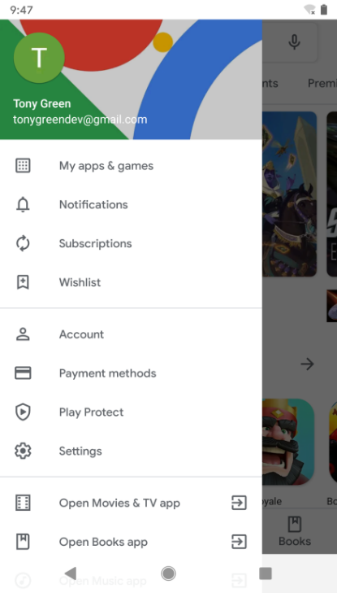

**图 12.7　Play Store 的滑动菜单页面**

经过对比，是不是觉得我们的滑动菜单页面更丑了？不过没关系，优化滑动菜单页面，这就是我们本小节的全部目标。

事实上，你可以在滑动菜单页面定制任意的布局，不过 Google 给我们提供了一种更好的方法——使用 NavigationView。NavigationView 是 Material 库中提供的一个控件，它不仅是严格按照 Material Design 的要求来设计的，而且可以将滑动菜单页面的实现变得非常简单。接下来我们就学习一下 NavigationView 的用法。

首先，既然这个控件是 Material 库中提供的，那么我们就需要将这个库引入项目中才行。打开 app/build.gradle 文件，在 `dependencies` 闭包中添加如下内容：

```gradle
dependencies {
    ...
    implementation 'com.google.android.material:material:1.1.0'
    implementation 'de.hdodenhof:circleimageview:3.0.1'
}
```

这里添加了两行依赖关系：第一行就是 Material 库，第二行是一个开源项目 CircleImageView，它可以用来轻松实现图片圆形化的功能，我们待会就会用到它。

需要注意的是，当你引入了 Material 库之后，还需要将 res/values/styles.xml 文件中 AppTheme 的 parent 主题改成 Theme.MaterialComponents.Light.NoActionBar，否则在使用接下来的一些控件时可能会遇到崩溃问题。

在开始使用 NavigationView 之前，我们还需要准备好两个东西：menu 和 headerLayout。menu 是用来在 NavigationView 中显示具体的菜单项的，headerLayout 则是用来在 NavigationView 中显示头部布局的。

先来准备 menu。这里我事先找了几张图片作为按钮的图标，并将它们放在了 drawable-xxhdpi 目录下。右击 menu 文件夹 →New→Menu resource file，创建一个 nav_menu.xml 文件，并编写如下代码：

```xml
<menu xmlns:android="http://schemas.android.com/apk/res/android">
    <group android:checkableBehavior="single">
        <item
            android:id="@+id/navCall"
            android:icon="@drawable/nav_call"
            android:title="Call" />
        <item
            android:id="@+id/navFriends"
            android:icon="@drawable/nav_friends"
            android:title="Friends" />
        <item
            android:id="@+id/navLocation"
            android:icon="@drawable/nav_location"
            android:title="Location" />
        <item
            android:id="@+id/navMail"
            android:icon="@drawable/nav_mail"
            android:title="Mail" />
        <item
            android:id="@+id/navTask"
            android:icon="@drawable/nav_task"
            android:title="Tasks" />
    </group>
</menu>
```

我们首先在 `<menu>` 中嵌套了一个 `<group>` 标签，然后将 group 的 `checkableBehavior` 属性指定为 `single`。group 表示一个组，`checkableBehavior` 指定为 `single` 表示组中的所有菜单项只能单选。

下面我们来看一下这些菜单项吧。这里一共定义了 5 个 item，分别使用 `android:id` 属性指定菜单项的 id，`android:icon` 属性指定菜单项的图标，`android:title` 属性指定菜单项显示的文字。就是这么简单，现在我们已经把 menu 准备好了。

接下来应该准备 headerLayout 了，这是一个可以随意定制的布局，不过我并不想将它做得太复杂。这里简单起见，我们就在 headerLayout 中放置头像、用户名、邮箱地址这 3 项内容吧。

说到头像，那我们还需要再准备一张图片，这里我找了一张宠物图片，并把它放在了 drawable-xxhdpi 目录下。另外，这张图片最好是一张正方形图片，因为待会我们会把它圆形化。然后右击 layout 文件夹 →New→Layout resource file，创建一个 nav_header.xml 文件。修改其中的代码，如下所示：

```xml
<RelativeLayout xmlns:android="http://schemas.android.com/apk/res/android"
    android:layout_width="match_parent"
    android:layout_height="180dp"
    android:padding="10dp"
    android:background="@color/colorPrimary">

    <de.hdodenhof.circleimageview.CircleImageView
        android:id="@+id/iconImage"
        android:layout_width="70dp"
        android:layout_height="70dp"
        android:src="@drawable/nav_icon"
        android:layout_centerInParent="true" />

    <TextView
        android:id="@+id/mailText"
        android:layout_width="wrap_content"
        android:layout_height="wrap_content"
        android:layout_alignParentBottom="true"
        android:text="tonygreendev@gmail.com"
        android:textColor="#FFF"
        android:textSize="14sp" />

    <TextView
        android:id="@+id/userText"
        android:layout_width="wrap_content"
        android:layout_height="wrap_content"
        android:layout_above="@id/mailText"
        android:text="Tony Green"
        android:textColor="#FFF"
        android:textSize="14sp" />

</RelativeLayout>
```

可以看到，布局文件的最外层是一个 RelativeLayout，我们将它的宽度设为 `match_parent`，高度设为 180 dp，这是一个 NavigationView 比较适合的高度，然后指定它的背景色为 `colorPrimary`。

在 RelativeLayout 中我们放置了 3 个控件，CircleImageView 是一个用于将图片圆形化的控件，它的用法非常简单，基本和 ImageView 是完全一样的，这里给它指定了一张图片作为头像，然后设置为居中显示。另外两个 TextView 分别用于显示用户名和邮箱地址，它们都用到了一些 RelativeLayout 的定位属性，相信肯定难不倒你吧？

现在 menu 和 headerLayout 都准备好了，我们终于可以使用 NavigationView 了。修改 activity_main.xml 中的代码，如下所示：

```xml
<androidx.drawerlayout.widget.DrawerLayout
    xmlns:android="http://schemas.android.com/apk/res/android"
    xmlns:app="http://schemas.android.com/apk/res-auto"
    android:id="@+id/drawerLayout"
    android:layout_width="match_parent"
    android:layout_height="match_parent">

    <FrameLayout
        android:layout_width="match_parent"
        android:layout_height="match_parent">

        <androidx.appcompat.widget.Toolbar
            android:id="@+id/toolbar"
            android:layout_width="match_parent"
            android:layout_height="?attr/actionBarSize"
            android:background="@color/colorPrimary"
            android:theme="@style/ThemeOverlay.AppCompat.Dark.ActionBar"
            app:popupTheme="@style/ThemeOverlay.AppCompat.Light" />

    </FrameLayout>

    <com.google.android.material.navigation.NavigationView
        android:id="@+id/navView"
        android:layout_width="match_parent"
        android:layout_height="match_parent"
        android:layout_gravity="start"
        app:menu="@menu/nav_menu"
        app:headerLayout="@layout/nav_header"/>

</androidx.drawerlayout.widget.DrawerLayout>
```

可以看到，我们将之前的 TextView 换成了 NavigationView，这样滑动菜单中显示的内容也就变成 NavigationView 了。这里又通过 `app:menu` 和 `app:headerLayout` 属性将我们刚才准备好的 menu 和 headerLayout 设置了进去，这样 NavigationView 就定义完成了。

NavigationView 虽然定义完成了，但是我们还要处理菜单项的点击事件才行。修改 MainActivity 中的代码，如下所示：

```Kotlin
class MainActivity : AppCompatActivity() {

    override fun onCreate(savedInstanceState: Bundle?) {
        super.onCreate(savedInstanceState)
        setContentView(R.layout.activity_main)
        setSupportActionBar(toolbar)
        supportActionBar?.let {
            it.setDisplayHomeAsUpEnabled(true)
            it.setHomeAsUpIndicator(R.drawable.ic_menu)
        }
        navView.setCheckedItem(R.id.navCall)
        navView.setNavigationItemSelectedListener {
            drawerLayout.closeDrawers()
            true
        }
    }
    ...
}
```

代码还是比较简单的，这里我们首先调用了 NavigationView 的 `setCheckedItem()` 方法将 Call 菜单项设置为默认选中。接着调用了 `setNavigationItemSelectedListener()` 方法来设置一个菜单项选中事件的监听器，当用户点击了任意菜单项时，就会回调到传入的 Lambda 表达式当中，我们可以在这里编写具体的逻辑处理。这里调用了 DrawerLayout 的 `closeDrawers()` 方法将滑动菜单关闭，并返回 `true` 表示此事件已被处理。

现在可以重新运行一下程序了，点击一下 Toolbar 左侧的导航按钮，效果如图 12.8 所示。


**图 12.8　NavigationView 界面**

怎么样？这样的滑动菜单页面，你无论如何也不能说它丑了吧？Material Design 的魅力就在于此，它具有非常美观的设计理念，只要你按照它的各种规范和建议来设计界面，最终做出来的程序就是特别好看的。

相信你对现在做出来的效果也一定十分满意吧？不过不要满足于现状，后面我们会实现更加炫酷的效果。跟紧脚步，继续学习吧。

## 12.4　悬浮按钮和可交互提示

立面设计是 Material Design 中一条非常重要的设计思想，也就是说，按照 Material Design 的理念，应用程序的界面不仅仅是一个平面，而应该是有立体效果的。在官方给出的示例中，最简单且最具代表性的立面设计就是悬浮按钮了，这种按钮不属于主界面平面的一部分，而是位于另外一个维度的，因此就会给人一种悬浮的感觉。

本节中我们会对这个悬浮按钮的效果进行学习，另外还会学习一种可交互式的提示工具。关于提示工具，我们之前一直使用的是 Toast，但是 Toast 只能用于告知用户某事已经发生了，用户却不能对此做出任何的响应，那么今天我们就将在这一方面进行扩展。

### 12.4.1　FloatingActionButton

FloatingActionButton 是 Material 库中提供的一个控件，这个控件可以帮助我们比较轻松地实现悬浮按钮的效果。其实在之前的图 12.2 中，我们就已经预览过悬浮按钮的样子了，它默认会使用 colorAccent 作为按钮的颜色，我们还可以通过给按钮指定一个图标来表明这个按钮的作用是什么。

下面开始具体实现。首先仍然需要提前准备好一个图标，这里我放置了一张 ic_done.png 到 drawable-xxhdpi 目录下。然后修改 activity_main.xml 中的代码，如下所示：

```xml
<androidx.drawerlayout.widget.DrawerLayout
    xmlns:android="http://schemas.android.com/apk/res/android"
    xmlns:app="http://schemas.android.com/apk/res-auto"
    android:id="@+id/drawerLayout"
    android:layout_width="match_parent"
    android:layout_height="match_parent">

    <FrameLayout
        android:layout_width="match_parent"
        android:layout_height="match_parent">

        <androidx.appcompat.widget.Toolbar
            android:id="@+id/toolbar"
            android:layout_width="match_parent"
            android:layout_height="?attr/actionBarSize"
            android:background="@color/colorPrimary"
            android:theme="@style/ThemeOverlay.AppCompat.Dark.ActionBar"
            app:popupTheme="@style/ThemeOverlay.AppCompat.Light" />

        <com.google.android.material.floatingactionbutton.FloatingActionButton
            android:id="@+id/fab"
            android:layout_width="wrap_content"
            android:layout_height="wrap_content"
            android:layout_gravity="bottom|end"
            android:layout_margin="16dp"
            android:src="@drawable/ic_done" />

    </FrameLayout>
    ...
</androidx.drawerlayout.widget.DrawerLayout>
```

可以看到，这里我们在主屏幕布局中加入了一个 FloatingActionButton。这个控件的用法并没有什么特别的地方，`layout_width` 和 `layout_height` 属性都指定成 `wrap_content`，`layout_gravity` 属性指定将这个控件放置于屏幕的右下角。其中 `end` 的工作原理和之前的 `start` 是一样的，即如果系统语言是从左往右的，那么 `end` 就表示在右边，如果系统语言是从右往左的，那么 `end` 就表示在左边。然后通过 `layout_margin` 属性给控件的四周留点边距，紧贴着屏幕边缘肯定是不好看的，最后通过 `src` 属性给 FloatingActionButton 设置了一个图标。

没错，就是这么简单，现在我们就可以运行一下了，效果如图 12.9 所示。

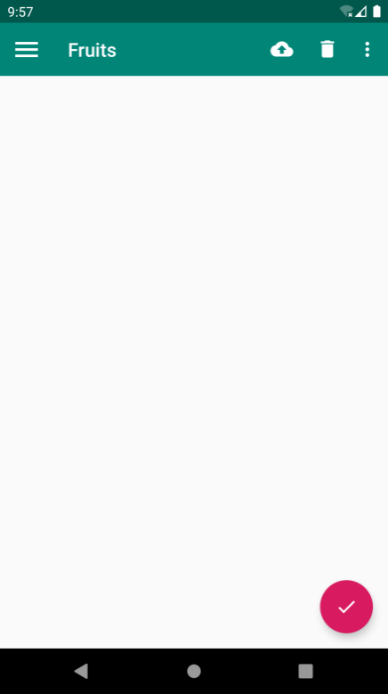

**图 12.9　悬浮按钮的效果**

一个漂亮的悬浮按钮就在屏幕的右下方出现了。

如果你仔细观察的话，会发现这个悬浮按钮的下面还有一点阴影。其实这很好理解，因为 FloatingActionButton 是悬浮在当前界面上的，既然是悬浮，那么理所应当会有投影，Material 库连这种细节都帮我们考虑到了。

说到悬浮，其实我们还可以指定 FloatingActionButton 的悬浮高度，如下所示：

```xml
<com.google.android.material.floatingactionbutton.FloatingActionButton
    android:id="@+id/fab"
    android:layout_width="wrap_content"
    android:layout_height="wrap_content"
    android:layout_gravity="bottom|end"
    android:layout_margin="16dp"
    android:src="@drawable/ic_done"
    app:elevation="8dp" />
```

这里使用 `app:elevation` 属性给 FloatingActionButton 指定一个高度值。高度值越大，投影范围也越大，但是投影效果越淡；高度值越小，投影范围也越小，但是投影效果越浓。当然这些效果的差异其实并不怎么明显，我个人感觉使用默认的 FloatingActionButton 效果就已经足够了。

接下来我们看一下 FloatingActionButton 是如何处理点击事件的，毕竟，一个按钮首先要能点击才有意义。修改 MainActivity 中的代码，如下所示：

```Kotlin
class MainActivity : AppCompatActivity() {

    override fun onCreate(savedInstanceState: Bundle?) {
        super.onCreate(savedInstanceState)
        setContentView(R.layout.activity_main)
        ...
        fab.setOnClickListener {
            Toast.makeText(this, "FAB clicked", Toast.LENGTH_SHORT).show()
        }
    }
    ...
}
```

如果你在期待 FloatingActionButton 会有什么特殊用法的话，那可能要让你失望了，它和普通的 Button 其实没什么两样，都是调用 `setOnClickListener()` 方法来设置按钮的点击事件，这里我们只是弹出了一个 Toast。

现在重新运行一下程序，并点击“FloatingActionButton”，效果如图 12.10 所示。

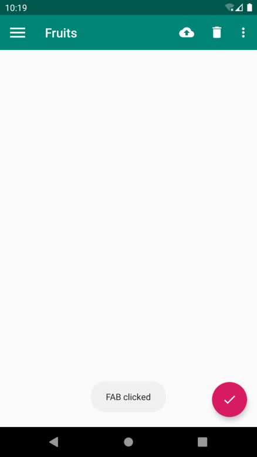

**图 12.10　处理 FloatingActionButton 的点击事件**

### 12.4.2　Snackbar

现在我们已经掌握了 FloatingActionButton 的基本用法，不过在上一小节处理点击事件的时候，仍然是使用 Toast 作为提示工具的，本小节我们就来学习一个 Material 库提供的更加先进的提示工具——Snackbar。

首先要明确，Snackbar 并不是 Toast 的替代品，它们有着不同的应用场景。Toast 的作用是告诉用户现在发生了什么事情，但用户只能被动接收这个事情，因为没有什么办法能让用户进行选择。而 Snackbar 则在这方面进行了扩展，它允许在提示中加入一个可交互按钮，当用户点击按钮的时候，可以执行一些额外的逻辑操作。打个比方，如果我们在执行删除操作的时候只弹出一个 Toast 提示，那么用户要是误删了某个重要数据的话，肯定会十分抓狂吧，但是如果我们增加一个 Undo 按钮，就相当于给用户提供了一种弥补措施，从而大大降低了事故发生的概率，提升了用户体验。

Snackbar 的用法也非常简单，它和 Toast 是基本相似的，只不过可以额外增加一个按钮的点击事件。修改 MainActivity 中的代码，如下所示：

```Kotlin
class MainActivity : AppCompatActivity() {

    override fun onCreate(savedInstanceState: Bundle?) {
        super.onCreate(savedInstanceState)
        setContentView(R.layout.activity_main)
        ...
        fab.setOnClickListener { view ->
            Snackbar.make(view, "Data deleted", Snackbar.LENGTH_SHORT)
                .setAction("Undo") {
                    Toast.makeText(this, "Data restored", Toast.LENGTH_SHORT).show()
                }
                .show()
        }
    }
    ...
}
```

可以看到，这里调用了 Snackbar 的 `make()` 方法来创建一个 `Snackbar` 对象。`make()` 方法的第一个参数需要传入一个 View，只要是当前界面布局的任意一个 View 都可以，Snackbar 会使用这个 View 自动查找最外层的布局，用于展示提示信息；第二个参数就是 Snackbar 中显示的内容；第三个参数是 Snackbar 显示的时长，这些和 Toast 都是类似的。

接着这里又调用了一个 `setAction()` 方法来设置一个动作，从而让 Snackbar 不仅仅是一个提示，而是可以和用户进行交互的。简单起见，我们在动作按钮的点击事件里面弹出一个 Toast 提示。最后调用 `show()` 方法让 Snackbar 显示出来。

现在重新运行一下程序，并点击悬浮按钮，效果如图 12.11 所示。

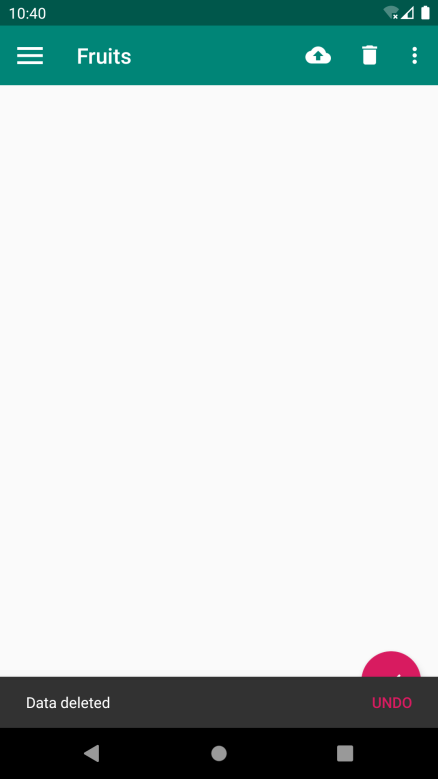

**图 12.11　Snackbar 的效果**

可以看到，Snackbar 从屏幕底部出现了，上面有我们设置的提示文字，还有一个“Undo”按钮，按钮是可以点击的。过一段时间后，Snackbar 会自动从屏幕底部消失。

不管是出现还是消失，Snackbar 都是带有动画效果的，因此视觉体验也会比较好。

不过，你有没有发现一个 bug？这个 Snackbar 竟然将我们的悬浮按钮给遮挡住了。虽说也不是什么重大的问题，因为 Snackbar 过一会儿就会自动消失，但这种用户体验总归是不友好的。有没有什么办法能解决一下呢？当然有了，只需要借助 CoordinatorLayout 就可以轻松解决。

### 12.4.3　CoordinatorLayout

CoordinatorLayout 可以说是一个加强版的 FrameLayout，由 AndroidX 库提供。它在普通情况下的作用和 FrameLayout 基本一致，但是它拥有一些额外的 Material 能力。

事实上，CoordinatorLayout 可以监听其所有子控件的各种事件，并自动帮助我们做出最为合理的响应。举个简单的例子，刚才弹出的 Snackbar 提示将悬浮按钮遮挡住了，而如果我们能让 CoordinatorLayout 监听到 Snackbar 的弹出事件，那么它会自动将内部的 FloatingActionButton 向上偏移，从而确保不会被 Snackbar 遮挡。

至于 CoordinatorLayout 的使用也非常简单，我们只需要将原来的 FrameLayout 替换一下就可以了。修改 activity_main.xml 中的代码，如下所示：

```xml
<androidx.drawerlayout.widget.DrawerLayout
    xmlns:android="http://schemas.android.com/apk/res/android"
    xmlns:app="http://schemas.android.com/apk/res-auto"
    android:id="@+id/drawerLayout"
    android:layout_width="match_parent"
    android:layout_height="match_parent">

    <androidx.coordinatorlayout.widget.CoordinatorLayout
        android:layout_width="match_parent"
        android:layout_height="match_parent">

        <androidx.appcompat.widget.Toolbar
            android:id="@+id/toolbar"
            android:layout_width="match_parent"
            android:layout_height="?attr/actionBarSize"
            android:background="@color/colorPrimary"
            android:theme="@style/ThemeOverlay.AppCompat.Dark.ActionBar"
            app:popupTheme="@style/ThemeOverlay.AppCompat.Light" />

        <com.google.android.material.floatingactionbutton.FloatingActionButton
            android:id="@+id/fab"
            android:layout_width="wrap_content"
            android:layout_height="wrap_content"
            android:layout_gravity="bottom|end"
            android:layout_margin="16dp"
            android:src="@drawable/ic_done" />

    </androidx.coordinatorlayout.widget.CoordinatorLayout>
    ...
</androidx.drawerlayout.widget.DrawerLayout>
```

由于 CoordinatorLayout 本身就是一个加强版的 FrameLayout，因此这种替换不会有任何的副作用。现在重新运行一下程序，并点击悬浮按钮，效果如图 12.12 所示。

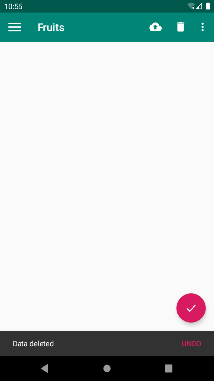

**图 12.12　CoordinatorLayout 自动将悬浮按钮上移**

可以看到，悬浮按钮自动向上偏移了 Snackbar 的同等高度，从而确保不会被遮挡。当 Snackbar 消失的时候，悬浮按钮会自动向下偏移回到原来的位置。

另外，悬浮按钮的向上和向下偏移也是伴随着动画效果的，且和 Snackbar 完全同步，整体效果看上去特别赏心悦目。

不过我们回过头来再思考一下，刚才说的是 CoordinatorLayout 可以监听其所有子控件的各种事件，但是 Snackbar 好像并不是 CoordinatorLayout 的子控件吧，为什么它却可以被监听到呢？

其实道理很简单，还记得我们在 Snackbar 的 `make()` 方法中传入的第一个参数吗？这个参数就是用来指定 Snackbar 是基于哪个 View 触发的，刚才我们传入的是 FloatingActionButton 本身，而 FloatingActionButton 是 CoordinatorLayout 中的子控件，因此这个事件就理所应当能被监听到了。你可以自己再做个实验，如果给 Snackbar 的 `make()` 方法传入一个 DrawerLayout，那么 Snackbar 就会再次遮挡悬浮按钮，因为 DrawerLayout 不是 CoordinatorLayout 的子控件，CoordinatorLayout 也就无法监听到 Snackbar 的弹出和隐藏事件了。

本节的内容就讲到这里，接下来我们继续丰富 MaterialTest 项目，加入卡片式布局效果。

## 12.5　卡片式布局

虽然现在 MaterialTest 中已经应用了非常多的 Material Design 效果，不过你会发现，界面上最主要的一块区域还处于空白状态。这块区域通常用来放置应用的主体内容，我准备使用一些精美的水果图片来填充这部分区域。

为了要让水果图片也能 Material 化，本节中我们将会学习如何实现卡片式布局的效果。卡片式布局也是 Materials Design 中提出的一个新概念，它可以让页面中的元素看起来就像在卡片中一样，并且还能拥有圆角和投影，下面我们就开始具体学习一下。

### 12.5.1　MaterialCardView

MaterialCardView 是用于实现卡片式布局效果的重要控件，由 Material 库提供。实际上，MaterialCardView 也是一个 FrameLayout，只是额外提供了圆角和阴影等效果，看上去会有立体的感觉。

我们先来看一下 MaterialCardView 的基本用法吧，其实非常简单，如下所示：

```xml
<com.google.android.material.card.MaterialCardView
    android:layout_width="match_parent"
    android:layout_height="wrap_content"
    app:cardCornerRadius="4dp"
    app:elevation="5dp">
    <TextView
        android:id="@+id/infoText"
        android:layout_width="match_parent"
        android:layout_height="wrap_content"/>
</com.google.android.material.card.MaterialCardView>
```

这里定义了一个 MaterialCardView 布局，我们可以通过 `app:cardCornerRadius` 属性指定卡片圆角的弧度，数值越大，圆角的弧度也越大。另外，还可以通过 `app:elevation` 属性指定卡片的高度：高度值越大，投影范围也越大，但是投影效果越淡；高度值越小，投影范围也越小，但是投影效果越浓。这一点和 FloatingActionButton 是一致的。

然后，我们在 MaterialCardView 布局中放置了一个 TextView，那么这个 TextView 就会显示在一张卡片当中了，就是这么简单。

但是，我们显然不可能在如此宽阔的一块空白区域内只放置一张卡片。为了能够充分利用屏幕的空间，这里我准备综合运用一下第 4 章中学到的知识，使用 RecyclerView 填充 MaterialTest 项目的主界面部分。还记得之前实现过的水果列表效果吗？这次我们将升级一下，实现一个高配版的水果列表效果。

既然是要实现水果列表，那么首先肯定需要准备许多张水果图片，这里我从网上挑选了一些精美的水果图片，将它们复制到了项目当中（资源下载方式见前言）。

然后，由于我们还需要用到 RecyclerView，因此必须在 app/build.gradle 文件中声明库的依赖：

```gradle
dependencies {
    ...
    implementation 'androidx.recyclerview:recyclerview:1.0.0'
    implementation 'com.github.bumptech.glide:glide:4.9.0'
}
```

上述声明的第二行是添加了 Glide 库的依赖。Glide 是一个超级强大的开源图片加载库，它不仅可以用于加载本地图片，还可以加载网络图片、GIF 图片甚至是本地视频。最重要的是，Glide 的用法非常简单，只需几行代码就能轻松实现复杂的图片加载功能，因此这里我们准备用它来加载水果图片。Glide 的项目主页地址是：[https://github.com/bumptech/glide](https://github.com/bumptech/glide)。

接下来开始具体的代码实现，修改 activity_main.xml 中的代码，如下所示：

```xml
<androidx.drawerlayout.widget.DrawerLayout
    xmlns:android="http://schemas.android.com/apk/res/android"
    xmlns:app="http://schemas.android.com/apk/res-auto"
    android:id="@+id/drawerLayout"
    android:layout_width="match_parent"
    android:layout_height="match_parent">

    <androidx.coordinatorlayout.widget.CoordinatorLayout
        android:layout_width="match_parent"
        android:layout_height="match_parent">

        <androidx.appcompat.widget.Toolbar
            android:id="@+id/toolbar"
            android:layout_width="match_parent"
            android:layout_height="?attr/actionBarSize"
            android:background="@color/colorPrimary"
            android:theme="@style/ThemeOverlay.AppCompat.Dark.ActionBar"
            app:popupTheme="@style/ThemeOverlay.AppCompat.Light" />

        <androidx.recyclerview.widget.RecyclerView
            android:id="@+id/recyclerView"
            android:layout_width="match_parent"
            android:layout_height="match_parent" />

        <com.google.android.material.floatingactionbutton.FloatingActionButton
            android:id="@+id/fab"
            android:layout_width="wrap_content"
            android:layout_height="wrap_content"
            android:layout_gravity="bottom|end"
            android:layout_margin="16dp"
            android:src="@drawable/ic_done" />

    </androidx.coordinatorlayout.widget.CoordinatorLayout>
    ...
</androidx.drawerlayout.widget.DrawerLayout>
```

这里我们在 CoordinatorLayout 中添加了一个 RecyclerView，给它指定一个 id，然后将宽度和高度都设置为 `match_parent`，这样 RecyclerView 就占满了整个布局的空间。

接着定义一个实体类 `Fruit`，代码如下所示：

```Kotlin
class Fruit(val name: String, val imageId: Int)
```

`Fruit` 类中只有两个字段：`name` 表示水果的名字，`imageId` 表示水果对应图片的资源 id。

然后需要为 RecyclerView 的子项指定一个我们自定义的布局，在 layout 目录下新建 fruit_item.xml，代码如下所示：

```xml
<com.google.android.material.card.MaterialCardView
    xmlns:android="http://schemas.android.com/apk/res/android"
    xmlns:app="http://schemas.android.com/apk/res-auto"
    android:layout_width="match_parent"
    android:layout_height="wrap_content"
    android:layout_margin="5dp"
    app:cardCornerRadius="4dp">

    <LinearLayout
        android:orientation="vertical"
        android:layout_width="match_parent"
        android:layout_height="wrap_content">

        <ImageView
            android:id="@+id/fruitImage"
            android:layout_width="match_parent"
            android:layout_height="100dp"
            android:scaleType="centerCrop" />

        <TextView
            android:id="@+id/fruitName"
            android:layout_width="wrap_content"
            android:layout_height="wrap_content"
            android:layout_gravity="center_horizontal"
            android:layout_margin="5dp"
            android:textSize="16sp" />
    </LinearLayout>

</com.google.android.material.card.MaterialCardView>
```

这里使用了 MaterialCardView 来作为子项的最外层布局，从而使得 RecyclerView 中的每个元素都是在卡片当中的。由于 MaterialCardView 是一个 FrameLayout，因此它没有什么方便的定位方式，这里我们只好在 MaterialCardView 中再嵌套一个 LinearLayout，然后在 LinearLayout 中放置具体的内容。

内容倒也没有什么特殊的地方，就是定义了一个 ImageView 用于显示水果的图片，又定义了一个 TextView 用于显示水果的名称，并让 TextView 在水平方向上居中显示。注意，在 ImageView 中我们使用了一个 `scaleType` 属性，这个属性可以指定图片的缩放模式。由于各张水果图片的长宽比例可能会不一致，为了让所有的图片都能填充满整个 ImageView，这里使用了 centerCrop 模式，它可以让图片保持原有比例填充满 ImageView，并将超出屏幕的部分裁剪掉。

接下来需要为 RecyclerView 准备一个适配器，新建 `FruitAdapter` 类，让这个适配器继承自 RecyclerView.Adapter，并将泛型指定为 FruitAdapter.ViewHolder，代码如下所示：

```Kotlin
class FruitAdapter(val context: Context, val fruitList: List<Fruit>) :
           RecyclerView.Adapter<FruitAdapter.ViewHolder>() {

    inner class ViewHolder(view: View) : RecyclerView.ViewHolder(view) {
        val fruitImage: ImageView = view.findViewById(R.id.fruitImage)
        val fruitName: TextView = view.findViewById(R.id.fruitName)
    }

    override fun onCreateViewHolder(parent: ViewGroup, viewType: Int): ViewHolder {
        val view = LayoutInflater.from(context).inflate(R.layout.fruit_item, parent, false)
        return ViewHolder(view)
    }

    override fun onBindViewHolder(holder: ViewHolder, position: Int) {
        val fruit = fruitList[position]
        holder.fruitName.text = fruit.name
        Glide.with(context).load(fruit.imageId).into(holder.fruitImage)
    }

    override fun getItemCount() = fruitList.size

}
```

上述代码相信你一定很熟悉，和我们在第 4 章中编写的 FruitAdapter 基本一模一样。唯一需要注意的是，在 `onBindViewHolder()` 方法中我们使用了 Glide 来加载水果图片。

那么这里就顺便来看一下 Glide 的用法吧，其实并没有太多好讲的，因为 Glide 的用法实在是太简单了。首先调用 `Glide.with()` 方法并传入一个 `Context`、`Activity` 或 `Fragment` 参数，然后调用 `load()` 方法加载图片，可以是一个 URL 地址，也可以是一个本地路径，或者是一个资源 id，最后调用 `into()` 方法将图片设置到具体某一个 ImageView 中就可以了。

那么我们为什么要使用 Glide 而不是传统的设置图片方式呢？因为这次我从网上找的这些水果图片像素非常高，如果不进行压缩就直接展示的话，很容易引起内存溢出。而使用 Glide 就完全不需要担心这回事，Glide 在内部做了许多非常复杂的逻辑操作，其中就包括了图片压缩，我们只需要安心按照 Glide 的标准用法去加载图片就可以了。

这样我们将 RecyclerView 的适配器也准备好了，最后修改 MainActivity 中的代码，如下所示：

```Kotlin
class MainActivity : AppCompatActivity() {

    val fruits = mutableListOf(Fruit("Apple", R.drawable.apple), Fruit("Banana",
        R.drawable.banana), Fruit("Orange", R.drawable.orange), Fruit("Watermelon",
        R.drawable.watermelon), Fruit("Pear", R.drawable.pear), Fruit("Grape",
        R.drawable.grape), Fruit("Pineapple", R.drawable.pineapple), Fruit("Strawberry",
        R.drawable.strawberry), Fruit("Cherry", R.drawable.cherry), Fruit("Mango",
        R.drawable.mango))

    val fruitList = ArrayList<Fruit>()

    override fun onCreate(savedInstanceState: Bundle?) {
        super.onCreate(savedInstanceState)
        setContentView(R.layout.activity_main)
        ...
        initFruits()
        val layoutManager = GridLayoutManager(this, 2)
        recyclerView.layoutManager = layoutManager
        val adapter = FruitAdapter(this, fruitList)
        recyclerView.adapter = adapter
    }

    private fun initFruits() {
        fruitList.clear()
        repeat(50) {
            val index = (0 until fruits.size).random()
            fruitList.add(fruits[index])
        }
    }
    ...
}
```

在 MainActivity 中，我们首先定义了一个水果集合，集合里面存放了很多个 `Fruit` 的实例，每个实例都代表一种水果。然后在 `initFruits()` 方法中，先是清空了一下 `fruitList` 中的数据，接着使用一个随机函数，从刚才定义的 `Fruit` 数组中随机挑选一个水果放入 `fruitList` 当中，这样每次打开程序看到的水果数据都会是不同的。另外，为了让界面上的数据多一些，这里使用了 `repeat()` 函数，随机挑选 50 个水果。

之后的用法就是 RecyclerView 的标准用法了，不过这里使用了 GridLayoutManager 这种布局方式。在第 4 章中我们已经学过了 LinearLayoutManager 和 StaggeredGridLayoutManager，现在终于将所有的布局方式都补齐了。GridLayoutManager 的用法也没有什么特别之处，它的构造函数接收两个参数：第一个是 `Context`，第二个是列数。这里我们希望每一行中会有两列数据。

现在重新运行一下程序，效果如图 12.13 所示。


**图 12.13　卡片式布局效果**

可以看到，精美的水果图片成功展示出来了。每个水果都是在一张单独的卡片当中的，并且还拥有圆角和投影，是不是非常美观？另外，由于我们是使用随机的方式来获取水果数据的，因此界面上会有一些重复的水果出现，这属于正常现象。

当你陶醉于当前精美的界面的时候，你是不是忽略了一个细节？哎呀，我们的 Toolbar 怎么不见了！仔细观察一下原来是被 RecyclerView 给挡住了。这个问题又该怎么解决呢？这就需要借助另外一个工具了——AppBarLayout。

### 12.5.2　AppBarLayout

首先，我们来分析一下为什么 RecyclerView 会把 Toolbar 给遮挡住吧。其实并不难理解，由于 RecyclerView 和 Toolbar 都是放置在 CoordinatorLayout 中的，而前面已经说过，CoordinatorLayout 就是一个加强版的 FrameLayout，那么 FrameLayout 中的所有控件在不进行明确定位的情况下，默认都会摆放在布局的左上角，从而产生了遮挡的现象。其实这已经不是你第一次遇到这种情况了，我们在 4.3.3 小节学习 FrameLayout 的时候，就早已见识过了控件与控件之间遮挡的效果。

既然已经找到了问题的原因，那么该如何解决呢？在传统情况下，使用偏移是唯一的解决办法，即让 RecyclerView 向下偏移一个 Toolbar 的高度，从而保证不会遮挡到 Toolbar。不过我们使用的并不是普通的 FrameLayout，而是 CoordinatorLayout，因此自然会有一些更加巧妙的解决办法。

这里我准备使用 Material 库中提供的另外一个工具——AppBarLayout。AppBarLayout 实际上是一个垂直方向的 LinearLayout，它在内部做了很多滚动事件的封装，并应用了一些 Material Design 的设计理念。

那么我们怎样使用 AppBarLayout 才能解决前面的遮挡问题呢？其实只需要两步就可以了，第一步将 Toolbar 嵌套到 AppBarLayout 中，第二步给 RecyclerView 指定一个布局行为。修改 activity_main.xml 中的代码，如下所示：

```xml
<androidx.drawerlayout.widget.DrawerLayout
    xmlns:android="http://schemas.android.com/apk/res/android"
    xmlns:app="http://schemas.android.com/apk/res-auto"
    android:id="@+id/drawerLayout"
    android:layout_width="match_parent"
    android:layout_height="match_parent">

    <androidx.coordinatorlayout.widget.CoordinatorLayout
        android:layout_width="match_parent"
        android:layout_height="match_parent">

        <com.google.android.material.appbar.AppBarLayout
            android:layout_width="match_parent"
            android:layout_height="wrap_content">

            <androidx.appcompat.widget.Toolbar
                android:id="@+id/toolbar"
                android:layout_width="match_parent"
                android:layout_height="?attr/actionBarSize"
                android:background="@color/colorPrimary"
                android:theme="@style/ThemeOverlay.AppCompat.Dark.ActionBar"
                app:popupTheme="@style/ThemeOverlay.AppCompat.Light" />

        </com.google.android.material.appbar.AppBarLayout>

        <androidx.recyclerview.widget.RecyclerView
            android:id="@+id/recyclerView"
            android:layout_width="match_parent"
            android:layout_height="match_parent"
            app:layout_behavior="@string/appbar_scrolling_view_behavior" />
        ...
    </androidx.coordinatorlayout.widget.CoordinatorLayout>
    ...
</androidx.drawerlayout.widget.DrawerLayout>
```

可以看到，布局文件并没有什么太大的变化。我们首先定义了一个 AppBarLayout，并将 Toolbar 放置在了 AppBarLayout 里面，然后在 RecyclerView 中使用 `app:layout_behavior` 属性指定了一个布局行为。其中 `appbar_scrolling_view_behavior` 这个字符串也是由 Material 库提供的。

现在重新运行一下程序，你就会发现一切都正常了，如图 12.14 所示。

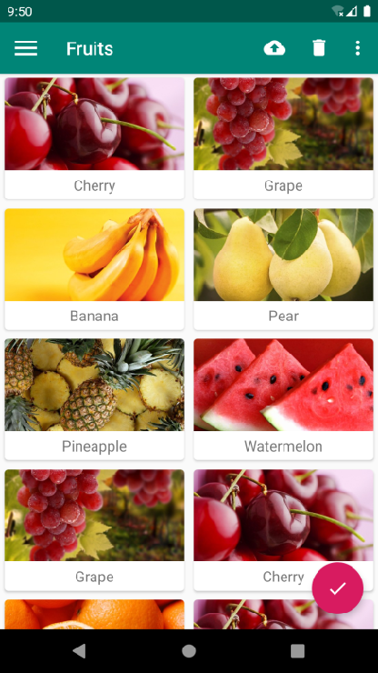

**图 12.14　解决 RecyclerView 遮挡 Toolbar 的问题**

虽说使用 AppBarLayout 已经成功解决了 RecyclerView 遮挡 Toolbar 的问题，但是刚才提到过，AppBarLayout 中应用了一些 Material Design 的设计理念，好像从上面的例子完全体现不出来呀。事实上，当 RecyclerView 滚动的时候就已经将滚动事件通知给 AppBarLayout 了，只是我们还没进行处理而已。那么下面就让我们来进一步优化，看看 AppBarLayout 到底能实现什么样的 Material Design 效果。

当 AppBarLayout 接收到滚动事件的时候，它内部的子控件其实是可以指定如何去响应这些事件的，通过 `app:layout_scrollFlags` 属性就能实现。修改 activity_main.xml 中的代码，如下所示：

```xml
<androidx.drawerlayout.widget.DrawerLayout
    xmlns:android="http://schemas.android.com/apk/res/android"
    xmlns:app="http://schemas.android.com/apk/res-auto"
    android:id="@+id/drawerLayout"
    android:layout_width="match_parent"
    android:layout_height="match_parent">

    <androidx.coordinatorlayout.widget.CoordinatorLayout
        android:layout_width="match_parent"
        android:layout_height="match_parent">

        <com.google.android.material.appbar.AppBarLayout
            android:layout_width="match_parent"
            android:layout_height="wrap_content">

            <androidx.appcompat.widget.Toolbar
                android:id="@+id/toolbar"
                android:layout_width="match_parent"
                android:layout_height="?attr/actionBarSize"
                android:background="@color/colorPrimary"
                android:theme="@style/ThemeOverlay.AppCompat.Dark.ActionBar"
                app:popupTheme="@style/ThemeOverlay.AppCompat.Light"
                app:layout_scrollFlags="scroll|enterAlways|snap" />

        </com.google.android.material.appbar.AppBarLayout>
        ...
    </androidx.coordinatorlayout.widget.CoordinatorLayout>
    ...
</androidx.drawerlayout.widget.DrawerLayout>
```

这里在 Toolbar 中添加了一个 `app:layout_scrollFlags` 属性，并将这个属性的值指定成了 `scroll|enterAlways|snap`。其中，`scroll` 表示当 RecyclerView 向上滚动的时候，Toolbar 会跟着一起向上滚动并实现隐藏；`enterAlways` 表示当 RecyclerView 向下滚动的时候，Toolbar 会跟着一起向下滚动并重新显示；`snap` 表示当 Toolbar 还没有完全隐藏或显示的时候，会根据当前滚动的距离，自动选择是隐藏还是显示。

我们要改动的就只有这一行代码而已，现在重新运行一下程序，并向上滚动 RecyclerView，效果如图 12.15 所示。

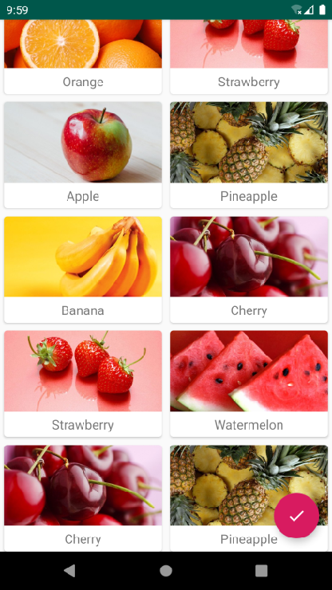

**图 12.15　向上滚动 RecyclerView 隐藏 Toolbar**

可以看到，随着我们向上滚动 RecyclerView，Toolbar 竟然消失了！而向下滚动 RecyclerView，Toolbar 又会重新出现。这其实也是 Material Design 中的一项重要设计思想，因为当用户在向上滚动 RecyclerView 的时候，其注意力肯定是在 RecyclerView 的内容上的，这个时候如果 Toolbar 还占据着屏幕空间，就会在一定程度上影响用户的阅读体验，而将 Toolbar 隐藏则可以让阅读体验达到最佳状态。当用户需要操作 Toolbar 上的功能时，只需要轻微向下滚动，Toolbar 就会重新出现。这种设计方式既保证了用户的最佳阅读效果，又不影响任何功能上的操作，Material Design 考虑得就是这么细致入微。

当然了，像这种功能，如果是使用 ActionBar 的话，那就完全不可能实现了，Toolbar 的出现为我们提供了更多的可能。

## 12.6　下拉刷新

下拉刷新这种功能早就不是什么新鲜的东西了，所有的应用里都会有这个功能。不过市面上现有的下拉刷新功能在风格上各不相同，并且和 Material Design 还有些格格不入的感觉。因此，Google 为了让 Android 的下拉刷新风格能有一个统一的标准，在 Material Design 中制定了一个官方的设计规范。当然，我们并不需要深入了解这个规范到底是什么样的，因为 Google 早就提供好了现成的控件，我们在项目中直接使用就可以了。

SwipeRefreshLayout 就是用于实现下拉刷新功能的核心类，我们把想要实现下拉刷新功能的控件放置到 SwipeRefreshLayout 中，就可以迅速让这个控件支持下拉刷新。那么在 MaterialTest 项目中，应该支持下拉刷新功能的控件自然就是 RecyclerView 了。

使用 SwipeRefreshLayout 之前首先需要在 app/build.gradle 文件中添加如下依赖：

```gradle
dependencies {
...
implementation?"androidx.swiperefreshlayout:swiperefreshlayout:1.0.0"
}
```

由于 SwipeRefreshLayout 的用法也比较简单，下面我们就直接开始使用了。修改 activity_main.xml 中的代码，如下所示：

```xml
<androidx.drawerlayout.widget.DrawerLayout
    xmlns:android="http://schemas.android.com/apk/res/android"
    xmlns:app="http://schemas.android.com/apk/res-auto"
    android:id="@+id/drawerLayout"
    android:layout_width="match_parent"
    android:layout_height="match_parent">

    <androidx.coordinatorlayout.widget.CoordinatorLayout
        android:layout_width="match_parent"
        android:layout_height="match_parent">
        ...
        <androidx.swiperefreshlayout.widget.SwipeRefreshLayout
            android:id="@+id/swipeRefresh"
            android:layout_width="match_parent"
            android:layout_height="match_parent"
            app:layout_behavior="@string/appbar_scrolling_view_behavior">

            <androidx.recyclerview.widget.RecyclerView
                android:id="@+id/recyclerView"
                android:layout_width="match_parent"
                android:layout_height="match_parent"
                app:layout_behavior="@string/appbar_scrolling_view_behavior" />

        </androidx.swiperefreshlayout.widget.SwipeRefreshLayout>
        ...
    </androidx.coordinatorlayout.widget.CoordinatorLayout>
    ...
</androidx.drawerlayout.widget.DrawerLayout>
```

可以看到，这里我们在 RecyclerView 的外面又嵌套了一层 SwipeRefreshLayout，这样 RecyclerView 就自动拥有下拉刷新功能了。另外需要注意，由于 RecyclerView 现在变成了 SwipeRefreshLayout 的子控件，因此之前使用 `app:layout_behavior` 声明的布局行为现在也要移到 SwipeRefreshLayout 中才行。

不过这还没有结束，虽然 RecyclerView 已经支持下拉刷新功能了，但是我们还要在代码中处理具体的刷新逻辑才行。修改 MainActivity 中的代码，如下所示：

```Kotlin
class MainActivity : AppCompatActivity() {
    ...
    override fun onCreate(savedInstanceState: Bundle?) {
        super.onCreate(savedInstanceState)
        setContentView(R.layout.activity_main)
        ...
        swipeRefresh.setColorSchemeResources(R.color.colorPrimary)
        swipeRefresh.setOnRefreshListener {
            refreshFruits(adapter)
        }
    }

    private fun refreshFruits(adapter: FruitAdapter) {
        thread {
            Thread.sleep(2000)
            runOnUiThread {
                initFruits()
                adapter.notifyDataSetChanged()
                swipeRefresh.isRefreshing = false
            }
        }
    }
    ...
}
```

这段代码应该还是比较好理解的，首先调用 SwipeRefreshLayout 的 `setColorSchemeResources()` 方法来设置下拉刷新进度条的颜色，这里我们就使用主题中的 `colorPrimary` 作为进度条的颜色了。接着调用 `setOnRefreshListener()` 方法来设置一个下拉刷新的监听器，当用户进行了下拉刷新操作时，就会回调到 Lambda 表达式当中，然后我们在这里去处理具体的刷新逻辑就可以了。

通常情况下，当触发了下拉刷新事件，应该是去网络上请求最新的数据，然后再将这些数据展示出来。这里简单起见，我们就不和网络进行交互了，而是调用一个 `refreshFruits()` 方法进行本地刷新操作。`refreshFruits()` 方法中先是开启了一个线程，然后将线程沉睡两秒钟。之所以这么做，是因为本地刷新操作速度非常快，如果不将线程沉睡的话，刷新立刻就结束了，从而看不到刷新的过程。沉睡结束之后，这里使用了 `runOnUiThread()` 方法将线程切换回主线程，然后调用 `initFruits()` 方法重新生成数据，接着再调用 FruitAdapter 的 `notifyDataSetChanged()` 方法通知数据发生了变化，最后调用 SwipeRefreshLayout 的 `setRefreshing()` 方法并传入 `false`，表示刷新事件结束，并隐藏刷新进度条。

现在可以重新运行一下程序了，在屏幕的主界面向下拖动，会有一个下拉刷新的进度条出现，松手后就会自动进行刷新了，效果如图 12.16 所示。

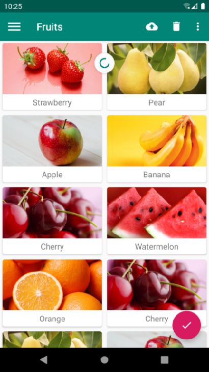

**图 12.16　实现下拉刷新效果**

下拉刷新的进度条只会停留两秒钟，之后就会自动消失，界面上的水果数据也会随之更新。

这样我们就把下拉刷新的功能也成功实现了，并且这就是 Material Design 中规定的最标准的下拉刷新效果，还有什么会比这个更好看呢？目前我们的项目中已经应用了众多 Material Design 的效果，Material 库中的常用控件也学了大半了。不过本章的学习之旅还没有结束，在最后的尾声部分，我们再来实现一个非常震撼的 Material Design 效果——可折叠式标题栏。

## 12.7　可折叠式标题栏

虽说我们现在的标题栏是使用 Toolbar 来编写的，不过它看上去和传统的 ActionBar 没什么两样，只不过可以响应 RecyclerView 的滚动事件来进行隐藏和显示。而 Material Design 中并没有限定标题栏必须是长这个样子的，事实上，我们可以根据自己的喜好随意定制标题栏的样式。那么本节中我们就来实现一个可折叠式标题栏的效果，这需要借助 CollapsingToolbarLayout 这个工具。

### 12.7.1　CollapsingToolbarLayout

顾名思义，CollapsingToolbarLayout 是一个作用于 Toolbar 基础之上的布局，它也是由 Material 库提供的。CollapsingToolbarLayout 可以让 Toolbar 的效果变得更加丰富，不仅仅是展示一个标题栏，而且能够实现非常华丽的效果。

不过，CollapsingToolbarLayout 是不能独立存在的，它在设计的时候就被限定只能作为 AppBarLayout 的直接子布局来使用。而 AppBarLayout 又必须是 CoordinatorLayout 的子布局，因此本节中我们要实现的功能其实需要综合运用前面所学的各种知识。那么话不多说，这就开始吧。

首先我们需要一个额外的 Activity 作为水果的详情展示界面，右击 com.example.materialtest 包 →New→Activity→Empty Activity，创建一个 FruitActivity，并将布局名指定成 activity_fruit.xml，然后我们开始编写水果详情展示界面的布局。

由于整个布局文件比较复杂，这里我准备采用分段编写的方式。activity_fruit.xml 中的内容主要分为两部分，一个是水果标题栏，一个是水果内容详情，我们来一步步实现。

首先实现标题栏部分，这里使用 CoordinatorLayout 作为最外层布局，如下所示：

```xml
<androidx.coordinatorlayout.widget.CoordinatorLayout
    xmlns:android="http://schemas.android.com/apk/res/android"
    xmlns:app="http://schemas.android.com/apk/res-auto"
    android:layout_width="match_parent"
    android:layout_height="match_parent">

</androidx.coordinatorlayout.widget.CoordinatorLayout>
```

一开始的代码还是比较简单的，相信没有什么需要解释的地方。注意要始终记得定义一个 `xmlns:app` 的命名空间，在 Material Design 的开发中会经常用到它。

接着我们在 CoordinatorLayout 中嵌套一个 AppBarLayout，如下所示：

```xml
<androidx.coordinatorlayout.widget.CoordinatorLayout
    xmlns:android="http://schemas.android.com/apk/res/android"
    xmlns:app="http://schemas.android.com/apk/res-auto"
    android:layout_width="match_parent"
    android:layout_height="match_parent">

    <com.google.android.material.appbar.AppBarLayout
        android:id="@+id/appBar"
        android:layout_width="match_parent"
        android:layout_height="250dp">
    </com.google.android.material.appbar.AppBarLayout>

</androidx.coordinatorlayout.widget.CoordinatorLayout>
```

目前为止也没有什么难理解的地方，我们给 AppBarLayout 定义了一个 id，将它的宽度指定为 `match_parent`，高度指定为 250 dp。当然这里的高度值你可以随意指定，不过我尝试之后发现 250 dp 的视觉效果比较好。

接下来我们在 AppBarLayout 中再嵌套一个 CollapsingToolbarLayout，如下所示：

```xml
<androidx.coordinatorlayout.widget.CoordinatorLayout
    xmlns:android="http://schemas.android.com/apk/res/android"
    xmlns:app="http://schemas.android.com/apk/res-auto"
    android:layout_width="match_parent"
    android:layout_height="match_parent">

    <com.google.android.material.appbar.AppBarLayout
        android:id="@+id/appBar"
        android:layout_width="match_parent"
        android:layout_height="250dp">

        <com.google.android.material.appbar.CollapsingToolbarLayout
            android:id="@+id/collapsingToolbar"
            android:layout_width="match_parent"
            android:layout_height="match_parent"
            android:theme="@style/ThemeOverlay.AppCompat.Dark.ActionBar"
            app:contentScrim="@color/colorPrimary"
            app:layout_scrollFlags="scroll|exitUntilCollapsed">
        </com.google.android.material.appbar.CollapsingToolbarLayout>

    </com.google.android.material.appbar.AppBarLayout>

</androidx.coordinatorlayout.widget.CoordinatorLayout>
```

从现在开始就稍微有点难理解了，这里我们使用了新的布局 CollapsingToolbarLayout。其中，`id`、`layout_width` 和 `layout_height` 这几个属性比较简单，我就不解释了。`android:theme` 属性指定了一个 ThemeOverlay.AppCompat.Dark.ActionBar 的主题，其实对于这部分我们也并不陌生，因为之前在 `activity_main.xml` 中给 Toolbar 指定的也是这个主题，只不过这里要实现更加高级的 Toolbar 效果，因此需要将这个主题的指定提到上一层来。`app:contentScrim` 属性用于指定 CollapsingToolbarLayout 在趋于折叠状态以及折叠之后的背景色，其实 CollapsingToolbarLayout 在折叠之后就是一个普通的 Toolbar，那么背景色肯定应该是 `colorPrimary` 了，具体的效果我们待会儿就能看到。`app:layout_scrollFlags` 属性我们也是见过的，只不过之前是给 Toolbar 指定的，现在也移到外面来了。其中，`scroll` 表示 CollapsingToolbarLayout 会随着水果内容详情的滚动一起滚动，`exitUntilCollapsed` 表示当 CollapsingToolbarLayout 随着滚动完成折叠之后就保留在界面上，不再移出屏幕。

接下来，我们在 CollapsingToolbarLayout 中定义标题栏的具体内容，如下所示：

```xml
<androidx.coordinatorlayout.widget.CoordinatorLayout
    xmlns:android="http://schemas.android.com/apk/res/android"
    xmlns:app="http://schemas.android.com/apk/res-auto"
    android:layout_width="match_parent"
    android:layout_height="match_parent">

    <com.google.android.material.appbar.AppBarLayout
        android:id="@+id/appBar"
        android:layout_width="match_parent"
        android:layout_height="250dp">

        <com.google.android.material.appbar.CollapsingToolbarLayout
            android:id="@+id/collapsingToolbar"
            android:layout_width="match_parent"
            android:layout_height="match_parent"
            android:theme="@style/ThemeOverlay.AppCompat.Dark.ActionBar"
            app:contentScrim="@color/colorPrimary"
            app:layout_scrollFlags="scroll|exitUntilCollapsed">

            <ImageView
                android:id="@+id/fruitImageView"
                android:layout_width="match_parent"
                android:layout_height="match_parent"
                android:scaleType="centerCrop"
                app:layout_collapseMode="parallax" />

            <androidx.appcompat.widget.Toolbar
                android:id="@+id/toolbar"
                android:layout_width="match_parent"
                android:layout_height="?attr/actionBarSize"
                app:layout_collapseMode="pin" />

        </com.google.android.material.appbar.CollapsingToolbarLayout>

    </com.google.android.material.appbar.AppBarLayout>

</androidx.coordinatorlayout.widget.CoordinatorLayout>
```

可以看到，我们在 CollapsingToolbarLayout 中定义了一个 ImageView 和一个 Toolbar，也就意味着，这个高级版的标题栏将是由普通的标题栏加上图片组合而成的。这里定义的大多数属性我们是已经见过的，就不再解释了，只有一个 `app:layout_collapseMode` 比较陌生。它用于指定当前控件在 CollapsingToolbarLayout 折叠过程中的折叠模式，其中 Toolbar 指定成 pin，表示在折叠的过程中位置始终保持不变，ImageView 指定成 parallax，表示会在折叠的过程中产生一定的错位偏移，这种模式的视觉效果会非常好。

这样我们就将水果标题栏的界面编写完成了，下面开始编写水果内容详情部分。继续修改 activity_fruit.xml 中的代码，如下所示：

```xml
<androidx.coordinatorlayout.widget.CoordinatorLayout
    xmlns:android="http://schemas.android.com/apk/res/android"
    xmlns:app="http://schemas.android.com/apk/res-auto"
    android:layout_width="match_parent"
    android:layout_height="match_parent">

    <com.google.android.material.appbar.AppBarLayout
        android:id="@+id/appBar"
        android:layout_width="match_parent"
        android:layout_height="250dp">
        ...
    </com.google.android.material.appbar.AppBarLayout>

    <androidx.core.widget.NestedScrollView
        android:layout_width="match_parent"
        android:layout_height="match_parent"
        app:layout_behavior="@string/appbar_scrolling_view_behavior">

    </androidx.core.widget.NestedScrollView>

</androidx.coordinatorlayout.widget.CoordinatorLayout>
```

水果内容详情的最外层布局使用了一个 NestedScrollView，注意它和 AppBarLayout 是平级的。我们之前在 11.2.1 小节学过 ScrollView 的用法，它允许使用滚动的方式来查看屏幕以外的数据，而 NestedScrollView 在此基础之上还增加了嵌套响应滚动事件的功能。由于 CoordinatorLayout 本身已经可以响应滚动事件了，因此我们在它的内部就需要使用 NestedScrollView 或 RecyclerView 这样的布局。另外，这里还通过 `app:layout_behavior` 属性指定了一个布局行为，这和之前在 RecyclerView 中的用法是一模一样的。

不管是 ScrollView 还是 NestedScrollView，它们的内部都只允许存在一个直接子布局。因此，如果我们想要在里面放入很多东西的话，通常会先嵌套一个 LinearLayout，然后再在 LinearLayout 中放入具体的内容就可以了，如下所示：

```xml
<androidx.coordinatorlayout.widget.CoordinatorLayout
    xmlns:android="http://schemas.android.com/apk/res/android"
    xmlns:app="http://schemas.android.com/apk/res-auto"
    android:layout_width="match_parent"
    android:layout_height="match_parent">
    ...
    <androidx.core.widget.NestedScrollView
        android:layout_width="match_parent"
        android:layout_height="match_parent"
        app:layout_behavior="@string/appbar_scrolling_view_behavior">

        <LinearLayout
            android:orientation="vertical"
            android:layout_width="match_parent"
            android:layout_height="wrap_content">
        </LinearLayout>

    </androidx.core.widget.NestedScrollView>

</androidx.coordinatorlayout.widget.CoordinatorLayout>
```

这里我们嵌套了一个垂直方向的 LinearLayout，并将 `layout_width` 设置为 `match_parent`，将 `layout_height` 设置为 `wrap_content`。

接下来在 LinearLayout 中放入具体的内容，这里我准备使用一个 TextView 来显示水果的内容详情，并将 TextView 放在一个卡片式布局当中，如下所示：

```xml
<androidx.coordinatorlayout.widget.CoordinatorLayout
    xmlns:android="http://schemas.android.com/apk/res/android"
    xmlns:app="http://schemas.android.com/apk/res-auto"
    android:layout_width="match_parent"
    android:layout_height="match_parent">
    ...
    <androidx.core.widget.NestedScrollView
        android:layout_width="match_parent"
        android:layout_height="match_parent"
        app:layout_behavior="@string/appbar_scrolling_view_behavior">

        <LinearLayout
            android:orientation="vertical"
            android:layout_width="match_parent"
            android:layout_height="wrap_content">

            <com.google.android.material.card.MaterialCardView
                android:layout_width="match_parent"
                android:layout_height="wrap_content"
                android:layout_marginBottom="15dp"
                android:layout_marginLeft="15dp"
                android:layout_marginRight="15dp"
                android:layout_marginTop="35dp"
                app:cardCornerRadius="4dp">

                <TextView
                    android:id="@+id/fruitContentText"
                    android:layout_width="wrap_content"
                    android:layout_height="wrap_content"
                    android:layout_margin="10dp" />

            </com.google.android.material.card.MaterialCardView>

        </LinearLayout>

    </androidx.core.widget.NestedScrollView>

</androidx.coordinatorlayout.widget.CoordinatorLayout>
```

这段代码也没有什么难理解的地方，都是我们学过的知识。需要注意的是，这里为了让界面更加美观，我在 MaterialCardView 和 TextView 上都加了一些边距。其中，MaterialCardView 的 marginTop 加了 35 dp 的边距，这是为下面要编写的东西留出空间。

好的，这样就把水果标题栏和水果内容详情的界面都编写完了，不过我们还可以在界面上再添加一个悬浮按钮。这个悬浮按钮并不是必需的，根据具体的需求添加就可以了，如果加入的话，我们将获得一些额外的动画效果。

为了做出示范，我就准备在 activity_fruit.xml 中加入一个悬浮按钮了。这个界面是一个水果详情展示界面，那么我就加入一个表示评论作用的悬浮按钮吧。首先需要提前准备好一个图标，这里我放置了一张 ic_comment.png 到 drawable-xxhdpi 目录下。然后修改 activity_fruit.xml 中的代码，如下所示：

```xml
<androidx.coordinatorlayout.widget.CoordinatorLayout
    xmlns:android="http://schemas.android.com/apk/res/android"
    xmlns:app="http://schemas.android.com/apk/res-auto"
    android:layout_width="match_parent"
    android:layout_height="match_parent">

    <com.google.android.material.appbar.AppBarLayout
        android:id="@+id/appBar"
        android:layout_width="match_parent"
        android:layout_height="250dp">
        ...
    </com.google.android.material.appbar.AppBarLayout>

    <androidx.core.widget.NestedScrollView
        android:layout_width="match_parent"
        android:layout_height="match_parent"
        app:layout_behavior="@string/appbar_scrolling_view_behavior">
        ...
    </androidx.core.widget.NestedScrollView>

    <com.google.android.material.floatingactionbutton.FloatingActionButton
        android:layout_width="wrap_content"
        android:layout_height="wrap_content"
        android:layout_margin="16dp"
        android:src="@drawable/ic_comment"
        app:layout_anchor="@id/appBar"
        app:layout_anchorGravity="bottom|end" />

</androidx.coordinatorlayout.widget.CoordinatorLayout>
```

可以看到，这里加入了一个 FloatingActionButton，它和 AppBarLayout 以及 NestedScrollView 是平级的。FloatingActionButton 中使用 `app:layout_anchor` 属性指定了一个锚点，我们将锚点设置为 AppBarLayout，这样悬浮按钮就会出现在水果标题栏的区域内，接着又使用 `app:layout_anchorGravity` 属性将悬浮按钮定位在标题栏区域的右下角。其他一些属性比较简单，就不再进行解释了。

好了，现在我们终于将整个 activity_fruit.xml 布局都编写完了，内容虽然比较长，但由于是分段编写的，并且每一步我都进行了详细的说明，相信你应该看得很明白吧。

界面完成了之后，接下来我们开始编写功能逻辑，修改 FruitActivity 中的代码，如下所示：

```Kotlin
class FruitActivity : AppCompatActivity() {

    companion object {
        const val FRUIT_NAME = "fruit_name"
        const val FRUIT_IMAGE_ID = "fruit_image_id"
    }

    override fun onCreate(savedInstanceState: Bundle?) {
        super.onCreate(savedInstanceState)
        setContentView(R.layout.activity_fruit)
        val fruitName = intent.getStringExtra(FRUIT_NAME) ?: ""
        val fruitImageId = intent.getIntExtra(FRUIT_IMAGE_ID, 0)
        setSupportActionBar(toolbar)
        supportActionBar?.setDisplayHomeAsUpEnabled(true)
        collapsingToolbar.title = fruitName
        Glide.with(this).load(fruitImageId).into(fruitImageView)
        fruitContentText.text = generateFruitContent(fruitName)
    }

    override fun onOptionsItemSelected(item: MenuItem): Boolean {
        when (item.itemId) {
            android.R.id.home -> {
                finish()
                return true
            }
        }
        return super.onOptionsItemSelected(item)
    }

    private fun generateFruitContent(fruitName: String) = fruitName.repeat(500)

}
```

FruitActivity 中的代码并不是很复杂。首先，在 `onCreate()` 方法中，我们通过 Intent 获取了传入的水果名和水果图片的资源 id。接着使用了 Toolbar 的标准用法，将它作为 ActionBar 显示，并启用 Home 按钮。由于 Home 按钮的默认图标就是一个返回箭头，这正是我们所期望的，因此就不用额外设置别的图标了。

接下来开始填充界面上的内容，调用 CollapsingToolbarLayout 的 `setTitle()` 方法，将水果名设置成当前界面的标题，然后使用 Glide 加载传入的水果图片，并设置到标题栏的 ImageView 上面。接着需要填充水果的内容详情，由于这只是一个示例程序，并不需要什么真实的数据，所以我使用了一个 `generateFruitContent()` 方法将水果名循环拼接 500 次，从而生成了一个比较长的字符串，将它设置到了 TextView 上面。

最后，我们在 `onOptionsItemSelected()` 方法中处理了 Home 按钮的点击事件，当点击这个按钮时，就调用 `finish()` 方法关闭当前的 Activity，从而返回上一个 Activity。

所有工作都完成了吗？其实还差最关键的一步，就是处理 RecyclerView 的点击事件，不然的话，我们根本就无法打开 FruitActivity。修改 FruitAdapter 中的代码，如下所示：

```Kotlin
class FruitAdapter(val context: Context, val fruitList: List<Fruit>) :
        RecyclerView.Adapter<FruitAdapter.ViewHolder>() {
    ...
    override fun onCreateViewHolder(parent: ViewGroup, viewType: Int): ViewHolder {
        val view = LayoutInflater.from(context).inflate(R.layout.fruit_item, parent, false)
        val holder = ViewHolder(view)
        holder.itemView.setOnClickListener {
            val position = holder.adapterPosition
            val fruit = fruitList[position]
            val intent = Intent(context, FruitActivity::class.java).apply {
                putExtra(FruitActivity.FRUIT_NAME, fruit.name)
                putExtra(FruitActivity.FRUIT_IMAGE_ID, fruit.imageId)
            }
            context.startActivity(intent)
        }
        return holder
    }
    ...
}
```

最关键的一步其实也是最简单的，这里我们给 fruit_item.xml 的最外层布局注册了一个点击事件监听器，然后在点击事件中获取当前点击项的水果名和水果图片资源 id，把它们传入 Intent 中，最后调用 `startActivity()` 方法启动 FruitActivity。

见证奇迹的时刻到了，现在重新运行一下程序，并点击界面上的任意一个水果，比如我点击了葡萄，效果如图 12.17 所示。


**图 12.17　水果的详情展示界面**

你没有看错，如此精美的界面就是我们亲手敲出来的。这个界面上的内容分为 3 部分：水果标题栏、水果内容详情和悬浮按钮。相信你一眼就能将它们区分出来吧。Toolbar 和水果背景图完美地融合到了一起，既保证了图片的展示空间，又不影响 Toolbar 的任何功能，那个向左的箭头就是用来返回上一个 Activity 的。

不过这并不是全部，真正的好戏还在后头。我们尝试向上拖动水果内容详情，你会发现水果背景图上的标题会慢慢缩小，并且背景图会产生一些错位偏移的效果，如图 12.18 所示。


**图 12.18　向上拖动水果内容详情**

这是由于用户想要查看水果的内容详情，此时界面的重点在具体的内容上面，因此标题栏就会自动进行折叠，从而节省屏幕空间。

继续向上拖动，直到标题栏变成完全折叠状态，效果如图 12.19 所示。


**图 12.19　标题栏变成完全折叠状态**

可以看到，标题栏的背景图片不见了，悬浮按钮也自动消失了，现在水果标题栏变成了一个最普通的 Toolbar。这是由于用户正在阅读具体的内容，我们需要给他们提供最充分的阅读空间。而如果这个时候向下拖动水果内容详情，就会执行一个完全相反的动画过程，最终恢复成图 12.17 的界面效果。

不知道你有没有被这个效果所感动呢？在这里，我真心地感谢 Material 库给我们带来这么棒的 UI 体验。

### 12.7.2　充分利用系统状态栏空间

虽说现在水果详情展示界面的效果已经非常华丽了，但这并不代表我们不能再进一步地提升。观察一下图 12.17，你会发现水果的背景图片和系统的状态栏总有一些不搭的感觉，如果我们能将背景图和状态栏融合到一起，那这个视觉体验绝对能提升好几个档次。

不过，在 Android 5.0 系统之前，我们是无法对状态栏的背景或颜色进行操作的，那个时候也还没有 Material Design 的概念，但是 Android 5.0 及之后的系统都是支持这个功能的。恰好我们整本书的所有代码最低兼容的就是 Android 5.0 系统，因此这里完全可以进一步地提升视觉体验。

想要让背景图能够和系统状态栏融合，需要借助 `android:fitsSystemWindows` 这个属性来实现。在 CoordinatorLayout、AppBarLayout、CollapsingToolbarLayout 这种嵌套结构的布局中，将控件的 `android:fitsSystemWindows` 属性指定成 `true`，就表示该控件会出现在系统状态栏里。对应到我们的程序，那就是水果标题栏中的 ImageView 应该设置这个属性了。不过只给 ImageView 设置这个属性是没有用的，我们必须将 ImageView 布局结构中的所有父布局都设置上这个属性才可以，修改 activity_fruit.xml 中的代码，如下所示：

```xml
<androidx.coordinatorlayout.widget.CoordinatorLayout
    xmlns:android="http://schemas.android.com/apk/res/android"
    xmlns:app="http://schemas.android.com/apk/res-auto"
    android:layout_width="match_parent"
    android:layout_height="match_parent"
    android:fitsSystemWindows="true">

    <com.google.android.material.appbar.AppBarLayout
        android:id="@+id/appBar"
        android:layout_width="match_parent"
        android:layout_height="250dp"
        android:fitsSystemWindows="true">

        <com.google.android.material.appbar.CollapsingToolbarLayout
            android:id="@+id/collapsingToolbar"
            android:layout_width="match_parent"
            android:layout_height="match_parent"
            android:theme="@style/ThemeOverlay.AppCompat.Dark.ActionBar"
            android:fitsSystemWindows="true"
            app:contentScrim="@color/colorPrimary"
            app:layout_scrollFlags="scroll|exitUntilCollapsed">

            <ImageView
                android:id="@+id/fruitImageView"
                android:layout_width="match_parent"
                android:layout_height="match_parent"
                android:scaleType="centerCrop"
                android:fitsSystemWindows="true"
                app:layout_collapseMode="parallax" />
            ...
        </com.google.android.material.appbar.CollapsingToolbarLayout>

    </com.google.android.material.appbar.AppBarLayout>
    ...
</androidx.coordinatorlayout.widget.CoordinatorLayout>
```

但是，即使我们将 `android:fitsSystemWindows` 属性都设置好了也没有用，因为还必须在程序的主题中将状态栏颜色指定成透明色才行。指定成透明色的方法很简单，在主题中将 `android:statusBarColor` 属性的值指定成 `@android:color/transparent` 就可以了。

打开 res/values/styles.xml 文件，对主题的内容进行修改，如下所示：

```xml
<resources>

    <!-- Base application theme. -->
    <style name="AppTheme" parent="Theme.AppCompat.Light.NoActionBar">
        <!-- Customize your theme here. -->
        <item name="colorPrimary">@color/colorPrimary</item>
        <item name="colorPrimaryDark">@color/colorPrimaryDark</item>
        <item name="colorAccent">@color/colorAccent</item>
    </style>

    <style name="FruitActivityTheme" parent="AppTheme">
        <item name="android:statusBarColor">@android:color/transparent</item>
    </style>

</resources>
```

这里我们定义了一个 FruitActivityTheme 主题，它是专门给 FruitActivity 使用的。FruitActivityTheme 的父主题是 AppTheme，也就是说，它继承了 AppTheme 中的所有特性。在此基础之上，我们将 FruitActivityTheme 中的状态栏的颜色指定成透明色。

最后，还需要让 FruitActivity 使用这个主题才可以，修改 AndroidManifest.xml 中的代码，如下所示：

```xml
<manifest xmlns:android="http://schemas.android.com/apk/res/android"
    package="com.example.materialtest">

    <application
        android:allowBackup="true"
        android:icon="@mipmap/ic_launcher"
        android:label="@string/app_name"
        android:roundIcon="@mipmap/ic_launcher_round"
        android:supportsRtl="true"
        android:theme="@style/AppTheme">
        ...
        <activity
            android:name=".FruitActivity"
            android:theme="@style/FruitActivityTheme">
        </activity>
    </application>

</manifest>
```

这里使用 `android:theme` 属性单独给 FruitActivity 指定了 FruitActivityTheme 这个主题，这样我们就大功告成了。现在重新运行 MaterialTest 程序，水果详情展示界面的效果就会如图 12.20 所示。


**图 12.20　背景图和状态栏融合的效果**

相信我，再对比一下图 12.17 的效果，这两种视觉体验绝对不是在一个档次上的。

好了，关于 Material Design 的知识我们就学到这里，接下来又该进入本章的 Kotlin 课堂了，赶快看一看这次又能学到 Kotlin 的什么新知识吧。

## 12.8　Kotlin 课堂：编写好用的工具方法

到目前为止，我们已经将 Kotlin 大部分系统性的知识点学习完了。掌握了如此多的 Kotlin 特性，你知道该如何对它们进行灵活运用吗？

事实上，Kotlin 提供的丰富语法特性给我们提供了无限扩展的可能，各种复杂的 API 经过特殊的封装处理之后都能变得简单易用。比如我们之前在第 7 章体验过的 KTX 库，就是 Google 为了简化许多 API 的用法而专门设计的。不过 KTX 库所能覆盖到的功能毕竟有限，因此最重要的还是我们要能养成对 Kotlin 的各种特性进行灵活运用的意识。那么在本节的 Kotlin 课堂中，我将带你对几个常用 API 的用法进行简化，从而编写出一些好用的工具方法。

### 12.8.1　求 *N* 个数的最大最小值

两个数比大小这个功能，相信每一位开发者都遇到过。如果我想要获取两个数中较大的那个数，除了使用最基本的 `if` 语句之外，还可以借助 Kotlin 内置的 `max()` 函数，如下所示：

```Kotlin
val a = 10
val b = 15
val larger = max(a, b)
```

这种代码看上去简单直观，也很容易理解，因此好像并没有什么优化的必要。

可是现在如果我们想要在 3 个数中获取最大的那个数，应该怎么写呢？由于 `max()` 函数只能接收两个参数，因此需要先比较前两个数的大小，然后再拿较大的那个数和剩余的数进行比较，写法如下：

```Kotlin
val a = 10
val b = 15
val c = 5
val largest = max(max(a, b), c)
```

有没有觉得代码开始变得复杂了呢？3 个数中获取最大值就需要使用这种嵌套 `max()` 函数的写法了，那如果是 4 个数、5 个数呢？没错，这个时候你就应该意识到，我们是可以对 `max()` 函数的用法进行简化的。

回顾一下，我们之前在第 7 章的 Kotlin 课堂中学过 `vararg` 关键字，它允许方法接收任意多个同等类型的参数，正好满足我们这里的需求。那么我们就可以新建一个 Max.kt 文件，并在其中自定义一个 `max()` 函数，如下所示：

```Kotlin
fun max(vararg nums: Int): Int {
    var maxNum = Int.MIN_VALUE
    for (num in nums) {
        maxNum = kotlin.math.max(maxNum, num)
    }
    return maxNum
}
```

可以看到，这里 `max()` 函数的参数声明中使用了 `vararg` 关键字，也就是说现在它可以接收任意多个整型参数。接着我们使用了一个 `maxNum` 变量来记录所有数的最大值，并在一开始将它赋值成了整型范围的最小值。然后使用 `for-in` 循环遍历 `nums` 参数列表，如果发现当前遍历的数字比 `maxNum` 更大，就将 `maxNum` 的值更新成这个数，最终将 `maxNum` 返回即可。

仅仅经过这样的一层封装之后，我们在使用 `max()` 函数时就会有翻天覆地的变化，比如刚才同样的功能，现在就可以使用如下的写法来实现：

```Kotlin
val a = 10
val b = 15
val c = 5
val largest = max(a, b, c)
```

这样我们就彻底摆脱了嵌套函数调用的写法，现在不管是求 3 个数的最大值还是求 *N* 个数的最大值，只需要不断地给 `max()` 函数传入参数就可以了。

不过，目前我们自定义的 `max()` 函数还有一个缺点，就是它只能求 *N* 个整型数字的最大值，如果我还想求 *N* 个浮点型或长整型数字的最大值，该怎么办呢？当然你可以定义很多个 `max()` 函数的重载，来接收不同类型的参数，因为 Kotlin 中内置的 `max()` 函数也是这么做的。但是这种方案实现起来过于烦琐，而且还会产生大量的重复代码，因此这里我准备使用一种更加巧妙的做法。

Java 中规定，所有类型的数字都是可比较的，因此必须实现 `Comparable` 接口，这个规则在 Kotlin 中也同样成立。那么我们就可以借助泛型，将 `max()` 函数修改成接收任意多个实现 `Comparable` 接口的参数，代码如下所示：

```Kotlin
fun <T : Comparable<T>> max(vararg nums: T): T {
    if (nums.isEmpty()) throw RuntimeException("Params can not be empty.")
    var maxNum = nums[0]
    for (num in nums) {
        if (num > maxNum) {
            maxNum = num
        }
    }
    return maxNum
}
```

可以看到，这里将泛型 `T` 的上界指定成了 `Comparable<T>`，那么参数 `T` 就必然是 `Comparable<T>` 的子类型了。接下来，我们判断 `nums` 参数列表是否为空，如果为空的话就主动抛出一个异常，提醒调用者 `max()` 函数必须传入参数。紧接着将 `maxNum` 的值赋值成 `nums` 参数列表中第一个参数的值，然后同样是遍历参数列表，如果发现了更大的值就对 `maxNum` 进行更新。

经过这样的修改之后，我们就可以更加灵活地使用 `max()` 函数了，比如说求 3 个浮点型数字的最大值，同样也变得轻而易举：

```Kotlin
val a = 3.5
val b = 3.8
val c = 4.1
val largest = max(a, b, c)
```

而且现在不管是双精度浮点型、单精度浮点型，还是短整型、整型、长整型，只要是实现 `Comparable` 接口的子类型，`max()` 函数全部支持获取它们的最大值，是一种一劳永逸的做法。

而如果你想获取 *N* 个数的最小值，实现的方式也是类似的，只需要定义一个 `min()` 函数就可以了，这个功能就当作课后习题留给你来完成吧。

### 12.8.2　简化 Toast 的用法

我们在本书中已经使用过太多次 Toast，相信你已经非常熟悉了，但是用了这么久，你有没有觉得 Toast 用法其实有些烦琐呢？

首先回顾一下 Toast 的标准用法吧，如果想要在界面上弹出一段文字提示需要这样写：

```Kotlin
Toast.makeText(context, "This is Toast", Toast.LENGTH_SHORT).show()
```

是不是很长的一段代码？而且曾经不知道有多少人因为忘记调用最后的 `show()` 方法，导致 Toast 无法弹出，从而产生一些千奇百怪的 bug。

由于 Toast 是非常常用的功能，每次都需要编写这么长的一段代码确实让人很头疼，这个时候你就应该考虑对 Toast 的用法进行简化了。

我们来分析一下，Toast 的 `makeText()` 方法接收 3 个参数：第一个参数是 Toast 显示的上下文环境，必不可少；第二个参数是 Toast 显示的内容，需要由调用方进行指定，可以传入字符串和字符串资源 id 两种类型；第三个参数是 Toast 显示的时长，只支持 `Toast.LENGTH_SHORT` 和 `Toast.LENGTH_LONG` 这两种值，相对来说变化不大。

那么我们就可以给 `String` 类和 `Int` 类各添加一个扩展函数，并在里面封装弹出 Toast 的具体逻辑。这样以后每次想要弹出 Toast 提示时，只需要调用它们的扩展函数就可以了。

新建一个 Toast.kt 文件，并在其中编写如下代码：

```Kotlin
fun String.showToast(context: Context) {
    Toast.makeText(context, this, Toast.LENGTH_SHORT).show()
}

fun Int.showToast(context: Context) {
    Toast.makeText(context, this, Toast.LENGTH_SHORT).show()
}
```

这里分别给 `String` 类和 `Int` 类新增了一个 `showToast()` 函数，并让它们都接收一个 `Context` 参数。然后在函数的内部，我们仍然使用了 Toast 原生 API 用法，只是将弹出的内容改成了 `this`，另外将 Toast 的显示时长固定设置成 `Toast.LENGTH_SHORT`。

那么经过这样的扩展之后，我们以后在使用 Toast 时可以变得多么简单呢？体验一下就知道了，比如同样弹出一段文字提醒就可以这么写：

```Kotlin
"This is Toast".showToast(context)
```

怎么样，比起原生 Toast 的用法，有没有觉得这种写法畅快多了呢？另外，这只是直接弹出一段字符串文本的写法，如果你想弹出一个定义在 strings.xml 中的字符串资源，也非常简单，写法如下：

```Kotlin
R.string.app_name.showToast(context)
```

这两种写法分别调用的就是我们刚才在 `String` 类和 `Int` 类中添加的 `showToast()` 扩展函数。

当然，这种写法其实还存在一个问题，就是 Toast 的显示时长被固定了，如果我现在想要使用 `Toast.LENGTH_LONG` 类型的显示时长该怎么办呢？要解决这个问题，其实最简单的做法就是在 `showToast()` 函数中再声明一个显示时长参数，但是这样每次调用 `showToast()` 函数时都要额外多传入一个参数，无疑增加了使用复杂度。

不知道你现在有没有受到什么启发呢？回顾一下，我们在第 2 章学习 Kotlin 基础语法的时候，曾经学过给函数设定参数默认值的功能。只要借助这个功能，我们就可以在不增加 `showToast()` 函数使用复杂度的情况下，又让它可以支持动态指定显示时长了。修改 Toast.kt 中的代码，如下所示：

```Kotlin
fun String.showToast(context: Context, duration: Int = Toast.LENGTH_SHORT) {
    Toast.makeText(context, this, duration).show()
}

fun Int.showToast(context: Context, duration: Int = Toast.LENGTH_SHORT) {
    Toast.makeText(context, this, duration).show()
}
```

可以看到，我们给 `showToast()` 函数增加了一个显示时长参数，但同时也给它指定了一个参数默认值。这样我们之前所使用的 `showToast()` 函数的写法将完全不受影响，默认会使用 `Toast.LENGTH_SHORT` 类型的显示时长。而如果你想要使用 `Toast.LENGTH_LONG` 的显示时长，只需要这样写就可以了：

```Kotlin
"This is Toast".showToast(context, Toast.LENGTH_LONG)
```

相信我，这样的 Toast 工具一定会给你的开发效率带来巨大的提升。

### 12.8.3　简化 Snackbar 的用法

Snackbar 是我们在本章中学习的新控件，它和 Toast 的用法基本类似，但是又比 Toast 稍微复杂一些。

先来回顾一下 Snackbar 的常规用法吧，如下所示：

```Kotlin
Snackbar.make(view, "This is Snackbar", Snackbar.LENGTH_SHORT)
        .setAction("Action") {
            // 处理具体的逻辑
        }
        .show()
```

可以看到，Snackbar 中 `make()` 方法的第一个参数变成了 `View`，而 Toast 中 `makeText()` 方法的第一个参数是 `Context`，另外 Snackbar 还可以调用 `setAction()` 方法来设置一个额外的点击事件。除了这些区别之外，Snackbar 和 Toast 的其他用法都是相似的。

那么对于这种结构的 API，我们该如何进行简化呢？其实简化的方式并不固定，接下来我即将演示的写法也只是我个人认为比较不错的一种。

由于 `make()` 方法接收一个 `View` 参数，Snackbar 会使用这个 `View` 自动查找最外层的布局，用于展示 Snackbar。因此，我们就可以给 `View` 类添加一个扩展函数，并在里面封装显示 Snackbar 的具体逻辑。新建一个 Snackbar.kt 文件，并编写如下代码：

```Kotlin
fun View.showSnackbar(text: String, duration: Int = Snackbar.LENGTH_SHORT) {
    Snackbar.make(this, text, duration).show()
}

fun View.showSnackbar(resId: Int, duration: Int = Snackbar.LENGTH_SHORT) {
    Snackbar.make(this, resId, duration).show()
}
```

这段代码应该还是很好理解的，和刚才的 `showToast()` 函数比较相似。只是我们将扩展函数添加到了 `View` 类当中，并在参数列表上声明了 Snackbar 要显示的内容以及显示的时长。另外，Snackbar 和 Toast 类似，显示的内容也是支持传入字符串和字符串资源 id 两种类型的，因此这里我们给 `showSnackbar()` 函数进行了两种参数类型的函数重载。

现在想要使用 Snackbar 显示一段文本提示，只需要这样写就可以了：

```Kotlin
view.showSnackbar("This is Snackbar")
```

假如 Snackbar 没有 `setAction()` 方法，那么我们的简化工作到这里就可以结束了。但是 `setAction()` 方法作为 Snackbar 最大的特色之一，如果不能支持的话，我们编写的 `showSnackbar()` 函数也就变得毫无意义了。

这个时候，神通广大的高阶函数又能派上用场了，我们可以让 `showSnackbar()` 函数再额外接收一个函数类型参数，以此来实现 Snackbar 的完整功能支持。修改 Snackbar.kt 中的代码，如下所示：

```Kotlin
fun View.showSnackbar(text: String, actionText: String? = null,
    duration: Int = Snackbar.LENGTH_SHORT, block: (() -> Unit)? = null) {
    val snackbar = Snackbar.make(this, text, duration)
    if (actionText != null && block != null) {
        snackbar.setAction(actionText) {
            block()
        }
    }
    snackbar.show()
}

fun View.showSnackbar(resId: Int, actionResId: Int? = null,
    duration: Int = Snackbar.LENGTH_SHORT, block: (() -> Unit)? = null) {
    val snackbar = Snackbar.make(this, resId, duration)
    if (actionResId != null && block != null) {
        snackbar.setAction(actionResId) {
            block()
        }
    }
    snackbar.show()
}
```

可以看到，这里我们给两个 `showSnackbar()` 函数都增加了一个函数类型参数，并且还增加了一个用于传递给 `setAction()` 方法的字符串或字符串资源 id。这里我们需要将新增的两个参数都设置成可为空的类型，并将默认值都设置成空，然后只有当两个参数都不为空的时候，我们才去调用 Snackbar 的 `setAction()` 方法来设置额外的点击事件。如果触发了点击事件，只需要调用函数类型参数将事件传递给外部的 Lambda 表达式即可。

这样 `showSnackbar()` 函数就拥有比较完整的 Snackbar 功能了，比如本小节最开始的那段示例代码，现在就可以使用如下写法进行实现：

```Kotlin
view.showSnackbar("This is Snackbar", "Action") {
    // 处理具体的逻辑
}
```

怎么样，和 Snackbar 原生 API 的用法相比，我们编写的 `showSnackbar()` 函数是不是要明显简单好用得多？

在本章的 Kotlin 课堂中，我带着你一共编写了 3 个工具方法，分别应用了顶层函数、扩展函数以及高阶函数的知识，当然还用到了像 `vararg`、参数默认值等技巧。Kotlin 给我们提供了太多出色的特性，因此在你学完了这么多特性之后，能否将它们灵活运用就成为了至关重要的事情。本节课里所实现的 3 个工具方法只能算是开胃菜，我非常期待未来你能编写出许多自己的工具方法，将 Kotlin 提供给我们的优秀特性充分发挥出来。

好了，关于 Kotlin 的内容就先讲到这里，下面我们将再次进入本书的特殊环节——Git 时间，学习一下关于 Git 的高级用法。

## 12.9　Git 时间：版本控制工具的高级用法

现在的你对于 Git 应该完全不会感到陌生了吧？通过之前两次 Git 时间的学习，你已经掌握了很多 Git 中常用的命令，像提交代码这种简单的操作相信肯定是难不倒你的。

打开终端界面，进入 MaterialTest 这个项目的根目录，然后执行提交操作：

```bash
git init
git add .
git commit –m "First Commit."
```

这样就将准备工作完成了，下面就让我们开始学习关于 Git 的高级用法。

### 12.9.1　分支的用法

分支是版本控制工具中比较高级且比较重要的一个概念，它主要的作用就是在现有代码的基础上开辟一个分叉口，使得代码可以在主干线和分支线上同时进行开发，且相互之间不会影响。分支的工作原理如图 12.21 所示。

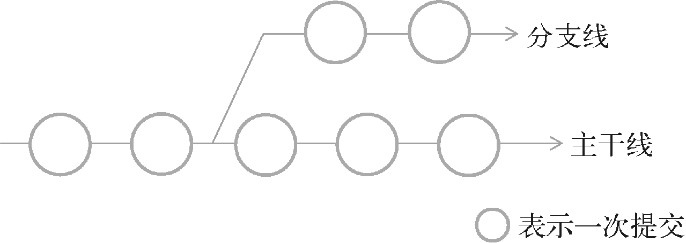

**图 12.21　分支的工作原理示意图**

你也许会有疑惑，为什么需要建立分支呢？只在主干线上进行开发不是挺好的吗？没错，通常情况下，只在主干线上进行开发是完全没有问题的。不过，一旦涉及发布版本的情况，如果不建立分支的话，你就会非常地头疼。举个简单的例子吧，比如说你们公司研发了一款不错的软件，最近刚刚完成，并推出了 1.0 版本。但是领导是不会让你们闲着的，马上提出了新的需求，让你们投入到 1.1 版本的开发工作当中。过了几个星期，1.1 版本的功能已经完成了一半，但是这个时候突然有用户反馈，之前上线的 1.0 版本发现了几个重大的 bug，严重影响软件的正常使用。领导也相当重视这个问题，要求你们立刻修复这些 bug，并对 1.0 版本进行更新，但这个时候你就非常为难了，你会发现根本没法去修复。因为现在 1.1 版本已经开发一半了，如果在现有代码的基础上修复这些 bug，那么更新的 1.0 版本将会带有一半 1.1 版本的功能！

进退两难了是不是？但是如果你使用了分支的话，就完全不会存在这个让人头疼的问题。你只需要在发布 1.0 版本的时候建立一个分支，然后在主干线上继续开发 1.1 版本的功能。当在 1.0 版本上发现任何 bug 的时候，就在分支线上进行修改，然后发布新的 1.0 版本，并记得将修改后的代码合并到主干线上。这样的话，不仅可以轻松解决 1.0 版本存在的 bug，而且保证了主干线上的代码也已经修复了这些 bug，当 1.1 版本发布时，就不会有同样的 bug 存在了。

说了这么多，相信你也已经意识到分支的重要性了，那么我们马上来学习一下如何在 Git 中操作分支吧。

分支的英文是 branch，如果想要查看当前的版本库当中有哪些分支，可以使用 `git branch` 这个命令，结果如图 12.22 所示。


**图 12.22　查看所有分支**

由于目前 MaterialTest 项目中还没有创建过任何分支，因此只有一个 master 分支存在，这也就是前面所说的主干线。接下来我们尝试创建一个分支，命令如下：

```bash
git branch version1.0
```

这样就创建了一个名为 version1.0 的分支，我们再次输入 `git branch` 这个命令来检查一下，结果如图 12.23 所示。

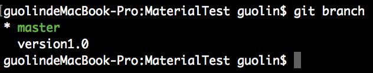

**图 12.23　再次查看所有分支**

可以看到，果然有一个叫作 version1.0 的分支出现了。你会发现，master 分支的前面有一个“\*”号，说明目前我们的代码还是在 master 分支上的，那么怎样才能切换到 version1.0 这个分支上呢？其实也很简单，只需要使用 `checkout` 命令即可，如下所示：

```bash
git checkout version1.0
```

再次输入 `git branch` 来进行检查，结果如图 12.24 所示。

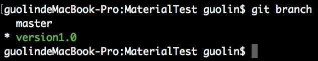

**图 12.24　查看切换分支后的结果**

可以看到，我们已经把代码成功切换到 version1.0 这个分支上了。

需要注意的是，在 version1.0 分支上修改并提交的代码将不会影响到 master 分支。同样的道理，在 master 分支上修改并提交的代码也不会影响到 version1.0 分支。因此，如果我们在 version1.0 分支上修复了一个 bug，在 master 分支上这个 bug 仍然是存在的。这时将修改的代码一行行复制到 master 分支上显然不是一种聪明的做法，最好的办法就是使用 `merge` 命令来完成合并操作，如下所示：

```bash
git checkout master
git merge version1.0
```

仅仅使用这样简单的两行命令，就可以把在 version1.0 分支上修改并提交的内容合并到 master 分支上了。当然，在合并分支的时候还可能出现代码冲突的情况，这个时候你就需要静下心来，慢慢解决这些冲突，Git 在这里就无法帮助你了。

最后，当我们不再需要 version1.0 这个分支的时候，可以使用如下命令将这个分支删除：

```bash
git branch -D version1.0
```

### 12.9.2　与远程版本库协作

可以这样说，如果你是一个人在开发，那么使用版本控制工具就远远无法发挥出它真正强大的功能。没错，所有版本控制工具最重要的一个特点就是可以使用它来进行团队合作开发。每个人的电脑上都会有一份代码，当团队的某个成员在自己的电脑上编写完成了某个功能后，就将代码提交到服务器，其他的成员只需要将服务器上的代码同步到本地，就能保证整个团队所有人的代码都相同。这样的话，每个团队成员就可以各司其职，大家共同来完成一个较为庞大的项目。

那么如何使用 Git 来进行团队合作开发呢？这就需要有一个远程的版本库，团队的每个成员都从这个版本库中获取最原始的代码，然后各自进行开发，并且以后每次提交的代码都同步到远程版本库上就可以了。另外，团队中的每个成员都要养成经常从版本库中获取最新代码的习惯，不然的话，大家的代码就很有可能经常出现冲突。

比如说现在有一个远程版本库的 Git 地址是 [https://github.com/example/test.git](https://github.com/example/test.git)，就可以使用如下命令将代码下载到本地：

```bash
git clone https://github.com/example/test.git
```

之后如果你在这份代码的基础上进行了一些修改和提交，那么怎样才能把本地修改的内容同步到远程版本库上呢？这就需要借助 `push` 命令来完成了，用法如下所示：

```bash
git push origin master
```

`origin` 部分指定的是远程版本库的 Git 地址，`master` 部分指定的是同步到哪一个分支上，上述命令就完成了将本地代码同步到 https://github.com/example/test.git 这个版本库的 `master` 分支上的功能。

知道了将本地的修改同步到远程版本库上的方法，接下来我们看一下如何将远程版本库上的修改同步到本地。Git 提供了两种命令来完成此功能，分别是 `fetch` 和 `pull`。`fetch` 的语法规则和 `push` 是差不多的，如下所示：

```bash
git fetch origin master
```

执行完这个命令后，就会将远程版本库上的代码同步到本地。不过同步下来的代码并不会合并到任何分支上，而是会存放到一个 `origin/master` 分支上，这时我们可以通过 `diff` 命令来查看远程版本库上到底修改了哪些东西：

```bash
git diff origin/master
```

之后再调用 `merge` 命令将 `origin/master` 分支上的修改合并到主分支上即可，如下所示：

```bash
git merge origin/master
```

而 `pull` 命令则是相当于将 `fetch` 和 `merge` 这两个命令放在一起执行了，它可以从远程版本库上获取最新的代码并且合并到本地，用法如下所示：

```bash
git pull origin master
```

也许你现在对远程版本库的使用还是感觉比较抽象，没关系，因为暂时我们只是了解了一下命令的用法，还没进行实践，在第 15 章当中，你将会对远程版本库的用法有更深一层的认识。

## 12.10　小结与点评

学完了本章的所有知识，你有没有觉得无比兴奋呢？反正我是这么觉得的。本章我们的收获实在是太多了，一开始创建了一个什么都没有的空项目，经过一章的学习，最后实现了一个功能如此丰富、界面如此华丽的应用，还有什么事情比这个更让我们有成就感吗？

本章中我们充分利用了 Material 库、AndroidX 库以及一些开源项目，实现了一个高度 Material 化的应用程序。能将这些库中的相关控件熟练掌握，你的 Material Design 技术就算是合格了。

不过说到底，我仍然还是在以开发者的思维给你讲解 Material Design，侧重于如何去实现这些效果。而实际上，Material Design 的设计思维和设计理念才是更加重要的东西。当然，这部分内容其实应该是 UI 设计人员去学习的，如果你也感兴趣的话，可以参考一下 Material Design 的官方网站：[https://material.io/](https://material.io/)。

至于本章的 Kotlin 课堂，我们并没有学习什么新的知识，而是通过编写几个工具方法的示例来引导你学会对 Kotlin 的各种特性进行灵活运用。知识好学，但是思维却是很难培养的，也希望经过本节课的学习能让你引发更多的思考。

除此之外，在本章的 Git 时间中，我们继续对 Git 的用法进行了更深一步的探究，相信你对分支和远程版本库的使用都有了一定层次的了解。

现在你已经足足学习了 12 章的内容，对 Android 应用程序开发的理解应该比较深刻了。那么掌握了这么多的知识，就可以开发出一款好的应用程序了吗？说实话，现在的你还差了些火候，因为你还不知道该如何搭建一个出色的代码架构体系。当然这也是我们下一章中即将学习的内容了——高级程序开发组件 Jetpack。