# 第 13 章　高级程序开发组件，探究 Jetpack

学到这里，现在的你已经完全具备了独立开发一款 Android App 的能力。但是，能够开发出一款 App 和能够开发出一款好的 App 并不是一回事。这里的“好”指的是代码质量优越，项目架构合理，并不是产品本身好不好。

长久以来，Android 官方并没有制定一个项目架构的规范，只要能够实现功能，代码怎么编写都是你的自由。但是不同的人技术水平不同，最终编写出来的代码质量是千差万别的。

由于 Android 官方没有制定规范，为了追求更高的代码质量，慢慢就有第三方的社区和开发者将一些更加高级的项目架构引入到了 Android 平台上，如 MVP、MVVM 等。使用这些架构开发出来的应用程序，在代码质量、可读性、易维护性等方面都有着更加出色的表现，于是这些架构渐渐成为了主流。

后来 Google 或许意识到了这个情况，终于在 2017 年，推出了一个官方的架构组件库——Architecture Components，旨在帮助开发者编写出更加符合高质量代码规范、更具有架构设计的应用程序。2018 年，Google 又推出了一个全新的开发组件工具集 Jetpack，并将 Architecture Components 作为 Jetpack 的一部分纳入其中。当然，Jetpack 并没有就此定版，2019 年又有许多新的组件被加入 Jetpack 当中，未来的 Jetpack 还会不断地继续扩充。

本章我们就来对 Jetpack 中的重要知识点进行学习。

## 13.1　Jetpack 简介

Jetpack 是一个开发组件工具集，它的主要目的是帮助我们编写出更加简洁的代码，并简化我们的开发过程。Jetpack 中的组件有一个特点，它们大部分不依赖于任何 Android 系统版本，这意味着这些组件通常是定义在 AndroidX 库当中的，并且拥有非常好的向下兼容性。

我们先来看一张 Jetpack 目前的“全家福”，如图 13.1 所示。

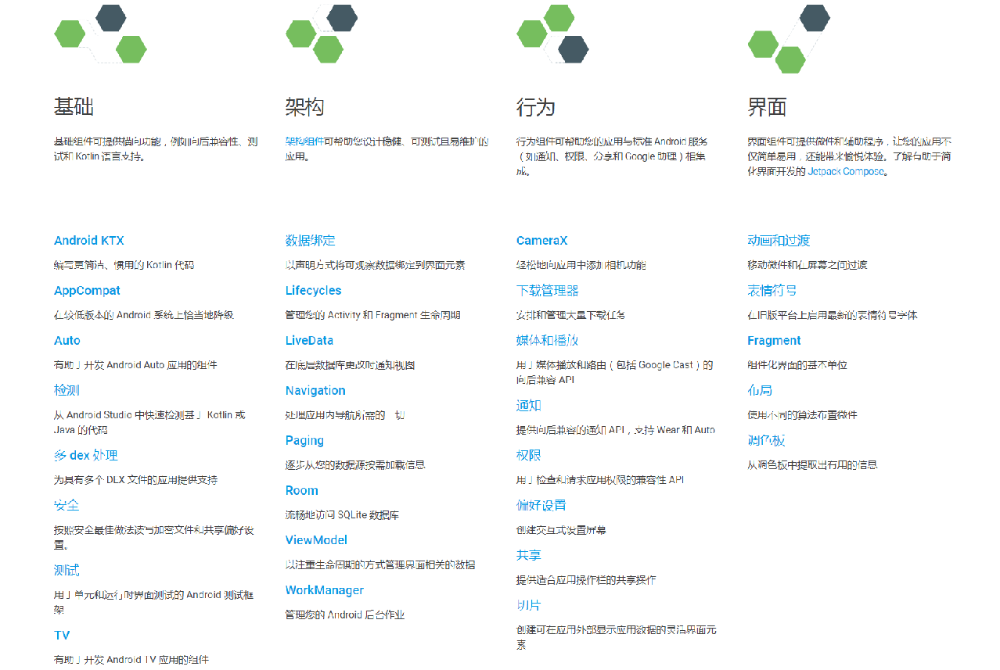

**图 13.1　Jetpack“全家福”**

可以看到，Jetpack 的家族还是非常庞大的，主要由基础、架构、行为、界面这 4 个部分组成。你会发现，里面有许多东西是我们已经学过的，像通知、权限、Fragment 都属于 Jetpack。由此可见，Jetpack 并不全是些新东西，只要是能够帮助开发者更好更方便地构建应用程序的组件，Google 都将其纳入了 Jetpack。

显然这里我们不可能将 Jetpack 中的每一个组件都进行学习，那将会是一个极大的工程。事实上，在这么多的组件当中，最需要我们关注的其实还是架构组件。目前 Android 官方最为推荐的项目架构就是 MVVM，因而 Jetpack 中的许多架构组件是专门为 MVVM 架构量身打造的。那么本章我们先来对 Jetpack 的主要架构组件进行学习，至于 MVVM 架构，将会在第 15 章的项目实战环节进行介绍。

新建一个 JetpackTest 工程，然后开启我们的 Jetpack 探索之旅吧。

## 13.2　ViewModel

ViewModel 应该可以算是 Jetpack 中最重要的组件之一了。其实 Android 平台上之所以会出现诸如 MVP、MVVM 之类的项目架构，就是因为在传统的开发模式下，Activity 的任务实在是太重了，既要负责逻辑处理，又要控制 UI 展示，甚至还得处理网络回调，等等。在一个小型项目中这样写或许没有什么问题，但是如果在大型项目中仍然使用这种写法的话，那么这个项目将会变得非常臃肿并且难以维护，因为没有任何架构上的划分。

而 ViewModel 的一个重要作用就是可以帮助 Activity 分担一部分工作，它是专门用于存放与界面相关的数据的。也就是说，只要是界面上能看得到的数据，它的相关变量都应该存放在 ViewModel 中，而不是 Activity 中，这样可以在一定程度上减少 Activity 中的逻辑。

另外，ViewModel 还有一个非常重要的特性。我们都知道，当手机发生横竖屏旋转的时候，Activity 会被重新创建，同时存放在 Activity 中的数据也会丢失。而 ViewModel 的生命周期和 Activity 不同，它可以保证在手机屏幕发生旋转的时候不会被重新创建，只有当 Activity 退出的时候才会跟着 Activity 一起销毁。因此，将与界面相关的变量存放在 ViewModel 当中，这样即使旋转手机屏幕，界面上显示的数据也不会丢失。ViewModel 的生命周期如图 13.2 所示。

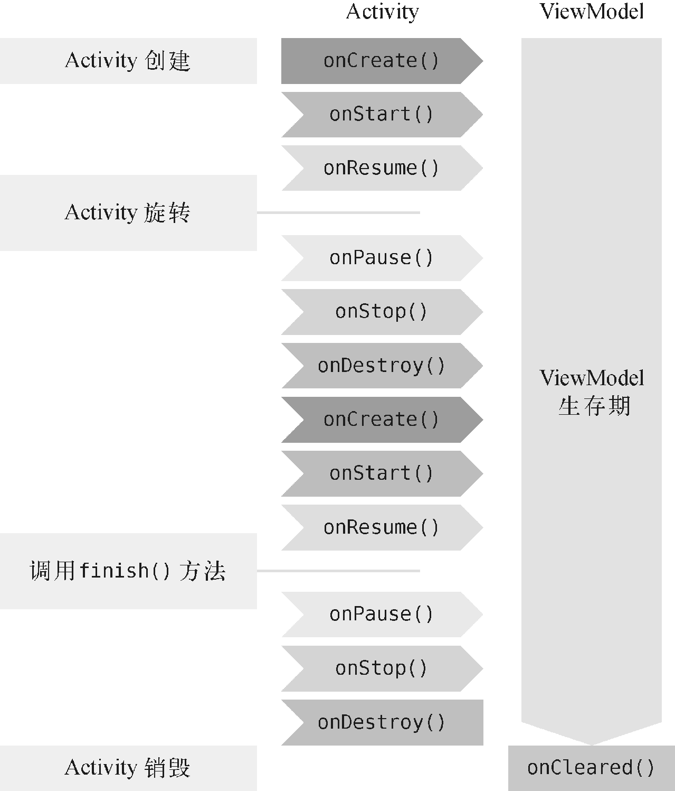

**图 13.2　ViewModel 的生命周期示意图**

接下来就让我们通过一个简单的计数器示例来学习 ViewModel 的基本用法。

### 13.2.1　ViewModel 的基本用法

由于 Jetpack 中的组件通常是以 AndroidX 库的形式发布的，因此一些常用的 Jetpack 组件会在创建 Android 项目时自动被包含进去。不过如果我们想要使用 ViewModel 组件，还需要在 app/build.gradle 文件中添加如下依赖：

```gradle
dependencies {
    ...
    implementation "androidx.lifecycle:lifecycle-extensions:2.2.0"
}
```

通常来讲，比较好的编程规范是给每一个 Activity 和 Fragment 都创建一个对应的 ViewModel，因此这里我们就为 MainActivity 创建一个对应的 `MainViewModel` 类，并让它继承自 ViewModel，代码如下所示：

```Kotlin
class MainViewModel : ViewModel() {
}
```

根据前面所学的知识，所有与界面相关的数据都应该放在 ViewModel 中。那么这里我们要实现一个计数器的功能，就可以在 ViewModel 中加入一个 `counter` 变量用于计数，如下所示：

```Kotlin
class MainViewModel : ViewModel() {

    var counter = 0

}
```

现在我们需要在界面上添加一个按钮，每点击一次按钮就让计数器加 1，并且把最新的计数显示在界面上。修改 activity_main.xml 中的代码，如下所示：

```xml
<LinearLayout
    xmlns:android="http://schemas.android.com/apk/res/android"
    android:layout_width="match_parent"
    android:layout_height="match_parent"
    android:orientation="vertical">

    <TextView
        android:id="@+id/infoText"
        android:layout_width="wrap_content"
        android:layout_height="wrap_content"
        android:layout_gravity="center_horizontal"
        android:textSize="32sp"/>

    <Button
        android:id="@+id/plusOneBtn"
        android:layout_width="match_parent"
        android:layout_height="wrap_content"
        android:layout_gravity="center_horizontal"
        android:text="Plus One"/>

</LinearLayout>
```

布局文件非常简单，一个 TextView 用于显示当前的计数，一个 Button 用于对计数器加 1。

接着我们开始实现计数器的逻辑，修改 MainActivity 中的代码，如下所示：

```Kotlin
class MainActivity : AppCompatActivity() {

    lateinit var viewModel: MainViewModel

    override fun onCreate(savedInstanceState: Bundle?) {
        super.onCreate(savedInstanceState)
        setContentView(R.layout.activity_main)
        viewModel = ViewModelProvider(this).get(MainViewModel::class.java)
        plusOneBtn.setOnClickListener {
            viewModel.counter++
            refreshCounter()
        }
        refreshCounter()
    }

    private fun refreshCounter() {
        infoText.text = viewModel.counter.toString()
    }

}
```

代码不长，我来解释一下。这里最需要注意的是，我们绝对不可以直接去创建 ViewModel 的实例，而是一定要通过 ViewModelProvider 来获取 ViewModel 的实例，具体语法规则如下：

```Kotlin
ViewModelProvider(<你的Activity或Fragment实例>).get(<你的ViewModel>::class.java)
```

之所以要这么写，是因为 ViewModel 有其独立的生命周期，并且其生命周期要长于 Activity。如果我们在 `onCreate()` 方法中创建 ViewModel 的实例，那么每次 `onCreate()` 方法执行的时候，ViewModel 都会创建一个新的实例，这样当手机屏幕发生旋转的时候，就无法保留其中的数据了。

除此之外的其他代码应该都是非常好理解的，我们提供了一个 `refreshCounter()` 方法用来显示当前的计数，然后每次点击按钮的时候对计数器加 1，并调用 `refreshCounter()` 方法刷新计数。

现在可以运行一下程序了，效果如图 13.3 所示。

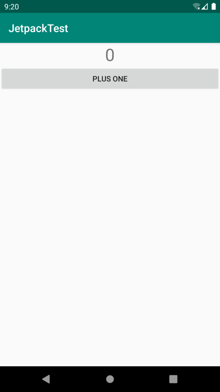

**图 13.3　程序的初始界面**

点击界面上的“Plus One”按钮，计数器就会开始增长了，如图 13.4 所示。

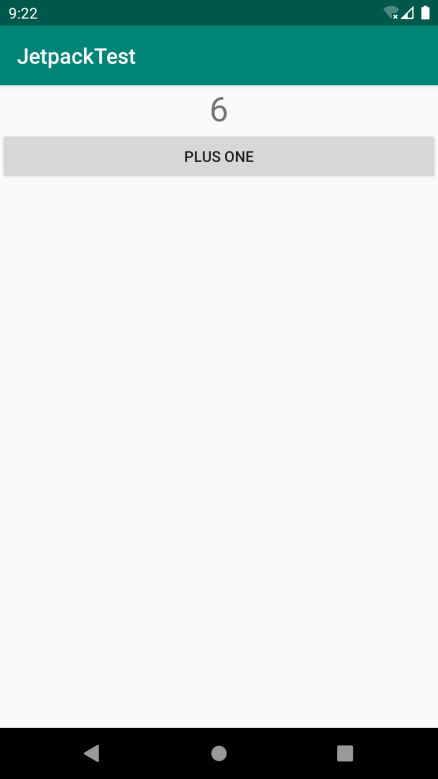

**图 13.4　点击按钮计数器增长**

如果你尝试通过侧边工具栏旋转一下模拟器的屏幕，就会发现 Activity 虽然被重新创建了，但是计数器的数据却没有丢失，如图 13.5 所示。

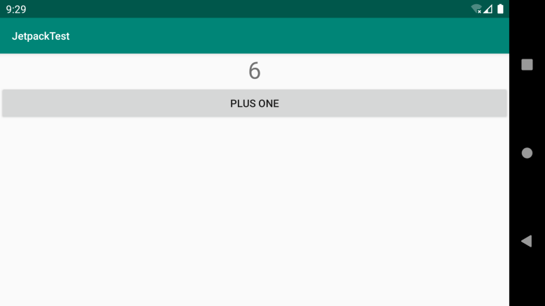

**图 13.5　ViewModel 中的数据在屏幕旋转时不会丢失**

虽然这个例子非常简单，但这就是 ViewModel 的基本用法了，也是它最常用的用法，所以你一定要牢牢掌握这部分内容。不过在实际的使用过程中，你还可能会遇到一些特殊的情况，那么下面我们就来进行更深一步的学习。

### 13.2.2　向 ViewModel 传递参数

上一小节中创建的 MainViewModel 的构造函数中没有任何参数，但是思考一下，如果我们确实需要通过构造函数来传递一些参数，应该怎么办呢？由于所有 ViewModel 的实例都是通过 ViewModelProvider 来获取的，因此我们没有任何地方可以向 ViewModel 的构造函数中传递参数。

当然，这个问题也不难解决，只需要借助 `ViewModelProvider.Factory` 就可以实现了。下面我们还是通过具体的示例来学习一下。

现在的计数器虽然在屏幕旋转的时候不会丢失数据，但是如果退出程序之后再重新打开，那么之前的计数就会被清零了。接下来我们就对这一功能进行升级，保证即使在退出程序后又重新打开的情况下，数据仍然不会丢失。

相信你已经猜到了，实现这个功能需要在退出程序的时候对当前的计数进行保存，然后在重新打开程序的时候读取之前保存的计数，并传递给 MainViewModel。因此，这里修改 MainViewModel 中的代码，如下所示：

```Kotlin
class MainViewModel(countReserved: Int) : ViewModel() {

    var counter = countReserved

}
```

现在我们给 MainViewModel 的构造函数添加了一个 `countReserved` 参数，这个参数用于记录之前保存的计数值，并在初始化的时候赋值给 `counter` 变量。

接下来的问题就是如何向 MainViewModel 的构造函数传递数据了，前面已经说了需要借助 `ViewModelProvider.Factory`，下面我们就来看看具体应该如何实现。

新建一个 `MainViewModelFactory` 类，并让它实现 `ViewModelProvider.Factory` 接口，代码如下所示：

```Kotlin
class MainViewModelFactory(private val countReserved: Int) : ViewModelProvider.Factory {

    override fun <T : ViewModel> create(modelClass: Class<T>): T {
        return MainViewModel(countReserved) as T
    }

}
```

可以看到，`MainViewModelFactory` 的构造函数中也接收了一个 `countReserved` 参数。另外 `ViewModelProvider.Factory` 接口要求我们必须实现 `create()` 方法，因此这里在 `create()` 方法中我们创建了 MainViewModel 的实例，并将 `countReserved` 参数传了进去。为什么这里就可以创建 MainViewModel 的实例了呢？因为 `create()` 方法的执行时机和 Activity 的生命周期无关，所以不会产生之前提到的问题。

另外，我们还得在界面上添加一个清零按钮，方便用户手动将计数器清零。修改 activity_main.xml 中的代码，如下所示：

```xml
<LinearLayout
    xmlns:android="http://schemas.android.com/apk/res/android"
    android:layout_width="match_parent"
    android:layout_height="match_parent"
    android:orientation="vertical">
    ...
    <Button
        android:id="@+id/clearBtn"
        android:layout_width="match_parent"
        android:layout_height="wrap_content"
        android:layout_gravity="center_horizontal"
        android:text="Clear"/>
</LinearLayout>
```

最后修改 MainActivity 中的代码，如下所示：

```Kotlin
class MainActivity : AppCompatActivity() {

    lateinit var viewModel: MainViewModel
    lateinit var sp: SharedPreferences

    override fun onCreate(savedInstanceState: Bundle?) {
        super.onCreate(savedInstanceState)
        setContentView(R.layout.activity_main)
        sp = getPreferences(Context.MODE_PRIVATE)
        val countReserved = sp.getInt("count_reserved", 0)
        viewModel = ViewModelProvider(this, MainViewModelFactory(countReserved))
                    .get(MainViewModel::class.java)
        ...
        clearBtn.setOnClickListener {
            viewModel.counter = 0
            refreshCounter()
        }
        refreshCounter()
    }

    override fun onPause() {
        super.onPause()
        sp.edit {
            putInt("count_reserved", viewModel.counter)
        }
    }
    ...
}
```

在 `onCreate()` 方法中，我们首先获取了 SharedPreferences 的实例，然后读取之前保存的计数值，如果没有读到的话，就使用 0 作为默认值。接下来在 ViewModelProvider 中，额外传入了一个 `MainViewModelFactory` 参数，这里将读取到的计数值传给了 `MainViewModelFactory` 的构造函数。注意，这一步是非常重要的，只有用这种写法才能将计数值最终传递给 MainViewModel 的构造函数。

剩下的代码就比较简单了，我们在“Clear”按钮的点击事件中对计数器进行清零，并且在 `onPause()` 方法中对当前的计数进行保存，这样可以保证不管程序是退出还是进入后台，计数都不会丢失。

现在重新运行程序，点击数次“Plus One”按钮，然后退出程序并重新打开，你会发现，计数器的值是不会丢失的，如图 13.6 所示。

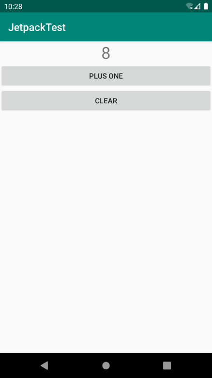

**图 13.6　计数器的值会被一直保存**

只有点击“Clear”按钮，计数器的值才会被清零，你可以自己尝试一下。

这样我们就把 ViewModel 中比较重要的内容都掌握了，那么接下来我们开始学习 Jetpack 中另外一个非常重要的组件——Lifecycles。

## 13.3　Lifecycles

在编写 Android 应用程序的时候，可能会经常遇到需要感知 Activity 生命周期的情况。比如说，某个界面中发起了一条网络请求，但是当请求得到响应的时候，界面或许已经关闭了，这个时候就不应该继续对响应的结果进行处理。因此，我们需要能够时刻感知到 Activity 的生命周期，以便在适当的时候进行相应的逻辑控制。

感知 Activity 的生命周期并不复杂，早在第 3 章的时候我们就学习过 Activity 完整的生命周期流程。但问题在于，在一个 Activity 中去感知它的生命周期非常简单，而如果要在一个非 Activity 的类中去感知 Activity 的生命周期，应该怎么办呢？

这种需求是广泛存在的，同时也衍生出了一系列的解决方案，比如通过在 Activity 中嵌入一个隐藏的 Fragment 来进行感知，或者通过手写监听器的方式来进行感知，等等。

下面的代码演示了如何通过手写监听器的方式来对 Activity 的生命周期进行感知：

```Kotlin
class MyObserver {

    fun activityStart() {
    }

    fun activityStop() {
    }

}

class MainActivity : AppCompatActivity() {

    lateinit var observer: MyObserver

    override fun onCreate(savedInstanceState: Bundle?) {
        observer = MyObserver()
    }

    override fun onStart() {
        super.onStart()
        observer.activityStart()
    }

    override fun onStop() {
        super.onStop()
        observer.activityStop()
    }
}
```

可以看到，这里我们为了让 MyObserver 能够感知到 Activity 的生命周期，需要专门在 MainActivity 中重写相应的生命周期方法，然后再通知给 MyObserver。这种实现方式虽然是可以正常工作的，但是不够优雅，需要在 Activity 中编写太多额外的逻辑。

而 Lifecycles 组件就是为了解决这个问题而出现的，它可以让任何一个类都能轻松感知到 Activity 的生命周期，同时又不需要在 Activity 中编写大量的逻辑处理。

那么下面我们就通过具体的例子来学习 Lifecycles 组件的用法。新建一个 `MyObserver` 类，并让它实现 `LifecycleObserver` 接口，代码如下所示：

```Kotlin
class MyObserver : LifecycleObserver {
}
```

`LifecycleObserver` 是一个空方法接口，只需要进行一下接口实现声明就可以了，而不去重写任何方法。

接下来我们可以在 MyObserver 中定义任何方法，但是如果想要感知到 Activity 的生命周期，还得借助额外的注解功能才行。比如这里还是定义 `activityStart()` 和 `activityStop()` 这两个方法，代码如下所示：

```Kotlin
class MyObserver : LifecycleObserver {

    @OnLifecycleEvent(Lifecycle.Event.ON_START)
    fun activityStart() {
        Log.d("MyObserver", "activityStart")
    }

    @OnLifecycleEvent(Lifecycle.Event.ON_STOP)
    fun activityStop() {
        Log.d("MyObserver", "activityStop")
    }

}
```

可以看到，我们在方法上使用了 `@OnLifecycleEvent` 注解，并传入了一种生命周期事件。生命周期事件的类型一共有 7 种：`ON_CREATE`、`ON_START`、`ON_RESUME`、`ON_PAUSE`、`ON_STOP` 和 `ON_DESTROY` 分别匹配 Activity 中相应的生命周期回调；另外还有一种 `ON_ANY` 类型，表示可以匹配 Activity 的任何生命周期回调。

因此，上述代码中的 `activityStart()` 和 `activityStop()` 方法就应该分别在 Activity 的 `onStart()` 和 `onStop()` 触发的时候执行。

但是代码写到这里还是无法正常工作的，因为当 Activity 的生命周期发生变化的时候并没有人去通知 MyObserver，而我们又不想像刚才一样在 Activity 中去一个个手动通知。

这个时候就得借助 LifecycleOwner 这个好帮手了，它可以使用如下的语法结构让 MyObserver 得到通知：

```Kotlin
lifecycleOwner.lifecycle.addObserver(MyObserver())
```

首先调用 LifecycleOwner 的 `getLifecycle()` 方法，得到一个 `Lifecycle` 对象，然后调用它的 `addObserver()` 方法来观察 LifecycleOwner 的生命周期，再把 MyObserver 的实例传进去就可以了。

那么接下来的问题就是，LifecycleOwner 又是什么呢？怎样才能获取一个 LifecycleOwner 的实例？

当然，我们可以自己去实现一个 LifecycleOwner，但通常情况下这是完全没有必要的。因为只要你的 Activity 是继承自 `AppCompatActivity` 的，或者你的 Fragment 是继承自 `androidx.fragment.app.Fragment` 的，那么它们本身就是一个 LifecycleOwner 的实例，这部分工作已经由 AndroidX 库自动帮我们完成了。也就是说，在 MainActivity 当中就可以这样写：

```Kotlin
class MainActivity : AppCompatActivity() {
    ...
    override fun onCreate(savedInstanceState: Bundle?) {
        super.onCreate(savedInstanceState)
        setContentView(R.layout.activity_main)
        ...
        lifecycle.addObserver(MyObserver())
    }
    ...
}
```

没错，只要添加这样一行代码，MyObserver 就能自动感知到 Activity 的生命周期了。另外，需要说明的是，尽管我们一直在以 Activity 举例，但其实上述的所有内容在 Fragment 中也是通用的。

现在重新运行一下程序， activityStart 这条日志就会打印出来了。如果你再按下 Home 键或者 Back 键的话，activityStop 这条日志也会打印出来，如图 13.7 所示。

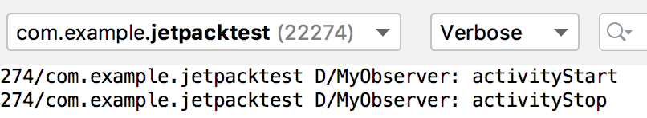

**图 13.7　MyObserver 中打印的日志**

这些就是 Lifecycles 组件最常见的用法了。不过目前 MyObserver 虽然能够感知到 Activity 的生命周期发生了变化，却没有办法主动获知当前的生命周期状态。要解决这个问题也不难，只需要在 MyObserver 的构造函数中将 `Lifecycle` 对象传进来即可，如下所示：

```Kotlin
class MyObserver(val lifecycle: Lifecycle) : LifecycleObserver {
    ...
}
```

有了 `Lifecycle` 对象之后，我们就可以在任何地方调用 `lifecycle.currentState` 来主动获知当前的生命周期状态。`lifecycle.currentState` 返回的生命周期状态是一个枚举类型，一共有 `INITIALIZED`、`DESTROYED`、`CREATED`、`STARTED`、`RESUMED` 这 5 种状态类型，它们与 Activity 的生命周期回调所对应的关系如图 13.8 所示。

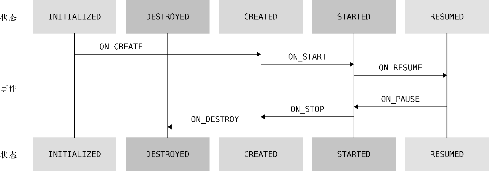

**图 13.8　 Activity 生命周期状态与事件的对应关系**

也就是说，当获取的生命周期状态是 `CREATED` 的时候，说明 `onCreate()` 方法已经执行了，但是 `onStart()` 方法还没有执行。当获取的生命周期状态是 `STARTED` 的时候，说明 `onStart()` 方法已经执行了，但是 `onResume()` 方法还没有执行，以此类推。

到这里，Lifecycles 组件的重要内容就基本讲完了，目前我们已经掌握了 Jetpack 中的两个重要组件。但是这两个组件是相对比较独立的，并没有太多直接的关系。为了让各个组件可以更好地结合使用，接下来我们就开始学习 Jetpack 中另外一个非常重要的组件——LiveData。

## 13.4　LiveData

LiveData 是 Jetpack 提供的一种响应式编程组件，它可以包含任何类型的数据，并在数据发生变化的时候通知给观察者。LiveData 特别适合与 ViewModel 结合在一起使用，虽然它也可以单独用在别的地方，但是在绝大多数情况下，它是使用在 ViewModel 当中的。

下面我们还是通过编写示例的方式来学习 LiveData 的具体用法。

### 13.4.1　LiveData 的基本用法

之前我们编写的那个计数器虽然功能非常简单，但其实是存在问题的。目前的逻辑是，当每次点击“Plus One”按钮时，都会先给 ViewModel 中的计数加 1，然后立即获取最新的计数。这种方式在单线程模式下确实可以正常工作，但如果 ViewModel 的内部开启了线程去执行一些耗时逻辑，那么在点击按钮后就立即去获取最新的数据，得到的肯定还是之前的数据。

你会发现，原来我们一直使用的都是在 Activity 中手动获取 ViewModel 中的数据这种交互方式，但是 ViewModel 却无法将数据的变化主动通知给 Activity。

或许你会说，我把 Activity 的实例传给 ViewModel，这样 ViewModel 不就能主动对 Activity 进行通知了吗？注意，千万不可以这么做。不要忘了，ViewModel 的生命周期是长于 Activity 的，如果把 Activity 的实例传给 ViewModel，就很有可能会因为 Activity 无法释放而造成内存泄漏，这是一种非常错误的做法。

而这个问题的解决方案也是显而易见的，就是使用我们本节即将学习的 LiveData。正如前面所描述的一样，LiveData 可以包含任何类型的数据，并在数据发生变化的时候通知给观察者。也就是说，如果我们将计数器的计数使用 LiveData 来包装，然后在 Activity 中去观察它，就可以主动将数据变化通知给 Activity 了。

介绍完了工作原理，接下来我们开始编写具体的代码，修改 MainViewModel 中的代码，如下所示：

```Kotlin
class MainViewModel(countReserved: Int) : ViewModel() {

    val counter = MutableLiveData<Int>()

    init {
        counter.value = countReserved
    }

    fun plusOne() {
        val count = counter.value ?: 0
        counter.value = count + 1
    }

    fun clear() {
        counter.value = 0
    }

}
```

这里我们将 `counter` 变量修改成了一个 `MutableLiveData` 对象，并指定它的泛型为 `Int`，表示它包含的是整型数据。`MutableLiveData` 是一种可变的 LiveData，它的用法很简单，主要有 3 种读写数据的方法，分别是 `getValue()`、`setValue()` 和 `postValue()` 方法。`getValue()` 方法用于获取 LiveData 中包含的数据；`setValue()` 方法用于给 LiveData 设置数据，但是只能在主线程中调用；`postValue()` 方法用于在非主线程中给 LiveData 设置数据。而上述代码其实就是调用 `getValue()` 和 `setValue()` 方法对应的语法糖写法。

可以看到，这里在 `init` 结构体中给 `counter` 设置数据，这样之前保存的计数值就可以在初始化的时候得到恢复。接下来我们新增了 `plusOne()` 和 `clear()` 这两个方法，分别用于给计数加 1 以及将计数清零。`plusOne()` 方法中的逻辑是先获取 `counter` 中包含的数据，然后给它加 1，再重新设置到 `counter` 当中。注意调用 LiveData 的 `getValue()` 方法所获得的数据是可能为空的，因此这里使用了一个 `?:` 操作符，当获取到的数据为空时，就用 0 来作为默认计数。

这样我们就借助 LiveData 将 MainViewModel 的写法改造完了，接下来开始改造 MainActivity，代码如下所示：

```Kotlin
class MainActivity : AppCompatActivity() {
    ...
    override fun onCreate(savedInstanceState: Bundle?) {
        ...
        plusOneBtn.setOnClickListener {
            viewModel.plusOne()
        }
        clearBtn.setOnClickListener {
            viewModel.clear()
        }
        viewModel.counter.observe(this, Observer { count ->
            infoText.text = count.toString()
        })
    }

    override fun onPause() {
        super.onPause()
        sp.edit {
            putInt("count_reserved", viewModel.counter.value ?: 0)
        }
    }
}
```

很显然，在“Plus One”按钮的点击事件中我们应该去调用 MainViewModel 的 `plusOne()` 方法，而在“Clear”按钮的点击事件中应该去调用 MainViewModel 的 `clear()` 方法。另外，在 `onPause()` 方法中，我们将获取当前计数的写法改造了一下，这部分内容还是很好理解的。

接下来到最关键的地方了，这里调用了 `viewModel.counter` 的 `observe()` 方法来观察数据的变化。经过对 MainViewModel 的改造，现在 `counter` 变量已经变成了一个 `LiveData` 对象，任何 `LiveData` 对象都可以调用它的 `observe()` 方法来观察数据的变化。`observe()` 方法接收两个参数：第一个参数是一个 `LifecycleOwner` 对象，有没有觉得很熟悉？没错，Activity 本身就是一个 `LifecycleOwner` 对象，因此直接传 `this` 就好；第二个参数是一个 `Observer` 接口，当 `counter` 中包含的数据发生变化时，就会回调到这里，因此我们在这里将最新的计数更新到界面上即可。

重新运行一下程序，你会发现，计数器功能同样是可以正常工作的。不同的是，现在我们的代码更科学，也更合理，而且不用担心 ViewModel 的内部会不会开启线程执行耗时逻辑。不过需要注意的是，如果你需要在子线程中给 LiveData 设置数据，一定要调用 `postValue()` 方法，而不能再使用 `setValue()` 方法，否则会发生崩溃。

另外，关于 LiveData 的 `observe()` 方法，我还想再多说几句，因为我当初在学习这部分内容时也产生过疑惑。`observe()` 方法是一个 Java 方法，如果你观察一下 `Observer` 接口，会发现这是一个单抽象方法接口，只有一个待实现的 `onChanged()` 方法。既然是单抽象方法接口，为什么在调用 `observe()` 方法时却没有使用我们在 2.6.3 小节学习的 Java 函数式 API 的写法呢？

这是一种非常特殊的情况，因为 `observe()` 方法接收的另一个参数 `LifecycleOwner` 也是一个单抽象方法接口。当一个 Java 方法同时接收两个单抽象方法接口参数时，要么同时使用函数式 API 的写法，要么都不使用函数式 API 的写法。由于我们第一个参数传的是 `this`，因此第二个参数就无法使用函数式 API 的写法了。

不过在 2019 年的 Google I/O 大会上，Android 团队官宣了 Kotlin First，并且承诺未来会在 Jetpack 中提供更多专门面向 Kotlin 语言的 API。其中，lifecycle-livedata-ktx 就是一个专门为 Kotlin 语言设计的库，这个库在 2.2.0 版本中加入了对 `observe()` 方法的语法扩展。我们只需要在 app/build.gradle 文件中添加如下依赖：

```gradle
dependencies {
    ...
    implementation "androidx.lifecycle:lifecycle-livedata-ktx:2.2.0"
}
```

然后就可以使用如下语法结构的 `observe()` 方法了：

```Kotlin
viewModel.counter.observe(this) { count ->
    infoText.text = count.toString()
}
```

以上就是 LiveData 的基本用法。虽说现在的写法可以正常工作，但其实这仍然不是最规范的 LiveData 用法，主要的问题就在于我们将 `counter` 这个可变的 LiveData 暴露给了外部。这样即使是在 ViewModel 的外面也是可以给 `counter` 设置数据的，从而破坏了 ViewModel 数据的封装性，同时也可能带来一定的风险。

比较推荐的做法是，永远只暴露不可变的 LiveData 给外部。这样在非 ViewModel 中就只能观察 LiveData 的数据变化，而不能给 LiveData 设置数据。下面我们就看一下如何改造 MainViewModel 来实现这样的功能：

```Kotlin
class MainViewModel(countReserved: Int) : ViewModel() {

    val counter: LiveData<Int>
        get() = _counter

    private val _counter = MutableLiveData<Int>()

    init {
        _counter.value = countReserved
    }

    fun plusOne() {
        val count = _counter.value ?: 0
        _counter.value = count + 1
    }

    fun clear() {
        _counter.value = 0
    }

}
```

可以看到，这里先将原来的 `counter` 变量改名为 `_counter` 变量，并给它加上 `private` 修饰符，这样 `_counter` 变量对于外部就是不可见的了。然后我们又新定义了一个 `counter` 变量，将它的类型声明为不可变的 LiveData，并在它的 `get()` 属性方法中返回 `_counter` 变量。

这样，当外部调用 `counter` 变量时，实际上获得的就是 `_counter` 的实例，但是无法给 `counter` 设置数据，从而保证了 ViewModel 的数据封装性。

目前这种写法可以说是非常规范了，这也是 Android 官方最为推荐的写法，希望你能好好掌握。

### 13.4.2　map 和 switchMap

LiveData 的基本用法虽说可以满足大部分的开发需求，但是当项目变得复杂之后，可能会出现一些更加特殊的需求。LiveData 为了能够应对各种不同的需求场景，提供了两种转换方法：`map()` 和 `switchMap()` 方法。下面我们就学习这两种转换方法的具体用法和使用场景。

先来看 `map()` 方法，这个方法的作用是将实际包含数据的 LiveData 和仅用于观察数据的 LiveData 进行转换。那么什么情况下会用到这个方法呢？下面我来举一个例子。

比如说有一个 `User` 类，`User` 中包含用户的姓名和年龄，定义如下：

```Kotlin
data class User(var firstName: String, var lastName: String, var age: Int)
```

我们可以在 ViewModel 中创建一个相应的 LiveData 来包含 `User` 类型的数据，如下所示：

```Kotlin
class MainViewModel(countReserved: Int) : ViewModel() {

    val userLiveData = MutableLiveData<User>()
    ...
}
```

到目前为止，这和我们在上一小节中学习的内容并没有什么区别。可是如果 MainActivity 中明确只会显示用户的姓名，而完全不关心用户的年龄，那么这个时候还将整个 `User` 类型的 LiveData 暴露给外部，就显得不那么合适了。

而 `map()` 方法就是专门用于解决这种问题的，它可以将 `User` 类型的 LiveData 自由地转型成任意其他类型的 LiveData，下面我们来看一下具体的用法：

```Kotlin
class MainViewModel(countReserved: Int) : ViewModel() {

    private val userLiveData = MutableLiveData<User>()

    val userName: LiveData<String> = Transformations.map(userLiveData) { user ->
        "${user.firstName} ${user.lastName}"
    }
    ...
}
```

可以看到，这里我们调用了 Transformations 的 `map()` 方法来对 LiveData 的数据类型进行转换。`map()` 方法接收两个参数：第一个参数是原始的 LiveData 对象；第二个参数是一个转换函数，我们在转换函数里编写具体的转换逻辑即可。这里的逻辑也很简单，就是将 `User` 对象转换成一个只包含用户姓名的字符串。

另外，我们还将 `userLiveData` 声明成了 `private`，以保证数据的封装性。外部使用的时候只要观察 `userName` 这个 LiveData 就可以了。当 `userLiveData` 的数据发生变化时，`map()` 方法会监听到变化并执行转换函数中的逻辑，然后再将转换之后的数据通知给 `userName` 的观察者。

这就是 `map()` 方法的用法和使用场景，非常好理解。

接下来，我们开始学习 `switchMap()` 方法，虽然它的使用场景非常固定，但是可能比 `map()` 方法要更加常用。

前面我们所学的所有内容都有一个前提：LiveData 对象的实例都是在 ViewModel 中创建的。然而在实际的项目中，不可能一直是这种理想情况，很有可能 ViewModel 中的某个 LiveData 对象是调用另外的方法获取的。

下面就来模拟一下这种情况，新建一个 `Repository` 单例类，代码如下所示：

```Kotlin
object Repository {

    fun getUser(userId: String): LiveData<User> {
        val liveData = MutableLiveData<User>()
        liveData.value = User(userId, userId, 0)
        return liveData
    }

}
```

这里我们在 `Repository` 类中添加了一个 `getUser()` 方法，这个方法接收一个 `userId` 参数。按照正常的编程逻辑，我们应该根据传入的 `userId` 参数去服务器请求或者到数据库中查找相应的 `User` 对象，但是这里只是模拟示例，因此每次将传入的 `userId` 当作用户姓名来创建一个新的 `User` 对象即可。

需要注意的是，`getUser()` 方法返回的是一个包含 `User` 数据的 LiveData 对象，而且每次调用 `getUser()` 方法都会返回一个新的 LiveData 实例。

然后我们在 MainViewModel 中也定义一个 `getUser()` 方法，并且让它调用 `Repository` 的 `getUser()` 方法来获取 LiveData 对象：

```Kotlin
class MainViewModel(countReserved: Int) : ViewModel() {
    ...
    fun getUser(userId: String): LiveData<User> {
        return Repository.getUser(userId)
    }
}
```

接下来的问题就是，在 Activity 中如何观察 LiveData 的数据变化呢？既然 `getUser()` 方法返回的就是一个 LiveData 对象，那么我们可不可以直接在 Activity 中使用如下写法呢？

```Kotlin
viewModel.getUser(userId).observe(this) { user ->
}
```

请注意，这么做是完全错误的。因为每次调用 `getUser()` 方法返回的都是一个新的 LiveData 实例，而上述写法会一直观察老的 LiveData 实例，从而根本无法观察到数据的变化。你会发现，这种情况下的 LiveData 是不可观察的。

这个时候，`switchMap()` 方法就可以派上用场了。正如前面所说，它的使用场景非常固定：如果 ViewModel 中的某个 LiveData 对象是调用另外的方法获取的，那么我们就可以借助 `switchMap()` 方法，将这个 LiveData 对象转换成另外一个可观察的 LiveData 对象。

修改 MainViewModel 中的代码，如下所示：

```Kotlin
class MainViewModel(countReserved: Int) : ViewModel() {
    ...
    private val userIdLiveData = MutableLiveData<String>()

    val user: LiveData<User> = Transformations.switchMap(userIdLiveData) { userId ->
        Repository.getUser(userId)
    }

    fun getUser(userId: String) {
        userIdLiveData.value = userId
    }
}
```

这里我们定义了一个新的 `userIdLiveData` 对象，用来观察 `userId` 的数据变化，然后调用了 `Transformations` 的 `switchMap()` 方法，用来对另一个可观察的 LiveData 对象进行转换。

`switchMap()` 方法同样接收两个参数：第一个参数传入我们新增的 `userIdLiveData`，`switchMap()` 方法会对它进行观察；第二个参数是一个转换函数，注意，我们必须在这个转换函数中返回一个 LiveData 对象，因为 `switchMap()` 方法的工作原理就是要将转换函数中返回的 LiveData 对象转换成另一个可观察的 LiveData 对象。那么很显然，我们只需要在转换函数中调用 Repository 的 `getUser()` 方法来得到 LiveData 对象，并将它返回就可以了。

为了让你能更清晰地理解 `switchMap()` 的用法，我们再来梳理一遍它的整体工作流程。首先，当外部调用 MainViewModel 的 `getUser()` 方法来获取用户数据时，并不会发起任何请求或者函数调用，只会将传入的 `userId` 值设置到 `userIdLiveData` 当中。一旦 `userIdLiveData` 的数据发生变化，那么观察 `userIdLiveData` 的 `switchMap()` 方法就会执行，并且调用我们编写的转换函数。然后在转换函数中调用 `Repository.getUser()` 方法获取真正的用户数据。同时，`switchMap()` 方法会将 `Repository.getUser()` 方法返回的 LiveData 对象转换成一个可观察的 LiveData 对象，对于 Activity 而言，只要去观察这个 LiveData 对象就可以了。

下面我们就来测试一下，修改 activity_main.xml 文件，在里面新增一个“Get User”按钮：

```xml
<LinearLayout
    xmlns:android="http://schemas.android.com/apk/res/android"
    android:layout_width="match_parent"
    android:layout_height="match_parent"
    android:orientation="vertical">
    ...
    <Button
        android:id="@+id/getUserBtn"
        android:layout_width="match_parent"
        android:layout_height="wrap_content"
        android:layout_gravity="center_horizontal"
        android:text="Get User"/>
</LinearLayout>
```

然后修改 MainActivity 中的代码，如下所示：

```Kotlin
class MainActivity : AppCompatActivity() {
    ...
    override fun onCreate(savedInstanceState: Bundle?) {
        ...
        getUserBtn.setOnClickListener {
            val userId = (0..10000).random().toString()
            viewModel.getUser(userId)
        }
        viewModel.user.observe(this, Observer { user ->
            infoText.text = user.firstName
        })
    }
    ...
}
```

具体的用法就是这样了，我们在“Get User”按钮的点击事件中使用随机函数生成了一个 `userId`，然后调用 MainViewModel 的 `getUser()` 方法来获取用户数据，但是这个方法现在不会有任何返回值了。等数据获取完成之后，可观察 LiveData 对象的 `observe()` 方法将会得到通知，我们在这里将获取的用户名显示到界面上。

现在重新运行程序，并一直点击“Get User”按钮，你会发现界面上的数字会一直在变，如图 13.9 所示。这是因为我们传入的 `userId` 值是随机的，同时也说明 `switchMap()` 方法确实已经正常工作了。

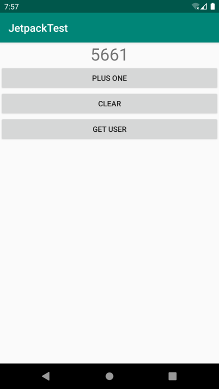

**图 13.9　数字会在 0 到 10 000 之间随机变化**

最后再介绍一个我当初学习 `switchMap()` 方法时产生疑惑的地方。在刚才的例子当中，我们调用 MainViewModel 的 `getUser()` 方法时传入了一个 `userId` 参数，为了能够观察这个参数的数据变化，又构建了一个 `userIdLiveData`，然后在 `switchMap()` 方法中再去观察这个 LiveData 对象就可以了。但是 `ViewModel` 中某个获取数据的方法有可能是没有参数的，这个时候代码应该怎么写呢？

其实这个问题并没有想象中复杂，写法基本上和原来是相同的，只是在没有可观察数据的情况下，我们需要创建一个空的 LiveData 对象，示例写法如下：

```Kotlin
class MyViewModel : ViewModel() {

    private val refreshLiveData = MutableLiveData<Any?>()

    val refreshResult = Transformations.switchMap(refreshLiveData) {
        Repository.refresh()  // 假设Repository中已经定义了refresh()方法
    }

    fun refresh() {
        refreshLiveData.value = refreshLiveData.value
    }

}
```

可以看到，这里我们定义了一个不带参数的 `refresh()` 方法，又对应地定义了一个 `refreshLiveData`，但是它不需要指定具体包含的数据类型，因此这里我们将 LiveData 的泛型指定成 `Any?` 即可。

接下来就是点睛之笔的地方了，在 `refresh()` 方法中，我们只是将 `refreshLiveData` 原有的数据取出来（默认是空），再重新设置到 `refreshLiveData` 当中，这样就能触发一次数据变化。是的，LiveData 内部不会判断即将设置的数据和原有数据是否相同，只要调用了 `setValue()` 或 `postValue()` 方法，就一定会触发数据变化事件。

然后我们在 Activity 中观察 `refreshResult` 这个 LiveData 对象即可，这样只要调用了 `refresh()` 方法，观察者的回调函数中就能够得到最新的数据。

可能你会说，学到现在，只看到了 LiveData 与 ViewModel 结合在一起使用，好像和我们上一节学的 Lifecycles 组件没什么关系嘛。

其实并不是这样的，LiveData 之所以能够成为 Activity 与 ViewModel 之间通信的桥梁，并且还不会有内存泄漏的风险，靠的就是 Lifecycles 组件。LiveData 在内部使用了 Lifecycles 组件来自我感知生命周期的变化，从而可以在 Activity 销毁的时候及时释放引用，避免产生内存泄漏的问题。

另外，由于要减少性能消耗，当 Activity 处于不可见状态的时候（比如手机息屏，或者被其他的 Activity 遮挡），如果 LiveData 中的数据发生了变化，是不会通知给观察者的。只有当 Activity 重新恢复可见状态时，才会将数据通知给观察者，而 LiveData 之所以能够实现这种细节的优化，依靠的还是 Lifecycles 组件。

还有一个小细节，如果在 Activity 处于不可见状态的时候，LiveData 发生了多次数据变化，当 Activity 恢复可见状态时，只有最新的那份数据才会通知给观察者，前面的数据在这种情况下相当于已经过期了，会被直接丢弃。

到这里，我们基本上就将 LiveData 相关的所有重要内容都学完了。

## 13.5　Room

在第 7 章的时候我们学习了 SQLite 数据库的使用方法，不过当时仅仅是使用了一些原生的 API 来进行数据的增删改查操作。这些原生 API 虽然简单易用，但是如果放到大型项目当中的话，会非常容易让项目的代码变得混乱，除非你进行了很好的封装。为此市面上出现了诸多专门为 Android 数据库设计的 ORM 框架。

ORM（Object Relational Mapping）也叫对象关系映射。简单来讲，我们使用的编程语言是面向对象语言，而使用的数据库则是关系型数据库，将面向对象的语言和面向关系的数据库之间建立一种映射关系，这就是 ORM 了。

那么使用 ORM 框架有什么好处呢？它赋予了我们一个强大的功能，就是可以用面向对象的思维来和数据库进行交互，绝大多数情况下不用再和 SQL 语句打交道了，同时也不用担心操作数据库的逻辑会让项目的整体代码变得混乱。

由于许多大型项目中会用到数据库的功能，为了帮助我们编写出更好的代码，Android 官方推出了一个 ORM 框架，并将它加入了 Jetpack 当中，就是我们这节即将学习的 Room。

### 13.5.1　使用 Room 进行增删改查

那么现在就开始吧，先来看一下 Room 的整体结构。它主要由 Entity、Dao 和 Database 这 3 部分组成，每个部分都有明确的职责，详细说明如下。

- Entity。用于定义封装实际数据的实体类，每个实体类都会在数据库中有一张对应的表，并且表中的列是根据实体类中的字段自动生成的。
- Dao。Dao 是数据访问对象的意思，通常会在这里对数据库的各项操作进行封装，在实际编程的时候，逻辑层就不需要和底层数据库打交道了，直接和 Dao 层进行交互即可。
- Database。用于定义数据库中的关键信息，包括数据库的版本号、包含哪些实体类以及提供 Dao 层的访问实例。

不过只看这些概念可能还是不太容易理解，下面我们结合实践来学习一下 Room 的具体用法。

继续在 JetpackTest 项目上进行改造。首先要使用 Room，需要在 app/build.gradle 文件中添加如下的依赖：

```Kotlin
apply plugin: 'com.android.application'
apply plugin: 'kotlin-android'
apply plugin: 'kotlin-android-extensions'
apply plugin: 'kotlin-kapt'

dependencies {
    ...
    implementation "androidx.room:room-runtime:2.1.0"
    kapt "androidx.room:room-compiler:2.1.0"
}
```

这里新增了一个 kotlin-kapt 插件，同时在 `dependencies` 闭包中添加了两个 Room 的依赖库。由于 Room 会根据我们在项目中声明的注解来动态生成代码，因此这里一定要使用 kapt 引入 Room 的编译时注解库，而启用编译时注解功能则一定要先添加 kotlin-kapt 插件。注意，kapt 只能在 Kotlin 项目中使用，如果是 Java 项目的话，使用 annotationProcessor 即可。

下面我们就按照刚才介绍的 Room 的 3 个组成部分一一来进行实现，首先是定义 `Entity`，也就是实体类。

好消息是 JetpackTest 项目中已经存在一个实体类了，就是我们在学习 LiveData 时创建的 `User` 类。然而 `User` 类目前只包含 `firstName`、`lastName` 和 `age` 这 3 个字段，但是一个良好的数据库编程建议是，给每个实体类都添加一个 `id` 字段，并将这个字段设为主键。于是我们对 `User` 类进行如下改造，并完成实体类的声明：

```Kotlin
@Entity
data class User(var firstName: String, var lastName: String, var age: Int) {

    @PrimaryKey(autoGenerate = true)
    var id: Long = 0

}
```

可以看到，这里我们在 `User` 的类名上使用 `@Entity` 注解，将它声明成了一个实体类，然后在 `User` 类中添加了一个 `id` 字段，并使用 `@PrimaryKey` 注解将它设为了主键，再把 `autoGenerate` 参数指定成 `true`，使得主键的值是自动生成的。

这样实体类部分就定义好了，不过这里简单起见，只定义了一个实体类，在实际项目当中，你可能需要根据具体的业务逻辑定义很多个实体类。当然，每个实体类定义的方式都是差不多的，最多添加一些实体类之间的关联。

接下来开始定义 Dao，这部分也是 Room 用法中最关键的地方，因为所有访问数据库的操作都是在这里封装的。

通过第 7 章的学习我们已经了解到，访问数据库的操作无非就是增删改查这 4 种，但是业务需求却是千变万化的。而 Dao 要做的事情就是覆盖所有的业务需求，使得业务方永远只需要与 Dao 层进行交互，而不必和底层的数据库打交道。

那么下面我们就来看一下一个 Dao 具体是如何实现的。新建一个 `UserDao` 接口，注意必须使用接口，这点和 Retrofit 是类似的，然后在接口中编写如下代码：

```Kotlin
@Dao
interface UserDao {

    @Insert
    fun insertUser(user: User): Long

    @Update
    fun updateUser(newUser: User)

    @Query("select * from User")
    fun loadAllUsers(): List<User>

    @Query("select * from User where age > :age")
    fun loadUsersOlderThan(age: Int): List<User>

    @Delete
    fun deleteUser(user: User)

    @Query("delete from User where lastName = :lastName")
    fun deleteUserByLastName(lastName: String): Int

}
```

UserDao 接口的上面使用了一个 `@Dao` 注解，这样 Room 才能将它识别成一个 Dao。`UserDao` 的内部就是根据业务需求对各种数据库操作进行的封装。数据库操作通常有增删改查这 4 种，因此 Room 也提供了 `@Insert`、`@Delete`、`@Update` 和 `@Query` 这 4 种相应的注解。

可以看到，`insertUser()` 方法上面使用了 `@Insert` 注解，表示会将参数中传入的 `User` 对象插入数据库中，插入完成后还会将自动生成的主键 `id` 值返回。`updateUser()` 方法上面使用了 `@Update` 注解，表示会将参数中传入的 `User` 对象更新到数据库当中。`deleteUser()` 方法上面使用了 `@Delete` 注解，表示会将参数传入的 `User` 对象从数据库中删除。以上几种数据库操作都是直接使用注解标识即可，不用编写 SQL 语句。

但是如果想要从数据库中查询数据，或者使用非实体类参数来增删改数据，那么就必须编写 SQL 语句了。比如说我们在 `UserDao` 接口中定义了一个 `loadAllUsers()` 方法，用于从数据库中查询所有的用户，如果只使用一个 `@Query` 注解，Room 将无法知道我们想要查询哪些数据，因此必须在 `@Query` 注解中编写具体的 SQL 语句才行。我们还可以将方法中传入的参数指定到 SQL 语句当中，比如 `loadUsersOlderThan()` 方法就可以查询所有年龄大于指定参数的用户。另外，如果是使用非实体类参数来增删改数据，那么也要编写 SQL 语句才行，而且这个时候不能使用 `@Insert`、`@Delete` 或 `@Update` 注解，而是都要使用 `@Query` 注解才行，参考 `deleteUserByLastName()` 方法的写法。

这样我们就大体定义了添加用户、修改用户数据、查询用户、删除用户这几种数据库操作接口，在实际项目中你根据真实的业务需求来进行定义即可。

虽然使用 Room 需要经常编写 SQL 语句这一点不太友好，但是 SQL 语句确实可以实现更加多样化的逻辑，而且 Room 是支持在编译时动态检查 SQL 语句语法的。也就是说，如果我们编写的 SQL 语句有语法错误，编译的时候就会直接报错，而不会将错误隐藏到运行的时候才发现，也算是大大减少了很多安全隐患吧。

接下来我们进入最后一个环节：定义 Database。这部分内容的写法是非常固定的，只需要定义好 3 个部分的内容：数据库的版本号、包含哪些实体类，以及提供 Dao 层的访问实例。新建一个 AppDatabase.kt 文件，代码如下所示：

```Kotlin
@Database(version = 1, entities = [User::class])
abstract class AppDatabase : RoomDatabase() {

    abstract fun userDao(): UserDao

    companion object {

        private var instance: AppDatabase? = null

        @Synchronized
        fun getDatabase(context: Context): AppDatabase {
            instance?.let {
                return it
            }
            return Room.databaseBuilder(context.applicationContext,
                AppDatabase::class.java, "app_database")
                .build().apply {
                instance = this
            }
        }
    }

}
```

可以看到，这里我们在 `AppDatabase` 类的头部使用了 `@Database` 注解，并在注解中声明了数据库的版本号以及包含哪些实体类，多个实体类之间用逗号隔开即可。

另外，`AppDatabase` 类必须继承自 `RoomDatabase` 类，并且一定要使用 `abstract` 关键字将它声明成抽象类，然后提供相应的抽象方法，用于获取之前编写的 Dao 的实例，比如这里提供的 `userDao()` 方法。不过我们只需要进行方法声明就可以了，具体的方法实现是由 Room 在底层自动完成的。

紧接着，我们在 `companion object` 结构体中编写了一个单例模式，因为原则上全局应该只存在一份 `AppDatabase` 的实例。这里使用了 `instance` 变量来缓存 `AppDatabase` 的实例，然后在 `getDatabase()` 方法中判断：如果 `instance` 变量不为空就直接返回，否则就调用 `Room.databaseBuilder()` 方法来构建一个 `AppDatabase` 的实例。`databaseBuilder()` 方法接收 3 个参数，注意第一个参数一定要使用 `applicationContext`，而不能使用普通的 `context`，否则容易出现内存泄漏的情况，关于 `applicationContext` 的详细内容我们将会在第 14 章中学习。第二个参数是 `AppDatabase` 的 `Class` 类型，第三个参数是数据库名，这些都比较简单。最后调用 `build()` 方法完成构建，并将创建出来的实例赋值给 `instance` 变量，然后返回当前实例即可。

这样我们就把 Room 所需要的一切都定义好了，接下来要做的事情就是对它进行测试。修改 activity_main.xml 中的代码，在里面加入用于增删改查的 4 个按钮：

```xml
<LinearLayout
    xmlns:android="http://schemas.android.com/apk/res/android"
    android:layout_width="match_parent"
    android:layout_height="match_parent"
    android:orientation="vertical">
    ...
    <Button
        android:id="@+id/getUserBtn"
        android:layout_width="match_parent"
        android:layout_height="wrap_content"
        android:layout_gravity="center_horizontal"
        android:text="Get User"/>

    <Button
        android:id="@+id/addDataBtn"
        android:layout_width="match_parent"
        android:layout_height="wrap_content"
        android:layout_gravity="center_horizontal"
        android:text="Add Data"/>

    <Button
        android:id="@+id/updateDataBtn"
        android:layout_width="match_parent"
        android:layout_height="wrap_content"
        android:layout_gravity="center_horizontal"
        android:text="Update Data"/>

    <Button
        android:id="@+id/deleteDataBtn"
        android:layout_width="match_parent"
        android:layout_height="wrap_content"
        android:layout_gravity="center_horizontal"
        android:text="Delete Data"/>

    <Button
        android:id="@+id/queryDataBtn"
        android:layout_width="match_parent"
        android:layout_height="wrap_content"
        android:layout_gravity="center_horizontal"
        android:text="Query Data"/>
</LinearLayout>
```

然后修改 MainActivity 中的代码，分别在这 4 个按钮的点击事件中实现增删改查的逻辑，如下所示：

```Kotlin
class MainActivity : AppCompatActivity() {
    ...
    override fun onCreate(savedInstanceState: Bundle?) {
        ...
        val userDao = AppDatabase.getDatabase(this).userDao()
        val user1 = User("Tom", "Brady", 40)
        val user2 = User("Tom", "Hanks", 63)
        addDataBtn.setOnClickListener {
            thread {
                user1.id = userDao.insertUser(user1)
                user2.id = userDao.insertUser(user2)
            }
        }
        updateDataBtn.setOnClickListener {
            thread {
                user1.age = 42
                userDao.updateUser(user1)
            }
        }
        deleteDataBtn.setOnClickListener {
            thread {
                userDao.deleteUserByLastName("Hanks")
            }
        }
        queryDataBtn.setOnClickListener {
            thread {
                for (user in userDao.loadAllUsers()) {
                    Log.d("MainActivity", user.toString())
                }
            }
        }
    }
    ...
}
```

这段代码的逻辑还是很简单的。首先获取了 UserDao 的实例，并创建两个 `User` 对象。然后在“Add Data”按钮的点击事件中，我们调用了 UserDao 的 `insertUser()` 方法，将这两个 `User` 对象插入数据库中，并将 `insertUser()` 方法返回的主键 `id` 值赋值给原来的 `User` 对象。之所以要这么做，是因为使用 `@Update` 和 `@Delete` 注解去更新和删除数据时都是基于这个 `id` 值来操作的。

然后在“Update Data”按钮的点击事件中，我们将 `user1` 的年龄修改成了 42 岁，并调用 UserDao 的 `updateUser()` 方法来更新数据库中的数据。在“Delete Data”按钮的点击事件中，我们调用了 UserDao 的 `deleteUserByLastName()` 方法，删除所有 lastName 是 Hanks 的用户。在“Query Data”按钮的点击事件中，我们调用了 UserDao 的 `loadAllUsers()` 方法，查询并打印数据库中所有的用户。

另外，由于数据库操作属于耗时操作，Room 默认是不允许在主线程中进行数据库操作的，因此上述代码中我们将增删改查的功能都放到了子线程中。不过为了方便测试，Room 还提供了一个更加简单的方法，如下所示：

```Kotlin
Room.databaseBuilder(context.applicationContext, AppDatabase::class.java,"app_database")
    .allowMainThreadQueries()
    .build()
```

在构建 `AppDatabase` 实例的时候，加入一个 `allowMainThreadQueries()` 方法，这样 Room 就允许在主线程中进行数据库操作了，这个方法建议只在测试环境下使用。

好了，现在可以运行一下程序了，界面如图 13.10 所示


**图 13.10　增加了增删改查按钮的界面**

然后点击“Add Data”按钮，再点击“Query Data”按钮，查看 Logcat 中的打印日志，如图 13.11 所示。

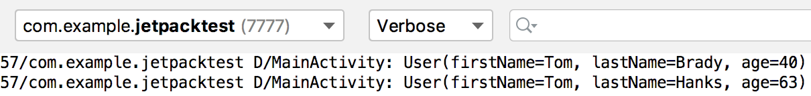

**图 13.11　查询并打印数据库中的数据**

由此可以证明，两条用户数据都已经被成功插入数据库当中了。

接下来点击“Update Data”按钮，再重新点击“Query Data”按钮，Logcat 中的打印日志如图 13.12 所示。

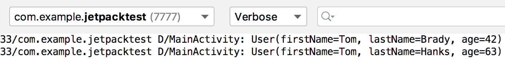

**图 13.12　查询并打印更新后的数据**

可以看到，第一条数据中用户的年龄被成功修改成了 42 岁。

最后点击“Delete Data”按钮，再次点击“Query Data”按钮，Logcat 中的打印日志如图 13.13 所示。

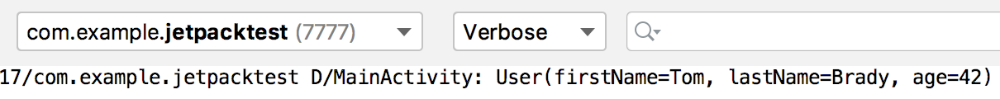

**图 13.13　查询并打印删除后的数据**

可以看到，现在只剩下一条用户数据了。

将 Room 的用法体验一遍之后，不知道你有什么感觉呢？或许你会觉得 Room 使用起来太过于烦琐，要先定义 Entity，再定义 Dao，最后定义 Database，还不如直接使用原生的 SQLiteDatabase 来得方便。但是你有没有察觉，一旦将上述 3 部分内容都定义好了之后，你就只需要使用面向对象的思维去编写程序，而完全不用考虑数据库相关的逻辑和实现了。在大型项目当中，使用 Room 将能够让你的代码拥有更加合理的分层与设计，同时也能让代码更加易于维护，因此，Room 成为现在 Android 官方最为推荐使用的数据库框架。

### 13.5.2　Room 的数据库升级

当然了，我们的数据库结构不可能在设计好了之后就永远一成不变，随着需求和版本的变更，数据库也是需要升级的。不过遗憾的是，Room 在数据库升级方面设计得非常烦琐，基本上没有比使用原生的 SQLiteDatabase 简单到哪儿去，每一次升级都需要手动编写升级逻辑才行。相比之下，我个人编写的数据库框架 LitePal 则可以根据实体类的变化自动升级数据库，感兴趣的话，你可以通过搜索去了解一下。

不过，如果你目前还只是在开发测试阶段，不想编写那么烦琐的数据库升级逻辑，Room 倒也提供了一个简单粗暴的方法，如下所示：

```Kotlin
Room.databaseBuilder(context.applicationContext, AppDatabase::class.java,"app_database")
    .fallbackToDestructiveMigration()
    .build()
```

在构建 AppDatabase 实例的时候，加入一个 `fallbackToDestructiveMigration()` 方法。这样只要数据库进行了升级，Room 就会将当前的数据库销毁，然后再重新创建，随之而来的副作用就是之前数据库中的所有数据就全部丢失了。

假如产品还在开发和测试阶段，这个方法是可以使用的，但是一旦产品对外发布之后，如果造成了用户数据丢失，那可是严重的事故。因此接下来我们还是老老实实学习一下在 Room 中升级数据库的正规写法。

随着业务逻辑的升级，现在我们打算在数据库中添加一张 Book 表，那么首先要做的就是创建一个 `Book` 的实体类，如下所示：

```Kotlin
@Entity
data class Book(var name: String, var pages: Int) {

    @PrimaryKey(autoGenerate = true)
    var id: Long = 0

}
```

可以看到，`Book` 类中包含了主键 id、书名、页数这几个字段，并且我们还使用 `@Entity` 注解将它声明成了一个实体类。

然后创建一个 `BookDao` 接口，并在其中随意定义一些 API：

```Kotlin
@Dao
interface BookDao {

    @Insert
    fun insertBook(book: Book): Long

    @Query("select * from Book")
    fun loadAllBooks(): List<Book>

}
```

接下来修改 `AppDatabase` 中的代码，在里面编写数据库升级的逻辑，如下所示：

```Kotlin
@Database(version = 2, entities = [User::class, Book::class])
abstract class AppDatabase : RoomDatabase() {

    abstract fun userDao(): UserDao

    abstract fun bookDao(): BookDao

    companion object {

        val MIGRATION_1_2 = object : Migration(1, 2) {
            override fun migrate(database: SupportSQLiteDatabase) {
                     database.execSQL("create table Book (id integer primary
                         key autoincrement not null, name text not null,
                         pages integer not null)")
            }
        }

        private var instance: AppDatabase? = null

        fun getDatabase(context: Context): AppDatabase {
            instance?.let {
                return it
            }
            return Room.databaseBuilder(context.applicationContext,
                    AppDatabase::class.java, "app_database")
                .addMigrations(MIGRATION_1_2)
                .build().apply {
                instance = this
            }
        }
    }

}
```

观察一下这里的几处变化。首先在 `@Database` 注解中，我们将版本号升级成了 2，并将 `Book` 类添加到了实体类声明中，然后又提供了一个 `bookDao()` 方法用于获取 BookDao 的实例。

接下来就是关键的地方了，在 `companion object` 结构体中，我们实现了一个 `Migration` 的匿名类，并传入了 1 和 2 这两个参数，表示当数据库版本从 1 升级到 2 的时候就执行这个匿名类中的升级逻辑。匿名类实例的变量命名也比较有讲究，这里命名成 `MIGRATION_1_2`，可读性更高。由于我们要新增一张 Book 表，所以需要在 `migrate()` 方法中编写相应的建表语句。另外必须注意的是，Book 表的建表语句必须和 `Book` 实体类中声明的结构完全一致，否则 Room 就会抛出异常。

最后在构建 `AppDatabase` 实例的时候，加入一个 `addMigrations()` 方法，并把 `MIGRATION_1_2` 传入即可。

现在当我们进行任何数据库操作时，Room 就会自动根据当前数据库的版本号执行这些升级逻辑，从而让数据库始终保证是最新的版本。

不过，每次数据库升级并不一定都要新增一张表，也有可能是向现有的表中添加新的列。这种情况只需要使用 `alter` 语句修改表结构就可以了，我们来看一下具体的操作过程。

现在 `Book` 的实体类中只有 id、书名、页数这几个字段，而我们想要再添加一个作者字段，代码如下所示：

```Kotlin
@Entity
data class Book(var name: String, var pages: Int, var author: String) {

    @PrimaryKey(autoGenerate = true)
    var id: Long = 0

}
```

既然实体类的字段发生了变动，那么对应的数据库表也必须升级了，所以这里修改 `AppDatabase` 中的代码，如下所示：

```Kotlin
@Database(version = 3, entities = [User::class, Book::class])
abstract class AppDatabase : RoomDatabase() {
   ...
    companion object {
        ...
        val MIGRATION_2_3 = object : Migration(2, 3) {
            override fun migrate(database: SupportSQLiteDatabase) {
                database.execSQL("alter table Book add column author text not null
                    default 'unknown'")
            }
        }

        private var instance: AppDatabase? = null

        fun getDatabase(context: Context): AppDatabase {
            ...
            return Room.databaseBuilder(context.applicationContext,
                AppDatabase::class.java, "app_database")
                .addMigrations(MIGRATION_1_2, MIGRATION_2_3)
                .build().apply {
                instance = this
            }
        }
    }

}
```

升级步骤和之前是差不多的，这里先将版本号升级成了 3，然后编写一个 `MIGRATION_2_3` 的升级逻辑并添加到 `addMigrations()` 方法中即可。比较有难度的地方就是每次在 `migrate()` 方法中编写的 SQL 语句，不过即使写错了也没关系，因为程序运行之后在你首次操作数据库的时候就会直接触发崩溃，并且告诉你具体的错误原因，对照着错误原因来改正你的 SQL 语句即可。

好了，关于 Room 你已经了解足够多的内容了，接下来就让我们开始学习本章的最后一个 Jetpack 组件——WorkManager。

## 13.6　WorkManager

Android 的后台机制是一个很复杂的话题，连我自己也没能完全搞明白不同 Android 系统版本之间后台的功能与 API 又发生了哪些变化。在很早之前，Android 系统的后台功能是非常开放的，Service 的优先级也很高，仅次于 Activity，那个时候可以在 Service 中做很多事情。但由于后台功能太过于开放，每个应用都想无限地占用后台资源，导致手机的内存越来越紧张，耗电越来越快，也变得越来越卡。为了解决这些情况，基本上 Android 系统每发布一个新版本，后台权限都会被进一步收紧。

我印象中与后台相关的 API 变更大概有这些：从 4.4 系统开始 AlarmManager 的触发时间由原来的精准变为不精准，5.0 系统中加入了 JobScheduler 来处理后台任务，6.0 系统中引入了 Doze 和 App Standby 模式用于降低手机被后台唤醒的频率，从 8.0 系统开始直接禁用了 Service 的后台功能，只允许使用前台 Service。当然，还有许许多多小细节的修改，我没能全部列举出来。

这么频繁的功能和 API 变更，让开发者就很难受了，到底该如何编写后台代码才能保证应用程序在不同系统版本上的兼容性呢？为了解决这个问题，Google 推出了 WorkManager 组件。WorkManager 很适合用于处理一些要求定时执行的任务，它可以根据操作系统的版本自动选择底层是使用 AlarmManager 实现还是 JobScheduler 实现，从而降低了我们的使用成本。另外，它还支持周期性任务、链式任务处理等功能，是一个非常强大的工具。

不过，我们还得先明确一件事情：WorkManager 和 Service 并不相同，也没有直接的联系。Service 是 Android 系统的四大组件之一，它在没有被销毁的情况下是一直保持在后台运行的。而 WorkManager 只是一个处理定时任务的工具，它可以保证即使在应用退出甚至手机重启的情况下，之前注册的任务仍然将会得到执行，因此 WorkManager 很适合用于执行一些定期和服务器进行交互的任务，比如周期性地同步数据，等等。

另外，使用 WorkManager 注册的周期性任务不能保证一定会准时执行，这并不是 bug，而是系统为了减少电量消耗，可能会将触发时间临近的几个任务放在一起执行，这样可以大幅度地减少 CPU 被唤醒的次数，从而有效延长电池的使用时间。

那么下面我们就开始学习 WorkManager 的具体用法。

### 13.6.1　WorkManager 的基本用法

要想使用 WorkManager，需要先在 app/build.gradle 文件中添加如下的依赖：

```gradle
dependencies {
    ...
    implementation "androidx.work:work-runtime:2.2.0"
}
```

将依赖添加完成之后，我们就把准备工作做好了。

WorkManager 的基本用法其实非常简单，主要分为以下 3 步：

\(1\) 定义一个后台任务，并实现具体的任务逻辑；

\(2\) 配置该后台任务的运行条件和约束信息，并构建后台任务请求；

\(3\) 将该后台任务请求传入 WorkManager 的 `enqueue()` 方法中，系统会在合适的时间运行。

那么接下来我们就按照上述步骤一步步进行实现。

第一步要定义一个后台任务，这里创建一个 `SimpleWorker` 类，代码如下所示：

```Kotlin
class SimpleWorker(context: Context, params: WorkerParameters) : Worker(context, params) {

    override fun doWork(): Result {
        Log.d("SimpleWorker", "do work in SimpleWorker")
        return Result.success()
    }

}
```

后台任务的写法非常固定，也很好理解。首先每一个后台任务都必须继承自 `Worker` 类，并调用它唯一的构造函数。然后重写父类中的 `doWork()` 方法，在这个方法中编写具体的后台任务逻辑即可。

`doWork()` 方法不会运行在主线程当中，因此你可以放心地在这里执行耗时逻辑，不过这里简单起见只是打印了一行日志。另外，`doWork()` 方法要求返回一个 `Result` 对象，用于表示任务的运行结果，成功就返回 `Result.success()`，失败就返回 `Result.failure()`。除此之外，还有一个 `Result.retry()` 方法，它其实也代表着失败，只是可以结合 `WorkRequest.Builder` 的 `setBackoffCriteria()` 方法来重新执行任务，我们稍后会进行学习。

没错，就是这么简单，这样一个后台任务就定义好了。接下来可以进入第二步，配置该后台任务的运行条件和约束信息。

这一步其实也是最复杂的一步，因为可配置的内容非常多，不过目前我们还只是学习 WorkManager 的基本用法，因此只进行最基本的配置就可以了，代码如下所示：

```Kotlin
val request = OneTimeWorkRequest.Builder(SimpleWorker::class.java).build()
```

可以看到，只需要把刚才创建的后台任务所对应的 `Class` 对象传入 `OneTimeWorkRequest.Builder` 的构造函数中，然后调用 `build()` 方法即可完成构建。

`OneTimeWorkRequest.Builder` 是 `WorkRequest.Builder` 的子类，用于构建单次运行的后台任务请求。`WorkRequest.Builder` 还有另外一个子类 `PeriodicWorkRequest.Builder`，可用于构建周期性运行的后台任务请求，但是为了降低设备性能消耗，`PeriodicWorkRequest.Builder` 构造函数中传入的运行周期间隔不能短于 15 分钟，示例代码如下：

```Kotlin
val request = PeriodicWorkRequest.Builder(SimpleWorker::class.java, 15,
    TimeUnit.MINUTES).build()
```

最后一步，将构建出的后台任务请求传入 WorkManager 的 `enqueue()` 方法中，系统就会在合适的时间去运行了：

```Kotlin
WorkManager.getInstance(context).enqueue(request)
```

整体的用法就是这样，现在我们来测试一下吧。首先在 activity_main.xml 中新增一个“Do Work”按钮，如下所示：

```xml
<LinearLayout
    xmlns:android="http://schemas.android.com/apk/res/android"
    android:layout_width="match_parent"
    android:layout_height="match_parent"
    android:orientation="vertical">
    ...
    <Button
        android:id="@+id/doWorkBtn"
        android:layout_width="match_parent"
        android:layout_height="wrap_content"
        android:layout_gravity="center_horizontal"
        android:text="Do Work"/>
</LinearLayout>
```

由于 activity_main.xml 中的按钮已经比较多了，如果新增的按钮已经超出了你的手机屏幕，可以使用我们之前学习的 ScrollView 控件来滚动查看屏幕外的内容。

接下来修改 MainActivity 中的代码，如下所示：

```Kotlin
class MainActivity : AppCompatActivity() {
    ...
    override fun onCreate(savedInstanceState: Bundle?) {
        ...
        doWorkBtn.setOnClickListener {
            val request = OneTimeWorkRequest.Builder(SimpleWorker::class.java).build()
            WorkManager.getInstance(this).enqueue(request)
        }
    }
    ...
}
```

代码非常简单，就是在“Do Work”按钮的点击事件中构建后台任务请求，并将请求传入 WorkManager 的 `enqueue()` 方法中。后台任务的具体运行时间是由我们所指定的约束以及系统自身的一些优化所决定的，由于这里没有指定任何约束，因此后台任务基本上会在点击按钮之后立刻运行。

现在重新运行一下程序，并点击“Do Work”按钮，观察 Logcat 中打印的日志，如图 13.14 所示。

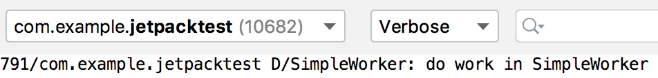

**图 13.14　SimpleWorker 中打印的日志**

可以看到，SimpleWorker 确实已经成功运行了。

好了，WorkManager 的基本用法就是这么简单，不过接下来我们要去处理一些复杂的任务了。

### 13.6.2　使用 WorkManager 处理复杂的任务

在上一小节中，虽然我们成功运行了一个后台任务，但是由于不能控制它的具体运行时间，因此并没有什么太大的实际用处。当然，WorkManager 是不可能没有提供这样的接口的，事实上除了运行时间之外，WorkManager 还允许我们控制许多其他方面的东西，下面就来具体看一下吧。

首先从最简单的看起，让后台任务在指定的延迟时间后运行，只需要借助 `setInitialDelay()` 方法就可以了，代码如下所示：

```Kotlin
val request = OneTimeWorkRequest.Builder(SimpleWorker::class.java)
    .setInitialDelay(5, TimeUnit.MINUTES)
    .build()
```

这就表示我们希望让 SimpleWorker 这个后台任务在 5 分钟后运行。你可以自由选择时间的单位，毫秒、秒、分钟、小时、天都可以。

可以控制运行时间之后，我们再增加一些别的功能，比如说给后台任务请求添加标签：

```Kotlin
val request = OneTimeWorkRequest.Builder(SimpleWorker::class.java)
    ...
    .addTag("simple")
    .build()
```

那么添加了标签有什么好处呢？最主要的一个功能就是我们可以通过标签来取消后台任务请求：

```Kotlin
WorkManager.getInstance(this).cancelAllWorkByTag("simple")
```

当然，即使没有标签，也可以通过 id 来取消后台任务请求：

```Kotlin
WorkManager.getInstance(this).cancelWorkById(request.id)
```

但是，使用 id 只能取消单个后台任务请求，而使用标签的话，则可以将同一标签名的所有后台任务请求全部取消，这个功能在逻辑复杂的场景下尤其有用。

除此之外，我们也可以使用如下代码来一次性取消所有后台任务请求：

```Kotlin
WorkManager.getInstance(this).cancelAllWork()
```

另外，我们在上一小节中讲到，如果后台任务的 `doWork()` 方法中返回了 `Result.retry()`，那么是可以结合 `setBackoffCriteria()` 方法来重新执行任务的，具体代码如下所示：

```Kotlin
val request = OneTimeWorkRequest.Builder(SimpleWorker::class.java)
    ...
    .setBackoffCriteria(BackoffPolicy.LINEAR, 10, TimeUnit.SECONDS)
    .build()
```

`setBackoffCriteria()` 方法接收 3 个参数：第二个和第三个参数用于指定在多久之后重新执行任务，时间最短不能少于 10 秒钟；第一个参数则用于指定如果任务再次执行失败，下次重试的时间应该以什么样的形式延迟。这其实很好理解，假如任务一直执行失败，不断地重新执行似乎并没有什么意义，只会徒增设备的性能消耗。而随着失败次数的增多，下次重试的时间也应该进行适当的延迟，这才是更加合理的机制。第一个参数的可选值有两种，分别是 `LINEAR` 和 `EXPONENTIAL`，前者代表下次重试时间以线性的方式延迟，后者代表下次重试时间以指数的方式延迟。

了解了 `Result.retry()` 的作用之后，你一定还想知道，`doWork()` 方法中返回 `Result.success()` 和 `Result.failure()` 又有什么作用？这两个返回值其实就是用于通知任务运行结果的，我们可以使用如下代码对后台任务的运行结果进行监听：

```Kotlin
WorkManager.getInstance(this)
    .getWorkInfoByIdLiveData(request.id)
    .observe(this) { workInfo ->
        if (workInfo.state == WorkInfo.State.SUCCEEDED) {
            Log.d("MainActivity", "do work succeeded")
        } else if (workInfo.state == WorkInfo.State.FAILED) {
            Log.d("MainActivity", "do work failed")
        }
    }
```

这里调用了 `getWorkInfoByIdLiveData()` 方法，并传入后台任务请求的 `id`，会返回一个 `LiveData` 对象。然后我们就可以调用 `LiveData` 对象的 `observe()` 方法来观察数据变化了，以此监听后台任务的运行结果。

另外，你也可以调用 `getWorkInfosByTagLiveData()` 方法，监听同一标签名下所有后台任务请求的运行结果，用法是差不多的，这里就不再进行解释了。

接下来，我们再来看一下 WorkManager 中比较有特色的一个功能——链式任务。

假设这里定义了 3 个独立的后台任务：同步数据、压缩数据和上传数据。现在我们想要实现先同步、再压缩、最后上传的功能，就可以借助链式任务来实现，代码示例如下：

```Kotlin
val sync = ...
val compress = ...
val upload = ...
WorkManager.getInstance(this)
    .beginWith(sync)
    .then(compress)
    .then(upload)
    .enqueue()
```

这段代码还是比较好理解的，相信你一看就能懂。`beginWith()` 方法用于开启一个链式任务，至于后面要接上什么样的后台任务，只需要使用 `then()` 方法来连接即可。另外 WorkManager 还要求，必须在前一个后台任务运行成功之后，下一个后台任务才会运行。也就是说，如果某个后台任务运行失败，或者被取消了，那么接下来的后台任务就都得不到运行了。

在本节的最后，我还想多说几句。前面所介绍的 WorkManager 的所有功能，在国产手机上都有可能得不到正确的运行。这是因为绝大多数的国产手机厂商在进行 Android 系统定制的时候会增加一个一键关闭的功能，允许用户一键杀死所有非白名单的应用程序。而被杀死的应用程序既无法接收广播，也无法运行 WorkManager 的后台任务。这个功能虽然与 Android 原生系统的设计理念并不相符，但是我们也没有什么解决办法。或许就是因为有太多恶意应用总是想要无限占用后台，国产手机厂商才增加了这个功能吧。因此，这里给你的建议就是，WorkManager 可以用，但是千万别依赖它去实现什么核心功能，因为它在国产手机上可能会非常不稳定。

好了，关于 WorkManager，你所需要知道的内容大概就是这些了，那么我们本章对于 Jetpack 的学习也就到此为止。目前你已经具备了开发一款高质量架构 Android 应用的能力，在第 15 章中会给你真正的实战机会。但是现在，我们还是按照惯例，进入本章的 Kotlin 课堂，学习更多的知识和技能。

## 13.7　Kotlin 课堂：使用 DSL 构建专有的语法结构

DSL 的全称是领域特定语言（Domain Specific Language），它是编程语言赋予开发者的一种特殊能力，通过它我们可以编写出一些看似脱离其原始语法结构的代码，从而构建出一种专有的语法结构。

毫无疑问，Kotlin 也是支持 DSL 的，并且在 Kotlin 中实现 DSL 的实现方式并不固定，比如我们之前在第 9 章的 Kotlin 课堂中使用 infix 函数构建出的特有语法结构就属于 DSL。不过本节课我们的主要学习目标是通过高阶函数的方式来实现 DSL，这也是 Kotlin 中实现 DSL 最常见的方式。

不管你有没有察觉到，其实长久以来你一直都在使用 DSL。比如我们想要在项目中添加一些依赖库，需要在 build.gradle 文件中编写如下内容：

```gradle
dependencies {
    implementation 'com.squareup.retrofit2:retrofit:2.6.1'
    implementation 'com.squareup.retrofit2:converter-gson:2.6.1'
}
```

Gradle 是一种基于 Groovy 语言的构建工具，因此上述的语法结构其实就是 Groovy 提供的 DSL 功能。有没有觉得很神奇？不用吃惊，借助 Kotlin 的 DSL，我们也可以实现类似的语法结构，下面就来具体看一下吧。

首先新建一个 DSL.kt 文件，然后在里面定义一个 `Dependency` 类，代码如下所示：

```Kotlin
class Dependency {

    val libraries = ArrayList<String>()

    fun implementation(lib: String) {
        libraries.add(lib)
    }

}
```

这里我们使用了一个 List 集合来保存所有的依赖库，然后又提供了一个 `implementation()` 方法，用于向 List 集合中添加依赖库，代码非常简单。

接下来再定义一个 `dependencies` 高阶函数，代码如下所示：

```Kotlin
fun dependencies(block: Dependency.() -> Unit): List<String> {
    val dependency = Dependency()
    dependency.block()
    return dependency.libraries
}
```

可以看到，`dependencies` 函数接收一个函数类型参数，并且该参数是定义到 `Dependency` 类中的，因此调用它的时候需要先创建一个 `Dependency` 的实例，然后再通过该实例调用函数类型参数，这样传入的 Lambda 表达式就能得到执行了。最后，我们将 `Dependency` 类中保存的依赖库集合返回。

没错，经过这样的 DSL 设计之后，我们就可以在项目中使用如下的语法结构了：

```gradle
dependencies {
    implementation("com.squareup.retrofit2:retrofit:2.6.1")
    implementation("com.squareup.retrofit2:converter-gson:2.6.1")
}
```

这里我来简单解释一下。由于 `dependencies` 函数接收一个函数类型参数，因此这里我们可以传入一个 Lambda 表达式。而此时的 Lambda 表达式中拥有 `Dependency` 类的上下文，因此当然就可以直接调用 `Dependency` 类中的 `implementation()` 方法来添加依赖库了。

当然，这种语法结构和我们在 build.gradle 文件中使用的语法结构并不完全相同，这主要是因为 Kotlin 和 Groovy 在语法层面还是有一定差别的。

另外，我们也可以通过 `dependencies` 函数的返回值来获取所有添加的依赖库，代码如下所示：

```Kotlin
fun main() {
    val libraries = dependencies {
        implementation("com.squareup.retrofit2:retrofit:2.6.1")
        implementation("com.squareup.retrofit2:converter-gson:2.6.1")
    }
    for (lib in libraries) {
        println(lib)
    }
}
```

这里用一个 `libraries` 变量接收 `dependencies` 函数的返回值，然后使用 `for-in` 循环将集合中的依赖库全部打印出来。现在运行一下 `main()` 函数，结果如图 13.15 所示。

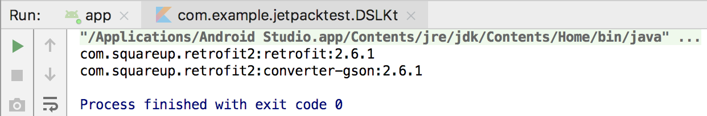

**图 13.15　获得所有添加的依赖库**

可以看到，我们已经成功将使用 DSL 语法结构添加的依赖库全部获取到了。

这种语法结构比起直接调用 `Dependency` 对象的 `implementation()` 方法要更直观一些，而且你会发现，需要添加的依赖库越多，使用 DSL 写法的优势就会越明显。

在实现了一个较为简单的 DSL 之后，接下来我们再尝试编写一个复杂一点的 DSL。

如果你了解一些前端开发的话，应该知道网页的展示都是由浏览器解析 HTML 代码来实现的。HTML 中定义了很多标签，其中 `<table>` 标签用于创建一个表格，`<tr>` 标签用于创建表格的行，`<td>` 标签用于创建单元格。将这 3 种标签嵌套使用，就可以定制出包含任意行列的表格了。

这里我们来做个实验吧，首先创建一个 test.txt 文件，并在其中编写如下 HTML 代码：

```xml
<table>
    <tr>
        <td>Apple</td>
        <td>Grape</td>
        <td>Orange</td>
    </tr>
    <tr>
        <td>Pear</td>
        <td>Banana</td>
        <td>Watermelon</td>
    </tr>
</table>
```

这段代码会创建出一个两行三列的表格。那么要如何进行验证呢？很简单，修改一下文件的后缀名就可以了，这里将文件改名成 test.html，然后双击文件，使用浏览器打开即可，效果如图 13.16 所示。

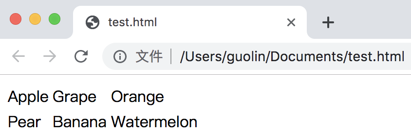

**图 13.16　两行三列的表格效果**

这就是一个两行三列表格的效果，只是默认情况下表格边框的宽度是零，所以我们看不到边框而已。

那么如果现在有一个需求，要求我们在 Kotlin 中动态生成表格所对应的 HTML 代码，你会怎么做呢？最简单直接的方式就是字符串拼接了，但是这种做法显然十分烦琐，而且字符串拼接的代码也难以阅读。

这个时候 DSL 又可以大显身手了，借助 DSL，我们可以以一种不可思议的语法结构来动态生成表格所对应的 HTML 代码，下面就来看一下具体应该如何实现吧。

仍然是在 DSL.kt 文件中进行编写，首先定义一个 `Td` 类，代码如下所示：

```Kotlin
class Td {
    var content = ""

    fun html() = "\n\t\t<td>$content</td>"
}
```

由于 `<td>` 标签表示一个单元格，其中必然是要包含内容的，因此这里我们使用了一个 `content` 字段来存储单元格中显示的内容。另外，还提供了一个 `html()` 方法，当调用这个方法时就返回一段 `<td>` 标签的 HTML 代码，并将 `content` 中存储的内容拼接进去。注意，为了让最终输出的结果更加直观，我使用了 `\n` 和 `\t` 转义符来进行换行和缩进，当然你可以不加这些转义符，因为浏览器在解析 HTML 代码时是忽略换行和缩进的。

完成了 `Td` 类，接下来我们再定义一个 `Tr` 类，代码如下所示：

```Kotlin
class Tr {
    private val children = ArrayList<Td>()

    fun td(block: Td.() -> String) {
        val td = Td()
        td.content = td.block()
        children.add(td)
    }

    fun html(): String {
        val builder = StringBuilder()
        builder.append("\n\t<tr>")
        for (childTag in children) {
            builder.append(childTag.html())
        }
        builder.append("\n\t</tr>")
        return builder.toString()
    }
}
```

`Tr` 类相比于 `Td` 类就要复杂一些了。由于 `<tr>` 标签表示表格的行，它是可以包含多个 `<td>` 标签的，因此我们首先创建了一个 `children` 集合，用于存储当前 `Tr` 所包含的 `Td` 对象。接下来提供了一个 `td()` 函数，它接收一个定义到 `Td` 类中并且返回值是 `String` 的函数类型参数。当调用 `td()` 函数时，会先创建一个 `Td` 对象，接着调用函数类型参数并获取它的返回值，然后赋值到 `Td` 类的 `content` 字段当中，这样就可以将调用 `td()` 函数时传入的 Lambda 表达式的返回值赋值给 `content` 字段了。当然，这里既然创建了一个 `Td` 对象，就一定要记得将它添加到 `children` 集合当中。

另外，`Tr` 类中也定义了一个 `html()` 方法，它的作用和刚才 `Td` 类中的 `html()` 方法一致。只是由于每个 `Tr` 都可能会包含很多个 `Td`，因此我们需要使用循环来遍历 `children` 集合，将所有的子 `Td` 都拼接到 `<tr>` 标签当中，从而返回一段嵌套的 HTML 代码。

定义好了 `Tr` 类之后，我们现在就可以使用如下的语法格式来构建表格中的一行数据：

```Kotlin
val tr = Tr()
tr.td { "Apple" }
tr.td { "Grape" }
tr.td { "Orange" }
```

好像已经有那么回事了，但这仍然不是我们追求的最终效果。那么接下来继续对 DSL 进行完善，再定义一个 `Table` 类，代码如下所示：

```Kotlin
class Table {
    private val children = ArrayList<Tr>()

    fun tr(block: Tr.() -> Unit) {
        val tr = Tr()
        tr.block()
        children.add(tr)
    }

    fun html(): String {
        val builder = StringBuilder()
        builder.append("<table>")
        for (childTag in children) {
            builder.append(childTag.html())
        }
        builder.append("\n</table>")
        return  builder.toString()
    }
}
```

这段代码相对就好理解多了，因为和刚才 `Tr` 类中的代码是比较相似的。`Table` 类中同样创建了一个 `children` 集合，用于存储当前 `Table` 所包含的 `Tr` 对象。然后定义了一个 `tr()` 函数，它接收一个定义到 `Tr` 类中的函数类型参数。当调用 `tr()` 函数时，会先创建一个 `Tr` 对象，接着调用函数类型参数，这样 Lambda 表达式中的代码就能得到执行。最后，仍然要记得将创建的 `Tr` 对象添加到 `children` 集合当中。

除此之外，`html()` 方法中的代码也都是类似的，这里遍历了 `children` 集合，将所有的子 `Tr` 对象都拼接到了 `<table>` 标签当中。

那么现在，我们就可以使用如下的语法结构来构建一个表格了：

```Kotlin
val table = Table()
table.tr {
    td { "Apple" }
    td { "Grape" }
    td { "Orange" }
}
table.tr {
    td { "Pear" }
    td { "Banana" }
    td { "Watermelon" }
}
```

这段代码看上去已经相当不错了，不过这仍然不是最终版本，我们还可以再进一步对语法结构进行精简。定义一个 `table()` 函数，代码如下所示：

```Kotlin
fun table(block: Table.() -> Unit): String {
    val table = Table()
    table.block()
    return table.html()
}
```

这里的 `table()` 函数接收一个定义到 `Table` 类中的函数类型参数，当调用 `table()` 函数时，会先创建一个 `Table` 对象，接着调用函数类型参数，这样 Lambda 表达式中的代码就能得到执行。最后调用 Table 的 `html()` 方法获取生成的 HTML 代码，并作为最终的返回值返回。

编写了这么多代码之后，我们就可以使用如下神奇的语法结构来动态生成一个表格所对应的 HTML 代码了：

```Kotlin
fun main() {
    val html = table {
        tr {
            td { "Apple" }
            td { "Grape" }
            td { "Orange" }
        }
        tr {
            td { "Pear" }
            td { "Banana" }
            td { "Watermelon" }
        }
    }
    println(html)
}
```

怎么样？这种 DSL 结构的语法是不是语义性很强，一看就懂？而且很难想象这种语法结构竟然是用 Kotlin 语言编写出来的吧？现在我们可以运行一下 `main()` 函数，结果如图 13.17 所示。


**图 13.17　使用 DSL 生成的表格 HTML 代码**

可以看到，这样我们就能够轻松地生成任意表格所对应的 HTML 代码了。

另外，在 DSL 中也可以使用 Kotlin 的其他语法特性，比如通过循环来批量生成 `<tr>` 和 `<td>` 标签：

```Kotlin
fun main() {
    val html = table {
        repeat(2) {
            tr {
                val fruits = listOf("Apple", "Grape", "Orange")
                for (fruit in fruits) {
                    td { fruit }
                }
            }
        }
    }
    println(html)
}
```

这里使用了 `repeat()` 函数来为表格生成两行数据，每行数据中又使用了 `for-in` 循环来遍历 List 集合，为表格填充具体的单元格数据。最终的运行结果如图 13.18 所示。

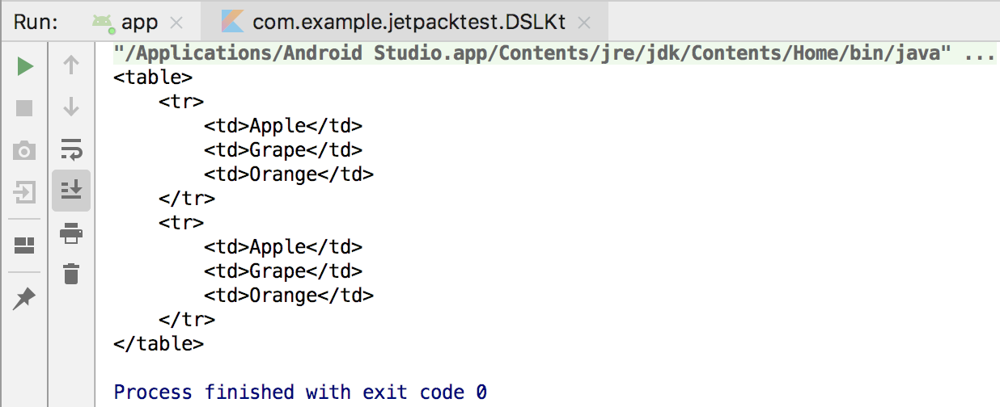

**图 13.18　使用循环批量生成表格内容**

在这个例子中，我们充分利用了 Kotlin 高阶函数的特性，完成了一个难度颇高的 DSL 定制，希望你能从中受益良多。当你在以后的开发工作中也需要进行 DSL 定制的时候，相信本节 Kotlin 课堂的内容一定能够给你提供很好的思路与帮助。

好了，关于 Kotlin DSL 的内容我们就学到这里，接下来我们就总结一下本章所学习的知识吧。

## 13.8　小结与点评

在本章中，我们对 Google 新推出的开发组件工具集 Jetpack 进行了学习。当然，Jetpack 包含的面很广，所以我们只是重点学习了其中的架构组件。架构组件主要是为了帮助开发者编写出更加符合高质量代码规范、更加具有架构设计的应用程序，尤其是 ViewModel、Lifecycles 和 LiveData 这 3 个组件，简直就是为 MVVM 架构而量身打造的，我们将会在第 15 章中使用 MVVM 架构编写一个完整的实战项目。

而本章中学习的 Room 作为数据库功能的补充，在很大程度上也能提升应用程序在本地存储方面的架构设计。WorkManager 则给我们提供了执行后台任务的另外一种选择，但请注意，它和 Service 是完全不同的。

在本章的 Kotlin 课堂中，我们学习了一项颇有难度的新技术——构建 DSL，但其实本章并没有用到任何 Kotlin 的新知识点，只是通过对高阶函数的灵活运用，编写出了一段看似不属于 Kotlin 语言的语法结构。构建 DSL 可能并不属于非常常用的功能，但是当你真正需要构建 DSL 的时候，来翻一下本节课的内容，相信一定会给你带来不少帮助。

现在你已经足足学习了 13 章的内容，对 Android 应用程序开发的理解应该比较深刻了。目前系统性的知识点几乎已经全部讲完了，但是还有一些零散的高级技巧在等待着你，那么就让我们赶快进入下一章的学习当中吧。