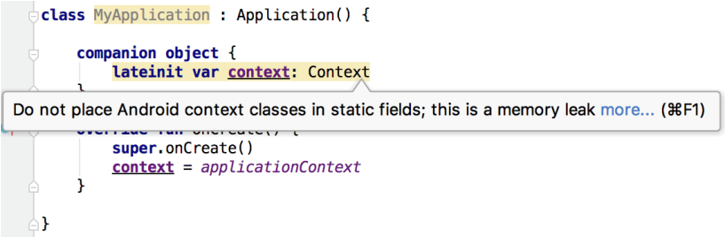
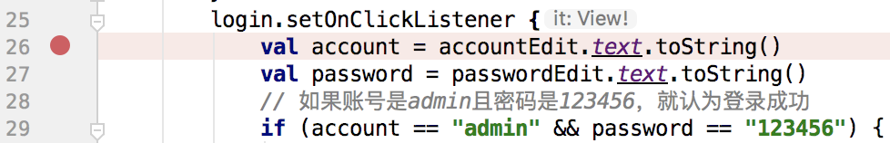
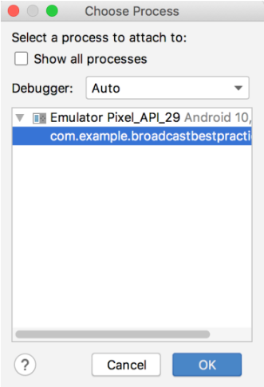
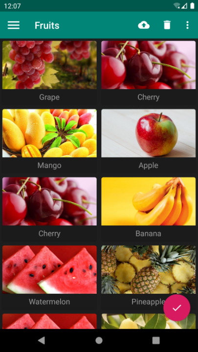
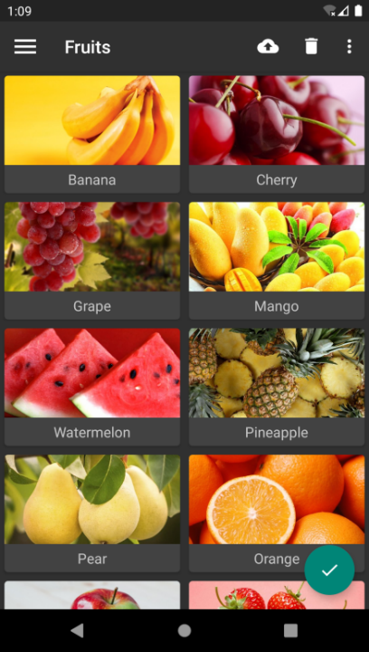
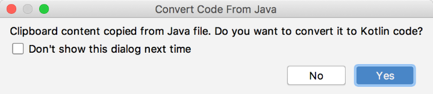
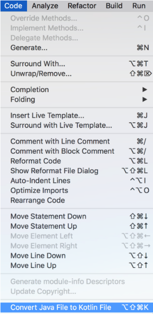
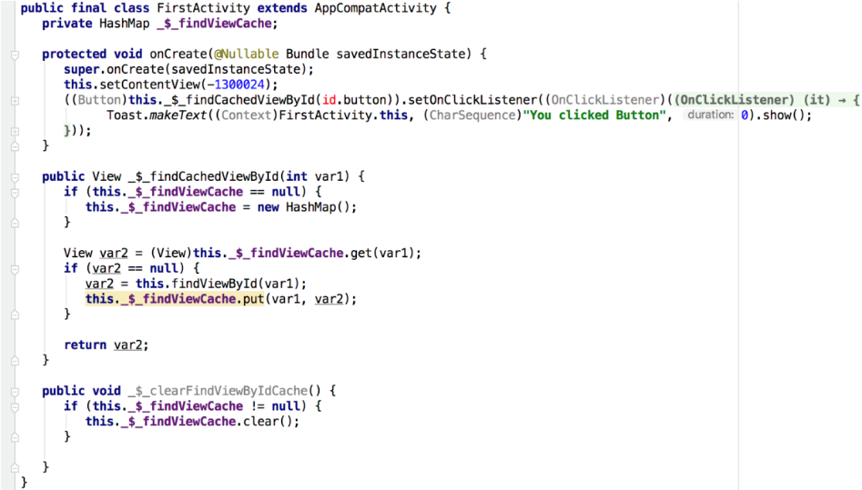

# 第 14 章　继续进阶，你还应该掌握的高级技巧

本书的内容虽然已经接近尾声了，但是千万不要因此而放松，现在正是你继续进阶的时机。相信基础性的 Android 知识已经没有太多能够难倒你的了，那么本章中我们就来学习一些你还应该掌握的高级技巧吧。

## 14.1　全局获取 Context 的技巧

回想这么久以来我们所学的内容，你会发现有很多地方都需要用到 `Context`，弹出 Toast 的时候需要，启动 Activity 的时候需要，发送广播的时候需要，操作数据库的时候需要，使用通知的时候需要……

或许目前你还没有为得不到 `Context` 而发愁过，因为我们很多的操作是在 Activity 中进行的，而 Activity 本身就是一个 `Context` 对象。但是，当应用程序的架构逐渐开始复杂起来的时候，很多逻辑代码将脱离 `Activity` 类，但此时你又恰恰需要使用 `Context`，也许这个时候你就会感到有些伤脑筋了。

例如，在第 12 章的 Kotlin 课堂中，我们编写了一个 Toast.kt 文件，并在这里对 Toast 的用法进行了封装，代码如下所示：

```Kotlin
fun String.showToast(context: Context, duration: Int = Toast.LENGTH_SHORT) {
    Toast.makeText(context, this, duration).show()
}

fun Int.showToast(context: Context, duration: Int = Toast.LENGTH_SHORT) {
    Toast.makeText(context, this, duration).show()
}
```

可以看到，由于 Toast 的 `makeText()` 方法要求传入一个 `Context` 参数，但是当前代码既不在 Activity 当中，也不在 Service 当中，是没有办法直接获取 `Context` 对象的。于是这里我们只好给 `showToast()` 方法添加了一个 `Context` 参数，让调用 `showToast()` 方法的人传递一个 `Context` 对象进来。

虽说这也是一种解决方案，但是有点推卸责任的嫌疑，因为我们将获取 `Context` 的任务转移给了 `showToast()` 方法的调用方，至于调用方能不能得到 `Context` 对象，那就不是我们需要考虑的问题了。

由此可以看出，在某些情况下，获取 `Context` 并非是那么容易的一件事，有时候还是挺伤脑筋的。不过别担心，下面我们就来学习一种技巧，让你在项目的任何地方都能够轻松获取 `Context`。

Android 提供了一个 `Application` 类，每当应用程序启动的时候，系统就会自动将这个类进行初始化。而我们可以定制一个自己的 `Application` 类，以便于管理程序内一些全局的状态信息，比如全局 `Context`。

定制一个自己的 `Application` 其实并不复杂，首先需要创建一个 `MyApplication` 类继承自 `Application`，代码如下所示：

```Kotlin
class MyApplication : Application() {

    companion object {
        lateinit var context: Context
    }

    override fun onCreate() {
        super.onCreate()
        context = applicationContext
    }

}
```

可以看到，`MyApplication` 中的代码非常简单。这里我们在 `companion object` 中定义了一个 `context` 变量，然后重写父类的 `onCreate()` 方法，并将调用 `getApplicationContext()` 方法得到的返回值赋值给 `context` 变量，这样我们就可以以静态变量的形式获取 `Context` 对象了。

需要注意的是，将 `Context` 设置成静态变量很容易会产生内存泄漏的问题，所以这是一种有风险的做法，因此 Android Studio 会给出如图 14.1 所示的警告提示。



**图 14.1　提示有内存泄漏的风险**

但是由于这里获取的不是 Activity 或 Service 中的 `Context`，而是 Application 中的 `Context`，它全局只会存在一份实例，并且在整个应用程序的生命周期内都不会回收，因此是不存在内存泄漏风险的。那么我们可以使用如下注解，让 Android Studio 忽略上述警告提示：

```Kotlin
class MyApplication : Application() {

    companion object {
        @SuppressLint("StaticFieldLeak")
        lateinit var context: Context
    }
    ...
}
```

接下来我们还需要告知系统，当程序启动的时候应该初始化 `MyApplication` 类，而不是默认的 `Application` 类。这一步也很简单，在 AndroidManifest.xml 文件的 `<application>` 标签下进行指定就可以了，代码如下所示：

```xml
<manifest xmlns:android="http://schemas.android.com/apk/res/android"
          package="com.example.materialtest">
    <application
        android:name=".MyApplication"
        android:allowBackup="true"
        android:icon="@mipmap/ic_launcher"
        android:label="@string/app_name"
        android:roundIcon="@mipmap/ic_launcher_round"
        android:supportsRtl="true"
        android:theme="@style/AppTheme">
        ...
    </application>
</manifest>
```

这样我们就实现了一种全局获取 `Context` 的机制，之后不管你想在项目的任何地方使用 `Context`，只需要调用一下 `MyApplication.context` 就可以了。

那么接下来我们再对 `showToast()` 方法进行优化，代码如下所示：

```Kotlin
fun String.showToast(duration: Int = Toast.LENGTH_SHORT) {
    Toast.makeText(MyApplication.context, this, duration).show()
}

fun Int.showToast(duration: Int = Toast.LENGTH_SHORT) {
    Toast.makeText(MyApplication.context, this, duration).show()
}
```

可以看到，`showToast()` 方法不需要再通过传递参数的方式得到 `Context` 对象，而是调用一下 `MyApplication.context` 就可以了。这样 `showToast()` 方法的用法也得到了进一步的精简，现在只需要使用如下写法就能弹出一段文字提示：

```Kotlin
"This is Toast".showToast()
```

有了这个技巧，你就再也不用为得不到 `Context` 对象而发愁了。

## 14.2　使用 Intent 传递对象

Intent 的用法相信你已经比较熟悉了，我们可以借助它来启动 Activity、启动 Service、发送广播等。在进行上述操作的时候，我们还可以在 Intent 中添加一些附加数据，以达到传值的效果，比如在 `FirstActivity` 中添加如下代码：

```Kotlin
val intent = Intent(this, SecondActivity::class.java)
intent.putExtra("string_data", "hello")
intent.putExtra("int_data", 100)
startActivity(intent)
```

这里调用了 Intent 的 `putExtra()` 方法来添加要传递的数据，之后在 `SecondActivity` 中就可以得到这些值了，代码如下所示：

```Kotlin
intent.getStringExtra("string_data")
intent.getIntExtra("int_data", 0)
```

但是不知道你有没有发现，`putExtra()` 方法中所支持的数据类型是有限的，虽然常用的一些数据类型是支持的，但是当你想去传递一些自定义对象的时候，就会发现无从下手。不用担心，下面我们就学习一下使用 Intent 来传递对象的技巧。

### 14.2.1　Serializable 方式

使用 Intent 来传递对象通常有两种实现方式：Serializable 和 Parcelable。本小节中我们先来学习一下第一种实现方式。

Serializable 是序列化的意思，表示将一个对象转换成可存储或可传输的状态。序列化后的对象可以在网络上进行传输，也可以存储到本地。至于序列化的方法非常简单，只需要让一个类去实现 `Serializable` 这个接口就可以了。

比如说有一个 `Person` 类，其中包含了 `name` 和 `age` 这两个字段，如果想要将它序列化，就可以这样写：

```Kotlin
class Person : Serializable {
    var name = ""
    var age = 0
}
```

这里我们让 `Person` 类实现了 `Serializable` 接口，这样所有的 `Person` 对象都是可序列化的了。

然后在 `FirstActivity` 中只需要这样写：

```Kotlin
val person = Person()
person.name = "Tom"
person.age = 20
val intent = Intent(this, SecondActivity::class.java)
intent.putExtra("person_data", person)
startActivity(intent)
```

可以看到，这里我们创建了一个 `Person` 的实例，并将它直接传入了 Intent 的 `putExtra()` 方法中。由于 `Person` 类实现了 `Serializable` 接口，所以才可以这样写。

接下来在 `SecondActivity` 中获取这个对象也很简单，写法如下：

```Kotlin
val person = intent.getSerializableExtra("person_data") as Person
```

这里调用了 Intent 的 `getSerializableExtra()` 方法来获取通过参数传递过来的序列化对象，接着再将它向下转型成 `Person` 对象，这样我们就成功实现了使用 Intent 传递对象的功能。

需要注意的是，这种传递对象的工作原理是先将一个对象序列化成可存储或可传输的状态，传递给另外一个 Activity 后再将其反序列化成一个新的对象。虽然这两个对象中存储的数据完全一致，但是它们实际上是不同的对象，这一点希望你能了解清楚。

### 14.2.2　Parcelable 方式

除了 Serializable 之外，使用 Parcelable 也可以实现相同的效果，不过不同于将对象进行序列化，Parcelable 方式的实现原理是将一个完整的对象进行分解，而分解后的每一部分都是 Intent 所支持的数据类型，这样就能实现传递对象的功能了。

下面我们来看一下 Parcelable 的实现方式，修改 `Person` 中的代码，如下所示：

```Kotlin
class Person : Parcelable {
    var name = ""
    var age = 0

    override fun writeToParcel(parcel: Parcel, flags: Int) {
        parcel.writeString(name) // 写出name
        parcel.writeInt(age) // 写出age
    }

    override fun describeContents(): Int {
        return 0
    }

    companion object CREATOR : Parcelable.Creator<Person> {
        override fun createFromParcel(parcel: Parcel): Person {
            val person = Person()
            person.name = parcel.readString() ?: "" // 读取name
            person.age = parcel.readInt() // 读取age
            return person
        }

        override fun newArray(size: Int): Array<Person?> {
            return arrayOfNulls(size)
        }
    }
}
```

Parcelable 的实现方式要稍微复杂一些。可以看到，首先我们让 `Person` 类实现了 `Parcelable` 接口，这样就必须重写 `describeContents()` 和 `writeToParcel()` 这两个方法。其中 `describeContents()` 方法直接返回 0 就可以了，而在 `writeToParcel()` 方法中，我们需要调用 Parcel 的 `writeXxx()` 方法，将 `Person` 类中的字段一一写出。注意，字符串型数据就调用 `writeString()` 方法，整型数据就调用 `writeInt()` 方法，以此类推。

除此之外，我们还必须在 `Person` 类中提供一个名为 `CREATOR` 的匿名类实现。这里创建了 `Parcelable.Creator` 接口的一个实现，并将泛型指定为 `Person`。接着需要重写 `createFromParcel()` 和 `newArray()` 这两个方法，在 `createFromParcel()` 方法中，我们要创建一个 `Person` 对象进行返回，并读取刚才写出的 `name` 和 `age` 字段。其中 `name` 和 `age` 都是调用 `Parcel` 的 `readXxx()` 方法读取到的，注意这里读取的顺序一定要和刚才写出的顺序完全相同。而 `newArray()` 方法中的实现就简单多了，只需要调用 `arrayOfNulls()` 方法，并使用参数中传入的 `size` 作为数组大小，创建一个空的 `Person` 数组即可。

接下来，在 `FirstActivity` 中我们仍然可以使用相同的代码来传递 `Person` 对象，只不过在 `SecondActivity` 中获取对象的时候需要稍加改动，如下所示：

```Kotlin
val person = intent.getParcelableExtra("person_data") as Person
```

注意，这里不再是调用 `getSerializableExtra()` 方法，而是调用 `getParcelableExtra()` 方法来获取传递过来的对象，其他的地方完全相同。

不过，这种实现方式写起来确实比较复杂，为此 Kotlin 给我们提供了另外一种更加简便的用法，但前提是要传递的所有数据都必须封装在对象的主构造函数中才行。

修改 `Person` 类中的代码，如下所示：

```Kotlin
@Parcelize
class Person(var name: String, var age: Int) : Parcelable
```

没错，就是这么简单。将 `name` 和 `age` 这两个字段移动到主构造函数中，然后给 `Person` 类添加一个 `@Parcelize` 注解即可，是不是比之前的用法简单了好多倍？

这样我们就把使用 Intent 传递对象的两种实现方式都学习完了。对比一下，Serializable 的方式较为简单，但由于会把整个对象进行序列化，因此效率会比 Parcelable 方式低一些，所以在通常情况下，还是更加推荐使用 Parcelable 的方式来实现 Intent 传递对象的功能。

## 14.3　定制自己的日志工具

早在 1.4 节中我们就已经学过了 Android 日志工具的用法，并且日志工具贯穿了我们整本书的学习。虽然 Android 中自带的日志工具功能非常强大，但也不能说完全没有缺点，例如在打印日志的控制方面就做得不够好。

打个比方，你正在编写一个比较庞大的项目，期间为了方便调试，在代码的很多地方打印了大量的日志。最近项目已经基本完成了，但是却有一个非常让人头疼的问题，之前用于调试的那些日志，在项目正式上线之后仍然会照常打印，这样不仅会降低程序的运行效率，还有可能将一些机密性的数据泄露出去。

那该怎么办呢？难道要一行一行地把所有打印日志的代码都删掉吗？显然这不是什么好点子，不仅费时费力，而且以后你继续维护这个项目的时候可能还会需要这些日志。因此，最理想的情况是能够自由地控制日志的打印，当程序处于开发阶段时就让日志打印出来，当程序上线之后就把日志屏蔽掉。

看起来好像是挺高级的一个功能，其实并不复杂，我们只需要定制一个自己的日志工具就可以轻松完成了。新建一个 `LogUtil` 单例类，代码如下所示：

```Kotlin
object LogUtil {

    private const val VERBOSE = 1

    private const val DEBUG = 2

    private const val INFO = 3

    private const val WARN = 4

    private const val ERROR = 5

    private var level = VERBOSE

    fun v(tag: String, msg: String) {
        if (level <= VERBOSE) {
            Log.v(tag, msg)
        }
    }

    fun d(tag: String, msg: String) {
        if (level <= DEBUG) {
            Log.d(tag, msg)
        }
    }

    fun i(tag: String, msg: String) {
        if (level <= INFO) {
            Log.i(tag, msg)
        }
    }

    fun w(tag: String, msg: String) {
        if (level <= WARN) {
            Log.w(tag, msg)
        }
    }

    fun e(tag: String, msg: String) {
        if (level <= ERROR) {
            Log.e(tag, msg)
        }
    }

}
```

可以看到，我们在 `LogUtil` 中首先定义了 `VERBOSE`、`DEBUG`、`INFO`、`WARN`、`ERROR` 这 5 个整型常量，并且它们对应的值都是递增的。然后又定义了一个静态变量 `level`，可以将它的值指定为上面 5 个常量中的任意一个。

接下来，我们提供了 `v()`、`d()`、`i()`、`w()`、`e()` 这 5 个自定义的日志方法，在其内部分别调用了 `Log.v()`、`Log.d()`、`Log.i()`、`Log.w()`、`Log.e()` 这 5 个方法来打印日志，只不过在这些自定义的方法中都加入了一个 `if` 判断，只有当 `level` 的值小于或等于对应日志级别值的时候，才会将日志打印出来。

这样就把一个自定义的日志工具创建好了，之后在项目里，我们可以像使用普通的日志工具一样使用 `LogUtil`。比如打印一行 DEBUG 级别的日志可以这样写：

```Kotlin
LogUtil.d("TAG", "debug log")
```

打印一行 WARN 级别的日志可以这样写：

```Kotlin
LogUtil.w("TAG", "warn log")
```

我们只需要通过修改 `level` 变量的值，就可以自由地控制日志的打印行为。比如让 `level` 等于 `VERBOSE` 就可以把所有的日志都打印出来，让 `level` 等于 `ERROR` 就可以只打印程序的错误日志。

使用了这种方法之后，刚才所说的那个问题也就不复存在了，你只需要在开发阶段将 `level` 指定成 `VERBOSE`，当项目正式上线的时候将 `level` 指定成 `ERROR` 就可以了。

## 14.4　调试 Android 程序

当开发过程中遇到一些奇怪的 bug，但又迟迟定位不出来原因的时候，最好的解决办法就是调试了。调试允许我们逐行地执行代码，并可以实时观察内存中的数据，从而能够比较轻易地查出问题的原因。那么本节中我们就来学习一下使用 Android Studio 调试 Android 程序的技巧。

还记得在第 6 章的最佳实践环节中编写的那个强制下线程序吗？就让我们通过这个例子来学习一下 Android 程序的调试方法吧。这个程序中有一个登录功能，假如现在登录出现了问题，我们就可以通过调试来定位问题的原因。

调试工作的第一步是添加断点，这里由于我们要调试登录部分的问题，所以断点可以加在登录按钮的点击事件里面。添加断点的方法也很简单，只需要在相应代码行的左边点击一下就可以了，如图 14.2 所示。



**图 14.2　添加断点**

如果想要取消这个断点，对着它再次点击就可以了。

添加好了断点，接下来就可以对程序进行调试了，点击 Android Studio 顶部工具栏中的“Debug”按钮（图 14.3 中最右边的按钮），就会使用调试模式来启动程序。


**图 14.3　工具栏上的按钮**

等到程序运行起来的时候，首先会看到一个提示框，如图 14.4 所示。


**图 14.4　等待调试器提示框**

这个框很快就会自动消失，然后在输入框里输入账号和密码，并点击“Login”按钮，这时 Android Studio 就会自动打开 Debug 窗口，如图 14.5 所示。


**图 14.5　Debug 窗口**

接下来每按一次 F8 健，代码就会向下执行一行，并且通过 Variables 视图还可以看到内存中的数据，如图 14.6 所示。


**图 14.6　Variables 视图**

可以看到，我们从输入框里获取的账号密码分别是 abc 和 123，而程序里要求正确的账号密码是 admin 和 123456，所以登录才会出现问题。这样我们就通过调试的方式轻松地定位到了问题，调试完成之后点击 Debug 窗口中的“Stop”按钮（图 14.7 中最下边的按钮）来结束调试即可。


**图 14.7　结束调试按钮**

这种调试方式虽然完全可以正常工作，但在调试模式下，程序的运行效率将会大大降低，如果你的断点加在一个比较靠后的位置，需要执行很多操作才能运行到这个断点，那么前面这些操作就会有一些卡顿的感觉。没关系，Android 还提供了另外一种调试的方式，可以让程序随时进入调试模式，下面我们就来尝试一下。

这次不需要使用调试模式来启动程序了，就使用正常的方式。由于现在不是在调试模式下，程序的运行速度比较快，可以先把账号和密码输入好，然后点击 Android Studio 顶部工具栏的“Attach Debugger to Android Process”按钮（图 14.8 中最右边的按钮）。


**图 14.8　工具栏上的按钮**

此时会弹出一个进程选择提示框，如图 14.9 所示。这里目前只列出了一个进程，也就是我们当前程序的进程。选中这个进程，然后点击“OK”按钮，就会让这个进程进入调试模式了。



**图 14.9　进程选择提示框**

接下来在程序中点击“Login”按钮，Android Studio 同样会自动打开 Debug 窗口，之后的流程就是相同的了。相比起来，第二种调试方式会比第一种更加灵活，也更加常用。

## 14.5　深色主题

我们一直以来使用的操作系统都是以浅色主题为主的，这种主题模式在白天或者是光线充足的情况下使用起来没有任何问题，可是在夜晚灯光关闭的情况下使用就会显得非常刺眼。

于是，许多应用程序为了能够让用户在光线昏暗的环境下更加舒适地使用，会在应用内部提供一个一键切换夜间模式的按钮。当用户开启了夜间模式，就会将应用程序的整体色调都调整成更加适合于夜间浏览的颜色。

不过，这种由应用程序自发实现夜间模式的方式很难做到全局统一，即有些应用可能支持夜间模式，有些应用却不支持。而且重复操作的问题也很让人头疼，比如说我在一个应用中开启了夜间模式，在另外一个应用中还需要再开启一次，关闭夜间模式也需要进行同样重复的操作。

因此，很多开发者一直呼吁，希望 Android 能够在系统层面支持夜间模式功能。终于在 Android 10.0 系统中，Google 引入了深色主题这一特性，从而让夜间模式正式成为了官方支持的功能。

或许你会有些疑惑，这种看上去并没有太多技术难度的功能，为什么 Android 直到 10.0 系统中才进行支持呢？这是因为仅仅操作系统自身支持深色主题是没有用的，还得让所有的应用程序都能够支持才行，而这从来都不是一件容易的事情。

为此，我希望你以后开发的应用程序都能够按照 Android 系统的要求对深色主题进行很好地支持，不然当用户开启了深色主题之后，只有你的应用还使用的是浅色主题的话，就会显得格格不入。

除了让眼部在夜间使用时更加舒适之外，深色主题还可以减少电量消耗，从而延长手机续航，是一项非常有用的功能。那么接下来，我们就开始学习如何才能让应用程序支持深色主题功能。

首先，Android 10.0 及以上系统的手机，都可以在 Settings→Display→Dark theme 中对深色主题进行开启和关闭。开启深色主题后，系统的界面风格包括一些内置的应用程序都会变成深色主题的色调，如图 14.10 所示。


**图 14.10　开启深色主题后的设置界面和拨号界面**

不过，如果这时你打开我们自己编写的应用程序，你会发现目前界面的风格还是使用的浅色主题模式，这就和系统的主题风格不同了，说明我们需要对此进行适配。这里我准备使用在第 12 章中编写的 MaterialTest 项目来作为示例，看一看如何才能让它更加完美地适配深色主题模式。

最简单的一种适配方式就是使用 Force Dark，它是一种能让应用程序快速适配深色主题，并且几乎不用编写额外代码的方式。Force Dark 的工作原理是系统会分析浅色主题应用下的每一层 View，并且在这些 View 绘制到屏幕之前，自动将它们的颜色转换成更加适合深色主题的颜色。注意，只有原本使用浅色主题的应用才能使用这种方式，如果你的应用原本使用的就是深色主题，Force Dark 将不会起作用。

这里我们尝试对 MaterialTest 项目使用 Force Dark 转换来进行举例。启用 Force Dark 功能需要借助 `android:forceDarkAllowed` 属性，不过这个属性是从 API 29，也就是 Android 10.0 系统开始才有的，之前的系统无法指定这个属性。因此，我们得进行一些系统差异型编程才行。

右击 res 目录 →New→Directory，创建一个 values-v29 目录，然后右击 values-v29 目录 →New→Values resource file，创建一个 styles.xml 文件。接着对这个文件进行编写，代码如下所示：

```xml
<resources>
    <style name="AppTheme" parent="Theme.AppCompat.Light.NoActionBar">
        <item name="colorPrimary">@color/colorPrimary</item>
        <item name="colorPrimaryDark">@color/colorPrimaryDark</item>
        <item name="colorAccent">@color/colorAccent</item>
        <item name="android:forceDarkAllowed">true</item>
    </style>
</resources>
```

除了 `android:forceDarkAllowed` 属性之外，其他的内容都是从之前的 styles.xml 文件中复制过来的。这里给 AppTheme 主题增加了 `android:forceDarkAllowed` 属性并设置为 `true`，说明现在我们是允许系统使用 Force Dark 将应用强制转换成深色主题的。另外，values-v29 目录是只有 Android 10.0 及以上的系统才会去读取的，因此这是一种系统差异型编程的实现方式。

现在重新运行 MaterialTest 项目，效果如图 14.11 所示。



**图 14.11　Force Dark 的运行效果**

可以看到，虽然整体的界面风格好像确实变成了深色主题的模式，可是却并不怎么美观，尤其是卡片式布局的效果，经过 Force Dark 之后已经完全看不出来了。

Force Dark 就是这样一种简单粗暴的转换方式，并且它的转换效果通常是不尽如人意的。因此，这里我并不推荐你使用这种自动化的方式来实现深色主题，而是应该使用更加传统的实现方式——手动实现。

是的，要想实现最佳的深色主题效果，不要指望有什么神奇魔法能够一键完成，而是应该针对每一个界面都进行浅色和深色两种主题的界面设计。这听上去好像有点复杂，不过我们仍然有一些好用的技巧能让这个过程变得简单。

在第 12 章中我们曾经学习过，AppCompat 库内置的主题恰好主要分为浅色主题和深色主题两类，比如 MaterialTest 项目中目前使用的 Theme.AppCompat.Light.NoActionBar 就是浅色主题，而 Theme.AppCompat.NoActionBar 就是深色主题。选用不同的主题，在控件的默认颜色等方面会有完全不同的效果。

而现在，我们多了一个 DayNight 主题的选项。使用了这个主题后，当用户在系统设置中开启深色主题时，应用程序会自动使用深色主题，反之则会使用浅色主题。

下面我们动手来尝试一下吧。首先删除 values-v29 目录及其目录下的内容，然后修改 values/styles.xml 中的代码，如下所示：

```xml
<resources>

    <!-- Base application theme. -->
    <style name="AppTheme" parent="Theme.AppCompat.DayNight.NoActionBar">
        <!-- Customize your theme here. -->
        <item name="colorPrimary">@color/colorPrimary</item>
        <item name="colorPrimaryDark">@color/colorPrimaryDark</item>
        <item name="colorAccent">@color/colorAccent</item>
    </style>
    ...
</resources>
```

可以看到，这里我们将 AppTheme 的 parent 主题指定成了 Theme.AppCompat.DayNight.NoActionBar，这是一种 DayNight 主题。因此，在普通情况下 MaterialTest 项目仍然会使用浅色主题，和之前并没有什么区别，但是一旦用户在系统设置中开启了深色主题，MaterialTest 项目就会自动使用相应的深色主题。

现在我们就可以重新运行一下程序，看看使用 DayNight 主题之后，MaterialTest 项目默认的界面效果是什么样的，如图 14.12 所示。


**图 14.12　DayNight 主题的效果**

很明显，现在的界面比之前使用 Force Dark 转换后的界面要好看很多，至少卡片式布局的效果得到了保留。

然而，虽然现在界面中的主要内容都已经自动切换成了深色主题，但是你会发现标题栏和悬浮按钮仍然保持着和浅色主题时一样的颜色。这是因为标题栏以及悬浮按钮使用的是我们定义在 colors.xml 中的几种颜色值，代码如下所示：

```xml
<resources>
    <color name="colorPrimary">#008577</color>
    <color name="colorPrimaryDark">#00574B</color>
    <color name="colorAccent">#D81B60</color>
</resources>
```

这种指定颜色值引用的方式相当于对控件的颜色进行了硬编码，DayNight 主题是不能对这些颜色进行动态转换的。

好在解决方案也并不复杂，我们只需要进行一些主题差异型编程就可以了。右击 res 目录 →New→Directory，创建一个 values-night 目录，然后右击 values-night 目录 →New→Values resource file，创建一个 colors.xml 文件。接着在这个文件中指定深色主题下的颜色值，如下所示：

```xml
<resources>
    <color name="colorPrimary">#303030</color>
    <color name="colorPrimaryDark">#232323</color>
    <color name="colorAccent">#008577</color>
</resources>
```

这样的话，在普通情况下，系统仍然会读取 values/colors.xml 文件中的颜色值，而一旦用户开启了深色主题，系统就会去读取 values-night/colors.xml 文件中的颜色值了。

现在重新运行一下程序，效果如图 14.13 所示。



**图 14.13　调用深色主题下标题栏和悬浮按钮的颜色**

在黑白印刷模式下，可能没有什么特别明显的区别，但是在实际的界面当中，图 14.12 和图 14.13 是完全不同的深色主题效果，你可以自己动手尝试一下。

虽说使用主题差异型的编程方式几乎可以帮你解决所有的适配问题，但是在 DayNight 主题下，我们最好还是尽量减少通过硬编码的方式来指定控件的颜色，而是应该更多地使用能够根据当前主题自动切换颜色的主题属性。比如说黑色的文字通常应该衬托在白色的背景下，反之白色的文字通常应该衬托在黑色的背景下，那么此时我们就可以使用主题属性来指定背景以及文字的颜色，示例写法如下：

```xml
<FrameLayout xmlns:android="http://schemas.android.com/apk/res/android"
    android:layout_width="match_parent"
    android:layout_height="match_parent"
    android:background="?android:attr/colorBackground">

    <TextView
        android:layout_width="wrap_content"
        android:layout_height="wrap_content"
        android:layout_gravity="center"
        android:text="Hello world"
        android:textSize="40sp"
        android:textColor="?android:attr/textColorPrimary" />

</FrameLayout>
```

这些主题属性会自动根据系统当前的主题模式选择最合适的颜色值呈现给用户，效果如图 14.14 所示。


**图 14.14　浅色主题和深色主题下的界面效果**

另外，或许你还会有一些特殊的需求，比如要在浅色主题和深色主题下分别执行不同的代码逻辑。对此 Android 也是支持的，你可以使用如下代码在任何时候判断当前系统是否是深色主题：

```Kotlin
fun isDarkTheme(context: Context): Boolean {
    val flag = context.resources.configuration.uiMode and
        Configuration.UI_MODE_NIGHT_MASK
    return flag == Configuration.UI_MODE_NIGHT_YES
}
```

调用 `isDarkTheme ()` 方法，判断当前系统是浅色主题还是深色主题，然后根据返回值执行不同的代码逻辑即可。

另外，由于 Kotlin 取消了按位运算符的写法，改成了使用英文关键字，因此上述代码中的 `and` 关键字其实就对应了 Java 中的 `&` 运算符，而 Kotlin 中的 `or` 关键字对应了 Java 中的 `|` 运算符，`xor` 关键字对应了 Java 中的 `^` 运算符，非常好理解。

好了，关于深色主题方面的知识，讲到这里就已经差不多了。其实整节内容学下来，适配深色主题的核心思想只有一个，那就是要对每个界面都进行深色主题的界面设计，并且还要反复进行测试。在此思想的基础之上，我们可以再利用本节中学习的一些技巧来让适配工作变得更加简单。

那么接下来的时间，就让我们进入本书的最后一节 Kotlin 课堂吧。

## 14.6　Kotlin 课堂：Java 与 Kotlin 代码之间的转换

现在的你已经掌握了关于 Kotlin 方方面面的内容，在本书的最后一节 Kotlin 课堂中，我不打算再讲解什么高深复杂的知识点了，而是准备讲一个许多人非常关心的问题：Java 代码与 Kotlin 代码之间如何进行转换。

由于本书中的所有代码都是使用 Kotlin 语言从零开始编写的，因此可能你之前并没有考虑过这个问题。但是一定会有许多老项目之前是使用 Java 语言编写的，而现在想要转换成 Kotlin 语言，那么要怎样进行转换呢？本节我们就来学习一下如何解决这个问题。

首先，最笨的方法就是对每一行代码都重新手动编写，但是很明显，这并不是什么好主意。事实上，将 Java 代码转换成 Kotlin 代码，在语法层面上是有一定规律的，而 Android Studio 给我们提供了非常便利的功能来一键完成这种转换工作。

比如，下面是一段使用 Java 语言编写的代码：

```Kotlin
public void printFruits() {
    List<String> fruitList = new ArrayList<>();
    fruitList.add("Apple");
    fruitList.add("Banana");
    fruitList.add("Orange");
    fruitList.add("Pear");
    fruitList.add("Grape");
    for (String fruit : fruitList) {
        System.out.println(fruit);
    }
}
```

如果想要将这段代码转换成 Kotlin 版本，其实非常简单，只需要复制这段代码，然后在 Android Studio 中打开任意一个 Kotlin 文件，在这里进行粘贴，Android Studio 就会弹出如图 14.15 所示的提示框。



**图 14.15　将 Java 代码转换成 Kotlin 代码的提示框**

这个提示框在询问我们：即将粘贴的是一段 Java 代码，需要将它转换成 Kotlin 代码吗？点击“Yes”按钮，Android Studio 就会帮我们自动进行代码转换，转换后的结果如图 14.16 所示。


**图 14.16　经过 Android Studio 转换之后的代码**

可以看到，现在的代码就变成 Kotlin 语言版本的了。

不过你会发现，Android Studio 虽然能够帮助我们进行一键代码转换，但是它只会按照固定的语法变化规律来执行转换工作，而不会自动应用 Kotlin 的各种优秀特性。因此，依靠这种自动转换工具只能实现基础版的 Kotlin 语法，细节方面的代码优化还是得靠我们手动完成。比如，使用如下代码来实现同样的功能明显是一种更好的写法：

```Kotlin
fun printFruits() {
    val fruitList = mutableListOf("Apple", "Banana", "Orange", "Pear", "Grape")
    for (fruit in fruitList) {
        println(fruit)
    }
}
```

上述方法是将一段 Java 代码转换成 Kotlin 代码的方式。另外，我们还可以直接将一个 Java 文件以及其中的所有代码一次性转换成 Kotlin 版本。具体操作方法是，首先在 Android Studio 中打开该 Java 文件，然后点击导航栏中的 Code→Convert Java File to Kotlin File，如图 14.17 所示。



**图 14.17　将 Java 文件转换成 Kotlin 文件**

将 Java 代码一键转换成 Kotlin 代码主要就是通过以上两种方式，那么你可能会好奇，Kotlin 代码又该如何转换成 Java 代码呢？很遗憾的是，Android Studio 并没有提供类似的转换功能，因为 Kotlin 拥有许多 Java 中并不存在的特性，因此很难执行这样的一键转换。

不过，我们却可以先将 Kotlin 代码转换成 Kotlin 字节码，然后再通过反编译的方式将它还原成 Java 代码。这种反编译出来的代码可能无法像正常编写的 Java 代码那样直接运行，但是非常有利于帮助我们理解诸多 Kotlin 特性背后的实现原理。

举一个开发中经常会用到的例子。kotlin-android-extensions 插件可以大大简化 Activity 中的代码编写，因为我们不再需要通过调用 `findViewById()` 方法去获取控件的实例了，可是你有好奇过这个功能是如何实现的吗？

我们先来回顾一下这种写法，如图 14.18 所示。


**图 14.18** **`button`** **不需要调用** **`findViewById()`**  **方法就能直接使用**

只要 activity_first.xml 布局中定义了一个 id 值为 `button` 的按钮，我们就可以在 Activity 中直接使用 `button` 这个变量，既不用进行定义，也不用先调用 `findViewById()` 方法对 `button` 变量进行赋值。

这么神奇的功能，kotlin-android-extensions 插件又是怎样实现的呢？此时就可以先将这段代码转换成 Kotlin 字节码，然后再通过反编译的方式将它还原成 Java 代码，以此来观察 kotlin-android-extensions 插件背后的实现原理。

具体操作方式是，点击 Android Studio 导航栏中的 Tools→Kotlin→Show Kotlin Bytecode，会显示如图 14.19 所示的窗口。


**图 14.19　显示 Kotlin 字节码的窗口**

这个窗口中显示的内容就是刚才那段 Kotlin 代码所对应的字节码了，是不是觉得完全看不懂？没有关系，因为你也没有必要将它们看懂。现在只需要点击这个窗口左上角的“Decompile”按钮，就可以将这些 Kotlin 字节码反编译成 Java 代码，结果如图 14.20 所示。



**图 14.20　反编译后的 Java 代码**

通过这段 Java 代码，我们就可以大致分析出 kotlin-android-extensions 插件背后的实现原理。原来它会在 Activity 中自动生成一个 `_$_findCachedViewById()` 方法（取这么奇怪的名字是为了防止和我们自己定义的方法重名），在这个方法中根据传入的 id 值调用 `findViewById()` 方法来查询并获取控件的实例，然后使用 HashMap 对该实例进行缓存，这样下次就没必要重复进行查询了。

接下来在 `onCreate()` 方法中，只需要调用 `_$_findCachedViewById()` 方法获得 button 按钮的实例，再调用 `setOnClickListener()` 方法对按钮的点击事件进行注册即可。

怎么样，揭秘了 kotlin-android-extensions 插件背后的实现原理有没有觉得收获满满呢？事实上，通过这种技巧我们可以了解许多 Kotlin 特性背后的实现原理，这对于你加深对 Kotlin 这门语言的理解会很有帮助。

这样我们就将 Java 与 Kotlin 代码之间相互转换的技巧都学习完了，同时本书最后一节 Kotlin 课堂的内容也到此为止 1。现在你的 Kotlin 水平已经大有所成，基本可以满足绝大多数 Kotlin 项目中的技术要求，唯一所欠缺的或许就是多写多练。那么为了能让你多加练习，接下来我准备了两个章节的实战内容，这绝对是你不想错过的部分。不过首先，我们来对整本书目前所学的全部知识做个快速的总结吧。

1 如果希望学习更多 Kotlin 知识，可以阅读专门介绍 Kotlin 的图书，例如图灵公司出版的《Kotlin 编程权威指南》。

## 14.7　总结

整整 14 章的内容你已经全部学完了！本书的所有知识点也到此结束，是不是感觉有些激动呢？下面就让我们来回顾和总结一下这么久以来学过的所有东西吧。

这 14 章的内容不算很多，但已经把 Android 中绝大部分比较重要的知识点覆盖到了。我们从搭建开发环境开始学起，后面逐步学习了四大组件、UI、Fragment、数据存储、多媒体、网络、Material Design、Jetpack 等内容，本章中又学习了如全局获取 Context、定制日志工具、调试程序、深色主题等高级技巧，相信你已经从一名初学者蜕变成一位 Android 开发好手了。

另外，我们还通过一章快速入门章节，外加 12 节 Kotlin 课堂的内容，非常全面地学习了 Kotlin 方方面面的知识，并且整本书中所有的示例程序都是使用 Kotlin 语言编写的，相信现在你对这门语言已经相当熟悉了。

不过，虽然你已经储备了足够多的知识，并掌握了很多的最佳实践技巧，但是还从来没有真正开发过一个完整的项目。也许在将所有学到的知识混合到一起使用的时候，你会感到有些手足无措。因此，前进的脚步仍然不能停下，下一章中我们会结合前面章节所学的内容，一起开发一个天气预报 App。锻炼的机会可千万不能错过，赶快进入下一章吧。