# 第 15 章　进入实战，开发一个天气预报 App

我们将要在本章中编写一个功能较为完整的天气预报 App，学习了这么久的 Android 开发，现在终于到考核验收的时候了。那么第一步我们需要给这个软件起个好听的名字，这里就叫它 SunnyWeather 吧。确定了名字之后，下面就可以开始动手了。

## 15.1　功能需求及技术可行性分析

在开始编码之前，我们需要先对程序进行需求分析，想一想 SunnyWeather 中应该具备哪些功能。将这些功能全部整理出来之后，我们才好动手去一一实现。这里我认为 SunnyWeather 中至少应该具备以下功能：

- 可以搜索全球大多数国家的各个城市数据；
- 可以查看全球绝大多数城市的天气信息；
- 可以自由地切换城市，查看其他城市的天气；
- 可以手动刷新实时的天气。

虽然看上去只有 4 个主要的功能点，但如果想要全部实现这些功能，却需要用到 UI、网络、数据存储、异步处理等技术，因此还是非常考验你的综合应用能力的。不过好在这些技术在前面的章节中我们全部都学习过了，只要你学得用心，相信完成这些功能对你来说并不难。

分析完了需求之后，接下来就要进行技术可行性分析了。毫无疑问，当前最重要的问题就是，我们如何才能得到全球大多数国家的城市数据，以及如何才能获取每个城市的天气信息。比较遗憾的是，现在网上免费的天气预报接口已经越来越少，很多之前可以使用的接口也慢慢关闭了。为了能够给你提供功能强大且长期稳定的服务器接口，本书最终选择了彩云天气。

彩云天气是一款非常出色的天气预报 App，本章中我们即将编写的 App 就是以彩云天气为范本的。另外，彩云天气的开放 API 还提供了全球 100 多个国家的城市数据，以及每个城市的实时天气预报信息，并且这些 API 接口是长期稳定且可用的，从而帮你把前进的道路都铺平了。不过彩云天气的开放 API 并不是可以无限次免费使用的，而是每天最多提供 1 万次的免费请求，当然，这对于学习而言已经是相当充足了。

那么下面我们就来看一下彩云天气提供的这些开放 API 的具体用法。首先你需要注册一个账号，注册地址是 [https://dashboard.caiyunapp.com/](https://dashboard.caiyunapp.com/)。

然后登录刚刚注册的账号，并完善以下账户信息，如图 15.1 所示。


**图 15.1　完善账户信息**

接着点击“下一步”来申请令牌信息。原则上，彩云天气要求填入应用的实际下载链接才能申请令牌信息，不过由于我们的 App 还在开发中，因此可以在应用开发情况这一栏写明实际的原因，比如参照图 15.2 所示的写法。

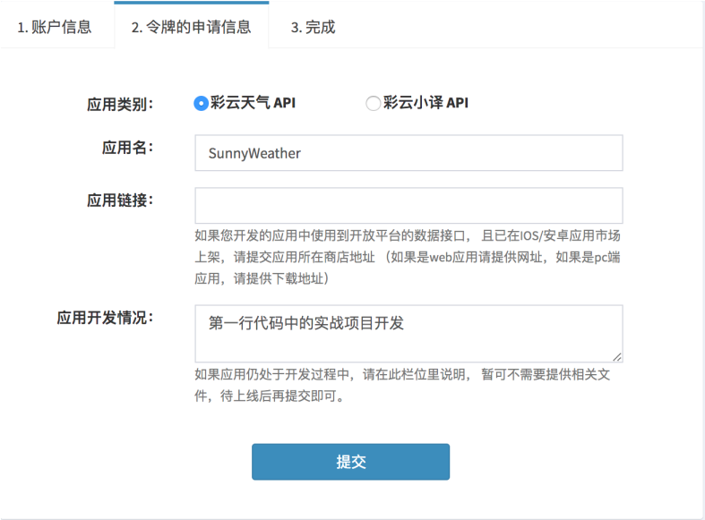

**图 15.2　申请令牌信息**

然后点击“提交”，等待审核通过即可。审核的时长并不固定，但一般会在一个工作日内通过。在审核通过之后，点击进入“我的令牌”界面，就能查看你申请到的令牌了，如图 15.3 所示。


**图 15.3　可用于请求 API 接口的令牌值**

具体的令牌值以及每天剩余的可请求次数，可以点击令牌链接进行查看。

有了这个令牌值之后，我们就能使用彩云天气提供的各种 API 接口了，比如访问如下接口地址即可查询全球绝大多数城市的数据信息。

```js
https://api.caiyunapp.com/v2/place?query=北京&token={token}&lang=zh_CN
```

`query` 参数指定的是要查询的关键字，`token` 参数传入我们刚才申请到的令牌值即可。服务器会返回我们一段 JSON 格式的数据，大致内容如下所示：

```json
{"status":"ok","query":"北京",
"places":[
{"name":"北京市","location":{"lat":39.9041999,"lng":116.4073963},
"formatted_address":"中国北京市"},
{"name":"北京西站","location":{"lat":39.89491,"lng":116.322056},
"formatted_address":"中国 北京市 丰台区 莲花池东路118号"},
{"name":"北京南站","location":{"lat":39.865195,"lng":116.378545},
"formatted_address":"中国 北京市 丰台区 永外大街车站路12号"},
{"name":"北京站(地铁站)","location":{"lat":39.904983,"lng":116.427287},
"formatted_address":"中国 北京市 东城区 2号线"}
]}
```

`status` 代表请求的状态，`ok` 表示成功。`places` 是一个 JSON 数组，会包含几个与我们查询的关键字关系度比较高的地区信息。其中 `name` 表示该地区的名字，`location` 表示该地区的经纬度，`formatted_address` 表示该地区的地址。

通过这种方式，我们就能把全球绝大多数城市的数据信息获取到了。那么解决了城市数据的获取，我们怎样才能查看具体的天气信息呢？这个时候就得使用彩云天气的另外一个 API 接口了，接口地址如下：

```js
https://api.caiyunapp.com/v2.5/{token}/116.4073963,39.9041999/realtime.json
```

`token` 部分仍然传入我们刚才申请到的令牌值，紧接着传入一个经纬度坐标，纬度和经度之间要用逗号隔开，这样服务器就会把该地区的实时天气信息以 JSON 格式返回给我们了。不过，由于返回的数据比较复杂，这里我做了一下精简处理，如下所示：

```json
{
    "status": "ok",
    "result": {
        "realtime": {
            "temperature": 23.16,
            "skycon": "WIND",
            "air_quality": {
                "aqi": { "chn": 17.0 }
            }
        }
    }
}
```

`realtime` 中包含的就是当前地区的实时天气信息，其中 `temperature` 表示当前的温度，`skycon` 表示当前的天气情况。而 `air_quality` 中会包含一些空气质量的数据，当然返回的空气质量数据有很多种，这里我准备使用 `aqi` 的值作为空气质量指数显示在界面上。

以上接口可以用来获取指定地区实时的天气信息，而如果想要获取未来几天的天气信息，还要借助另外一个 API 接口，接口地址如下：

```js
https://api.caiyunapp.com/v2.5/{token}/116.4073963,39.9041999/daily.json
```

很简单，只需要将接口最后的 `realtime.json` 改成了 `daily.json` 就可以了，其他部分都是相同的。这个接口返回的数据也比较复杂，我还是进行了一下精简处理，如下所示：

```json
{
    "status": "ok",
    "result": {
        "daily": {
            "temperature": [ {"max": 25.7, "min": 20.3}, ... ],
            "skycon": [ {"value": "CLOUDY", "date":"2019-10-20T00:00+08:00"}, ... ],
            "life_index": {
                "coldRisk": [ {"desc": "易发"}, ...],
                "carWashing": [ {"desc": "适宜"}, ... ],
                "ultraviolet": [ {"desc": "无"}, ... ],
                "dressing": [ {"desc": "舒适"}, ... ]
            }
        }
    }
}
```

`daily` 中包含的就是当前地区未来几天的天气信息，`temperature` 表示未来几天的温度值，`skycon` 表示未来几天的天气情况。而 `life_index` 中会包含一些生活指数，`coldRisk` 表示感冒指数，`carWashing` 表示洗车指数，`ultraviolet` 表示紫外线指数，`dressing` 表示穿衣指数。这个接口中返回的数据大部分是数组格式的，这一点需要格外注意。

接下来我们只需要对获得的 JSON 数据进行解析就可以了，这对于你来说应该很轻松了吧？

确定了技术完全可行之后，接下来就可以开始编码了。不过别着急，我们准备让 SunnyWeather 成为一个开源软件，并使用 GitHub 进行代码托管，因此先让我们进入本书最后一次的 Git 时间。

## 15.2　Git 时间：将代码托管到 GitHub 上

经过前面几章的学习，相信你已经可以非常熟练地使用 Git 了。本节依然是 Git 时间，这次我们将会把 SunnyWeather 的代码托管到 GitHub 上面。

GitHub 是全球最大的代码托管网站，主要就是通过 Git 来进行版本控制的。任何开源软件都可以免费地将代码提交到 GitHub 上，以零成本的代价进行代码托管。GitHub 的官网地址是 [https://github.com/](https://github.com/)。官网的首页如图 15.4 所示。


**图 15.4　GitHub 首页**

首先你需要有一个 GitHub 账号才能使用 GitHub 的代码托管功能，点击“Sign up for GitHub”按钮进行注册，然后填入用户名、邮箱和密码，如图 15.5 所示。

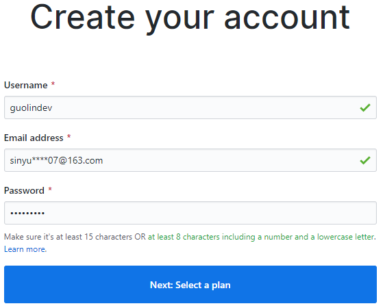

**图 15.5　注册账号**

点击“Next: Select a plan”按钮会进入选择个人计划界面，这里我们并不需要使用太多高级的功能，所以直接选择最左边的免费计划就可以了，如图 15.6 所示。


**图 15.6　选择免费计划**

接着会进入一个问卷调查界面，如图 15.7 所示。


**图 15.7　问卷调查界面**

如果你对这个有兴趣就填写一下，没兴趣的话直接点击最下方的“Skip this step”跳过就可以了。

这样我们就把账号注册好了，到你填写的邮箱中验证一下即可激活账号。重新打开 GitHub 官网，会自动跳转到你的 GitHub 个人主页，如图 15.8 所示。

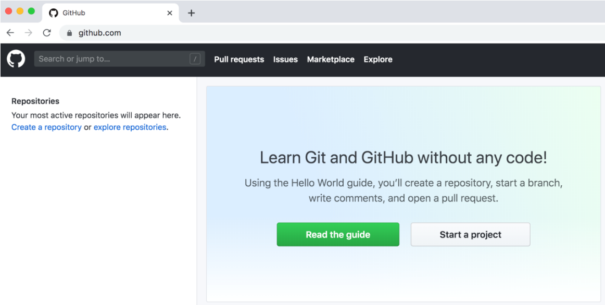

**图 15.8　GitHub 个人主页**

现在就可以点击“Start a project”按钮来创建一个版本库了，这里我们将版本库命名为“SunnyWeather”，然后勾选“Initialize this repository with a README”，并添加一个 Android 项目类型的.gitignore 文件，以及使用 Apache License 2.0 来作为 SunnyWeather 的开源协议，如图 15.9 所示。

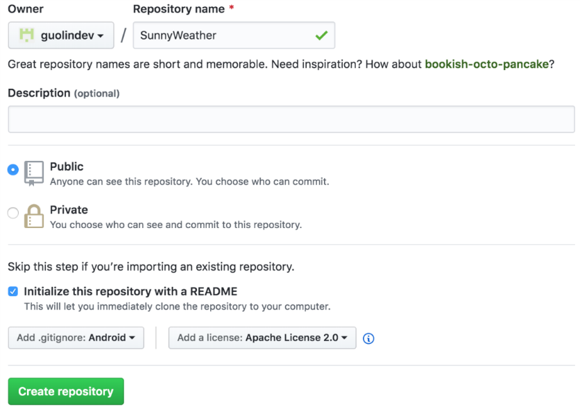

**图 15.9　创建版本库**

接着点击“Create repository”按钮，SunnyWeather 这个版本库就创建完成了，如图 15.10 所示。版本库的主页地址是 [https://github.com/guolindev/SunnyWeather](https://github.com/guolindev/SunnyWeather)。


**图 15.10　版本库主页**

可以看到，GitHub 已经自动帮我们创建了.gitignore、LICENSE 和 README.md 这 3 个文件，其中编辑 README.md 文件中的内容可以修改 SunnyWeather 版本库主页的描述。

创建好了版本库之后，接下来我们就需要创建 SunnyWeather 这个项目了。在 Android Studio 中新建一个 Android 项目，项目名叫作 SunnyWeather，包名叫作 com.sunnyweather.android，如图 15.11 所示。

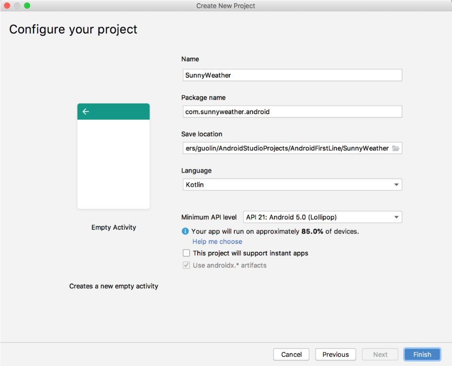

**图 15.11　创建 SunnyWeather 项目**

接下来的一步非常重要，我们需要将远程版本库克隆到本地。首先必须知道远程版本库的 Git 地址，点击版本库主页中的“Clone or download”按钮就能够看到了，如图 15.12 所示。


**图 15.12　查看版本库的 Git 地址**

点击右边的复制按钮可以将版本库的 Git 地址复制到剪贴板，SunnyWeather 版本库的 Git 地址是 [https://github.com/guolindev/SunnyWeather.git](https://github.com/guolindev/SunnyWeather.git)。

然后打开终端界面并切换到 SunnyWeather 的工程目录下，如图 15.13 所示。


**图 15.13　在终端中进入 SunnyWeather 工程目录**

接着输入 git clone https://github.com/guolindev/SunnyWeather.git 把远程版本库克隆到本地，如图 15.14 所示。

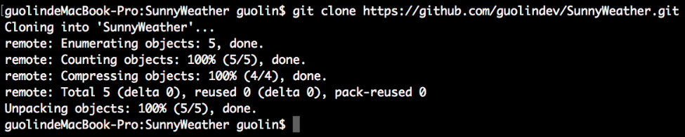

**图 15.14　将远程版本库克隆到本地**

看到图中的文字提示就表示克隆成功了，并且.gitignore、LICENSE 和 README.md 这 3 个文件也已经被复制到了本地，可以进入 SunnyWeather 目录，并使用 `ls –al` 命令查看一下，如图 15.15 所示。

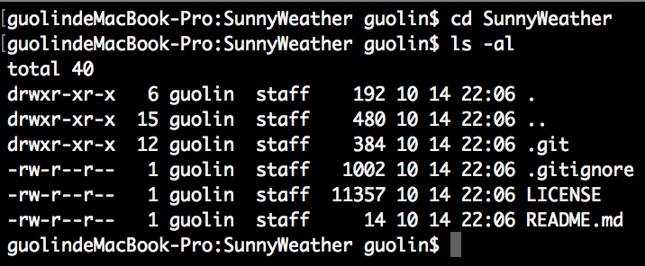

**图 15.15　查看克隆到本地的文件**

现在我们需要将这个目录中的文件全部复制粘贴到上一层目录中，这样就能将整个 SunnyWeather 工程目录添加到版本控制中去了。注意，.git 是一个隐藏目录，在复制的时候千万不要漏掉。另外，上一层目录中也有一个.gitignore 文件，我们直接将其覆盖即可。复制完之后可以将该 SunnyWeather 目录删除，最终 SunnyWeather 工程的目录结构应该如图 15.16 所示。


**图 15.16　SunnyWeather 工程的目录结构**

接下来，我们应该把 SunnyWeather 项目中现有的文件提交到 GitHub 上面。这就很简单了，先将所有文件添加到版本控制中，如下所示：

```bash
git add .
```

然后在本地执行提交操作：

```bash
git commit -m "First commit."
```

最后将提交的内容同步到远程版本库，也就是 GitHub 上面：

```bash
git push origin master
```

注意，在最后一步的时候，GitHub 可能会要求输入用户名和密码来进行身份校验。这里输入我们注册时填入的用户名和密码就可以了，最终结果如图 15.17 所示。


**图 15.17　将提交的内容同步到远程版本库**

这样就已经同步完成了，现在刷新一下 SunnyWeather 版本库的主页，你会看到刚才提交的那些文件已经存在了，如图 15.18 所示。


**图 15.18　在 GitHub 上查看提交的内容**

## 15.3　搭建 MVVM 项目架构

你应该还记得，在第 13 章中我们重点学习了 Jetpack 的架构组件，当时就提到过，Jetpack 中的许多架构组件是专门为了 MVVM 架构而量身打造的。那么到底什么是 MVVM 架构？又该如何搭建一个 MVVM 架构的项目呢？本节我们就来学习一下这方面的知识。

MVVM（Model-View-ViewModel）是一种高级项目架构模式，目前已被广泛应用在 Android 程序设计领域，类似的架构模式还有 MVP、MVC 等。简单来讲，MVVM 架构可以将程序结构主要分成 3 部分：Model 是数据模型部分；View 是界面展示部分；而 ViewModel 比较特殊，可以将它理解成一个连接数据模型和界面展示的桥梁，从而实现让业务逻辑和界面展示分离的程序结构设计。

当然，一个优秀的项目架构除了会包含以上 3 部分内容之外，还应该包含仓库、数据源等，这里我画了一幅非常简单易懂的 MVVM 项目架构示意图，如图 15.19 所示。


**图 15.19　MVVM 项目架构示意图**

可以看到，我们通过这张架构示意图将程序分为了若干层。其中，UI 控制层包含了我们平时写的 Activity、Fragment、布局文件等与界面相关的东西。ViewModel 层用于持有和 UI 元素相关的数据，以保证这些数据在屏幕旋转时不会丢失，并且还要提供接口给 UI 控制层调用以及和仓库层进行通信。仓库层要做的主要工作是判断调用方请求的数据应该是从本地数据源中获取还是从网络数据源中获取，并将获取到的数据返回给调用方。本地数据源可以使用数据库、SharedPreferences 等持久化技术来实现，而网络数据源则通常使用 Retrofit 访问服务器提供的 Webservice 接口来实现。

另外，对于这张架构示意图，我还有必要再解释一下。图中所有的箭头都是单向的，比方说 UI 控制层指向了 ViewModel 层，表示 UI 控制层会持有 ViewModel 层的引用，但是反过来 ViewModel 层却不能持有 UI 控制层的引用，其他几层也是一样的道理。除此之外，引用也不能跨层持有，比如 UI 控制层不能持有仓库层的引用，谨记每一层的组件都只能与它相邻层的组件进行交互。

那么接下来，我们会严格按照刚才的架构示意图对 SunnyWeather 这个项目进行实现。为了让项目能够有更好的结构，这里需要在 com.sunnyweather.android 包下再新建几个包，如图 15.20 所示。


**图 15.20　项目的新结构**

很明显，logic 包用于存放业务逻辑相关的代码，ui 包用于存放界面展示相关的代码。其中，logic 包中又包含了 dao、model、network 这 3 个子包，分别用于存放数据访问对象、对象模型以及网络相关的代码。而 ui 包中又包含了 place 和 weather 这两个子包，分别对应 SunnyWeather 中的两个主要界面。

另外，在整个项目的开发过程中，我们还会用到许多依赖库，为了方便后面的代码编写，这里就提前把所有会用到的依赖库都声明一下吧。编辑 app/build.gradle 文件，在 `dependencies` 闭包中添加如下内容：

```gradle
dependencies {
    ...
    implementation 'androidx.recyclerview:recyclerview:1.0.0'
    implementation "androidx.lifecycle:lifecycle-extensions:2.2.0"
    implementation "androidx.lifecycle:lifecycle-livedata-ktx:2.2.0"
    implementation 'com.google.android.material:material:1.1.0'
    implementation?"androidx.swiperefreshlayout:swiperefreshlayout:1.0.0"
    implementation 'com.squareup.retrofit2:retrofit:2.6.1'
    implementation 'com.squareup.retrofit2:converter-gson:2.6.1'
    implementation "org.jetbrains.kotlinx:kotlinx-coroutines-core:1.3.0"
    implementation "org.jetbrains.kotlinx:kotlinx-coroutines-android:1.1.1"
}
```

这几个库全部都是我们在前面的章节中使用过的，相信对你来说应该不难理解。

由于我们引入了 Material 库，所以一定要记得将 AppTheme 的 parent 主题改成 MaterialComponents 模式，也就是将原来的 AppCompat 部分改成 MaterialComponents 即可。

另外，为了让 SunnyWeather 的界面更加美观，这里我提前准备了许多张后续开发时会用到的图片，并把它们都放到了 drawable-xxhdpi 目录下（图片下载方式见前言），如图 15.21 所示。


**图 15.21　事先准备好的图片资源**

将这些准备工作都做好了之后，接下来就正式进入 SunnyWeather 项目的开发当中吧。

## 15.4　搜索全球城市数据

根据之前的技术可行性分析，要想实现查看天气信息的功能，首先要能搜索到具体的城市数据，并获取该地区的经纬度坐标。因此，我们第一阶段的开发任务就是先来实现搜索全球城市的数据信息。根据合理的开发方式，实现过程应该主要分为逻辑层实现和 UI 层实现两部分，那么我们先从逻辑层实现开始吧。

### 15.4.1　实现逻辑层代码

使用 MVVM 这种分层架构的设计，由于从 ViewModel 层开始就不再持有 Activity 的引用了，因此经常会出现“缺 Context”的情况。所以我们可以先使用第 14 章中学到的技术，给 SunnyWeather 项目提供一种全局获取 Context 的方式。

在 com.sunnyweather.android 包下新建一个 `SunnyWeatherApplication` 类，代码如下所示：

```Kotlin
class SunnyWeatherApplication : Application() {

    companion object {
        @SuppressLint("StaticFieldLeak")
        lateinit var context: Context
    }

    override fun onCreate() {
        super.onCreate()
        context = applicationContext
    }

}
```

这段代码我们刚刚在上一章中学习过，你应该记忆犹新吧。然后还需要在 AndroidManifest.xml 文件的 `<application>` 标签下指定 `SunnyWeatherApplication`，如下所示：

```xml
<manifest xmlns:android="http://schemas.android.com/apk/res/android"
          package="com.sunnyweather.android">
    <application
        android:name=".SunnyWeatherApplication"
        android:allowBackup="true"
        android:icon="@mipmap/ic_launcher"
        android:label="@string/app_name"
        android:roundIcon="@mipmap/ic_launcher_round"
        android:supportsRtl="true"
        android:theme="@style/AppTheme">
        ...
    </application>
</manifest>
```

经过这样的配置之后，我们就可以在项目的任何位置通过调用 `SunnyWeatherApplication.context` 来获取 `Context` 对象了，非常便利。

另外，我们刚才不是在彩云天气的开发者平台申请到了一个令牌值吗？可以将这个令牌值也配置在 `SunnyWeatherApplication` 中，方便之后的获取，如下所示：

```Kotlin
class SunnyWeatherApplication : Application() {
    companion object {
        const val TOKEN = "填入你申请到的令牌值"
        ...
    }
    ...
}
```

完成了第一步的工作之后，下面我们就可以按照图 15.19 所示的架构示意图，自底向上一步步进行实现。首先来定义一下数据模型，在 logic/model 包下新建一个 PlaceResponse.kt 文件，并在这个文件中编写如下代码：

```Kotlin
data class PlaceResponse(val status: String, val places: List<Place>)

data class Place(val name: String, val location: Location,
           @SerializedName("formatted_address") val address: String)

data class Location(val lng: String, val lat: String)
```

很简单，PlaceResponse.kt 文件中定义的类与属性，完全就是按照 15.1 节中搜索城市数据接口返回的 JSON 格式来定义的。不过，由于 JSON 中一些字段的命名可能与 Kotlin 的命名规范不太一致，因此这里使用了 `@SerializedName` 注解的方式，来让 JSON 字段和 Kotlin 字段之间建立映射关系。

定义好了数据模型，接下来我们就可以开始编写网络层相关的代码了。首先定义一个用于访问彩云天气城市搜索 API 的 `Retrofit` 接口，在 logic/network 包下新建 `PlaceService` 接口，代码如下所示：

```Kotlin
interface PlaceService {

    @GET("v2/place?token=${SunnyWeatherApplication.TOKEN}&lang=zh_CN")
    fun searchPlaces(@Query("query") query: String): Call<PlaceResponse>

}
```

可以看到，我们在 `searchPlaces()` 方法的上面声明了一个 `@GET` 注解，这样当调用 `searchPlaces()` 方法的时候，`Retrofit` 就会自动发起一条 `GET` 请求，去访问 `@GET` 注解中配置的地址。其中，搜索城市数据的 API 中只有 `query` 这个参数是需要动态指定的，我们使用 `@Query` 注解的方式来进行实现，另外两个参数是不会变的，因此固定写在 `@GET` 注解中即可。

另外，`searchPlaces()` 方法的返回值被声明成了 `Call<PlaceResponse>`，这样 `Retrofit` 就会将服务器返回的 JSON 数据自动解析成 `PlaceResponse` 对象了。

定义好了 `PlaceService` 接口，为了能够使用它，我们还得创建一个 `Retrofit` 构建器才行。在 logic/network 包下新建一个 `ServiceCreator` 单例类，代码如下所示：

```Kotlin
object ServiceCreator {

    private const val BASE_URL = "https://api.caiyunapp.com/"

    private val retrofit = Retrofit.Builder()
        .baseUrl(BASE_URL)
        .addConverterFactory(GsonConverterFactory.create())
        .build()

    fun <T> create(serviceClass: Class<T>): T = retrofit.create(serviceClass)

    inline fun <reified T> create(): T = create(T::class.java)

}
```

这个 `Retrofit` 构建器完全是按照我们在 11.6.3 小节中学习的方式来编写的，因此对于你来说，理解起来应该没有任何问题。

接下来我们还需要再定义一个统一的网络数据源访问入口，对所有网络请求的 API 进行封装。同样在 logic/network 包下新建一个 `SunnyWeatherNetwork` 单例类，代码如下所示：

```Kotlin
object SunnyWeatherNetwork {

    private val placeService = ServiceCreator.create<PlaceService>()

    suspend fun searchPlaces(query: String) = placeService.searchPlaces(query).await()

    private suspend fun <T> Call<T>.await(): T {
        return suspendCoroutine { continuation ->
            enqueue(object : Callback<T> {
                override fun onResponse(call: Call<T>, response: Response<T>) {
                    val body = response.body()
                    if (body != null) continuation.resume(body)
                    else continuation.resumeWithException(
                        RuntimeException("response body is null"))
                }

                override fun onFailure(call: Call<T>, t: Throwable) {
                    continuation.resumeWithException(t)
                }
            })
        }
    }

}
```

这是一个非常关键的类，并且用到了许多高级技巧，我来带你慢慢解析一下。

首先我们使用 `ServiceCreator` 创建了一个 `PlaceService` 接口的动态代理对象，然后定义了一个 `searchPlaces()` 函数，并在这里调用刚刚在 `PlaceService` 接口中定义的 `searchPlaces()` 方法，以发起搜索城市数据请求。

但是为了让代码变得更加简洁，我们使用了 11.7.3 小节中学习的技巧来简化 `Retrofit` 回调的写法。由于是需要借助协程技术来实现的，因此这里又定义了一个 `await()` 函数，并将 `searchPlaces()` 函数也声明成挂起函数。至于 `await()` 函数的实现，之前在 11.7.3 小节就解析过了，所以应该是很好理解的。

这样，当外部调用 `SunnyWeatherNetwork` 的 `searchPlaces()` 函数时，`Retrofit` 就会立即发起网络请求，同时当前的协程也会被阻塞住。直到服务器响应我们的请求之后，`await()` 函数会将解析出来的数据模型对象取出并返回，同时恢复当前协程的执行，`searchPlaces()` 函数在得到 `await()` 函数的返回值后会将该数据再返回到上一层。

这样网络层相关的代码我们就编写完了，下面开始编写仓库层的代码。之前已经解释过，仓库层的主要工作就是判断调用方请求的数据应该是从本地数据源中获取还是从网络数据源中获取，并将获得的数据返回给调用方。因此，仓库层有点像是一个数据获取与缓存的中间层，在本地没有缓存数据的情况下就去网络层获取，如果本地已经有缓存了，就直接将缓存数据返回。

不过我个人认为，这种搜索城市数据的请求并没有太多缓存的必要，每次都发起网络请求去获取最新的数据即可，因此这里就不进行本地缓存的实现了。在 logic 包下新建一个 `Repository` 单例类，作为仓库层的统一封装入口，代码如下所示：

```Kotlin
object Repository {

    fun searchPlaces(query: String) = liveData(Dispatchers.IO) {
        val result = try {
            val placeResponse = SunnyWeatherNetwork.searchPlaces(query)
            if (placeResponse.status == "ok") {
                val places = placeResponse.places
                Result.success(places)
            } else {
                Result.failure(RuntimeException("response status is
                    ${placeResponse.status}"))
            }
        } catch (e: Exception) {
            Result.failure<List<Place>>(e)
        }
        emit(result)
    }

}
```

一般在仓库层中定义的方法，为了能将异步获取的数据以响应式编程的方式通知给上一层，通常会返回一个 LiveData 对象。我们在 13.4 节已经学过了 LiveData 最常用的一些用法，不过这里又使用了一个新的技巧。上述代码中的 `liveData()` 函数是 lifecycle-livedata-ktx 库提供的一个非常强大且好用的功能，它可以自动构建并返回一个 LiveData 对象，然后在它的代码块中提供一个挂起函数的上下文，这样我们就可以在 `liveData()` 函数的代码块中调用任意的挂起函数了。这里调用了 `SunnyWeatherNetwork` 的 `searchPlaces()` 函数来搜索城市数据，然后判断如果服务器响应的状态是 ok，那么就使用 Kotlin 内置的 `Result.success()` 方法来包装获取的城市数据列表，否则使用 `Result.failure()` 方法来包装一个异常信息。最后使用一个 `emit()` 方法将包装的结果发射出去，这个 `emit()` 方法其实类似于调用 LiveData 的 `setValue()` 方法来通知数据变化，只不过这里我们无法直接取得返回的 LiveData 对象，所以 lifecycle-livedata-ktx 库提供了这样一个替代方法。

另外需要注意，上述代码中我们还将 `liveData()` 函数的线程参数类型指定成了 `Dispatchers.IO`，这样代码块中的所有代码就都运行在子线程中了。众所周知，Android 是不允许在主线程中进行网络请求的，诸如读写数据库之类的本地数据操作也是不建议在主线程中进行的，因此非常有必要在仓库层进行一次线程转换。

写到这里，逻辑层的实现就只剩最后一步了：定义 ViewModel 层。ViewModel 相当于逻辑层和 UI 层之间的一个桥梁，虽然它更偏向于逻辑层的部分，但是由于 ViewModel 通常和 Activity 或 Fragment 是一一对应的，因此我们还是习惯将它们放在一起。

在 ui/place 包下新建一个 PlaceViewModel，代码如下所示：

```Kotlin
class PlaceViewModel : ViewModel() {

    private val searchLiveData = MutableLiveData<String>()

    val placeList = ArrayList<Place>()

    val placeLiveData = Transformations.switchMap(searchLiveData) { query ->
        Repository.searchPlaces(query)
    }

    fun searchPlaces(query: String) {
        searchLiveData.value = query
    }

}
```

ViewModel 层的代码就相对比较简单了。首先 PlaceViewModel 中也定义了一个 `searchPlaces()` 方法，但是这里并没有直接调用仓库层中的 `searchPlaces()` 方法，而是将传入的搜索参数赋值给了一个 `searchLiveData` 对象，并使用 `Transformations` 的 `switchMap()` 方法来观察这个对象，否则仓库层返回的 LiveData 对象将无法进行观察。关于这一点，我们已经在 13.4.2 小节讨论过了。现在每当 `searchPlaces()` 函数被调用时，`switchMap()` 方法所对应的转换函数就会执行。然后在转换函数中，我们只需要调用仓库层中定义的 `searchPlaces()` 方法就可以发起网络请求，同时将仓库层返回的 LiveData 对象转换成一个可供 Activity 观察的 LiveData 对象。

另外，我们还在 PlaceViewModel 中定义了一个 `placeList` 集合，用于对界面上显示的城市数据进行缓存，因为原则上与界面相关的数据都应该放到 ViewModel 中，这样可以保证它们在手机屏幕发生旋转的时候不会丢失，稍后我们会在编写 UI 层代码的时候用到这个集合。

好了，关于逻辑层的实现到这里就基本完成了，现在 SunnyWeather 项目已经拥有了搜索全球城市数据的能力，那么接下来就开始进行 UI 层的实现吧。

### 15.4.2　实现 UI 层代码

UI 层的实现一般是从编写布局文件开始的，由于搜索城市数据的功能我们在后面还会复用，因此就不建议写在 Activity 里面了，而是应该写在 Fragment 里面，这样当需要复用的时候直接在布局里面引入该 Fragment 即可。

在 res/layout 目录中新建 fragment_place.xml 布局，代码如下所示：

```xml
<RelativeLayout xmlns:android="http://schemas.android.com/apk/res/android"
    android:layout_width="match_parent"
    android:layout_height="match_parent"
    android:background="?android:windowBackground">

    <ImageView
        android:id="@+id/bgImageView"
        android:layout_width="match_parent"
        android:layout_height="wrap_content"
        android:layout_alignParentBottom="true"
        android:src="@drawable/bg_place"/>

    <FrameLayout
        android:id="@+id/actionBarLayout"
        android:layout_width="match_parent"
        android:layout_height="60dp"
        android:background="@color/colorPrimary">

        <EditText
            android:id="@+id/searchPlaceEdit"
            android:layout_width="match_parent"
            android:layout_height="40dp"
            android:layout_gravity="center_vertical"
            android:layout_marginStart="10dp"
            android:layout_marginEnd="10dp"
            android:paddingStart="10dp"
            android:paddingEnd="10dp"
            android:hint="输入地址"
            android:background="@drawable/search_bg"/>
    </FrameLayout>

    <androidx.recyclerview.widget.RecyclerView
        android:id="@+id/recyclerView"
        android:layout_width="match_parent"
        android:layout_height="match_parent"
        android:layout_below="@id/actionBarLayout"
        android:visibility="gone"/>

</RelativeLayout>
```

这个布局中主要有两部分内容：EditText 用于给用户提供一个搜索框，这样用户就可以在这里搜索任意城市；RecyclerView 则主要用于对搜索出来的结果进行展示。另外这个布局中还有一个 ImageView 控件，它的作用只是为了显示一张背景图，从而让界面变得更加美观，和主体功能无关。

另外，简单起见，所有布局中显示的文字我都会使用硬编码的写法。这当然不是一种良好的习惯，你在实现的时候应该将这些文字都定义到 strings.xml 中，然后在布局中进行引用。

既然用到了 RecyclerView，那么毫无疑问，我们还得定义它的子项布局才行。在 layout 目录下新建一个 place_item.xml 文件，代码如下所示：

```xml
<com.google.android.material.card.MaterialCardView
    xmlns:android="http://schemas.android.com/apk/res/android"
    xmlns:app="http://schemas.android.com/apk/res-auto"
    android:layout_width="match_parent"
    android:layout_height="130dp"
    android:layout_margin="12dp"
    app:cardCornerRadius="4dp">

    <LinearLayout
        android:orientation="vertical"
        android:layout_width="match_parent"
        android:layout_height="wrap_content"
        android:layout_margin="18dp"
        android:layout_gravity="center_vertical">

        <TextView
            android:id="@+id/placeName"
            android:layout_width="wrap_content"
            android:layout_height="wrap_content"
            android:textColor="?android:attr/textColorPrimary"
            android:textSize="20sp"/>

        <TextView
            android:id="@+id/placeAddress"
            android:layout_width="wrap_content"
            android:layout_height="wrap_content"
            android:layout_marginTop="10dp"
            android:textColor="?android:attr/textColorSecondary"
            android:textSize="14sp"/>

    </LinearLayout>

</com.google.android.material.card.MaterialCardView>
```

这里使用了 MaterialCardView 来作为子项的最外层布局，从而使得 RecyclerView 中的每个元素都是在卡片中的。至于卡片中的元素内容非常简单，只用到了两个 TextView，一个用于显示搜索到的地区名，一个用于显示该地区的详细地址。

将子项布局也定义好了之后，接下来就需要为 RecyclerView 准备适配器了。在 ui/place 包下新建一个 `PlaceAdapter` 类，让这个适配器继承自 `RecyclerView.Adapter`，并将泛型指定为 `PlaceAdapter.ViewHolder`，代码如下所示：

```Kotlin
class PlaceAdapter(private val fragment: Fragment, private val placeList: List<Place>) :
    RecyclerView.Adapter<PlaceAdapter.ViewHolder>() {

    inner class ViewHolder(view: View) : RecyclerView.ViewHolder(view) {
        val placeName: TextView = view.findViewById(R.id.placeName)
        val placeAddress: TextView = view.findViewById(R.id.placeAddress)
    }

    override fun onCreateViewHolder(parent: ViewGroup, viewType: Int): ViewHolder {
        val view = LayoutInflater.from(parent.context).inflate(R.layout.place_item,
            parent, false)
        return ViewHolder(view)
    }

    override fun onBindViewHolder(holder: ViewHolder, position: Int) {
        val place = placeList[position]
        holder.placeName.text = place.name
        holder.placeAddress.text = place.address
    }

    override fun getItemCount() = placeList.size

}
```

这里使用的都是 RecyclerView 适配器的标准写法，之前我们已经实现过好几遍了，相信没有什么需要解释的地方。

现在适配器也准备好了，只剩下对 Fragment 进行实现了。在 ui/place 包下新建一个 PlaceFragment，并让它继承自 AndroidX 库中的 Fragment，代码如下所示：

```Kotlin
class PlaceFragment : Fragment() {

    val viewModel by lazy { ViewModelProvider(this).get(PlaceViewModel::class.java) }

    private lateinit var adapter: PlaceAdapter

    override fun onCreateView(inflater: LayoutInflater, container: ViewGroup?,
            savedInstanceState: Bundle?): View? {
        return inflater.inflate(R.layout.fragment_place, container, false)
    }

    override fun onActivityCreated(savedInstanceState: Bundle?) {
        super.onActivityCreated(savedInstanceState)
        val layoutManager = LinearLayoutManager(activity)
        recyclerView.layoutManager = layoutManager
        adapter = PlaceAdapter(this, viewModel.placeList)
        recyclerView.adapter = adapter
        searchPlaceEdit.addTextChangedListener { editable ->
            val content = editable.toString()
            if (content.isNotEmpty()) {
                viewModel.searchPlaces(content)
            } else {
                recyclerView.visibility = View.GONE
                bgImageView.visibility = View.VISIBLE
                viewModel.placeList.clear()
                adapter.notifyDataSetChanged()
            }
        }
        viewModel.placeLiveData.observe(this, Observer{ result ->
            val places = result.getOrNull()
            if (places != null) {
                recyclerView.visibility = View.VISIBLE
                bgImageView.visibility = View.GONE
                viewModel.placeList.clear()
                viewModel.placeList.addAll(places)
                adapter.notifyDataSetChanged()
            } else {
                Toast.makeText(activity, "未能查询到任何地点", Toast.LENGTH_SHORT).show()
                result.exceptionOrNull()?.printStackTrace()
            }
        })
    }

}
```

这段代码并不难理解，使用的大多是我们之前学过的知识，我们来慢慢梳理一下。

首先，这里使用了 `lazy` 函数这种懒加载技术来获取 PlaceViewModel 的实例，这是一种非常棒的写法，允许我们在整个类中随时使用 `viewModel` 这个变量，而完全不用关心它何时初始化、是否为空等前提条件。

接下来在 `onCreateView()` 方法中加载了前面编写的 fragment_place 布局，这是 Fragment 的标准用法，没什么需要解释的。

最后再来看 `onActivityCreated()` 方法，这个方法中先是给 RecyclerView 设置了 `LayoutManager` 和适配器，并使用 PlaceViewModel 中的 `placeList` 集合作为数据源。紧接着调用了 EditText 的 `addTextChangedListener()` 方法来监听搜索框内容的变化情况。每当搜索框中的内容发生了变化，我们就获取新的内容，然后传递给 PlaceViewModel 的 `searchPlaces()` 方法，这样就可以发起搜索城市数据的网络请求了。而当输入搜索框中的内容为空时，我们就将 RecyclerView 隐藏起来，同时将那张仅用于美观用途的背景图显示出来。

解决了搜索城市数据请求的发起，还要能获取到服务器响应的数据才行，这个自然就需要借助 LiveData 来完成了。可以看到，这里我们对 PlaceViewModel 中的 `placeLiveData` 对象进行观察，当有任何数据变化时，就会回调到传入的 `Observer` 接口实现中。然后我们会对回调的数据进行判断：如果数据不为空，那么就将这些数据添加到 PlaceViewModel 的 `placeList` 集合中，并通知 PlaceAdapter 刷新界面；如果数据为空，则说明发生了异常，此时弹出一个 Toast 提示，并将具体的异常原因打印出来。

这样我们就把搜索全球城市数据的功能完成了，可是 Fragment 是不能直接显示在界面上的，因此我们还需要把它添加到 Activity 里才行。修改 activity_main.xml 中的代码，如下所示：

```xml
<FrameLayout
    xmlns:android="http://schemas.android.com/apk/res/android"
    android:layout_width="match_parent"
    android:layout_height="match_parent">

    <fragment
        android:id="@+id/placeFragment"
        android:name="com.sunnyweather.android.ui.place.PlaceFragment"
        android:layout_width="match_parent"
        android:layout_height="match_parent" />

</FrameLayout>
```

布局文件很简单，只是定义了一个 FrameLayout，然后将 PlaceFragment 添加进来，并让它充满整个布局。

另外，我们刚才在 PlaceFragment 的布局里面已经定义了一个搜索框布局，因此就不再需要原生的 ActionBar 了，修改 res/values/styles.xml 中的代码，如下所示：

```xml
<resources>

    <!-- Base application theme. -->
    <style name="AppTheme" parent="Theme.MaterialComponents.Light.NoActionBar">
        ...
    </style>

</resources>
```

现在第一阶段的开发工作基本上已经完成了，不过在运行程序之前还有一件事没有做，那就是声明程序所需要的权限。修改 AndroidManifest.xml 中的代码，如下所示：

```xml
<manifest xmlns:android="http://schemas.android.com/apk/res/android"
    package="com.sunnyweather.android">

    <uses-permission android:name="android.permission.INTERNET" />
    ...
</manifest>
```

由于我们是通过网络接口来搜索城市数据的，因此必须添加访问网络的权限才行。

现在可以运行一下程序了，初始界面如图 15.22 所示。


**图 15.22　PlaceFragment 的初始界面**

接下来我们可以在搜索框里随意输入全球任意城市的名字，相关的地区信息就出现在界面上了，如图 15.23 所示。

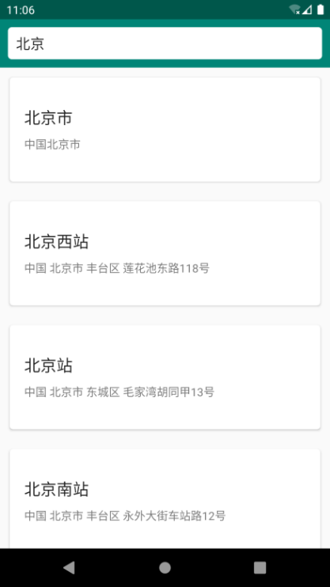

**图 15.23　与北京相关的地区信息**

虽然现在界面上只显示了相关地区的名称与地址，但实际上每个地区所对应的经纬度信息我们也已经获取到了，这为接下来的天气预报功能开发奠定了基础。

你可能会问，做了这么复杂的分层架构设计，好处到底在哪里呢？我直接将代码都写在 Fragment 中好像也能实现同样的功能。没错，这也是许多初学者编写 Android 程序的实现方式。但是将所有代码都写在 Fragment 或 Activity 中，会让类变得非常冗余，等项目越来越复杂之后，代码会变得难以阅读和维护。而分层架构设计可以使整个项目的结构十分清晰，并且在现有架构的基础上扩展其他功能也会非常方便，待会进入天气预报功能开发的时候你就能体会到了。

好了，第一阶段的代码写到这里就差不多了，我们现在提交一下。首先将所有新增的文件添加到版本控制中：

```bash
git add .
```

接着执行提交操作：

```bash
git commit -m "实现搜索全球城市数据功能。"
```

最后将提交同步到 GitHub 上面：

```bash
git push origin master
```

OK！第一阶段完工，下面让我们赶快进入第二阶段的开发工作中吧。

## 15.5　显示天气信息

在第二阶段中，我们就要开始去查询天气，并且把天气信息显示出来了。实现的过程也是类似的，同样主要分为逻辑层实现和 UI 层实现两部分，那么我们仍然先从逻辑层实现开始吧。

### 15.5.1　实现逻辑层代码

由于彩云天气返回的数据内容非常多，这里我们不可能将所有的内容都利用起来，因此我筛选了一些比较重要的数据来进行解析与展示。

首先回顾一下获取实时天气信息接口所返回的 JSON 数据格式，简化后的内容如下所示：

```json
{
    "status": "ok",
    "result": {
        "realtime": {
            "temperature": 23.16,
            "skycon": "WIND",
            "air_quality": {
                "aqi": { "chn": 17.0 }
            }
        }
    }
}
```

那么我们只需要按照这种 JSON 格式来定义相应的数据模型即可。在 logic/model 包下新建一个 RealtimeResponse.kt 文件，并在这个文件中编写如下代码：

```Kotlin
data class RealtimeResponse(val status: String, val result: Result) {

    data class Result(val realtime: Realtime)

    data class Realtime(val skycon: String, val temperature: Float,
               @SerializedName("air_quality") val airQuality: AirQuality)

    data class AirQuality(val aqi: AQI)

    data class AQI(val chn: Float)

}
```

注意，这里我们将所有的数据模型类都定义在了 `RealtimeResponse` 的内部，这样可以防止出现和其他接口的数据模型类有同名冲突的情况。

接下来我们再回顾一下获取未来几天天气信息接口所返回的 JSON 数据格式，简化后的内容如下所示：

```json
{
    "status": "ok",
    "result": {
        "daily": {
            "temperature": [ {"max": 25.7, "min": 20.3}, ... ],
            "skycon": [ {"value": "CLOUDY", "date":"2019-10-20T00:00+08:00"}, ... ],
            "life_index": {
                "coldRisk": [ {"desc": "易发"}, ... ],
                "carWashing": [ {"desc": "适宜"}, ... ],
                "ultraviolet": [ {"desc": "无"}, ... ],
                "dressing": [ {"desc": "舒适"}, ... ]
            }
        }
    }
}
```

这段 JSON 数据格式最大的特别之处在于，它返回的天气数据全部是数组形式的，数组中的每个元素都对应着一天的数据。在数据模型中，我们可以使用 `List` 集合来对 JSON 中的数组元素进行映射。同样在 logic/model 包下新建一个 DailyResponse.kt 文件，并编写如下代码：

```Kotlin
data class DailyResponse(val status: String, val result: Result) {

    data class Result(val daily: Daily)

    data class Daily(val temperature: List<Temperature>, val skycon: List<Skycon>,
               @SerializedName("life_index") val lifeIndex: LifeIndex)

    data class Temperature(val max: Float, val min: Float)

    data class Skycon(val value: String, val date: Date)

    data class LifeIndex(val coldRisk: List<LifeDescription>, val carWashing:
               List<LifeDescription>, val ultraviolet: List<LifeDescription>,
               val dressing: List<LifeDescription>)

    data class LifeDescription(val desc: String)

}
```

这次我们将所有的数据模型类都定义在了 `DailyResponse` 的内部，你会发现，虽然它和 `RealtimeResponse` 内部都包含了一个 `Result` 类，但是它们之间是完全不会冲突的。

另外，我们还需要在 logic/model 包下再定义一个 `Weather` 类，用于将 `Realtime` 和 `Daily` 对象封装起来，代码如下所示：

```Kotlin
data class Weather(val realtime: RealtimeResponse.Realtime, val daily: DailyResponse.Daily)
```

将数据模型都定义好了之后，接下来又该开始编写网络层相关的代码了。你会发现使用这种分层架构的设计，每步应该做什么都非常清晰。

现在定义一个用于访问天气信息 API 的 `Retrofit` 接口，在 logic/network 包下新建 `WeatherService` 接口，代码如下所示：

```Kotlin
interface WeatherService {

    @GET("v2.5/${SunnyWeatherApplication.TOKEN}/{lng},{lat}/realtime.json")
    fun getRealtimeWeather(@Path("lng") lng: String, @Path("lat") lat: String):
        Call<RealtimeResponse>

    @GET("v2.5/${SunnyWeatherApplication.TOKEN}/{lng},{lat}/daily.json")
    fun getDailyWeather(@Path("lng") lng: String, @Path("lat") lat: String):
        Call<DailyResponse>

}
```

可以看到，这里我们定义了两个方法：`getRealtimeWeather()` 方法用于获取实时的天气信息，`getDailyWeather()` 方法用于获取未来的天气信息。在每个方法的上面仍然还是使用 `@GET` 注解来声明要访问的 API 接口，并且我们还使用了 `@Path` 注解来向请求接口中动态传入经纬度的坐标。这两个方法的返回值分别被声明成了 `Call<RealtimeResponse>` 和 `Call<DailyResponse>`，对应了刚刚定义好的两个数据模型类。

接下来我们需要在 SunnyWeatherNetwork 这个网络数据源访问入口对新增的 `WeatherService` 接口进行封装。修改 SunnyWeatherNetwork 中的代码，如下所示：

```Kotlin
object SunnyWeatherNetwork {

    private val weatherService = ServiceCreator.create(WeatherService::class.java)

    suspend fun getDailyWeather(lng: String, lat: String) =
        weatherService.getDailyWeather(lng, lat).await()

    suspend fun getRealtimeWeather(lng: String, lat: String) =
        weatherService.getRealtimeWeather(lng, lat).await()
    ...
}
```

你会发现，这里对 `WeatherService` 接口的封装和之前对 `PlaceService` 接口的封装写法几乎是一模一样的，就算是依葫芦画瓢也能写得出来。所以这种分层架构设计的扩展性真的非常好，不管以后要扩展多少新功能，我们都能按照非常相似的步骤去实现。

完成了网络层的代码编写，接下来很容易想到应该去仓库层进行相关的代码实现了。修改 `Repository` 中的代码，如下所示：

```Kotlin
object Repository {
    ...
    fun refreshWeather(lng: String, lat: String) = liveData(Dispatchers.IO) {
        val result = try {
            coroutineScope {
                val deferredRealtime = async {
                    SunnyWeatherNetwork.getRealtimeWeather(lng, lat)
                }
                val deferredDaily = async {
                    SunnyWeatherNetwork.getDailyWeather(lng, lat)
                }
                val realtimeResponse = deferredRealtime.await()
                val dailyResponse = deferredDaily.await()
                if (realtimeResponse.status == "ok" && dailyResponse.status == "ok") {
                    val weather = Weather(realtimeResponse.result.realtime,
                                            dailyResponse.result.daily)
                    Result.success(weather)
                } else {
                    Result.failure(
                        RuntimeException(
                            "realtime response status is ${realtimeResponse.status}" +
                            "daily response status is ${dailyResponse.status}"
                        )
                    )
                }
            }
        } catch (e: Exception) {
            Result.failure<Weather>(e)
        }
        emit(result)
    }
}
```

注意，在仓库层我们并没有提供两个分别用于获取实时天气信息和未来天气信息的方法，而是提供了一个 `refreshWeather()` 方法用来刷新天气信息。因为对于调用方而言，需要调用两次请求才能获得其想要的所有天气数据明显是比较烦琐的行为，因此最好的做法就是在仓库层再进行一次统一的封装。

不过，获取实时天气信息和获取未来天气信息这两个请求是没有先后顺序的，因此让它们并发执行可以提升程序的运行效率，但是要在同时得到它们的响应结果后才能进一步执行程序。这种需求有没有让你想起什么呢？没错，这不恰好就是我们在第 11 章学习协程时使用的 `async` 函数的作用吗？只需要分别在两个 `async` 函数中发起网络请求，然后再分别调用它们的 `await()` 方法，就可以保证只有在两个网络请求都成功响应之后，才会进一步执行程序。另外，由于 `async` 函数必须在协程作用域内才能调用，所以这里又使用 `coroutineScope` 函数创建了一个协程作用域。

接下来的逻辑就比较简单了，在同时获取到 `RealtimeResponse` 和 `DailyResponse` 之后，如果它们的响应状态都是 ok，那么就将 `Realtime` 和 `Daily` 对象取出并封装到一个 `Weather` 对象中，然后使用 `Result.success()` 方法来包装这个 `Weather` 对象，否则就使用 `Result.failure()` 方法来包装一个异常信息，最后调用 `emit()` 方法将包装的结果发射出去。

一般代码写到这里就已经足够好了，但是其实我们还可以做到更好。你会发现，由于我们使用了协程来简化网络回调的写法，导致 SunnyWeatherNetwork 中封装的每个网络请求接口都可能会抛出异常，于是我们必须在仓库层中为每个网络请求都进行 try catch 处理，这无疑增加了仓库层代码实现的复杂度。然而之前我就说过，其实完全可以在某个统一的入口函数中进行封装，使得只要进行一次 try catch 处理就行了，下面我们就来学习一下具体应该怎样实现。

```Kotlin
object Repository {

    fun searchPlaces(query: String) = fire(Dispatchers.IO) {
        val placeResponse = SunnyWeatherNetwork.searchPlaces(query)
        if (placeResponse.status == "ok") {
            val places = placeResponse.places
            Result.success(places)
        } else {
            Result.failure(RuntimeException("response status is ${placeResponse.status}"))
        }
    }

    fun refreshWeather(lng: String, lat: String) = fire(Dispatchers.IO) {
        coroutineScope {
            val deferredRealtime = async {
                SunnyWeatherNetwork.getRealtimeWeather(lng, lat)
            }
            val deferredDaily = async {
                SunnyWeatherNetwork.getDailyWeather(lng, lat)
            }
            val realtimeResponse = deferredRealtime.await()
            val dailyResponse = deferredDaily.await()
            if (realtimeResponse.status == "ok" && dailyResponse.status == "ok") {
                val weather = Weather(realtimeResponse.result.realtime,
                    dailyResponse.result.daily)
                Result.success(weather)
            } else {
                Result.failure(
                    RuntimeException(
                        "realtime response status is ${realtimeResponse.status}" +
                            "daily response status is ${dailyResponse.status}"
                    )
                )
            }
        }
    }

    private fun <T> fire(context: CoroutineContext, block: suspend () -> Result<T>) =
            liveData<Result<T>>(context) {
        val result = try {
            block()
        } catch (e: Exception) {
            Result.failure<T>(e)
        }
        emit(result)
    }

}
```

这段代码最核心的地方就在于我们新增的 `fire()` 函数，这是一个按照 `liveData()` 函数的参数接收标准定义的一个高阶函数。在 `fire()` 函数的内部会先调用一下 `liveData()` 函数，然后在 `liveData()` 函数的代码块中统一进行了 try catch 处理，并在 `try` 语句中调用传入的 Lambda 表达式中的代码，最终获取 Lambda 表达式的执行结果并调用 `emit()` 方法发射出去。

另外还有一点需要注意，在 `liveData()` 函数的代码块中，我们是拥有挂起函数上下文的，可是当回调到 Lambda 表达式中，代码就没有挂起函数上下文了，但实际上 Lambda 表达式中的代码一定也是在挂起函数中运行的。为了解决这个问题，我们需要在函数类型前声明一个 `suspend` 关键字，以表示所有传入的 Lambda 表达式中的代码也是拥有挂起函数上下文的。

定义好了 `fire()` 函数之后，剩下的工作就很简单了。只需要分别将 `searchPlaces()` 和 `refreshWeather()` 方法中调用的 `liveData()` 函数替换成 `fire()` 函数，然后把诸如 `try catch` 语句、`emit()` 方法之类的逻辑移除即可。这样，仓库层中的代码就变得更加简洁清晰了。

写到这里，逻辑层的实现就只剩最后一步了：定义 ViewModel 层。在 ui/weather 包下新建一个 WeatherViewModel，代码如下所示：

```Kotlin
class WeatherViewModel : ViewModel() {

    private val locationLiveData = MutableLiveData<Location>()

    var locationLng = ""

    var locationLat = ""

    var placeName = ""

    val weatherLiveData = Transformations.switchMap(locationLiveData) { location ->
        Repository.refreshWeather(location.lng, location.lat)
    }

    fun refreshWeather(lng: String, lat: String) {
        locationLiveData.value = Location(lng, lat)
    }

}
```

WeatherViewModel 中的代码也是极其简单的，这里定义了一个 `refreshWeather()` 方法来刷新天气信息，并将传入的经纬度参数封装成一个 `Location` 对象后赋值给 `locationLiveData` 对象，然后使用 Transformations 的 `switchMap()` 方法来观察这个对象，并在 `switchMap()` 方法的转换函数中调用仓库层中定义的 `refreshWeather()` 方法。这样，仓库层返回的 LiveData 对象就可以转换成一个可供 Activity 观察的 LiveData 对象了。

另外，我们还在 WeatherViewModel 中定义了 `locationLng`、`locationLat` 和 `placeName` 这 3 个变量，它们都是和界面相关的数据，放到 ViewModel 中可以保证它们在手机屏幕发生旋转的时候不会丢失，稍后在编写 UI 层代码的时候会用到这几个变量。

这样我们就将逻辑层的代码实现全部完成了，接下来又该去编写界面了。

### 15.5.2　实现 UI 层代码

首先创建一个用于显示天气信息的 Activity。右击 ui/weather 包 →New→Activity→Empty Activity，创建一个 WeatherActivity，并将布局名指定成 activity_weather.xml。

由于所有的天气信息都将在同一个界面上显示，因此 activity_weather.xml 会是一个很长的布局文件。那么为了让里面的代码不至于混乱不堪，这里我准备使用 4.4.1 小节学过的引入布局技术，将界面的不同部分写在不同的布局文件里面，再通过引入布局的方式集成到 activity_weather.xml 中，这样整个布局文件就会显得更加工整。

右击 res/layout→New→Layout resource file，新建一个 now.xml 作为当前天气信息的布局，代码如下所示：

```xml
<RelativeLayout xmlns:android="http://schemas.android.com/apk/res/android"
    android:id="@+id/nowLayout"
    android:layout_width="match_parent"
    android:layout_height="530dp"
    android:orientation="vertical">

    <FrameLayout
        android:id="@+id/titleLayout"
        android:layout_width="match_parent"
        android:layout_height="70dp">

        <TextView
            android:id="@+id/placeName"
            android:layout_width="wrap_content"
            android:layout_height="wrap_content"
            android:layout_marginStart="60dp"
            android:layout_marginEnd="60dp"
            android:layout_gravity="center"
            android:singleLine="true"
            android:ellipsize="middle"
            android:textColor="#fff"
            android:textSize="22sp" />

    </FrameLayout>

    <LinearLayout
        android:id="@+id/bodyLayout"
        android:layout_width="match_parent"
        android:layout_height="wrap_content"
        android:layout_centerInParent="true"
        android:orientation="vertical">

        <TextView
            android:id="@+id/currentTemp"
            android:layout_width="wrap_content"
            android:layout_height="wrap_content"
            android:layout_gravity="center_horizontal"
            android:textColor="#fff"
            android:textSize="70sp" />

        <LinearLayout
            android:layout_width="wrap_content"
            android:layout_height="wrap_content"
            android:layout_gravity="center_horizontal"
            android:layout_marginTop="20dp">

            <TextView
                android:id="@+id/currentSky"
                android:layout_width="wrap_content"
                android:layout_height="wrap_content"
                android:textColor="#fff"
                android:textSize="18sp" />

            <TextView
                android:layout_width="wrap_content"
                android:layout_height="wrap_content"
                android:layout_marginStart="13dp"
                android:textColor="#fff"
                android:textSize="18sp"
                android:text="|" />

            <TextView
                android:id="@+id/currentAQI"
                android:layout_width="wrap_content"
                android:layout_height="wrap_content"
                android:layout_marginStart="13dp"
                android:textColor="#fff"
                android:textSize="18sp" />

        </LinearLayout>

    </LinearLayout>

</RelativeLayout>
```

这段代码还是比较简单的，主要分为上下两个布局：上半部分是头布局，里面只放置了一个 TextView，用于显示城市名；下半部分是当前天气信息的布局，里面放置了几个 TextView，分别用于显示当前气温、当前天气情况以及当前空气质量。

然后新建 forecast.xml 作为未来几天天气信息的布局，代码如下所示：

```xml
<com.google.android.material.card.MaterialCardView
    xmlns:android="http://schemas.android.com/apk/res/android"
    xmlns:app="http://schemas.android.com/apk/res-auto"
    android:layout_width="match_parent"
    android:layout_height="wrap_content"
    android:layout_marginLeft="15dp"
    android:layout_marginRight="15dp"
    android:layout_marginTop="15dp"
    app:cardCornerRadius="4dp">

    <LinearLayout
        android:orientation="vertical"
        android:layout_width="match_parent"
        android:layout_height="wrap_content">

        <TextView
            android:layout_width="wrap_content"
            android:layout_height="wrap_content"
            android:layout_marginStart="15dp"
            android:layout_marginTop="20dp"
            android:layout_marginBottom="20dp"
            android:text="预报"
            android:textColor="?android:attr/textColorPrimary"
            android:textSize="20sp"/>

        <LinearLayout
            android:id="@+id/forecastLayout"
            android:orientation="vertical"
            android:layout_width="match_parent"
            android:layout_height="wrap_content">
        </LinearLayout>

    </LinearLayout>

</com.google.android.material.card.MaterialCardView>
```

最外层使用了 MaterialCardView 来实现卡片式布局的背景效果，然后使用 TextView 定义了一个标题，接着又使用一个 LinearLayout 定义了一个用于显示未来几天天气信息的布局。不过这个布局中并没有放入任何内容，因为这是要根据服务器返回的数据在代码中动态添加的。

为此，我们需要再定义一个未来天气信息的子项布局，创建 forecast_item.xml 文件，代码如下所示：

```xml
<LinearLayout xmlns:android="http://schemas.android.com/apk/res/android"
    android:layout_width="match_parent"
    android:layout_height="wrap_content"
    android:layout_margin="15dp">

    <TextView
        android:id="@+id/dateInfo"
        android:layout_width="0dp"
        android:layout_height="wrap_content"
        android:layout_gravity="center_vertical"
        android:layout_weight="4" />

    <ImageView
        android:id="@+id/skyIcon"
        android:layout_width="20dp"
        android:layout_height="20dp" />

    <TextView
        android:id="@+id/skyInfo"
        android:layout_width="0dp"
        android:layout_height="wrap_content"
        android:layout_gravity="center_vertical"
        android:layout_weight="3"
        android:gravity="center" />

    <TextView
        android:id="@+id/temperatureInfo"
        android:layout_width="0dp"
        android:layout_height="wrap_content"
        android:layout_gravity="center_vertical"
        android:layout_weight="3"
        android:gravity="end" />

</LinearLayout>
```

这个子项布局包含了 3 个 TextView 和 1 个 ImageView，分别用于显示天气预报的日期、天气的图标、天气的情况以及当天的最低温度和最高温度。

然后新建 life_index.xml 作为生活指数的布局，代码如下所示：

```xml
<com.google.android.material.card.MaterialCardView
    xmlns:android="http://schemas.android.com/apk/res/android"
    xmlns:app="http://schemas.android.com/apk/res-auto"
    android:layout_width="match_parent"
    android:layout_height="wrap_content"
    android:layout_margin="15dp"
    app:cardCornerRadius="4dp">

    <LinearLayout
        android:orientation="vertical"
        android:layout_width="match_parent"
        android:layout_height="wrap_content">

        <TextView
            android:layout_width="wrap_content"
            android:layout_height="wrap_content"
            android:layout_marginStart="15dp"
            android:layout_marginTop="20dp"
            android:text="生活指数"
            android:textColor="?android:attr/textColorPrimary"
            android:textSize="20sp"/>

        <LinearLayout
            android:layout_width="match_parent"
            android:layout_height="wrap_content"
            android:layout_marginTop="20dp">

            <RelativeLayout
                android:layout_width="0dp"
                android:layout_height="60dp"
                android:layout_weight="1">

                <ImageView
                    android:id="@+id/coldRiskImg"
                    android:layout_width="wrap_content"
                    android:layout_height="wrap_content"
                    android:layout_centerVertical="true"
                    android:layout_marginStart="20dp"
                    android:src="@drawable/ic_coldrisk" />

                <LinearLayout
                    android:layout_width="wrap_content"
                    android:layout_height="wrap_content"
                    android:layout_centerVertical="true"
                    android:layout_toEndOf="@id/coldRiskImg"
                    android:layout_marginStart="20dp"
                    android:orientation="vertical">

                    <TextView
                        android:layout_width="wrap_content"
                        android:layout_height="wrap_content"
                        android:textSize="12sp"
                        android:text="感冒" />

                    <TextView
                        android:id="@+id/coldRiskText"
                        android:layout_width="wrap_content"
                        android:layout_height="wrap_content"
                        android:layout_marginTop="4dp"
                        android:textSize="16sp"
                        android:textColor="?android:attr/textColorPrimary" />
                </LinearLayout>

            </RelativeLayout>

            <RelativeLayout
                android:layout_width="0dp"
                android:layout_height="60dp"
                android:layout_weight="1">

                <ImageView
                    android:id="@+id/dressingImg"
                    android:layout_width="wrap_content"
                    android:layout_height="wrap_content"
                    android:layout_centerVertical="true"
                    android:layout_marginStart="20dp"
                    android:src="@drawable/ic_dressing" />

                <LinearLayout
                    android:layout_width="wrap_content"
                    android:layout_height="wrap_content"
                    android:layout_centerVertical="true"
                    android:layout_toEndOf="@id/dressingImg"
                    android:layout_marginStart="20dp"
                    android:orientation="vertical">

                    <TextView
                        android:layout_width="wrap_content"
                        android:layout_height="wrap_content"
                        android:textSize="12sp"
                        android:text="穿衣" />

                    <TextView
                        android:id="@+id/dressingText"
                        android:layout_width="wrap_content"
                        android:layout_height="wrap_content"
                        android:layout_marginTop="4dp"
                        android:textSize="16sp"
                        android:textColor="?android:attr/textColorPrimary" />
                </LinearLayout>

            </RelativeLayout>

        </LinearLayout>

        <LinearLayout
            android:layout_width="match_parent"
            android:layout_height="wrap_content"
            android:layout_marginBottom="20dp">

            <RelativeLayout
                android:layout_width="0dp"
                android:layout_height="60dp"
                android:layout_weight="1">

                <ImageView
                    android:id="@+id/ultravioletImg"
                    android:layout_width="wrap_content"
                    android:layout_height="wrap_content"
                    android:layout_centerVertical="true"
                    android:layout_marginStart="20dp"
                    android:src="@drawable/ic_ultraviolet" />

                <LinearLayout
                    android:layout_width="wrap_content"
                    android:layout_height="wrap_content"
                    android:layout_centerInParent="true"
                    android:layout_toEndOf="@id/ultravioletImg"
                    android:layout_marginStart="20dp"
                    android:orientation="vertical">

                    <TextView
                        android:layout_width="wrap_content"
                        android:layout_height="wrap_content"
                        android:textSize="12sp"
                        android:text="实时紫外线" />

                    <TextView
                        android:id="@+id/ultravioletText"
                        android:layout_width="wrap_content"
                        android:layout_height="wrap_content"
                        android:layout_marginTop="4dp"
                        android:textSize="16sp"
                        android:textColor="?android:attr/textColorPrimary" />
                </LinearLayout>

            </RelativeLayout>

            <RelativeLayout
                android:layout_width="0dp"
                android:layout_height="60dp"
                android:layout_weight="1">

                <ImageView
                    android:id="@+id/carWashingImg"
                    android:layout_width="wrap_content"
                    android:layout_height="wrap_content"
                    android:layout_centerVertical="true"
                    android:layout_marginStart="20dp"
                    android:src="@drawable/ic_carwashing" />

                <LinearLayout
                    android:layout_width="wrap_content"
                    android:layout_height="wrap_content"
                    android:layout_centerInParent="true"
                    android:layout_toEndOf="@id/carWashingImg"
                    android:layout_marginStart="20dp"
                    android:orientation="vertical">

                    <TextView
                        android:layout_width="wrap_content"
                        android:layout_height="wrap_content"
                        android:textSize="12sp"
                        android:text="洗车" />

                    <TextView
                        android:id="@+id/carWashingText"
                        android:layout_width="wrap_content"
                        android:layout_height="wrap_content"
                        android:layout_marginTop="4dp"
                        android:textSize="16sp"
                        android:textColor="?android:attr/textColorPrimary" />
                </LinearLayout>

            </RelativeLayout>

        </LinearLayout>

    </LinearLayout>

</com.google.android.material.card.MaterialCardView>
```

这个布局中的代码虽然看上去很长，但是并不复杂。其实它就是定义了一个四方格的布局，分别用于显示感冒、穿衣、实时紫外线以及洗车的指数。所以只要看懂其中一个方格中的布局，其他方格中的布局自然就明白了。每个方格中都有一个 ImageView 用来显示图标，一个 TextView 用来显示标题，还有一个 TextView 用来显示指数。相信你只要仔细看一看，这个布局还是很好理解的。

这样我们就把天气界面上每个部分的布局文件都编写好了，接下来的工作就是将它们引入 activity_weather.xml 中，如下所示：

```xml
<ScrollView
    xmlns:android="http://schemas.android.com/apk/res/android"
    android:id="@+id/weatherLayout"
    android:layout_width="match_parent"
    android:layout_height="match_parent"
    android:scrollbars="none"
    android:overScrollMode="never"
    android:visibility="invisible">

    <LinearLayout
        android:orientation="vertical"
        android:layout_width="match_parent"
        android:layout_height="wrap_content">

        <include layout="@layout/now" />

        <include layout="@layout/forecast" />

        <include layout="@layout/life_index" />

    </LinearLayout>

</ScrollView>
```

可以看到，最外层布局使用了一个 ScrollView，这是因为天气界面中的内容比较多，使用 ScrollView 就可以通过滚动的方式查看屏幕以外的内容。由于 ScrollView 的内部只允许存在一个直接子布局，因此这里又嵌套了一个垂直方向的 LinearLayout，然后在 LinearLayout 中将刚才定义的所有布局逐个引入。

注意，一开始的时候我们是将 ScrollView 隐藏起来的，不然空数据的界面看上去会很奇怪。等到天气数据请求成功之后，会通过代码的方式再将 ScrollView 显示出来。

这样我们就将天气界面布局编写完成了，接下来应该去实现 WeatherActivity 中的代码了。不过在这之前，我们还要编写一个额外的转换函数。因为彩云天气返回的数据中，天气情况都是一些诸如 `CLOUDY`、`WIND` 之类的天气代码，我们需要编写一个转换函数将这些天气代码转换成一个 `Sky` 对象。在 logic/model 包下新建一个 Sky.kt 文件，代码如下所示：

```Kotlin
class Sky (val info: String, val icon: Int, val bg: Int)

private val sky = mapOf(
    "CLEAR_DAY" to Sky("晴", R.drawable.ic_clear_day, R.drawable.bg_clear_day),
    "CLEAR_NIGHT" to Sky("晴", R.drawable.ic_clear_night, R.drawable.bg_clear_night),
    "PARTLY_CLOUDY_DAY" to Sky("多云", R.drawable.ic_partly_cloud_day,
         R.drawable.bg_partly_cloudy_day),
    "PARTLY_CLOUDY_NIGHT" to Sky("多云", R.drawable.ic_partly_cloud_night,
        R.drawable.bg_partly_cloudy_night),
    "CLOUDY" to Sky("阴", R.drawable.ic_cloudy, R.drawable.bg_cloudy),
    "WIND" to Sky("大风", R.drawable.ic_cloudy, R.drawable.bg_wind),
    "LIGHT_RAIN" to Sky("小雨", R.drawable.ic_light_rain, R.drawable.bg_rain),
    "MODERATE_RAIN" to Sky("中雨", R.drawable.ic_moderate_rain, R.drawable.bg_rain),
    "HEAVY_RAIN" to Sky("大雨", R.drawable.ic_heavy_rain, R.drawable.bg_rain),
    "STORM_RAIN" to Sky("暴雨", R.drawable.ic_storm_rain, R.drawable.bg_rain),
    "THUNDER_SHOWER" to Sky("雷阵雨", R.drawable.ic_thunder_shower, R.drawable.bg_rain),
    "SLEET" to Sky("雨夹雪", R.drawable.ic_sleet, R.drawable.bg_rain),
    "LIGHT_SNOW" to Sky("小雪", R.drawable.ic_light_snow, R.drawable.bg_snow),
    "MODERATE_SNOW" to Sky("中雪", R.drawable.ic_moderate_snow, R.drawable.bg_snow),
    "HEAVY_SNOW" to Sky("大雪", R.drawable.ic_heavy_snow, R.drawable.bg_snow),
    "STORM_SNOW" to Sky("暴雪", R.drawable.ic_heavy_snow, R.drawable.bg_snow),
    "HAIL" to Sky("冰雹", R.drawable.ic_hail, R.drawable.bg_snow),
    "LIGHT_HAZE" to Sky("轻度雾霾", R.drawable.ic_light_haze, R.drawable.bg_fog),
    "MODERATE_HAZE" to Sky("中度雾霾", R.drawable.ic_moderate_haze, R.drawable.bg_fog),
    "HEAVY_HAZE" to Sky("重度雾霾", R.drawable.ic_heavy_haze, R.drawable.bg_fog),
    "FOG" to Sky("雾", R.drawable.ic_fog, R.drawable.bg_fog),
    "DUST" to Sky("浮尘", R.drawable.ic_fog, R.drawable.bg_fog)
    )

fun getSky(skycon: String): Sky {
    return sky[skycon] ?: sky["CLEAR_DAY"]!!
}
```

可以看到，这里首先定义了一个 `Sky` 类作为数据模型，它包含了 `info`、`icon` 和 `bg` 这 3 个字段，分别表示该天气情况所对应的文字、图标和背景。然后使用 `mapOf()` 函数来定义每种天气代码所应该对应的文字、图标和背景。不过我没能给每种天气代码都准备一份对应的图标与背景，因此对于一些类型比较相近的天气，这里就使用同一份图标或背景了。最后，定义了一个 `getSky()` 方法来根据天气代码获取对应的 `Sky` 对象，这样转换函数就写好了。

接下来我们就可以在 WeatherActivity 中去请求天气数据，并将数据展示到界面上。修改 WeatherActivity 中的代码，如下所示：

```Kotlin
class WeatherActivity : AppCompatActivity() {

    val viewModel by lazy { ViewModelProvider(this).get(WeatherViewModel::class.java) }

    override fun onCreate(savedInstanceState: Bundle?) {
        super.onCreate(savedInstanceState)
        setContentView(R.layout.activity_weather)
        if (viewModel.locationLng.isEmpty()) {
            viewModel.locationLng = intent.getStringExtra("location_lng") ?: ""
        }
        if (viewModel.locationLat.isEmpty()) {
            viewModel.locationLat = intent.getStringExtra("location_lat") ?: ""
        }
        if (viewModel.placeName.isEmpty()) {
            viewModel.placeName = intent.getStringExtra("place_name") ?: ""
        }
        viewModel.weatherLiveData.observe(this, Observer { result ->
            val weather = result.getOrNull()
            if (weather != null) {
                showWeatherInfo(weather)
            } else {
                Toast.makeText(this, "无法成功获取天气信息", Toast.LENGTH_SHORT).show()
                result.exceptionOrNull()?.printStackTrace()
            }
        })
        viewModel.refreshWeather(viewModel.locationLng, viewModel.locationLat)
    }

    private fun showWeatherInfo(weather: Weather) {
        placeName.text = viewModel.placeName
        val realtime = weather.realtime
        val daily = weather.daily
        // 填充now.xml布局中的数据
        val currentTempText = "${realtime.temperature.toInt()} ℃"
        currentTemp.text = currentTempText
        currentSky.text = getSky(realtime.skycon).info
        val currentPM25Text = "空气指数 ${realtime.airQuality.aqi.chn.toInt()}"
        currentAQI.text = currentPM25Text
        nowLayout.setBackgroundResource(getSky(realtime.skycon).bg)
        // 填充forecast.xml布局中的数据
        forecastLayout.removeAllViews()
        val days = daily.skycon.size
        for (i in 0 until days) {
            val skycon = daily.skycon[i]
            val temperature = daily.temperature[i]
            val view = LayoutInflater.from(this).inflate(R.layout.forecast_item,
                forecastLayout, false)
            val dateInfo = view.findViewById(R.id.dateInfo) as TextView
            val skyIcon = view.findViewById(R.id.skyIcon) as ImageView
            val skyInfo = view.findViewById(R.id.skyInfo) as TextView
            val temperatureInfo = view.findViewById(R.id.temperatureInfo) as TextView
            val simpleDateFormat = SimpleDateFormat("yyyy-MM-dd", Locale.getDefault())
            dateInfo.text = simpleDateFormat.format(skycon.date)
            val sky = getSky(skycon.value)
            skyIcon.setImageResource(sky.icon)
            skyInfo.text = sky.info
            val tempText = "${temperature.min.toInt()} ~ ${temperature.max.toInt()} ℃"
            temperatureInfo.text = tempText
            forecastLayout.addView(view)
        }
        // 填充life_index.xml布局中的数据
        val lifeIndex = daily.lifeIndex
        coldRiskText.text = lifeIndex.coldRisk[0].desc
        dressingText.text = lifeIndex.dressing[0].desc
        ultravioletText.text = lifeIndex.ultraviolet[0].desc
        carWashingText.text = lifeIndex.carWashing[0].desc
        weatherLayout.visibility = View.VISIBLE
    }

}
```

这段代码也比较长，我们还是一步步梳理下。在 `onCreate()` 方法中，首先从 Intent 中取出经纬度坐标和地区名称，并赋值到 WeatherViewModel 的相应变量中；然后对 `weatherLiveData` 对象进行观察，当获取到服务器返回的天气数据时，就调用 `showWeatherInfo()` 方法进行解析与展示；最后，调用了 WeatherViewModel 的 `refreshWeather()` 方法来执行一次刷新天气的请求。

至于 `showWeatherInfo()` 方法中的逻辑就比较简单了，其实就是从 `Weather` 对象中获取数据，然后显示到相应的控件上。注意，在未来几天天气预报的部分，我们使用了一个 `for-in` 循环来处理每天的天气信息，在循环中动态加载 forecast_item.xml 布局并设置相应的数据，然后添加到父布局中。另外，生活指数方面虽然服务器会返回很多天的数据，但是界面上只需要当天的数据就可以了，因此这里我们对所有的生活指数都取了下标为零的那个元素的数据。设置完了所有数据之后，记得要让 ScrollView 变成可见状态。

编写完了 WeatherActivity 中的代码，接下来我们还有一件事情要做，就是要能从搜索城市界面跳转到天气界面。修改 PlaceAdapter 中的代码，如下所示：

```Kotlin
class PlaceAdapter(private val fragment: Fragment, private val placeList: List<Place>) :
        RecyclerView.Adapter<PlaceAdapter.ViewHolder>() {
    ...
    override fun onCreateViewHolder(parent: ViewGroup, viewType: Int): ViewHolder {
        val view = LayoutInflater.from(parent.context).inflate(R.layout.place_item,
            parent, false)
        val holder = ViewHolder(view)
        holder.itemView.setOnClickListener {
            val position = holder.adapterPosition
            val place = placeList[position]
            val intent = Intent(parent.context, WeatherActivity::class.java).apply {
                putExtra("location_lng", place.location.lng)
                putExtra("location_lat", place.location.lat)
                putExtra("place_name", place.name)
            }
            fragment.startActivity(intent)
            fragment.activity?.finish()
        }
        return holder
    }
    ...
}
```

非常简单，这里我们给 place_item.xml 的最外层布局注册了一个点击事件监听器，然后在点击事件中获取当前点击项的经纬度坐标和地区名称，并把它们传入 Intent 中，最后调用 Fragment 的 `startActivity()` 方法启动 WeatherActivity。

好了，现在重新运行一下程序，在搜索框中输入“北京”，并选择“北京市”，结果如图 15.24 所示。


**图 15.24　显示天气信息**

然后我们还可以向下滑动查看更多天气信息，如图 15.25 所示。


**图 15.25　查看更多天气信息**

不过如果你仔细观察上图，就会发现背景图并没有和状态栏融合到一起，这样的视觉体验还没有达到最佳的效果。虽说我们在 12.7.2 小节已经学习过如何将背景图和状态栏融合到一起，但当时是借助 Material 库完成的，实现过程也比较麻烦。这里我准备教你另外一种更简单的实现方式。修改 WeatherActivity 中的代码，如下所示：

```Kotlin
class WeatherActivity : AppCompatActivity() {
    ...
    override fun onCreate(savedInstanceState: Bundle?) {
        super.onCreate(savedInstanceState)
        val decorView = window.decorView
        decorView.systemUiVisibility =
            View.SYSTEM_UI_FLAG_LAYOUT_FULLSCREEN
            or View.SYSTEM_UI_FLAG_LAYOUT_STABLE
        window.statusBarColor = Color.TRANSPARENT
        setContentView(R.layout.activity_weather)
        ...
    }
    ...
}
```

我们调用了 `getWindow().getDecorView()` 方法拿到当前 Activity 的 DecorView，再调用它的 `setSystemUiVisibility()` 方法来改变系统 UI 的显示，这里传入 `View.SYSTEM_UI_FLAG_LAYOUT_FULLSCREEN` 和 `View.SYSTEM_UI_FLAG_LAYOUT_STABLE` 就表示 Activity 的布局会显示在状态栏上面，最后调用一下 `setStatusBarColor()` 方法将状态栏设置成透明色。

仅仅这些代码就可以实现让背景图和状态栏融合到一起的效果了。不过，由于系统状态栏已经成为我们布局的一部分，因此会导致天气界面的布局整体向上偏移了一些，这样头部布局就显得有些太靠上了。当然，这个问题也是非常好解决的，借助 `android:fitsSystemWindows` 属性就可以了。修改 now.xml 中的代码，如下所示：

```xml
<RelativeLayout xmlns:android="http://schemas.android.com/apk/res/android"
    android:id="@+id/nowLayout"
    android:layout_width="match_parent"
    android:layout_height="530dp"
    android:orientation="vertical">

    <FrameLayout
        android:id="@+id/titleLayout"
        android:layout_width="match_parent"
        android:layout_height="70dp"
        android:fitsSystemWindows="true">
        ...
    </FrameLayout>
    ...
</RelativeLayout>
```

这里给 now.xml 界面中的头部布局增加了 `android:fitsSystemWindows` 属性，设置成 `true` 就表示会为系统状态栏留出空间。现在重新运行一下程序，然后重新搜索并选择“北京市”，效果如图 15.26 所示。

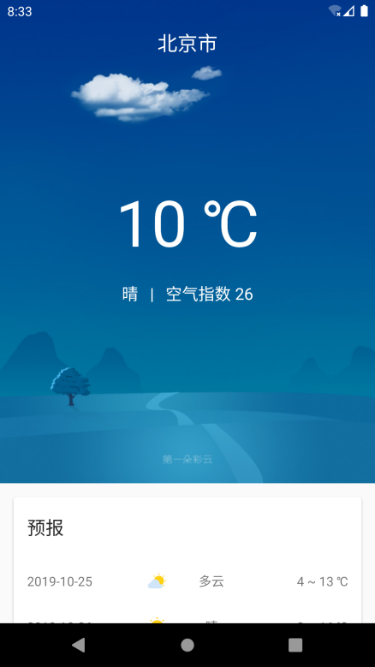

**图 15.26　让背景图与状态栏融合到一起**

怎么样？有没有觉得整个界面的视觉体验完全不一样了，瞬间提升了好几个档次。

### 15.5.3　记录选中的城市

虽说现在我们已经成功实现了显示天气信息的功能，可是你应该也已经发现了，目前是完全没有对选中的城市进行记录的。也就是说，每当你退出并重新进入程序之后，都需要再重新搜索并选择一次城市，这显然是不可接受的。因此，本小节中我们就来实现一下记录选中城市的功能。

很明显这个功能需要用到持久化技术，不过由于要存储的数据并不属于关系型数据，因此也用不着使用数据库存储技术，直接使用 SharedPreferences 存储就可以了。

然而，即使是使用 SharedPreferences 存储这种简单的操作，我们这里也要尽量按照 MVVM 的分层架构设计来实现，不要为了图省事就把所有逻辑都写到 UI 控制层里面。

那么，首先在 logic/dao 包下新建一个 `PlaceDao` 单例类，并编写如下代码：

```Kotlin
object PlaceDao {

    fun savePlace(place: Place) {
        sharedPreferences().edit {
            putString("place", Gson().toJson(place))
        }
    }

    fun getSavedPlace(): Place {
        val placeJson = sharedPreferences().getString("place", "")
        return Gson().fromJson(placeJson, Place::class.java)
    }

    fun isPlaceSaved() = sharedPreferences().contains("place")

    private fun sharedPreferences() = SunnyWeatherApplication.context.
        getSharedPreferences("sunny_weather", Context.MODE_PRIVATE)

}
```

在 `PlaceDao` 类中，我们封装了几个必要的存储和读取数据的接口。`savePlace()` 方法用于将 `Place` 对象存储到 SharedPreferences 文件中，这里使用了一个技巧，我们先通过 GSON 将 `Place` 对象转成一个 JSON 字符串，然后就可以用字符串存储的方式来保存数据了。

读取则是相反的过程，在 `getSavedPlace()` 方法中，我们先将 JSON 字符串从 SharedPreferences 文件中读取出来，然后再通过 GSON 将 JSON 字符串解析成 `Place` 对象并返回。

另外，这里还提供了一个 `isPlaceSaved()` 方法，用于判断是否有数据已被存储。

将 `PlaceDao` 封装好了之后，接下来我们就可以在仓库层进行实现了。修改 Repository 中的代码，如下所示：

```Kotlin
object Repository {
    ...
    fun savePlace(place: Place) = PlaceDao.savePlace(place)

    fun getSavedPlace() = PlaceDao.getSavedPlace()

    fun isPlaceSaved() = PlaceDao.isPlaceSaved()

}
```

很简单，仓库层只是做了一层接口封装而已。其实这里的实现方式并不标准，因为即使是对 SharedPreferences 文件进行读写的操作，也是不太建议在主线程中进行，虽然它的执行速度通常会很快。最佳的实现方式肯定还是开启一个线程来执行这些比较耗时的任务，然后通过 `LiveData` 对象进行数据返回，不过这里为了让代码看起来更加简单一些，我就不使用那么标准的写法了。

这几个接口的业务逻辑是和 PlaceViewModel 相关的，因此我们还得在 PlaceViewModel 中再进行一层封装才行，代码如下所示：

```Kotlin
class PlaceViewModel : ViewModel() {
    ...
    fun savePlace(place: Place) = Repository.savePlace(place)

    fun getSavedPlace() = Repository.getSavedPlace()

    fun isPlaceSaved() = Repository.isPlaceSaved()

}
```

由于仓库层中这几个接口的内部没有开启线程，因此也不必借助 `LiveData` 对象来观察数据变化，直接调用仓库层中相应的接口并返回即可。

将存储与读取 `Place` 对象的能力都提供好了之后，接下来就可以进行具体的功能实现了。首先修改 PlaceAdapter 中的代码，如下所示：

```Kotlin
class PlaceAdapter(private val fragment: PlaceFragment, private val placeList:
        List<Place>) : RecyclerView.Adapter<PlaceAdapter.ViewHolder>() {
    ...
    override fun onCreateViewHolder(parent: ViewGroup, viewType: Int): ViewHolder {
        val view = LayoutInflater.from(parent.context).inflate(R.layout.place_item,
            parent, false)
        val holder = ViewHolder(view)
        holder.itemView.setOnClickListener {
            val position = holder.adapterPosition
            val place = placeList[position]
            val intent = Intent(parent.context, WeatherActivity::class.java).apply {
                putExtra("location_lng", place.location.lng)
                putExtra("location_lat", place.location.lat)
                putExtra("place_name", place.name)
            }
            fragment.viewModel.savePlace(place)
            fragment.startActivity(intent)
            fragment.activity?.finish()
        }
        return holder
    }
    ...
}
```

这里需要进行两处修改：先把 `PlaceAdapter` 主构造函数中传入的 `Fragment` 对象改成 `PlaceFragment` 对象，这样我们就可以调用 `PlaceFragment` 所对应的 PlaceViewModel 了；接着在 `onCreateViewHolder()` 方法中，当点击了任何子项布局时，在跳转到 WeatherActivity 之前，先调用 PlaceViewModel 的 `savePlace()` 方法来存储选中的城市。

完成了存储功能之后，我们还要对存储的状态进行判断和读取才行，修改 PlaceFragment 中的代码，如下所示：

```Kotlin
class PlaceFragment : Fragment() {
    ...
    override fun onActivityCreated(savedInstanceState: Bundle?) {
        super.onActivityCreated(savedInstanceState)
        if (viewModel.isPlaceSaved()) {
            val place = viewModel.getSavedPlace()
            val intent = Intent(context, WeatherActivity::class.java).apply {
                putExtra("location_lng", place.location.lng)
                putExtra("location_lat", place.location.lat)
                putExtra("place_name", place.name)
            }
            startActivity(intent)
            activity?.finish()
            return
        }
        ...
    }

}
```

这里在 PlaceFragment 中进行了判断，如果当前已有存储的城市数据，那么就获取已存储的数据并解析成 `Place` 对象，然后使用它的经纬度坐标和城市名直接跳转并传递给 WeatherActivity，这样用户就不需要每次都重新搜索并选择城市了。

现在重新运行一下程序，再次搜索并选择“北京市”，然后退出程序，下次进入程序的时候会直接跳转到天气界面，并且显示最新的天气信息。

OK，这样第二阶段的开发工作也都完成了，我们把代码提交一下。

```bash
git add .
git commit -m "加入显示天气信息的功能。"
git push origin master
```

## 15.6　手动刷新天气和切换城市

经过两个阶段的开发，现在 SunnyWeather 的主体功能已经有了，不过你会发现目前存在着一个比较严重的 bug，就是当你选中了某一个城市之后，就没法再去查看其他城市的天气了，即使退出程序，下次进来的时候还会直接跳转到天气界面。

因此，在第三阶段中我们要加入切换城市的功能，并且为了能够实时获取最新的天气，还会加入手动刷新天气的功能。

### 15.6.1　手动刷新天气

由于界面上显示的天气信息有可能会过期，因此用户需要一种方式来手动刷新天气。那么具体应该如何触发刷新事件呢？这里我准备采用下拉刷新的方式，正好我们之前学过下拉刷新控件的用法，实现起来会比较简单。

首先修改 activity_weather.xml 中的代码，如下所示：

```xml
<androidx.swiperefreshlayout.widget.SwipeRefreshLayout
    xmlns:android="http://schemas.android.com/apk/res/android"
    android:id="@+id/swipeRefresh"
    android:layout_width="match_parent"
    android:layout_height="match_parent">

    <ScrollView
        android:id="@+id/weatherLayout"
        android:layout_width="match_parent"
        android:layout_height="match_parent"
        android:overScrollMode="never"
        android:scrollbars="none"
        android:visibility="invisible">
        ...
    </ScrollView>

</androidx.swiperefreshlayout.widget.SwipeRefreshLayout>
```

可以看到，这里在 ScrollView 的外面嵌套了一层 SwipeRefreshLayout，这样 ScrollView 就自动拥有下拉刷新功能了。

然后修改 WeatherActivity 中的代码，加入刷新天气的处理逻辑，如下所示：

```Kotlin
class WeatherActivity : AppCompatActivity() {

    val viewModel by lazy { ViewModelProvider(this).get(WeatherViewModel::class.java) }

    override fun onCreate(savedInstanceState: Bundle?) {
        ...
        viewModel.weatherLiveData.observe(this, Observer { result ->
            val weather = result.getOrNull()
            if (weather != null) {
                showWeatherInfo(weather)
            } else {
                Toast.makeText(this, "无法成功获取天气信息", Toast.LENGTH_SHORT).show()
                result.exceptionOrNull()?.printStackTrace()
            }
            swipeRefresh.isRefreshing = false
        })
        swipeRefresh.setColorSchemeResources(R.color.colorPrimary)
        refreshWeather()
        swipeRefresh.setOnRefreshListener {
            refreshWeather()
        }
    }

    fun refreshWeather() {
        viewModel.refreshWeather(viewModel.locationLng, viewModel.locationLat)
        swipeRefresh.isRefreshing = true
    }
    ...
}
```

修改的代码并不算多，首先我们将之前用于刷新天气信息的代码提取到了一个新的 `refreshWeather()` 方法中，在这里调用 WeatherViewModel 的 `refreshWeather()` 方法，并将 SwipeRefreshLayout 的 `isRefreshing` 属性设置成 `true`，从而让下拉刷新进度条显示出来。然后在 `onCreate()` 方法中调用了 SwipeRefreshLayout 的 `setColorSchemeResources()` 方法，来设置下拉刷新进度条的颜色，我们就使用 colors.xml 中的 `colorPrimary` 作为进度条的颜色了。接着调用 `setOnRefreshListener()` 方法给 SwipeRefreshLayout 设置一个下拉刷新的监听器，当触发了下拉刷新操作的时候，就在监听器的回调中调用 `refreshWeather()` 方法来刷新天气信息。

另外不要忘记，当请求结束后，还需要将 SwipeRefreshLayout 的 `isRefreshing` 属性设置成 `false`，用于表示刷新事件结束，并隐藏刷新进度条。

现在重新运行一下程序，并在屏幕的主界面向下拖动，刷新进度条就会显示出来了，效果如图 15.27 所示。


**图 15.27　手动刷新天气**

天气刷新完成之后，下拉进度条会自动消失。

### 15.6.2　切换城市

完成了手动刷新天气的功能，接下来我们继续实现切换城市功能。

既然是要切换城市，那么就肯定需要搜索全球城市的数据，而这个功能我们早在 15.4 节就已经完成了，并且为了方便后面的复用，当时特意选择了在 Fragment 中实现。因此，我们其实只需要在天气界面的布局中引入这个 Fragment，就可以快速集成切换城市功能了。

虽说实现原理很简单，但是显然我们也不可能让引入的 Fragment 把天气界面遮挡住，这又该怎么办呢？还记得 12.3 节学过的滑动菜单功能吗？将 Fragment 放入滑动菜单中实在是再合适不过了，正常情况下它不占据主界面的任何空间，想要切换城市的时候，只需要通过滑动的方式将菜单显示出来就可以了。

下面我们就按照这种思路来实现。首先按照 Material Design 的建议，我们需要在头布局中加入一个切换城市的按钮，不然的话用户可能根本就不知道屏幕的左侧边缘是可以拖动的。修改 now.xml 中的代码，如下所示：

```xml
<RelativeLayout xmlns:android="http://schemas.android.com/apk/res/android"
    android:id="@+id/nowLayout"
    android:layout_width="match_parent"
    android:layout_height="530dp"
    android:orientation="vertical">

    <FrameLayout
        android:id="@+id/titleLayout"
        android:layout_width="match_parent"
        android:layout_height="70dp"
        android:fitsSystemWindows="true">

        <Button
            android:id="@+id/navBtn"
            android:layout_width="30dp"
            android:layout_height="30dp"
            android:layout_marginStart="15dp"
            android:layout_gravity="center_vertical"
            android:background="@drawable/ic_home" />
        ...
    </FrameLayout>
    ...
</RelativeLayout>
```

这里添加了一个 Button 作为切换城市的按钮，并且让它居左显示。

接着修改 activity_weather.xml 布局来加入滑动菜单功能，如下所示：

```xml
<androidx.drawerlayout.widget.DrawerLayout
    xmlns:android="http://schemas.android.com/apk/res/android"
    android:id="@+id/drawerLayout"
    android:layout_width="match_parent"
    android:layout_height="match_parent">

    <androidx.swiperefreshlayout.widget.SwipeRefreshLayout
        android:id="@+id/swipeRefresh"
        android:layout_width="match_parent"
        android:layout_height="match_parent">
        ...
    </androidx.swiperefreshlayout.widget.SwipeRefreshLayout>

    <FrameLayout
        android:layout_width="match_parent"
        android:layout_height="match_parent"
        android:layout_gravity="start"
        android:clickable="true"
        android:focusable="true"
        android:background="@color/colorPrimary">

        <fragment
            android:id="@+id/placeFragment"
            android:name="com.sunnyweather.android.ui.place.PlaceFragment"
            android:layout_width="match_parent"
            android:layout_height="match_parent"
            android:layout_marginTop="25dp"/>

    </FrameLayout>

</androidx.drawerlayout.widget.DrawerLayout>
```

可以看到，我们在 SwipeRefreshLayout 的外面又嵌套了一层 DrawerLayout。DrawerLayout 中的第一个子控件用于显示主屏幕中的内容，第二个子控件用于显示滑动菜单中的内容，因此这里我们在第二个子控件的位置添加了用于搜索全球城市数据的 Fragment。另外，为了让 Fragment 中的搜索框不至于和系统状态栏重合，这里特意使用外层包裹布局的方式让它向下偏移了一段距离。

接下来需要在 WeatherActivity 中加入滑动菜单的逻辑处理，修改 WeatherActivity 中的代码，如下所示：

```Kotlin
class WeatherActivity : AppCompatActivity() {
    ...
    override fun onCreate(savedInstanceState: Bundle?) {
        super.onCreate(savedInstanceState)
        ...
        navBtn.setOnClickListener {
            drawerLayout.openDrawer(GravityCompat.START)
        }
        drawerLayout.addDrawerListener(object : DrawerLayout.DrawerListener {
            override fun onDrawerStateChanged(newState: Int) {}

            override fun onDrawerSlide(drawerView: View, slideOffset: Float) {}

            override fun onDrawerOpened(drawerView: View) {}

            override fun onDrawerClosed(drawerView: View) {
                val manager = getSystemService(Context.INPUT_METHOD_SERVICE)
                as InputMethodManager
                manager.hideSoftInputFromWindow(drawerView.windowToken,
                InputMethodManager.HIDE_NOT_ALWAYS)
            }
        })
    }
    ...
}
```

这里我们主要做了两件事：第一，在切换城市按钮的点击事件中调用 DrawerLayout 的 `openDrawer()` 方法来打开滑动菜单；第二，监听 DrawerLayout 的状态，当滑动菜单被隐藏的时候，同时也要隐藏输入法。之所以要做这样一步操作，是因为待会我们在滑动菜单中搜索城市时会弹出输入法，而如果滑动菜单隐藏后输入法却还显示在界面上，就会是一种非常怪异的情况。

另外，我们之前在 PlaceFragment 中做过一个数据存储状态的判断，假如已经有选中的城市保存在 SharedPreferences 文件中了，那么就直接跳转到 WeatherActivity。但是现在将 PlaceFragment 嵌入 WeatherActivity 中之后，如果还执行这段逻辑肯定是不行的，因为这会造成无限循环跳转的情况。为此需要对 PlaceFragment 进行如下修改：

```Kotlin
class PlaceFragment : Fragment() {
    ...
    override fun onActivityCreated(savedInstanceState: Bundle?) {
        super.onActivityCreated(savedInstanceState)
        if (activity is MainActivity && viewModel.isPlaceSaved()) {
            val place = viewModel.getSavedPlace()
            val intent = Intent(context, WeatherActivity::class.java).apply {
                putExtra("location_lng", place.location.lng)
                putExtra("location_lat", place.location.lat)
                putExtra("place_name", place.name)
            }
            startActivity(intent)
            activity?.finish()
            return
        }
        ...
    }

}
```

这里又多做了一层逻辑判断，只有当 PlaceFragment 被嵌入 MainActivity 中，并且之前已经存在选中的城市，此时才会直接跳转到 WeatherActivity，这样就可以解决无限循环跳转的问题了。

不过现在还没有结束，我们还需要处理切换城市后的逻辑。这个工作就必须在 PlaceAdapter 中进行了，因为之前选中了某个城市后是跳转到 WeatherActivity 的，而现在由于我们本来就是在 WeatherActivity 中的，因此并不需要跳转，只要去请求新选择城市的天气信息就可以了。

那么很显然，这里同样需要根据 PlaceFragment 所处的 Activity 来进行不同的逻辑处理，修改 PlaceAdapter 中的代码，如下所示：

```Kotlin
class PlaceAdapter(private val fragment: PlaceFragment, private val placeList:
        List<Place>) : RecyclerView.Adapter<PlaceAdapter.ViewHolder>() {
    ...
    override fun onCreateViewHolder(parent: ViewGroup, viewType: Int): ViewHolder {
        val view = LayoutInflater.from(parent.context).inflate(R.layout.place_item,
            parent, false)
        val holder = ViewHolder(view)
        holder.itemView.setOnClickListener {
            val position = holder.adapterPosition
            val place = placeList[position]
            val activity = fragment.activity
            if (activity is WeatherActivity) {
                activity.drawerLayout.closeDrawers()
                activity.viewModel.locationLng = place.location.lng
                activity.viewModel.locationLat = place.location.lat
                activity.viewModel.placeName = place.name
                activity.refreshWeather()
            } else {
                val intent = Intent(parent.context, WeatherActivity::class.java).
                    apply {
                    putExtra("location_lng", place.location.lng)
                    putExtra("location_lat", place.location.lat)
                    putExtra("place_name", place.name)
                }
                fragment.startActivity(intent)
                activity?.finish()
            }
            fragment.viewModel.savePlace(place)
        }
        return holder
    }
    ...
}
```

这里我们对 PlaceFragment 所处的 Activity 进行了判断：如果是在 WeatherActivity 中，那么就关闭滑动菜单，给 WeatherViewModel 赋值新的经纬度坐标和地区名称，然后刷新城市的天气信息；而如果是在 MainActivity 中，那么就保持之前的处理逻辑不变即可。

这样我们就把切换城市的功能全部完成了，现在可以重新运行一下程序，效果如图 15.28 所示。

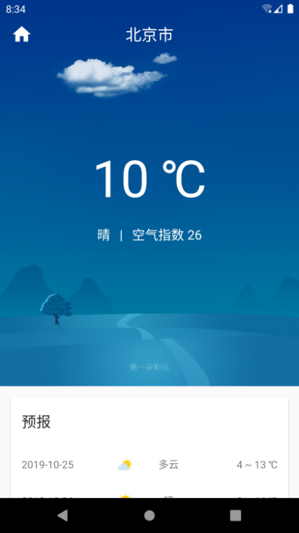

**图 15.28　拥有切换城市按钮的天气界面**

可以看到，标题栏上多出了一个用于切换城市的按钮。点击该按钮，或者在屏幕的左侧边缘进行拖动，就能让滑动菜单界面显示出来，然后我们就可以在这里搜索并切换城市了，如图 15.29 所示。

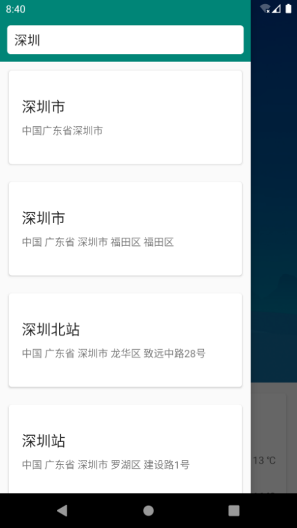

**图 15.29　显示滑动菜单界面**

选中新的城市之后滑动菜单会自动关闭，并且主界面上的天气信息也会更新成你选择的那个城市。

这样，第三阶段的开发任务也完成了。当然，仍然不要忘记提交代码。

```bash
git add .
git commit -m "新增切换城市和手动更新天气的功能。"
git push origin master
```

## 15.7　制作 App 的图标

目前的 SunnyWeather 看起来还不太像是一个正式的 App，为什么呢？因为它还没有一个像样的图标呢。一直使用 Android Studio 自动生成的图标确实不太合适，因此在第四阶段，我们需要制作一下应用程序的图标。

在过去，Android 应用程序的图标都应该放到相应分辨率的 mipmap 目录下，不过从 Android 8.0 系统开始，Google 已经不再建议使用单一的一张图片来作为应用程序的图标，而是应该使用前景和背景分离的图标设计方式。具体来讲，应用程序的图标应该被分为两层：前景层和背景层。前景层用来展示应用图标的 Logo，背景层用来衬托应用图标的 Logo。需要注意的是，背景层在设计的时候只允许定义颜色和纹理，不能定义形状。

那么图标的形状由谁来定义呢？Google 将这个权利交给了手机厂商。手机厂商会在图标的前景层和背景层之上再盖上一层 mask，这个 mask 可以是圆角矩形、圆形或者是方形等，视具体手机厂商而定，这样就可以将手机上所有应用程序的图标都裁剪成相同的形状，从而统一图标的设计规范，原理如图 15.30 所示。

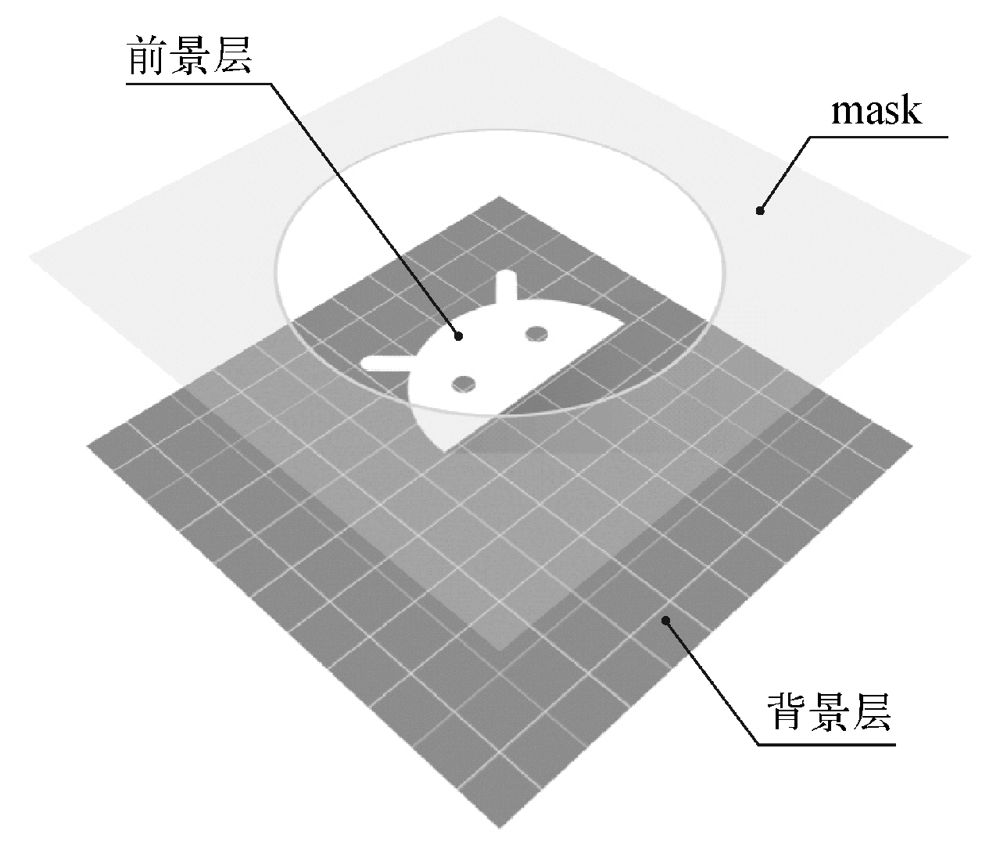

**图 15.30　8.0 及以上系统的图标原理示意图**

可以看到，这里使用的是一种圆形的 mask，那么最终裁剪出的应用程序图标也会是圆形的，如图 15.31 所示。


**图 15.31　裁剪后的应用程序图标**

了解了工作原理之后，接下来我们就开始动手实现吧。这里我事先准备好了一张图片作为图标的前景层 Logo（图片见 SunnyWeather 项目源码的 logo 目录，源码下载地址见前言，或者也可以到 SunnyWeather 的 GitHub 主页去下载）。由于我不是搞美术的，因此 Logo 设计得很简单，如图 15.32 所示。


**图 15.32　图标的前景层 Logo**

然后我们可以借助 Android Studio 提供的 Asset Studio 工具来制作能够兼容各个 Android 系统版本的应用程序图标。点击导航栏中的 File→New→Image Asset 打开 Asset Studio 工具，如图 15.33 所示。


**图 15.33　Asset Studio 的主界面**

这个 Asset Studio 非常简单好用，一学就会。左边是操作区域，右边是预览区域。

先来看操作区域，第一行的 Icon Type 保持默认就可以了，表示同时创建兼容 8.0 系统以及老版本系统的应用图标。第二行的 Name 用于指定应用图标的名称，这里也保持 `ic_launcher` 的命名即可，这样可以覆盖掉之前自动生成的应用程序图标。接下来的 3 个页签，Foreground Layer 用于编辑前景层，Background Layer 用于编辑背景层，Legacy 用于编辑老版本系统的图标。

再来看预览区域，这个就更简单了，它的主要作用就是预览应用图标的最终效果。在预览区域中给出了可能生成的图标形状，包括圆形、圆角矩形、方形，等等。注意，每个预览图标中都有一个圆圈，这个圆圈叫作安全区域，必须保证图标的前景层完全处于安全区域中才行，否则可能会出现应用图标的 Logo 被手机厂商的 mask 裁剪掉的情况。

下面我们来具体操作一下吧，在 Foreground Layer 中选取之前准备好的那张 Logo 图片，并通过下方的 Resize 拖动条对图片进行缩放，以保证前景层的所有内容都是在安全区域中的。然后在 Background Layer 中选择“Color”这种 Asset Type 模式，并使用#219FDD 这个颜色值作为背景层的颜色。最终的预览效果如图 15.34 所示。


**图 15.34　应用图标的预览效果**

在预览区域可以看到，现在我们的图标已经能够应对各种不同类型的 mask 了。

接下来点击“Next”会进入一个确认图标生成路径的界面，然后直接点击界面上的“Finish”按钮就可以完成图标的制作了。所有图标相关的文件都会被生成到相应分辨率的 mipmap 目录下，如图 15.35 所示。


**图 15.35　mipmap 目录下的文件**

但是，其中有一个 mipmap-anydpi-v26 目录中放的并不是图片，而是 xml 文件，这是什么意思呢？其实只要是 Android 8.0 及以上系统的手机，都会使用这个目录下的文件来作为图标。我们可以打开 ic_launcher.xml 文件来查看它的代码：

```xml
<adaptive-icon xmlns:android="http://schemas.android.com/apk/res/android">
    <background android:drawable="@color/ic_launcher_background"/>
    <foreground android:drawable="@mipmap/ic_launcher_foreground"/>
</adaptive-icon>
```

这就是适配 Android 8.0 及以上系统应用图标的标准写法。可以看到，这里在 `<adaptive-icon>` 标签中定义了一个 `<background>` 标签用于指定图标的背景层，引用的是我们之前设置的颜色值。又定义一个 `<foreground>` 标签用于指定图标的前景层，引用的就是我们之前准备的那张 Logo 图片。

那么这个 ic_launcher.xml 文件又是在哪里被引用的呢？其实只要打开一下 AndroidManifest.xml 文件，所有的秘密就被解开了，代码如下所示：

```xml
<manifest xmlns:android="http://schemas.android.com/apk/res/android"
    package="com.sunnyweather.android">
    ...
    <application
        android:name=".SunnyWeatherApplication"
        android:allowBackup="true"
        android:icon="@mipmap/ic_launcher"
        android:label="@string/app_name"
        android:roundIcon="@mipmap/ic_launcher_round"
        android:supportsRtl="true"
        android:theme="@style/AppTheme">
        ...
    </application>
</manifest>
```

可以看到，`<application>` 标签的 `android:icon` 属性就是专门用于指定应用程序图标的，这里将图标指定成了 `@mipmap/ic_launcher`，那么在 Android 8.0 及以上系统中，就会使用 mipmap-anydpi-v26 目录下的 ic_launcher.xml 文件来作为应用图标。7.0 及以下系统就会使用 mipmap 相应分辨率目录下的 ic_launcher.png 图片来作为应用图标。另外你可能注意到了，`<application>` 标签中还有一个 `android:roundIcon` 属性，这是一个只适用于 Android 7.1 系统的过渡版本，很快就被 8.0 系统的新图标适配方案所替代了，我们可以不必关心它。这样 SunnyWeather 的图标就制作完成了，现在重新运行一下程序，并观察桌面应用，效果如图 15.36 所示。

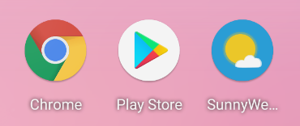

**图 15.36　手机桌面的图标**

可以看到，SunnyWeather 的图标在 Pixel 模拟器上被裁剪成了圆形，和其他应用图标的形状是保持一致的。而如果你在别的手机上运行，得到的可能会是不同的效果。

另外，在 Pixel 模拟器上，由于 SunnyWeather 这个名字太长了，因此应用名没能得到完整的显示。如果你想要将它修改成短一点的名字，打开 res/values/string.xml 文件，并编辑如下部分内容即可：

```xml
<resources>
    <string name="app_name">SunnyWeather</string>
</resources>
```

最后，养成良好的习惯，仍然不要忘记提交代码。

```bash
git add .
git commit -m "修改App的图标。"
git push origin master
```

这样我们就终于大功告成了！

## 15.8　生成正式签名的 APK 文件

之前我们一直都是通过 Android Studio 来将程序安装到手机上的，而它背后实际的工作流程是，Android Studio 会将程序代码打包成一个 APK 文件，然后将这个文件传输到手机上，最后再执行安装操作。Android 系统会将所有的 APK 文件识别为应用程序的安装包，类似于 Windows 系统上的 EXE 文件。

但并不是所有的 APK 文件都能成功安装到手机上，Android 系统要求只有签名后的 APK 文件才可以安装，因此我们还需要对生成的 APK 文件进行签名才行。那么你可能会有疑问了，直接通过 Android Studio 运行程序的时候好像并没有进行过签名操作啊，为什么还能将程序安装到手机上呢？这是因为 Android Studio 使用了一个默认的 keystore 文件帮我们自动进行了签名。点击 Android Studio 右侧工具栏的 Gradle→ 项目名 →app→Tasks→android，双击“signingReport”，结果如图 15.37 所示。

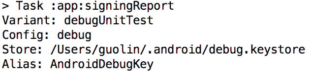

**图 15.37　查看默认的 keystore 文件**

也就是说，我们所有通过 Android Studio 来运行的程序都是使用这个 debug.keystore 文件来进行签名的。不过这仅仅适用于开发阶段而已，如果要正式发布应用程序的话，要使用一个正式的 keystore 文件来进行签名才行。下面我们就来学习一下，如何生成一个带有正式签名的 APK 文件。

### 15.8.1　使用 Android Studio 生成

先学习一下如何使用 Android Studio 来生成正式签名的 APK 文件。点击 Android Studio 导航栏上的 Build→Generate Signed Bundle / APK，会弹出如图 15.38 所示的对话框。

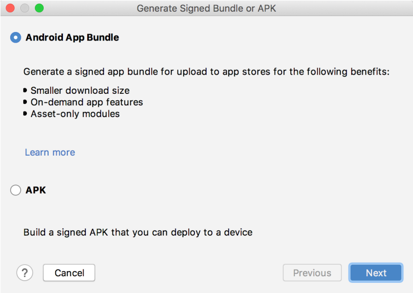

**图 15.38　生成 Bundle 或 APK 的对话框**

这里让我们选择是创建 Android App Bundle 文件，还是创建 APK 文件。其中，Android App Bundle 文件是用于上架 Google Play 商店的，使用这种类型的文件，Google Play 可以根据用户的手机，只下发它需要的那部分程序资源。比如说一个高分辨率的手机，是没有必要下载低分辨率目录下的图片资源的；一个 arm 架构的手机，也没有必要下载 x86 架构下的 so 文件（so 文件是使用 C/C++ 代码开发的库文件，不在我们本书讨论范围内）。因此，使用 Android App Bundle 文件可以显著地减少 App 的下载体积，但缺点是它不能直接安装到手机上，也不能用于上架除 Google Play 之外的其他应用商店。

不管你选择创建的是 Android App Bundle 文件还是 APK 文件，后面的流程基本上是一样的，因此我还是以创建 APK 文件来举例。点击“Next”后会要求我们填入 keystore 文件的路径和密码，如图 15.39 所示。


**图 15.39　生成 Bundle 或 APK 的对话框**

由于目前我们还没有一个正式的 keystore 文件，所以应该点击“Create new”按钮，然后会弹出一个新的对话框来让我们填写创建 keystore 文件所必要的信息。根据自己的实际情况进行填写就行了，如图 15.40 所示。

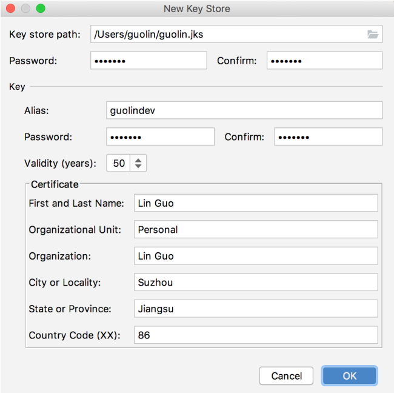

**图 15.40　填写 keystore 文件信息**

这里需要注意，在 Validity 那一栏填写的是 keystore 文件的有效时长，单位是年，建议时间可以填得长一些，比如我填了 50 年。然后点击“OK”，这时我们刚才填写的信息会自动填充到创建签名 APK 的对话框中，如图 15.41 所示。


**图 15.41　信息自动填充完整**

如果你希望以后都不用再输 keystore 的密码了，可以将“Remember passwords”选项勾上。然后点击“Next”，这时就要选择 APK 文件的输出地址了，如图 15.42 所示。

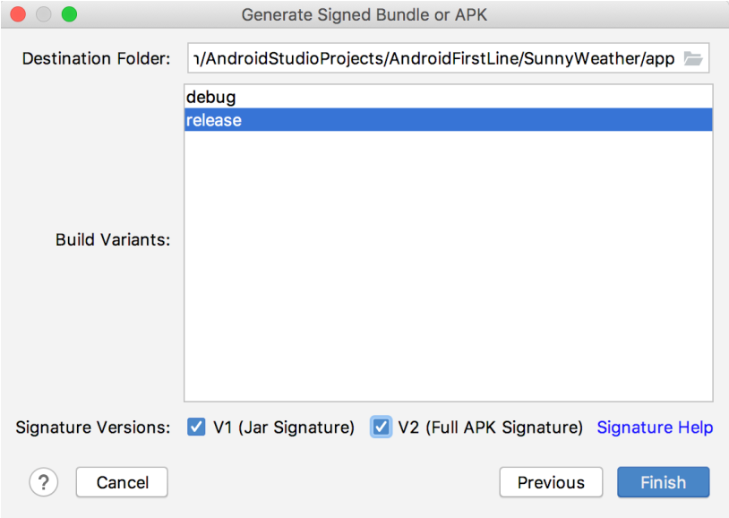

**图 15.42　信息自动填充完整**

这里默认是将 APK 文件生成到项目的 app 目录下，我就不做修改了。至于构建类型选择“release”，因为我们这是要出正式版的 APK 文件，不能再使用 debug 类型了。另外，注意一定要将签名版本中的 V1 和 V2 选项同时勾上，表示会使用同时兼容新老版本系统的签名方式。

现在点击“Finish”，然后稍等一段时间， APK 文件就会生成好了，并且会在右下角弹出一个如图 15.43 所示的提示。


**图 15.43　提示 APK 文件生成成功**

我们点击提示上的“locate”，可以立刻查看生成的 APK 文件，如图 15.44 所示。


**图 15.44　查看生成的 APK 文件**

这里的 app-release.apk 就是带有正式签名的 APK 文件了，它可以直接安装到手机上，也可以用于上架到各个应用商店中。而如果前面我们选择了创建 Android App Bundle 文件，这里将会得到一个.aab 后缀的签名文件，这是 Google Play 商店现在更加推荐使用的文件格式。

### 15.8.2　使用 Gradle 生成

上一小节中我们使用了 Android Studio 提供的可视化工具来生成带有正式签名的 APK 文件，除此之外，Android Studio 其实还提供了另外一种方式——使用 Gradle 生成。下面我们就来学习一下。

Gradle 是一个非常先进的项目构建工具， 在 Android Studio 中开发的所有项目都是使用它来构建的。在之前的项目中，我们也体验过了 Gradle 带来的很多便利之处，比如说当需要添加依赖库的时候，不需要自己再去手动下载，而是直接在 dependencies 中添加一句引用声明就可以了。

下面我们开始学习如何使用 Gradle 来生成带有正式签名的 APK 文件。编辑 app/build.gradle 文件，在 `android` 闭包中添加如下内容：

```gradle
android {
    compileSdkVersion 29
    defaultConfig {
        applicationId "com.sunnyweather.android"
        minSdkVersion 21
        targetSdkVersion 29
        versionCode 1
        versionName "1.0"
        testInstrumentationRunner "androidx.test.runner.AndroidJUnitRunner"
    }
    signingConfigs {
        config {
            storeFile file('/Users/guolin/guolin.jks')
            storePassword '1234567'
            keyAlias = 'guolindev'
            keyPassword '1234567'
        }
    }
    buildTypes {
        release {
            minifyEnabled false
            proguardFiles getDefaultProguardFile('proguard-android-optimize.txt'),
                'proguard-rules.pro'
        }
    }
}
```

可以看到，这里在 `android` 闭包中添加了一个 `signingConfigs` 闭包，然后在 `signingConfigs` 闭包中又添加了一个 `config` 闭包。接着在 `config` 闭包中配置 keystore 文件的各种信息，`storeFile` 用于指定 keystore 文件的位置，`storePassword` 用于指定密码，`keyAlias` 用于指定别名，`keyPassword` 用于指定别名密码。

将签名信息都配置好了之后，接下来只需要在生成正式版 APK 的时候去应用这个配置就可以了。继续编辑 app/build.gradle 文件，如下所示：

```gradle
android {
    ...
    buildTypes {
        release {
            minifyEnabled false
            proguardFiles getDefaultProguardFile('proguard-android-optimize.txt'),
                'proguard-rules.pro'
            signingConfig signingConfigs.config
        }
    }
}
```

这里我们在 `buildTypes` 下面的 `release` 闭包中应用了刚才添加的签名配置，这样当生成正式版 APK 文件的时候，就会自动使用我们刚才配置的签名信息来进行签名了。

现在 build.gradle 文件已经配置完成，那么我们如何才能生成 APK 文件呢？其实非常简单，Android Studio 中内置了很多的 Gradle Tasks，其中就包括了生成 APK 文件的 Task。点击右侧工具栏的 Gradle→ 项目名 →app→Tasks→build，如图 15.45 所示。


**图 15.45　查看内置 Gradle Tasks**

其中，assemble 就是用于生成 APK 文件的，它会同时生成 debug 和 release 两个版本的 APK 文件，只需要双击即可执行这个 Task，结果如图 15.46 所示。

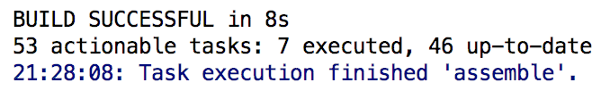

**图 15.46　assemble 执行成功**

可以看到，这里提示我们“BUILD SUCCESSFUL”，说明 assemble 执行成功了。APK 文件会自动生成在 app/build/outputs/apk 目录下，如图 15.47 所示。

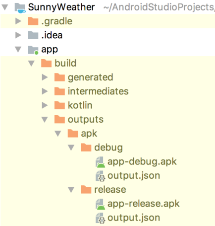

**图 15.47　查看生成的 APK 文件**

其中，release 目录下的 app-release.apk 就是带有正式签名的 APK 文件了。

虽说现在 APK 文件已经成功生成了，不过还有一个小细节需要注意一下。目前 keystore 文件的所有信息都是以明文的形式直接配置在 build.gradle 中的，这种做法会不安全。尤其是 SunnyWeather 的代码还是开源的，这样就相当于把 keystore 文件的密码公布出去了。比较推荐的做法是将这类敏感数据配置在一个独立的文件里面，然后再在 build.gradle 中去读取这些数据。

下面我们来按照这种方式实现。Android Studio 项目的根目录下有一个 gradle.properties 文件，它是专门用来配置全局键值对数据的。我们在 gradle.properties 文件中添加如下内容：

```bash
KEY_PATH=/Users/guolin/guolin.jks
KEY_PASS=1234567
ALIAS_NAME=guolindev
ALIAS_PASS=1234567
```

可以看到，这里将 keystore 文件的各种信息以键值对的形式进行了配置，然后我们在 build.gradle 中去读取这些数据就可以了。编辑 app/build.gradle 文件，如下所示：

```gradle
android {
    ...
    signingConfigs {
        config {
            storeFile file(KEY_PATH)
            storePassword KEY_PASS
            keyAlias ALIAS_NAME
            keyPassword ALIAS_PASS
        }
    }
    ...
}
```

这里只需要将原来的明文配置改成相应的键值，一切就完工了。这样直接查看 build.gradle 文件是无法看到 keystore 文件的各种信息的，只有查看 gradle.properties 文件才能看得到。然后我们只需要将 gradle.properties 文件保护好就行了，比如说将它从 Git 版本控制中排除。这样 gradle.properties 文件就只会保留在本地，从而也就不用担心 keystore 文件的信息会泄漏了。

## 15.9　你还可以做的事情

整章内容已经全部学完了，现在回想一下，我们的代码是不是使用 MVVM 架构的模式来实现的呢？这里我根据前面编写的代码画出了一张 SunnyWeather 项目的架构示意图，如图 15.48 所示。相信对于现在的你来说，理解起来应该是非常轻松的。


**图 15.48　SunnyWeather 项目的架构示意图**

可以看出，我们编写的代码是严格按照 MVVM 架构来实现的，且拥有合理的架构分层。记住，一个拥有良好架构设计的项目是可以用简洁清晰的架构图表示出来的，而一个杂乱无章没有架构设计的项目则很难用架构图表示出来。所以希望你在未来编写代码的时候，可以写出高质量且拥有架构设计的代码。

那么经过整章的开发之后，SunnyWeather 已经是一个完善、成熟的 App 了吗？嘿嘿，还差得远呢！现在的 SunnyWeather 只能说是具备了一些最基本的功能，和那些商用的天气软件比起来还有很大的差距，因此你仍然还有非常巨大的发挥空间来对它进行完善。

比如说，以下功能是你可以考虑加入 SunnyWeather 中的：

- 提供更加完整的天气信息，目前我们只使用了彩云天气返回的一小部分数据而已；
- 允许选择多个城市，可以同时观察多个城市的天气信息，不用来回切换；
- 增加后台更新天气功能，并允许用户手动设定后台的更新频率；
- 对深色主题进行适配。

另外，由于 SunnyWeather 的源码已经托管在了 GitHub 上面，如果你想在现有代码的基础上继续对这个项目进行完善，可以使用 GitHub 的 Fork 功能。

首先登录你自己的 GitHub 账号，然后打开 SunnyWeather 版本库的主页：[https://github.com/guolindev/SunnyWeather](https://github.com/guolindev/SunnyWeather)，这时在页面头部的最右侧会有一个“Fork”按钮，如图 15.49 所示。


**图 15.49　GitHub 的“Fork”按钮**

点击一下“Fork”按钮，就可以将 SunnyWeather 这个项目复制一份到你的账号下，再使用 `git clone` 命令将它克隆到本地，然后你就可以在现有代码的基础上随心所欲地添加任何功能并提交了。