# 第 16 章　编写并发布一个开源库，PermissionX

进入了本书的最后一章，我们的 Android 学习之旅也接近尾声了。学完整本书，你应该能够发现，我个人是不太喜欢使用纯理论知识的讲解形式的，而是更加偏向于边实战边讲解，在实战中学习的这种形式。因此，学到这里，你其实已经编写过数不清的小项目了，并且还在上一章中开发了一个完整的 App。

在编写项目的时候，我们可能经常会使用一些好用的第三方开源库，比如 Retrofit、Glide 等。将这些开源库引入项目中非常简单，只需要在 build.gradle 的 dependencies 中添加一行库的引用地址就可以了。那么你有没有想过，我们可不可以自己也开发一个开源库，然后提供给其他的开发者去使用呢？答案当然是肯定的，本章我们就来学习一下这方面的技术。

## 16.1　开发前的准备工作

先解释一下，无论是否开源，只要是编写一个库提供给其他的项目去使用，就可以统称为 SDK 开发。

SDK 开发和传统的应用程序开发会有一些不同之处。首先，SDK 开发界面相关的工作会相对比较少，许多库甚至是完全没有界面的，因此 SDK 开发多数情况下是以实现功能逻辑为主的。

其次，产品的形式不同。应用程序开发的最终产品可能是一个可安装的 APK 文件，而 SDK 开发的最终产品通常是一些库文件，甚至只有一个库的引用地址。

最后，面向的用户群体不同。SDK 开发面向的用户群体从来都不是普通用户，而是其他开发者。因此如何让我们编写的库可以保持稳定的工作，同时还能提供简单方便的接口给其他开发者去调用，这是我们应该优先考虑的事情。

需要注意的大概就是以上几点了，其实大部分的编程思维和之前是差不多的，因此你一定能非常快速地掌握这项技能。

接下来要考虑的问题就是，我们应该编写一个什么样的开源库呢？其实在之前的 Kotlin 课堂中我们已经编写过许多好用的工具方法了，这些工具方法都可以被封装成一个开源库，提供给其他项目去使用。不过为了能够更加丰富地讲解本章内容，我还是重新思考了一个全新的开源库项目来进行实现。

回顾一下，在第 8 章中我们曾经学习过 Android 运行时权限 API 的用法，比如要实现拨打电话的功能，示例写法如下所示：

```Kotlin
class MainActivity : AppCompatActivity() {

    override fun onCreate(savedInstanceState: Bundle?) {
        ...
        if (ContextCompat.checkSelfPermission(this, Manifest.permission.CALL_PHONE) !=
                PackageManager.PERMISSION_GRANTED) {
            ActivityCompat.requestPermissions(this, arrayOf(Manifest.permission.
                CALL_PHONE), 1)
        } else {
            call()
        }
    }

    override fun onRequestPermissionsResult(requestCode: Int, permissions:
            Array<String>, grantResults: IntArray) {
        super.onRequestPermissionsResult(requestCode, permissions, grantResults)
        when (requestCode) {
            1 -> {
                if (grantResults.isNotEmpty() &&
                        grantResults[0] == PackageManager.PERMISSION_GRANTED) {
                    call()
                } else {
                    Toast.makeText(this, "You denied the permission",
                        Toast.LENGTH_SHORT).show()
                }
            }
        }
    }

    private fun call() {
        ...
    }

}
```

可以看到，这种系统内置的运行时权限 API 的用法还是非常烦琐的，需要先判断用户是否已授权我们拨打电话的权限，如果没有的话则要进行权限申请，然后还要在 `onRequestPermissionsResult()` 回调中处理权限申请的结果，最后才能去执行拨打电话的操作。

为此，每次需要编写运行时权限相关代码的时候，我都会特别头疼。那么我们可不可以编写一个开源库来简化运行时权限 API 的用法呢？没错，这就是本章中所要实现的功能了。

不过，在开始实现之前，我们还得给这个开源库起一个好听的名字才行。Android 官方的许多功能扩展库是以 AndroidX 的形式发布的，那么这里我们就给它起名叫 PermissionX 吧，这听上去像是一个不错的名字。

起好了名字之后，接下来需要在 GitHub 上创建一个相应的版本库。创建的方式我们在上一章的 Git 时间环节已经学过了，因此这里我就用尽量简短的篇幅来描述这个过程，如图 16.1 所示。


**图 16.1　创建 PermissionX 版本库**

点击“Create repository”按钮即可完成版本库的创建。

接着在 Android Studio 中新建一个 Android 项目，项目名也叫作 PermissionX，包名叫作 com.permissionx.app，如图 16.2 所示。


**图 16.2　创建 PermissionX 项目**

点击“Finish”按钮完成项目的创建。

接下来我们需要将 PermissionX 的远程版本库克隆到本地，点击版本库主页中的“Clone or download”按钮，能够查看到 PermissionX 版本库的 Git 地址，如下所示：

[https://github.com/guolindev/PermissionX.git](https://github.com/guolindev/PermissionX.git)

然后打开终端界面并切换到 PermissionX 的工程目录下，执行以下命令把远程版本库克隆到本地，如图 16.3 所示。

```bash
git clone https://github.com/guolindev/PermissionX.git
```

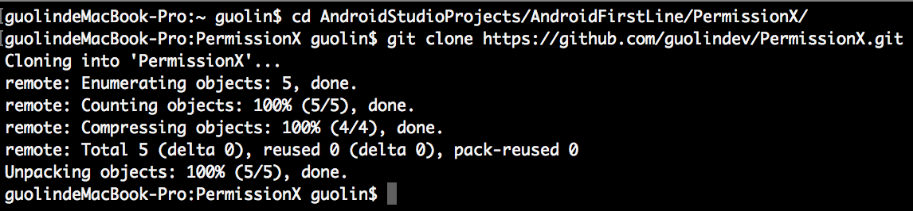

**图 16.3　将远程版本库克隆到本地**

接下来将克隆的所有文件全部复制到上一层目录中，操作方法和上一章是完全相同的。然后将克隆的 PermissionX 目录删除，现在 PermissionX 工程的目录结构应该如图 16.4 所示。

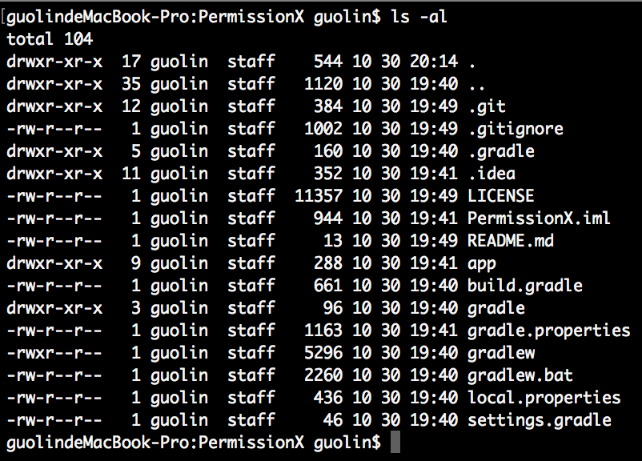

**图 16.4　PermissionX 工程的目录结构**

最后，我们需要把 PermissionX 项目中现有的文件提交到 GitHub 上面，执行以下命令即可：

```bash
git add .
git commit -m "First commit."
git push origin master
```

到这里，开发前的所有准备工作都已经完成了，那么接下来就让我们正式进入 PermissionX 开源库的开发当中吧。

## 16.2　实现 PermissionX 开源库

不知你是否留意过，之前我们编写的所有代码都是在 app 目录下进行的。这其实是一个专门用于开发应用程序的模块。而现在我们要开发的是一个库，因此就不适合将代码继续写在 app 模块中了。

实际上，一个 Android 项目中可以包含任意多个模块，并且模块与模块之间可以相互引用。比方说，我们在模块 A 中编写了一个功能，那么只需要在模块 B 中引入模块 A，模块 B 就可以无缝地使用模块 A 中提供的所有功能。

接下来我们就在 PermissionX 项目中新建一个模块，并在这个模块中实现具体的功能。对着最顶层的 PermissionX 目录右击 →New→Module，会弹出一个创建模块的对话框，如图 16.5 所示。

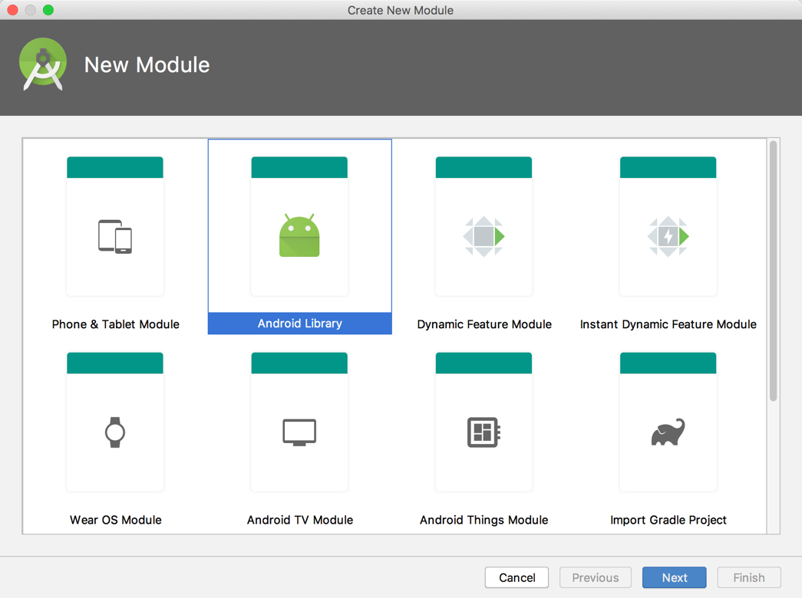

**图 16.5　创建模块对话框**

选中“Android Library”，表示我们要创建一个 Android 库，然后点击“Next”，界面如图 16.6 所示。

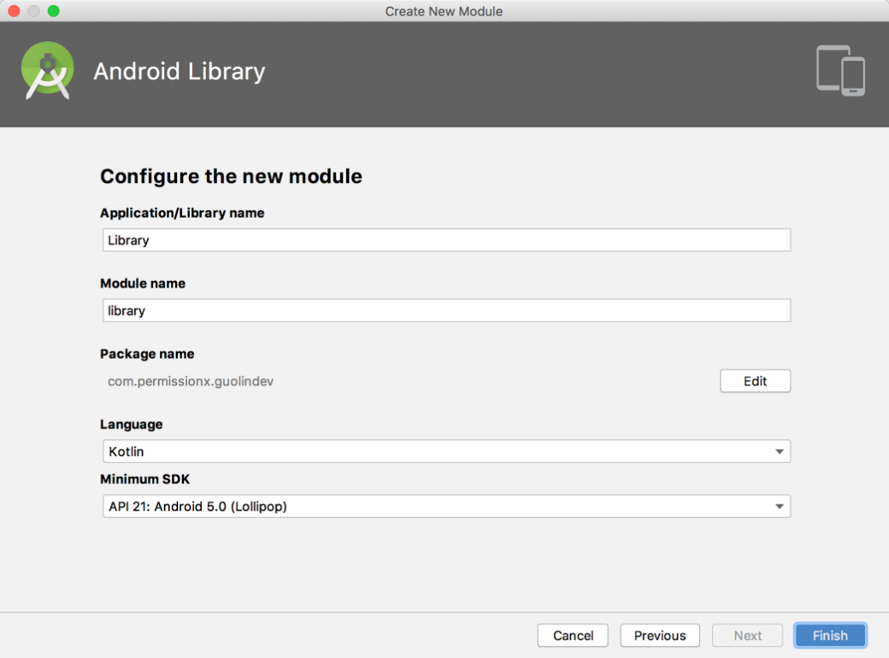

**图 16.6　配置库的名称与包名**

这里要配置库的名称，我们直接起名叫 Library 就好了。至于包名的话，由于要尽量避免和别人的代码产生冲突，因此最好起一些具有唯一性的名字，比如这里我将包名命名成了 com.permissionx.guolindev，你在实现的时候应该将最后的部分替换成你自己的名字。

点击“Finish”按钮完成创建，现在 PermissionX 工程目录下应该就有 app 和 library 两个模块了，如图 16.7 所示。


**图 16.7　PermissionX 工程目录结构**

可以看到，app 和 library 这两个模块的目录图标也是不同的，这是为了让我们能够更好地区分应用程序模块和库模块。

另外，观察一下 library 模块中的 build.gradle 文件，其简化后的代码如下所示：

```gradle
apply plugin: 'com.android.library'
apply plugin: 'kotlin-android'
apply plugin: 'kotlin-android-extensions'

android {
    compileSdkVersion 29
    defaultConfig {
        minSdkVersion 21
        targetSdkVersion 29
        versionCode 1
        versionName "1.0"
        testInstrumentationRunner "androidx.test.runner.AndroidJUnitRunner"
        consumerProguardFiles 'consumer-rules.pro'
    }
    ...
}
...
```

你会发现它和 app 模块中的 build.gradle 文件有两个重要的区别：第一，这里头部引入的插件是 com.android.library，表示这是一个库模块，而 app/build.gradle 文件头部引入的插件是 com.android.application，表示这是一个应用程序模块；第二，这里的 `defaultConfig` 闭包中是不可以配置 `applicationId` 属性的，而 app/build.gradle 中则必须配置这个属性，用于作为应用程序的唯一标识。

了解了应用程序模块和库模块的主要区别之后，接下来我们就开始在 library 模块中实现 PermissionX 的具体功能吧。

其实，想要对运行时权限的 API 进行封装并不是一件容易的事，因为这个操作是有特定的上下文依赖的，一般需要在 Activity 中接收 `onRequestPermissionsResult()` 方法的回调才行，所以不能简单地将整个操作封装到一个独立的类中。当然，受此限制，也衍生出了一些特别的解决方案，比如将运行时权限的操作封装到 `BaseActivity` 中，或者提供一个透明的 Activity 来处理运行时权限等。

这里我并不准备使用以上几种方案，而是准备使用另外一种业内普遍比较认可的小技巧来进行实现。是什么小技巧呢？回想一下，之前所有申请运行时权限的操作都是在 Activity 中进行的，事实上，Google 在 Fragment 中也提供了一份相同的 API，使得我们在 Fragment 中也能申请运行时权限。

但不同的是，Fragment 并不像 Activity 那样必须有界面，我们完全可以向 Activity 中添加一个隐藏的 Fragment，然后在这个隐藏的 Fragment 中对运行时权限的 API 进行封装。这是一种非常轻量级的做法，不用担心隐藏 Fragment 会对 Activity 的性能造成什么影响。

确定好了实现方案之后，那么就开始动手吧。右击 com.permissionx.guolindev 包 →New→Kotlin File/Class，新建一个 `InvisibleFragment` 类，并让它继承自 androidx.fragment.app.Fragment。

然后在 `InvisibleFragment` 中对运行时权限的 API 进行封装，代码如下所示：

```Kotlin
class InvisibleFragment : Fragment() {

    private var callback: ((Boolean, List<String>) -> Unit)? = null

    fun requestNow(cb: (Boolean, List<String>) -> Unit, vararg permissions: String) {
        callback = cb
        requestPermissions(permissions, 1)
    }

    override fun onRequestPermissionsResult(requestCode: Int,
        permissions: Array<String>, grantResults: IntArray) {
        if (requestCode == 1) {
            val deniedList = ArrayList<String>()
            for ((index, result) in grantResults.withIndex()) {
                if (result != PackageManager.PERMISSION_GRANTED) {
                    deniedList.add(permissions[index])
                }
            }
            val allGranted = deniedList.isEmpty()
            callback?.let { it(allGranted, deniedList) }
        }
    }

}
```

这段代码虽然不长，但是所包含的内容却极其关键。首先我们定义了一个 `callback` 变量作为运行时权限申请结果的回调通知方式，并将它声明成了一种函数类型变量，该函数类型接收 `Boolean` 和 `List<String>` 这两种类型的参数，并且没有返回值。

然后定义了一个 `requestNow()` 方法，该方法接收一个与 `callback` 变量类型相同的函数类型参数，同时还使用 `vararg` 关键字接收了一个可变长度的 `permissions` 参数列表。在 `requestNow()` 方法中，我们将传递进来的函数类型参数赋值给 `callback` 变量，然后调用 Fragment 中提供的 `requestPermissions()` 方法去立即申请运行时权限，并将 `permissions` 参数列表传递进去，这样就可以实现由外部调用方自主指定要申请哪些权限的功能了。

接下来还需要重写 `onRequestPermissionsResult()` 方法，并在这里处理运行时权限的申请结果。可以看到，我们使用了一个 `deniedList` 列表来记录所有被用户拒绝的权限，然后遍历 `grantResults` 数组，如果发现某个权限未被用户授权，就将它添加到 `deniedList` 中。遍历结束后使用一个 `allGranted` 变量来标识是否所有申请的权限均已被授权，判断的依据就是 `deniedList` 列表是否为空。最后使用 `callback` 变量对运行时权限的申请结果进行回调。

另外注意，在 InvisibleFragment 中，我们并没有重写 `onCreateView()` 方法来加载某个布局，因此它自然就是一个不可见的 Fragment，待会只需要将它添加到 Activity 中即可。

不过，上述代码其实还有进一步优化的空间。你应该也能感觉到，`(Boolean, List<String>) -> Unit` 这种函数类型的写法是比较复杂的，而且我们还不只编写了一次，编写的次数越多，你就会觉得越麻烦。对于这种情况，其实是可以使用如下写法来进行优化的：

```Kotlin
typealias PermissionCallback = (Boolean, List<String>) -> Unit

class InvisibleFragment : Fragment() {

    private var callback: PermissionCallback? = null

    fun requestNow(cb: PermissionCallback, vararg permissions: String) {
        callback = cb
        requestPermissions(permissions, 1)
    }
    ...
}
```

这里用到了 Kotlin 中的一个小技巧，`typealias` 关键字可以用于给任意类型指定一个别名，比如我们将 `(Boolean, List<String>) -> Unit` 的别名指定成了 `PermissionCallback`，这样就可以使用 `PermissionCallback` 来替代之前所有使用 `(Boolean, List<String>) -> Unit` 的地方，从而让代码变得更加简洁易懂。

完成了 `InvisibleFragment` 的编写，接下来我们需要开始编写对外接口部分的代码了。新建一个 PermissionX 单例类，代码如下所示：

```Kotlin
object PermissionX {

    private const val TAG = "InvisibleFragment"

    fun request(activity: FragmentActivity, vararg permissions: String, callback:
            PermissionCallback) {
        val fragmentManager = activity.supportFragmentManager
        val existedFragment = fragmentManager.findFragmentByTag(TAG)
        val fragment = if (existedFragment != null) {
            existedFragment as InvisibleFragment
        } else {
            val invisibleFragment = InvisibleFragment()
            fragmentManager.beginTransaction().add(invisibleFragment, TAG).commitNow()
            invisibleFragment
        }
        fragment.requestNow(callback, *permissions)
    }

}
```

这里之所以要将 PermissionX 指定成单例类，是为了让 PermissionX 中的接口能够更加方便地被调用。我们在 PermissionX 中定义了一个 `request()` 方法，这个方法接收一个 `FragmentActivity` 参数、一个可变长度的 `permissions` 参数列表，以及一个 `callback` 回调。其中，`FragmentActivity` 是 `AppCompatActivity` 的父类。

在 `request()` 方法中，首先获取 FragmentManager 的实例，然后调用 `findFragmentByTag()` 方法来判断传入的 `Activity` 参数中是否已经包含了指定 TAG 的 Fragment，也就是我们刚才编写的 `InvisibleFragment`。如果已经包含则直接使用该 Fragment，否则就创建一个新的 `InvisibleFragment` 实例，并将它添加到 Activity 中，同时指定一个 TAG。注意，在添加结束后一定要调用 `commitNow()` 方法，而不能调用 `commit()` 方法，因为 `commit()` 方法并不会立即执行添加操作，因而无法保证下一行代码执行时 InvisibleFragment 已经被添加到 Activity 中了。

有了 InvisibleFragment 的实例之后，接下来我们只需要调用它的 `requestNow()` 方法就能去申请运行时权限了，申请结果会自动回调到 `callback` 参数中。需要注意的是，`permissions` 参数在这里实际上是一个数组。对于数组，我们可以遍历它，可以通过下标访问，但是不可以直接将它传递给另外一个接收可变长度参数的方法。因此，这里在调用 `requestNow()` 方法时，在 `permissions` 参数的前面加上了一个 `*`，这个符号并不是指针的意思，而是表示将一个数组转换成可变长度参数传递过去。

代码写到这里，我们就已经按照之前所设计的实现方案将运行时权限的 API 封装完成了。现在如果想要申请运行时权限，只需要调用 PermissionX 中的 `request()` 方法即可。

那么接下来我们要做的，就是对刚刚开发完成的 PermissionX 库进行测试。

## 16.3　对开源库进行测试

虽然 PermissionX 库的开发工作已经完成了，但是我们目前还无法验证它是否可以正常地使用。因此，在将一个开源库对外发布之前，一定要先对其进行测试才行。

具体要怎样进行测试呢？我们可以在 app 模块中引入 library 模块，然后在 app 模块中使用 PermissionX 提供的接口编写一些申请运行时权限的代码，看看能否正常地工作，以此来验证 PermissionX 库的正确性。

想要在 app 模块中引入 library 模块很简单，只需要编辑 app/build.gradle 文件，并在 `dependencies` 中添加如下代码即可：

```gradle
dependencies {
    ...
    implementation project(':library')
}
```

现在就可以在 app 模块中无缝地使用 library 模块提供的所有功能了。

接下来我们开始编写测试代码，首先编辑 activity_main.xml 文件，在里面加入一个用于拨打电话的按钮：

```xml
<LinearLayout xmlns:android="http://schemas.android.com/apk/res/android"
    android:layout_width="match_parent"
    android:layout_height="match_parent">

    <Button
        android:id="@+id/makeCallBtn"
        android:layout_width="match_parent"
        android:layout_height="wrap_content"
        android:text="Make Call" />

</LinearLayout>
```

然后在 MainActivity 中申请拨打电话的运行时权限，并实现拨打电话的功能，代码如下所示：

```Kotlin
class MainActivity : AppCompatActivity() {

    override fun onCreate(savedInstanceState: Bundle?) {
        super.onCreate(savedInstanceState)
        setContentView(R.layout.activity_main)
        makeCallBtn.setOnClickListener {
            PermissionX.request(this,
            Manifest.permission.CALL_PHONE) { allGranted, deniedList ->
                if (allGranted) {
                    call()
                } else {
                    Toast.makeText(this, "You denied $deniedList",
                        Toast.LENGTH_SHORT).show()
                }
            }
        }
    }

    private fun call() {
        try {
            val intent = Intent(Intent.ACTION_CALL)
            intent.data = Uri.parse("tel:10086")
            startActivity(intent)
        } catch (e: SecurityException) {
            e.printStackTrace()
        }
    }

}
```

可以看到，现在 MainActivity 中的逻辑是非常简洁清晰的。我们完全不用再去编写那些复杂的运行时权限相关的代码，只需要调用 PermissionX 的 `request()` 方法，传入当前的 Activity 和要申请的权限名，然后在 Lambda 表达式中处理权限的申请结果就可以了。如果 `allGranted` 等于 `true`，就说明所有申请的权限都被用户授权了，那么就执行拨打电话操作，否则使用 Toast 弹出一条失败提示。

另外，PermissionX 也支持一次性申请多个权限，只需要将所有要申请的权限名都传入 `request()` 方法中就可以了，示例写法如下：

```Kotlin
PermissionX.request(this,
    Manifest.permission.CALL_PHONE,
    Manifest.permission.WRITE_EXTERNAL_STORAGE,
    Manifest.permission.READ_CONTACTS) { allGranted, deniedList ->
    if (allGranted) {
        Toast.makeText(this, "All permissions are granted", Toast.LENGTH_SHORT).show()
    } else {
        Toast.makeText(this, "You denied $deniedList", Toast.LENGTH_SHORT).show()
    }
}
```

最后，仍然不要忘记在 AndroidManifest.xml 文件中添加拨打电话的权限声明，代码如下所示：

```xml
<manifest xmlns:android="http://schemas.android.com/apk/res/android"
    package="com.permissionx.app">

    <uses-permission android:name="android.permission.CALL_PHONE" />
    ...
</manifest>
```

这样我们就将拨打电话的功能成功实现了，现在可以运行一下 app 模块，并点击“Make Call”按钮，结果如图 16.8 所示。


**图 16.8　申请拨打电话权限**

可以看到，界面上成功弹出了权限申请的对话框，说明 PermissionX 库确实已经在正常工作了。当然这里我们可以选择同意或者拒绝，比如说点击“Deny”按钮，结果如图 16.9 所示。


**图 16.9　拒绝了拨打电话权限申请**

然后再次点击“Make Call”按钮，仍然会弹出权限申请的对话框，这次点击“Allow”按钮，结果如图 16.10 所示。


**图 16.10　拨打电话界面**

一切都和我们所预期的结果一致，这样对 PermissionX 库的测试工作就算是全部完成了，现在可以将测试后的代码提交到 GitHub 上面。

```bash
git add .
git commit -m "完成PermissionX库的开发与测试工作。"
git push origin master
```

开发和测试工作完成之后，接下来我们要做的事情就是将 PermissionX 库发布出去，赶快进入下一节的学习当中吧。

## 16.4　将开源库发布到 jcenter 仓库

相信你已经体验过很多次了，我们平时在开发过程中如果用到了一些第三方开源库，只需要在 build.gradle 的 dependencies 中添加一行库的引用地址就可以了，Android Studio 会自动帮我们下载该库，并引入当前项目的开发环境中。

那么，这么好用的功能是如何实现的呢？关于这一点，其实我在第 1 章就介绍过了，每一个 Android 项目工程最外层目录下的 build.gradle 文件中都会默认配有一个 jcenter 仓库，如下所示：

```gradle
buildscript {
    repositories {
        google()
        jcenter()
    }
    ...
}

allprojects {
    repositories {
        google()
        jcenter()
    }
}
```

可以看到，这里配置了 google 和 jcenter 两个仓库。其中 google 仓库中包含的主要是 Google 自家的扩展依赖库，而 jcenter 仓库中包含的大多是一些第三方的开源库，比如 Retrofit、Glide 等知名的开源库都是发布到 jcenter 仓库上的。

也就是说，如果我们希望 PermissionX 能够像其他开源库一样，只需要添加一行库的引用地址就可以在任何 Android 项目中使用的话，就必须把 PermissionX 发布到 jcenter 仓库才行，下面我们就开始学习如何进行实现。

首先你需要注册一个 Bintray 账号，Bintray 是一个专门提供软件分发服务的网站，jcenter 仓库的发布与下载服务都是由 Bintray 提供的，它的官网地址是 [https://bintray.com](https://bintray.com)（部分功能可能需要科学上网才能访问）。官网的首页如图 16.11 所示。


**图 16.11　Bintray 首页**

点击界面上的“Sign Up Here”即可立即注册账号，然后填入一些必要的信息，如图 16.12 所示。

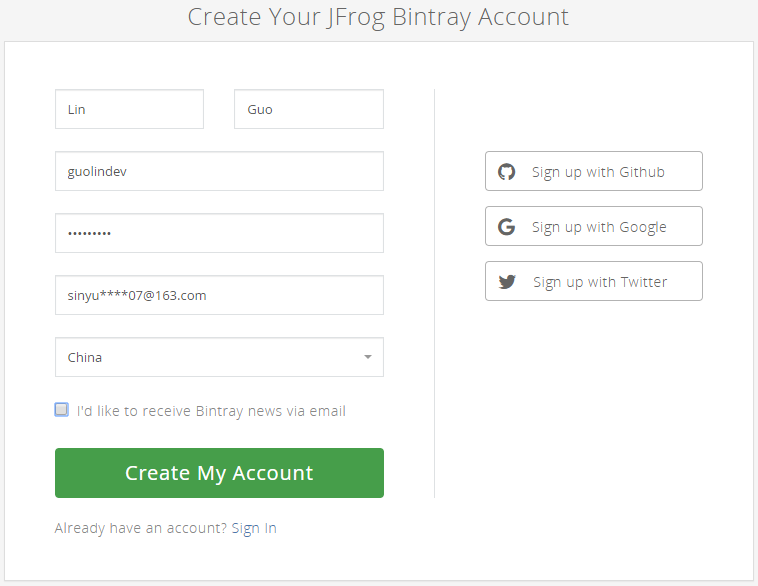

**图 16.12　注册 Bintray 账号**

点击“Create My Account”按钮完成注册，Bintray 会向你填写的邮箱中发送一封邮件，到邮箱中验证一下即可激活账号，然后就可以进入你的 Bintray 主页了，如图 16.13 所示。

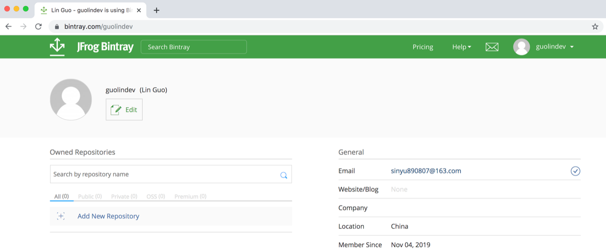

**图 16.13　Bintray 个人主页**

接下来，我们需要点击界面上的“Add New Repository”来创建一个新的仓库，如图 16.14 所示。


**图 16.14　创建新的仓库**

其中仓库的名字可以随便填，仓库的类型要选择“Maven”，开源许可我们选择“Apache-2.0”，然后点击“Create”按钮完成创建。

创建成功后会自动跳转到新创建的仓库主页，如图 16.15 所示。

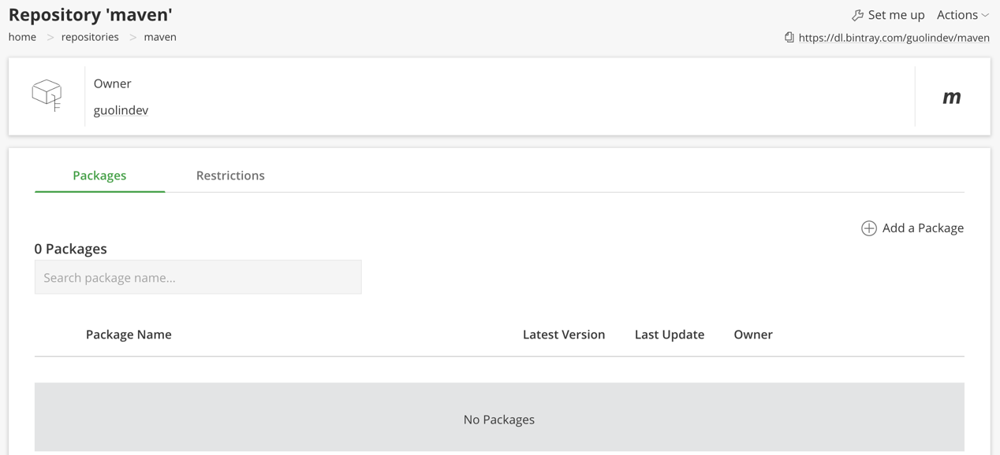

**图 16.15　仓库主页**

这样在 Bintray 上的操作就告一段落了，接下来回到 Android Studio 工程中，我们需要在这里加入将代码发布到 jcenter 仓库的配置。

Bintray 官方提供了一个能够实现此功能的插件，但是我个人认为这个插件使用起来有点复杂，要编写很多的 Gradle 脚本才行，因此这里我们就不使用它了。

我比较推荐使用的是一个由第三方公司开发的插件：bintray-release。它的用法非常简单，只需要配置一些必要的信息就可以实现将代码发布到 jcenter 仓库的功能。bintray-release 的 GitHub 主页地址是：[https://github.com/novoda/bintray-release](https://github.com/novoda/bintray-release)。

由于我们要发布的是 library 模块中的代码，因此打开 library/build.gradle 文件，并在文件的尾部加入如下配置：

```gradle
apply plugin: 'com.novoda.bintray-release'

buildscript {
    repositories {
        jcenter()
    }
    dependencies {
        classpath 'com.novoda:bintray-release:0.9.1'
    }
}
```

这段配置就表示将 bintray-release 插件引入 library 模块中。我在编写本书时，bintray-release 的最新版本是 0.9.1，你可以在它的 GitHub 主页中找到当前的最新版本。

接下来我们还需要在 library/build.gradle 文件中加入一段 publish 闭包来配置一些必要的参数，如下所示：

```gradle
publish {
    userOrg = 'guolindev'
    groupId = 'com.permissionx.guolindev'
    artifactId = 'permissionx'
    publishVersion = '1.0.0'
    desc = 'Make Android runtime permission request easy.'
    website = 'https://github.com/guolindev/PermissionX'
}
```

userOrg 部分填入你的 Bintray 用户名即可。groupId 用于作为组织的唯一标识，通常填入公司的倒排域名，这里我使用了项目的包名。artifactId 用于作为工程的唯一标识，这部分直接填入 permissionx 就可以了，另外你要保证同一 groupId 下不会存在两个相同的 artifactId。publishVersion 表示当前开源库的版本号，我们第一个版本就使用 1.0.0 吧。desc 用于对你的开源库进行一些简单的描述，website 中填入 PermissionX 的版本库主页地址即可。

因此，一个依赖库的引用地址的组成结构应该如下所示：

```Kotlin
'groupId:artifactId:publishVersion'
```

那么根据我们刚才的配置，PermissionX 库的引用地址就应该是：

```Kotlin
'com.permissionx.guolindev:permissionx:1.0.0'
```

注意，上述配置一定要按照你的实际信息去填写，千万不要完全照搬书上的内容，否则可能会出现 id 冲突从而导致发布失败的情况。

这样我们就将 bintray-release 所要求的所有配置信息都填写完成了，接下来可以点击 Android Studio 底部工具栏中的 Terminal 标签，打开 Terminal 窗口，如图 16.16 所示。


**图 16.16　创建新的软件包**

在这里输入具体的上传命令，就可以将 PermissionX 库上传到我们刚刚创建的 maven 仓库中。

如果你使用的是 Windows 系统，执行如下命令：

```powershell
gradlew clean build bintrayUpload -PbintrayUser=USER -PbintrayKey=KEY -PdryRun=false
```

如果你使用的是 Mac 或 Ubuntu 系统，执行如下命令：

```powershell
./gradlew clean build bintrayUpload -PbintrayUser=USER -PbintrayKey=KEY -PdryRun=false
```

其中，`USER` 部分要替换成你的 Bintray 用户名，`KEY` 部分要替换成你的 Bintray API Key。那么这个 API Key 是什么呢？我们可以通过点击 Bintray 网站顶部的用户名 →Edit Profile→API Key 来进行查看，如图 16.17 所示。

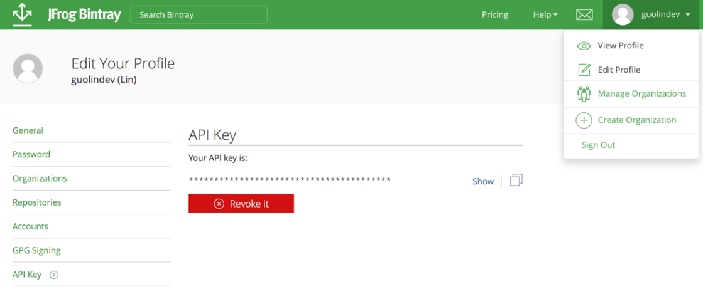

**图 16.17　查看 API Key**

注意，这个 API Key 一定要保护好，这属于隐私型数据，千万不要把它添加到版本控制中。

执行完上述命令，即可完成 PermissionX 库的上传工作。现在刷新一下我们刚才创建的仓库主页，结果如图 16.18 所示。

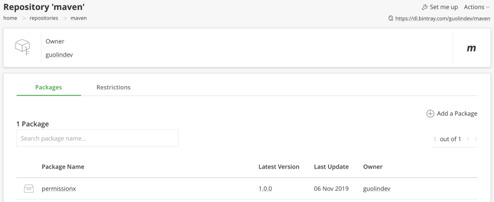

**图 16.18　刷新后的仓库主页**

可以看到，刚刚上传的 PermissionX 库已经显示在仓库主页中了。现在，我们离将它发布到 jcenter 仓库还差最后一步。点击进入 PermissionX 库的详情界面，该界面的右上角有一个 Actions 菜单，展开之后会有一个“Add to Jcenter”选项，如图 16.19 所示。

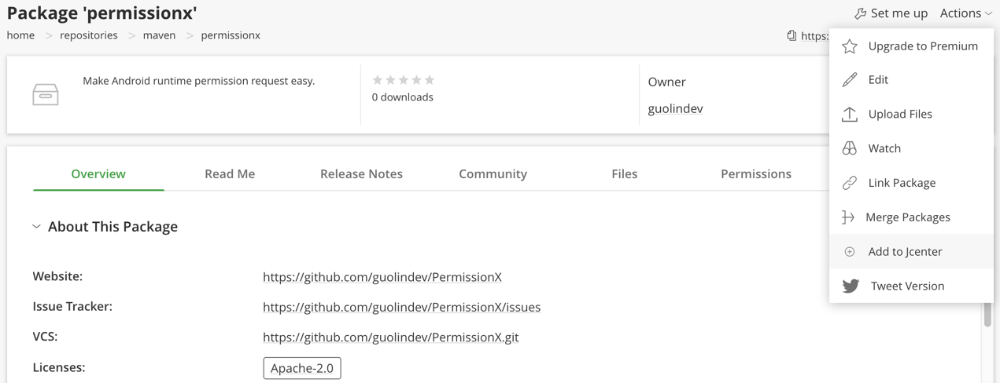

**图 16.19　PermissionX 库的详情界面**

点击“Add to Jcenter”选项即可将 PermissionX 库发布到 jcenter 仓库，但是我们最好在弹出的界面中再对所提交的库进行简单的描述，如图 16.20 所示。


**图 16.20　提交确认页面**

点击“Send”按钮发送提交申请，接下来要做的事情就是等待了。Bintray 的审核速度通常是非常快的，一般几小时内就会通过。审核通过之后你的 Bintray 账号会收到一封如图 16.21 所示的邮件。


**图 16.21　收到审核通过的邮件**

当收到这封邮件时，就说明你已经成功将库发布到 jcenter 仓库中了。

## 16.5　体验我们的成果

现在，PermissionX 已经可以像 Retrofit、Glide 等其他开源库那样，通过添加一行库的引用地址就可以引入到任何 Android 项目工程中，那么我们自然要来体验一下了。

这里我新建了一个 PermissionXTest 项目，使它和原来的 PermissionX 项目保持完全独立，然后在 app/build.gradle 文件中添加如下依赖：

```gradle
dependencies {
    ...
    implementation 'com.permissionx.guolindev:permissionx:1.0.0'
}
```

点击“Sync Now”完成同步之后，我们就可以在代码中调用 PermissionX 的 API 了。修改 MainActivity 中的代码，如下所示：

```Kotlin
class MainActivity : AppCompatActivity() {

    override fun onCreate(savedInstanceState: Bundle?) {
        super.onCreate(savedInstanceState)
        setContentView(R.layout.activity_main)
        PermissionX.request(this,
            Manifest.permission.CALL_PHONE,
            Manifest.permission.READ_CONTACTS) { allGranted, deniedList ->
            if (allGranted) {
                Toast.makeText(this, "All permissions are granted",
                    Toast.LENGTH_SHORT).show()
            } else {
                Toast.makeText(this, "You denied $deniedList",
                    Toast.LENGTH_SHORT).show()
            }
        }
    }
}
```

可以看到，这里我们一次性申请了两个运行时权限，那么就得将这两个权限都配置到 AndroidManifest.xml 中才行，如下所示：

```xml
<manifest xmlns:android="http://schemas.android.com/apk/res/android"
    package="com.example.permissionxtest">

    <uses-permission android:name="android.permission.CALL_PHONE" />
    <uses-permission android:name="android.permission.READ_CONTACTS" />
    ...
</manifest>
```

现在运行一下 PermissionXTest 项目，会立即弹出权限申请对话框，如图 16.22 所示。

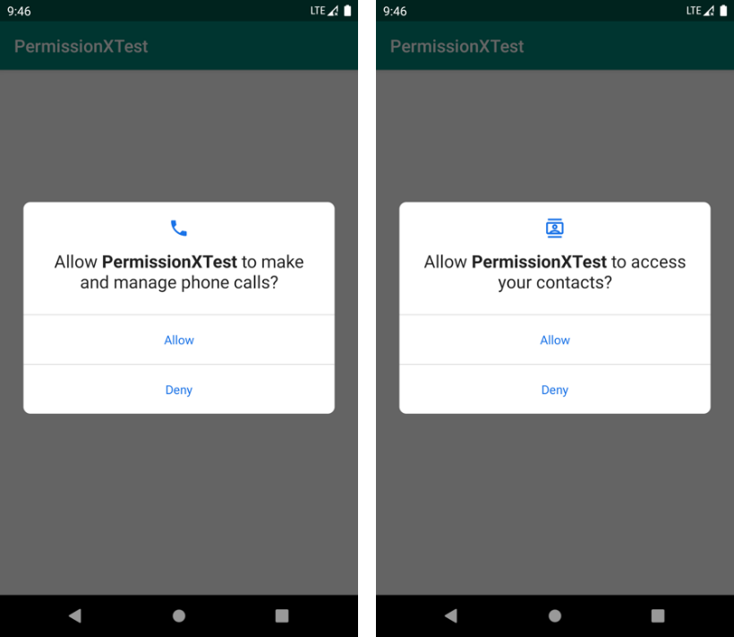

**图 16.22　权限申请对话框**

由于我们一次性申请了两个运行时权限，在授权完第一个权限之后，又会弹出第二个权限申请的对话框。全部授权完成之后才会回调到 `request()` 方法的 Lambda 表达式中，并弹出一条 Toast 提示，如图 16.23 所示。


**图 16.23　监听权限申请的结果**

所有功能都如同我们所预期的那样运行了。

当然，如果你后续发现了一些 bug，或者有任何新功能想要添加到 PermissionX 中，可以随时对库进行更新。更新的方式也非常简单，只需要升级 publish 闭包中的版本号即可，如下所示：

```gradle
publish {
    userOrg = 'guolindev'
    groupId = 'com.permissionx.guolindev'
    artifactId = 'permissionx'
    publishVersion = '1.0.1'
    desc = 'Make Android runtime permission request easy.'
    website = 'https://github.com/guolindev/PermissionX'
}
```

这里我要解释一下，版本号通常以 3 位数字的格式居多。其中，如果是一些 bug 的修复或者是小功能的修改，应该升级最后一位版本号。而如果是一些比较大的功能或 API 变更，则应该升级中间一位版本号。只有涉及非常大的功能变更甚至是整体架构的改变时，才应该升级第一位版本号。

升级完版本号之后，只需要重新执行上一节中使用过的发布命令，就可以将新版的库发布到 jcenter 仓库中了。

最后，我们还需要对 PermissionX 的 GitHub 主页进行更新，介绍一下 PermissionX 的基本用法才行，不然别的开发者将无从得知该如何使用我们的开源库。GitHub 中开源库主页的介绍是使用 MarkDown 语法编写的，关于这种语法，我在这里就不做太多说明了，因为最常用的其实也就是几个简单的标签而已，至于完整的 MarkDown 语法格式，你可以参考：[https://guides.github.com/features/mastering-markdown](https://guides.github.com/features/mastering-markdown)。

那么，现在打开 PermissionX 工程目录下的 README.md 文件，并使用如图 16.24 所示的语法格式编写一段非常简单的用法说明。


**图 16.24　编写 PermissionX 的用法说明**

注意，我们应该将所有的代码都放到一对 ````` 标签中，并且在开始的 ````` 标签后面加上代码所使用的语言类型。这样 GitHub 将会根据相应语言的语法，自动对一些关键字进行高亮显示，从而让文档中的代码看起来更加美观，也更加适合阅读。

现在将 README.md 文件提交并同步到 GitHub 远程仓库上。

```bash
git add .
git commit -m "编写PermissionX的用法说明。"
git push origin master
```

然后刷新一下 PermissionX 的 GitHub 主页，现在就可以看到我们刚刚编写的 PermissionX 用法说明了，如图 16.25 所示。

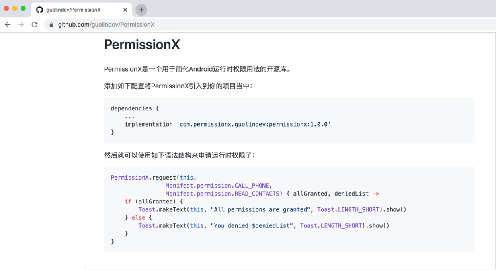

**图 16.25　编写 PermissionX 的用法说明**

到这里，本章的内容就全部结束了。在本章中，我们动手编写了一个开源库，并成功将它发布到了 jcenter 仓库，这样任何开发者都可以在自己的项目中集成我们编写的开源库，从而让项目的开发变得更加简单。希望你在充分掌握了本章内容之后，也能够为 Android 开源社区贡献一份力量，开发出一些更加优秀的开源库，让 Android 的开源环境变得越来越好。

最后要说明的是，我在本章中着重讲解的是编写与发布一个开源库的整体流程，并没有在开源库的实现细节上花太多的篇幅，因此 PermissionX 实际上还是一个功能非常简单的库。后期我对这个库的功能进行了一些扩充与完善，使它成为了一个更加强大的运行时权限库，你可以访问它的 GitHub 主页来查看更多新的用法。

## 16.6　结束语

就这样，本书所有的内容你都学完了！现在你已经成功毕业，并且成为了一名合格的 Android 开发者。但是，如果想要成为一名出色的 Android 开发者，光靠本书中的这些理论知识以及少量的实践还是不够的，你需要真正步入工作岗位中，通过更多的项目实战来不断地历练和提升自己。

唠叨了整本书的话，但是到了最后却不知道该说点什么好。我不想说我能教你的就只有这些了，因为实际上我想教你或者和你一起探讨的内容还有很多，不过限于篇幅的原因，本书的内容就只能到此为止了。但我会长期在博客和微信公众号上面分享更多 Android 相关的技术文章，你如果感兴趣的话，可以到我的博客和公众号中继续学习。当然，如果是对本书中的内容有疑问，可以给我留言，博客地址和微信公众号见封面。

好了，就到这里吧，祝愿你未来的 Android 之旅都能愉快。